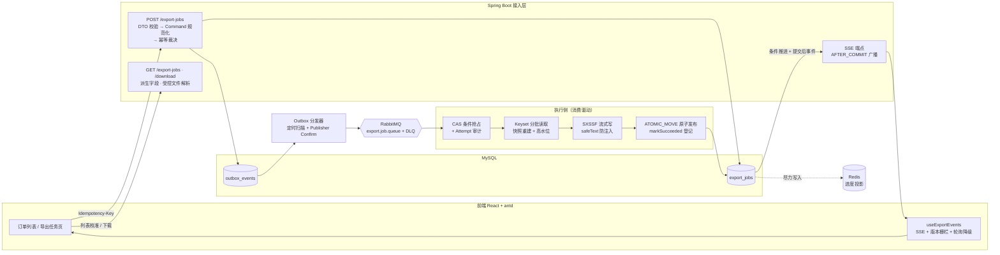
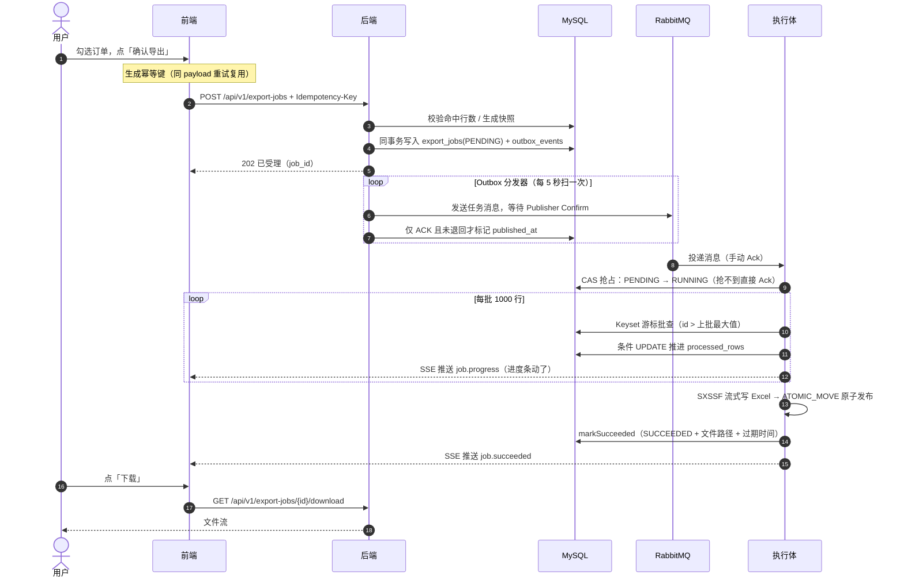
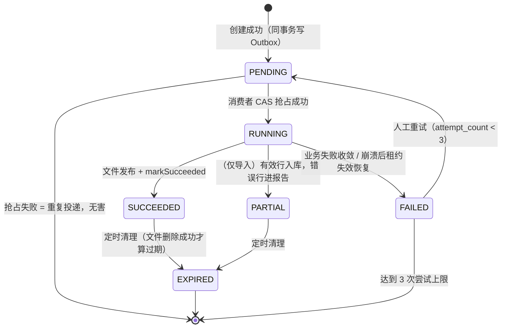

# FlowHub：架构总览

> **代码仓库**：[wychmod/FlowHub](https://github.com/wychmod/FlowHub) —— 企业级异步 Excel 导出与导入中心
> **本章目标**：看清 FlowHub 要解决什么问题、整体怎么分层、任务如何流转，建立全系列的心智模型，再进入逐章复刻。
> **原文对照**：仓库根目录 `README.md` 与 `doc/README.md`（复盘总览），本系列各章与之一一对应。

---

## 目录

- [一、FlowHub 是什么](#一flowhub-是什么)
- [二、为什么「点一个导出按钮」这么难](#二为什么点一个导出按钮这么难)
- [三、全景架构图](#三全景架构图)
- [四、一次导出的完整旅程](#四一次导出的完整旅程)
- [五、任务的一生（状态机）](#五任务的一生状态机)
- [六、沉淀下来的 8 个可靠性模式](#六沉淀下来的-8-个可靠性模式)
- [七、技术选型与理由](#七技术选型与理由)
- [八、工程结构](#八工程结构)
- [九、已知边界](#九已知边界)
- [十、本系列学习路径](#十本系列学习路径)

---

## 一、FlowHub 是什么

一句话：**「点击导出 → 后台慢慢生成 → 实时告诉你进度 → 好了之后安全下载」的异步 Excel 导出中心**，外加一套完全对称的 Excel 批量导入。

| 基本信息 | 说明 |
|---|---|
| 后端 | Java 21 · Spring Boot 3.3.2 · MyBatis · Flyway · Apache POI（SXSSF） |
| 中间件 | MySQL 8（唯一事实源）· RabbitMQ（任务投递）· Redis（进度投影，可降级） |
| 前端 | React 18 · TypeScript · Vite · antd 6 · @tanstack/react-query |
| 端口约定 | 后端 8080 · 前端 5174 |
| 代码仓库 | [github.com/wychmod/FlowHub](https://github.com/wychmod/FlowHub) |

它是一个「把可靠性讲透」的工程演示项目：20 万行确定性演示数据、5 万行导出任务从创建到下载 1.6 MB Excel 全程可复现。

## 二、为什么「点一个导出按钮」这么难

天真做法是：用户点按钮 → 后端当场查库 + 生成 Excel → HTTP 响应里直接返回文件。这条路在生产环境寸步难行：

| 问题 | 后果 |
|---|---|
| 50 万行数据要查几分钟 | 浏览器/网关超时，用户看到报错，其实后端还在白干 |
| 整个 Excel 撑在内存里 | 几百个并发导出直接把 JVM 撑爆（OOM） |
| 用户等不到就疯狂点按钮 | 同一份数据被导出 10 次，浪费 10 倍资源 |
| 生成到一半服务重启 | 半个 Excel 被下载走，或任务永远卡在「处理中」 |
| 进度完全不可见 | 用户不知道是卡了还是在跑，只能刷新/猜 |

FlowHub 的答案是：**把「导出」从一个 HTTP 请求，变成一个有状态、可追踪、可恢复的异步任务**。

```text
点导出 → 秒回「已受理」→ 后台任务队列慢慢生成 → 实时推送进度条
→ 完成后通知你 → 从任务列表安全下载，过期自动清理
```

导入是同一个问题的反向版本：上传 10 万行的 Excel 同样不能同步做完，还要额外解决「有 300 行填错了怎么办」——答案是 **PARTIAL 部分成功 + 可下载的错误报告**。

## 三、全景架构图



**三层状态设计**的核心思想：MySQL 是唯一事实源；Redis 是可丢弃的投影（写失败仅记日志）；SSE 是实时通知（事务提交成功后才广播）。每一层都允许失败，失败只降级、不污染事实。

## 四、一次导出的完整旅程

以「勾选 5 万条订单 → 导出 → 下载」为例：



三个值得驻足的瞬间：

- **第 5 步「同事务双写」**：任务记录和「要执行它」的消息在同一个数据库事务里落库——这就是事务性 Outbox，保证不会出现「任务创建了但永远没人执行」；
- **「CAS 抢占」**：消息可能重复投递、多实例可能同时消费，谁用条件 UPDATE 抢到状态位谁执行——重复投递被收敛为最多一次有效执行；
- **「原子发布」**：Excel 先写成 `.tmp` 临时文件，全部写完落盘后才原子改名为正式文件——不存在「下载到半个 Excel」。

## 五、任务的一生（状态机）



设计要点：

- **所有状态迁移都是条件 UPDATE（CAS）**，并发下谁抢到谁生效，天然防重复；
- **FAILED → PENDING 只能人工重试**，不自动重跑——故障时刻自动重跑可能放大事故，把决策留给人；
- **每一次执行都留下 Attempt 审计行**，任务失败能查清「哪一次、为什么、跑了多久」；
- **「删除成功才 EXPIRED」**：文件还在磁盘上就不算过期——状态永远跟随物理事实。

## 六、沉淀下来的 8 个可靠性模式

每个「生产事故传闻」背后都有一个对应的工程解法：

| # | 事故剧本 | 解法 | 关键词 | 本系列章节 |
|---|---|---|---|---|
| 1 | 用户手抖点了两下导出 | 幂等键 + 规范化 request hash：相同请求复用任务，不同请求 409 | `Idempotency-Key` | [03](03-导出任务创建与幂等.md) |
| 2 | 库写成功、消息没发出去，任务永远没人执行 | 事务性 Outbox：消息和业务同事务落库，分发器扫表补发 | Outbox 模式 | [04](04-可靠投递-Outbox与消费.md) |
| 3 | 消息重复投递 / 多实例同时消费 | CAS 条件抢占 + Attempt 审计 | 抢单语义 | [04](04-可靠投递-Outbox与消费.md) |
| 4 | 50 万行导出把内存打爆 | Keyset 游标批查 + SXSSF 滑动窗口，创建时定格高水位 | 流式处理 | [05](05-导出执行与Excel生成.md) |
| 5 | 用户下载到写了一半的文件 | `.tmp` → `ATOMIC_MOVE` 原子发布 → 登记成功才算存在 | 原子发布 | [05](05-导出执行与Excel生成.md) |
| 6 | 服务重启后任务永远卡在 RUNNING | 心跳 + 租约：租约过期的 RUNNING 在启动恢复时收敛为 FAILED | 租约机制 | [08](08-恢复与清理.md) |
| 7 | 半成品/孤儿文件泄漏磁盘 | 「删除成功才 EXPIRED」+ 孤儿三维对账 | 对账清理 | [08](08-恢复与清理.md) |
| 8 | 恶意文件名 / 路径穿越读走任意文件 | 受控根目录 + 路径双层防腐 | 路径防腐 | [07](07-文件安全与下载.md) |

## 七、技术选型与理由

| 层 | 选型 | 为什么是它 |
|---|---|---|
| 后端 | Java 21 + Spring Boot 3.3 | 生态最全，经典并发模型足够演示 |
| 持久层 | MyBatis（XML 动态 SQL） | 筛选条件动态拼装，比 JPA 更直观可控；`criteriaConditions` 片段被查询与导出执行体共享，取数口径永远一致 |
| 迁移 | Flyway | 表结构演进有版本号、可追溯（V1~V9） |
| 消息队列 | RabbitMQ + Publisher Confirm | 「发送方确认 + 手动 Ack」最容易讲清楚可靠性 |
| 缓存 | Redis | 只做可丢弃的进度投影，挂了不影响正确性 |
| 实时通知 | SSE（而非 WebSocket） | 单向推送够用；HTTP 原生、断线重连语义简单 |
| Excel 写 | POI SXSSF（滑动窗口 100） | 写 50 万行内存不涨 |
| Excel 读 | POI SAX（事件流） | 10 万行文件不全量加载 DOM |
| 前端 | React 18 + TS + antd 6 + react-query 5 | 服务端分页/缓存失效语义成熟 |
| E2E | Playwright（真实 Chrome） | 全链路守门：页面 → SSE → 下载 → 数据核对 |

## 八、工程结构

后端按「横切 Web 基础设施 + 垂直自治业务模块」组织，前端按「API 防腐层 + feature」组织：

```text
FlowHub/
├── start.bat                     # Windows 一键启动（后端 8080 + 前端 5174）
├── docker-compose.yml            # RabbitMQ / Redis 编排
├── backend/
│   └── src/main/java/com/example/flowhub/
│       ├── common/web/           # 横切基础设施（Envelope/异常/trace_id/参数工具）
│       ├── order/                # 订单查询模块
│       ├── export/               # 导出任务模块（受理/Outbox/执行/进度/文件/恢复）
│       └── orderimport/          # 订单导入模块（与导出对称的完整垂直模块）
└── frontend/src/
    ├── api/                      # 防腐层（Envelope 解包 / ApiError / 下载协议）
    ├── app/                      # 布局壳层（Sider + 顶栏 + 健康徽标）
    └── features/                 # orders / exports / import-jobs 三页
```

## 九、已知边界

这些是**有意的取舍**——教学项目的价值密度在可靠性模式本身，而非外围设施：

| 边界 | 现状 | 如果要上生产需要 |
|---|---|---|
| 鉴权 | 无登录/权限/任务归属校验 | 接入 SSO，任务挂归属人，下载鉴权 |
| 对象存储 | 文件在本地 `export-files/` 目录 | 换 OSS/S3，下载改预签名 URL |
| 多实例部署 | SSE 广播是进程内连接表，文件在本地盘 | 消息广播 + 共享存储 |
| 前端路由 | 本地状态切页，无 URL 路由 | 引入 React Router |

## 十、本系列学习路径

| 顺序 | 章节 | 你将学会 |
|---|---|---|
| 1 | [公共底座](01-公共底座.md) | 统一 Envelope / 全局异常 / trace_id / 参数防御 |
| 2 | [订单查询模块](02-订单查询模块.md) | 8 项筛选 / 排序白名单 / LIKE 防注入 / 动态 SQL 共享 |
| 3 | [导出任务创建与幂等](03-导出任务创建与幂等.md) | Command 规范化 / 幂等三态裁决 / 同事务双写 |
| 4 | [可靠投递-Outbox与消费](04-可靠投递-Outbox与消费.md) | Outbox / Publisher Confirm / CAS 抢占（全项目最核心） |
| 5 | [导出执行与Excel生成](05-导出执行与Excel生成.md) | Keyset 高水位 / SXSSF 滑动窗口 / 原子发布 |
| 6 | [进度状态与SSE实时通知](06-进度状态与SSE实时通知.md) | 事实源/投影/广播三层 / 版本栅栏 |
| 7 | [文件安全与下载](07-文件安全与下载.md) | 受控根目录 / 路径双层防腐 / 下载协议 |
| 8 | [恢复与清理](08-恢复与清理.md) | 租约 / 启动恢复 / 孤儿三维对账 |
| 9 | [订单Excel导入](09-订单Excel导入.md) | 三层校验 / SAX 流读 / PARTIAL 部分成功 |
| 10 | [前端交互层](10-前端交互层.md) | API 防腐层 / 幂等键生命周期 / useExportEvents 状态机 |
| 11 | [测试与质量守门](11-测试与质量守门.md) | H2 集成矩阵 / 前端单测 / Playwright 全链路 E2E |
| 12 | [从0复刻清单](12-从0复刻清单.md) | 阶段划分 / Flyway 演进 / 每阶段验收 / 常见坑汇总 |

---

## 📚 完整资料

- [FlowHub GitHub 仓库](https://github.com/wychmod/FlowHub) —— 源码、快速开始与 API 总览
- [doc/ 复盘文档目录](https://github.com/wychmod/FlowHub/tree/main/doc) —— 11 篇深度复盘原文

## 最新修改记录

| 日期 | 类型 | 说明 |
|---|---|---|
| 2026-09-11 | 新增 | 基于 FlowHub 仓库代码与 doc 复盘文档，建立从 0 复现教程系列并给出架构总览 |

> 📚 完整历史修改记录见 [修改记录归档](/_meta/CHANGELOG_HISTORY.md)。
