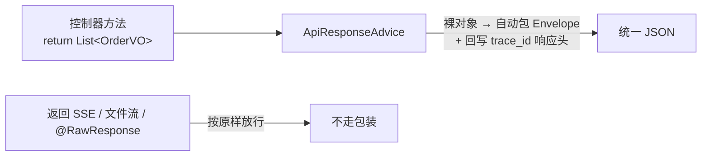
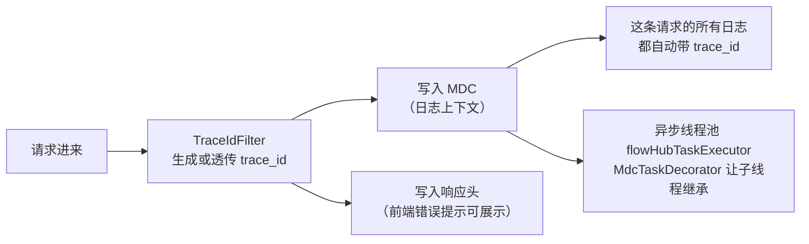

# FlowHub：公共底座

> **代码仓库**：[wychmod/FlowHub](https://github.com/wychmod/FlowHub)
> **代码位置**：`backend/src/main/java/com/example/flowhub/common/web/`
> **本章目标**：从 0 搭出所有接口的地基——统一响应、统一异常、统一链路追踪、统一参数防御，让每个业务模块「生下来就规矩」。
> **原文对照**：仓库 `doc/01-公共底座.md`

---

## 一、为什么第一个模块是底座

没有底座的项目长这样：

- 接口 A 返回 `{data: ...}`，接口 B 返回 `{result: ...}`，接口 C 直接返回裸数组——前端每接一个接口都要问一遍「这回是什么格式」；
- 报错有的返回 500 带堆栈，有的返回 200 带 error 字段——前端没法统一处理；
- 用户说「我刚才操作报错了」，后端翻遍日志对不上是哪次请求。

底座一次性解决这三件事，业务代码只需要写业务。

## 二、统一响应 Envelope

所有 JSON 接口的响应长一个样（`common/web/api/ApiResponse`）：

```json
{
  "code": "OK",
  "message": "success",
  "data": { "...业务数据..." },
  "trace_id": "3f9a2c..."
}
```

字段一律 `snake_case`。业务代码**不用手动包装**——`ApiResponseAdvice`（一个 `ResponseBodyAdvice`）自动把控制器返回的裸对象包进 Envelope：



三个放行规则：已经包装过的不再二次包装；SSE/文件流这类 `Resource` 响应放行；显式标注 `@RawResponse` 的接口放行。

## 三、全局异常出口

`common/web/error/GlobalExceptionHandler` 是**所有异常的唯一出口**：业务代码只管抛，格式化交给它。

| 异常 | HTTP | 表现 |
|---|---|---|
| `BusinessException` + 模块错误码 | 各错误码自映射 | 业务失败的标准姿势，如 409 `IDEMPOTENCY_CONFLICT` |
| Bean Validation 失败 | 400 `VALIDATION_ERROR` | `data.field_errors` 输出「字段路径 → 文案」映射 |
| 请求体 JSON 解析失败 | 400 `VALIDATION_ERROR` | 恶意/畸形请求体不再变 500 |
| multipart 超限/解析失败 | 400 | 见[第 09 章](09-订单Excel导入.md)的上传挂死修复 |
| Accept 头与返回类型不匹配 | 406 `NOT_ACCEPTABLE` | — |

关键决策：**模块自己的错误码不进 common**。`export/error/ExportErrorCode`、`orderimport/error/ImportErrorCode` 各自实现 `ErrorCode` 接口——底座只定协议，不收编业务语义。

## 四、trace_id：一根线串起整次请求



- 每次请求生成（或信任上游透传）一个 `trace_id`，日志、响应头、Envelope 三处同源；
- 业务里用 `@Async` 跑的代码也能继承链路——**新开线程池必须用统一配了 `MdcTaskDecorator` 的 bean**，否则日志断链；
- 排障姿势：用户报错 → 前端展示的 trace_id → `grep trace_id` 一条线拉出全程日志。

## 五、参数处理：空值契约的代码化

`common/web/param/ParamUtils` 把「什么样的参数算没传」写成了代码：

| 工具方法 | 契约 |
|---|---|
| `trimToNull` | null / 空串 / 纯空白 → 统一折叠为 null（null 是唯一合法的「未传」） |
| `splitMultiValue` | `a,b,c` 拆成列表 + trim + 过滤空 token + 去重；拆完为空 = 未传（防 MyBatis 生成 `IN ()` 非法 SQL） |
| `enumFromName` / `parseMultiEnum` | 枚举按常量名大小写不敏感解析；非法值**立即 400，绝不静默忽略** |
| `escapeLike` | 转义 LIKE 通配符 `\` `%` `_`——用户输入永远只是字面量（见[第 02 章](02-订单查询模块.md)） |
| `parseDecimal` / `parseDateTime` / `parsePhone` | 数值/时间/手机号解析，非法统一 400，错误文案带字段名 |

**复用规则**：写通用逻辑前先查 `common/web/` 有没有现成的；没有且预计有第二个消费方，就沉淀进去。

## 六、六条编码约束

全仓库后端代码的强制规范（速查版）：

1. **数据承载类型一律 record**——实体、DTO、VO、值对象全部不可变；
2. **snake_case 入参统一 `@BindParam`**——禁止手写别名 getter 兼容下划线；
3. **各层显式空值防御**——null 是唯一「未传」，空集合不是 null，`BigDecimal` 比较必须 `compareTo`；
4. **注解排版以「单行放不放得下」为界**——放得下横排，放不下每注解一行；
5. **优先复用 `common/web/` 工具**——禁止业务类里私有重写轮子；
6. **注释只说签名看不出来的事**——类 1-3 行，方法 1 行。

## 七、踩坑复盘

### 坑一：别名 getter——为一个下划线欠一身债

早期为了让 `?page_size=20` 能绑定，曾给 DTO 手写 `getPage_size()` 别名方法。结果每个新字段都要写两个 getter，序列化和绑定行为不一致。**教训**：框架能力（Spring 6.1 构造器绑定 + `@BindParam`）能解决的事，不要手写兼容层。

### 坑二：`trimToNull` 私有在业务类里

它最初写在 `OrderService` 里，导出模块也要用时面临「复制还是抽取」。最终抽取为 `ParamUtils.trimToNull`。**教训**：第二个消费方出现前就该预判，「预计存在第二个消费方」直接进 common 并补单测。

### 坑三：上传超限把用户「挂死」而不只是报错

全项目最隐蔽的坑：Spring multipart 默认上限 1MB，超限请求被 Tomcat 中止解析、关闭连接后，客户端「写不完 body 也收不到响应」——无限挂起。

解法分三层：

1. 配置调大 multipart 闸门（`max-file-size: 11MB`，比业务上限 10MB 略宽，让请求能到达业务校验）；
2. `OversizeRequestBodyFilter` 对 `Content-Length` 超限的请求**先把 body 读光（swallow）再回 400**，保证浏览器能写完并收到响应；
3. 配套 `server.tomcat.max-swallow-size: -1`，并用「手工拼 multipart body + 精确 Content-Length」的真实 Tomcat 契约测试钉死行为。

**教训**：防护措施本身可能制造比原问题更糟的故障模式，超限防护要站在「连接是否被优雅关闭」的视角验证。

### 坑四：Windows 控制台一冻结，整个接口就卡死

Windows 下点到控制台窗口进入「快速编辑模式」（选择文本即冻结 stdout），所有写日志的请求线程被同步 Appender 无限期阻塞——接口像断电一样全部超时，而服务明明「活着」。

解法（`logback-spring.xml`）：控制台 Appender 外包一层 `AsyncAppender` + `neverBlock=true`——业务线程只管丢日志进队列，队列满了丢日志保请求。配套：测试环境用 `logback-test.xml` 保留**同步**日志（多个测试断言日志内容，异步引入时序竞态）。

**教训**：「服务健康」不等于「服务可用」；测试环境的日志配置要与生产有意分叉，并注释说明原因。

## 八、验收清单

- Envelope 包装/放行规则、`field_errors` 结构：控制器层集成测试覆盖；
- `ParamUtils` 各解析方法：单测覆盖 null/空白/空集合/非法值边界（空值契约的用例是必选项）；
- `OversizeRequestBodyFilter`：单测 + 真实 Tomcat 契约测试双保险。

---

## 📚 完整资料

- [FlowHub GitHub 仓库](https://github.com/wychmod/FlowHub)
- [原文复盘：doc/01-公共底座.md](https://github.com/wychmod/FlowHub/blob/main/doc/01-公共底座.md)

## 最新修改记录

| 日期 | 类型 | 说明 |
|---|---|---|
| 2026-09-11 | 新增 | 从 0 复现教程：统一 Envelope、全局异常、trace_id、参数防御与四大踩坑 |

> 📚 完整历史修改记录见 [修改记录归档](/_meta/CHANGELOG_HISTORY.md)。
