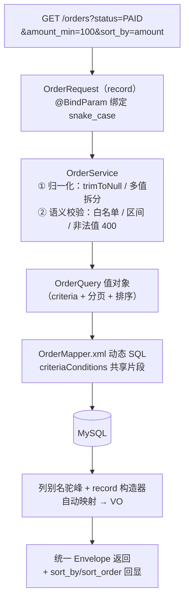
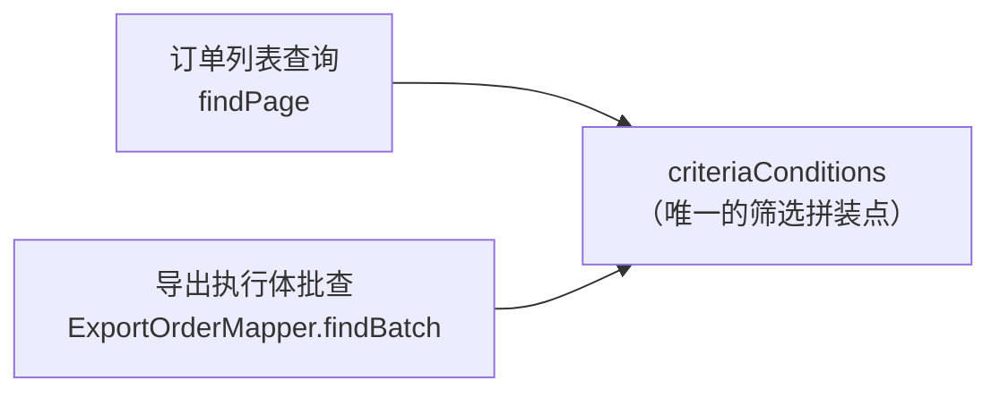

# FlowHub：订单查询模块

> **代码仓库**：[wychmod/FlowHub](https://github.com/wychmod/FlowHub)
> **代码位置**：`backend/src/main/java/com/example/flowhub/order/`（`controller/dto/service/mapper/entity/vo/query` 分层）
> **接口**：`GET /api/v1/orders`
> **本章目标**：写一个「8 项条件随便组合 + 白名单排序 + 服务端分页」的订单列表接口——重点全在**安全**（防注入）和**语义**（空值/排序契约）上。它同时是导出模块的取数地基。
> **原文对照**：仓库 `doc/02-订单查询.md`

---

## 一、功能速览

| 能力 | 说明 |
|---|---|
| 条件筛选 | 8 项：订单号、订单状态、渠道、客户名、客户手机号、金额区间、下单时间区间等，可任意组合 |
| 排序 | 白名单字段（订单号/金额/下单时间）× 升降序，响应**回显实际生效排序** |
| 分页 | 服务端分页，`page` + `page_size`，默认值在 DTO 紧凑构造器兜底 |
| 数据 | 真实 MyBatis + MySQL 持久化；测试环境由 `TestOrderDataSeeder` 灌入与演示脚本同口径的数据 |

## 二、一次查询的旅程



分层一句话总结：**Controller 收参 → DTO 承载 → Service 归一化与校验 → Query 值对象 → Mapper 拼 SQL**。参数从「HTTP 字符串」到「类型化查询对象」的翻译全部集中在 Service。

## 三、三个关键设计决策

### 决策一：LIKE 防注入——用户输入永远不是查询模式

客户名、订单号走模糊查询。若直接拼接，用户输入 `%` 或 `_` 会被当成 LIKE 通配符——轻则查询结果不符预期，重则构造全表扫：

```java
// ParamUtils.escapeLike：把用户输入里的 \ % _ 全部转义
// SQL 侧默认转义符 \，MySQL 与 H2 行为一致
AND customer_name LIKE CONCAT('%', #{escapedKeyword}, '%')
```

注意这是**通配符注入**（结果被操纵），不是 SQL 注入（`#{}` 预编译已防）；两层防御各管各的，缺一不可。

### 决策二：排序白名单 + 「依附」语义

排序字段绝不允许自由字符串进 SQL（ORDER BY 无法预编译）：

- `SortField` 白名单枚举（订单号/金额/下单时间），`sort_by` 不在名单内 → 400；
- 微妙规则：`sort_order` **依附于** `sort_by`——只传 `sort_by=amount` 用该字段默认方向兜底；只传 `sort_order=DESC`（脱离字段单独出现）→ **400**；
- 响应回显 `sort_by` / `sort_order` 实际生效值——前端表格的排序箭头永远和数据库真实行为一致，不靠前端猜。

### 决策三：动态 SQL 片段全仓库共享

筛选条件拼装集中在 `OrderMapper.xml` 的 `criteriaConditions` 片段：



订单页看到的筛选结果和导出文件里的内容**必然一致**——因为两处是同一段 SQL。这是「导出 = 所见即所得」的根基（见[第 05 章](05-导出执行与Excel生成.md)）。

## 四、空值契约的落地示例

这条查询接口是全仓库空值防御的模板：

| 输入 | 行为 |
|---|---|
| `status` 不传 / 空串 / `"  "` | 折叠为 null = 不筛选 |
| `status=PAID,SHIPPED` | 逗号拆分多值，`IN` 查询 |
| `status=PAID,,SHIPPED` | 过滤空 token，等价于上一行 |
| `status=NOT_A_STATUS` | **400 `VALIDATION_ERROR`**，绝不静默忽略 |
| `amount_min=100`（区间单端） | 只有下界，正常生效 |
| `amount_min=abc` | 400，文案含字段名 |

单测必须覆盖「全条件为 null / 空白串 / 空集合 / 区间单端」四类用例。

## 五、踩坑复盘

### 坑：别名 getter 的诞生地

`page_size` 这类下划线参数最早就是在这个接口上用「手写 `getPage_size()` 别名」解决的，后来成为全仓库警示反例。正解是 record + `@BindParam`，Bean Validation 注解直接标在 record 组件上（见[第 01 章](01-公共底座.md)坑一）。

## 六、验收清单

- `OrderControllerTest`：接口层行为（参数校验、排序回显、错误码）；
- 内存实现与 MyBatis 实现的**行为对齐测试**：同一组查询两套实现结果必须一致（防止动态 SQL 拼装与语义层各说各话）；
- H2（MySQL 兼容模式）+ `TestOrderDataSeeder` 确定性数据。

## 七、遗留与改进

- 筛选选项（状态/渠道）目前后端白名单 + 前端常量两处维护，可考虑由后端下发字典接口；
- 深分页走 `LIMIT offset`，数据量再上一个量级时可换 Keyset 分页（与导出执行体同思路）。

---

## 📚 完整资料

- [FlowHub GitHub 仓库](https://github.com/wychmod/FlowHub)
- [原文复盘：doc/02-订单查询.md](https://github.com/wychmod/FlowHub/blob/main/doc/02-订单查询.md)

## 最新修改记录

| 日期 | 类型 | 说明 |
|---|---|---|
| 2026-09-11 | 新增 | 从 0 复现教程：筛选/排序/分页语义、LIKE 防注入与动态 SQL 共享片段 |

> 📚 完整历史修改记录见 [修改记录归档](/_meta/CHANGELOG_HISTORY.md)。
