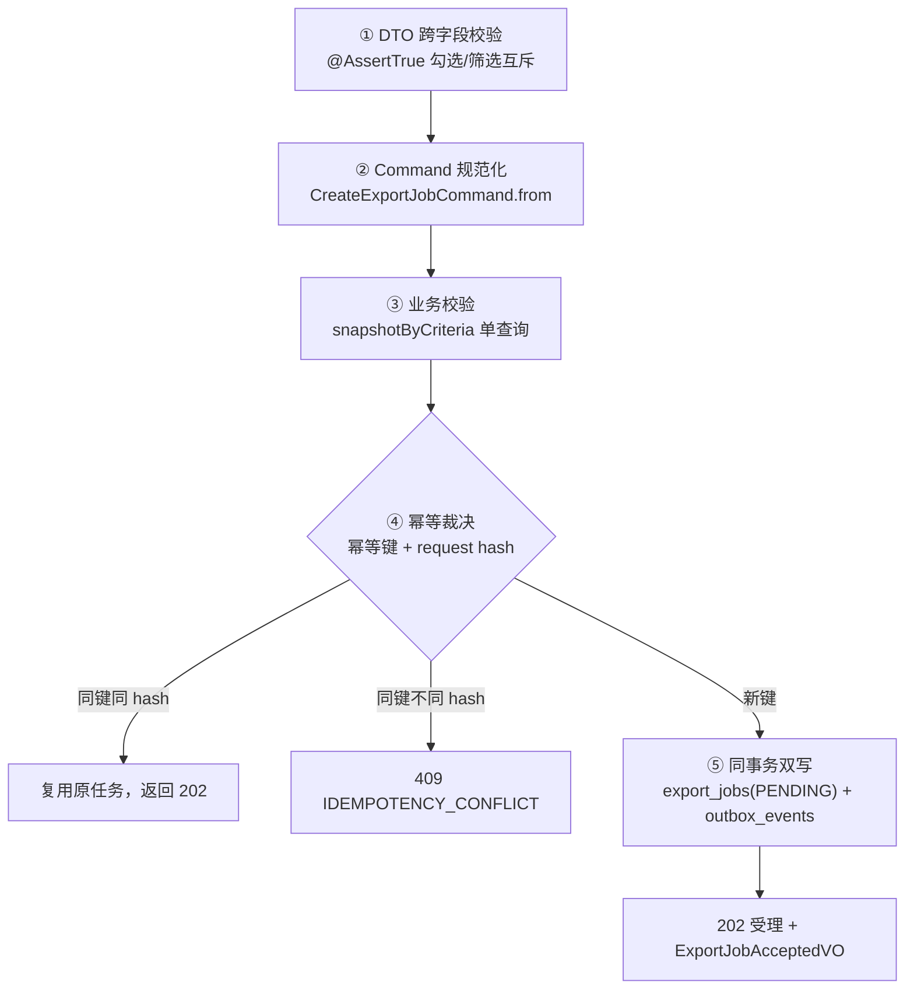

# FlowHub：导出任务创建与幂等

> **代码仓库**：[wychmod/FlowHub](https://github.com/wychmod/FlowHub)
> **代码位置**：`export/controller/ExportJobController` + `export/dto/` + `export/command/` + `export/service/ExportJobService`
> **接口**：`POST /api/v1/export-jobs`（响应 202，任务异步执行）
> **本章目标**：写好创建导出任务的入口——先「规范化」请求，再验「数据够不够导」，最后靠幂等键裁决「这次点击和上次是不是同一件事」，让用户的「手抖」无害。
> **原文对照**：仓库 `doc/03-导出任务创建与幂等.md`

---

## 一、接口契约速览

两种导出模式（`@AssertTrue` 保证互斥）：

| 模式 | 参数 | 校验 |
|---|---|---|
| 勾选导出 `SELECTED_IDS` | 订单 id 列表（上限 1000） | 0 行命中 → `EXPORT_SELECTION_EMPTY` |
| 筛选导出 `FILTER` | 与订单页完全一致的筛选条件快照 | 0 行命中 → `EXPORT_FILTER_ZERO_ROWS`；超上限（默认 50 万）→ `EXPORT_FILTER_TOO_MANY_ROWS` |

请求头必须带 `Idempotency-Key`（前端生成，见[第 10 章](10-前端交互层.md)），请求体带 9 列导出列白名单 + 文件名。

## 二、创建链路：五步走

### ① DTO 校验

record + `@JsonProperty` snake_case 绑定，`@Size(max=1000)` 管勾选上限，`@AssertTrue` 管模式互斥——非法请求在进业务逻辑前就被打回。

### ② Command 规范化（幂等的前提）

`CreateExportJobCommand.from` 把「人类随便写的请求」变成「规范形态」：

- 勾选 ID：剔空 → 去重 → 排序（`[3,1,2]` 和 `[1,2,3]` 是同一请求）；
- 导出列：9 列白名单校验，按白名单序输出（列顺序不同的请求也算同一请求）；
- 文件名：清理路径分隔符等非法字符；
- 筛选快照：复用订单模块的白名单解析成 `OrderCriteria`。

然后对规范形态算 **SHA-256 = request_hash**。规范化是幂等判断公正性的基础：不规范化，用户换个字段顺序就会被误判成「不同的导出」。

### ③ 业务校验一箭双雕

`ExportOrderMapper.snapshotByCriteria` 用**一条 SQL** 同时返回：

- `COUNT`：命中行数（0 行/超上限的判定依据）；
- `MAX(id)`：高水位 `max_order_id_at_create`——「快照定格」，创建之后新下的订单不属于这次导出（见[第 05 章](05-导出执行与Excel生成.md)）。

### ④ 幂等裁决表

| 情况 | 判定 | 结果 |
|---|---|---|
| 幂等键没见过 | 新任务 | 落库，202 |
| 幂等键见过，request hash 相同 | 同一件事 | 复用原任务，202（**不重复执行**） |
| 幂等键见过，request hash 不同 | 键被复用于不同请求 | 409 `IDEMPOTENCY_CONFLICT` |
| 并发同键双请求同时落库 | 数据库唯一约束裁决 | 赢者创建，输者降级为复用/冲突判定 |

### ⑤ 同事务双写

`@Transactional` 里同时 INSERT：

- `export_jobs` 一行（PENDING，含筛选快照/列/文件名/hash）；
- `outbox_events` 一行（「请执行这个任务」的消息，含 trace_id）。

这是整个异步链路的**原子起点**：要么都成，要么都不存在——不可能出现「有任务但没人执行」。实现细节：job 实体是 record（无 setter），INSERT 不用 `useGeneratedKeys`，job_id 由幂等键唯一查询取回。

## 三、踩坑复盘

### 坑：并发同键——应用层判重挡不住两个同时到达的请求

先查后插（check-then-act）在并发下有窗口：两个请求都查到「键不存在」，然后都尝试插入。最终裁决权必须交给数据库唯一约束 `uk_export_jobs_idempotency_key`——胜者正常创建，败者捕获唯一键冲突后**降级重查**，按 hash 一致与否走复用或 409。专门有 `ExportJobIdempotencyConcurrencyTest` 并发用例钉住这个行为。

**教训**：任何「先查再插」的幂等设计，都默认它会被并发击穿，兜底只能是数据库约束。

## 四、验收清单

- 创建链路集成测试：互斥校验、0 行/超上限错误码、202 契约；
- 幂等三态：复用 / 409 / 并发唯一键裁决；
- 列表接口 `ExportJobListTest` 9 用例（空表/倒序分页/状态过滤/派生字段）。

## 五、遗留与改进

- 幂等键目前无过期语义（键永久唯一）；生产可考虑按业务单号天然幂等或键 + TTL；
- 勾选导出的 1000 上限适配交互层勾选能力，「全选 5 万行」应走筛选导出模式。

---

## 📚 完整资料

- [FlowHub GitHub 仓库](https://github.com/wychmod/FlowHub)
- [原文复盘：doc/03-导出任务创建与幂等.md](https://github.com/wychmod/FlowHub/blob/main/doc/03-导出任务创建与幂等.md)

## 最新修改记录

| 日期 | 类型 | 说明 |
|---|---|---|
| 2026-09-11 | 新增 | 从 0 复现教程：Command 规范化、幂等三态裁决、同事务双写与并发唯一约束兜底 |

> 📚 完整历史修改记录见 [修改记录归档](/_meta/CHANGELOG_HISTORY.md)。
