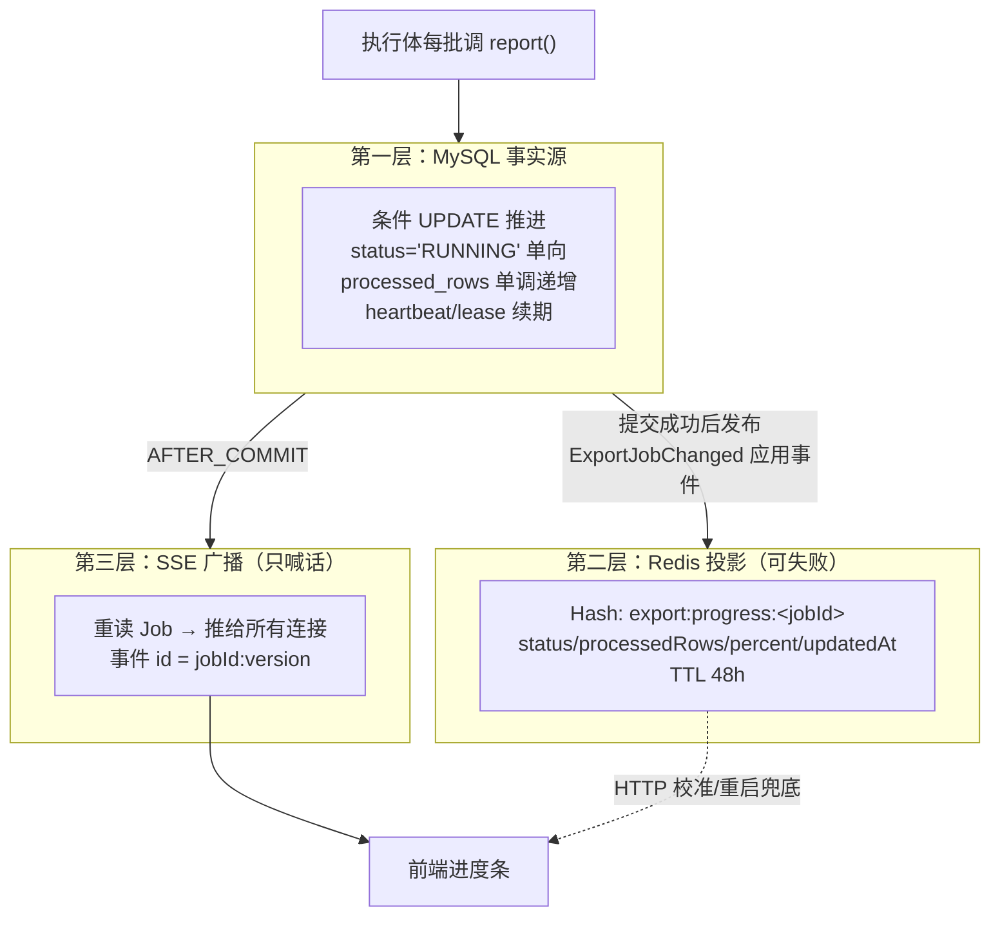
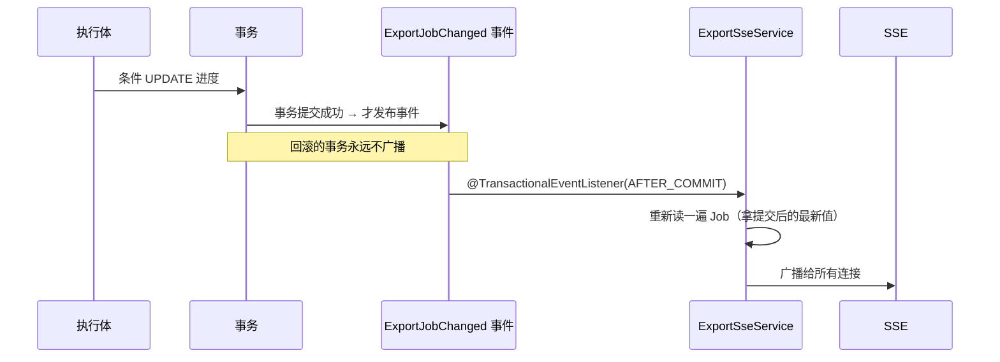

# FlowHub：进度状态与SSE实时通知

> **代码仓库**：[wychmod/FlowHub](https://github.com/wychmod/FlowHub)
> **代码位置**：`export/service/ExportProgressService` + `ExportSseService` + `export/event/`
> **端点**：`GET /api/v1/export-jobs/events`（4 类事件：`job.progress` / `job.succeeded` / `job.failed` / `heartbeat`）
> **本章目标**：搞懂进度条为什么永远是对的——因为 MySQL 记事实、Redis 存投影、SSE 只管喊话，三层允许各自失败而不互相污染。
> **原文对照**：仓库 `doc/06-进度状态与SSE实时通知.md`

---

## 一、三层架构总览



**类比**：MySQL 是账本（一笔都不能错），Redis 是贴在墙上的便签（为了不用每次翻账本，丢了就重抄一份），SSE 是拿喇叭喊话（只负责及时，不负责记账）。

## 二、第一层：条件 UPDATE——进度推进的三道闸

`ExportProgressService.report` 的 UPDATE 语句自带三道闸门：

```sql
UPDATE export_jobs
SET processed_rows = #{new}, last_heartbeat_at = ..., lease_expires_at = ...
WHERE id = #{jobId}
  AND status = 'RUNNING'              -- 闸门①：终态单向，SUCCEEDED 后进度死了就是死了
  AND processed_rows <= #{new}        -- 闸门②：单调递增，迟到的旧进度回不去
  -- 闸门③：顺路续期 heartbeat/lease（执行体还活着的证据）
```

**影响行数 = 0 时 fail-fast 抛异常**——可能意味着任务已被收敛终态或执行体已失联，让调用方走失败收敛，绝不带着过期租约继续跑。

为什么要这么严？因为执行体可能重复（重试窗口）、可能乱序、可能崩溃后再起——**进度推进本身必须是幂等且单向的**，否则进度条会跳舞。

顺路完成的另一件事：租约续期。每次报进度都是一次「我还活着」的心跳，租约机制详见[第 08 章](08-恢复与清理.md)。

## 三、第二层：Redis 投影——故意让它可以失败

`export:progress:<jobId>` 一个 Hash 存五样东西（status/processedRows/totalRows/percent/updatedAt），TTL 48 小时。它的定位是**读加速 + 跨重启兜底**，所以：

- 写失败只记 `redis_progress_write_failed` 日志，**应用照常运行**（与 rabbit 组件同款降级哲学）；
- percent 有个诚实的封顶：**RUNNING 阶段最多显示 99%**，只有 `markSucceeded` 落库后才允许 100%——「进度 100% 但文件还没发布」是最伤信任的谎言；
- 投影与事实不一致没关系：它只是缓存，事实永远以 MySQL 为准。

## 四、第三层：SSE 广播——提交之后才喊话

### 为什么是 AFTER_COMMIT

如果事件在事务提交**前**发布：消息喊出去了，事务却回滚了——前端看到了一条永远不会发生的状态。所以：



两个细节：

- **发送前重读 Job**：事务内持有的对象可能是旧快照，AFTER_COMMIT 后重新查库拿到的是提交后的真值；
- `fallbackExecution=true`：个别无事务调用路径也能触发广播，不至于静默丢事件。

### SSE 端点设计

- 事件分类清晰：进度 / 成功 / 失败 / 心跳。**失败终态显式携带 error 字段**，进度/成功事件则省略——payload 语义不模糊；
- 事件 id = `jobId:version`：version 随每次条件更新递增，前端据此做**版本栅栏**——乱序到达的旧事件直接丢弃（前端实现见[第 10 章](10-前端交互层.md)）；
- 心跳 15s 一拍：既保活连接，也让前端能区分「没进度」和「断线了」；
- 连接表是进程内的：写失败的连接立刻移除（防泄漏），旁路异常与主流程隔离（这个坑在[第 04 章](04-可靠投递-Outbox与消费.md)踩过）。

## 五、前端怎么消费（导读）

前端 `useExportEvents` Hook 实现了完整的「混合实时状态同步」：

```text
SSE 在线  → 收事件就乐观更新对应行（按 jobId 定点，按 version 栅栏去乱序）
SSE 断线  → 指数退避重连；期间有 PENDING/RUNNING 任务则降级为 3s 轮询
页面回前台 → 立即 HTTP 校准一遍（SSE 可能漏推）
```

为什么需要「校准」？SSE 是尽力而为的推送（连接可能在中途建立、可能丢包）——**推送负责及时，HTTP 负责正确**，二者配合才是完整方案。机制细节见[第 10 章](10-前端交互层.md)。

## 六、验收清单

- `ExportProgressSseIntegrationTest` 8 用例：进度守卫矩阵（终态后拒绝推进 / 单调性 / fail-fast）、AFTER_COMMIT 时序（回滚不广播）、坏连接隔离；
- `ExportJobEventPayloadTest` 6 用例：payload 字段契约（错误字段只出现在失败终态等）；
- 导入侧 `ImportProgressSseIntegrationTest` 对称覆盖 5 类事件。

## 七、遗留与改进

- SSE 连接表进程内——多实例部署需要跨实例 fanout（Redis Pub/Sub 或 MQ 广播）；
- 目前事件只推「有变化的 jobId」，前端再查详情；可演进为事件直接携带完整 payload 减少回查；
- 心跳与重连参数可配置（`export.sse.heartbeat-ms` 已有），重连退避策略目前固定在前端。

---

## 📚 完整资料

- [FlowHub GitHub 仓库](https://github.com/wychmod/FlowHub)
- [原文复盘：doc/06-进度状态与SSE实时通知.md](https://github.com/wychmod/FlowHub/blob/main/doc/06-进度状态与SSE实时通知.md)

## 最新修改记录

| 日期 | 类型 | 说明 |
|---|---|---|
| 2026-09-11 | 新增 | 从 0 复现教程：三层进度架构、条件 UPDATE 三道闸、Redis 投影降级与 AFTER_COMMIT 广播 |

> 📚 完整历史修改记录见 [修改记录归档](/_meta/CHANGELOG_HISTORY.md)。
