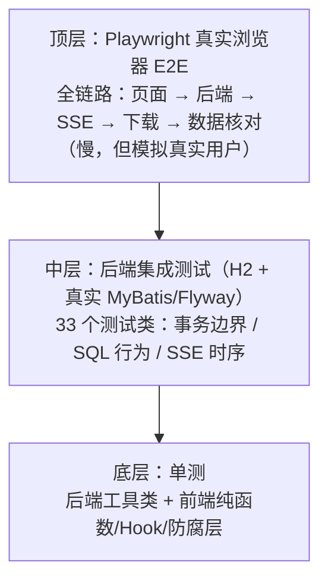

# FlowHub：测试与质量守门

> **代码仓库**：[wychmod/FlowHub](https://github.com/wychmod/FlowHub)
> **代码位置**：`backend/src/test/java/`（37 个测试类）+ `frontend/src/**/*.test.*` + `frontend/e2e/`
> **本章目标**：为前 10 章讲的每个「绝不断裂」「绝不误删」「绝不重复」的承诺配上测试——**可靠性不是写出来的，是测出来的**。
> **原文对照**：仓库 `doc/11-测试与质量守门.md`

---

## 一、测试金字塔



三层各自守一件事：

- **单测**守「逻辑对」：纯函数边界（ParamUtils、幂等键、防注入）；
- **集成测试**守「协作对」：SQL 真的按预期执行、事务真的原子、事件真的在提交后发出；
- **E2E** 守「系统对」：三层加起来真的能跑通用户旅程。

## 二、后端集成测试的基建选择

两个关键决定：

### H2 内存库（MySQL 兼容模式）替代真实 MySQL

`src/test/resources/application.yml` 把数据源指到 `jdbc:h2:mem:flowhub_test;MODE=MySQL`，Flyway 迁移照常在 H2 上执行——测试跑得飞快且零外部依赖，同时**真实地过一遍 MyBatis XML 动态 SQL**（动态 SQL 是重灾区，纯 mock 测不出来）。

已知代价：测试 yml 会**整体遮蔽**主配置——mybatis 配置等必须在两处同步维护。测试 yml 还做了几件「有意的不同」：

| 配置 | 测试值 | 为什么 |
|---|---|---|
| 定时任务 cron / 分发间隔 | `-`（静默） | 定时器随机触发会让集成测试不确定 |
| MQ 监听容器 | `auto-startup: false` | Consumer 由测试**直接方法调用**验证，不经容器 |
| Redis 超时 | 100ms 快速失败 | 投影写入失败要快，别拖慢测试 |
| 日志 | 同步 Appender（`logback-test.xml`） | 多个测试断言 `CapturedOutput` 日志内容，异步有竞态 |

### 测试数据与生产演示数据同口径

`TestOrderDataSeeder` 与 `seed-demo-data.sql` 的数据生成口径对齐——测试结论对演示环境有效，不是「另一套假数据上的自嗨」。

## 三、后端测试矩阵（精选）

| 测试类 | 守住的承诺 | 本系列章节 |
|---|---|---|
| `OrderControllerTest` + 行为对齐测试 | 筛选/排序语义与 SQL 拼装一致 | [02](02-订单查询模块.md) |
| `ExportJobIdempotencyConcurrencyTest` | 并发同幂等键只创建一个任务 | [03](03-导出任务创建与幂等.md) |
| `ExportJobListTest`（9 用例） | 列表分页/过滤/派生字段计算 | [03](03-导出任务创建与幂等.md) |
| `ExportJobConsumerTest` | 抢占失败零副作用 / 契约非法进 DLQ / 失败收敛后 Ack | [04](04-可靠投递-Outbox与消费.md) |
| `ExportExecutionIntegrationTest`（7 用例） | 高水位阻断新数据 / 批次边界 / 写失败不虚推进度 | [05](05-导出执行与Excel生成.md) |
| `ExcelExportWriter` 单测（6 用例） | **用真实 XSSF 重开**断言内容 + 公式注入被中和 | [05](05-导出执行与Excel生成.md) |
| `ExportProgressSseIntegrationTest`（8 用例） | 进度单调守卫 / 回滚不广播 / 坏连接隔离 | [06](06-进度状态与SSE实时通知.md) |
| `ExportFileServiceTest`（8 用例） | 路径穿越/符号链接/根组件全被拒 | [07](07-文件安全与下载.md) |
| `ExportJobDownloadControllerTest`（7 用例） | 未完成/过期/丢失/污染路径的下载语义 | [07](07-文件安全与下载.md) |
| `ExportMaintenanceIntegrationTest`（6 用例） | 活跃租约不误伤 / 删除成功才 EXPIRED / 重试留痕 | [08](08-恢复与清理.md) |
| `ImportJobUploadControllerTest` | multipart 超限挂死回归（手工拼 body 对齐浏览器行为） | [09](09-订单Excel导入.md) |
| `ImportProgressSseIntegrationTest` | 导入侧对称的进度/SSE 矩阵 | [09](09-订单Excel导入.md) |

> 一个值得注意的测试哲学：**最危险的场景都有「不误伤」用例**——活跃租约不被恢复误收敛、有引用的文件不被孤儿对账误删、回滚的事务不发广播。破坏性代码好写，克制性代码难测。

## 四、前端测试：纯函数红利 + 工程强制

- **能拆纯函数的都拆了**：`filters.ts`（草稿→查询映射）、`selection.ts`（勾选上限）、`idempotency.ts`（幂等键生命周期）、`uploadGuards.ts`（上传前置守卫）——纯函数是前端可测性的最大红利；
- **Hook 用 jsdom 测**：`useExportEvents` 的状态机（连接/断线/降级/版本栅栏）不靠手点，靠模拟 EventSource；
- **工程强制闭环**：`.claude/` 的 PostToolUse hook 会在每次改动 `frontend/` 文件后自动执行 `npm test && npm run build`——**前端改动不过测试就落不了地**。

## 五、Playwright 全链路 E2E

`frontend/e2e/full-flow.spec.ts` 走真实浏览器（本机 Chrome headless）+ 真实前后端（Vite 代理 → 真后端，不 mock 任何一层）：


两个守门细节：

- 每个用例断言**零未捕获 JS 错误、零 console error**（白名单只有 favicon 404 和失败路径故意触发的业务 4xx）——「能用」和「用得干净」分开验收；
- E2E 发现的 4 类存量问题在 commit `a208fe1` 一次性修复——包括只在真实浏览器才暴露的问题（jsdom 模拟不了真实的连接时序和渲染行为，这正是 E2E 不可替代的原因）。

## 六、踩坑复盘

### 坑：测试环境与生产配置的「静默漂移」

定时任务、MQ 容器、日志 Appender 在测试环境全部被有意关掉/换掉。这些差异每一个都必须**写在配置注释里**，否则半年后没人记得为什么测试 yml 长这样，一次「顺手统一配置」就可能让集成测试集体变慢或随机失败。

**教训**：测试环境与生产的**每一处有意分歧**都是一笔需要注释说明的技术债，分歧清单要可发现。

## 七、运行方式速查

```bash
# 后端全量测试（不需要 MySQL/RabbitMQ/Redis）
cd backend && .\mvnw.cmd test

# 后端单测类
.\mvnw.cmd test -Dtest=ExportJobConsumerTest

# 前端单测 + 构建
cd frontend && npm test && npm run build

# E2E（需前后端已在运行 + 本机 Chrome）
cd frontend && npx playwright test
```

## 八、遗留与改进

- 无性能自动化基线（性能采集脚本属后续交付物，落库前不伪造基准数字）；
- 后端测试尚无覆盖率门禁（如 JaCoCo 阈值）；
- E2E 目前单浏览器单分辨率，可扩多浏览器矩阵与移动视口。

---

## 📚 完整资料

- [FlowHub GitHub 仓库](https://github.com/wychmod/FlowHub)
- [原文复盘：doc/11-测试与质量守门.md](https://github.com/wychmod/FlowHub/blob/main/doc/11-测试与质量守门.md)

## 最新修改记录

| 日期 | 类型 | 说明 |
|---|---|---|
| 2026-09-11 | 新增 | 从 0 复现教程：测试金字塔、H2 集成基建、测试矩阵与 Playwright 全链路守门 |

> 📚 完整历史修改记录见 [修改记录归档](/_meta/CHANGELOG_HISTORY.md)。
