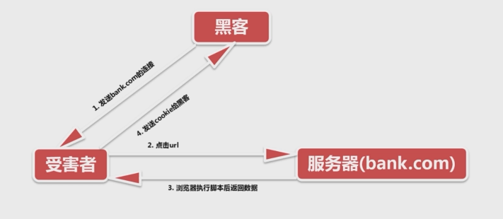
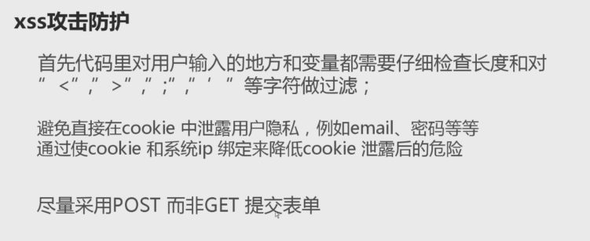

# 项目开发笔记

## 一、user表的设计
### 1.默认user表修改

字段名称 | 字段属性
---|---
id | int
password | varchar
last_login | datetime
is_superuser | tinyint
username | varchar
first_name | varchar
last_name | varchar
email | varchar
is_staff | tinyint
is_active | tinyint
date_joined | datetime


**继承默认user表：**

新的user替换旧的user

```python
from django.contrib.auth.models import AbstractUser


class UserProfile(AbstractUser):
    nick_name = models.CharField(max_length=50, verbose_name=u"昵称", default="")
    birday = models.DateField(verbose_name=u"生日", null=True, blank=True)
    gender = models.CharField(max_length=6, choices=(("male", u"男"), ("female", "女")), default="female")
    address = models.CharField(max_length=100, default=u"")
    mobile = models.CharField(max_length=11, null=True, blank=True)
    image = models.ImageField(upload_to="image/%Y/%m", default=u"image/default.png", max_length=100)

    class Meta:
        verbose_name = "用户信息"
        verbose_name_plural = verbose_name

    def __unicode__(self):
        return self.username
    
INSTALLED_APPS = [
    'django.contrib.admin',
    'django.contrib.auth',
    'django.contrib.contenttypes',
    'django.contrib.sessions',
    'django.contrib.messages',
    'django.contrib.staticfiles',
    'users',
]
AUTH_USER_MODEL = 'users.UserProfile'
```


## 二、所有app都在apps 目录下

在settings中修改如下，同时将apps文件mark source

**实例：**

```python
import os
import sys

# Build paths inside the project like this: os.path.join(BASE_DIR, ...)
BASE_DIR = os.path.dirname(os.path.dirname(os.path.abspath(__file__)))
sys.path.insert(0, os.path.join(BASE_DIR, 'apps'))
```

## 三、配置xadmin

直接pip install xadmin或github上面clone源码,clone 下来的放在extra_apps文件夹下。

**urls.py**

``` python
import xadmin

urlpatterns = [
    url(r'^xadmin/', xadmin.site.urls),
]
```
**setting.py**

``` python
sys.path.insert(0, os.path.join(BASE_DIR, 'extra_apps'))
```

**app下的adminx.py**

``` python
import xadmin
from .models import EmailVerifyRecord, Banner
from xadmin import views
import sys
reload(sys)
sys.setdefaultencoding( "utf-8" )


class BaseSetting(object):
    enable_themes = True
    use_bootswatch = True


class GlobalSettings(object):
    site_title = "慕学后台管理系统"
    site_footer = "慕学在线网"


class EmailVerifyRecordAdmin(object):
    list_display = ['code', 'email', 'send_type', 'send_time']
    search_fields = ['code', 'email', 'send_type']
    list_filter = ['code', 'email', 'send_type', 'send_time']


class BannerAdmin(object):
    list_display = ['title', 'image', 'url', 'index', 'add_time']
    search_fields = ['title', 'image', 'url', 'index']
    list_filter = ['title', 'image', 'url', 'index', 'add_time']


xadmin.site.register(EmailVerifyRecord, EmailVerifyRecordAdmin)
xadmin.site.register(Banner, BannerAdmin)
xadmin.site.register(views.BaseAdminView, BaseSetting)
xadmin.site.register(views.CommAdminView, GlobalSettings)
```
## 四、配置static文件和media文件

```python
STATIC_URL = '/static/'
STATICFILES_DIRS = STATICFILES_DIRS=[(os.path.join(BASE_DIR, 'static'))]

MEDIA_URL = '/media/'
MEDIA_ROOT = os.path.join(BASE_DIR, 'media')

# 配置setting.py，可以在django模板中注册{{ MEDIA_URL }}
'OPTIONS': {
            'context_processors': [
                'django.template.context_processors.debug',
                'django.template.context_processors.request',
                'django.contrib.auth.context_processors.auth',
                'django.contrib.messages.context_processors.messages',
                'django.core.context_processors.media', # 这里
            ],
        },
        
# urls.py里要配置media的路由
# 配置上传文件的访问处理函数
from MxOnline.settings import MEDIA_ROOT
from django.views.static import serve

url(r'^media/(?P<path>.*)$',  serve, {"document_root":MEDIA_ROOT}),

```
## 五、登录
用视图类的方法书写登录。同时进行邮箱\账号登录双验证。

**view.py**
```python
from users.forms import LoginForm
from .models import UserProfile


class CustomBackend(ModelBackend):
    def authenticate(self, username=None, password=None, **kwargs):
        try:
            user = UserProfile.objects.get(Q(username=username)|Q(email=username))
            if user.check_password(password):
                return user
        except Exception as e:
            return None


class LoginView(View):
    def get(self, request):
        return render(request, "login.html", {})

    def post(self, request):
        login_form = LoginForm(request.POST)
        if login_form.is_valid():
            user_name = request.POST.get("username", "")
            pass_word = request.POST.get("password", "")
            user = authenticate(username=user_name, password=pass_word)
            if user:
                    login(request, user)
                    return render(request, "index.html")
            else:
                return render(request, "login.html", {"msg":"用户名或密码错误！"})
        else:
            return render(request, "login.html", {"login_form":login_form})

```
**setting.py**
```python
AUTHENTICATION_BACKENDS = (
    'users.views.CustomBackend',
)

```
登录的时候用form进行表单验证。

**forms.py**
```python
from django import forms


class LoginForm(forms.Form):
    username = forms.CharField(required=True)
    password = forms.CharField(required=True, min_length=5)

```
**urls.py**
```python
from users.views import LoginView

url('^login/$', LoginView.as_view(), name='login')
```


## 六、注册验证码

#### (1) 验证码的安装

```python
pip install django-simple-captcha

# 生成迁移文件

python manage.py makemigrations

# 执行迁移文件

python manage.py migrate

# setting.py文件

INSTALLED_APPS = [
    ...,
    'captcha',
]
```

#### (2) 在forms中定义该验证码
**forms.py**
```python
from django import forms

class RegisterForm(forms.Form):
    email = forms.EmailField(required=True)
    password = forms.CharField(required=True, min_length=5)
    captcha = CaptchaField(error_messages={"invalid":u"验证码错误"})
```
#### (3) 在views.py中使用该验证码
**views.py**
```python
class RegisterView(View):
    def get(self, request):
        register_form = RegisterForm()
        return render(request, "register.html", {'register_form': register_form})
```
**register.html**
```html
<div class="form-group marb8 captcha1 
    errorput
">
    <label>验&nbsp;证&nbsp;码</label>
    {{ register_form.captcha }}
</div>
```


## 七、django第三方库分页

##### (1) 下载第三方库

pip install django-pure-pagination

##### (2) 在setting.py中添加配置

```python
INSTALLED_APPS = (
    ...
    'pure_pagination',
)

# views.py 例子
from django.core.paginator import Paginator, PageNotAnInteger

# 课程机构
all_orgs = CourseOrg.objects.all()
# 对课程机构进行分页
try:
    page = request.GET.get('page', 1)
except PageNotAnInteger:
    page = 1

p = Paginator(all_orgs, 5, request=request) # 每页五个

orgs = p.page(page)
```

## 八、django登录验证mixin

##### (1) 创建mixin_utils.py

```python
from django.contrib.auth.decorators import login_required
from django.utils.decorators import method_decorator


class LoginRequiredMixin(object):

    @method_decorator(login_required(login_url='/login/'))
    def dispatch(self, request, *args, **kwargs):
        return super(LoginRequiredMixin, self).dispatch(request, *args, **kwargs)
```

##### (2) 在views.py中需要验证的视图类继承该类

```python
class CommentsView(LoginRequiredMixin, View):
    def get(self, request, course_id):
        course = Course.objects.get(id=int(course_id))
        all_resources = CourseResource.objects.filter(course=course)
        all_comments = CourseComments.objects.all().order_by("-id")
        return render(request, "course-comment.html", {
            "course":course,
            "course_resources":all_resources,
            "all_comments":all_comments

        })
```

## 九、全局404页面配置

##### (1) 在view.py中创建404的视图

```python
def page_not_found(request):
    # 全局404处理函数
    from django.shortcuts import render_to_response
    response = render_to_response('404.html', {})
    response.status_code = 404
    return response


def page_error(request):
    # 全局500处理函数
    from django.shortcuts import render_to_response
    response = render_to_response('500.html', {})
    response.status_code = 500
    return response
```

##### (2) 在urls.py中进行配置路由

```python

# 全局404页面配置
handler404 = 'users.views.page_not_found'
handler500 = 'users.views.page_error'

```

## 十、常见web攻击

##### (1) sql注入攻击

**sql注入的危害**
- 非法读取、篡改、删除数据库中的数据
- 盗取用户的各类敏感信息、获取利益
- 通过修改数据库来修改网页上的内容
- 注入木马等等
> -django自带的orm能够避免sql注入攻击

##### (2) xss攻击
**xss跨站脚本**
- 盗取各类用户账号，如用户网银账号、各类管理员账号
- 盗窃企业重要的具有商业价值的资料
- 非法转账
- 控制受害者机器向其他网站发起攻击、注入木马等等




##### (3) csrf攻击
**csrf跨站请求伪造的危害**
- 以你的名义发邮件
- 盗窃你的账号
- 购买商品
- 虚拟货币转账
> -django模板的crsf_token能够避免