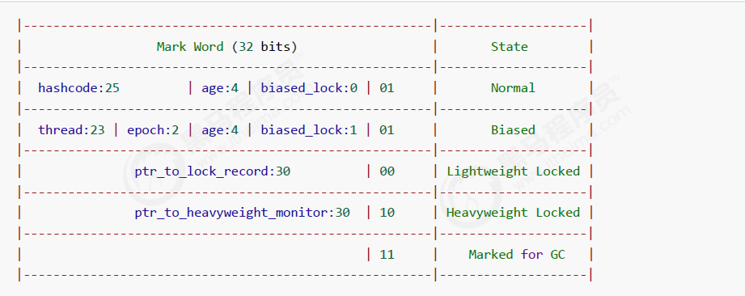

# 1. 存储器的硬件层面
## 1.1 存储器的层次结构


## 1.2 硬件层数据一致性

> 缓存一致性问题。在多处理器系统中，每个处理器有自己的高速缓存，而他们又共享同一块内存（下文成主存，main memory 主要内存），当多个处理器运算都涉及到同一块内存区域的时候，就有可能发生缓存不一致的现象。

为了解决这一问题，需要各个处理器运行时都遵循一些协议，在运行时需要通过这些协议保证数据的一致性。比如MSI、MESI(intel)、MOSI、Synapse、Firely、DragonProtocol等。


古老CPU是总线锁，总线锁会锁住总线，使得其他CPU甚至不能访问内存中其他的地址，因而效率较低
**现代CPU的数据一致性实现 = 缓存锁(MESI ...) + 总线锁**

**读取缓存以cache line为基本单位，目前64bytes**

> MESI协议：`CPU`中每个缓存行（`caceh line`)使用4种状态进行标记（使用额外的两位(`bit`)表示):
> 1. **M: 被修改（Modified)**
> 2. **E: 独享的（Exclusive)**
> 3. **S: 共享的（Shared)**
> 4. **I: 无效的（Invalid）**
> 在多核系统中，每个核心都会有自己的缓存共享主存总线，每个相应的`CPU`会发出读写请求，而缓存的目的是为了减少`CPU`读写共享主存的次数。
> 
> 一个缓存除在`Invalid`状态外都可以满足cpu的读请求，一个`Invalid`的缓存行必须从主存中读取（变成`S`或者 `E`状态）来满足该`CPU`的读请求。
> 一个写请求只有在该缓存行是M或者E状态时才能被执行，如果缓存行处于`S`状态，必须先将其它缓存中该缓存行变成`Invalid`状态（也既是不允许不同`CPU`同时修改同一缓存行，即使修改该缓存行中不同位置的数据也不允许）。

> 有些无法被缓存的数据,或者跨越多个缓存行的数据,依然必须使用总线锁
### 1.2.1 伪共享问题

**位于同一缓存行的两个不同数据，被两个不同CPU锁定，产生互相影响**

解决方案：
1. 使用对齐填充
2. 使用@contented注解，通过缓存行填充来解决伪共享问题

```java
// 伪共享问题, 效率会特别低
public class T03_CacheLinePadding {
​
    public static volatile long[] arr = new long[2];
​
    public static void main(String[] args) throws Exception {
        Thread t1 = new Thread(()->{
            for (long i = 0; i < 10000_0000L; i++) {
                arr[0] = i;
            }
        });
​
        Thread t2 = new Thread(()->{
            for (long i = 0; i < 10000_0000L; i++) {
                arr[1] = i;
            }
        });
​
        final long start = System.nanoTime();
        t1.start();
        t2.start();
        t1.join();
        t2.join();
        System.out.println((System.nanoTime() - start)/100_0000);
    }
}

// 8*8=64字节，对齐填充可以解决伪共享问题
public class T04_CacheLinePadding {
​
    public static volatile long[] arr = new long[16];
​
    public static void main(String[] args) throws Exception {
        Thread t1 = new Thread(()->{
            for (long i = 0; i < 10000_0000L; i++) {
                arr[0] = i;
            }
        });
​
        Thread t2 = new Thread(()->{
            for (long i = 0; i < 10000_0000L; i++) {
                arr[8] = i;
            }
        });
​
        final long start = System.nanoTime();
        t1.start();
        t2.start();
        t1.join();
        t2.join();
        System.out.println((System.nanoTime() - start)/100_0000);
    }
}
```

> 使用缓存行的对齐能够提高效率

## 1.3 乱序问题

CPU为了提高指令执行效率，会在一条指令执行过程中（比如去内存读数据（慢100倍）），去同时执行另一条指令，前提是，两条指令没有依赖关系。

读指令的同时可以同时执行不影响的其他指令，而写的同时可以进行**合并写**

> 个数时依赖cpu模型的，intel的cpu在同一时刻只能拿到4个。 每次写入四个及四个以下的效率高于一次性写八个，写八个会卡住。

乱序执行的证明：
**如果两个线程正常运行，就不会出现x=0，y=0的情况，但是指令重排就会出现x=0，y=0**
```java
public class T04_Disorder {  
    private static int x = 0, y = 0;  
    private static int a = 0, b =0;  
  
    public static void main(String[] args) throws InterruptedException {  
        int i = 0;  
        for(;;) {  
            i++;  
            x = 0; y = 0;  
            a = 0; b = 0;  
            Thread one = new Thread(new Runnable() {  
                public void run() {  
                    //由于线程one先启动，下面这句话让它等一等线程two. 读着可根据自己电脑的实际性能适当调整等待时间.  
                    //shortWait(100000);                    
                    a = 1;  
                    x = b;                }            });  
  
            Thread other = new Thread(new Runnable() {  
                public void run() {  
                    b = 1;  
                    y = a;                }            });  
            one.start();other.start();  
            one.join();other.join();  
            String result = "第" + i + "次 (" + x + "," + y + "）";  
            if(x == 0 && y == 0) {  
                System.err.println(result);  
                break;  
            } else {  
                //System.out.println(result);  
            }  
        }    }}

```

> as if serial 不管如何重排序，单线程执行结果不会改变
## 1.4 java并发内存模型


## 1.5 如何保证特定情况下不乱序

- 硬件级别内存屏障 X86

> sfence：store| 在sfence指令前的写操作当必须在sfence指令后的写操作前完成。 
> lfence：load | 在lfence指令前的读操作当必须在lfence指令后的读操作前完成。 
> mfence：modify/mix | 在mfence指令前的读写操作当必须在mfence指令后的读写操作前完成。

> 原子指令，如x86上的”lock …” 指令是一个Full Barrier，执行时会锁住内存子系统来确保执行顺序，甚至跨多个CPU。Software Locks通常使用了内存屏障或原子指令来实现变量可见性和保持程序顺序

- JVM级别如何规范（JSR133）

> LoadLoad屏障： 对于这样的语句Load1; LoadLoad; Load2，
> 
> 在Load2及后续读取操作要读取的数据被访问前，保证Load1要读取的数据被读取完毕。
> 
> StoreStore屏障：
> 
> 对于这样的语句Store1; StoreStore; Store2，  
> ​  
> 在Store2及后续写入操作执行前，保证Store1的写入操作对其它处理器可见。
> 
> LoadStore屏障：
> 
> 对于这样的语句Load1; LoadStore; Store2，  
> ​  
> 在Store2及后续写入操作被刷出前，保证Load1要读取的数据被读取完毕。
> 
> StoreLoad屏障： 对于这样的语句Store1; StoreLoad; Load2，
> 
> 在Load2及后续所有读取操作执行前，保证Store1的写入对所有处理器可见。

- volatile的实现细节

1. 字节码层面 ACC_VOLATILE 只是加了一个标记
    
2. JVM层面 volatile内存区的读写 都加屏障
    
    > StoreStoreBarrier
    > 
    > volatile 写操作
    > 
    > StoreLoadBarrier
    
    > LoadLoadBarrier
    > 
    > volatile 读操作
    > 
    > LoadStoreBarrier
    
3. OS和硬件层面 [https://blog.csdn.net/qq_26222859/article/details/52235930](https://blog.csdn.net/qq_26222859/article/details/52235930) 
	hsdis - HotSpot Dis Assembler windows lock 指令实现 | MESI实现
    

- synchronized实现细节

1. 字节码层面 ACC_SYNCHRONIZED monitorenter monitorexit
    
2. JVM层面 C C++ 调用了操作系统提供的同步机制
    
3. OS和硬件层面 X86 : lock cmpxchg(比较并交换指令) /  [https](https://blog.csdn.net/21aspnet/article/details/88571740)[://blog.csdn.net/21aspnet/article/details/](https://blog.csdn.net/21aspnet/article/details/88571740)[88571740](https://blog.csdn.net/21aspnet/article/details/88571740)

# 2. 对象内存布局

1. 请解释一下对象的创建过程？
2. 对象在内存中的存储布局？
3. 对象头具体包括什么？
4. 对象怎么定位？
5. 对象怎么分配？
6. Object o = new Object在内存中占用多少字节？

## 2.1 对象的创建过程？
1. class loading
2. class linking (verification, preparation, resolution)
3. class initializing
4. 申请对象内存
5. 成员变量赋默认值
6. 调用构造方法\<init\>
	1. 成员变量顺序赋初始值
	2. 执行构造方法语句

## 2.2 对象在内存中的存储布局

- 普通对象
	1. 对象头：markword 8
	2. ClassPointer指针：-XX:+UseCompressedClassPointers 为4字节 不开启为8字节
	3. 实例数据
	    1. 引用类型：-XX:+UseCompressedOops 为4字节 不开启为8字节 Oops Ordinary Object Pointers
	4. Padding对齐，8的倍数
    
- 数组对象
	1. 对象头：markword 8
	2. ClassPointer指针同上
	3. 数组长度：4字节
	4. 数组数据
	5. 对齐 8的倍数

- 验证
```java
import java.lang.instrument.Instrumentation;

public class ObjectSizeAgent {
    private static Instrumentation inst;

    public static void premain(String agentArgs, Instrumentation _inst) {
        inst = _inst;
    }

    public static long sizeOf(Object o) {
        return inst.getObjectSize(o);
    }
}

public class T03_SizeOfAnObject {
       public static void main(String[] args) {
           System.out.println(ObjectSizeAgent.sizeOf(new Object()));
           System.out.println(ObjectSizeAgent.sizeOf(new int[] {}));
           System.out.println(ObjectSizeAgent.sizeOf(new P()));
       }
   // -XX:+UseCompressedClassPointers 压缩class指针 8->4
   // -XX:+UseCompressedOops 压缩引用指针 8->4
       private static class P {
                           //8 _markword
                           //4 _oop指针
           int id;         //4
           String name;    //4 <- 8
           int age;        //4
   
           byte b1;        //1
           byte b2;        //1
   
           Object o;       //4 <- 8
           byte b3;        //1
   
       }
   }
```

## 2.3 对象头具体包括什么
* Mark Word 结构：最后两位是**锁标志位**

  

* 64 位虚拟机 Mark Word：

  

> 问题：为什么GC年龄默认为15？（最大为15） 两位最大15

## 2.4 对象怎么定位？

1. 句柄池


2. 直接指针


## 2.5对象怎么分配？

- GC相关内容
## 2.6 Object o = new Object在内存中占用多少字节？

markword 8
ClassPointer指针: 8 -> 4
对齐填充：4

一共16字节

# 3. 指令集分类

1. 基于寄存器的指令集
2. 基于栈的指令集 
	- Hotspot中的Local Variable Table = JVM中的寄存器

# 4. 运行时数据区(Run-Time Data Areas)


## 4.1 PC 程序计数器

> 存放指令位置
>
> 虚拟机的运行，类似于这样的循环：
>
> while( not end ) {
>
> ​	取PC中的位置，找到对应位置的指令；
>
> ​	执行该指令；
>
> ​	PC ++;
>
> }

## 4.2 JVM Stacks
一个Java线程的运行状态，由一个虚拟机栈来保存，所以虚拟机栈肯定是线程私有的，独有的，随着线程的创建而创建。

1. Frame - 每个方法对应一个栈帧
   1. Local Variable Table局部变量表
   2. Operand Stack操作数栈
      对于long的处理（store and load），多数虚拟机的实现都是原子的
      jls 17.7，没必要加volatile
      **以压栈和出栈的方式存储操作数的**
   3. Dynamic Linking 动态链接
      每个栈帧都包含一个指向运行时常量池中该栈帧所属方法的引用，持有这个引用是为了支持方法调 用过程中的动态连接
   4. return address方法返回地址
      a() -> b()，方法a调用了方法b, b方法的返回值放在什么地方


## 4.3 Heap
1. Java堆是Java虚拟机所管理内存中最大的一块，在虚拟机启动时创建，被所有线程共享。
2. Java对象实例以及数组都在堆上分配。


## 4.4 Native Method Stack(本地方法栈)
指的是本地方法，也就是c、c++，java调用了JNI。
>如果当前线程执行的方法是Native类型的，这些方法就会在本地方法栈中执行。


## 4.5 Direct Memory直接内存

> JVM可以直接访问的内核空间的内存 (OS 管理的内存)
>
> NIO ， 提高效率，实现zero copy

>零拷贝（Zero-copy）是一种数据传输的技术，它能够在数据传输过程中减少或避免数据的复制操作。传统的数据传输方式需要将数据从一个内存区域复制到另一个内存区域，然后再传输给目标。而零拷贝技术则允许数据在不经过复制的情况下直接从源内存区域传输到目标内存区域。


## 4.6 Method Area 方法区
1. 方法区是各个线程共享的内存区域，在虚拟机启动时创建
2. 用于存储已被虚拟机加载的类信息、常量、静态变量、即时编译器编译后的代码等数据
3. 当方法区无法满足内存分配需求时，将抛出OutOfMemoryError异常

### 4.6.1 Perm Space（永久代）(<1.8)
1. 用于存储常量池和静态变量等信息的固定大小的内存区域。
2. FGC不会清理
3. 大小启动的时候指定，不能变

### 4.6.2 元空间（Metaspace） (>=1.8)
1. 从Java 8开始，永久代被元空间（Metaspace）所取代。
2. 字符串常量位于堆
3. 会触发FGC清理
4. 不设定的话，最大就是物理内存
5. 元空间将类的元数据信息存储在本地内存中，而不是传统的Java堆中，从而提高了性能和灵活性。

思考：

> 如何证明1.7字符串常量位于Perm，而1.8位于Heap？
>
> 提示：结合GC， 一直创建字符串常量，观察堆，和Metaspace


## 4.7 Run-Time Constant Pool
class文件格式的里面有一项叫常量池，常量池的内容在运行的时候就扔在Run-Time Constant Pool 运行时数据区。

## 4.8 线程共享区域


## 4.9 为什么要每个线程都有自己的pc

因为一个线程执行完回到另一个线程需要知道当前线程运行到哪里了。

## 5. 常用指令

- store
- load
- pop
- mul
- sub
- invoke
	1. InvokeStatic 调用静态方法
	2. InvokeVirtual 自带多态，压栈，压的是谁调用的就是谁
	3. InvokeInterface List 调用 具体的List 就用这个 实现了接口
	4. InovkeSpecial
	   可以直接定位，不需要多态的方法
	   private 方法 ， 构造方法
	5. InvokeDynamic
	   JVM最难的指令
	   lambda表达式或者反射或者其他动态语言scala kotlin，或者CGLib ASM，动态产生的class，会用到的指令
- iinc
iinc指令的操作数包括两个部分：局部变量的索引和增量值。局部变量索引表示要进行操作的局部变量在当前方法的局部变量表中的位置，而增量值表示要增加的数值。
```java
iload_1   ; 将局部变量1（即x）加载到操作数栈顶
iconst_5  ; 将常量值5加载到操作数栈顶
iadd      ; 将栈顶的两个数值相加，并将结果存入栈顶
istore_1  ; 将栈顶的数值存入局部变量1（即x）

等同于下面这条

iinc 1 5 ; 将局部变量1（即x）增加5

i = i++ 
字节码是
iload_1 栈里是8
iinc 变量表是9
istore 把变量表存成栈里的8
```
