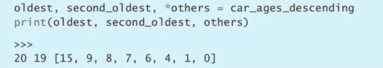
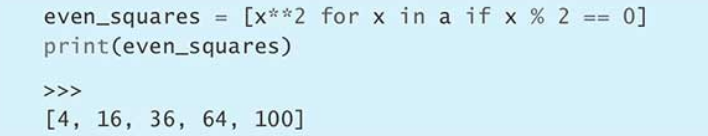
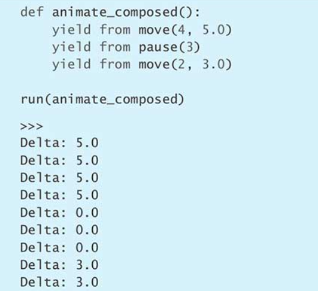

# Effective Python：编写高质量Python代码的90个有效方法

## 用支持插值的f-string取代C风格的格式字符串与str.format方法
### 不好写法1：用%格式化操作符
**Python里面最常用的字符串格式化方式是采用%格式化操作符**。这个操作符左边的文本模板叫作格式字符串（format string），我们可以在操作符右边写上某个值或者由多个值所构成的元组（tuple），用来替换格式字符串里的相关符号。例如，下面这段代码通过%操作符把难以阅读的二进制和十六进制数值，显示成十进制的形式。
```
print('xiaobai is %d, xiaohuang is %d' % (a, b))
```
### 不好写法2：内置的format函数与str类的format方法
```
formatted = '{} = {}'.format(key, value)
```

### 3.6以后写法插值格式字符串
Python 3.6添加了一种新的特性，叫作**插值格式字符串**（interpolated formatstring，简称f-string），可以解决上面提到的所有问题。新语法特性要求在格式字符串的前面加字母f作为前缀，这跟字母b与字母r的用法类似，也就是分别表示字节形式的字符串与原始的（或者说未经转义的）字符串的前缀。
```
key = '123'
value = 123
formatted = f'{key} = {value}'
print(formatted)
```

## 用辅助函数取代复杂的表达式
## 把数据结构直接拆分到多个变量里，不要专门通过下标访问
```
item = ('a', 'b')
first, second = item

a, b = b, a
```
这样写为什么可以成立呢？因为Python处理赋值操作的时候，要先对=号右侧求值，于是，它会新建一个临时的元组，把a[i]与a[i-1]这两个元素放到这个元组里面。例如，头一次进入内部的for循环时，这两个元素分别是'carrots'与'pretzels'，于是，系统就会创建出('carrots', 'pretzels')这样一个临时的元组。然后，Python会对这个临时的元组做unpacking，把它里面的两个元素分别放到=号左侧的那两个地方，于是，'carrots'就会把a[i-1]里面原有的'pretzels'换掉，'pretzels'也会把a[i]里面原有的'carrots'换掉。现在，出现在a[0]这个位置上面的字符串就是'carrots'了，出现在a[1]这个位置上面的字符串则是'pretzels'。做完unpacking后，系统会扔掉这个临时的元组。

**把数据结构直接拆分到多个变量里，不要专门通过下标访问**

> unpacking是一种特殊的Python语法，只需要一行代码，就能把数据结构里面的多个值分别赋给相应的变量。
> unpacking在Python中应用广泛，凡是可迭代的对象都能拆分，无论它里面还有多少层迭代结构。
> 尽量通过unpacking来拆解序列之中的数据，而不要通过下标访问，这样可以让代码更简洁、更清晰。

## 尽量用enumerate取代range

> enumerate函数可以用简洁的代码迭代iterator，而且可以指出当前这轮循环的序号。
> 不要先通过range指定下标的取值范围，然后用下标去访问序列，而是应该直接用enumerate函数迭代。
> 可以通过enumerate的第二个参数指定起始序号（默认为0）。

## 用zip函数同时遍历两个迭代器
> 内置的zip函数可以同时遍历多个迭代器。zip会创建惰性生成器，让它每次只生成一个元组，所以无论输入的数据有多长，它都是一个一个处理的。如果提供的迭代器的长度不一致，那么只要其中任何一个迭代完毕，zip就会停止。如果想按最长的那个迭代器来遍历，那就改用内置的itertools模块中的zip_longest函数。

## 不要在for与while循环后面写else块

## 通过带星号的unpacking操作来捕获多个元素，不要用切片


## 用sort方法的key参数来表示复杂的排序逻辑

## 不要过分依赖给字典添加条目时所用的顺序
**在Python 3.5与之前的版本中，迭代字典（dict）时所看到的顺序好像是任意的，不一定与当初把这些键值对添加到字典时的顺序相同。**

之所以出现这种效果，是因为字典类型以前是用哈希表算法来实现的（这个算法通过内置的hash函数与一个随机的种子数来运行，而该种子数会在每次启动Python解释器时确定）。所以，这样的机制导致这些键值对在字典中的存放顺序不一定会与添加时的顺序相同，而且每次运行程序的时候，存放顺序可能都不一样。

**从Python 3.6开始，字典会保留这些键值对在添加时所用的顺序，而且Python3.7版的语言规范正式确立了这条规则。**
> 在Python代码中，我们很容易就能定义跟标准的字典很像但本身并不是dict实例的对象。对于这种类型的对象，不能假设迭代时看到的顺序必定与插入时的顺序相同。如果不想把这种跟标准字典很相似的类型也当成标准字典来处理，那么可以考虑这样三种办法。第一，不要依赖插入时的顺序编写代码；第二，在程序运行时明确判断它是不是标准的字典；第三，给代码添加类型注解并做静态分析。

## 用get处理键不在字典中的情况，不要使用in与KeyError
> 有四种办法可以处理键不在字典中的情况：in表达式、KeyError异常、get方法与setdefault方法。如果跟键相关联的值是像计数器这样的基本类型，那么get方法就是最好的方案；如果是那种构造起来开销比较大，或是容易出异常的类型，那么可以把这个方法与赋值表达式结合起来使用。即使看上去最应该使用setdefault方案，也不一定要真的使用setdefault方案，而是可以考虑用defaultdict取代普通的dict。

## 用数量可变的位置参数给函数设计清晰的参数列表
def定义函数时，可以通过args的写法让函数接受数量可变的位置参数。调用函数时，可以在序列左边加上操作符，把其中的元素当成位置参数传给args所表示的这一部分。

如果操作符加在生成器前，那么传递参数时，程序有可能因为耗尽内存而崩溃。

给接受*args的函数添加新位置参数，可能导致难以排查的bug。

## 在函数之中用数量可变的位置参数给函数设计清晰的参数列表

## 如果关键字参数的默认值属于这种会发生变化的值，那就应该写成None，并且要在docstring里面描述函数此时的默认行为。

## 用列表推导取代map与filter


**字典与集合也有相应的推导机制，分别叫作字典推导（dictionarycomprehension）与集合推导（set comprehension）。**


## 控制推导逻辑的子表达式不要超过两个

## 考虑用生成器表达式改写数据量较大的列表推导
**列表推导可以根据输入序列中的每个元素创建一个包含派生元素的新列表**。如果输入的数据量比较小，那么这样做没问题，但如果数据量很大，那么程序就有可能因为内存耗尽而崩溃。


生成器表达式的写法，与列表推导式语法类似，但它是写在一对圆括号内，而不是方括号里面。下面这种写法的效果与刚才一样，但是程序并不会立刻给出全部结果，而是先将生成器表达式表示成一个迭代器返回。


## 通过yield from把多个生成器连起来用





## 用组合起来的类来实现多层结构，不要用嵌套的内置类型
不要在字典里嵌套字典、长元组，以及用其他内置类型构造的复杂结构。namedtuple能够实现出轻量级的容器，以存放不可变的数据，而且将来可以灵活地转化成普通的类。如果发现用字典来维护内部状态的那些代码已经越写越复杂了，那么就应该考虑改用多个类来实现。

## 优先考虑用public属性表示应受保护的数据，不要用private属性表示
> Python编译器无法绝对禁止外界访问private属性。从一开始就应该考虑允许其他类能继承这个类，并利用其中的内部API与属性去实现更多功能，而不是把它们藏起来。把需要保护的数据设计成protected字段，并用文档加以解释，而不要通过private属性限制访问。只有在子类不受控制且名称有可能与超类冲突时，才可以考虑给超类设计private属性。

## 自定义的容器类型应该从collections.abc继承

## 用datetime模块处理本地时间，不要用time模块

## 用copyreg实现可靠的pickle操作
Python内置的pickle模块可以将对象序列化成字节流，也可以把字节流反序列化（还原）成对象。经过pickle处理的字节流，只应该在彼此信任的双方之间传输，因为pickle的本意只是提供一种数据传输手段，让你在自己可以控制的程序之间传递二进制形式的Python对象。

> pickle模块所使用的这种序列化格式本身就没有考虑过安全问题。这种格式会把原有的Python对象记录下来，让系统可以在稍后予以重建。这意味着，假如记录的这个对象本身含有恶意行为，那么通过反序列化还原出来之后，就有可能破坏整个程序。

**如果要在彼此不信任的两个人或两个程序之间传递数据，那么应该使用JSON这样的格式。**

解决这样的问题，也非常简单，即可以用内置的copyreg模块解决。这个模块允许我们向系统注册相关的函数，把Python对象的序列化与反序列化操作交给那些函数去处理，这样的话，pickle模块就运作得更加稳定了。

**给新属性设定默认值**

最简的办法是定义带有默认参数的构造函数（参见第23条），以确保unpickle操作所还原的GameState对象总是具备应有的属性。下面，我们就定义这样的构造函数：


要想用这个构造函数做pickle，应该定义下面这样的辅助函数，让它接受GameState对象，并把这个对象转化成元组，该元组的第一个元素是负责处理unpickle操作的函数（即unpickle_game_state），第二个元素本身也是个元组（即(kwargs,)）用来表示那个函数所接受的参数。在本例中，由于unpickle_game_state只打算接受一个参数，因此那个元组也只能有一个元素，就是kwargs。只有符合这种标准的函数，才能够注册给copyreg模块。

然后，定义另一个辅助函数，也就是上面提到的unpickle_game_state。这个函数接受刚才那个pickle_game_state函数所返回的kwargs参数，并用这些参数里面的序列化数据来构造GameState对象。这样看来，它仅仅是把GameState的构造函数简单地封装了起来。


我们用内置的copyreg模块来注册这两个函数。

注册之后，pickle模块就可以正确地序列化与反序列化GameState对象了。

这与没有注册的时候不同，那时得到的GameState对象缺少了刚刚添加的points属性。为什么这次不会把新添加的字段漏掉呢？因为这次，系统会通过unpickle_game_state函数来还原对象，而这个函数会触发GameState构造函数，使得缺失的字段能够自动获得同名的关键字参数所指定的默认值，而不像没有注册时那样，只把数据里面已有的字段恢复到还原出来的对象之中。

**用版本号标注同一个类的不同定义**
有时我们要做的改动，是无法向后兼容的。例如，要把现有的Python对象之中的某些字段给删掉。这样一来，刚才那种给构造函数的参数指定默认值的做法就失效了。


**正确处理类名变化**

> Python内置的pickle模块，只适合用来在彼此信任的程序之间传递数据，以实现对象的序列化与反序列化功能。如果对象所在的这个类发生了变化（例如增加或删除了某些属性），那么程序在还原旧版数据的时候，可能会出现错误。把内置的copyreg模块与pickle模块搭配起来使用，可以让新版的程序兼容旧版的序列化数据。

## 在需要准确计算的场合，用decimal表示相应的数值

**因为浮点数必须表示成IEEE 754格式，所以采用浮点数算出的结果可能跟实际结果稍有偏差。**

这样的计算应该用Python内置的decimal模块所提供的Decimal类来做。这个类默认支持28位小数，如果有必要，还可以调得更高。改用这个类之后，就不会出现由于IEEE 754浮点数而造成的偏差了。另外，这种数值所支持的舍入方式，也比浮点数丰富可控。


Decimal的初始值可以用两种办法来指定。第一种，是把含有数值的str字符串传给Decimal的构造函数，这样做不会让字符串里面的数值由于Python本身的浮点数机制而出现偏差。第二种，是直接把float或int实例传给构造函数。

Decimal类提供了quantize函数，可以根据指定的舍入方式把数值调整到某一位。首先用前面那个数值比较大的例子试试看，我们把计费结果向上调整（round up）到小数点后第二位。


> 在精度要求较高且需要控制舍入方式的场合（例如在计算费用的时候），可以考虑使用Decimal类。用小数构造Decimal时，如果想保证取值准确，那么一定要把这个数放在str字符串里面传递，而不要直接传过去，那样可能有误差。

## 先分析性能，然后再优化
最好不要凭感觉去判断，而是应该先获得具体的测评数据，然后再决定怎么优化。Python内置了profiler模块，可以找到程序里面占总执行时间比例最高的一部分，这样的话，我们就可以专心优化这部分代码，而不用执着于对程序性能影响不大的那些地方。
**Python内置了两种profiler，一种是由profile模块提供的纯Python版本，还有一种是由cProfile模块提供的C扩展版本**。这个版本比纯Python版要好，因为它在执行测评的过程中，对受测程序的影响比较小，测评结果更加准确。相反，纯Python版本的开销比较大，会令测评结果有所偏差。

> 分析Python程序的性能之前，一定要提醒自己注意，别把访问外部系统的那些代码，与核心代码混在一起测。


运行完test函数后，用内置的pstats模块与里面的Stats类来统计结果。Stats对象提供了各种方法，通过这些方法我们可以只把自己关注的那部分测评信息打印出来。


ncalls：函数在测评期间的调用次数。tottime：程序执行这个函数本身所花时间（不包括该函数调用其他函数所花时间）。tottime percall：程序每次执行这个函数所花的平均时间（不统计该函数调用其他函数所花时间）。这相当于tottime除以ncalls。cumtime：程序执行这个函数以及它所调用的其他函数所花时间。cumtime percall：程序每次执行这个函数以及它所调用的其他函数平均花费时间。这相当于cumtime除以ncalls。

> 优化Python程序之前，一定要先分析它的性能，因为导致程序速度缓慢的真正原因未必与我们想的一样。应该优先考虑用cProfile模块来分析性能，而不要用profile模块，因为前者得到的分析结果更加准确。把需要接受性能测试的主函数传给Profile对象的runcall方法，就可以专门分析出这个体系下面所有函数的调用情况了。可以通过Stats对象筛选出我们关心的那些分析结果，从而更为专注地思考如何优化程序性能。

## 优先考虑用deque实现生产者-消费者队列

**先进先出的（first-in, first-out，FIFO）队列，这种队列也叫作生产者-消费者队列（producer–consumer queue）或生产-消费队列。**

Python内置的collections模块里面有个deque类，可以解决这个问题。这个类所实现的是双向队列（double-ended queue），从头部执行插入或尾部执行删除操作，都只需要固定的时间，所以它很适合充当FIFO队列。
> list类型可以用来实现FIFO队列，生产者可以通过append方法向队列添加元素。但这种方案有个问题，就是消费者在用pop(0)从队列中获取元素时，所花的时间会随着队列长度，呈平方式增长。跟list不同，内置collections模块之中的deque类，无论是通过append添加元素，还是通过popleft获取元素，所花的时间都只跟队列长度呈线性关系，而非平方关系，这使得它非常适合于FIFT队列。


## 考虑用bisect搜索已排序的序列
如果你不能确定这个值是否在列表里面，那么你要查的就应该是：列表中恰好等于目标值，或比目标值大但最接近目标值的那个元素所在的位置。要想找到这个位置，最简单的办法是对列表做线性扫描，把其中的元素逐个与目标值比较。

Python内置的bisect模块可以更好地搜索有序列表。**其中的bisect_left函数，能够迅速地对任何一个有序的序列执行二分搜索.**

如果序列中有这个值，那么它返回的就是跟这个值相等的头一个元素所在的位置；如果没有，那么它返回的是插入位置，也就是说，把待查的值插到这个位置可以让序列继续保持有序。


bisect模块的二分搜索算法，在复杂度上面是对数级别的。这意味着，线性搜索算法（list.index方法）在包含20个元素的列表中查询目标值所花的时间，已经够这个算法搜索长度为一百万个元素的列表了（math.log2(10**6)大约是19.93）。它要比线性搜索快得多！

> 用index方法在已经排好顺序的列表之中查找某个值，花费的时间与列表长度成正比，通过for循环单纯地做比较以寻找目标值，所花的时间也是如此。Python内置的bisect模块里面有个bisect_left函数，只需要花费对数级别的时间就可以在有序列表中搜寻某个值，这要比其他方法快好几个数量级。

## 学会使用heapq制作优先级队列
**有的时候，我们想根据元素的重要程度来排序。在这种情况下，应该使用优先级队列（priority queue）。**

**Python内置的heapq模块可以解决这个问题，因为它能够高效地实现出优先级队列**。模块名称里面的heap指的是堆，这是一种数据结构，可以维护列表中的元素，并且只需要对数级别的时间就可以添加新元素或移除其中最小的元素（这种算法的复杂程度，要低于线性算法，所以效率比线性算法高）。

> 优先级队列让我们能够按照重要程度来处理元素，而不是必须按照先进先出的顺序处理。如果直接用相关的列表操作来模拟优先级队列，那么程序的性能会随着队列长度的增大而大幅下降，因为这样做的复杂程度是平方级别，而不是线性级别。通过Python内置的heapq模块所提供的函数，我们完全可以实现基于堆的优先级队列，从而高效地处理大量数据。要使用heapq模块，我们必须让元素所在的类型支持自然排序，这可以通过对类套用@functools.total_ordering修饰器并定义__lt__方法来实现。

## 考虑用memoryview与bytearray来实现无须拷贝的bytes操作
> Python内置的memoryview类型提供了一套无须执行拷贝的（也就是零拷贝的）操作接口，让我们可以对支持缓冲协议的Python对象制作切片，并通过这种切片高速地完成读取与写入。Python内置的bytearray类型是一种与bytes相似但内容能够改变的类型，我们可以通过socket.recv_from这样的函数，以无需拷贝的方式（也就是零拷贝的方式）读取数据。我们可以用memoryview来封装bytearray，从而用收到的数据覆盖底层缓冲里面的任意区段，同时又无需执行拷贝操作。

## 通过repr字符串输出调试信息
把repr返回的值传给内置的eval函数，应该会得到一个跟原来相同的Python对象（当然，实际中eval函数的使用必须相当谨慎）。


对内置类型以外的类来说，print函数所打印的默认就是实例的repr值，所以无须专门调用repr，而是可以直接把实例传给print。但问题在于，object子类的repr默认实现不是特别有用。


> 把内置类型的值传给print，会打印出便于认读的那种字符串，但是其中不会包含类型信息。把内置类型的值传给repr，会得到一个能够表示该值的可打印字符串，将这个repr字符串传给内置的eval函数能够得到原值。

> 给类定义__repr__特殊方法，可以让print函数把该类实例的可打印表现形式展现出来，在实现这个方法时，还可以提供更为详尽的调试信息。

## 在TestCase子类里验证相关的行为
> Python内置的unittest模块里有个TestCase类，我们可以定义它的子类，并在其中编写多个test方法，以便分别验证想要测试的每一种行为。TestCase子类的这些test方法名称都必须以test这个词开头。TestCase类还提供了许多辅助方法，例如，可以在test方法中通过assertEqual辅助方法来确认两个值相等，而不采用内置的assert语句。可以用subTest辅助方法做数据驱动测试，这样就不用针对每项子测试重复编写相关的代码与验证逻辑了。

## 考虑用pdb做交互调试
> 在程序里某个兴趣点直接调用Python内置的breakpoint函数就可以触发交互调试器。Python的交互调试界面（即pdb界面）也是一套完整的Python执行环境，在它里面我们可以检查正在运行的程序处于什么状态，并予以修改。我们可以在pdb界面里用相关的命令精确地控制程序的执行方式，这样就能做到一边检查状态，一边推进程序了。pdb模块还能够在程序出现错误的时候检查该程序的状态，这可以通过python -m pdb -c continue <program path>命令实现，也可以先在普通的Python解释器界面运行受测程序，等到出现问题，再用import pdb; pdb.pm()切换至调试界面。

## 用tracemalloc来掌握内存的使用与泄漏情况

在Python的默认实现方式（也就是CPython）中，内存管理是通过引用计数（reference counting）执行的。如果指向某个对象的引用已经全部过期，那么受引用的对象就可以从内存中清除，从而给其他数据腾出空间。另外，CPython还内置了循环检测器（cycledetector），确保那些自我引用的对象也能够得到清除。

Python 3.4版本推出了一个新的内置模块，名为tracemalloc，它可以解决刚才讲的那个问题。tracemalloc能够追溯对象到分配它的位置，因此我们可以在执行受测模块之前与执行完毕之后，分别给内存使用情况做快照，并对比两份快照，以了解它们之间的区别。下面我们就用这个方法把受测程序中分配内存最多的那三处找出来。


> 不借助相关的工具，我们可能很难了解Python程序是怎样使用内存的，以及其中有些内存又是如何泄漏的。gc模块可以帮助我们了解垃圾回收器追踪到了哪些对象，但它并不能告诉我们那些对象是如何分配的。Python内置的tracemalloc模块提供了一套强大的工具，可以帮助我们更好地了解内存的使用情况，并找到这些内存分别由哪一行代码所分配。

## 每一个函数、类与模块都要写docstring
> 每个模块、类、方法与函数都应该编写docstring文档，并且要与实现代码保持同步。模块的docstring要介绍本模块的内容，还要指出用户必须了解的关键类与重要函数。类的docstring要写在class语句的正下方，描述本类的行为与重要的属性，还要指出子类应该如何正确地继承这个类。函数与方法的docstring要写在def语句的正下方，描述本函数的每个参数、函数的返回值，可能抛出的异常以及其他相关的行为。如果某些信息已经通过类型注解表达过了，那就不要在docstring里面重复。

## 用适当的方式打破循环依赖关系
> 如果两个模块都要在开头引入对方，那就会形成循环依赖关系，这有可能导致程序在启动时崩溃。要想打破依赖循环，最好的办法是把这两个模块都要用到的那些代码重构到整个依赖体系的最底层。如果不想大幅度重构代码，也不想让代码变得太复杂，那么最简单的方案是通过动态引入来消除循环依赖关系。