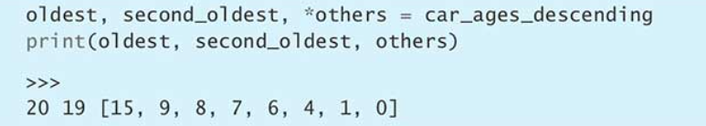
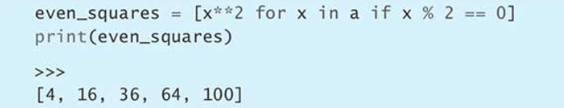

# effective python总结

## 1. unpacking直接拆分到多个变量里
```
item = ('a', 'b')
first, second = item

a, b = b, a

```

## 2. 尽量用enumerate取代range

## 3. 通过带星号的unpacking操作来捕获多个元素，不要用切片


## 4. 用get处理键不在字典中的情况，不要使用in与KeyError

## 5. 用列表推导取代map与filter


## 6. 优先考虑用deque实现生产者-消费者队列

## 7. 考虑用bisect搜索已排序的序列
Python内置的bisect模块可以更好地搜索有序列表。其中的bisect_left函数，能够迅速地对任何一个有序的序列执行二分搜索.