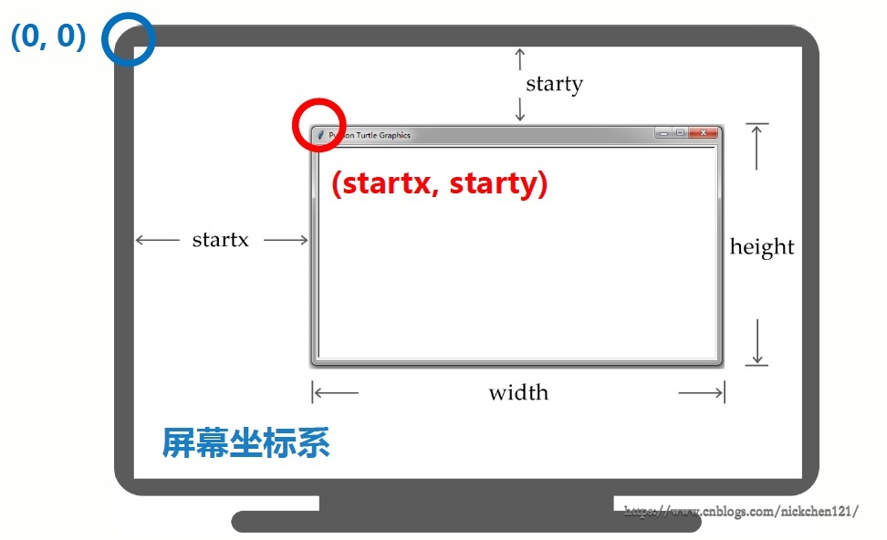

[toc]
## 1.Python 蟒蛇绘制
```
import turtle

turtle.setup(650, 350, 200, 200) 
turtle.penup()
turtle.fd(-250)
turtle.pendown()
turtle.pensize(25)
turtle.pencolor("purple") 
turtle.seth(-40)

for i in range(4):
    turtle.circle(40, 80) 
    turtle.circle(-40, 80) 

turtle.circle(40, 80/2)
turtle.fd(40)
turtle.circle(16, 180)
turtle.fd(40 * 2/3)
turtle.done()
```


## 2.turtle库
### 2.1 turtle库概述
**turtle(海龟)库是turtle绘图体系的Python实现**
- turtle绘图体系：1969年诞生，主要用于程序设计入门
- Python语言的标准库之一
- 入门级的图形绘制函数库

### 2.2turtle的原理
turtle(海龟)是一种真实的存在

- 有一只海龟，其实在窗体正中心，在画布上游走
- 走过的轨迹形成了绘制的图形
- 海龟由程序控制，可以变换颜色、改变宽度等

### 2.3turtle的绘图窗体

==turtle.setup(width, height, startx, starty)==

- setup()设置窗体大小及位置
- 4个参数中后两个可选
- setup()不是必须的


### 2.4turtle空间坐标体系
#### 绝对坐标

```
import turtle

turtle.goto( 100, 100)
turtle.goto( 100,-100)
turtle.goto(-100,-100)
turtle.goto(-100, 100)
turtle.goto(0,0)
import turtle

turtle.goto( 100, 100)
turtle.goto( 100,-100)
turtle.goto(-100,-100)
turtle.goto(-100, 100)
turtle.goto(0,0)
```


#### 海龟坐标


#### 角度坐标

**turtle.seth(angle)**

- seth()改变海龟行进方向
- angle为绝对度数
- seth()只改变方向但不行进


```
import turtle

turtle.left(45)
turtle.fd(150)
turtle.right(135)
turtle.fd(300)
turtle.left(135)
turtle.fd(150)
```


### 2.5RGB色彩体系
#### RGB色彩模式
==由三种颜色构成的万物色==

- RGB指红蓝绿三个通道的颜色组合
- 覆盖视力所能感知的所有颜色
- RGB每色取值范围0-255整数或0-1小数

默认采用小数值 可切换为整数值

**turtle.colormode(mode)**

- 1.0：RGB小数值模式
- 255：RGB整数值模式
- 
更换模式前：**turtle.pencolor('red')**；更换模式后：**turtle.pencolor(0,255,255) or turtle.pencolor(0,1,1)**

### 2.6画笔操作
- ==turtle.penup()== 别名 turtle.pu()：抬起画笔，海龟在飞行
- ==turtle.pendown()== 别名 turtle.pd()：落下画笔，海龟在爬行
- ==turtle.pensize(width)== 别名 turtle.width(width)：画笔宽度，海龟的腰围
- ==turtle.pencolor(color)== color为颜色字符串或r,g,b值：画笔颜色，海龟在涂装，pencolor(color)的color参与可以有三种形式


### 2.7turtle运动控制函数

- ==turtle.circle(r,extent=None)==：根据半径r绘制extent角度的弧形

r: 默认圆心在海龟左侧r距离的位置
extent: 绘制角度，默认是360度整圆
