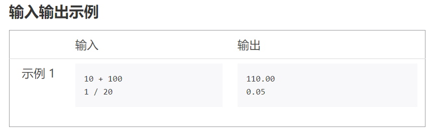

**python里的eval()函数是用来执行一个字符串表达式，并返回表达式的值。**
## 例题：数值运算
**描述**

获得用户输入的一个字符串，格式如下：‪‬‪‬‪‬‪‬‪‬‮‬‫‬‮‬‪‬‪‬‪‬‪‬‬

M OP N‪‬‪‬‪‬‪‬‪‬‮‬‫‬‮‬‪‬‪‬‪‬‪‬‪‬‮‬‪‬‫‬‪‬‪‬‪‬‪‬‪‬‮‬‪‬‫‬‪‬‪‬‪‬‪

其中，M和N是任何数字，OP代表一种操作，表示为如下四种：+, -, *, /（加减乘除）‪‬‪‬‪‬‪‬‪‬‮‬‫‬‮‬‪‬‪‬‪‬‪‬‪‬‮‬‪‬‫‬‪‬‪‬‪‬‪‬‪‬‮‬‪

根据OP，输出M OP N的运算结果，统一保存小数点后2位。‪‬‪‬‪‬‪‬‪‬‮‬‫‬‮‬‪‬‪‬‪‬‪‬‪‬‬

注意：M和OP、OP和N之间可以存在多个空格，不考虑输入错误情况。‪‬‪‬‪‬‪‬‪‬‮‬‫‬‮‬‪‬‪‬‪‬‪‬‪‬‮‬‪‬‫‬‪‬‪‬‪‬‪‬‪‬‮‬‪‬‫‬‪‬‪‬‪‬‪‬‪‬‮‬‪‬‬‪‬‪‬‪‬‪‬‮‬‪‬‭‬‪‬‪‬‪‬‪‬‪‬‮‬‪‬‮‬
```
s = eval(input())
print("{:.2f}".format(s))
```