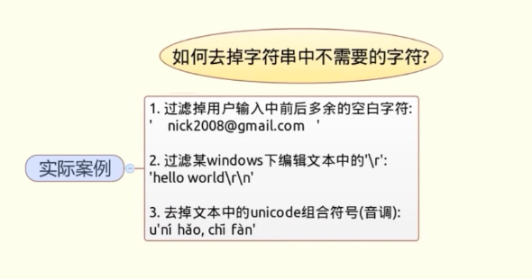

# 字符串处理相关问题
[toc]

## 一、拆分含有多种分隔符的字符串

### 连续使用str.split()方法

```python
def mySplit(s, ds):
    res = [s]
    
    for d in ds:
        t = []
        map(lambda x: t.extend(x.split(d)), res)
        res = t
    
    return [x for x in res if x] # 有效去除分割下的空字符串
    
mySplot(s, ';,|\t')
```

### 使用正则表达式的re.split()方法，一次性拆分字符串

```python
import re
re.split(r'[,;\t|]+', s)
```

> r 的作用是防止字符串转义

## 二、判断字符串a是否以字符串b开头或结尾

### 使用str.startwith()和str.endswitch()方法
> 多个匹配时参数使用元组

```python
name.endswith(('.sh', '.py'))
```

## 三、调整字符串中文本格式

### re.sub()利用正则表达式的捕获组，捕获每个部分内容，在替换字符串中调整各个捕获组的顺序

```python
re.sub('(\d{4})-(\d{2})-(\d{2})', r'\2/\3/\1', log)
```

## 四、多个小字符串拼接成大的字符串

### 方法一：迭代列表，连续使用“+”

```python
for p in pl:
    s += p
```

### 方法二：使用str.join()方法，更加快速的拼接列表中所有字符串。

```python
''.join(['abc', 'bcd', 'nnn'])
```

## 五、对字符串进行左，右，居中对齐

### 方法一：使用字符串的str.ljust(),str.rjust(),str.center()进行左，右，居中对齐。

```python
s = 'abc'

# 不加第二个参数默认用空白填充
s.ljust(20, '=')
s.rjust(20)
s.center(20)
```

### 方法二：使用format()方法，传递类似'<20','>20','^20'参数完成同样任务。

```python
format(s, '<20')
format(s, '>20')
format(s, '^20')
```

```python
# 解决实际问题
w = max(map(len, d.keys()))
for k in d:
    print k.ljust(w), ':', d[k]
```

## 六、去掉字符串中不需要的字符

++例子：++


## 方法一：字符串strip(),lstrip(),rstrip()方法去掉字符串两端字符。

```python
s = '   ---abc+++   '

s.strip()
s.lstrip()
s.rstrip()
s.strip('-+')
```

## 方法二：删除单个固定位置的字符，可以使用切片+拼接的方式。

```python
s = 'abc:123'

s[:3] + s[4:]
```

## 方法三：字符串中的replace()方法或正则表达式re.sub删除任意位置字符

```python
# 使用replace()
s = '\tabc\t123\txyz'

s.replace('\t', '')

# 使用re.sub
s = '\tabc\t123\txyz'

import re

re.sub('[\t\r]', '', s)
```

## 方法四：字符串translate()方法，可以同事删除多种不同字符。

```python
# translate()起映射的作用，传入的参数为映射表
s = 'abc123123xyz'

import string
string.maketrans('abcxyz', 'xyzabc')

s.translate(string.maketrans('abcxyz', 'xyzabc'))

s = 'abc\r\n\t'

s.translate(None, '\t\r\n')

# unicode.translate() 与 str.translate()不同
```