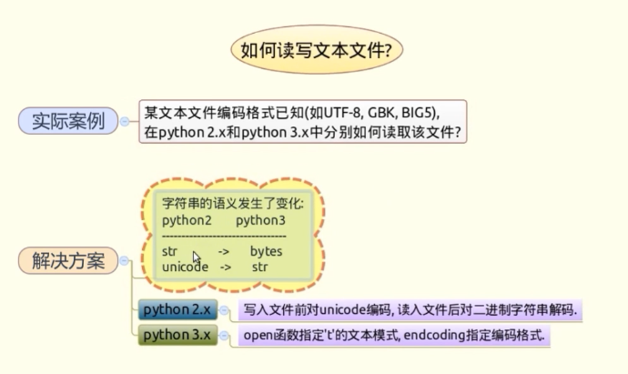
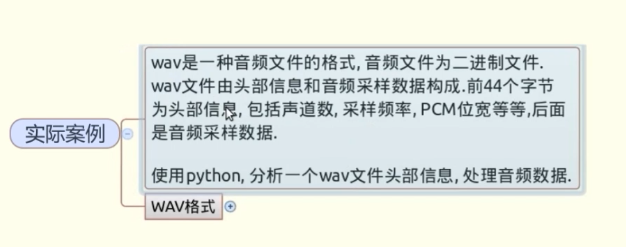
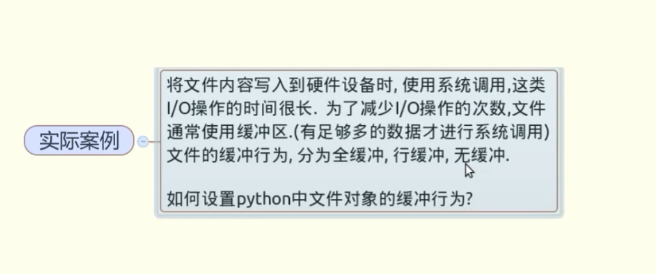
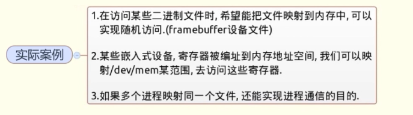
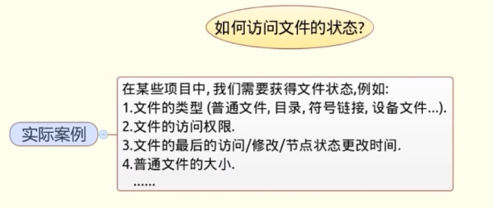
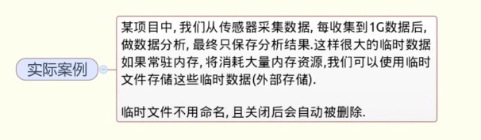

# 文件I/O效率相关问题与解决技巧
[toc]

## 一、读写文本文件

### Python2.x
```python
# 例子
s = u'您好'
s.encode('utf8')
s.encode('utf8').decode('utf8')

# 读写文件
f = open('py2.txt', 'w')
s = u'您好'
f.write(s.encode('gbk'))
f.close()

f = open('py2.txt', 'r')
t = f.read()
t.decode('gbk')
```

### Python3.x
```python
f = open('py3.txt', 'wt', encoding='utf8')
f.write('我爱编程')
f.close()

f = open('py3.txt', 'rt', encoding='utf8')
s = f.read()
print(s)

```

## 二、处理二进制文件

1. open函数想以二进制模式打开文件，指定mode参数为'b'.
2. 二进制数据可以用readinto，读入到提前分配好的buffer中，便于数据处理。
3. 解析二进制数据可以使用标准库中的struct模块的unpack方法。
```python
f = open('demo.wav', 'rb')
info = f.read(44)
import struct
struct.unpack('h', info[22:24])
struct.unpack('i', info[24:28])

import array
f.seek(0, 2)
f.tell()
n = (f.tell() - 44) / 2
buf = array.array('h', (0 for _ in xrange(n)))
f.seek(44)
f.readinfo(buf)
for i in xrange(n): buf[i] /= 8
f2 = open('demo2.wav', 'wb')
f2.write(info)
buf.tofile(f2)
f2.close()
```

> seek() 方法用于移动文件读取指针到指定位置。

fileObject.seek(offset[, whence]) 

- offset -- 开始的偏移量，也就是代表需要移动偏移的字节数

- whence：可选，默认值为 0。给offset参数一个定义，表示要从哪个位置开始偏移；0代表从文件开头开始算起，1代表从当前位置开始算起，2代表从文件末尾算起。

## 三、设置文件的缓冲


### 全缓冲
**open函数的buffering设置为大于1的整数n，n为缓冲区大小**
```python
f = open('demo2.txt', 'w', buffering = 2048)
```
### 行缓冲
**open函数的buffering设置为1**
```python
f = open('demo2.txt', 'w', buffering = 1)
```
### 无缓冲
**open函数的buffering设置为0**
```python
f = open('demo3.txt', 'w', buffering = 0)
```

## 四、文件映射到内存


## 使用mmap() 函数

```python
import mmap
import os
f = open('demo.bin', 'r+b')
m = mmap.mmap(f.fileno(), 0, access=mmap.ACCESS_WRITE)
```

## 五、访问文件的状态


### 系统调用
++标准库中os模块下的三个系统调用stat, fstat, lstat获取文件状态++
```python
import os
s = os.stat('a.txt')
s.st_mode # 文件类型
s.st_atime # 文件访问时间
s.st_mtime # 文件修改时间
s.st_ctime # 文件状态更新
s.st_size # 普通文件的大小

import stat
stat.S_ISDIR(s.st_mode) # 判断是否为文件夹
stat.S_ISREG # 判断是否为常规文件
stat.S_IRUSR # 判断文件的访问权限
```
### 快捷函数
++标准库中os.path下一些函数，使用起来更加简洁++
```python
import os
os.path.isdir('x.txt') # 等等很多，可以输入os.path. 来查询
```

## 六、使用临时文件

### 标准库tempfile下的temporaryFile，NamedTemporaryFile
```python
from tempfile import TemporaryFile, NamedTemporaryFile

f = TemporaryFile()
f.write('abcdef' * 100000)
f.seek(0)
f.read(100)

ntf = NamedTemporaryFile()
ntf.name
```