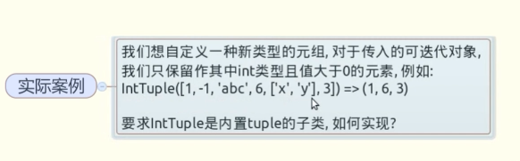
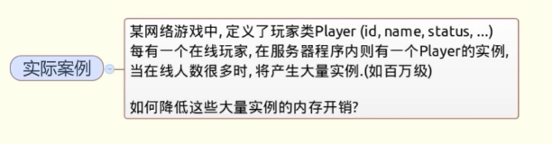
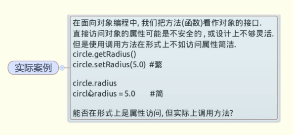
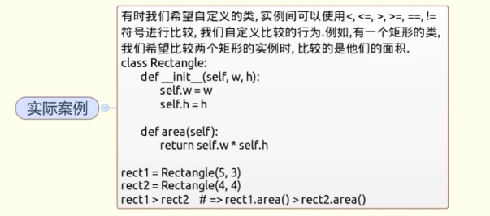
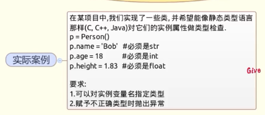
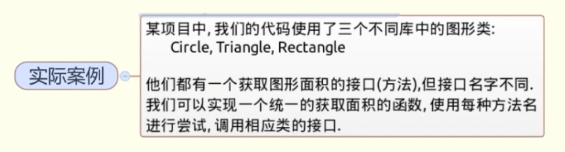
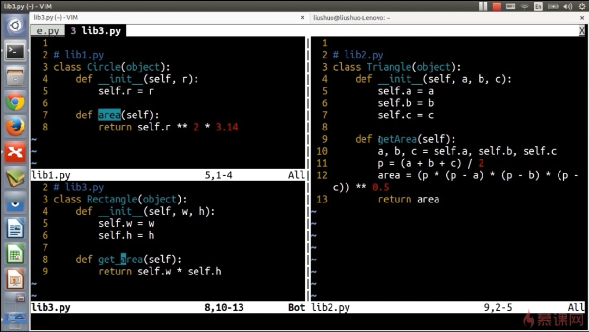

# 类与对象深度问题与解决技巧

## 一、派生内置不可变类型并修改其实例化行为

**定义类IntTuple继承内置tuple，并实现__new__,修改实例化行为。**

```python
class IntTuple(tuple):
    def __new__(cls, iterable):
        g = (x for x in iterable if isinstance(x, int) and x > 0)
        return super(IntTuple, cls).__new__(cls, g)
        
    def __init__(self, iterable):
        # before
        super(IntTuple, self).__init__(iterable)
        # after
    
    
t = IntTuple([1, -1, 'abc', 6, ['x', 'y'], 3])
print t
```

## 二、为创建大量实例节省内存


**定义类的__slots__属性，它是用来声明实例属性名字的列表。**

```python
class Player(object):
    def __init__(self, uid, name, status=0, level=1):
        self.uid = uid
        self.name = name
        self.status = status
        self.level = level
        
class Player2(object):
    __slots__ = ['uid', 'name', 'stat', 'level']
    def __init__(self, uid, name, status=0, level=1):
        self.uid = uid
        self.name = name
        self.status = status
        self.level = level
```

> 有__slots__属性的实例，将会没有__dict__，没法动态绑定，极大的减少了内存的占用

## 三、让对象支持上下文操作
**实现上下文管理协议，需定义实例的__enter__, __exit__方法，它们分别在with开始和结束时被调用。**
```python
from telnetlib import Telnet
from sys import stdin, stdout
from collections import deque

class TelnetClient(object):
    def __init__(self, addr, port=23):
        self.addr = addr
        self.port = port
        self.tn = None

    def start(self):
        raise Exception('Test')
        # user
        t = self.tn.read_until('login: ')
        stdout.write(t)
        user = stdin.readline()
        self.tn.write(user)

        # password
        t = self.tn.read_until('Password: ')
        if t.startswith(user[:-1]): t = t[len(user) + 1:]
        stdout.write(t)
        self.tn.write(stdin.readline())

        t = self.tn.read_until('$ ')
        stdout.write(t)
        while True:
            uinput = stdin.readline()
            if not uinput:
                break
            self.history.append(uinput)
            self.tn.write(uinput)
            t = self.tn.read_until('$ ')
            stdout.write(t[len(uinput) + 1:])

    def cleanup(self):
        pass

    def __enter__(self):
        self.tn = Telnet(self.addr, self.port)
        self.history = deque()
        return self 

    def __exit__(self, exc_type, exc_val, exc_tb):
        print 'In __exit__'

        self.tn.close()
        self.tn = None
        with open(self.addr + '_history.txt', 'w') as f:
            f.writelines(self.history)
        return True

with TelnetClient('127.0.0.1') as client:
    client.start()

print 'END'

'''
client = TelnetClient('127.0.0.1') 
print '\nstart...'
client.start()
print '\ncleanup'
client.cleanup()
'''
```

## 四、创建可管理的对象属性

**使用property函数来调用**
```python
from math import pi

class Circle(object):
    def __init__(self, radius):
        self.radius = radius

    def getRadius(self):
        return self.radius 

    def setRadius(self, value):
        if not isinstance(value, (int, long, float)):
            raise ValueError('wrong type.' )
        self.radius = float(value)

    def getArea(self):
        return self.radius ** 2 * pi

    R = property(getRadius, setRadius)

c = Circle(3.2)
print c.R
c.R = 'abcc'
print c.R
```

## 五、如何让类支持比较操作


### 比较运算符号重载，需要实现以下方法：__lt__, __le__,__gt__,__ge__,__eq__,__ne__

```python
class Rectangle(object):
    def __init__(self, w, h):
        self.w = w
        self.h = h
        
    def area(self):
        return self.w * self.h
        
    def __lt__(self, obj):
        print 'in__lt__'
        return self.area() < obj.area()
    
    def __le__(self, obj):
        print 'in__le__'
        return self.area() <= obj.area()
        
r1 = Rectangle(5, 3)
r2 = Rectangle(4, 4)

print r1 <= r2
```

### 标准库下的functools下的类装饰器total_ordering 可以简化此过程。

```python
from functools import total_ordering

@total_ordering
class Rectangle(object):
    def __init__(self, w, h):
        self.w = w
        self.h = h
        
    def area(self):
        return self.w * self.h
        
    def __lt__(self, obj):
        print 'in__lt__'
        return self.area() < obj.area()
    
    def __eq__(self, obj):
        print 'in__le__'
        return self.area() == obj.area()
        
r1 = Rectangle(5, 3)
r2 = Rectangle(4, 4)
```
> 用了@total_ordering可以只用重载__lt__和__eq__就能做到各种符号的比较

## 六、使用描述符对实例属性做类型检查


```python
class Attr(object):
    def __init__(self, name, type_):
        self.name = name
        self.type_ = type_

    def __get__(self, instance, cls):
        return instance.__dict__[self.name]

    def __set__(self, instance, value):
        if not isinstance(value, self.type_):
            raise TypeError('expected an %s' % self.type_)
        instance.__dict__[self.name] = value

    def __delete__(self, instance):
        raise AttributeError("can't delete this attr")

class Person(object):
    name    = Attr('name', str)
    age     = Attr('age', int) 
    height  = Attr('height', float)
    weight  = Attr('weight', float)

s = Person()
s.name = 'Bob'
s.age = 17
s.height = 1.82
s.weight = 52.5
```

## 七、通过实例方法字符串来调用方法


### 方法一：使用内置函数getattr，通过名字在实例上获取对象的方法，然后调用

```python
def getArea(shape):
    for name in ('area', 'getArea', 'get_area'):
        f = getattr(shape, name, None)
        if f:
            return f()
            
shape1 = Circle(2)
shape2 = Triangle(3, 4, 5)
shape3 = Rectangle(6, 4)

shapes = [shape1, shape2, shape3]

print map(getaArea, shapes)
```

### 方法二：使用标准库中的Operator下的methodcaller函数调用

```python
from operator import methodcaller

s = 'abcd123abc'
s.find('abc', 4)
methodcaller('find', 'abc', '4')
```