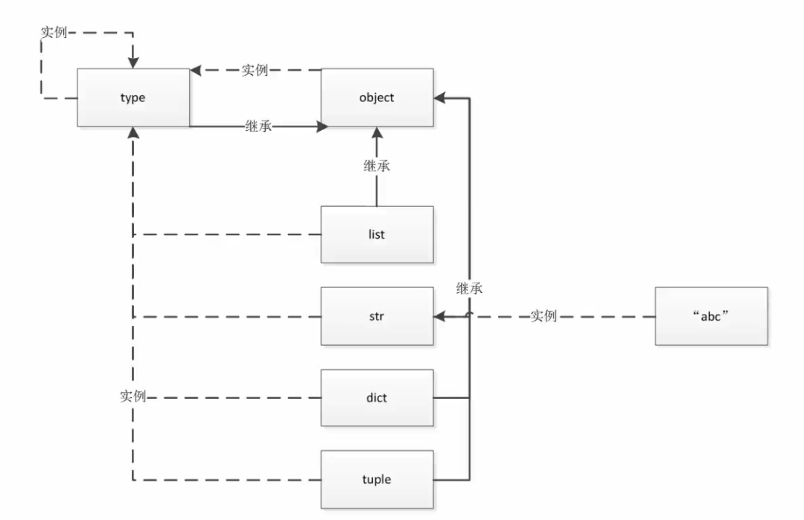

# Python中一切皆对象

## 一切皆对象
- Python的面向对象更彻底
- Python的函数和类都是对象，而java是由class和object的区别的
### 1.赋值给一个变量
```python
# 函数
def ask(name='wychmod'):
    print(name)

my_func = ask
my_func('wyx')

# 类
class Person:
    def __init__(self):
        print('abc')
    
my_class = Person
my_class()
```
### 2.可以添加到集合对象中
```python
obj_list = []
obj_list.append(ask)
obj_list.append(Person)
for item in obj_list:
    print(item())

# 结果
wychmod
None
abc
<__main__.Person object at 0x0000024C09276788>
```
> 函数没有返回值的时候会返回none，类会返回他本身
### 3.可以作为参数传递给函数
```python
def ask(name='wychmod'):
    print(name)
    
def decorator_func(ask):
    ask()

my_ask = decorator_func
my_ask(ask)
```
### 4.可以当做函数的返回值
```python
def ask(name='wychmod'):
    print(name)
    
def decorator_func():
    print('123')
    return ask

my_ask = decorator_func()
my_ask('wyx')

# 结果
123
wyx
```

## type、object和class的关系
1. **type -> int -> 1**
1. **type -< class -> obj**
1. **object 是最顶层基类**
1. **type也是也是一个类，同时type也是一个对象**
1. **object是type的实例，同时，object又是type的基类**

```python
>>> a=1
>>> b="abc"
>>> print(type(1))
<class 'int'>
>>> print(type(int))
<class 'type'>
>>> print(type(b))
<class 'str'>
>>> print(type(str))
<class 'type'>

>>> stu = Student()
>>> print(type(stu))
<class '__main__.Student'>
>>> print(type(Student))
<class 'type'>
>>> print(int.__bases__)
(<class 'object'>,)
>>> print(str.__bases__)
(<class 'object'>,)
>>> print(Student.__bases__)
(<class 'object'>,)
>>> print(type.__bases__)
(<class 'object'>,)
>>> print(object.__bases__)
()
>>> print(type(object))
<class 'type'>
```
> 一切皆为对象？这里对于一部分人来说，可能不是很容易理解。这么说吧，在python里，int整形是对象，整数2也是对象，你定义的函数啊，类啊都是对象，你定义的变量也是对象。总之，你在python里能用到的都可以称之为对象。

## Python中的常见内置类型
### 1.对象的三个特征
- 身份(地址)
- 类型
- 值

**地址可以通过id(xx)来查询内存地址**

### 2.None全局只有一个。
> 初始会有解释器生成一个全局的None，假如a=None，b=None，a和b的地址是相同的。

### 3.数值
- int
- float
- complex(复数)
- bool

### 4.迭代类型
> 可以用for循环进行遍历

### 5.序列类型
- list
- bytes、bytearray、memoryview（二进制序列）
- range
- tuple
- str
- array

### 6.映射(dict)
> 有key和map

### 7.集合
- set
- frozenset
> 实现原理和dict一样，效率都很高

### 8.上线文管理类型(with)

### 9.其他
- 模块类型
- class和实例
- 函数类型
- 方法类型
- 代码类型
- object对象
- type类型
- ellipsis类型(省略号)
- notimplemented类型