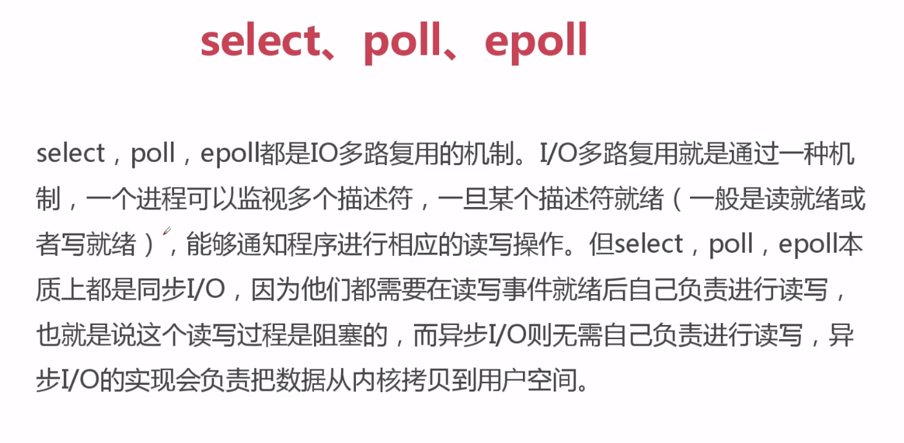
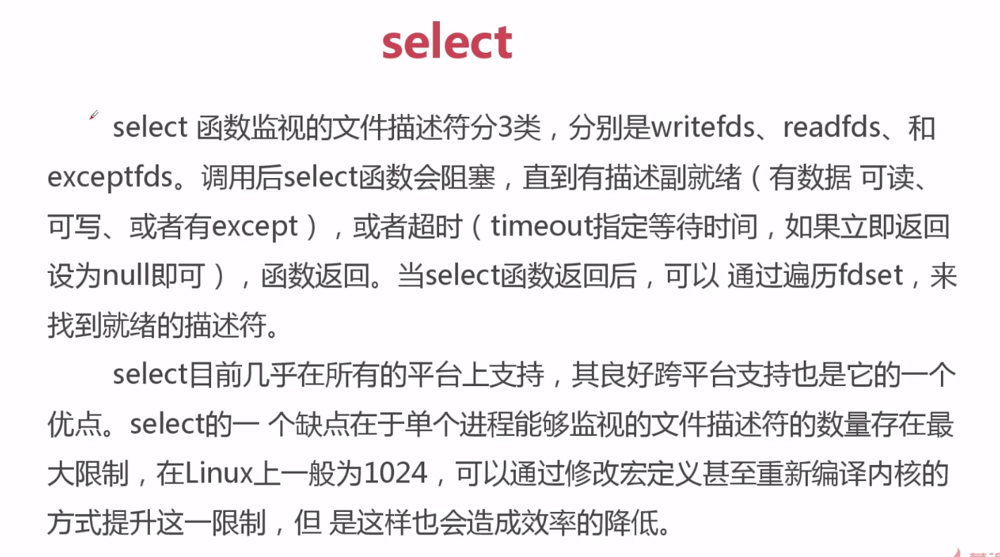
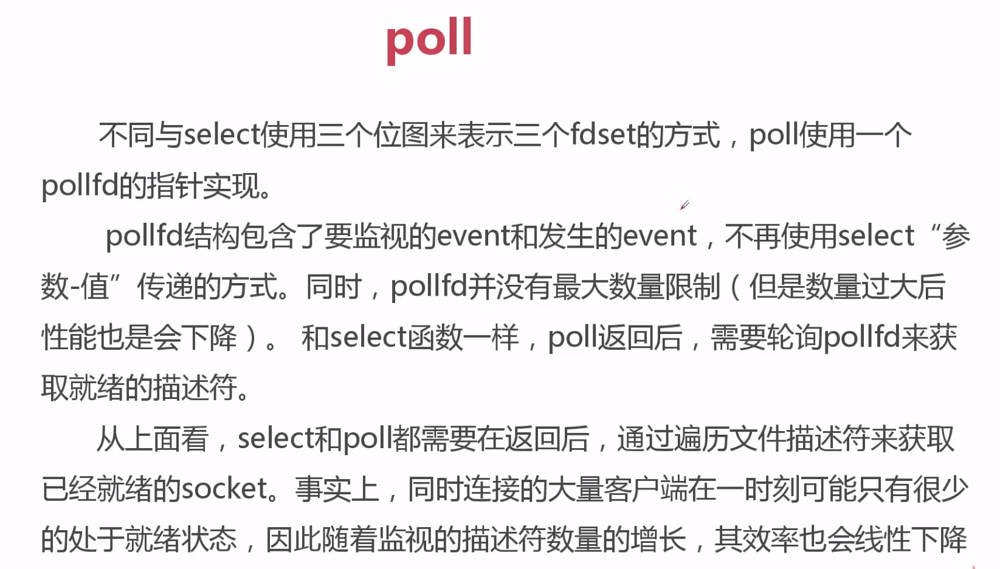
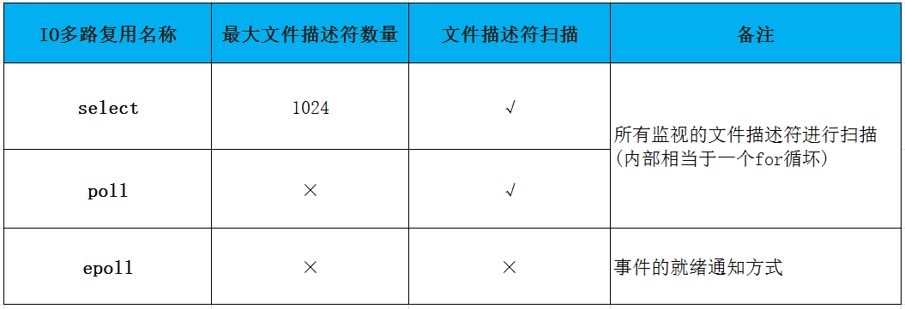

# 协程和异步io
[toc]
## 并发、并行、同步、异步、阻塞、非阻塞
### 并发和并行：
- **并发是指一个时间段内,有几个程序在同一个cpu上运行，但是任意时刻只有一个程序在cpu上运行。**
- **并行是指在任意时刻点上，有多个程序同时运行在多个cpu上（并行的数量个cpu的数量有关），cpu是有限的，高并行不太现实。**

### 同步和异步：
- **同步是指代码调用io操作时，必须等待io操作完成才返回的调用方式。**
- **异步是指代码调用io操作时，不必等待io操作完成才返回的调用方式。**

### 阻塞和非阻塞：
- **阻塞是指调用函数时候当前线程被挂起。**
- **非阻塞是指调用函数时候当前线程不会被挂起，而是立即返回。**

## C10K问题和io多路复用(select、poll、epoll)
### C10K问题
**C10K问题是一个在1999年被提出来的计数挑战：**

    如何在一颗1GHz CPU，2G内存、1gbps网络环境下，让单台服务器同时为1万个客户端提供FTP服务
    
### Unix下五种IO模型
- 阻塞式I/O
- 非阻塞式I/O
- I/O复用
- 信号驱动式IO
- 异步IO(POSIX的aio_系列函数)

### select、poll、epoll


### select


### poll


### epoll


**epoll并不代表一定比select好：**
- 在并发高，连接活跃度不是很高的情况下，epoll比select好
- 在并发不高，但是连接活跃度很高的情况下，select比epoll好

## epoll+回调+事件循环方式url
```
# 通过非阻塞io实现http请求
import socket
from urllib.parse import urlparse
from selectors import DefaultSelector, EVENT_READ, EVENT_WRITE

selector = DefaultSelector()

urls = ['http://www.baidu.com']
stop = False


# 使用select完成http请求
class Fetcher:
    def connected(self, key):
        # 注销事件
        selector.unregister(key.fd)
        self.client.send("GET {} HTTP/1.1\r\nHost:{}\r\nConnection:close\r\n\r\n".format(self.path, self.host).encode('utf-8'))
        #
        selector.register(self.client.fileno(), EVENT_READ, self.readable)

    def readable(self, key):
        d = self.client.recv(1024)
        if d:
            self.data += d
        else:
            # 注销
            selector.unregister(key.fd)
            self.data = self.data.decode('utf-8')
            html_data = self.data.split('\r\n\r\n')[1]
            print(self.data)
            print(html_data)
            self.client.close()
            urls.remove(self.spider_url)
            if not urls:
                global stop
                stop = True

    def get_url(self, url):
        self.spider_url = url
        # 通过socket请求html
        url = urlparse(url)
        self.host = url.netloc
        self.path = url.path
        self.data = b""
        if self.path == '':
            self.path = '/'

        # 建立连接
        self.client = socket.socket(socket.AF_INET, socket.SOCK_STREAM)
        self.client.setblocking(False)

        try:
            self.client.connect((self.host, 80))
        except BlockingIOError as e:
            pass

        # 注册事件
        selector.register(self.client.fileno(), EVENT_WRITE, self.connected)
        """
        register(fileobj, events, data=None)
        fileobj：文件描述符
        events：监听事件
        data：回调函数
        
        """


def loop():
    # 事件循环，不停的请求socket的状态并调用对应的回调函数
    # 1.select本身是不支持register模式。
    # 2.socket状态变化以后的回调是由程序员完成的。
    while not stop:
        # windows下会报错，但是linux下不会报错
        ready = selector.select()
        for key, mask in ready:
            call_back = key.data
            call_back(key)


if __name__ == '__main__':
    fetcher = Fetcher()
    fetcher.get_url('http://www.baidu.com')
    loop()
```

## 回调之痛
1. 可读性差
2. 共享状态管理困难
3. 异常处理困难

## IO多路复用（select、poll、epoll）介绍及select、epoll的实现
**IO多路复用中包括 select、pool、epoll，这些都属于同步，还不属于异步**
### 一、IO多路复用介绍
#### 1.select
select最早于1983年出现在4.2BSD中，它通过一个select()系统调用来监视多个文件描述符的数组，当select()返回后，该数组中就绪的文件描述符便会被内核修改标志位，使得进程可以获得这些文件描述符从而进行后续的读写操作。

select目前几乎在所有的平台上支持，其良好跨平台支持也是它的一个优点，事实上从现在看来，这也是它所剩不多的优点之一。

select的一个缺点在于单个进程能够监视的文件描述符的数量存在最大限制，在Linux上一般为1024，不过可以通过修改宏定义甚至重新编译内核的方式提升这一限制。

另外，select()所维护的存储大量文件描述符的数据结构，随着文件描述符数量的增大，其复制的开销也线性增长。同时，由于网络响应时间的延迟使得大量TCP连接处于非活跃状态，但调用select()会对所有socket进行一次线性扫描，所以这也浪费了一定的开销。

#### 2.poll
poll在1986年诞生于System V Release 3，它和select在本质上没有多大差别，但是poll没有最大文件描述符数量的限制。

　　poll和select同样存在一个缺点就是，包含大量文件描述符的数组被整体复制于用户态和内核的地址空间之间，而不论这些文件描述符是否就绪，它的开销随着文件描述符数量的增加而线性增大。

　　另外，select()和poll()将就绪的文件描述符告诉进程后，如果进程没有对其进行IO操作，那么下次调用select()和poll()的时候将再次报告这些文件描述符，所以它们一般不会丢失就绪的消息，这种方式称为水平触发（Level Triggered）。

#### 3.epoll
直到Linux2.6才出现了由内核直接支持的实现方法，那就是epoll，它几乎具备了之前所说的一切优点，被公认为Linux2.6下性能最好的多路I/O就绪通知方法。

　　epoll可以同时支持水平触发和边缘触发（Edge Triggered，只告诉进程哪些文件描述符刚刚变为就绪状态，它只说一遍，如果我们没有采取行动，那么它将不会再次告知，这种方式称为边缘触发），理论上边缘触发的性能要更高一些，但是代码实现相当复杂。

　　epoll同样只告知那些就绪的文件描述符，而且当我们调用epoll_wait()获得就绪文件描述符时，返回的不是实际的描述符，而是一个代表就绪描述符数量的值，你只需要去epoll指定的一个数组中依次取得相应数量的文件描述符即可，这里也使用了内存映射（mmap）技术，这样便彻底省掉了这些文件描述符在系统调用时复制的开销。

　　另一个本质的改进在于epoll采用基于事件的就绪通知方式。在select/poll中，进程只有在调用一定的方法后，内核才对所有监视的文件描述符进行扫描，而epoll事先通过epoll_ctl()来注册一个文件描述符，一旦基于某个文件描述符就绪时，内核会采用类似callback的回调机制，迅速激活这个文件描述符，当进程调用epoll_wait()时便得到通知。

#### 4、sellect、poll、epoll三者的区别


### 二、select IO多路复用
Python的select()方法直接调用操作系统的IO接口，它监控sockets,open files, and pipes(所有带fileno()方法的文件句柄)何时变成readable 和writeable, 或者通信错误，select()使得同时监控多个连接变的简单，并且这比写一个长循环来等待和监控多客户端连接要高效，因为select直接通过操作系统提供的C的网络接口进行操作，而不是通过Python的解释器。

select目前几乎在所有的平台上支持，其良好跨平台支持也是它的一个优点。select的一 个缺点在于单个进程能够监视的文件描述符的数量存在最大限制，在Linux上一般为1024，可以通过修改宏定义甚至重新编译内核的方式提升这一限制，但是这样会造成效率的降低
　
#### 1、select语法：
```
select(rlist, wlist, xlist, timeout=None)
```
select()方法接收并监控3个通信列表， 第一个rlist监控所有要进来的输入数据，第二个wlist是监控所有要发出去的输出数据,第三个监控异常错误数据，第四个设置指定等待时间，如果想立即返回，设为null即可，最后需要创建2个列表来包含输入和输出信息来传给select()，让select方法通过内核去监控,然后生成三个实例。
```
#建立两个列表，比如想让内核去检测50个连接，需要传给它一个列表，就是这个inputs（列表中里面存放的是需要被内核监控的链接），然后交给select，就相当于交给内核了
inputs = [server,] #输入列表，监控所有输入数据

outputs = []  #输入列表，监控所有输出数据

#把两个列表传给select方法通过内核去监控，生成三个实例
readable,writeable,exceptional = select.select(inputs,outputs,inputs)  # 这里select方法的第三个参数同样传入input列表是因为，input列表中存放着所有的链接，比如之前放入的50被监控链接中有5个断了，出现了异常，就会输入到exceptional里面，但这5链接本身是放在inputs列表中
```

#### 2、select服务端代码实例：
```python
import select,socket,queue
server = socket.socket()
server.bind(("localhost",9000))
server.listen(1000)
server.setblocking(False) #设置为非阻塞
msg_dic = dict() #定义一个队列字典
inputs = [server,]  #由于设置成非阻塞模式，accept和recive都不阻塞了，没有值就会报错，因此最开始需要最开始需要监控服务端本身，等待客户端连接
outputs = [] 
while True:
    #exceptional表示如果inputs列表中出现异常，会输出到这个exceptional中
    readable,writeable,exceptional = select.select(inputs,outputs,inputs)#如果没有任何客户端连接，就会阻塞在这里 
    for r in readable:# 没有个r代表一个socket链接
        if r is server:  #如果这个socket是server的话，就说明是是新客户端连接了
            conn,addr = r.accept() #新连接进来了,接受这个连接，生成这个客户端实例
            print("来了一个新连接",addr)
            inputs.append(conn)#为了不阻塞整个程序,我们不会立刻在这里开始接收客户端发来的数据, 把它放到inputs里, 下一次loop时,这个新连接
            #就会被交给select去监听
            msg_dic[conn] = queue.Queue() #初始化一个队列，后面存要返回给这个客户端的数据
        else: #如果不是server，就说明是之前建立的客户端来数据了
            data = r.recv(1024)
            print("收到数据：",data)
            msg_dic[r].put(data)#收到的数据先放到queue里,一会返回给客户端
            outputs.append(r)#为了不影响处理与其它客户端的连接 , 这里不立刻返回数据给客户端
            # r.send(data)
            # print("send done....")
    for w in writeable:  #要返回给客户端的链接列表
        data_to_client = msg_dic[w].get()
        w.send(data_to_client)   #返回给客户端的源数据
        outputs.remove(w)  #确保下次循环的时候writeable,不返回这个已经处理完的这个连接了
 
    for e in exceptional:  #处理异常的连接
        if e in outputs:   #因为e不一定在outputs，所以先要判断
            outputs.remove(e)
        inputs.remove(e)   #删除inputs中异常连接
        del msg_dic[e]   #删除此连接对应的队列
```
### 三、epoll IO多路复用
**epoll的方式，这种效率更高，但是这种方式在Windows下不支持，在Linux是支持的，selectors模块就是默认使用就是epoll，但是如果在windows系统上使用selectors模块，就会找不到epoll，从而使用select。**
#### 1、selectors语法：
```
#定义一个对象
sel = selectors.DefaultSelector()

#注册一个事件
sel.register(server,selectors.EVENT_READ,accept)
#注册事件，只要来一个连接就调accept这个函数，
就相当于之前select的用法，
sel.register(server,selectors.EVENT_READ,accept) ==  inputs=[server,]，
readable,writeable,exceptional = select.select(inputs,outputs,inputs)意思是一样的。
```
#### 2、selectors代码实例：
```
import selectors,socket
 
sel = selectors.DefaultSelector()
 
def accept(sock,mask):
    "接收客户端信息实例"
    conn,addr = sock.accept()
    print("accepted",conn,'from',addr)
    conn.setblocking(False)
    sel.register(conn,selectors.EVENT_READ,read)  #新连接注册read回调函数
 
def read(conn,mask):
    "接收客户端的数据"
    data = conn.recv(1024)
    if data:
        print("echoing",repr(data),'to',conn)
        conn.send(data)
    else:
        print("closing",conn)
        sel.unregister(conn)
        conn.close()
 
server = socket.socket()
server.bind(('localhost',9999))
server.listen(500)
server.setblocking(False)
sel.register(server,selectors.EVENT_READ,accept)  #注册事件，只要来一个连接就调accept这个函数,
#sel.register(server,selectors.EVENT_READ,accept) == inputs=[server,]
 
while True:
    events = sel.select()  #这个select,看起来是select，有可能调用的是epoll，看你操作系统是Windows的还是Linux的
                           #默认阻塞，有活动连接就返回活动连接列表
    print("事件：",events)
    for key,mask in events:
        callback = key.data #相当于调accept了
        callback(key.fileobj,mask)  #key.fileobj=文件句柄
```
打印服务端：
```
[(SelectorKey(fileobj=<socket.socket fd=436, family=AddressFamily.AF_INET, type=SocketKind.SOCK_STREAM, proto=0, laddr=('127.0.0.1', 2222)>, fd=436, events=1, data=<function accept at 0x0000022296063E18>), 1)]
accepted <socket.socket fd=508, family=AddressFamily.AF_INET, type=SocketKind.SOCK_STREAM, proto=0, laddr=('127.0.0.1', 2222), raddr=('127.0.0.1', 50281)> from ('127.0.0.1', 50281)
事件： [(SelectorKey(fileobj=<socket.socket fd=508, family=AddressFamily.AF_INET, type=SocketKind.SOCK_STREAM, proto=0, laddr=('127.0.0.1', 2222), raddr=('127.0.0.1', 50281)>, fd=508, events=1, data=<function read at 0x00000222980501E0>), 1)]
echoing b'adas' to <socket.socket fd=508, family=AddressFamily.AF_INET, type=SocketKind.SOCK_STREAM, proto=0, laddr=('127.0.0.1', 2222), raddr=('127.0.0.1', 50281)>
事件： [(SelectorKey(fileobj=<socket.socket fd=508, family=AddressFamily.AF_INET, type=SocketKind.SOCK_STREAM, proto=0, laddr=('127.0.0.1', 2222), raddr=('127.0.0.1', 50281)>, fd=508, events=1, data=<function read at 0x00000222980501E0>), 1)]
echoing b'HA' to <socket.socket fd=508, family=AddressFamily.AF_INET, type=SocketKind.SOCK_STREAM, proto=0, laddr=('127.0.0.1', 2222), raddr=('127.0.0.1', 50281)>
事件： [(SelectorKey(fileobj=<socket.socket fd=508, family=AddressFamily.AF_INET, type=SocketKind.SOCK_STREAM, proto=0, laddr=('127.0.0.1', 2222), raddr=('127.0.0.1', 50281)>, fd=508, events=1, data=<function read at 0x00000222980501E0>), 1)]
echoing b'asdHA' to <socket.socket fd=508, family=AddressFamily.AF_INET, type=SocketKind.SOCK_STREAM, proto=0, laddr=('127.0.0.1', 2222), raddr=('127.0.0.1', 50281)>
```
> 这样就容易明白：callback = key.data #第一次调用的是accept，第二次调用的是read    callback(key.fileobj,mask)  #key.fileobj=文件句柄

**客户端代码：**

在Linux端，selectors模块才能是epoll
```python
import socket,sys
 
messages = [ b'This is the message. ',
             b'It will be sent ',
             b'in parts.',
             ]
server_address = ('localhost', 9999)
 
# 创建100个 TCP/IP socket实例
socks = [ socket.socket(socket.AF_INET, socket.SOCK_STREAM) for i in range(100)]
 
# 连接服务端
print('connecting to %s port %s' % server_address)
for s in socks:
    s.connect(server_address)
 
for message in messages:
 
    # 发送消息至服务端
    for s in socks:
        print('%s: sending "%s"' % (s.getsockname(), message) )
        s.send(message)
 
    # 从服务端接收消息
    for s in socks:
        data = s.recv(1024)
        print( '%s: received "%s"' % (s.getsockname(), data) )
        if not data:
            print(sys.stderr, 'closing socket', s.getsockname() )
```

## C10M问题和协程
### 回调模式的问题：
1. 回调模式编码复杂度高
2. 同步编程的并发性不高
3. 多线程编程需要线程间同步，lock

### 回调变协程：
1. 采用同步的方式去编写异步的
2. 使用单线程去切换任务：
    1. 线程是由操作系统切换的，单线程切换意味着需要我们程序员自己去调度任务
    2. 不在需要锁，并发性高，如果单线程内切换函数，性能远高于线程切换，并发性高。
### 协程是什么？
**协程--可以暂停的函数（可以向暂停的地方传入值）**

---
协程，又称微线程，纤程。英文名Coroutine。

协程的概念很早就提出来了，但直到最近几年才在某些语言（如Lua）中得到广泛应用。

子程序，或者称为函数，在所有语言中都是层级调用，比如A调用B，B在执行过程中又调用了C，C执行完毕返回，B执行完毕返回，最后是A执行完毕。

所以子程序调用是通过栈实现的，一个线程就是执行一个子程序。

子程序调用总是一个入口，一次返回，调用顺序是明确的。而协程的调用和子程序不同。

协程看上去也是子程序，但执行过程中，在子程序内部可中断，然后转而执行别的子程序，在适当的时候再返回来接着执行。

注意，在一个子程序中中断，去执行其他子程序，不是函数调用，有点类似CPU的中断。比如子程序A、B：
```
def A():
    print '1'
    print '2'
    print '3'

def B():
    print 'x'
    print 'y'
    print 'z'
```
假设由协程执行，在执行A的过程中，可以随时中断，去执行B，B也可能在执行过程中中断再去执行A，结果可能是：
```
1 1
2 2
3 x
4 y
5 3
6 z
```
但是在A中是没有调用B的，所以协程的调用比函数调用理解起来要难一些。

看起来A、B的执行有点像多线程，但协程的特点在于是一个线程执行，那和多线程比，协程有何优势？

最大的优势就是协程极高的执行效率。因为子程序切换不是线程切换，而是由程序自身控制，因此，没有线程切换的开销，和多线程比，线程数量越多，协程的性能优势就越明显。

第二大优势就是不需要多线程的锁机制，因为只有一个线程，也不存在同时写变量冲突，在协程中控制共享资源不加锁，只需要判断状态就好了，所以执行效率比多线程高很多。

因为协程是一个线程执行，那怎么利用多核CPU呢？最简单的方法是多进程+协程，既充分利用多核，又充分发挥协程的高效率，可获得极高的性能。

Python对协程的支持还非常有限，用在generator中的yield可以一定程度上实现协程。虽然支持不完全，但已经可以发挥相当大的威力了。

来看例子：

传统的生产者-消费者模型是一个线程写消息，一个线程取消息，通过锁机制控制队列和等待，但一不小心就可能死锁。

如果改用协程，生产者生产消息后，直接通过yield跳转到消费者开始执行，待消费者执行完毕后，切换回生产者继续生产，效率极高：
```
import time

def consumer():
    r = ''
    while True:
        n = yield r
        if not n:
            return
        print('[CONSUMER] Consuming %s...' % n)
        time.sleep(1)
        r = '200 OK'

def produce(c):
    c.next()
    n = 0
    while n < 5:
        n = n + 1
        print('[PRODUCER] Producing %s...' % n)
        r = c.send(n)
        print('[PRODUCER] Consumer return: %s' % r)
    c.close()

if __name__=='__main__':
    c = consumer()
    produce(c)
```
执行结果：
```
[PRODUCER] Producing 1...
[CONSUMER] Consuming 1...
[PRODUCER] Consumer return: 200 OK
[PRODUCER] Producing 2...
[CONSUMER] Consuming 2...
[PRODUCER] Consumer return: 200 OK
[PRODUCER] Producing 3...
[CONSUMER] Consuming 3...
[PRODUCER] Consumer return: 200 OK
[PRODUCER] Producing 4...
[CONSUMER] Consuming 4...
[PRODUCER] Consumer return: 200 OK
[PRODUCER] Producing 5...
[CONSUMER] Consuming 5...
[PRODUCER] Consumer return: 200 OK
```
注意到consumer函数是一个generator（生成器），把一个consumer传入produce后：

首先调用c.next()启动生成器；

然后，一旦生产了东西，通过c.send(n)切换到consumer执行；

consumer通过yield拿到消息，处理，又通过yield把结果传回；

produce拿到consumer处理的结果，继续生产下一条消息；

produce决定不生产了，通过c.close()关闭consumer，整个过程结束。

整个流程无锁，由一个线程执行，produce和consumer协作完成任务，所以称为“协程”，而非线程的抢占式多任务。

最后套用Donald Knuth的一句话总结协程的特点：

“子程序就是协程的一种特例。”

## 生成器的send和yield from
### 1.send方法
```
def gen_func():
    # 1.可以产出值   2.可以接收值(调用方传递的值)
    html = yield 'http://projectsedu.com'
    print(html)
    yield 2
    yield 3
    return 'zy'


if __name__ == '__main__':
    # 生成生成器对象
    gen = gen_func()
    # 在调用send发送非None值之前，我们必须启动一次生成器，方式有两种1.gen.send(None)，2.next(gen)
    url = gen.send(None)
    # download html
    html = 'zy'
    # send()可以传递值进入生成器内部，同时重启生成器执行到下一个yield位置
    print(gen.send(html))

    # print(next(gen))
    # print(next(gen))
    # print(next(gen))
```
### 2.close方法
```python
def gen_func():
    yield 'http://projectsedu.com'
    yield 2
    yield 3
    return 'zy'


if __name__ == '__main__':
    # 生成生成器对象
    gen = gen_func()
    print(next(gen))
    gen.close()
    print(next(gen))

Traceback (most recent call last):
http://projectsedu.com
  File "C:/Users/Administrator/Python/imooc/Generator/generator_close.py", line 17, in <module>
    print(next(gen))
StopIteration
```
### 3.throw方法
```
def gen_func():
    try:
        yield 'http://projectsedu.com'
    except Exception as e:
        pass
    yield 2
    yield 3
    return 'zy'


if __name__ == '__main__':
    # 生成生成器对象
    gen = gen_func()
    print(next(gen))
    # 在生成器暂停的地方抛出类型为 type 的异常，并返回下一个 yield 的返回值。
    print(gen.throw(Exception, 'download error'))
    print(next(gen))
```

### 生成器进阶--yield from
1. main 调用方 g1(委托生成器) gen 子生成器
2. yield from会在调用方与子生成器之间建立一个双向通道
3. **yield from 处理了StopIteration的异常**
```
from itertools import chain
# 用yield from模仿chain函数
def my_chain(*args, **kwargs):
    for my_iterable in args:
        yield from my_iterable
        # for value in my_iterable:
        #     yield value

for value in my_chain(my_list, my_dict, range(5,10)):
    print(value)
```
> python3.3新加了yield from语法

```
#!/usr/bin/env python
# -*- coding:utf-8 -*-

final_result = {}


# 子生成器
def sales_sum(pro_name):
    total = 0
    nums = []
    while True:
        x = yield
        print(pro_name+'销量: ', x)
        if not x:
            break
        total += x
        nums.append(x)
    return total, nums


# 委托生成器
def middle(key):
    while True:
        final_result[key] = yield from sales_sum(key)
        print(key+'销量统计完成！！.')


# 调用方
def main():
    data_sets = {
        '小米9': [1200, 1500, 3000],
        '小米8': [28, 55, 98, 108],
        '小米5': [200, 560, 778, 70],
    }
    for key, data_set in data_sets.items():
        print('start key:', key)
        m = middle(key)
        # 预激middle协程
        m.send(None)
        for value in data_set:
            # 给协程传递每一组的值
            m.send(value)
        # 结束
        m.send(None)
    print('final_result:', final_result)


if __name__ == '__main__':
    main()
```
**yield的实现代码模拟**：
```
"""
_i：子生成器，同时也是一个迭代器
_y：子生成器生产的值
_r：yield from 表达式最终的值
_s：调用方通过send()发送的值
_e：异常对象

"""
_i = iter(EXPR)      # EXPR是一个可迭代对象，_i其实是子生成器；
try:
    _y = next(_i)   # 预激子生成器，把产出的第一个值存在_y中；
except StopIteration as _e:
    _r = _e.value   # 如果抛出了`StopIteration`异常，那么就将异常对象的`value`属性保存到_r，这是最简单的情况的返回值；
else:
    while 1:    # 尝试执行这个循环，委托生成器会阻塞；
        _s = yield _y   # 生产子生成器的值，等待调用方`send()`值，发送过来的值将保存在_s中；
        try:
            _y = _i.send(_s)    # 转发_s，并且尝试向下执行；
        except StopIteration as _e:
            _r = _e.value       # 如果子生成器抛出异常，那么就获取异常对象的`value`属性存到_r，退出循环，恢复委托生成器的运行；
            break
RESULT = _r     # _r就是整个yield from表达式返回的值。
```
1. 子生成器可能只是一个迭代器，并不是一个作为协程的生成器，所以它不支持.throw()和.close()方法；
2. 如果子生成器支持.throw()和.close()方法，但是在子生成器内部，这两个方法都会抛出异常；
3. 调用方让子生成器自己抛出异常
4. 当调用方使用next()或者.send(None)时，都要在子生成器上调用next()函数，当调用方使用.send()发送非 None 值时，才调用子生成器的.send()方法；
5. 子生成器生产的值，都是直接传给调用方的；调用方通过.send()发送的值都是直接传递给子生成器的；如果发送的是 None，会调用子生成器的__next__()方法，如果不是 None，会调用子生成器的.send()方法；
6. 子生成器退出的时候，最后的return EXPR，会触发一个StopIteration(EXPR)异常；
7. yield from表达式的值，是子生成器终止时，传递给StopIteration异常的第一个参数；
8. 如果调用的时候出现StopIteration异常，委托生成器会恢复运行，同时其他的异常会向上 "冒泡"；
9. 传入委托生成器的异常里，除了GeneratorExit之外，其他的所有异常全部传递给子生成器的.throw()方法；如果调用.throw()的时候出现了StopIteration异常，那么就恢复委托生成器的运行，其他的异常全部向上 "冒泡"；
10. 如果在委托生成器上调用.close()或传入GeneratorExit异常，会调用子生成器的.close()方法，没有的话就不调用。如果在调用.close()的时候抛出了异常，那么就向上 "冒泡"，否则的话委托生成器会抛出GeneratorExit异常。


## 生成器如何变成协程？

## async和await原生协程
**python3.5之后，才引入了原生协程的语法**
await 相当于 yield from， 在async中不能yield，await只能出现在async中
```
async def downloader(url):
    return "bobby"

async def download_url(url):
    #dosomethings
    html = await downloader(url)
    # print(html)
    return html

if __name__ == "__main__":
    coro = download_url("http://www.imooc.com")
    # next(coro)不能使用这种方式调用
    try:
        coro.send(None)
    except StopIteration as e:
        a = e.value
    print(a)

```