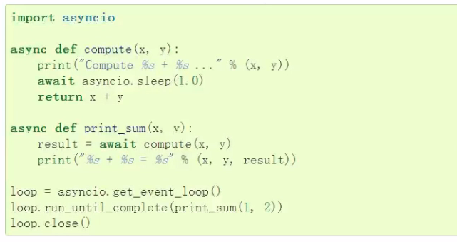
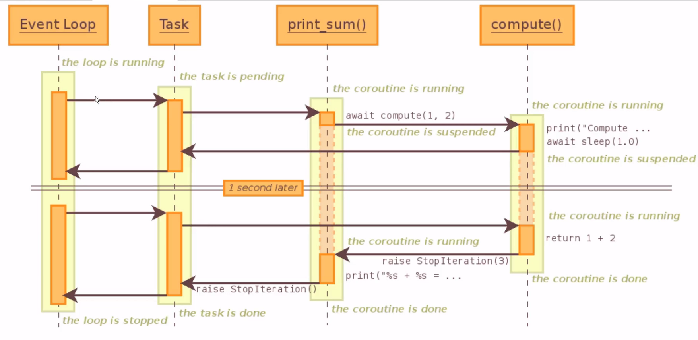

# asyncio并发编程
[toc]
## 事件循环
### asyncio
- 包含各种特定系统实现的模块化事件循环
- 传输和协议抽象
- 对TCP、UDP、SSL、子进程、延时调用以及其他的具体支持
- 模仿 futures模块但适用于事件循环使用的 Futurea类
- 基于 yield from的协议和任务,可以让你用顺序的方式编写并发代码
- 必须使用一个将产生阻塞O的调用时,有接口可以把这个事件转移到线程池
- 模仿 threading模块中的同步原语、可以用在单线程内的协程之间
### 使用asyncio
```
# 事件循环+回调（驱动生成器）+epoll（IO多路复用）
# asyncio是python用于解决异步io编程的一整套解决方案
# tornado、gevent、twisted（scrapy，django channels）
# torando(实现web服务器)， django+flask(uwsgi, gunicorn+nginx)
# tornado可以直接部署， nginx+tornado

# 使用asyncio
import asyncio
import time


async def get_html(url):
    """
    声明一个协程
    """
    print('start get url')
    await asyncio.sleep(2)
    print('end get url')


if __name__ == '__main__':
    start_time = time.time()
    # 创建loop
    loop = asyncio.get_event_loop()
    tasks = [get_html('http://www.imooc.com') for i in range(10)]
    # 将任务提交
    loop.run_until_complete(asyncio.wait(tasks))
    print(time.time() - start_time)
```

### 获取协程的返回值
```
import asyncio
import time
from functools import partial


async def get_html(url):
    """
    声明一个协程
    """
    print('start get url')
    await asyncio.sleep(2)
    print('end get url')
    return 'zy'


def callback(url, future):
    print(url)
    print('send email to zy')


if __name__ == '__main__':
    start_time = time.time()
    # 创建loop
    loop = asyncio.get_event_loop()
    get_future = asyncio.ensure_future(get_html('http://www.imooc.com'))
    # tasks = loop.create_task(get_html('http://www.imooc.com'))
    #
    get_future.add_done_callback(partial(callback, 'http://www.imooc.com'))
    # 将任务提交
    loop.run_until_complete(get_future)
    # 获取返回值
    print(get_future.result())
    print(time.time() - start_time)
```
> 类func = functools.partial(func, *args, **keywords)

> func: 需要被扩展的函数，返回的函数其实是一个类 func 的函数
*args: 需要被固定的位置参数
**kwargs: 需要被固定的关键字参数
 如果在原来的函数 func 中关键字不存在，将会扩展，如果存在，则会覆盖
### wait和gather
**wait和gather 用来提交多个协程任务。**
```
# wait和gather
import asyncio
import time


async def get_html(url):
    """
    声明一个协程
    """
    print('start get url')
    await asyncio.sleep(2)
    print('end get url')


if __name__ == '__main__':
    start_time = time.time()
    # 创建loop
    loop = asyncio.get_event_loop()
    # tasks = [get_html('http://www.imooc.com') for i in range(10)]
    # # 一次提交多个任务
    # loop.run_until_complete(asyncio.gather(*tasks))

    # wait和gather的区别
    # gather更加high-level
    group1 = [get_html('http://www.imooc.com') for i in range(10)]
    group2 = [get_html('http://www.baidu.com') for i in range(10)]
    group1 = asyncio.gather(*group1)
    group2 = asyncio.gather(*group2)

    loop.run_until_complete(asyncio.gather(group1, group2))
    print(time.time() - start_time)
```

## task取消和协程嵌套
### task取消
```
import asyncio
import time


async def get_html(sleep_time):
    print('waiting')
    await asyncio.sleep(sleep_time)
    print('done after {}s'.format(sleep_time))


if __name__ == '__main__':
    task1 = get_html(2)
    task2 = get_html(3)
    task3 = get_html(3)

    tasks = [task1, task2, task3]

    loop = asyncio.get_event_loop()

    try:
        loop.run_until_complete(asyncio.gather(*tasks))
    except KeyboardInterrupt as e:
        # KeyboardInterrupt 是按Ctrl+C终止程序时抛出的异常
        # 获取所有的task
        all_tasks = asyncio.Task.all_tasks()
        for task in all_tasks:
            print('cancel task')
            print(task.cancel())
        loop.stop()
        loop.run_forever()
    finally:
        loop.close()
```
### 协程嵌套



## call_soon、call_later、call_at、call_soon_threadsafe
### call_soon、call_soon_threadsafe 即可执行
```
import asyncio


def callback(sleep_times):
    print('sleep {} success'.format(sleep_times))


def stop_loop(loop):
    loop.stop()


if __name__ == '__main__':
    loop = asyncio.get_event_loop()
    # 即刻执行
    loop.call_soon(callback, 2)
    loop.call_soon(stop_loop, loop)
    loop.run_forever()
```
> call_soon_threadsafe是线程安全的即刻执行。

### call_later
**call_later，指定时间之后再运行，执行的顺序和指定的时间有关，cal_soon比call_later优先执行**
```python
import asyncio


def callback(sleep_times):
    print('sleep {} success'.format(sleep_times))


def stop_loop(loop):
    loop.stop()


if __name__ == '__main__':
    loop = asyncio.get_event_loop()
    # 指定时间之后再运行
    loop.call_later(1, callback, 1)
    loop.call_later(2, callback, 2)
    loop.call_later(3, callback, 3)
    # loop.call_soon(stop_loop, loop)
    loop.run_forever()
"""    
sleep 1 success
sleep 2 success
sleep 3 success
"""
```

### call_at
**call_at 也是指定时间之后再执行，但是这个时间时loop里面的时间**
```python
import asyncio


def callback(sleep_times, loop):
    print('sleep {} success, loop time {} '.format(sleep_times, loop.time()))


def stop_loop(loop):
    loop.stop()


if __name__ == '__main__':
    loop = asyncio.get_event_loop()
    now = loop.time()
    # 指定时间之后再运行
    loop.call_at(now+1, callback, 1, loop)
    loop.call_at(now+2, callback, 2, loop)
    loop.call_at(now+3, callback, 3, loop)
    # loop.call_soon(stop_loop, loop)
    loop.run_forever()
"""
sleep 1 success, loop time 2861146.171
sleep 2 success, loop time 2861147.171
sleep 3 success, loop time 2861148.171
"""
```

## ThreadPoolExecutor+asyncio
**使用多线程：在协程中集成阻塞io。**
```
# 使用多线程：在协程中集成阻塞io
import asyncio
import socket
import time
from urllib.parse import urlparse
from concurrent.futures import ThreadPoolExecutor


def get_url(url):
    # 通过socket请求html
    url = urlparse(url)
    host = url.netloc
    path = url.path
    if path == '':
        path = '/'

    # 建立连接
    client = socket.socket(socket.AF_INET, socket.SOCK_STREAM)
    client.connect((host, 80))

    client.send("GET {} HTTP/1.1\r\nHost:{}\r\nConnection:close\r\n\r\n".format(path, host).encode('utf-8'))

    data = b""
    while True:
        d = client.recv(1024)
        if d:
            data += d
        else:
            break

    data = data.decode('utf-8')
    html_data = data.split('\r\n\r\n')[1]
    print(html_data)
    client.close()


if __name__ == '__main__':
    start_time = time.time()
    loop = asyncio.get_event_loop()
    excutor = ThreadPoolExecutor(3)
    tasks = []
    for url in range(1, 21):
        url = 'http://shop.projectsedu.com/goods/{}/'.format(url)
        task = loop.run_in_executor(excutor, get_url, url)
        tasks.append(task)
    loop.run_until_complete(asyncio.wait(tasks))
    print('last time:{}'.format(time.time() - start_time))
```

## asyncio模拟http请求
```
#asyncio 没有提供http协议的接口 aiohttp
import asyncio
import socket
from urllib.parse import urlparse


async def get_url(url):
    #通过socket请求html
    url = urlparse(url)
    host = url.netloc
    path = url.path
    if path == "":
        path = "/"

    #建立socket连接
    reader, writer = await asyncio.open_connection(host,80)
    writer.write("GET {} HTTP/1.1\r\nHost:{}\r\nConnection:close\r\n\r\n".format(path, host).encode("utf8"))
    all_lines = []
    async for raw_line in reader:
        data = raw_line.decode("utf8")
        all_lines.append(data)
    html = "\n".join(all_lines)
    # print(html)
    return html

if __name__ == "__main__":
    import time
    start_time = time.time()
    loop = asyncio.get_event_loop()
    tasks = []
    for url in range(20):
        url = "http://shop.projectsedu.com/goods/{}/".format(url)
        tasks.append(get_url(url)) # 想要获取结果可以用下面这种方式。
        tasks.append(asyncio.ensure_future(get_url(url)))
    loop.run_until_complete(asyncio.wait(tasks))
    for task in tasks:
        print(task.result())
    print('last time:{}'.format(time.time()-start_time))
```
**优化版:asyncio.as_completed返回的是一个协程**
```
import asyncio
import time
from urllib.parse import urlparse


async def get_url(url):
    url = urlparse(url)
    host = url.netloc
    path = url.path
    if path == '':
        path = '/'

    # 建立连接
    # asyncio.open_connection是一个协程
    reader, writer = await asyncio.open_connection(host, 80)
    writer.write("GET {} HTTP/1.1\r\nHost:{}\r\nConnection:close\r\n\r\n".format(path, host).encode('utf-8'))
    all_lines = []
    async for raw_line in reader:
        line = raw_line.decode('utf-8')
        all_lines.append(line)
    html = '\n'.join(all_lines)
    return html


async def main():
    tasks = []
    for url in range(1, 21):
        url = 'http://shop.projectsedu.com/goods/{}/'.format(url)
        tasks.append(asyncio.ensure_future(get_url(url)))
    for task in asyncio.as_completed(tasks):
        # asyncio.as_completed返回的是一个协程
        result = await task
        print(result)


if __name__ == '__main__':
    start_time = time.time()
    loop = asyncio.get_event_loop()
    loop.run_until_complete(main())
    print('last time:{}'.format(time.time() - start_time))
```

## future和task
**task是future的一个子类，task是协程和future之间的桥梁**

**task启动协程(会先完成协程里的第一次启动)，保持和线程池的接口一致**

## asyncio同步和通信
```
import asyncio
from asyncio import Lock, Queue # queue 的get 前面要有await
cache = {}
lock = Lock()


async def get_stuff(url):
    # lock.acquire()是一个协程
    # await lock.acquire()
    # with await lock
    # Lock实现了__enter__和__exit__可以使用with语法
    async with lock:
        if url in cache:
            return cache[url]
        stuff = await aiohttp.request('GET', url)
        cache[url] = stuff
        return stuff


async def parse_stuff():
    stuff = await get_stuff()
    # do some parsing


async def use_stuff():
    stuff = await get_stuff()
    # use stuff to do something interesting


if __name__ == '__main__':
    tasks = [parse_stuff(), use_stuff()]
    loop = asyncio.get_event_loop()
    loop.run_until_complete(asyncio.wait(tasks))
```
## aiohttp实现高并发爬虫    
```
# asyncio爬虫、去重、入库

import asyncio
import re

import aiohttp
import aiomysql
from pyquery import PyQuery
from aiohttp import TCPConnector


start_url = 'http://www.xbiquge.la/paihangbang/'
waitting_urls = []
seen_urls = set()
stopping = False

sem = asyncio.Semaphore(3)


async def fetch(url, session):
    async with sem:
        try:
            async with session.get(url) as resp:
                print('url status: {}'.format(resp.status))
                if resp.status in [200, 201]:
                    data = await resp.text()
                    return data
        except Exception as e:
            print(e)


def extract_urls(html):
    pq = PyQuery(html)
    for link in pq.items('a'):
        url = link.attr('href')
        if url and url.startswith('http') and url not in seen_urls:
            global waitting_urls
            waitting_urls.append(url)


async def init_urls(url, session):
    html = await fetch(url, session)
    seen_urls.add(url)
    extract_urls(html)


async def article_handle(url, session, pool):
    # 获取文章详情并解析入库
    html = await fetch(url, session)
    seen_urls.add(url)
    extract_urls(html)
    pq = PyQuery(html)
    title = pq("title").text()
    # title = title + '\n'
    async with pool.acquire() as conn:
        async with conn.cursor() as cur:
            insert_sql = "INSERT INTO article_test VALUES('{}')".format(title)
            print(insert_sql)
            await cur.execute(insert_sql)
    # 文件操作
    # with open('aiohttp_spider.txt', mode='a', encoding='utf-8') as file_object:
    #     file_object.write(title)


async def consumer(pool, session):
    while not stopping:
        if len(waitting_urls) == 0:
                await asyncio.sleep(0.5)
                continue

        url = waitting_urls.pop()
        print('start get url: {}'.format(url))
        if re.match('http://www.xbiquge.la/\d+/\d+/', url):
            if url not in seen_urls:
                asyncio.ensure_future(article_handle(url, session, pool))
        else:
            if url not in seen_urls:
                asyncio.ensure_future(init_urls(url, session))


async def main(loop):
    # 等待mysql连接建立好
    pool = await aiomysql.create_pool(host='127.0.0.1', port=3306,
                                      user='root', password='123456',
                                      db='aiomysql_test', loop=loop,
                                      charset='utf8', autocommit=True)

    session = aiohttp.ClientSession()
    html = await fetch(start_url, session)
    seen_urls.add(start_url)
    extract_urls(html)

    asyncio.ensure_future(consumer(pool, session))


if __name__ == '__main__':
    loop = asyncio.get_event_loop()
    asyncio.ensure_future(main(loop))
    loop.run_forever()
```