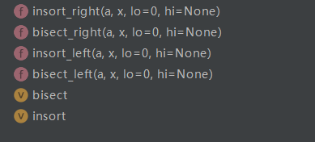

# 自定义序列类
[toc]
## 序列类型的分类
### 容器序列 list、tuple、deque
> 可以存入任意的数据类型
### 扁平序列 str、bytes、bytearray、array.array
> array.array 里面存入的数据类型必须保持一致，str和bytearray是一个作用，一个可变一个不可变。
### 可变序列 list， deque，bytearray、array
### 不可变 str、tuple、bytes

## 序列的abc继承关系
序列类型主要继承Sequence和MutableSequence这两个类型，前者可变后者不可变。
```
Sequence as Sequence,
MutableSequence as MutableSequence,

Iterator = _alias(collections.abc.Iterator, T_co) # 可迭代
Reversible = _alias(collections.abc.Reversible, T_co) # 可翻转
Sized = _alias(collections.abc.Sized, ())  # Not generic. # 可len
Collection = _alias(collections.abc.Collection, T_co) # 可以 if in
```

## 序列的+、+=和extend的区别
### a+b
a+b会返回一个新的对象，但是同类型只能和同类型相加
### +=
+=会调用内部的extend方法，只要是可迭代对象都能相加，是可迭代对象里的值取出来相加。
### extend()

```
    def extend(self, *args, **kwargs): # real signature unknown
        """ Extend list by appending elements from the iterable. """
        pass
```
### append()
会直接将传入append的元素添加到list下一个位置，不会从遍历其中元素。
```
    def append(self, *args, **kwargs): # real signature unknown
        """ Append object to the end of the list. """
        pass
```

## 实现可切片的对象
### 可切片对象
**模式[start:end:step]**

    其中，第一个数字start表示切片开始位置，默认为0；
    第二个数字end表示切片截止（但不包含）位置（默认为列表长度）；
    第三个数字step表示切片的步长（默认为1）。
    当start为0时可以省略，当end为列表长度时可以省略，
    当step为1时可以省略，并且省略步长时可以同时省略最后一个冒号。
    另外，当step为负整数时，表示反向切片，这时start应该比end的值要大才行。
```
aList = [3, 4, 5, 6, 7, 9, 11, 13, 15, 17]
print (aList[::])  # 返回包含原列表中所有元素的新列表
print (aList[::-1])  # 返回包含原列表中所有元素的逆序列表
print (aList[::2])  # 隔一个取一个，获取偶数位置的元素
print (aList[1::2])  # 隔一个取一个，获取奇数位置的元素
print (aList[3:6])  # 指定切片的开始和结束位置
aList[0:100]  # 切片结束位置大于列表长度时，从列表尾部截断
aList[100:]  # 切片开始位置大于列表长度时，返回空列表

aList[len(aList):] = [9]  # 在列表尾部增加元素
aList[:0] = [1, 2]  # 在列表头部插入元素
aList[3:3] = [4]  # 在列表中间位置插入元素
aList[:3] = [1, 2]  # 替换列表元素，等号两边的列表长度相等
aList[3:] = [4, 5, 6]  # 等号两边的列表长度也可以不相等
aList[::2] = [0] * 3  # 隔一个修改一个
print (aList)
aList[::2] = ['a', 'b', 'c']  # 隔一个修改一个
aList[::2] = [1,2]  # 左侧切片不连续，等号两边列表长度必须相等
aList[:3] = []  # 删除列表中前3个元素

del aList[:3]  # 切片元素连续
del aList[::2]  # 切片元素不连续，隔一个删一个
```
### 实现可切片操作对象
实现__getitem__可以实现切片功能，当切片的时候传入函数的item是slice对象，当取某个元素的时候传入的是int类型。

```
import numbers
class Group:
    # 支持切片操作
    def __init__(self, group_name, company_name, staffs):
        self.group_name = group_name
        self.company_name = company_name
        self.staffs = staffs

    def __reversed__(self):
        self.staffs.reverse()

    def __getitem__(self, item):
        cls = type(self)
        if isinstance(item, slice):
            return cls(group_name=self.group_name, company_name=self.company_name, staffs=self.staffs[item])
        elif isinstance(item, numbers.Integral):
            return cls(group_name=self.group_name, company_name=self.company_name, staffs=[self.staffs[item]])

    def __len__(self):
        return len(self.staffs)

    def __iter__(self):
        return iter(self.staffs)

    def __contains__(self, item):
        if item in self.staffs:
            return True
        else:
            return False
```

## bisect管理可排序序列
bisect 有多个函数：


insort = insort_right是根据二分查找的插入，插入在元素之后。
bisect是查找序列中的元素，也是查找第几个元素之前还是第几个元素。
```
import bisect
from collections import deque

# 用来处理已排序的序列，用来维持已排序的序列， 升序
# 二分查找
inter_list = deque()
bisect.insort(inter_list, 3)
bisect.insort(inter_list, 2)
bisect.insort(inter_list, 5)
bisect.insort(inter_list, 1)
bisect.insort(inter_list, 6)
```

## array只能存放指定的数据类型
```
import array
# array和list的一个重要区别， array只能存放指定的数据类型
my_array = array.array("i")
my_array.append(1)
```
## 列表推导式、生成器表达式、字典推导式
### 列表推导式：
```
[x*y for x in range(1,5) if x > 2 for y in range(1,4) if y < 3]
# 他的执行顺序是:
for x in range(1,5)
    if x > 2
        for y in range(1,4)
            if y < 3
                x*y
```
### 生成器表达式:
**生成器表达式和列表推导式的语法基本是一样的。只是把 [] 替换成 ()**
```
gen = (i for i in range(10))
print(gen)
 
结果:
<generator object <genexpr> at 0x106768f10>
#  打印的结果就是一个生成器。我们可以使用for循环来循环这个生成器：
gen = ("麻花藤我第%s次爱你" % i for i in range(10))
for i in gen:
     print(i)
```
### 字典推导式:
```
# 把字典中的key和value互换 
dic = {'a': 1, 'b': '2'} 
new_dic = {dic[key]: key for key in dic} 
print(new_dic) 

# 在以下list中. 从lst1中获取的数据和lst2中相对应的位置的数据组成一个新字典 
lst1 = ['jay', 'jj', 'sylar'] 
lst2 = ['周杰伦', '林俊杰', '邱彦涛'] 
dic = {lst1[i]: lst2[i] for i in range(len(lst1))} 
print(dic)
```
> 列表生成式操作性能高于列表操作