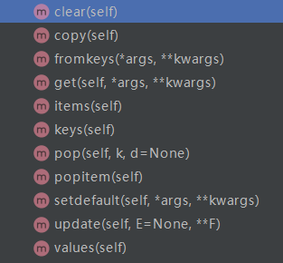
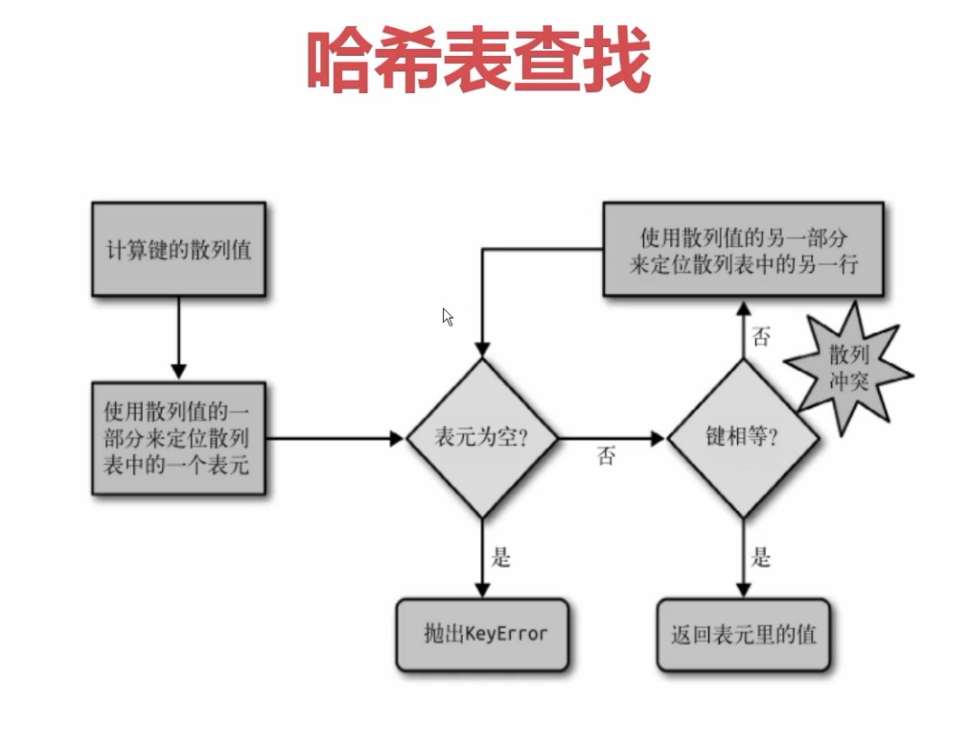

# 深入Python的set和dict
[toc]
## collections中的abc
dict属于mapping类型
```
from collections.abc import Mapping, MutableMapping

a = {}
print (isinstance(a, MutableMapping))
结果：
true
```
## dict的常见用法
dict的方法都是用cPython写的，内核是c语言写的。

```
    def clear(self): # real signature unknown; restored from __doc__
        """ D.clear() -> None.  Remove all items from D. """
        pass

    def copy(self): # real signature unknown; restored from __doc__
        """ D.copy() -> a shallow copy of D """
        pass

    @staticmethod # known case
    def fromkeys(*args, **kwargs): # real signature unknown
        """ Create a new dictionary with keys from iterable and values set to value. """
        pass

    def get(self, *args, **kwargs): # real signature unknown
        """ Return the value for key if key is in the dictionary, else default. """
        pass

    def items(self): # real signature unknown; restored from __doc__
        """ D.items() -> a set-like object providing a view on D's items """
        pass

    def keys(self): # real signature unknown; restored from __doc__
        """ D.keys() -> a set-like object providing a view on D's keys """
        pass

    def pop(self, k, d=None): # real signature unknown; restored from __doc__
        """
        D.pop(k[,d]) -> v, remove specified key and return the corresponding value.
        If key is not found, d is returned if given, otherwise KeyError is raised
        """
        pass

    def popitem(self): # real signature unknown; restored from __doc__
        """
        D.popitem() -> (k, v), remove and return some (key, value) pair as a
        2-tuple; but raise KeyError if D is empty.
        """
        pass

    def setdefault(self, *args, **kwargs): # real signature unknown
        """
        Insert key with a value of default if key is not in the dictionary.
        
        Return the value for key if key is in the dictionary, else default.
        """
        pass

    def update(self, E=None, **F): # known special case of dict.update
        """
        D.update([E, ]**F) -> None.  Update D from dict/iterable E and F.
        If E is present and has a .keys() method, then does:  for k in E: D[k] = E[k]
        If E is present and lacks a .keys() method, then does:  for k, v in E: D[k] = v
        In either case, this is followed by: for k in F:  D[k] = F[k]
        """
        pass

    def values(self): # real signature unknown; restored from __doc__
        """ D.values() -> an object providing a view on D's values """
        pass
```

## dict的子类
 不建议继承list和dict,不建议继承用c语言实现的数据结构，因为如果重载了魔法函数，可能不会调用该函数，还是去调用c语言的结构。
```
class Mydict(dict):
    def __setitem__(self, key, value):
        super().__setitem__(key, value*2)

my_dict = Mydict(one=1)
my_dict["one"] = 1
print (my_dict)
```
UserDict 可以用来实现dict的继承，这个是用Python重写实现的dict。
```
from collections import UserDict

class Mydict(UserDict):
    def __setitem__(self, key, value):
        super().__setitem__(key, value*2)

my_dict = Mydict(one=1)
# my_dict["one"] = 1
print (my_dict)
```
defaultdict 重写了__missing__这个方法，可以设置默认的类型，当查询不到key对应的值时会返回默认数据类型的值。比如list对应[ ]，str对应的是空字符串，set对应set( )，int对应0.
```
from collections import defaultdict

dict1 = defaultdict(int)
dict2 = defaultdict(set)
dict3 = defaultdict(str)
dict4 = defaultdict(list)
dict1[2] ='two'

print(dict1[1])
print(dict2[1])
print(dict3[1])
print(dict4[1])
```

## set和frozenset
set 集合 fronzenset (不可变集合) 无序， 不重复
```
s = set('abcdee')
s = set(['a','b','c','d','e'])
s = {'a','b', 'c'}
s = frozenset("abcde") #frozenset 可以作为dict的key
# 向set添加数据
another_set = set("cef")
re_set = s.update(another_set) # add是添加新的元素，update是将两个set合并。
```

## dict和set实现原理
1. **dict查找的性能远远大于list**
2. **在list中随着list数据的增大 查找时间会增大**
3. **在dict中查找元素不会随着dict的增大而增大**
4. **dict的key或者set的值 都必须是可以hash的**
5. **不可变对象 都是可hash的， str， fronzenset， tuple，自己实现的类 \_\_hash__**
6. **dict的内存花销大，但是查询速度快， 自定义的对象 或者python内部的对象都是用dict包装的**
7. **dict的存储顺序和元素添加顺序有关**
8. **添加数据有可能改变已有数据的顺序**
