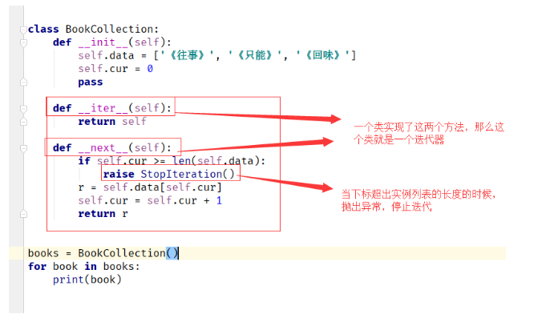

# 迭代器和生成器
[toc]
## python的迭代协议
**迭代器是访问集合内元素的一种方式，一般用来遍历数据,迭代器和以下标的访问方式不一样， 迭代器是不能返回的, 迭代器提供了一种惰性方式数据的方式**
- Iterable--可迭代--需要实现__iter__
- Iterator--迭代器--需要实现__iter__和__next__

list、tuple等都是可迭代对象，我们可以通过iter()函数获取这些可迭代对象的迭代器。然后我们可以对获取到的迭代器不断使⽤next()函数来获取下⼀条数据。iter()函数实际上就是调⽤了可迭代对象的\_\_iter__⽅法。
```
from collections.abc import Iterable, Iterator
a = [1,2]
iter_rator = iter(a)
print (isinstance(a, Iterable))
print (isinstance(iter_rator, Iterator))
```
> 当我们已经迭代完最后⼀个数据之后，再次调⽤next()函数会抛出 StopIteration的异常，来告诉我们所有数据都已迭代完成，不⽤再执⾏ next()函数了。

## 什么是迭代器和可迭代对象
**可迭代对象**:
- 可以被 for in 遍历的对象

**迭代器**:
- 迭代器是一个对象
- 迭代器只能使用一次
- 迭代器一定是一个可迭代对象，可迭代对象不一定是一个迭代器，迭代器是一个对象class
```
#!/user/bin/env python
# -*- coding:utf-8 -*-

from collections.abc import Iterator


class Company:
    def __init__(self, employee_list):
        self.employee = employee_list

    def __iter__(self):
        return MyIterator(self.employee)


class MyIterator(Iterator):
    def __init__(self, employee_list):
        self.iter_list = employee_list
        self.index = 0

    def __next__(self):
        # 真正返回迭代值的逻辑
        try:
            word = self.iter_list[self.index]
        except IndexError:
            raise StopIteration
        self.index += 1
        return word


if __name__ == '__main__':
    company = Company(['tom', 'bob', 'jane'])
    my_itor = iter(company)
    while True:
        try:
            print(next(my_itor))
        except StopIteration:
            print('迭代完成')
```


## 生成器函数使用
**只要函数里面有yield关键字，就是一个生成器函数**
```
def get_func():
    yield 1
    yield 2
    yield 3
    yield 4

# 惰性求值，延迟求值提供了可能


def gen_fib(index):
    n, a, b = 0, 1, 1
    while n < index:
        yield b
        a, b = b, a+b
        n += 1


def func():
    return 1


if __name__ == '__main__':
    # 生成器对象， python编译字节码的时候就产生了
    gen = get_func()
    for value in gen:
        print(value)
    re = func()
    for data in gen_fib(10):
        print(data)
```

## 生成器的原理
**可以理解为一种数据类型，这种数据类型自动实现了迭代器协议（其他的数据类型需要调用自己的内置的__iter__方法），所以生成器就是可迭代对象**

1.  **生成器函数**:常规函数的定义，但是，使用yield语句而不是return语句返回结果。yield语句语句一次返回一个结果，在每个结果中间，挂起函数的状态，以便下次从它离开的地方继续执行。
2.  **生成器表达式**:类似于列表推导，但是，生成器返回按需产生结果的一个对象，而不是一次构建一个结果列表。
3.  **python中函数的工作原理**:python.exe会用一个叫做 PyEval_EvalFramEx(c函数)去执行foo函数， 首先会创建一个栈帧(stack frame)。

    python一切皆对象，栈帧对象， 字节码对象
    当foo调用子函数 bar， 又会创建一个栈帧
    所有的栈帧都是分配在堆内存上，这就决定了栈帧可以独立于调用者存在。
> 生成器本质和其他的数据类型一样，都是实现了迭代器协议，只不过生成器附加了一个延迟计算省内存的好处

## 生成器实现大文件读取
```
def myreadlines(f, newline):
  buf = ""
  while True:
    while newline in buf:
      pos = buf.index(newline)
      yield buf[:pos]
      buf = buf[pos + len(newline):]
    chunk = f.read(4096)

    if not chunk:
      #说明已经读到了文件结尾
      yield buf
      break
    buf += chunk

with open("input.txt") as f:
    for line in myreadlines(f, "{|}"):
        print (line)
```