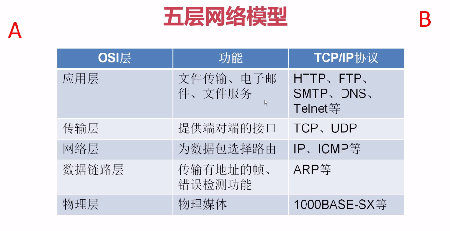
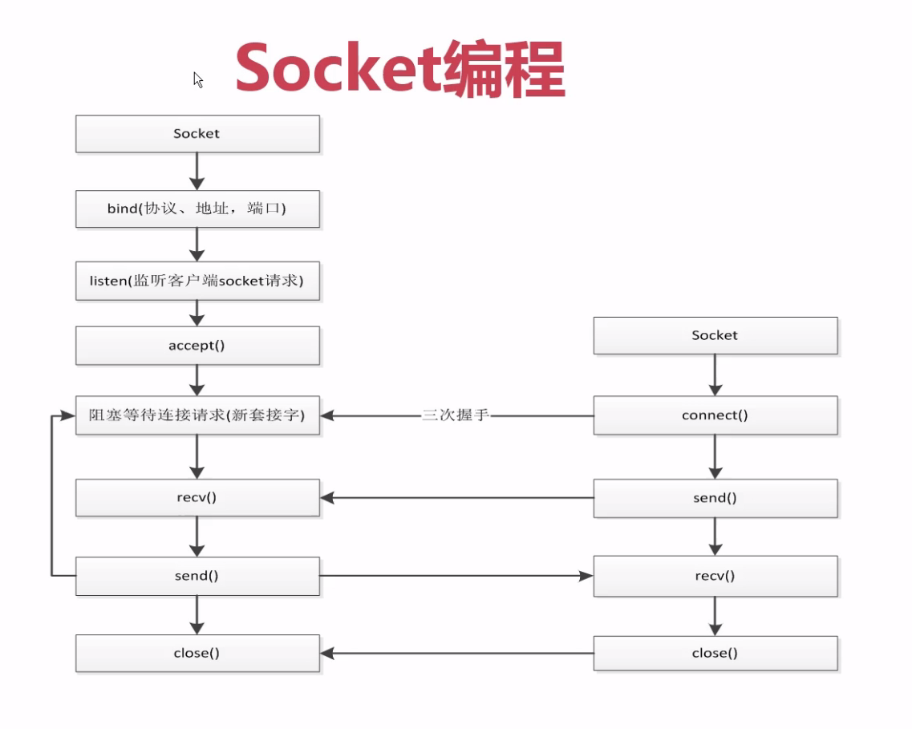

# socket编程
[toc]
## 弄懂HTTP、Socket、TCP这几个概念


## client和server实现通信

server
```
#!/usr/bin/env python
# -*- coding:utf-8 -*-

import socket

# AF_INET IPv4 SOCK_STREAM TCP协议
server = socket.socket(socket.AF_INET, socket.SOCK_STREAM)
server.bind(('0.0.0.0', 7777))
server.listen()
sock, addr = server.accept()

# 获取从客户端发送的数据，一次获取1K的数据
data = sock.recv(1024)
print(data.decode('utf-8'))
sock.send('hello {}'.format(data.decode('utf-8')).encode('utf-8'))
sock.close()
server.close()
```
client
```
#!/usr/bin/env python
# -*- coding:utf-8 -*-

import socket


client = socket.socket(socket.AF_INET, socket.SOCK_STREAM)
client.connect(('127.0.0.1',7777))
client.send('zy'.encode('utf-8'))
data = client.recv(1024)
print(data.decode('utf-8'))
client.close()
```

## socket实现聊天和多用户连接
### server
```
import socket
import threading

# AF_INET IPv4 SOCK_STREAM TCP协议
server = socket.socket(socket.AF_INET, socket.SOCK_STREAM)
server.bind(('0.0.0.0', 7777))
server.listen()


def handle_sock(sock, addr):
    while True:
        data = sock.recv(1024)
        print(data.decode('utf-8'))
        if 'bye' in data.decode('utf-8'):
            break
        re_data = input()
        sock.send(re_data.encode('utf-8'))
    sock.close()


# 获取从客户端发送的数据，一次获取1K的数据
while True:
    sock, addr = server.accept()

    # 用线程去处理新接收的连接（用户）
    client_thread = threading.Thread(target=handle_sock, args=(sock, addr))
    client_thread.start()
```

### client
```
import socket


client = socket.socket(socket.AF_INET, socket.SOCK_STREAM)
client.connect(('127.0.0.1',7777))
while True:
    re_data = input()
    client.send(re_data.encode('utf-8'))
    data = client.recv(1024)
    print(data.decode('utf-8'))
```

## socket模拟http请求
**requests -> urllib -> socket**

requests 是由urllib实现的，urllib是由socket实现的。
```
import socket
from urllib.parse import urlparse


def get_url(url):
    # 通过socket请求html
    url = urlparse(url)
    host = url.netloc
    path = url.path
    if path == '':
        path = '/'

    # 建立连接
    client = socket.socket(socket.AF_INET, socket.SOCK_STREAM)
    client.connect((host, 80))

    client.send("GET {} HTTP/1.1\r\nHost:{}\r\nConnection:close\r\n\r\n".format(path, host).encode('utf-8'))

    data = b""
    while True:
        d = client.recv(1024)
        if d:
            data += d
        else:
            break

    data = data.decode('utf-8')
    html_data = data.split('\r\n\r\n')[1]
    print(data)
    print(html_data)
    client.close()


if __name__ == '__main__':
    get_url('http://www.baidu.com')
```