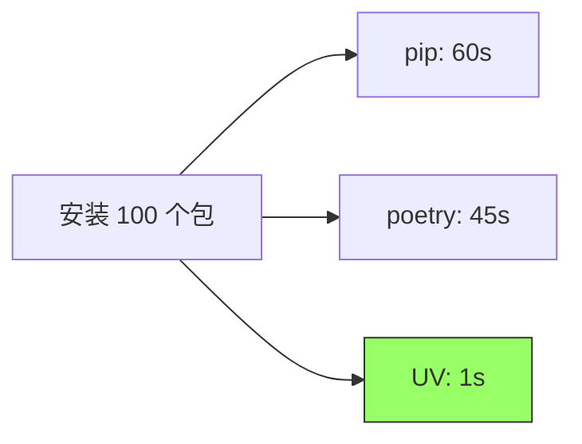

# UV 工具使用指南

## 1. UV 简介

UV 是一个极速的 Python 包和项目管理工具，由 Rust 编写，旨在取代 pip、pip-tools、pipx、poetry、pyenv、virtualenv 等工具。它提供了统一的工具链来管理 Python 项目、依赖和环境。

### 1.1 核心特点

| 特点 | 说明 |
|------|------|
| **极速性能** | 比 pip 快 10-100 倍，比 poetry 快 80-100 倍 |
| **统一工具** | 集成了包管理、虚拟环境、项目管理等功能 |
| **兼容性强** | 兼容 pip、requirements.txt、pyproject.toml |
| **跨平台** | 支持 Windows、macOS、Linux |
| **无依赖** | 单个可执行文件，无需 Python 环境即可运行 |

## 2. 安装 UV

### 2.1 Windows 安装

使用 PowerShell 安装：

```powershell
# 使用官方安装脚本
powershell -c "irm https://astral.sh/uv/install.ps1 | iex"
```

或使用 pip 安装：

```bash
pip install uv
```

### 2.2 macOS/Linux 安装

```bash
# 使用 curl 安装
curl -LsSf https://astral.sh/uv/install.sh | sh

# 或使用 pip 安装
pip install uv
```

### 2.3 验证安装

```bash
uv --version
```

## 3. 创建和管理虚拟环境

### 3.1 创建虚拟环境

#### 3.1.1 创建默认 Python 版本的虚拟环境

```bash
# 在当前目录创建 .venv 虚拟环境
uv venv

# 指定虚拟环境名称
uv venv myenv
```

#### 3.1.2 创建指定 Python 版本的虚拟环境

```bash
# 使用 Python 3.11
uv venv --python 3.11

# 使用 Python 3.12
uv venv --python 3.12

# 使用系统特定的 Python 路径
uv venv --python /usr/bin/python3.10
```

#### 3.1.3 创建时指定依赖

```bash
# 创建虚拟环境并安装依赖
uv venv --seed
```

### 3.2 激活虚拟环境

#### Windows PowerShell

```powershell
.venv\Scripts\Activate.ps1
```

#### Windows CMD

```cmd
.venv\Scripts\activate.bat
```

#### macOS/Linux

```bash
source .venv/bin/activate
```

### 3.3 查看虚拟环境信息

```bash
# 查看当前 Python 环境
uv python list

# 查看已安装的 Python 版本
uv python find
```

## 4. 包管理

### 4.1 安装包

```bash
# 安装单个包
uv pip install requests

# 安装多个包
uv pip install numpy pandas matplotlib

# 安装指定版本
uv pip install django==4.2.0

# 从 requirements.txt 安装
uv pip install -r requirements.txt

# 安装开发依赖
uv pip install -r requirements-dev.txt
```

### 4.2 卸载包

```bash
# 卸载单个包
uv pip uninstall requests

# 卸载多个包
uv pip uninstall numpy pandas
```

### 4.3 列出已安装的包

```bash
# 列出所有包
uv pip list

# 列出过期的包
uv pip list --outdated

# 以 freeze 格式输出
uv pip freeze
```

### 4.4 生成依赖文件

```bash
# 生成 requirements.txt
uv pip freeze > requirements.txt

# 生成精确版本的依赖
uv pip compile requirements.in -o requirements.txt
```

## 5. 项目管理

### 5.1 初始化新项目

```bash
# 创建新项目
uv init myproject

# 进入项目目录
cd myproject
```

这将创建以下结构：

```
myproject/
├── .python-version
├── pyproject.toml
├── README.md
└── src/
    └── myproject/
        └── __init__.py
```

### 5.2 使用 pyproject.toml

UV 支持标准的 `pyproject.toml` 文件：

```toml
[project]
name = "myproject"
version = "0.1.0"
description = "My awesome project"
requires-python = ">=3.11"

dependencies = [
    "requests>=2.31.0",
    "numpy>=1.24.0",
]

[project.optional-dependencies]
dev = [
    "pytest>=7.4.0",
    "black>=23.0.0",
]

[build-system]
requires = ["hatchling"]
build-backend = "hatchling.build"
```

### 5.3 同步项目依赖

```bash
# 根据 pyproject.toml 同步依赖
uv sync

# 同步并包含开发依赖
uv sync --dev

# 仅同步生产依赖
uv sync --no-dev
```

### 5.4 添加和移除依赖

```bash
# 添加依赖
uv add requests

# 添加开发依赖
uv add --dev pytest

# 移除依赖
uv remove requests
```

## 6. Python 版本管理

### 6.1 安装 Python 版本

```bash
# 安装特定版本的 Python
uv python install 3.11

# 安装多个版本
uv python install 3.10 3.11 3.12
```

### 6.2 列出可用的 Python 版本

```bash
# 列出所有已安装的 Python 版本
uv python list

# 列出可安装的 Python 版本
uv python list --all-versions
```

### 6.3 设置项目 Python 版本

```bash
# 固定项目使用的 Python 版本
uv python pin 3.11
```

这会创建 `.python-version` 文件。

## 7. 运行脚本和工具

### 7.1 运行 Python 脚本

```bash
# 在虚拟环境中运行脚本
uv run python script.py

# 运行模块
uv run python -m mymodule
```

### 7.2 临时运行工具（类似 pipx）

```bash
# 临时安装并运行工具
uv tool run black .

# 运行特定版本的工具
uv tool run --from black==23.0.0 black .

# 运行 Jupyter
uv tool run jupyter notebook
```

### 7.3 全局安装工具

```bash
# 全局安装工具
uv tool install black

# 全局安装指定版本
uv tool install black==23.0.0

# 列出已安装的工具
uv tool list

# 卸载工具
uv tool uninstall black
```

## 8. 锁定依赖

### 8.1 生成锁定文件

```bash
# 生成 uv.lock 文件
uv lock

# 更新锁定文件
uv lock --upgrade
```

### 8.2 从锁定文件安装

```bash
# 从 uv.lock 安装依赖
uv sync --frozen
```

## 9. 常用工作流

### 9.1 新建 Python 项目

```bash
# 1. 创建项目
uv init myproject
cd myproject

# 2. 设置 Python 版本
uv python pin 3.11

# 3. 创建虚拟环境
uv venv

# 4. 激活虚拟环境
source .venv/bin/activate  # macOS/Linux
# 或
.venv\Scripts\Activate.ps1  # Windows

# 5. 添加依赖
uv add requests pandas numpy

# 6. 添加开发依赖
uv add --dev pytest black mypy

# 7. 同步依赖
uv sync
```

### 9.2 克隆已有项目

```bash
# 1. 克隆项目
git clone <repository>
cd <project>

# 2. 创建虚拟环境
uv venv

# 3. 激活虚拟环境
source .venv/bin/activate  # macOS/Linux

# 4. 安装依赖
uv sync

# 或从 requirements.txt 安装
uv pip install -r requirements.txt
```

### 9.3 导出依赖给其他人

```bash
# 导出 requirements.txt
uv pip freeze > requirements.txt

# 或使用 pip compile
uv pip compile pyproject.toml -o requirements.txt
```

## 10. UV vs 传统工具对比

### 10.1 命令对比

| 操作 | pip/venv | UV |
|------|----------|-----|
| 创建虚拟环境 | `python -m venv .venv` | `uv venv` |
| 安装包 | `pip install requests` | `uv pip install requests` |
| 从文件安装 | `pip install -r requirements.txt` | `uv pip install -r requirements.txt` |
| 导出依赖 | `pip freeze > requirements.txt` | `uv pip freeze > requirements.txt` |
| 初始化项目 | 手动创建 | `uv init myproject` |
| 运行工具 | `pipx run black` | `uv tool run black` |

### 10.2 性能对比



## 11. 最佳实践

### 11.1 项目结构建议

```
myproject/
├── .python-version      # Python 版本固定
├── pyproject.toml       # 项目配置和依赖
├── uv.lock             # 依赖锁定文件
├── .venv/              # 虚拟环境（添加到 .gitignore）
├── src/
│   └── myproject/
│       └── __init__.py
├── tests/
│   └── test_*.py
└── README.md
```

### 11.2 .gitignore 配置

```gitignore
# 虚拟环境
.venv/
venv/
env/

# Python 编译文件
__pycache__/
*.py[cod]
*$py.class

# UV 缓存
.uv/
```

### 11.3 依赖管理建议

1. **使用 pyproject.toml**：现代 Python 项目推荐使用 `pyproject.toml`
2. **锁定依赖**：使用 `uv.lock` 确保环境一致性
3. **分离开发依赖**：将测试、格式化等工具放在 `dev` 组
4. **固定 Python 版本**：使用 `.python-version` 文件

### 11.4 CI/CD 集成

```yaml
# GitHub Actions 示例
name: CI

on: [push, pull_request]

jobs:
  test:
    runs-on: ubuntu-latest
    steps:
      - uses: actions/checkout@v3
      
      - name: Install UV
        run: curl -LsSf https://astral.sh/uv/install.sh | sh
      
      - name: Setup Python
        run: uv python install 3.11
      
      - name: Create venv
        run: uv venv
      
      - name: Install dependencies
        run: uv sync
      
      - name: Run tests
        run: uv run pytest
```

## 12. 常见问题

### 12.1 UV 找不到 Python 版本

```bash
# 方案1：安装 Python 版本
uv python install 3.11

# 方案2：指定系统 Python 路径
uv venv --python /usr/bin/python3.11
```

### 12.2 加速包下载

```bash
# 使用国内镜像（临时）
uv pip install -i https://pypi.tuna.tsinghua.edu.cn/simple requests

# 配置永久镜像（修改 pip 配置）
uv pip config set global.index-url https://pypi.tuna.tsinghua.edu.cn/simple
```

### 12.3 UV 缓存清理

```bash
# 清理 UV 缓存
uv cache clean

# 查看缓存大小
uv cache dir
```

### 12.4 迁移现有项目

```bash
# 从 poetry 迁移
# 1. 保留 pyproject.toml
# 2. 删除 poetry.lock
# 3. 使用 UV 重新锁定
uv lock

# 从 requirements.txt 迁移
# 创建 pyproject.toml，然后：
uv add $(cat requirements.txt)
```

## 13. 高级功能

### 13.1 工作空间（Workspace）

对于包含多个 Python 包的大型项目：

```toml
# workspace root 的 pyproject.toml
[tool.uv.workspace]
members = ["packages/*"]
```

### 13.2 自定义索引

```toml
# pyproject.toml
[[tool.uv.index]]
name = "private"
url = "https://pypi.private.com/simple"
```

### 13.3 环境变量

```bash
# 设置 UV 缓存目录
export UV_CACHE_DIR=/custom/cache/dir

# 设置并发下载数
export UV_CONCURRENT_DOWNLOADS=8
```

## 14. 参考资源

- **官方文档**：https://docs.astral.sh/uv/
- **GitHub 仓库**：https://github.com/astral-sh/uv
- **性能基准**：https://github.com/astral-sh/uv#benchmarks
- **迁移指南**：https://docs.astral.sh/uv/guides/integration/

## 15. 总结

UV 是新一代的 Python 工具链，提供了：

✅ **极速性能**：比传统工具快 10-100 倍  
✅ **统一体验**：一个工具替代多个工具  
✅ **现代标准**：完全支持 pyproject.toml  
✅ **简单易用**：命令简洁，学习成本低  
✅ **跨平台**：Windows、macOS、Linux 无缝支持  

对于新项目，强烈推荐使用 UV 作为主要的 Python 工具链！
