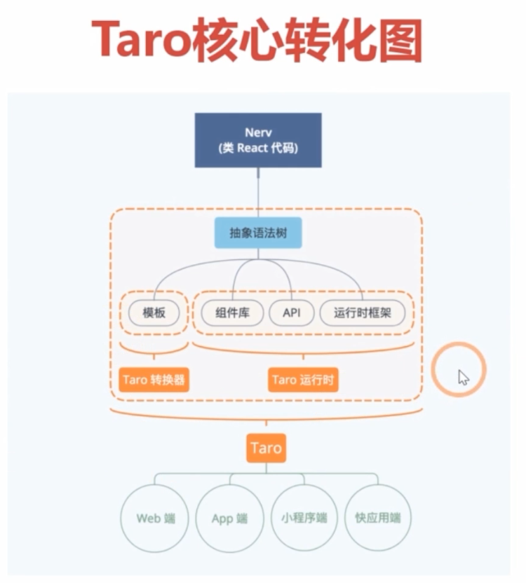
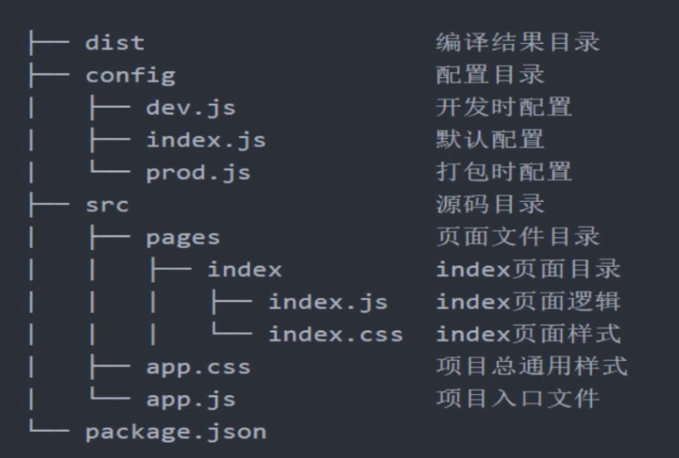

# Taro基本知识
[toc]
## 一、Taro核心转化图



## 二、初始化目录结构



**注意事项**

1.dist 目录下每次编译会覆盖，所以编译一次铐出去一次。

2.config是配置文件，类似于react 的webpack。

3.src存放源码, app.js下面定义页面的路径，被定义的为页面，其他的为组件。

## 三、小程序和h5的差别：

##### 1.在taro中需要配置路由来说明页面和组件的区别,而react的概念是万物皆组件

```jsx
config = {
    pages: [
      'pages/index/index'
    ],
    window: {
      backgroundTextStyle: 'light',
      navigationBarBackgroundColor: '#fff',
      navigationBarTitleText: 'WeChat',
      navigationBarTextStyle: 'black'
    }
  }
```

##### 2.taro 传递函数时，格式必须是 on + '函数名'

##### 3.使用props 需要设置默认值

##### 4..引入的函数不能直接在子组件中用箭头函数调用，需要在子组件中单独写个函数，调用props上的函数

##### 5.图片必须放在Image组件里面，通过import 引入

##### 6.不能在render之外定义jsx，不能在函数中定义jsx（最近的版本已经支持了）

##### 7.不能在包含 JSX 元素的 map 循环中使用 if 表达式

##### 8.不能在 JSX 参数中使用对象展开符
```react
# 微信小程序组件要求每一个传入组件的参数都必须预先设定好，而对象展开符则是动态传入不固定数量的参数。所以 Taro 没有办法支持该功能。

# 无效情况
<View {...this.props} />

<View {...props} />

<Custom {...props} />
```

### 组件属性传递注意

不要以 `id`、`class`、`style` 作为自定义组件的属性与内部 state 的名称，因为这些属性名在微信小程序中会丢失。

### 组件 `state` 与 `props` 里字段重名的问题

不要在 `state` 与 `props` 上用同名的字段，因为这些被字段在微信小程序中都会挂在 `data` 上。

### 小程序中页面生命周期 `componentWillMount` 不一致问题

由于微信小程序里页面在 `onLoad` 时才能拿到页面的路由参数，而页面 onLoad 前组件都已经 `attached` 了。因此页面的 `componentWillMount` 可能会与预期不太一致。例如：

```react
// 错误写法
render () {
  // 在 willMount 之前无法拿到路由参数
  const abc = this.$router.params.abc
  return <Custom adc={abc} />
}

// 正确写法
componentWillMount () {
  const abc = this.$router.params.abc
  this.setState({
    abc
  })
}
render () {
  // 增加一个兼容判断
  return this.state.abc && <Custom adc={abc} />
}
```

对于不需要等到页面 willMount 之后取路由参数的页面则没有任何影响。

### 环境变量 `process.env` 的使用

不要以解构的方式来获取通过 `env` 配置的 `process.env` 环境变量，请直接以完整书写的方式 `process.env.NODE_ENV` 来进行使用

```react
// 错误写法，不支持
const { NODE_ENV = 'development' } = process.env
if (NODE_ENV === 'development') {
  ...
}

// 正确写法
if (process.env.NODE_ENV === 'development') {

}
```

### 预加载

在**微信小程序中**，从调用 `Taro.navigateTo`、`Taro.redirectTo` 或 `Taro.switchTab` 后，到页面触发 componentWillMount 会有一定延时。因此一些网络请求可以提前到发起跳转前一刻去请求。

Taro 提供了 `componentWillPreload` 钩子，它接收页面跳转的参数作为参数。可以把需要预加载的内容通过 `return` 返回，然后在页面触发 componentWillMount 后即可通过 `this.$preloadData` 获取到预加载的内容。

```react
class Index extends Component {
  componentWillMount () {
    console.log('isFetching: ', this.isFetching)
    this.$preloadData
      .then(res => {
        console.log('res: ', res)
        this.isFetching = false
      })
  }

  componentWillPreload (params) {
    return this.fetchData(params.url)
  }

  fetchData () {
    this.isFetching = true
    ...
  }
}
```

## 四、生命周期&State：

1.状态更新一定是异步的。
2.必须用setState去赋值。

- **constructor**，顾名思义，组件的构造函数。一般会在这里进行 `state` 的初始化，事件的绑定等等
- **componentWillMount**，是当组件在进行挂载操作前，执行的函数，一般紧跟着 `constructor` 函数后执行
- **componentDidMount**，是当组件挂载在 dom 节点后执行。一般会在这里执行一些异步数据的拉取等动作
- **shouldComponentUpdate**，返回 `false` 时，组件将不会进行更新，可用于渲染优化
- **componentWillReceiveProps**，当组件收到新的 `props` 时会执行的函数，传入的参数就是 `nextProps` ，你可以在这里根据新的 `props` 来执行一些相关的操作，例如某些功能初始化等
- **componentWillUpdate**，当组件在进行更新之前，会执行的函数
- **componentDidUpdate**，当组件完成更新时，会执行的函数，传入两个参数是 `prevProps` 、`prevState`
- **componentWillUnmount**，当组件准备销毁时执行。在这里一般可以执行一些回收的工作，例如 `clearInterval(this.timer)` 这种对定时器的回收操作

## 五、路由功能：

##### 在taro中，路由功能是默认自带的，不需要开发者进行额外的路由配置。通过小程序的配置适配了小程序和h5的路由问题。在config中指定好pages，然后在代码中通过taro提供的api来跳转到目的页面。

路由跳转：

```react
import Taro from '@tarojs/taro'

Taro.navigateTo(params).then(...)
                             
Taro.redirectTo(params).then(...)
```

获取url中的参数

```react
 xxx = this.$router.params.xxx
```

## 六、函数式组件

### 普通函数式组件

定义一个函数式组件非常简单：

```jsx
function Welcome(props) {
  return <View>Hello, {props.name}</View>;
}
```

这个函数接受一个参数 `props`，并且返回的是一个 JSX 元素。这样的函数就是函数式组件。相对于的 ES6 Class 组件是：

```jsx
class Welcome extends React.Component {
  render() {
    return <View>Hello, {this.props.name}</View>;
  }
}
```

在 Taro 中使用函数式组件有以下限制：

1. 函数的命名需要遵循[帕斯卡式命名法](https://baike.baidu.com/item/%E5%B8%95%E6%96%AF%E5%8D%A1%E5%91%BD%E5%90%8D%E6%B3%95/9464494?fr=aladdin)；
2. 一个文件中只能定义一个普通函数式组件或一个 Class 组件

### 类函数式组件

由于一个文件不能定义两个组件，但有时候我们需要组件内部的抽象组件，这时类函数式组件就是你想要答案。假设我们有一个 Class 组件，它包括了一个 `Header` 一个 `Footer`，我们可以这样定义：

```jsx
class SomePage extends Taro.Component {
  renderHeader () {
    const { header } = this.state
    return <View>{header}</View>
  }

  renderFooter (footer) {
    return <View>{footer}</View>
  }

  render () {
    return (
      <View>
        {this.renderHeader()}
        {...}
        {this.renderFooter('footer')}
      </View>
    )
  }
}
```

在 `renderHeader` 或 `renderFooter` 函数中，我们可以访问类的 `this`，也可以传入不限量的参数，这类型的函数也可以调用无限次数。但这样的写法也存在一些限制：

1. 函数的命名必须以 `render` 开头，`render` 后的第一个字母需要大写
2. 函数的参数不得传入 JSX 元素或 JSX 元素引用
3. 函数不能递归地调用自身

### 使用匿名函数

> 自 v1.2.9 开始支持

> 注意：在各小程序端，使用匿名函数，尤其是在 **循环中** 使用匿名函数，比使用 `bind` 进行事件传参占用更大的内存，速度也会更慢。

除了 `bind` 之外，事件参数也可以使用匿名函数进行传参。直接写匿名函数不会打乱原有监听函数的参数顺序：

```jsx
class Popper extends Component {
  constructor () {
    super(...arguments)
    this.state = { name: 'Hello world!' }
  }

  render () {
    const name = 'test'
    return (
      <Button onClick={(e) => {
        e.stopPropagation()
        this.setState({
          name
        })
      }}>
        {this.state.name}
      </Button>
    )
  }
}
```

> 注意： 使用通过 `usingComponents` 的第三方组件不支持匿名函数

### 柯里化

> 自 v1.3.0-beta.1 开始支持

> 在各小程序端，使用柯里化 Taro 会在编译后多生成一个匿名函数。

除了 `bind` 和匿名函数之外，事件参数也可以使用[柯里化](https://zh.wikipedia.org/wiki/%E6%9F%AF%E9%87%8C%E5%8C%96)传参。

```jsx
class Title extends Component{

  handleClick = (index) => (e) => {
    e.stopPropagation()
    this.setState({
      currentIndex: index
    })
  }

  render() {
    const { currentIndex } = this.props;
    return (
      {/* 调用 `this.handleClick(currentIndex)` 会返回一个函数，这个函数可以访问到 `currentIndex` 同时也能满足 `onClick` 的签名 */}
      <View onClick={this.handleClick(currentIndex)}>
      </View>
    )
  }
 }
```

## 七、系统变量

```react
process.env.TARP_ENV #用于判断当前环境
```

