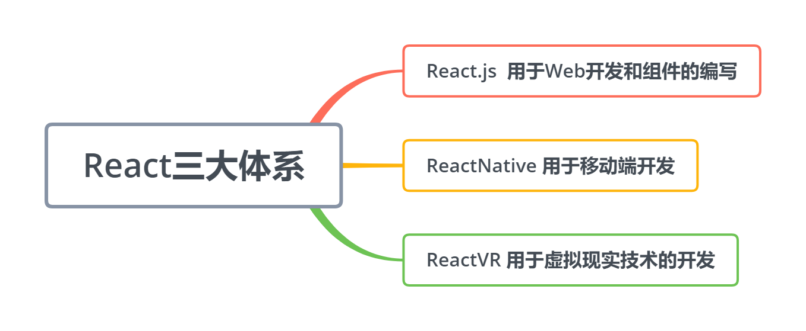

# React入门

> ## React简介
首先不能否认React.js是全球最火的前端框架(Facebook推出的前端框架)，国内的一二线互联网公司大部分都在使用React进行开发，比如阿里、美团、百度、去哪儿、网易 、知乎这样的一线互联网公司都把React作为前端主要技术栈。

React的社区也是非常强大的,随着React的普及也衍生出了更多有用的框架，比如==ReactNative==和==React VR==。React从13年开始推广，现在已经推出16RC（React Fiber）这个版本，性能和易用度上，都有很大的提升。

A JavaScript library for building user interfaces (用于构建用户界面的JavaScript库)。

> ## React优点总结
- **生态强大**：现在没有哪个框架比React的生态体系好的，几乎所有开发需求都有成熟的解决方案。
- **上手简单**: 你甚至可以在几个小时内就可以上手React技术，但是他的知识很广，你可能需要更多的时间来完全驾驭它。
- **社区强大**：你可以很容易的找到志同道合的人一起学习，因为使用它的人真的是太多了。

> ## React三大体系


> ## React开发环境搭建
- **安装Node.js**

安装Node只需要进入Node网站，进行响应版本的下载，然后进行双击安装就可以了。

Node中文网址：http://nodejs.cn/ (建议你在这里下载，速度会快很多)

需要你注意的是，一定要正确下载对应版本，版本下载错误，可是没有办法使用的哦。
Node.js 安装好以后，如果是Windows系统，可以使用Win+R打开运行，然后输入cmd，打开终端（或者叫命令行工具）。

**输入代码:**
```
node -v
```

**然后再输入代码:**
```
npm -v
```
如果都正确显示版本号，则说明 ==Node.js== 安装完成

- **脚手架的安装**

Node安装好之后，你就可以使用npm命令来安装脚手架工具了，方法很简单，只要打开终端，然后输入下面的命令就可以了。
```
npm install -g create-react-app
```
> ==create-react-app== 是React官方出的脚手架工具

> ## 创建第一个React项目
**在终端输入**
```
D:  //进入D盘
mkdir ReactDemo  //创建ReactDemo文件夹
create-react-app demo01   //用脚手架创建React项目
cd demo01   //等创建完成后，进入项目目录
npm start   //预览项目，如果能正常打开，说明项目创建成功
```
等到浏览器可以打开React网页，并正常显示图标后，说明我们的环境已经全部搭建完成了。

> ## 项目根目录中的文件

- **README.md** :这个文件主要作用就是对项目的说明，已经默认写好了一些东西，你可以简单看看。如果是工作中，你可以把文件中的内容删除，自己来写这个文件，编写这个文件可以使用 ==Markdown== 的语法来编写。
- **package.json** :这个文件是 ==webpack== 配置和项目包管理文件，项目中依赖的第三方包（包的版本）和一些常用命令配置都在这个里边进行配置，当然脚手架已经为我们配置了一些了，目前位置，我们不需要改动。如果你对webpack了解，对这个一定也很熟悉。
- **package-lock.json**：这个文件用一句话来解释，就是锁定安装时的版本号，并且需要上传到git，以保证其他人再npm install 时大家的依赖能保证一致。
- **gitignore** : 这个是git的选择性上传的配置文件，比如一会要介绍的 ==node_modules== 文件夹，就需要配置不上传。
- **node_modules** :这个文件夹就是我们项目的依赖包，到目前位置，脚手架已经都给我们下载好了，你不需要单独安装什么。
- **public** ：公共文件，里边有公用模板和图标等一些东西。
- **src** ： 主要代码编写文件，这个文件夹里的文件对我们来说最重要，都需要我们掌握。

> ## public文件夹介绍
这个文件都是一些项目使用的公共文件
- **favicon.ico** : 这个是网站或者说项目的图标，一般在浏览器标签页的左上角显示。
- **index.html** : 首页的模板文件，我们可以试着改动一下，就能看到结果。
- **mainifest.json**：移动端配置文件，这个会在以后的课程中详细讲解。

> ## src文件夹介绍
这个目录里边放的是我们开放的源代码，平时操作最多的目录。
- **index.js** : 这个就是项目的入口文件。
- **index.css** ：这个是index.js里的CSS文件。
- **app.js** : 这个文件相当于一个方法模块，也是一个简单的模块化编程。
- **serviceWorker.js**: 这个是用于写移动端开发的，PWA必须用到这个文件，有了这个文件，就相当于有了离线浏览的功能。

> ## HelloWorld小实例
1. **入口文件的编写**

   写一个项目的时候一般要从入口文件进行编写的，在src目录下，新建一个文件 ==index.js== (一般要把原先的删除)，然后打开这个文件。
   前四行代码：
   ```
    import React from 'react'
    import ReactDOM from 'react-dom'
    import App from './App'
    ReactDOM.render(<App />,document.getElementById('root'))
   ```
    我们先引入了React两个必要的文件，然后引入了一个APP组件，目前这个组件还是没有的，需要一会建立。然后用React的语法把APP模块渲染到了==root== ID上面.这个rootID是在 ==public\index.html== 文件中的。

2. **app组件的编写**

    现在写一下App组件，这里我们采用最简单的写法，就输出一个 ==Hello 
    wychmod== 。
    ```
    import React, {Component} from 'react'

    class App extends Component{
        render(){
            return (
                <div>
                    Hello wychmod
                </div>
            )
        }
    }
    export default App;
    ```
    这其实是ES6的语法-解构赋值，你可以把上面一行代码写成下面两行.
    ```
    import React, {Component} from 'react'
    
    import React from 'react'
    const Component = React.Component
    ```
    **总结**：React的主要优势之一就是组件化编写，这也是现代前端开发的一种基本形式。
    
> ## React中JSX语法简介
JSX就是Javascript和XML结合的一种格式。React发明了JSX，可以方便的利用HTML语法来创建虚拟DOM，当遇到<，JSX就当作HTML解析，遇到{就当JavaScript解析.
比如这样一段JSX语法：
```html
<ul className="my-list">
    <li>wychmod.com</li>
    <li>I love React</li>
</ul>
```
比如这样一段js代码：
```jsx
var child1 = React.createElement('li', null, 'wychmod.com');
var child2 = React.createElement('li', null, 'I love React');
var root = React.createElement('ul', { className: 'my-list' }, child1, child2);
```
从代码量上就可以看出JSX语法大量简化了我们的工作。
> **组件和普通jsx语法区别**：自定义的组件必须首写字母要进行大写，而JSX是小写字母开头的。

> ## JSX中使用三元运算符
在JSX中也是可以使用js语法的，这节课我们先简单讲解一个三元元算符的方法，见到了解一下。
```js
import React from 'react'
const Component = React.Component


class App extends Component{
    render(){
        return (
            <ul className="my-list">
                <li>{false?'JSPang.com':'技术胖'}</li>
                <li>I love React</li>
            </ul>
        )
    }
}

export default App;
```

> ## 组件外层包裹原则
这是一个很重要的原则，比如上面的代码，我们去掉最外层的div，就回报错，因为React要求必须在一个组件的最外层进行包裹。

> ## Fragment标签讲解
加上最外层的DIV，组件就是完全正常的，但是你的布局就偏不需要这个最外层的标签怎么办?比如我们在作Flex布局的时候,外层还真的不能有包裹元素。这种矛盾其实React16已经有所考虑了，为我们准备了<Fragment>标签。

**然后把最外层的\<div>标签，换成<Fragment>标签，代码如下。**
```
import React,{Component,Fragment } from 'react'

class Xiaojiejie extends Component{
    render(){
        return  (
            <Fragment>
               <div><input /> <button> 增加服务 </button></div>
               <ul>
                   <li>头部按摩</li>
                   <li>精油推背</li>
               </ul> 
            </Fragment>
        )
    }
}
export default Xiaojiejie 
```
**这时候你再去浏览器的Elements中查看，就回发现已经没有外层的包裹了。**

> ## 响应式设计和数据的绑定
==React== 不建议你直接操作 ==DOM== 元素,而是要通过数据进行驱动，改变界面中的效果。React会根据数据的变化，自动的帮助你完成界面的改变。所以在写React代码时，你无需关注DOM相关的操作，只需要关注数据的操作就可以了（这也是React如此受欢迎的主要原因，大大加快了我们的开发速度）。
数据定义在组件中的构造函数里==constructor==。
```
//js的构造函数，由于其他任何函数执行
constructor(props){
    super(props) //调用父类的构造函数，固定写法
    this.state={
        inputValue:'' , // input中的值
        list:[]    //服务列表
    }
}
```
在 ==React== 中的数据绑定和 ==Vue== 中几乎一样，也是采用字面量(我自己起的名字)的形式，就是使用=={}==来 标注，其实这也算是js代码的一种声明。比如现在我们要把 ==inputValue== 值绑定到 ==input== 框中，只要写入下面的代码就可以了。其实说白了就是在JSX中使用js代码。

> ## 绑定事件
这时候你到界面的文本框中去输入值，是没有任何变化的，这是因为我们强制绑定了 ==inputValue== 的值。如果要想改变，需要绑定响应事件，改变 ==inputValue== 的值。比如绑定一个改变事件，这个事件执行 ==inputChange()== 方法。
```html
 <input value={this.state.inputValue} onChange={this.inputChange.bind(this)} />
```
在render里的方法：
```
inputChange(e){
    // console.log(e.target.value);
    // this.state.inputValue=e.target.value;
    this.setState({
        inputValue:e.target.value
    })
}
```

> ## 列表数据化
现在的列表还是写死的两个 ==\<li>== 标签，那要变成动态显示的，就需要把这个列表先进行数据化，然后再用 ==javascript== 代码，循环在页面上。
```
constructor(props){
    super(props) //调用父类的构造函数，固定写法
    this.state={
        inputValue:'jspang' , // input中的值
        //----------主要 代码--------start
        list:['基础按摩','精油推背']   
        //----------主要 代码--------end
    }
}
```
有了数据后，JSX部分进行循环输出，代码如下：
```html
render(){
    return  (
        <Fragment>
            <div>
                <input value={this.state.inputValue} onChange={this.inputChange.bind(this)} />
                <button> 增加服务 </button>
            </div>
            <ul>
                {
                    this.state.list.map((item,index)=>{
                        return <li>{item}</li>
                    })
                }
            </ul>  
        </Fragment>
    )
}
```

> ## 增加列表数据（讲解...)
这里需要说的市 ==...== 这个是ES6的新语法，叫做扩展运算符。意思就是把list数组进行了分解，形成了新的数组，然后再进行组合。这种写法更简单和直观，所以推荐这种写法。
```js
addList(){
    this.setState({
        list:[...this.state.list,this.state.inputValue]
    })
}
```

> ## 解决key值错误
打开浏览器的控制台F12,可以清楚的看到报错了。这个错误的大概意思就是缺少key值。就是在用map循环时，需要设置一个不同的值，这个时React的要求。我们可以暂时用index+item的形式来实现。
```html
<ul>
    {
        this.state.list.map((item,index)=>{
            return <li key={index+item}>{item}</li>
        })
    }
</ul>  
```

> ## 数组下标的传递同时删除数据
如果要删除一个东西，就要得到数组里的一个编号，这里指下标。传递下标就要有事件产生，先来绑定一个双击事件.代码如下:
```html
<ul>
    {
        this.state.list.map((item,index)=>{
            return (
                <li 
                    key={index+item}
                    onClick={this.deleteItem.bind(this,index)}
                >
                    {item}
                </li>
            )
        })
    }
</ul>  
```
绑定做好了,现在需要把deleteItem,在代码的最下方,加入下面的代码.方法接受一个参数index.
```
//删除单项数据
deleteItem(index){
    let list = this.state.list
    list.splice(index,1)
    this.setState({
        list:list
    })
}
```
> 记住React是禁止直接操作state的,在后期的性能优化上会有很多麻烦。

# React进阶
> ## JSX代码注释
在jsx中写javascript代码。所以外出我们套入了{}，然后里边就是一个多行的javascript注释。如果你要使用单行祝注释//，你需要把代码写成下面这样。
```html
<Fragment>
    // 这个是错误的注释
    
    {/* 正确注释的写法 */}
    
    {
        //正确注释的写法 
    }
    <div>
        <input value={this.state.inputValue} onChange={this.inputChange.bind(this)} />
        <button onClick={this.addList.bind(this)}> 增加服务 </button>
    </div>
```

> ## JSX中的class陷阱
1. 先写一个CSS样式文件，在 ==src== 目录下，新建一个 ==style.css== 的样式文件。
```css
.input {border:3px solid #ae7000}
```

2. 先用import进行引入,能用 ==import== 引入，都是webpack的功劳。
```html
import './style.css'

<input className="input" value={this.state.inputValue} onChange={this.inputChange.bind(this)} />
```
*要把 ==class== 换成 ==className== ，它是防止和js中的class类名 冲突，所以要求换掉。*

> ## JSX中的 ==html== 解析问题
如果想在文本框里输入一个\<h1>标签，并进行渲染。默认是不会生效的，只会把\<h1>标签打印到页面上，这并不是我想要的。如果工作中有这种需求，可以使用dangerouslySetInnerHTML属性解决。具体代码如下：
```html
<ul>
    {
        this.state.list.map((item,index)=>{
            return (
                <li 
                    key={index+item}
                    onClick={this.deleteItem.bind(this,index)}
                    dangerouslySetInnerHTML={{__html:item}}
                >
                </li>
            )
        })
    }
</ul> 
```

> ## JSX中 ==<label>== 标签的坑
JSX中 ==<label>== 的坑，也算是比较大的一个坑，label是 ==html== 中的一个辅助标签，也是非常有用的一个标签。
```html
<div>
    <label>加入服务：</label>
    <input className="input" value={this.state.inputValue} onChange={this.inputChange.bind(this)} />
    <button onClick={this.addList.bind(this)}> 增加服务 </button>
</div>
```
这时候想点击“加入服务”直接可以激活文本框，方便输入。按照html的原思想，是直接加ID就可以了。代码如下：
```html
<div>
    <label for="jspang">加入服务：</label>
    <input id="jspang" className="input" value={this.state.inputValue} onChange={this.inputChange.bind(this)} />
    <button onClick={this.addList.bind(this)}> 增加服务 </button>
</div>
```
这时候你浏览效果虽然可以正常，但 ==console== 里还是有红色警告提示的。大概意思是不能使用 ==for== .它容易和 ==javascript== 里的for循环混淆，会提示你使用 ==htmlfor== 。
```html
<div>
    <label htmlFor="jspang">加入服务：</label>
    <input id="jspang" className="input" value={this.state.inputValue} onChange={this.inputChange.bind(this)} />
    <button onClick={this.addList.bind(this)}> 增加服务 </button>
</div>
```

  
vscode/IDEA中的Simple React Snippets插件可以快速生成代码模板。

**安装 ==Simple React Snippets==**

    打开VSCode/IDEA的插件查单，然后在输入框中输入Simple React Snippets,然后点击进行安装就可以了。
    
- **快速进行引入==import==**

    直接在==vscode==中输入==imrc==，就会快速生成最常用的import代码。
    ```
    import React, { Component } from 'react';
    ```
    
- **快速生成class**

    在作组件的时候，都需要写一个固定的基本格式，这时候你就可以使用快捷键==cc==.插件就会快速帮我们生成如下代码：
    ```
    class  extends Component {
        state = {  }
        render() { 
            return (  );
        }
    }
    
    export default ;
    ```
    
> ## 函数式编程
**函数式编程的好处是什么？**
1. 函数式编程让我们的代码更清晰，每个功能都是一个函数。
2. 函数式编程为我们的代码测试代理了极大的方便，更容易实现前端自动化测试。

**React框架也是函数式编程，所以说优势在大型多人开发的项目中会更加明显，让配合和交流都得心应手。**

> ## 调试工具的安装及使用
- **下载React developer tools**

    这个需要在 ==chrome== 浏览器里进行，并且需要科学上网。
- **React developer tools的三种状态**
    
    ==React developer tools== 有三种颜色，三种颜色代表三种状态：
    1. 灰色： 这种就是不可以使用，说明页面不是又React编写的。
    2. 黑色: 说明页面是用React编写的，并且处于生成环境当中。
    3. 红色： 说明页面是用React编写的，并且处于调试环境当中。

- **React developer tools的使用**
    
    打开浏览器，然后按 ==F12==,打开开发者工具，然后在面板的最后一个，你会返现一个 ==React== ,这个就是安装的插件了。

    在这里你可以清晰的看到React的结构，让自己写的代码更加清晰，你还可以看到组间距的数据传递，再也不用写 ==console.log== 来测试程序了。
    
# React高级
> ## ProTypes的简单应用
在使用需要先引入 ==PropTypes== 。
- **类型限制**

    ```js
    import PropTypes from 'prop-types'
    
    XiaojiejieItem.propTypes={
        content:PropTypes.string,
        deleteItem:PropTypes.func,
        index:PropTypes.number
    }
    ```
    
- **必传值的校验**
    
    需要使用isRequired关键字了,它表示必须进行传递，如果不传递就报错。
    ```js
    avname:PropTypes.string.isRequired
    ```
    
- **使用默认值defaultProps**
    
    defalutProps就可以实现默认值的功能。
    ```js
    XiaojiejieItem.defaultProps = {
        avname:'松岛枫'
    }
    ```
    
> ## ref的使用方法
**代替原来的e.target.value**
使用了e.target，这并不直观，也不好看。这种情况我们可以使用ref来进行解决。
```
inputChange(e){
    this.setState({
        inputValue:e.target.value
    })
}
```
如果要使用ref来进行，需要现在JSX中进行绑定， 绑定时最好使用ES6语法中的箭头函数，这样可以简洁明了的绑定DOM元素。
```
<input 
    id="jspang" 
    className="input" 
    value={this.state.inputValue} 
    onChange={this.inputChange.bind(this)}
    //关键代码——----------start
    ref={(input)=>{this.input=input}}
    //关键代码------------end
    />
```
绑定后可以把上边的类改写成如下代码:
```
inputChange(){
    this.setState({
        inputValue:this.input.value
    })
}
```
**不建议用ref这样操作的，因为React的是数据驱动的，所以用ref会出现各种问题。**

> ## React生命周期
**React声明周期的四个大阶段：**
1. ==**Initialization**==:初始化阶段。
2. ==**Mounting**==: 挂在阶段。
3. ==**Updation**==: 更新阶段。
4. ==**Unmounting**==: 销毁阶段。

生命周期函数指在某一个时刻组件会自动调用执行的函数。
里边的render()函数，就是一个生命周期函数，它在state发生改变时自动执行。这就是一个标准的自动执行函数。

**constructor不算生命周期函数。**

constructor我们叫构造函数，它是ES6的基本语法。虽然它和生命周期函数的性质一样，但不能认为是生命周期函数。

但是你要心里把它当成一个生命周期函数，我个人把它看成React的Initialization阶段，定义属性（props）和状态(state)。

- **Mounting阶段**

    Mounting阶段叫挂载阶段，伴随着整个虚拟DOM的生成，它里边有三个小的生命周期函数，分别是：
    1. **componentWillMount** : 在组件即将被挂载到页面的时刻执行。
    2. **render** : 页面state或props发生变化时执行。
    3. **componentDidMount** : 组件挂载完成时被执行。
    
    > **componentWillMount**和**componentDidMount**这两个生命周期函数，只在页面刷新时执行一次，而render函数是只要有state和props变化就会执行，这个初学者一定要注意。
    
- **Update阶段**

    Updation阶段,也就是组件发生改变的更新阶段，这是React生命周期中比较复杂的一部分，它有两个基本部分组成，一个是==props==属性改变，一个是==state==状态改变。
    
    1. **shouldComponentUpdate**：函数会在组件更新之前，自动被执行。它要求返回一个布尔类型的结果，必须有返回值，这里就直接返回一个true了（真实开发中，这个是有大作用的）如果你返回了false，这组件就不会进行更新了。 
    2. **componentWillUpdate**：在组件更新之前，但==shouldComponenUpdate==之后被执行。但是如果==shouldComponentUpdate==返回false，这个函数就不会被执行了。
    3. **componentDidUpdate**： 在组件更新之后执行，它是组件更新的最后一个环节。
    4. **componentWillReceiveProps**：子组件接收到父组件传递过来的参数，父组件render函数重新被执行，这个生命周期就会被执行。
    
    ```
    1-shouldComponentUpdate---组件发生改变前执行
    2-componentWillUpdate---组件更新前，shouldComponentUpdate函数之后执行
    3-render----开始挂载渲染
    4-componentDidUpdate----组件更新之后执行
    ```
    
- **Unmounting阶段**
    
    - **componentWillUnmount**: 当组件从页面中删除的时候执行。
    
> ## axios数据请求

ajax可以远程请求，但是这写起来太麻烦了，我们用程序的ajax请求框架Axios来实现。
- **安装Axios**
```
npm install -save axios
```
- **npm install -save 和 -save-dev区分**
    - **npm install xxx**: 安装项目到项目目录下，不会将模块依赖写入devDependencies或dependencies。

    - **npm install -g xxx**: -g的意思是将模块安装到全局，具体安装到磁盘哪个位置，要看 npm cinfig prefix的位置
    
    - **npm install -save xxx**：-save的意思是将模块安装到项目目录下，并在package文件的dependencies节点写入依赖。
    
    - **npm install -save-dev xxx**：-save-dev的意思是将模块安装到项目目录下，并在package文件的devDependencies节点写入依赖。
    
- **axios请求数据**

    安装好==axiso==之后，需要在使用ajax的地方先引入。
    ```
    import axios from 'axios'
    ```
    引入后，可以在componentDidMount生命周期函数里请求ajax，我也建议在componentDidMount函数里执行，因为在render里执行，会出现很多问题，比如一直循环渲染；在componentWillMount里执行，在使用RN时，又会有冲突。所以强烈建议在componentDidMount函数里作ajax请求。
    ```
    componentDidMount(){
        axios.post('https://web-api.juejin.im/v3/web/wbbr/bgeda')
            .then((res)=>{console.log('axios 获取数据成功:'+JSON.stringify(res))  })
            .catch((error)=>{console.log('axios 获取数据失败'+error)})
    }
    ```