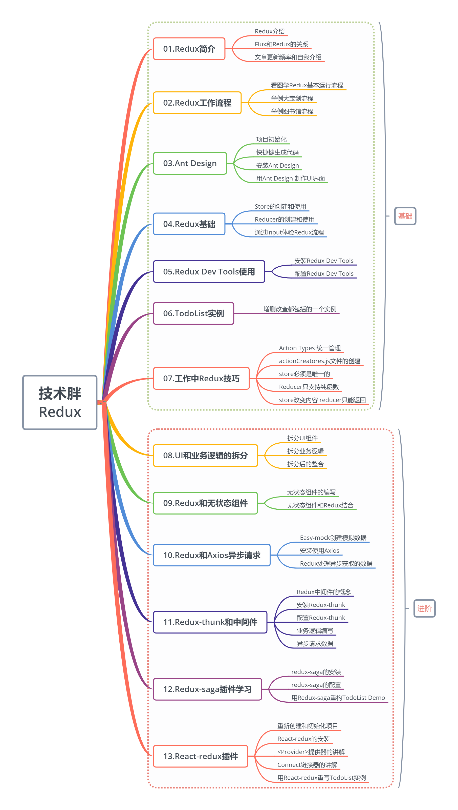

这里先给出这个课程的基本大纲，也是你可以学会的知识。

P01:基础-认识Redux和文章介绍

其实能搜到这篇文章，证明对Redux也算有一个基本认识，这篇文章适合初级前端开发者阅读，会详细讲解Redux的基础知识，在了解基础知识后，会逐步增加Redux高级内容。

课程内容参照了《深入浅出React和Redux》但是都是从新编排和加入了自己的理解，作者如有异议或要求删除，可以联系博主。

(1.5倍新世界)

自我介绍

有很多老朋友，也有一些新朋友。所以先作一下自我介绍，我网名“技术胖”,作程序有11年多了，没有做出什么改变世界的产品，也不是什么领域专家。最近2年一直保持写博客的习惯，目标就是出1000集免费视频，来帮助刚步入前端程序的新人。目前还是一个每天搬砖的程序员，我热爱我目前的工作，也梦想成为一个全职讲师，并且一直为着梦想不断努力着。

我每周都会出3集左右的前端免费视频教程，所以你可以一直跟着我一起学习。

如果你愿意和技术胖一起学习React的相关知识，可以进入QQ群：159579268

Redux介绍

Redux是一个用来管理管理数据状态和UI状态的JavaScript应用工具。随着JavaScript单页应用（SPA）开发日趋复杂，JavaScript需要管理比任何时候都要多的state（状态），Redux就是降低管理难度的。（Redux支持React，Angular、jQuery甚至纯JavaScript）

可以通过一张图，看出Redux如何简化状态管理的（图片来自“前端记录”网站，如有侵权，请联系删除）

从图中可以看出，如果不用Redux，我们要传递state是非常麻烦的。Redux中，可以把数据先放在数据仓库（store-公用状态存储空间）中，这里可以统一管理状态，然后哪个组件用到了，就去stroe中查找状态。如果途中的紫色组件想改变状态时，只需要改变store中的状态，然后其他组件就会跟着中的自动进行改变。

Flux和Redux的关系

有很多小伙伴都会问我讲不讲Flux？这里我可以明确的回答你，不讲。

因为在我看来Redux就是Flux的升级版本，早期使用React都要配合Flux进行状态管理，但是在使用中，Flux显露了很多弊端，比如多状态管理的复杂和易错。所以Redux就诞生了，现在已经完全取代了Flux，过时的东西就不再讲解了。

如果你说公司还在用Flux，你可以试着学会Redux后，进行升级，抛弃Flux，其实前端的知识就是更新淘汰的这么迅速，要时刻保持学习的习惯。

这就好比，我跟女神出去已经用液体避孕喷液了，你还用胶皮套套，那我们爽的程度能一样吗？一起使用Redux，让我们嗨起来。

更新频率

我也是一个程序员，每天都要上班，也会有通宵加班，所以每周视频更新三集左右。加入QQ群可以第一时间得到更新信息。让我们一起学习吧。

P02:基础-Redux工作流程

这节课要学习的知识非常重要，你只有学会了Redux工作流程，你才能对Redux有个通透的了解。如果你只官方的图或者自己看文档，还是有一点难度的。但是如果你红尘接触的多或者跟胖哥一样，是一个喜欢小姐姐的人，那这个流程就很简单了。（看视频）

(1.5倍新世界)

redux官方图片

先来看一下官方给的图片，我也试着解说一下，不好勿怪。因为这东西本来就不太好了解，官方有很抽象。

这个的解读看视频吧，写起来还是挺麻烦的。其实我觉的这个图完全是个已经回Redux的人看的，至少是一个入门Redux的人看的，完全不符合一个初学者的视角。

我画的理解图

我就以多年老司机的身份给你们讲解一下这个图，这个图你完全可以理解为一次大宝剑的过程，如果你经验不多，或者你是女孩子，我可以理解为借书的过程。当然我还是拿宝剑为例(图是我自己画的，很丑无怪).

React Components就相当于大官人，然后我们去作“大宝剑”，我们先见到的是Action Creators“妈妈桑”,我们说我要找小红，我是熟客了。"妈妈桑"就回到了Store，然后让Reducer看看"小红“忙不忙（现在的状态），如果不忙就让她过来配大官人。

我还为女孩子和处世未深的小朋友准备了图书管理员版本。

这个版本我就在视频中进行讲解了，文字上不作过多介绍。

总结：Redux的实现过程虽然简单，但是如果你看官方的图不容易理解，你可以把它和周围身边的事情联系起来，就简单很多。需要特别声明的是，你一定要弄明白这个工作流程，这对于你这个Redux的学习非常重要。

P03: 基础-Ant Design介绍和环境初始化

Ant Design是一套面向企业级开发的UI框架，视觉和动效作的很好。阿里开源的一套UI框架，它不只支持React，还有ng和Vue的版本，我认为不论你的前端框架用什么，Ant Design都是一个不错的选择。习惯性把AntDesign简称为antd。 目前有将近5万Star，算是React UI框架中的老大了。

官网为:https://ant.design/index-cn

初始化项目

这里我默认你已经看过我的“React16免费视频教程”了，所以我认为你这个过程已经了解了知识点，我只是带着你作一遍。

1. 如果你没有安装脚手架工具，你需要安装一下：

npm install -g create-react-app

1. 直接用脚手架工具创建项目

 D:  //进入D盘 mkdir ReduxDemo   //创建ReduxDemo文件夹 cd ReduxDemo      //进入文件夹 create-react-appdemo01  //用脚手架创建React项目 cd demo01   //等项目创建完成后，进入项目目录 npm start  //预览项目

这样项目就制作好了，我们删除一下没用的文件，让代码结构保持最小化。删除SRC里边的所有文件，只留一个index.js,并且index.js文件里也都清空。

快速生成基本代码结构

编写index.js文件,这个文件就是一个基础文件，基本代码也都是一样的。

import React from'react';import ReactDOM from'react-dom'import TodoList from'./TodoList'ReactDOM.render(<TodoList/>,document.getElementById('root'))

编写TodoList.js文件,这个文件可以用Simple React Snippets快速生成。先输入imrc,再输入ccc

代码如下：

importReact, { Component } from 'react';classTodoListextendsComponent{    render() {         return (             

HelloWorld

         );    }}export defaultTodoList;

做完这个，算是项目基本构建完成，可以打开浏览器看一下效果。接下来就可以安装Ant DesignUI框架了。

安装AntDesign

这里使用npm来进行安装，当然你有可以用yarn的方式进行安装.

npm install antd --save

yarn的安装方式是:

yarn add antd

如果你的网络情况不好，最好使用cnpm来进行安装。等待程序安装完以后，就可以进行使用了。这个我家里的网络安装起来非常耗时，所以就等待安装完成后，再下节课学习一下如何使用吧。

P04:基础-用Ant Design制作UI界面

已经完成了基本开发环境和AntDesign的安装。这节课用Ant Design制作一下TodoList的界面。本文不会对Ant Design深入讲解，只是为了让课程的界面好看一点，如果你对它有强烈的学习需要或愿望，可以看一下Ant Design官方文档,文档都是中文，没有什么难度。图片就是这节课最后要做出的样式。

引入CSS样式

在使用Ant Design时，第一件事就是先引入CSS样式，有了样式才可以让UI组件显示正常。可以直接在/src/TodoList.js文件中直接用import引入。

import'antd/dist/antd.css'

编写Input框

引入CSS样式之后，可以快乐的使用antd里的框了，在使用的时候，你需要先引入Input组件。全部代码如下:

importReact, { Component } from 'react';import'antd/dist/antd.css'import { Input } from 'antd'classTodoListextendsComponent{    render() {         return (             

                

                    <Input placeholder='jspang' style={{ width:'250px'}}/>                

            

         );    }}export defaultTodoList;

在Input组件里，我们设置了style，注意设置这个时不带单引号或者双引号的。

写完后就可以简单的看一下效果了。

编写Button按钮

Ant Design也提供了丰富好看的按钮组件，直接使用最简单的Primary按钮。使用按钮组件前也需要先引入,为了让组件更好看，还加入了一些Margin样式，代码如下:

importReact, { Component } from 'react';import'antd/dist/antd.css'import { Input , Button } from 'antd'classTodoListextendsComponent{    render() {         return (             

'10px'}}>                

                    <Input placeholder='Write something' style={{ width:'250px', marginRight:'10px'}}/>                    <Buttontype="primary">增加Button>                

            

         );    }}export defaultTodoList;

List组件制作列表

同样用Ant Desgin制作todoList的列表，在制作前，我们先在class外部声明一个data数组，数组内容可以随便写。

constdata=[    '早8点开晨会，分配今天的开发工作',    '早9点和项目经理作开发需求讨论会',    '晚5:30对今日代码进行review']

然后引入List组件，代码如下:

import { Input , Button , List } from'antd'

最后就是使用这个List组件了。

<divstyle={{margin:'10px',width:'300px'}}><ListbordereddataSource={data}renderItem={item=>(<List.Item>{item}List.Item>)}    />    div>

为了方便学习，我给出了全部代码，如果你作起来有难度，可以直接复制下面的代码。

importReact, { Component } from 'react';import'antd/dist/antd.css'import { Input , Button , List } from 'antd'const data=[    '早8点开晨会，分配今天的开发工作',    '早9点和项目经理作开发需求讨论会',    '晚5:30对今日代码进行review']classTodoListextendsComponent{    render() {         return (             

'10px'}}>                

                    <Input placeholder='write someting' style={{ width:'250px', marginRight:'10px'}}/>                    <Buttontype="primary">增加Button>                

                

'10px',width:'300px'}}>                    <List                        bordered                        dataSource={data}                        renderItem={item=>(<List.Item>{item}List.Item>)}                    />                    

            

         );    }}export defaultTodoList;

总结:这节课主要用Ant Design制作了todoList的界面，使用了，

'10px',width:'300px'}}> this.state.list} renderItem={(item,index)=>(this.deleteItem.bind(this,index)}>{item})} />

); } storeChange(){ console.log('store changed') this.setState(store.getState()) } //--------关键代码------start changeInputValue(e){ const action = changeInputAction(e.target.value) store.dispatch(action) } clickBtn(){ const action = addItemAction() store.dispatch(action) } deleteItem(index){ const action = deleteItemAction(index) store.dispatch(action) } //--------关键代码------end}export default TodoList;

都写完了，我们就可以到浏览器中进行查看了，功能也是完全可以的。这节课我们实现Redux Action和业务逻辑的分离，我觉的这一步在你的实际工作中是完全由必要作的。这样可打打提供程序的可维护性。

P12:加餐-Redux填三个小坑

到这里Redux基础部分也就快结束了，但是我有必要再拿出一节课，把平时你容易犯的错误总结一下。这节课的知识点你可能都已经知道，也可以省略不看。我总结了三个React新手最容易范的错误。

- store必须是唯一的，多个store是坚决不允许，只能有一个store空间

- 只有store能改变自己的内容，Reducer不能改变

- Reducer必须是纯函数

Store必须是唯一的

现在看TodoList.js的代码，就可以看到，这里有一个/store/index.js文件，只在这个文件中用createStore()方法，声明了一个store，之后整个应用都在使用这个store。下面我给出了index.js内容，可以帮助你更好的回顾。

import { createStore } from'redux'//  引入createStore方法import reducer from'./reducer'const store = createStore(    reducer,    window.__REDUX_DEVTOOLS_EXTENSION__ && window.__REDUX_DEVTOOLS_EXTENSION__()) // 创建数据存储仓库exportdefault store   //暴露出去

只有store能改变自己的内容，Reducer不能改变

很多新手小伙伴会认为把业务逻辑写在了Reducer中，那改变state值的一定是Reducer，其实不然，在Reducer中我们只是作了一个返回，返回到了store中，并没有作任何改变。我这个在上边的课程中也着重进行了说明。我们再来复习一下Reducer的代码，来加深印象。

Reudcer只是返回了更改的数据，但是并没有更改store中的数据，store拿到了Reducer的数据，自己对自己进行了更新。

import {CHANGE_INPUT,ADD_ITEM,DELETE_ITEM} from './actionTypes'const defaultState = {    inputValue : 'Write Something',    list:[        '早上4点起床，锻炼身体',        '中午下班游泳一小时'    ]}export default (state = defaultState,action)=>{    if(action.type === CHANGE_INPUT){        let newState = JSON.parse(JSON.stringify(state)) //深度拷贝state        newState.inputValue = action.value        return newState    }    //state值只能传递，不能使用    if(action.type === ADD_ITEM ){ //根据type值，编写业务逻辑        let newState = JSON.parse(JSON.stringify(state))         newState.list.push(newState.inputValue)  //push新的内容到列表中去        newState.inputValue = ''        return newState    }    if(action.type === DELETE_ITEM ){ //根据type值，编写业务逻辑        let newState = JSON.parse(JSON.stringify(state))         newState.list.splice(action.index,1)  //push新的内容到列表中去        return newState    }    return state}

Reducer必须是纯函数

先来看什么是纯函数，纯函数定义：

如果函数的调用参数相同，则永远返回相同的结果。它不依赖于程序执行期间函数外部任何状态或数据的变化，必须只依赖于其输入参数。

这个应该是大学内容，你可能已经忘记了，其实你可以简单的理解为返回的结果是由传入的值决定的，而不是其它的东西决定的。比如下面这段Reducer代码。

export default (state = defaultState,action)=>{    if(action.type === CHANGE_INPUT){        let newState = JSON.parse(JSON.stringify(state)) //深度拷贝state        newState.inputValue = action.value        return newState    }    //state值只能传递，不能使用    if(action.type === ADD_ITEM ){ //根据type值，编写业务逻辑        let newState = JSON.parse(JSON.stringify(state))         newState.list.push(newState.inputValue)  //push新的内容到列表中去        newState.inputValue = ''        return newState    }    if(action.type === DELETE_ITEM ){ //根据type值，编写业务逻辑        let newState = JSON.parse(JSON.stringify(state))         newState.list.splice(action.index,1)  //push新的内容到列表中去        return newState    }    return state}

它的返回结果，是完全由传入的参数state和action决定的，这就是一个纯函数。这个在实际工作中是如何犯错的？比如在Reducer里增加一个异步ajax函数，获取一些后端接口数据，然后再返回，这就是不允许的（包括你使用日期函数也是不允许的），因为违反了调用参数相同，返回相同的纯函数规则。

接下来我还会给大家继续讲解Redux的进阶部分，让大家对Redux的使用更加精通和深入，我是技术胖，一个作免费前端视频的博主，我们一起加油。

P13:进阶-组件UI和业务逻辑的拆分方法

Redux的基础知识都学完了，但是你离高手还差一点东西，就是如何拆分UI部分和业务逻辑，让项目更容易维护。你可能会问了除了更容易维护，还有没有其它好处，肯定是有的。能拆分了，就代表能更多人协作，实现超大型项目的开发和快速上线。比如两个人同时写一个模块，一个写UI部分，一个写业务逻辑部分，之后两个人在一起整合。也许小公司你觉的这样的优势不明显，因为公司的财力或者开发人员不足，使得这种开发方法大大受到了限制。但是大公司，不缺钱，不缺人，抢的就是时间，这时候这种开发模式就可以解决问题。这也是我为什么强烈推荐你去大公司的原因，虽然技术都一样，但是大公司和小公司开发的模式是完全不一样的。有点跑题了，言归正传，看看到底如何把一个组件的UI和业务逻辑拆分出来。

拆分UI组件

可以看到TodoList.js组件是UI和业务逻辑完全耦合在一起的，这时候在src目录下新建一个文件叫TodoListUI.js,快速生成页面的基本结构.

importReact, { Component } from 'react';classTodoListUiextendsComponent{    render() {         return ( 

123

 );    }}export defaultTodoListUi;

然后去TodoList.js里把JSX的部分拷贝过来， 现在的代码如下(当然现在是不可以使用的，好多东西我们还没有引入，所以会报错):

importReact, { Component } from 'react';classTodoListUiextendsComponent{    render() {         return (             

'10px'}}>                

                    <Input                         placeholder={this.state.inputValue}                         style={{ width:'250px', marginRight:'10px'}}                        onChange={this.changeInputValue}                        value={this.state.inputValue}                    />                    <Buttontype="primary"                        onClick={this.clickBtn}                    >增加Button>                

                

'10px',width:'300px'}}>                    <List                        bordered                        dataSource={this.state.list}                        renderItem={(item,index)=>(<List.Item onClick={this.deleteItem.bind(this,index)}>{item}List.Item>)}                    />                    

            

         );    }}export defaultTodoListUi;

要想可用，第一步是需要引入antd的相关类库，这时候你可以拷贝TodoList.js的相关代码，把antd的CSS和用到的组件都拷贝过来，进行引入。

import'antd/dist/antd.css'import { Input , Button , List } from'antd'

但是这并没有TodoListUI.js组件所需要的state(状态信息)，接下来需要改造父组件进行传递值。

TodoList.js文件的修改

TodoList.js里就不需要这么多JSX代码了，只要引入TodoListUI.js。

import TodoListUI from'./TodoListUI'

引入之后render函数就可以写成下面这个样子。

render() {     return (             );}

这样就算做完UI和业务分离的第一步了，剩下的就是改变TodoListUI.js里边的属性了，也就是两个组件的整合。

UI组件和业务逻辑组件的整合

其实整合就是通过属性传值的形式，把需要的值传递给子组件，子组件接收这些值，进行相应的绑定就可以了。这个步骤比较多，还是看视频学习吧。

TodoList.js的render部分

render() {     return (         this.state.inputValue}            list={this.state.list}            changeInputValue={this.changeInputValue}            clickBtn={this.clickBtn}            deleteItem={this.deleteItem}        />    );}

你还需要在constructor(构造函数里)对deleteItem方法进行重新绑定this，代码如下。

this.deleteItem = this.deleteItem.bind(this)

修改完TodoList.js文件，还要对UI组件进行对应的属性替换，所有代码如下。

importReact, { Component } from 'react';import'antd/dist/antd.css'import { Input , Button , List } from 'antd'classTodoListUiextendsComponent{    render() {         return (             

'10px'}}>                

                    <Input                          style={{ width:'250px', marginRight:'10px'}}                        onChange={this.props.changeInputValue}                        value={this.props.inputValue}                    />                    <Buttontype="primary"                        onClick={this.props.clickBtn}                    >增加Button>                

                

'10px',width:'300px'}}>                    <List                        bordered                        dataSource={this.props.list}                        renderItem={(item,index)=>(<List.Item onClick={(index)=>{this.props.deleteItem(index)}}>{item}List.Item>)}                    />                    

            

         );    }}export defaultTodoListUi;

需要注意的是在List组件的删除功能,需要用箭头函数的形式，代替以前方法，并在箭头函数里使用属性的方法，调用出啊你过来的方法。

<List    bordered    dataSource={this.props.list}    renderItem={(item,index)=>(<List.Item onClick={(index)=>{this.props.deleteItem(index)}}>{item}List.Item>)}/>    

这些都做完了，你就已经把组件进行了拆分，其实这节课学习的目的不是拆分的步骤，而是拆分的思想，你可以反复几次来加深对UI和业务逻辑拆分的理解。前端免费课程就找技术胖，下节课再见。

P14:进阶-填坑和Redux中的无状态组件

上节课程序写完，有一个小错误，当时我并没注意到，还是VIP群里的小伙伴告诉我的，无意中给大家留了一个坑，跟大家说对不起了。这节课我们先解决这个遗留问题，再讲一下无状态组件。无状态组件其实就是一个函数，它不用再继承任何的类（class），当然如名字所一样，也不存在state（状态）。因为无状态组件其实就是一个函数（方法）,所以它的性能也比普通的React组件要好。

胖哥翻车填坑

上节课写完UI和业务分离后，在删除TodoList的项目时，是有一个错误的，这个错误属于业务逻辑错误，并不是语法错误。就是在删除item时，正序删除是没有问题的，但是倒叙删除是有问题的。主要是我们的index出现了重新声明的问题。

原来的错误代码是这样的：

<List    bordered    dataSource={this.props.list}    renderItem={(item,index)=>(<List.Item onClick={(index)=>{this.props.deleteItem(index)}}>{item}List.Item>)}/>   

只要改成下面这样就正确了。

 <List    bordered    dataSource={this.props.list}    renderItem={        (item,index)=>(            <List.Item onClick={()=>{this.props.deleteItem(index)}}>                {item}            List.Item>        )    }/>    

无状态组件的改写

把UI组件改成无状态组件可以提高程序性能，具体来看一下如何编写。

1. 首先我们不在需要引入React中的{ Component }，删除就好。

1. 然后些一个TodoListUI函数,里边只返回JSX的部分就好，这步可以复制。

1. 函数传递一个props参数，之后修改里边的所有props，去掉this。

这里给出最后修改好以后的无状态组件代码，这样的效率要高于以前写的普通react组件。

import React from 'react';import'antd/dist/antd.css'import { Input , Button , List } from 'antd'const TodoListUi = (props)=>{    return(        

'10px'}}>            

                '250px', marginRight:'10px'}}                    onChange={props.changeInputValue}                    value={props.inputValue}                />                            

            

'10px',width:'300px'}}>                <List                    bordered                    dataSource={props.list}                    renderItem={                        (item,index)=>(                            <List.Item onClick={()=>{props.deleteItem(index)}}>                                {item}                            List.Item>                        )                    }                />                

        

    )}exportdefault TodoListUi;

总结:这节课主要学习了React中的无状态组件，如果是以前没有Redux的时候，实现分离是比较困难的，但是现在我们作项目，一定想着找个组件是否可以作成无状态组件。如果能做成无状态组件就尽量作成无状态组件，毕竟性能要高很多。

P15:进阶-Axios异步获取数据并和Redux结合

这节课是最近几天小伙伴问我比较多的问题，就是从后端接口获取了数据，如何可以放到Redux的store中，很多小伙伴被这个困难卡住了。这节课就来学习一下如何从后台取得数据，并和Redux结合，实现想要的业务逻辑。比如以前我们的列表数据是在Reducer里写死的，这节课使用Axios从后台获取数据。

利用easy-mock创建模拟数据

这个在基础课程中已经讲过了，我就不作过多的介绍了，如果你还不会，就直接看基础课程吧，反复讲也没什么意思。如果你说我也懒得新建一个，你也可以使用我的模拟数据，我在这里给出地址。

地址：https://www.easy-mock.com/mock/5cfcce489dc7c36bd6da2c99/xiaojiejie/getList

JSON的基本格式，如果上面的接口不管用了，你可以用Easy mock自己作一个这样的接口:

{  "data": {    "list": [      '早上4点起床，锻炼身体',      '中午下班游泳一小时',      '晚上8点到10点，学习两个小时'    ]  }}

安装并使用Axios

因为在Redux的学习中，我们使用了新的项目和目录，所以要重新安装Axios插件（以前安装的不能再使用了）。直接使用npm进行安装。

npm install--save axios

安装完成后，就可以在TodoList.js中，引入并进行使用了。

import axios from'axios'

引入后，在组件的声明周期函数里componentDidMount获取远程接口数据。

componentDidMount(){    axios.get('https://www.easy-mock.com/mock/5cfcce489dc7c36bd6da2c99/xiaojiejie/getList').then((res)=>{        console.log(res)    })}

做完这一步骤后，可以在浏览器中打开，预览下是否控制台(console)获取数据，如果可以获取，说明完全正常。

获取数据后跟Redux相结合（重点）

接下来就可以把得到的数据放到Redux的store中了，这部分和以前的知识都一样，我就尽量给出代码，少讲理论了。先创建一个函数，打开以前写的store/actionCreatores.js函数，然后写一个新的函数，代码如下：

exportconst getListAction  = (data)=>({    type:GET_LIST,    data})

这时候保存会显示找不到GET_LIST,我们再到actionTypes.js文件中加入一个常量，然后引入到actionCreatores.js中

exportconst  GET_LIST = 'getList'

引入到actionCreatores.js中

import {CHANGE_INPUT , ADD_ITEM , DELETE_ITEM , GET_LIST}  from'./actionTypes'

这步完成后，回到TodoList.js文件，继续编写axios中的回调内容，在写之前，记得先把getListAction进行引入。

import {changeInputAction , addItemAction ,deleteItemAction,getListAction} from'./store/actionCreatores'

componentDidMount(){    axios.get('https://www.easy-mock.com/mock/5cfcce489dc7c36bd6da2c99/xiaojiejie/getList').then((res)=>{            constdata = res.dataconst action = getListAction(data)        store.dispatch(action)    })}

现在数据已经通过dispatch传递给store了，接下来就需要reducer处理业务逻辑了。打开reducer.js代码如下(详细步骤在代码中作了注释)：

//----关键代码--------start --------引入GET_LISTimport {CHANGE_INPUT,ADD_ITEM,DELETE_ITEM,GET_LIST} from './actionTypes'//----关键代码--------end const defaultState = {    inputValue : 'Write Something',    //----关键代码--------start --------删除原来的初始化代码，减少冗余list:[]}export default (state = defaultState,action)=>{    if(action.type === CHANGE_INPUT){        let newState = JSON.parse(JSON.stringify(state)) //深度拷贝state        newState.inputValue = action.value        return newState    }    if(action.type === ADD_ITEM ){         let newState = JSON.parse(JSON.stringify(state))         newState.list.push(newState.inputValue)  //push新的内容到列表中去        newState.inputValue = ''        return newState    }    if(action.type === DELETE_ITEM ){ //根据type值，编写业务逻辑let newState = JSON.parse(JSON.stringify(state))         newState.list.splice(action.index,1)  //push新的内容到列表中去        return newState    }    //----关键代码--------start --------if(action.type === GET_LIST ){ //根据type值，编写业务逻辑let newState = JSON.parse(JSON.stringify(state))         newState.list = action.data.data.list//复制性的List数组进去        return newState    }    //----关键代码--------en'd --------    return state}

这样就完成了一次从后台请求数据，然后和Redux结合的过程。希望小伙伴都能练习一下，我们的程序员越来越像真实的开发了，小伙伴也要在练习中不断熟悉这种开发模式。

P16:进阶-Redux-thunk中间件的安装和配置

通过学习，你已经对Redux的基本流程有了全面的了解，也许你已经在项目中开始使用。其实咱们一起学完了大部分的Redux知识，但是我还是决定继续讲解一下Redux-thunk这个Redux最常用的插件。什么时候会用到这个插件那？比如在Dispatch一个Action之后，到达reducer之前，进行一些额外的操作，就需要用到middleware（中间件）。在实际工作中你可以使用中间件来进行日志记录、创建崩溃报告，调用异步接口或者路由。 这个中间件可以使用是Redux-thunk来进行增强(当然你也可以使用其它的)，它就是对Redux中dispatch的加强，这节课我们先来学习一下安装和配置（特别是配置的使用很多小伙伴都配置不成功）。

安装Redux-thunk组件

Redux-thunk并不在Redux基础组件中，也就是说需要进行新安装。安装使用npm就可以了。

npm install--save redux-thunk

在终端命令行输入上面的命令，就可以进行安装了，根据网络不同安装的时间也会有些不同，我办公室的网是秒按，家里的宽带需要10分钟左右。

配置Redux-thunk组件

安装作起来很容易，但是配置就要稍微注意一下了，这里边还是有几个小坑的，如果你完全按照官方文档是配置不成功的。需要在创建store的地方引入redux-thunk，对于我们的目录来说，就是/store/index.js文件。

1.引入applyMiddleware,如果你要使用中间件，就必须在redux中引入applyMiddleware.

import { createStore , applyMiddleware } from'redux'

2.引入redux-thunk库

import thunk from'redux-thunk'

如果你按照官方文档来写，你直接把thunk放到createStore里的第二个参数就可以了，但以前我们配置了Redux Dev Tools，已经占用了第二个参数。

官方文档给的方法:

const store = createStore(    reducer,    applyMiddleware(thunk)) // 创建数据存储仓库

这样写是完全没有问题的，但是我们的Redux Dev Tools插件就不能使用了，如果想两个同时使用，需要使用增强函数。使用增加函数前需要先引入compose。

import { createStore , applyMiddleware ,compose } from'redux'

然后利用compose创造一个增强函数，就相当于建立了一个链式函数，代码如下:

const composeEnhancers =   window.__REDUX_DEVTOOLS_EXTENSION_COMPOSE__ ?    window.__REDUX_DEVTOOLS_EXTENSION_COMPOSE__({}):compose

有了增强函数后，就可以把thunk加入进来了，这样两个函数就都会执行了。

const enhancer = composeEnhancers(applyMiddleware(thunk))

这时候直接在createStore函数中的第二个参数，使用这个enhancer变量就可以了，相当于两个函数都执行了。

const store = createStore( reducer, enhancer)// 创建数据存储仓库

也许你对增加函数还不能完全理解，其实你完全把这个想成固定代码，直接使用就好，我在这里给出全部代码，方便你以后学习使用。

import { createStore , applyMiddleware ,compose } from'redux'//  引入createStore方法import reducer from'./reducer'import thunk from'redux-thunk'const composeEnhancers =   window.__REDUX_DEVTOOLS_EXTENSION_COMPOSE__ ?    window.__REDUX_DEVTOOLS_EXTENSION_COMPOSE__({}):composeconst enhancer = composeEnhancers(applyMiddleware(thunk))const store = createStore( reducer, enhancer) // 创建数据存储仓库exportdefault store   //暴露出去

这样就算把Redux的中间件配置好了，可以运行项目，到浏览器看一下结果和看一下Redux Dev Tools插件了。

P17:进阶-Redux-thunk的使用方法

这节课我们把向后台请求数据的程序放到中间件中，这样就形成了一套完整的Redux流程，所有逻辑都是在Redux的内部完成的，这样看起来更完美，而且这样作自动化测试也会变动简单很多，所以工作中你还是要尽量按照这种写法来写。现在就开始学习吧。

在actionCreators.js里编写业务逻辑

以前actionCreators.js都是定义好的action，根本没办法写业务逻辑，有了Redux-thunk之后，可以把TodoList.js中的componentDidMount业务逻辑放到这里来编写。也就是把向后台请求数据的代码放到actionCreators.js文件里。那我们需要引入axios,并写一个新的函数方法。（以前的action是对象，现在的action可以是函数了，这就是redux-thunk带来的好处）

import axios from'axios'...something...exportconst getTodoList = () =>{    return()=>{        axios.get('https://www.easy-mock.com/mock/5cfcce489dc7c36bd6da2c99/xiaojiejie/getList').then((res)=>{            const data = res.data            console.log(data)        })    }}

现在我们需要执行这个方法，并在控制台查看结果，这时候可以修改TodoList.js文件中的componentDidMount代码。

//先引入getTodoListimport {getTodoList , changeInputAction , addItemAction ,deleteItemAction,getListAction} from'./store/actionCreatores'---something---componentDidMount(){    const action = getTodoList()    store.dispatch(action)}

然后我们到浏览器的控制台中查看一下，看看是不是已经得到了后端传给我们的数据，如果一切正常，应该是可以得到。得到之后，我们继续走以前的Redux流程就可以了。

exportconst getTodoList = () =>{    return(dispatch)=>{        axios.get('https://www.easy-mock.com/mock/5cfcce489dc7c36bd6da2c99/xiaojiejie/getList').then((res)=>{            const data = res.data            const action = getListAction(data)            dispatch(action)        })    }}

这个函数可以直接传递dispatch进去，这是自动的，然后我们直接用dispatch(action)传递就好了。现在我们就可以打开浏览器进行测试了。

这时候还会有一些警告，主要是我们引入了并没有使用，我们按照警告的提示，删除没用的引入就可以了。

也许你会觉的这么写程序很绕，其实我刚开始写Redux的时候也会这么想，但是随着项目的越来越大，你会发现把共享state的业务逻辑放到你Redux提示当中是非常正确的，它会使你的程序更加有条理。而在自动化测试的时候，可以直接对一个方法进行测试，而对生命周期测试是困难的。我目前接触的大公司都是要求这样写的，如果现在还不能理解里边的好处，也不用纠结，先按照这种形式进行编写。等你写过2至3个项目后，你就能理解这种写法的好处了。

P18:进阶-Redux-saga的安装和配置

先来说明一点，我们这里讲的中间件不是React的中间件，而是Redux的中间件，这一点你要明白，否则工作中会出大问题的，你的React知识架构也会出现偏差。其实Redux的中间件不仅仅只有Redux-thunk，还有一个比较出名的是Redux-saga.当然这个中间件我们公司并没有使用，只是自己研究，所以可能讲解有不足的地方。目前国内的IT企业一般都在使用这两个中间件，使用其它的很少，这个就像可口可乐和百事可乐，所以很有必要学习一下。

redux-saga的安装

你可以直接使用npm来进行安装，当然用yarn也是没有问题的，根据自己的喜好吧。我这里使用了npm来进行安装。

npm install--save redux-saga

这里给出github地址，方便你更好的学习。

https://github.com/redux-saga/redux-saga

引入并创建Redux-saga

安装好后，就可以使用了，直接在/src/store/index.js里引入redux-saga,并创建一个sagaMiddleware，代码如下:

import createSagaMiddleware from'redux-saga'//引入sagaconst sagaMiddleware = createSagaMiddleware();   //创建saga中间件

创建好后，还是用Redux的增强函数进行传递。也就是把原来的Redux-thunk替换成saga中间件（注意去掉原来不用的redux-thunk引入）。

import { createStore , applyMiddleware ,compose } from'redux'//  引入createStore方法import reducer from'./reducer'//------关键代码----start----------- import createSagaMiddleware from'redux-saga'const sagaMiddleware = createSagaMiddleware();//------关键代码----end-----------const composeEnhancers =   window.__REDUX_DEVTOOLS_EXTENSION_COMPOSE__ ?    window.__REDUX_DEVTOOLS_EXTENSION_COMPOSE__({}):compose//------关键代码----start-----------const enhancer = composeEnhancers(applyMiddleware(sagaMiddleware))//------关键代码----end-----------const store = createStore( reducer, enhancer) // 创建数据存储仓库exportdefault store   //暴露出去

这步完成后，就把原来的redux-thunk替换成redux-saga了，当然，现在我们还不能使用，我们还需要继续配置sagas.js文件。

创建sagas.js文件并引入

redux-saga希望你把业务逻辑单独写一个文件，这里我们在/src/store/文件夹下建立一个sagas.js文件。

function* mySaga() {} export default mySaga;

创建好以后直接引入到index.js里。

import mySagas from'./sagas'

然后执行run方法，让saga运行起来。

sagaMiddleware.run(mySagas)

为了方便你学习，这里给出/src/store/index.js的全部内容。

import { createStore , applyMiddleware ,compose } from'redux'//  引入createStore方法import reducer from'./reducer'import createSagaMiddleware from'redux-saga'import mySagas from'./sagas'const sagaMiddleware = createSagaMiddleware();const composeEnhancers =   window.__REDUX_DEVTOOLS_EXTENSION_COMPOSE__ ?    window.__REDUX_DEVTOOLS_EXTENSION_COMPOSE__({}):composeconst enhancer = composeEnhancers(applyMiddleware(sagaMiddleware))const store = createStore( reducer, enhancer) sagaMiddleware.run(mySagas)exportdefault store  

现在已经完全替换成redux-saga了，所以以前在TodoList.js中的代码需要删除，不删除就会报错。主要删除componentDidMount声明周期函数里的代码。这样redux-saga的安装和配置就算完成了，之后我们就可以编写中间件了。其实这个配置一般在项目中也只需要作一次，你完全可以收藏网页，然后需要时回来看一下就可以了。

P19:进阶-用Redux-saga获取TodoList列表

上节课已经完成了redux-saga的安装和基本配置，这篇文章就用Redux-saga来完成TodoList的列表获取。其实redxu-saga是比redux-thunk要复杂的，它多出了很多API需要学习，至少是学习成本增加了。但是有的人说saga更适合于大型项目，本人不予表态，也不想引战，如果你的公司用了saga，这两篇文章足可以让你入门了。话不多说，我们继续学习。

编写TodoList.js文件

我们先来改造TodoList.js文件，现在componentDidMount里边是空的，所以我们要进行redux的基本操作，这个流程我不再多作介绍了，已经练习了10几遍了。

当然可以先引入一个action，当然这个action还没有，我们一会再进行编写，给它起名叫做getMyListAction(你可以起任何名字，记住就好，因为下面我们要不断使用)

import {getMyListAction, changeInputAction , addItemAction ,deleteItemAction} from'./store/actionCreatores'

然后顺势在actionCreators.js文件里把这个action创建出来。

exportconst getMyListAction = ()=>({    type:GET_MY_LIST})

写完你会发现GET_MY_LIST也没有，需要先引入，再到actionTypes.js里进行定义

import {GET_MY_LIST,CHANGE_INPUT , ADD_ITEM,DELETE_ITEM,GET_LIST}  from'./actionTypes'

actionTypes.js文件定义GET_MY_LIST

exportconst  GET_MY_LIST = 'getMyList'

之后就可以回到TodoList.js文件，编写componentDidMount里的内容了。

componentDidMount(){    constaction =getMyListAction()store.dispatch(action)console.log(action)}

测试完成，可以删除console.log(),保持代码的简洁和没有冗余代码。

编写sagas.js文件(也是业务逻辑)

用saga的中间件业务逻辑，就都写在这个sagas.js文件里，文件里我们用mySaga来作为入口函数。在入口函数中捕获传递过来的action类型，根据类型不同调用不同的方法。

import { takeEvery } from'redux-saga/effects'import {GET_MY_LIST} from'./actionTypes'//generator函数function* mySaga() {    //等待捕获actionyield takeEvery(GET_MY_LIST, getList)}function* getList(){    console.log('jspang')}exportdefault mySaga;

写完上面的代码，我们看一下是否可以正确在浏览器的控制台打印出结果，如果可以顺利的打印出来，说明到目前为止制作正确。然后接下来我们就要用axios来请求结果了。

这里给出sagas.js的所有内容，然后详细的意思在视频中进行讲解。

import { takeEvery ,put } from'redux-saga/effects'import {GET_MY_LIST} from'./actionTypes'import {getListAction} from'./actionCreatores'import axios from'axios'//generator函数function* mySaga() {    //等待捕获actionyield takeEvery(GET_MY_LIST, getList)}function* getList(){    //这段代码我就不删除了。// axios.get('https://www.easy-mock.com/mock/5cfcce489dc7c36bd6da2c99/xiaojiejie/getList').then((res)=>{//     const data = res.data//     const action = getListAction(data)//     put(action)// })const res = yield axios.get('https://www.easy-mock.com/mock/5cfcce489dc7c36bd6da2c99/xiaojiejie/getList')    const action = getListAction(res.data)    yield put(action)}exportdefault mySaga;

总结：这就是Redux-saga的基本使用方法，其实saga还有其它一些API，但是我工作中用的也不是很多，所以这里也只能保证你达到入门的水平，至于深入，你可以自己探索。至于redux-thunk和redux-saga哪个好的问题，这里不作争论，用网上流行的话说，小孩子才做选择题，技术老鸟全都学。

P20:进阶-React-Redux介绍和安装

React-Redux这是一个React生态中常用组件，它可以简化Redux流程，这节课我们就重新建立一个项目Demo02，然后会利用几节课的时间用React-redux把之前的TodoList案例重新实现一遍。如果你公司不用这个插件，其实没必要耗费时间学。但是作为一篇文章，必须保证知识尽可能完整。（需要注意的是概念：React、Redux、React-redux是三个不同的东西）

React项目初始化

因为以前已经安装了脚手架工具creat-react-app，所以现在直接在项目的终端中输入下面的命令。

create-react-appdemo02cd demo02npm start

经过上面的三个命令，应该可以在浏览器中出现下面的界面（出现画面说明我们项目初始化完成）。

安装完成后，删除一些没有必要的样式和代码，在/src目录下，只留一个index.js文件，其余的全部删除，这时候项目已经不能启动起来了，这很正常。

import React from'react';import ReactDOM from'react-dom';ReactDOM.render(, document.getElementById('root'));

安装react-redux

项目初始化好后，直接使用npm在命令行安装React-redux，这个网络的不同安装时间也有所不同。

npm install--save react-redux

视频录制视时安装的版本是7.1.0版本，你学习的时候可能跟我有所不同，如有不同，可以到Github上查询最新API文档。

修改代码，让他跑起来

目前项目还是没办法跑起来的，需要建立一个TodoList.js的组件。项目代码如下:

importReact, { Component } from 'react';classTodoListextendsComponent{    render() {         return ( 

JSPang

 );    }}export defaultTodoList;

有了TodoList.js后，我们引入到index.js文件下，然后修改代码如下:

import React from'react';import ReactDOM from'react-dom';import TodoList from'./TodoList'ReactDOM.render(, document.getElementById('root'));

这时候再在浏览器中预览，就会只输出一个JSPang的字样。虽然很丑，但是项目已经跑起来了。接下来我们编写一下render函数中的JSX页面（为了节省大家的时间，就不再使用antd了）。

render() {     return (        

<input /><button>提交button>div><ul><li>JSPangli>ul>div>        );}

这时候界面应该发生了一点变化,这样基本的项目我们就算初始化完成了，接下来我们按原来的Redux方式作一个store出来。

Redux的安装和使用（复习）

先在终端中安装Redux包，因为是一个新项目，所以需要重新安装。

npm install--save redux

首先创建一个store文件夹，在/store下创建一个index.js文件,并写入下面代码：

import {createStore} from'redux'import reducer from'./reducer'const store = createStore(reducer)export default store

目前我们还没有reducer，所以我们要创建reducer.js文件，代码如下:

const defalutState = {    inputValue : 'jspang',    list :[]}export default (state = defalutState,action) =>{    return state}

然后再TodoList.js中的构造函数constructor中使用。

import React, { Component } from'react';//-----关键代码--------startimport store from'./store'//-----关键代码--------endclassTodoListextendsComponent{    //-----关键代码--------startconstructor(props){        super(props)        this.state = store.getState()    }    //-----关键代码--------end    render() {         return (            

                    //-----关键代码--------start                    <inputvalue={this.state.inputValue} />                    //-----关键代码--------end                    <button>提交button>div><ul><li>JSPangli>ul>div>            );    }}export default TodoList;

写完这段，到浏览器中保存看一下，应该就得到store中的值了，到目前为止，我们只是安装了React-Redux,但是还并没有进行使用，这节课只要是把基本的环境搭建好和复习一下以前的知识。下节课我们再逐步学习React-Redux的知识，小伙伴们先不要着急，先把开发环境搭建好吧。

P21:进阶-React-redux中的Provider和connect

上节课已经完成了React-redux开发TodoList组件的基本环境。现在就可以开心的学习React-redux了，这节课主要学习一下Provider和connect这两个知识点。

提供器讲解

是一个提供器，只要使用了这个组件，组件里边的其它所有组件都可以使用store了，这也是React-redux的核心组件了。有了就可以把/src/index.js改写成下面的代码样式，具体解释在视频中介绍了。

import React from'react';import ReactDOM from'react-dom';import TodoList from'./TodoList'//---------关键代码--------startimport { Provider } from'react-redux'import store from'./store'//声明一个App组件，然后这个组件用Provider进行包裹。const App = (    <Providerstore={store}><TodoList />Provider>)//---------关键代码--------endReactDOM.render(App, document.getElementById('root'));

写完这个，我们再去浏览器中进行查看，发现代码也是可以完美运行的。需要注意的是，现在还是用传统方法获取的store中的数据。有了Provider再获取数据就没有那么麻烦了。

connect连接器的使用

现在如何简单的获取store中数据那？先打开TodoList.js文件，引入connect，它是一个连接器（其实它就是一个方法），有了这个连接器就可以很容易的获得数据了。

import {connect} from'react-redux'//引入连接器

这时候暴露出去的就变成了connect了，代码如下。

export default connect(xxx,null)(TodoList);

这里的xxx代表一个映射关系，目前还没有制作这个映射关系。

映射关系的制作

映射关系就是把原来的state映射成组件中的props属性，比如我们想映射inputValue就可以写成如下代码。

const stateToProps = (state)=>{    return {        inputValue : state.inputValue    }}

这时候再把xxx改为stateToProps

export default connect(stateToProps,null)(TodoList)

然后把里的state标签，改为props,代码如下:

<inputvalue={this.props.inputValue} />

为了方便你学习，我这里给出所有的TodoList.js的所有代码。

import React, { Component } from 'react';import store from './store'import {connect} from 'react-redux'class TodoList extends Component {    constructor(props){        super(props)        this.state = store.getState()    }    render() {         return (            

                                

JSPang                                        );    }}const stateToProps = (state)=>{    return {        inputValue : state.inputValue    }}export default connect(stateToProps,null)(TodoList);

写完之后再到浏览器中查看一下，发现我们映射的关系也是可以用的。这节课就是React-Redux插件的使用重点，你需要多写几遍，把这个流程记在心里。先到这里，下节课我们继续实现TodoList组件。

P22:进阶-React-redux的数据修改

上节课已经可以用React-redux顺利的拿到Store中数据了。这节课学习如何改变Store中的数据。也就是当我们修改中的值时，去改变store数据，UI界面也随之进行改变。

编写onChange响应事件

打开TodoList.js文件，然后在

JSPang ); }}const stateToProps = (state)=>{ return { inputValue : state.inputValue }}const dispatchToProps = (dispatch) =>{ return { inputChange(e){ console.log(e.target.value) } }}export default connect(stateToProps,dispatchToProps)(TodoList);

派发action到store中

映射关系已经做好了，接下来只要进行action的派发和reducer对业务逻辑的编写就可以了。派发action和以前的流程一样，我就直接给出代码了。

const dispatchToProps = (dispatch) =>{    return {        inputChange(e){            let action = {                type:'change_input',                value:e.target.value            }            dispatch(action)        }    }}

派发后就需求在reducer里边，编写对应的业务逻辑了。

const defalutState = {    inputValue : 'jspang',    list :[]}export default (state = defalutState,action) =>{    if(action.type === 'change_input'){        let newState = JSON.parse(JSON.stringify(state))        newState.inputValue = action.value        return newState    }    return state}

这样就算整个修改过程完成了，到浏览器中查看一下，应该就实现了改变input框的效果。这个流程你刚开始学会觉的很绕，但是你作的多了，你就会发现它很简单，就是一个模式，而且会降低程序出错的机率。建议这个流程你至少要写5遍以上，据我所知，几乎所有公司用react都会用到react-redux，所以这个流程重要性不次于Redux的流程，一定要熟练掌握。

P23:进阶-React-redux增加List数据

这节课主要学习一下如何用React-Redux增加列表数据，如果你上节课的流程练习熟练了，这节课就不是很难了。这节课要实现的效果，就是点击提交按钮时，可以在列表中进行增加。

给

直接在/src/TodoList.js里的Button增加一个onClick事件，代码如下:

<buttononClick={this.props.clickButton}>提交button>

注意这里依然使用的props，也就是说还需要把方法写在dispatchToProps里。我们这里先写一个测试，看看是否绑定上了。

const dispatchToProps = (dispatch) =>{    return {        inputChange(e){            let action = {                type:'change_input',                value:e.target.value            }            dispatch(action)        },        clickButton(){            console.log('111111111')        }    }}

写完clickButton方法后，在浏览器中预览，打开浏览器的控制台看一下结果，应该在点击时，可以看到显示111111111。这步完成，就是用dispatch派发action了。

clickButton(){    letaction = { type:'add_item' }    dispatch(action)}

编写Reducer的业务逻辑

派发完成后,到Reducer编写业务逻辑，这一步和一起的操作基本一样。

const defalutState = {    inputValue : 'jspang',    list :[]}export default (state = defalutState,action) =>{    if(action.type === 'change_input'){        let newState = JSON.parse(JSON.stringify(state))        newState.inputValue = action.value        return newState    }    //----关键代码------start---------    if(action.type === 'add_item'){        let newState = JSON.parse(JSON.stringify(state))        newState.list.push(newState.inputValue)        newState.inputValue = ''        return newState    }    //----关键代码------end---------    return state}

页面UI部分的制作

这步完成后，我们到TodoList.js中进行JSX部分的编写，编写前需要先把stateToProps的映射关系做好。

const stateToProps = (state)=>{    return {        inputValue : state.inputValue,        list:state.list    }}

有了映射关系，就可以再界面中用属性的方式，进行显示，代码如下：

    {        this.props.list.map((item,index)=>{            return (<likey={index}>{item}li>)        })    }</ul>

这样就实现了增加TodoList的列表项，这里给出TodoList.js的代码，方便学习使用.

import React, { Component } from 'react';import store from './store'import {connect} from 'react-redux'class TodoList extends Component {    constructor(props){        super(props)        this.state = store.getState()    }    render() {         return (            

                                                    {                        this.props.list.map((item,index)=>{                            return (

{item})                        })                    }                                    );    }}const stateToProps = (state)=>{    return {        inputValue : state.inputValue,        list:state.list    }}const dispatchToProps = (dispatch) =>{    return {        inputChange(e){            let action = {                type:'change_input',                value:e.target.value            }            dispatch(action)        },        clickButton(){            let action = {                type:'add_item'            }            dispatch(action)        }    }}export default connect(stateToProps,dispatchToProps)(TodoList);

还有一个删除功能我就不浪费大家时间继续制作了，如果你自己有兴趣可以试着作一下。下节课我们主要讲一下目前代码的优化，这样让你在工作中看起来更专业些。

P24:加餐-React-redux程序优化(完结)

这节课把现在写的代码优化一下，作程序的都应该有一些代码洁癖，才能写出让人称赞的程序。写完业务逻辑后作代码优化，也是程序员的本质工作之一。

用结构复制精简代码

现在代码中有好几处this.props都是重复的，这时候就可以用javascript的解构赋值方法，来精简代码。修改TodoList.js中的Render函数，把原来带代码修改为下面的代码:

    render() {         let {inputValue ,inputChange,clickButton,list} = this.props;        return (            

<inputvalue={inputValue}onChange={inputChange} /><buttononClick={clickButton}>提交button>div><ul>                    {                        list.map((item,index)=>{                            return (<likey={index}>{item}li>)                        })                    }                ul>div>        );    }

把TodoList改为UI组件-提高性能

可以看到，现在的TodoList组件里没有任何的业务逻辑，只有一个Render方法，这时候就可以把它改为UI组件(无状态组件)，UI组件就是一个方法，减少很多冗余操作，从而提高程序运行性能。这时候重新声明一个TodoList的变量，然后把render函数里的东西复制过来，只要稍加修改，就可以得到下面的代码：

const TodoList =(props)=>{    let {inputValue ,inputChange,clickButton,list} = props; // 粘贴过来后，此处要进行修改return (        

<inputvalue={inputValue}onChange={inputChange} /><buttononClick={clickButton}>提交button>div><ul>                {                    list.map((item,index)=>{                        return (<likey={index}>{item}li>)                    })                }            ul>div>    );}

代码写完后，我们删除一些不用的引入，然后就可以到浏览器中进行预览了。

import React from'react';import {connect} from'react-redux'

为了更好的学习，我在这里给出目前TodoList.js的所有代码。

import React from 'react';import {connect} from 'react-redux'const TodoList =(props)=>{    let {inputValue ,inputChange,clickButton,list} = props; // 粘贴过来后，此处要进行修改    return (        

                                        {                    list.map((item,index)=>{                        return (

{item})                    })                }                        );}const stateToProps = (state)=>{    return {        inputValue : state.inputValue,        list:state.list    }}const dispatchToProps = (dispatch) =>{    return {        inputChange(e){            let action = {                type:'change_input',                value:e.target.value            }            dispatch(action)        },        clickButton(){            let action = {                type:'add_item'            }            dispatch(action)        }    }}export default connect(stateToProps,dispatchToProps)(TodoList);

那我们反过来，再来理解一下最后一句话代码的意思。

export default connect(stateToProps,dispatchToProps)(TodoList);

connect的作用是把UI组件（无状态组件）和业务逻辑代码的分开，然后通过connect再链接到一起，让代码更加清晰和易于维护。这也是React-Redux最大的有点。

Redux的教程和视频到这里就结束了，下套课程我会讲解React-router，请小伙伴们持续关注博客，获得的最新的学习视频。

