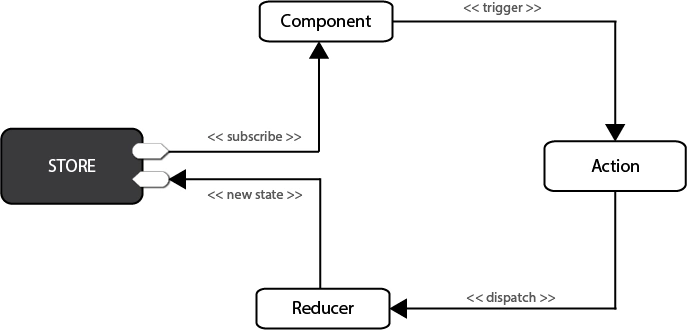
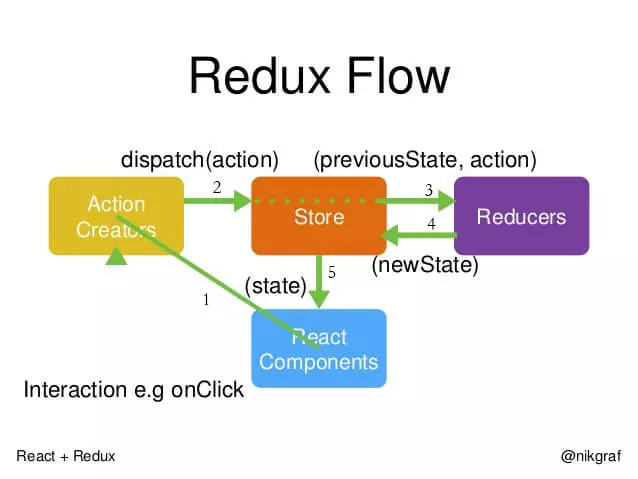

# Redux教程
[toc]
> ## Redux简介
==Redux== 是目前React生态中，最好的数据层框架，所以单独拿出一个文章来系统的讲解Redux。

Redux是一个用来管理管理数据状态和UI状态的JavaScript应用工具。随着JavaScript单页应用（SPA）开发日趋复杂，JavaScript需要管理比任何时候都要多的state（状态），Redux就是降低管理难度的。（Redux支持React，Angular、jQuery甚至纯JavaScript）



Redux中，可以把数据先放在数据仓库（store-公用状态存储空间）中，这里可以统一管理状态，然后哪个组件用到了，就去stroe中查找状态。如果途中的紫色组件想改变状态时，只需要改变==store==中的状态，然后其他组件就会跟着中的自动进行改变。

> ## Redux创建仓库store和reducer
Redux工作流程中有四个部分，最重要的就是store这个部分，因为它把所有的数据都放到了store中进行管理。在编写代码的时候，因为重要，所以要优先编写store。



在使用==Redux==之前，需要先用==npm install==来进行安装,打开终端，并进入到项目目录，然后输入。
```
npm install --save redux
```
安装好==redux==之后，在src目录下创建一个==store==文件夹,然后在文件夹下创建一个==index.js==文件。

index.js就是整个项目的store文件，打开文件，编写下面的代码。
```js
import { createStore } from 'redux'  // 引入createStore方法
const store = createStore()          // 创建数据存储仓库
export default store                 //暴露出去
```
这样虽然已经建立好了仓库，但是这个仓库很混乱，这时候就需要一个有管理能力的模块出现，这就是==Reducers==。这两个一定要一起创建出来，这样仓库才不会出现互怼现象。在==store==文件夹下，新建一个文件==reducer.js==,然后写入下面的代码。
```
const defaultState = {}  //默认数据
export default (state = defaultState,action)=>{  //就是一个方法函数
    return state
}
```
- state: 是整个项目中需要管理的数据信息,这里我们没有什么数据，所以用空对象来表示。
- 
这样reducer就建立好了，把reducer引入到store中,再创建store时，以参数的形式传递给store。
```
import { createStore } from 'redux'  //  引入createStore方法
import reducer from './reducer'    
const store = createStore(reducer) // 创建数据存储仓库
export default store   //暴露出去
```

> ## 在store中为todoList初始化数据
仓库==store==和==reducer==都创建好了，可以初始化一下==todoList==中的数据了，在==reducer.js==文件的==defaultState==对象中，加入两个属性:==inputValue==和==list==。代码如下
```jsx
const defaultState = {
    inputValue : 'Write Something',
    list:[
        '早上4点起床，锻炼身体',
        '中午下班游泳一小时'
    ]
}
export default (state = defaultState,action)=>{
    return state
}
```
这就相当于你给Store里增加了两个新的数据。

> ## 组件获得store中的数据
有了store仓库，也有了数据，那如何获得stroe中的数据那？你可以在要使用的组件中，先引入store。 我们todoList组件要使用store，就在src/TodoList.js文件夹中，进行引入。这时候可以删除以前写的data数据了。
```
import store from './store/index'
```
当然你也可以简写成这样:
```
import store from './store'
```
引入store后可以试着在构造方法里打印到控制台一下，看看是否真正获得了数据，如果一切正常，是完全可以获取数据的。
```
constructor(props){
    super(props)
    console.log(store.getState())
}
```
这时候数据还不能在UI层让组件直接使用，我们可以直接复制给组件的state，代码如下(我这里为了方便学习，给出全部代码了).
```
import React, { Component } from 'react';
import 'antd/dist/antd.css'
import { Input , Button , List } from 'antd'
import store from './store'


class TodoList extends Component {
constructor(props){
    super(props)
    //关键代码-----------start
    this.state=store.getState();
    //关键代码-----------end
    console.log(this.state)
}
    render() { 
        return ( 
            <div style={{margin:'10px'}}>
                <div>

                    <Input placeholder={this.state.inputValue} style={{ width:'250px', marginRight:'10px'}}/>
                    <Button type="primary">增加</Button>
                </div>
                <div style={{margin:'10px',width:'300px'}}>
                    <List
                        bordered
                        //关键代码-----------start
                        dataSource={this.state.list}
                        //关键代码-----------end
                        renderItem={item=>(<List.Item>{item}</List.Item>)}
                    />    
                </div>
            </div>
         );
    }
}
export default TodoList;
```

> ## 创建action
想改变==Redux==里边==State==的值就要创建==Action==了。Action就是一个对象，这个对象一般有两个属性，第一个是对==Action==的描述，第二个是要改变的值。
```
changeInputValue(e){
    const action ={
        type:'change_input_value',
        value:e.target.value
    }
}
```
action就创建好了，但是要通过dispatch()方法传递给store。我们在action下面再加入一句代码。
```
changeInputValue(e){
    const action ={
        type:'changeInput',
        value:e.target.value
    }
    store.dispatch(action)
}
```
这是Action就已经完全创建完成了，也和store有了联系。

> ## store的自动推送策略
前面的课程，我已经说了store只是一个仓库，它并没有管理能力，它会把接收到的action自动转发给Reducer。我们现在先直接在Reducer中打印出结果看一下。打开store文件夹下面的reducer.js文件，修改代码。
```js
export default (state = defaultState,action)=>{
    console.log(state,action)
    return state
}
```
讲到这里，就可以解释一下两个参数了：

- **state**: 指的是原始仓库里的状态。
- **action**: 指的是action新传递的状态。

通过打印你可以知道，==Reducer==已经拿到了原来的数据和新传递过来的数据，现在要作的就是改变store里的值。我们先判断==type==是不是正确的，如果正确，我们需要从新声明一个变量==newState==。（**记住：Reducer里只能接收state，不能改变state。**）,所以我们声明了一个新变量，然后再次用==return==返回回去。
```js
export default (state = defaultState,action)=>{
    if(action.type === 'changeInput'){
        let newState = JSON.parse(JSON.stringify(state)) //深度拷贝state
        newState.inputValue = action.value
        return newState
    }
    return state
}
```

> ## 激活组件更新
现在store里的数据已经更新了，但是组件还没有进行更新，我们需要打开组件文件==TodoList.js==，在==constructor==，写入下面的代码。
```
constructor(props){
    super(props)
    this.state=store.getState();
    this.changeInputValue= this.changeInputValue.bind(this)
    //----------关键代码-----------start
    this.storeChange = this.storeChange.bind(this)  //转变this指向
    store.subscribe(this.storeChange) //订阅Redux的状态
    //----------关键代码-----------end
}
```
当然我们现在还没有这个==storeChange==方法，只要写一下这个方法，并且重新==setState==一次就可以实现组件也是变化的。在代码的最下方，编写==storeChange==方法。
```js
 storeChange(){
     this.setState(store.getState())
 }
 ```
 
 > ## 把Action Types 单度写入一个文件
写Redux Action的时候，我们写了很多Action的派发，产生了很多Action Types，如果需要Action的地方我们就自己命名一个Type,会出现两个基本问题：

- 这些Types如果不统一管理，不利于大型项目的服用，设置会长生冗余代码。
- 因为Action里的Type，一定要和Reducer里的type一一对应在，所以这部分代码或字母写错后，浏览器里并没有明确的报错，这给调试带来了极大的困难。

把Action Type单独拆分出一个文件。在src/store文件夹下面，新建立一个actionTypes.js文件，然后把Type集中放到文件中进行管理。
```
export const  CHANGE_INPUT = 'changeInput'
export const  ADD_ITEM = 'addItem'
export const  DELETE_ITEM = 'deleteItem'
```

 > ## 引入Action中并使用
写好了ationType.js文件，可以引入到TodoList.js组件当中，引入代码如下：
```
import { CHANGE_INPUT , ADD_ITEM , DELETE_ITEM } from './store/actionTypes'
```
引入后可以在下面的代码中进行使用这些常量代替原来的Type值了。
```
changeInputValue(e){
    const action ={
        type:CHANGE_INPUT,
        value:e.target.value
    }
    store.dispatch(action)
}
clickBtn(){
    const action = { type:ADD_ITEM }
    store.dispatch(action)
}
deleteItem(index){
    const action = {  type:DELETE_ITEM, index}
    store.dispatch(action)
}
```
> ## 引入Reducer并进行更改
先引入actionType.js文件，然后把对应的字符串换成常量，整个代码如下：
```
import {CHANGE_INPUT,ADD_ITEM,DELETE_ITEM} from './actionTypes'

const defaultState = {
    inputValue : 'Write Something',
    list:[
        '早上4点起床，锻炼身体',
        '中午下班游泳一小时'
    ]
}
export default (state = defaultState,action)=>{
    if(action.type === CHANGE_INPUT){
        let newState = JSON.parse(JSON.stringify(state)) //深度拷贝state
        newState.inputValue = action.value
        return newState
    }
    //state值只能传递，不能使用
    if(action.type === ADD_ITEM ){ //根据type值，编写业务逻辑
        let newState = JSON.parse(JSON.stringify(state)) 
        newState.list.push(newState.inputValue)  //push新的内容到列表中去
        newState.inputValue = ''
        return newState
    }
    if(action.type === DELETE_ITEM ){ //根据type值，编写业务逻辑
        let newState = JSON.parse(JSON.stringify(state)) 
        newState.list.splice(action.index,1)  //push新的内容到列表中去
        return newState
    }
    return state
}
```

