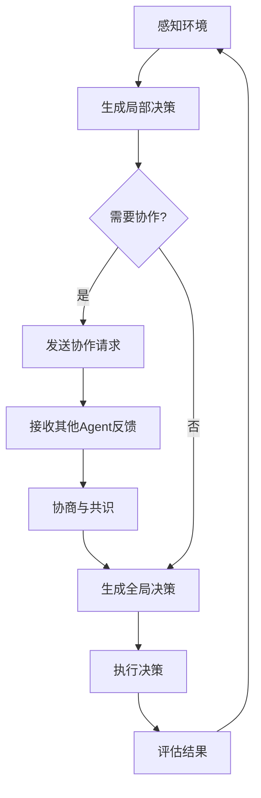
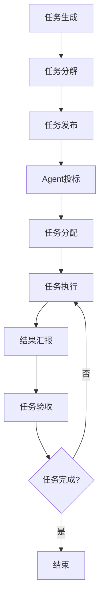
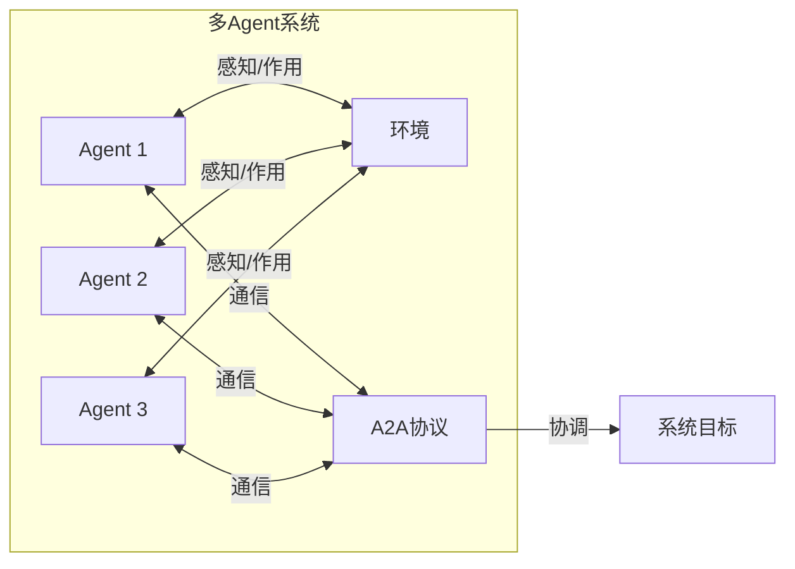

# A2A（Agent-to-Agent）协议技术学习笔记

## 1. 概述

A2A（Agent-to-Agent）协议是多Agent系统（Multi-Agent System, MAS）中Agent之间进行通信、协作和交互的规范和标准。随着分布式人工智能的发展，A2A协议在构建复杂、智能的分布式系统中发挥着越来越重要的作用。

## 2. A2A协议的基本概念与核心特点

### 2.1 基本概念

A2A协议是指在多Agent系统中，定义Agent之间如何进行信息交换、任务协调和资源共享的一套规则、约定和标准。它规定了通信的语法、语义和语用，确保不同Agent之间能够有效地理解和响应彼此的请求。

### 2.2 核心特点

| 特点 | 描述 |
|------|------|
| **标准化** | 提供统一的通信格式和接口，确保不同平台、不同实现的Agent之间能够互操作 |
| **灵活性** | 支持多种通信模式，如同步/异步、点对点/广播、请求-响应等 |
| **可靠性** | 提供错误处理、消息确认、重试机制等，确保通信的可靠性 |
| **安全性** | 支持身份认证、授权、加密等安全机制，保护通信内容的机密性和完整性 |
| **可扩展性** | 支持动态添加新的Agent、服务和协议扩展，适应系统的增长和变化 |
| **语义化** | 不仅传递数据，还传递数据的含义和上下文，支持智能推理和决策 |

### 2.3 应用场景

A2A协议在各个领域都有广泛的应用，主要包括：

1. **智能交通系统**：车辆Agent之间通过A2A协议进行通信，实现交通流量优化、碰撞避免等功能
2. **智能制造**：工业机器人Agent之间通过A2A协议协作完成复杂的生产任务
3. **智能电网**：电力设备Agent之间通过A2A协议协调电力供应和需求
4. **分布式计算**：计算节点Agent之间通过A2A协议分配计算任务和共享资源
5. **电子商务**：买卖双方Agent之间通过A2A协议进行自动议价和交易
6. **智慧城市**：各类城市设施Agent之间通过A2A协议实现城市资源的智能管理和调度

## 3. 多Agent系统（Multi-Agent System, MAS）

### 3.1 定义

多Agent系统（MAS）是由多个相互作用、相互协作的Agent组成的分布式系统。这些Agent具有一定的自主性、社会性、反应性和主动性，能够在动态环境中协同完成复杂任务。

### 3.2 组成要素

一个完整的多Agent系统通常包含以下组成要素：

1. **Agent**：具有自主性、社会性、反应性和主动性的实体
2. **环境**：Agent所处的物理或虚拟空间，提供Agent感知和作用的场所
3. **通信设施**：支持Agent之间信息交换的基础设施
4. **交互协议**：定义Agent之间交互规则的协议（如A2A协议）
5. **任务**：系统需要完成的目标或工作
6. **资源**：完成任务所需的各种资源，如计算资源、数据资源等

### 3.3 工作原理

多Agent系统的工作原理可以概括为以下几个步骤：

1. **感知环境**：Agent通过传感器感知环境状态
2. **自主决策**：Agent根据自身知识和目标做出决策
3. **通信协作**：Agent之间通过A2A协议进行通信和协作
4. **执行动作**：Agent执行决策后的动作，影响环境
5. **适应调整**：Agent根据环境反馈调整自身行为和策略

### 3.4 典型架构

多Agent系统有多种典型架构，主要包括：

#### 3.4.1 集中式架构

在集中式架构中，存在一个中心Agent负责协调和管理所有其他Agent的活动。

```
┌─────────────┐
│ 中心Agent   │
└─────────────┘
       ↓
┌─────┴─────┐
│           │
▼           ▼
┌─────┐  ┌─────┐
│Agent│  │Agent│
└─────┘  └─────┘
    ↑        ↑
    └────────┘
```

**特点**：结构简单，易于管理，但中心Agent可能成为性能瓶颈和单点故障。

#### 3.4.2 分布式架构

在分布式架构中，所有Agent都是平等的，没有中心控制，Agent之间通过直接通信进行协作。

```
┌─────┐  ┌─────┐
│Agent│◄─►│Agent│
└─────┘  └─────┘
    ▲        ▲
    │        │
    └────┬───┘
         │
┌────────▼────────┐
│                 │
▼                 ▼
┌─────┐        ┌─────┐
│Agent│        │Agent│
└─────┘        └─────┘
```

**特点**：去中心化，容错性好，但协调和一致性维护困难。

#### 3.4.3 分层架构

在分层架构中，Agent按照功能或权限划分为不同的层次，上层Agent指导和协调下层Agent的活动。

```
┌─────────────┐
│ 高层Agent   │
└─────────────┘
       ↓
┌─────┴─────┐
│中层Agent 1│
└───────────┘
       ↓
┌─────┴─────┐
│下层Agent 1│  ┌───────────┐
└───────────┘  │下层Agent 2│
               └───────────┘
```

**特点**：结构清晰，模块化程度高，但层次间通信开销大。

#### 3.4.4 联邦式架构

在联邦式架构中，多个相对独立的Agent集群（联邦）通过联邦协议进行协作。

```
┌─────────────────┐  ┌─────────────────┐
│   联邦A         │  │   联邦B         │
│ ┌─────┐ ┌─────┐ │  │ ┌─────┐ ┌─────┐ │
│ │Agent│ │Agent│ │  │ │Agent│ │Agent│ │
│ └─────┘ └─────┘ │  │ └─────┘ └─────┘ │
└─────────────────┘  └─────────────────┘
         ↑                  ↑
         └──────────────────┘
              联邦协议
```

**特点**：灵活性高，可扩展性强，但联邦间协调复杂。

## 4. A2A协议与多Agent系统的关系

### 4.1 关系概述

A2A协议是多Agent系统的核心组成部分，它为Agent之间的通信和交互提供了标准化的机制。没有A2A协议，多Agent系统中的Agent将无法有效地理解和响应彼此的请求，也就无法实现真正的协作。

### 4.2 交互机制

A2A协议定义了多Agent系统中Agent之间的交互机制，主要包括：

#### 4.2.1 通信模型

A2A协议支持多种通信模型，主要包括：

1. **请求-响应模型**：一个Agent发送请求，另一个Agent返回响应
   ```
   Agent A → 请求 → Agent B
   Agent A ← 响应 ← Agent B
   ```

2. **发布-订阅模型**：一个Agent发布消息，多个Agent订阅感兴趣的消息
   ```
               ┌─────────┐
           ┌──►│Agent B  │
   ┌─────┐ │   └─────────┘
   │Agent│─┤   ┌─────────┐
   │  A  │ └──►│Agent C  │
   └─────┘     └─────────┘
   ```

3. **广播模型**：一个Agent向所有其他Agent发送消息
   ```
               ┌─────────┐
           ┌──►│Agent B  │
   ┌─────┐ │   └─────────┘
   │Agent│─┤   ┌─────────┐
   │  A  │ └──►│Agent C  │
   └─────┘     └─────────┘
   ```

#### 4.2.2 消息格式

A2A协议定义了标准化的消息格式，通常包括以下部分：

- **发送方**：消息的发送者ID
- **接收方**：消息的接收者ID
- **消息类型**：请求、响应、通知等
- **消息内容**：实际的消息数据
- **时间戳**：消息发送的时间
- **序列号**：消息的唯一标识，用于确保消息的顺序和去重
- **优先级**：消息的优先级

#### 4.2.3 交互协议栈

A2A协议通常采用分层的协议栈结构，主要包括：

1. **物理层**：负责消息的物理传输
2. **传输层**：负责消息的可靠传输
3. **会话层**：负责建立和维护Agent之间的会话
4. **应用层**：负责处理具体的应用逻辑和消息内容

## 5. 多Agent系统运行机制流程图

### 5.1 多Agent通信流程

```mermaid
sequenceDiagram
    A->>M: 发送消息(包含目标B、内容、类型)
    M->>B: 转发消息
    B->>M: 返回响应
    M->>A: 转发响应
    
    Note over A,M,B: A: Agent A, M: 消息中间件, B: Agent B
```

### 5.2 多Agent协作决策流程



### 5.3 多Agent任务分配流程



### 5.4 A2A协议在多Agent系统中的作用



## 6. 典型A2A协议标准

目前，有多种A2A协议标准被广泛应用于多Agent系统中，主要包括：

### 6.1 FIPA协议

FIPA（Foundation for Intelligent Physical Agents）是一个致力于制定Agent技术标准的组织，它定义了一系列A2A协议标准，包括：

- **通信语言**：FIPA ACL（Agent Communication Language）
- **交互协议**：如请求-响应、合同网、拍卖等
- **目录服务**：FIPA DF（Directory Facilitator）

### 6.2 JADE

JADE（Java Agent DEvelopment Framework）是一个基于Java的Agent开发框架，它实现了FIPA标准，并提供了一套完整的A2A通信机制。

### 6.3 KQML

KQML（Knowledge Query and Manipulation Language）是一种用于Agent之间知识交换的语言，它定义了一套标准的消息格式和交互协议。

### 6.4 OMG MASIF

OMG MASIF（Mobile Agent System Interoperability Facility）是OMG组织制定的移动Agent互操作标准，它定义了移动Agent之间的通信和交互机制。

## 7. A2A协议的发展趋势

随着人工智能和分布式系统技术的发展，A2A协议也在不断演进，主要发展趋势包括：

1. **语义化**：支持更丰富的语义表达和理解，实现更智能的Agent交互
2. **标准化**：制定更统一、更完善的协议标准，提高Agent之间的互操作性
3. **安全性**：加强安全机制，保护Agent之间通信的机密性、完整性和可用性
4. **可扩展性**：支持大规模Agent系统的通信和交互
5. **自适应**：能够根据环境变化和系统需求自动调整通信策略
6. **跨平台**：支持不同平台、不同语言实现的Agent之间的交互

## 8. 总结

A2A协议是多Agent系统的核心组成部分，它为Agent之间的通信和交互提供了标准化的机制。多Agent系统是由多个相互作用、相互协作的Agent组成的分布式系统，能够在动态环境中协同完成复杂任务。

A2A协议与多Agent系统之间存在密切的关系：A2A协议为多Agent系统提供了通信和交互的基础，而多Agent系统则为A2A协议提供了应用场景。通过流程图，我们可以直观地理解多Agent系统的运行机制，包括通信流程、协作决策流程和任务分配流程。

随着人工智能和分布式系统技术的发展，A2A协议和多Agent系统将在各个领域得到更广泛的应用，为构建智能、高效、可靠的分布式系统提供强大的支持。