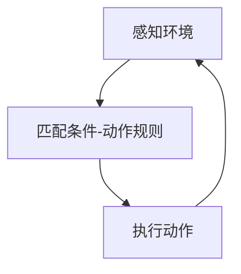
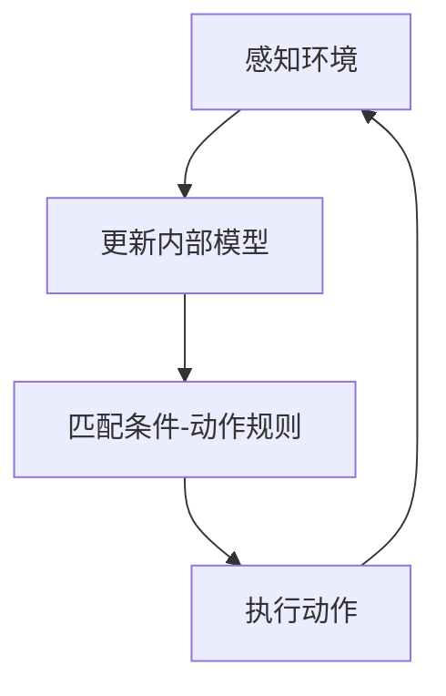
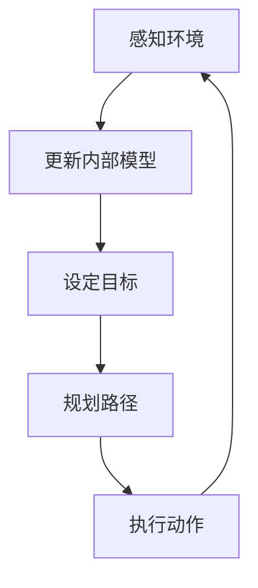
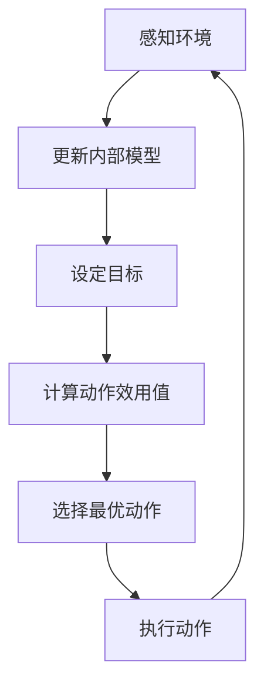
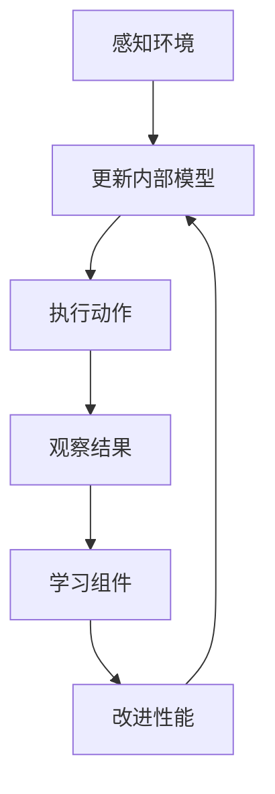

# Agent五种设计模式

Agent（智能体）是指能够自主感知环境、做出决策并执行动作的实体。在人工智能领域，Agent设计模式决定了智能体如何处理信息和做出决策。本文将介绍五种常见的Agent设计模式。

## 1. 反应式Agent (Reactive Agent)

反应式Agent是最简单的Agent设计模式，它直接根据当前感知到的环境信息做出反应，没有内部状态或记忆。

### 工作原理
- 感知环境状态
- 根据预设的条件-动作规则（Condition-Action Rules）选择动作
- 执行动作

### 流程图

### 特点
- 优点：简单、响应速度快、无状态管理
- 缺点：无法处理需要历史信息的任务、适应性差

### 应用场景
- 简单的控制系统（如恒温器）
- 低级机器人行为（如避障）

## 2. 基于模型的Agent (Model-Based Agent)

基于模型的Agent在反应式Agent的基础上增加了内部模型，用于表示环境的状态和变化规律。

### 工作原理
- 感知环境状态
- 更新内部模型
- 根据模型和预设规则选择动作
- 执行动作

### 流程图

### 特点
- 优点：能够处理部分可观测环境、具有一定的记忆能力
- 缺点：模型可能不准确、计算复杂度增加

### 应用场景
- 自动驾驶中的环境感知
- 游戏AI中的对手建模

## 3. 基于目标的Agent (Goal-Based Agent)

基于目标的Agent不仅感知环境和维护模型，还具有明确的目标，并会规划如何实现这些目标。

### 工作原理
- 感知环境状态
- 更新内部模型
- 规划实现目标的路径
- 执行规划好的动作

### 流程图

### 特点
- 优点：具有明确的目标导向、能够规划复杂任务
- 缺点：目标设定需要人工干预、规划过程可能复杂

### 应用场景
- 机器人导航
- 任务调度系统

## 4. 基于效用的Agent (Utility-Based Agent)

基于效用的Agent在基于目标的Agent基础上增加了效用函数，用于评估不同状态和动作的优劣，从而选择最优解。

### 工作原理
- 感知环境状态
- 更新内部模型
- 设定目标
- 评估不同动作的效用值
- 选择效用值最高的动作执行

### 流程图

### 特点
- 优点：能够在多个目标间进行权衡、决策更灵活
- 缺点：效用函数设计复杂、计算成本高

### 应用场景
- 资源分配系统
- 推荐系统

## 5. 学习型Agent (Learning Agent)

学习型Agent是最复杂的Agent设计模式，它能够通过与环境的交互不断学习和改进自己的行为。

### 工作原理
- 感知环境状态
- 更新内部模型
- 执行动作并观察结果
- 通过学习组件改进性能
- 迭代优化决策过程

### 流程图

### 特点
- 优点：能够自适应环境变化、持续改进性能
- 缺点：学习过程可能缓慢、需要大量数据

### 应用场景
- 机器学习系统
- 自适应控制系统
- 智能推荐系统

## 总结

| 设计模式 | 核心特点 | 适用场景 |
|---------|---------|---------|
| 反应式Agent | 无状态，直接反应 | 简单控制系统 |
| 基于模型的Agent | 内部模型，状态追踪 | 部分可观测环境 |
| 基于目标的Agent | 目标导向，路径规划 | 复杂任务执行 |
| 基于效用的Agent | 效用评估，最优决策 | 多目标权衡 |
| 学习型Agent | 自适应学习，持续改进 | 动态变化环境 |

选择合适的Agent设计模式取决于具体的应用场景、环境复杂度和性能要求。在实际应用中，也可以将多种模式结合使用，以实现更复杂的智能行为。