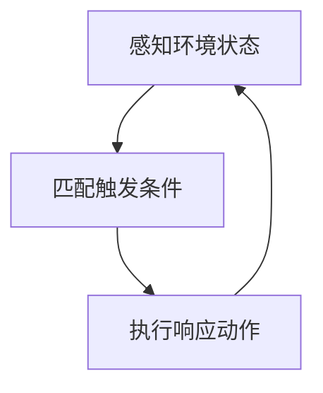
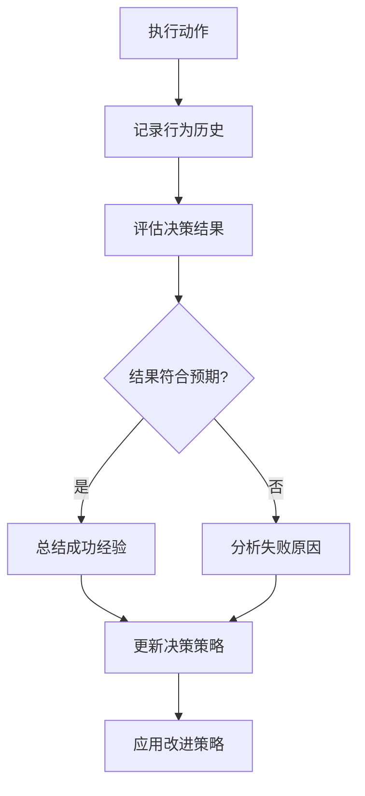
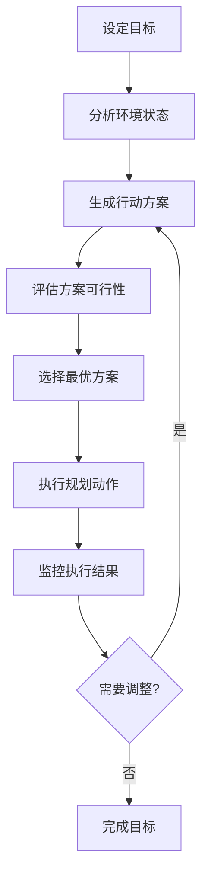
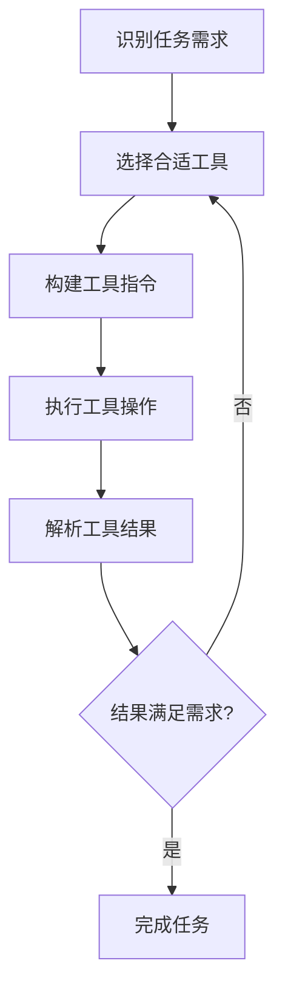
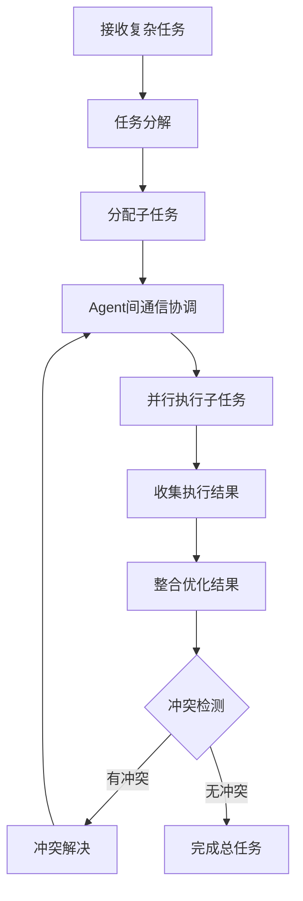

# Agent五种设计模式

Agent（智能体）是指能够自主感知环境、做出决策并执行动作的实体。在人工智能领域，Agent设计模式决定了智能体如何处理信息和做出决策。本文将介绍五种常见的Agent设计模式：反应(React)、反思(Reflection)、规划(Planning)、工具使用(Tool Use)和多智能体协作(Multi-Agent Collaboration)。

## 1. 反应模式 (React Mode)

反应模式是Agent最基础的工作模式，它直接根据当前感知到的环境信息做出快速反应，没有复杂的思考过程。

### 工作原理
- 实时感知环境状态
- 匹配预定义的触发条件
- 执行对应的响应动作
- 循环感知-反应过程

### 流程图

### 特点
- 优点：响应速度快、实时性强、资源消耗低
- 缺点：缺乏长期规划、无法处理复杂问题、适应性有限

### 应用场景
- 实时监控系统（如火灾报警）
- 简单的机器人避障
- 自动化客服的基础回复

## 2. 反思模式 (Reflection Mode)

反思模式使Agent能够对自身的行为、决策过程和结果进行评估和思考，从而改进未来的表现。

### 工作原理
- 记录自身的行为历史和决策过程
- 评估决策结果与预期目标的差距
- 分析成功或失败的原因
- 更新决策策略和知识体系

### 流程图

### 特点
- 优点：能够自我改进、适应变化、提高决策质量
- 缺点：增加计算复杂度、需要额外的存储资源、反思过程可能耗时

### 应用场景
- 自主学习系统
- 自适应控制系统
- 智能推荐系统的优化

## 3. 规划模式 (Planning Mode)

规划模式使Agent能够为实现长期目标制定详细的行动计划，并根据环境变化调整策略。

### 工作原理
- 明确目标和约束条件
- 分析当前环境状态
- 生成多种可能的行动方案
- 评估方案的可行性和效果
- 选择最优方案并执行
- 根据执行结果调整规划

### 流程图

### 特点
- 优点：目标明确、策略性强、能够处理复杂任务
- 缺点：计算成本高、规划时间长、对环境变化的适应性有限

### 应用场景
- 机器人路径规划
- 项目管理系统
- 物流调度系统

## 4. 工具使用模式 (Tool Use Mode)

工具使用模式使Agent能够利用外部工具扩展自身能力，完成仅凭自身无法完成的任务。

### 工作原理
- 识别任务需求
- 选择合适的工具
- 构建工具使用指令
- 执行工具操作
- 解析工具返回结果
- 利用结果继续任务

### 流程图

### 特点
- 优点：扩展能力边界、提高效率、解决复杂问题
- 缺点：需要工具接口、增加系统复杂度、工具使用风险

### 应用场景
- 搜索引擎集成
- API调用系统
- 数据分析工具的使用

## 5. 多智能体协作模式 (Multi-Agent Collaboration Mode)

多智能体协作模式使多个Agent能够相互协作，共同完成复杂任务，发挥群体智慧。

### 工作原理
- 任务分解与分配
- Agent间通信与协调
- 并行执行子任务
- 结果整合与优化
- 冲突检测与解决

### 流程图

### 特点
- 优点：分布式处理、提高效率、增强鲁棒性、实现复杂目标
- 缺点：协调成本高、通信开销大、冲突解决复杂

### 应用场景
- 分布式计算系统
- 多机器人协作
- 团队协作软件

## 总结

| 设计模式 | 核心特点 | 适用场景 |
|---------|---------|---------|
| 反应模式 | 实时响应、快速决策 | 实时监控、简单避障 |
| 反思模式 | 自我评估、持续改进 | 自主学习、系统优化 |
| 规划模式 | 目标导向、策略制定 | 路径规划、项目管理 |
| 工具使用模式 | 能力扩展、资源利用 | 搜索引擎、API调用 |
| 多智能体协作模式 | 分布式处理、群体智慧 | 分布式系统、多机器人协作 |

在实际应用中，Agent通常会结合多种设计模式工作。例如，一个智能助手可能先通过反应模式快速响应用户请求，然后通过规划模式制定解决方案，必要时使用工具获取信息，最后通过反思模式改进自身表现。选择合适的设计模式组合取决于具体的任务需求和环境条件。