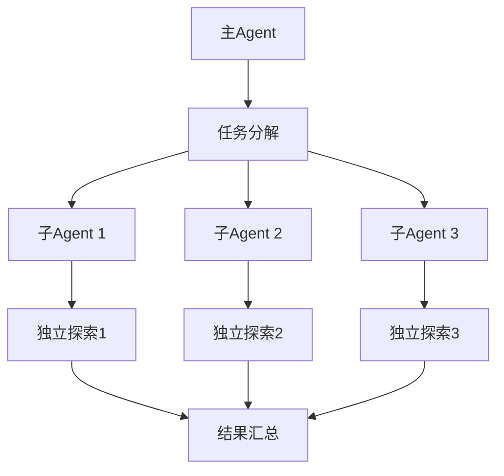
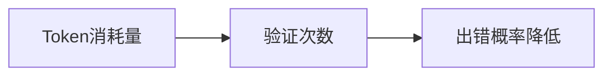
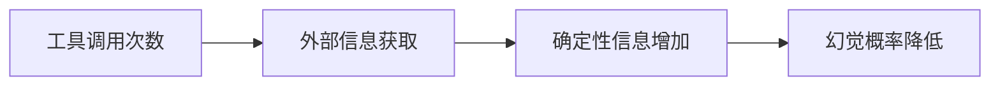
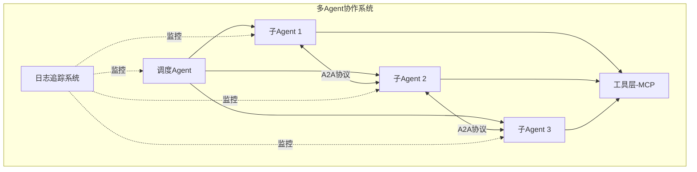

# 多Agent协作系统的优劣势与性能

## 1. 适用场景

### 1.1 什么工作适合多Agent协作系统？

多Agent协作系统主要适用于**研究类和复杂长流程任务**，具体特点包括：

- **开放性问题**：没有固定答案，需要探索和发现
- **多步解析**：需要分步骤深入分析
- **动态调整**：根据过程中发现的线索持续更新研究方法
- **自主运行**：能够根据中间结果自主决定后续方向

> 单Agent无法处理的复杂任务需要多Agent协同工作，其不确定性正好匹配多Agent的自主决策特性。

## 2. 优势

### 2.1 核心优势

多Agent协作系统最擅长**广度优先查询**，涉及多个独立方向的并行探索：

### 2.2 优势特点

| 特点 | 说明 |
|------|------|
| **并行处理** | 主Agent分配任务，子Agent同时探索不同方向 |
| **独立上下文** | 每个子Agent拥有独立的上下文窗口 |
| **减少路径依赖** | 不同Agent有不同的工具、提示和探索轨迹 |
| **深度研究** | 支持彻底、独立的研究和探索 |

## 3. 劣势

### 3.1 成本问题

多Agent协作系统最大的缺点是**Token消耗大**：

| 类型 | Token消耗倍数 |
|------|---------------|
| 普通Chat | 1倍（基准） |
| 单Agent | 4倍 |
| 多Agent协作 | 15倍 |

### 3.2 不适用场景

**不适合固定流程编排的任务**：
- 任务流程固定、步骤明确
- 并行任务较少（如大部分编码工作）
- 成本敏感的低价值任务

## 4. 性能决定因素

多Agent协作系统的性能主要取决于**三大要素**：

### 4.1 Token消耗量

- 消耗Token越多，表示有更多LLM对问题进行验证
- 验证次数越多，出错概率越低
- 注意：并非绝对关系，存在例外情况

### 4.2 工具调用次数

- 工具是确定性的，提供真实信息
- 调用次数越多，获取外部环境信息越多
- 真实信息越多，幻觉概率越低

### 4.3 基座模型能力

基座大模型性能决定系统上限，包括：

- **模型参数量**：参数越大，理解能力越强
- **多模态能力**：支持文本、图像、音频等多种输入
- **上下文长度**：支持更长的对话历史和文档
- **知识更新**：预训练知识的时效性

## 5. 开发挑战

构建落地的多Agent协作系统需要解决**四大核心技术挑战**：

### 5.1 通信挑战：巴别塔困境

**问题**：不同Agent按自己的方式通信，导致误解和混乱

**解决方案**：
- 使用 **MCP协议**（Anthropic发布）完成外部工具通信
- 使用 **A2A协议**（Google发布）完成Agent间通信
- 确保Agent间对话像API调用一样精准

### 5.2 协同挑战：指挥官的难题

**问题**：
- 任务应该分配给谁？
- 多个Agent抢占同一资源怎么办？
- Agent失败后流程如何继续？

**解决方案**：
- 构建**任务调度与规划Agent**
- 负责任务分解、分配、状态监控和异常处理
- 充当整个系统的"大脑中枢"

### 5.3 观测挑战：幽灵的踪迹

**问题**：
- 调试一个Agent已经很难
- 调试多个相互对话的Agent更加困难
- 决策追踪困难，不知道是哪个Agent在哪个环节做出的

**解决方案**：
- 构建**日志和追踪系统**
- 为每次Agent交互生成唯一的Trace ID
- 将"思考链"和"对话历史"可视化
- 让整个"黑盒"组织变得透明

### 5.4 成本挑战：智能的代价

**问题**：
- 每次"思考"都是昂贵的LLM API调用
- Agent越多，交互越频繁，成本和延迟越高

**解决方案**：

| 策略 | 说明 |
|------|------|
| **模型分层** | 思考者用强模型，执行者用轻模型 |
| **Prompt缓存** | 缓存常用提示，减少重复调用 |
| **交互优化** | 优化Agent间交互链条，减少不必要沟通 |

## 6. 系统架构总览

## 7. 最佳实践建议

### 7.1 使用多Agent的场景

✅ **适合使用**：
- 高价值的研究任务
- 需要并行探索的开放性问题
- 需要深度、独立研究的复杂任务
- 有充足预算的项目

❌ **不适合使用**：
- 流程固定的任务
- 低价值、简单任务
- 预算有限的项目
- 并行度低的编码工作

### 7.2 性能优化策略

1. **合理规划Token预算**：根据任务价值分配Token额度
2. **优化工具调用**：选择高质量、确定性的工具
3. **选择合适的基座模型**：平衡性能与成本
4. **建立完善的监控**：及时发现并解决问题

## 8. 总结

多Agent协作系统是处理复杂、开放性问题的强大工具，但需要：

- **明确适用场景**：研究类、长流程、高价值任务
- **理解成本代价**：Token消耗是普通Chat的15倍
- **掌握关键技术**：通信、协同、观测、成本优化
- **合理应用**：根据任务特点选择合适的架构

通过合理的架构设计和优化策略，多Agent协作系统能够在复杂任务中发挥巨大价值。
