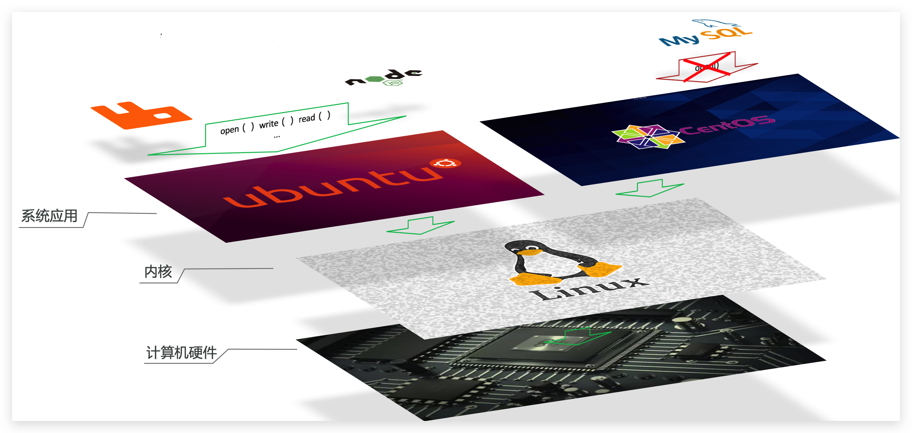

# 1.初识Docker

## 1.1.什么是Docker

微服务虽然具备各种各样的优势，但服务的拆分通用给部署带来了很大的麻烦。

- 分布式系统中，依赖的组件非常多，不同组件之间部署时往往会产生一些冲突。
- 在数百上千台服务中重复部署，环境不一定一致，会遇到各种问题

### 1.1.1.应用部署的环境问题

大型项目组件较多，运行环境也较为复杂，部署时会碰到一些问题：

- 依赖关系复杂，容易出现兼容性问题

- 开发、测试、生产环境有差异

例如一个项目中，部署时需要依赖于node.js、Redis、RabbitMQ、MySQL等，这些服务部署时所需要的函数库、依赖项各不相同，甚至会有冲突。给部署带来了极大的困难。

### 1.1.2.Docker解决依赖兼容问题

而Docker确巧妙的解决了这些问题，Docker是如何实现的呢？

Docker为了解决依赖的兼容问题的，采用了两个手段：

- 将应用的Libs（函数库）、Deps（依赖）、配置与应用一起打包

- 将每个应用放到一个隔离**容器**去运行，避免互相干扰

这样打包好的应用包中，既包含应用本身，也保护应用所需要的Libs、Deps，无需再操作系统上安装这些，自然就不存在不同应用之间的兼容问题了。

虽然解决了不同应用的兼容问题，但是开发、测试等环境会存在差异，操作系统版本也会有差异，怎么解决这些问题呢？

### 1.1.3.Docker解决操作系统环境差异

要解决不同操作系统环境差异问题，必须先了解操作系统结构。以一个Ubuntu操作系统为例，结构如下：

结构包括：

- 计算机硬件：例如CPU、内存、磁盘等
- 系统内核：所有Linux发行版的内核都是Linux，例如CentOS、Ubuntu、Fedora等。内核可以与计算机硬件交互，对外提供**内核指令**，用于操作计算机硬件。
- 系统应用：操作系统本身提供的应用、函数库。这些函数库是对内核指令的封装，使用更加方便。

应用于计算机交互的流程如下：

1）应用调用操作系统应用（函数库），实现各种功能

2）系统函数库是对内核指令集的封装，会调用内核指令

3）内核指令操作计算机硬件

Ubuntu和CentOS都是基于Linux内核，无非是系统应用不同，提供的函数库有差异：

此时，如果将一个Ubuntu版本的MySQL应用安装到CentOS系统，MySQL在调用Ubuntu函数库时，会发现找不到或者不匹配，就会报错了：

Docker如何解决不同系统环境的问题？

- Docker将用户程序与所需要调用的系统(比如Ubuntu)函数库一起打包
- Docker运行到不同操作系统时，直接基于打包的函数库，借助于操作系统的Linux内核来运行

### 1.1.4.小结

Docker如何解决大型项目依赖关系复杂，不同组件依赖的兼容性问题？

- Docker允许开发中将应用、依赖、函数库、配置一起**打包**，形成可移植镜像
- Docker应用运行在容器中，使用沙箱机制，相互**隔离**

Docker如何解决开发、测试、生产环境有差异的问题？

- Docker镜像中包含完整运行环境，包括系统函数库，仅依赖系统的Linux内核，因此可以在任意Linux操作系统上运行

Docker是一个快速交付应用、运行应用的技术，具备下列优势：

- 可以将程序及其依赖、运行环境一起打包为一个镜像，可以迁移到任意Linux操作系统
- 运行时利用沙箱机制形成隔离容器，各个应用互不干扰
- 启动、移除都可以通过一行命令完成，方便快捷

## 1.2.Docker和虚拟机的区别

Docker可以让一个应用在任何操作系统中非常方便的运行。而以前我们接触的虚拟机，也能在一个操作系统中，运行另外一个操作系统，保护系统中的任何应用。

**虚拟机**（virtual machine）是在操作系统中**模拟**硬件设备，然后运行另一个操作系统，比如在 Windows 系统里面运行 Ubuntu 系统，这样就可以运行任意的Ubuntu应用了。

**Docker**仅仅是封装函数库，并没有模拟完整的操作系统，如图：

对比来看：

- docker是一个系统进程；虚拟机是在操作系统中的操作系统

- docker体积小、启动速度快、性能好；虚拟机体积大、启动速度慢、性能一般

## 1.3.Docker架构
### 1.3.1.镜像和容器

Docker中有几个重要的概念：

**镜像（Image）**：Docker将应用程序及其所需的依赖、函数库、环境、配置等文件打包在一起，称为镜像。

**容器（Container）**：镜像中的应用程序运行后形成的进程就是**容器**，只是Docker会给容器进程做隔离，对外不可见。

一切应用最终都是代码组成，都是硬盘中的一个个的字节形成的**文件**。只有运行时，才会加载到内存，形成进程。

而**镜像**，就是把一个应用在硬盘上的文件、及其运行环境、部分系统函数库文件一起打包形成的文件包。这个文件包是只读的。

**容器**呢，就是将这些文件中编写的程序、函数加载到内存中允许，形成进程，只不过要隔离起来。因此一个镜像可以启动多次，形成多个容器进程。

例如你下载了一个QQ，如果我们将QQ在磁盘上的运行**文件**及其运行的操作系统依赖打包，形成QQ镜像。然后你可以启动多次，双开、甚至三开QQ，跟多个妹子聊天。

### 1.3.2.DockerHub

开源应用程序非常多，打包这些应用往往是重复的劳动。为了避免这些重复劳动，人们就会将自己打包的应用镜像，例如Redis、MySQL镜像放到网络上，共享使用，就像GitHub的代码共享一样。

- DockerHub：DockerHub是一个官方的Docker镜像的托管平台。这样的平台称为Docker Registry。

- 国内也有类似于DockerHub 的公开服务，比如 [网易云镜像服务](https://c.163yun.com/hub)、[阿里云镜像库](https://cr.console.aliyun.com/)等。

我们一方面可以将自己的镜像共享到DockerHub，另一方面也可以从DockerHub拉取镜像：

### 1.3.3.Docker架构

我们要使用Docker来操作镜像、容器，就必须要安装Docker。

Docker是一个CS架构的程序，由两部分组成：

- 服务端(server)：Docker守护进程，负责处理Docker指令，管理镜像、容器等

- 客户端(client)：通过命令或RestAPI向Docker服务端发送指令。可以在本地或远程向服务端发送指令。

### 1.3.4.小结

Docker结构：

- 服务端：接收命令或远程请求，操作镜像或容器

- 客户端：发送命令或者请求到Docker服务端

DockerHub：

- 一个镜像托管的服务器，类似的还有阿里云镜像服务，统称为DockerRegistry

## 1.4.安装Docker

[Centos7安装Docker](Centos7安装Docker.md)