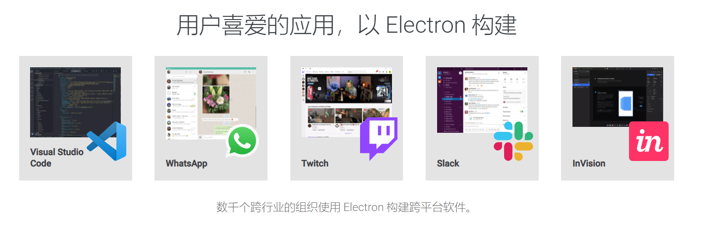
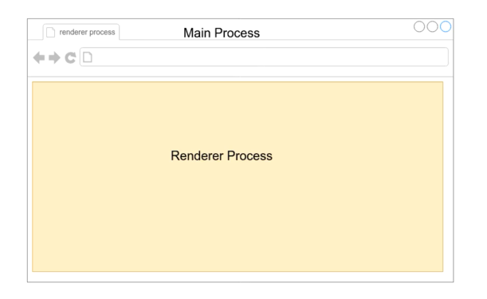
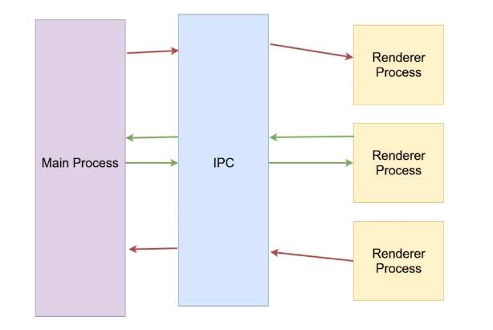
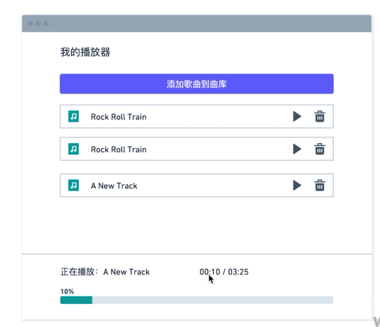
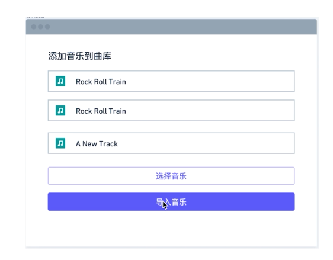
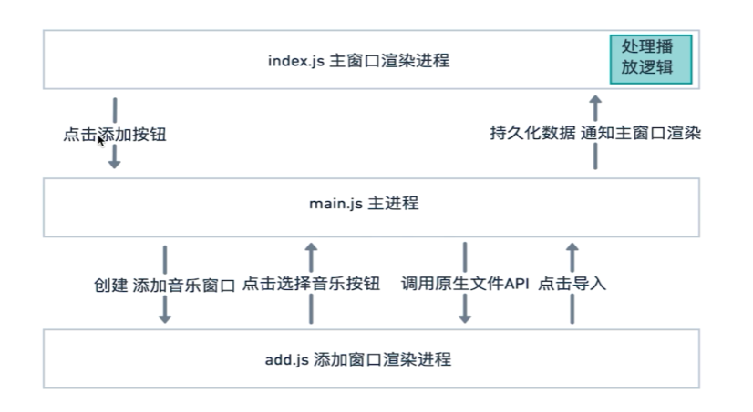
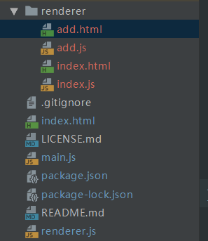
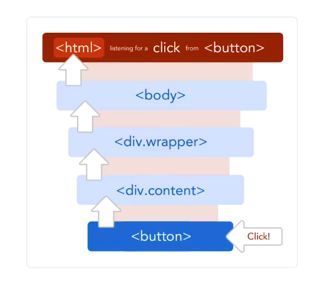

# 进入Electron的世界
[toc]
## 进入Electron的世界
- 使用 JavaScript，HTML 和 CSS 构建跨平台的桌面应用程序
- Web技术- Electron基于 Chromium和 Node 
- 开源-众多贡献者组成的活跃社区共同维护的开源项目。
- 跨平台·兼容Mac, Windows和 Linux
## 谁在使用Electron


## 第一个Electron应用
### 主进程和渲染进程
#### 什么Proces-进程
- 用Chromium来举例
    - 整个浏览器是主Main Process
    - 每一个type是 render Process


#### 主进程-Main Process
- 可以使用和系统对接的 Electron api-创建菜单,上传文件等等
- 创建渲染进程- Renderer Process
- 全面支持 Node js
- 只有一个,作为整个程序的入口点

#### 渲染进程-Render Process
- 可以有多个，每个对应一个窗口
- 每个都是一个单独的进程
- 全面支持Node.js 和 DOM API
- 可以使用一部分 Electron提供的AP

### 创建BrowserWindow
#### 安装热启动npm包
```
npm install nodemon --save-dev
```
**在package.json中修改**
```
  "scripts": {
    "start": "nodemon --watch main.js --exec 'electron .'"
  },
```
#### 创建一个简单的browserWindow
**在main.js中**
```
const { app, BrowserWindow } = require('electron');

app.on('ready', ()=> {
  const mainWindow = new BrowserWindow({
    width: 800,
    height: 600,
    webPreferences: {
      nodeIntegration: true //代表可以使用node.js的api
    },
    parent: mainWindow //一般用在第二窗口，父窗口是第一窗口
  })
})
```

### 进程间通信
#### 进程之问的通讯方式
- Electron使用IPC( (interprocess communication)在进程之间进行通讯和 Chromium完全一致

#### 进程之间的通讯代码
**render.js**
```
const { ipcRenderer } = require('electron');

window.addEventListener('DOMContentLoaded',()=>{
    ipcRenderer.send('message', 'hello from renderer')
    ipcRenderer.on('reply',(event, arg)=>{
        document.getElementById('message').innerHTML = arg;
    })
})
```
**main.js**
```
const { app, BrowserWindow, ipcMain } = require('electron');

app.on('ready', ()=> {
  const mainWindow = new BrowserWindow({
    width: 800,
    height: 600,
    webPreferences: {
      nodeIntegration: true
    }
  })
  mainWindow.loadFile('index.html')
  ipcMain.on('message', (event, arg)=>{
    console.log(arg)
    event.sender.send('reply', 'hello from main')
  })
})
```
**index.html**
```
<!DOCTYPE html>
<html>
  <head>
    <meta charset="UTF-8">
    <!-- https://developer.mozilla.org/en-US/docs/Web/HTTP/CSP -->
    <meta http-equiv="Content-Security-Policy" content="default-src 'self'; script-src 'self'">
    <title>Hello World!</title>
  </head>
  <body>
    <h1>Hello World!</h1>
    <p id="message"></p>
    <script src="./renderer.js"></script>
  </body>
</html>

```

## 播放器的应用与演示
### 从原型图出发



### 功能流程和文件结构

**安装bootstrap**
```
cnpm install bootstrap
```


### 重构创建新窗口代码
**main.js**
```
const { app, BrowserWindow, ipcMain } = require('electron');

class AppWindow extends BrowserWindow {
  constructor(config, fileLocation) {
    const basicConfig = {
      width: 800,
      height: 600,
      webPreferences: {
        nodeIntegration: true
      }
    }
    const finalConfig = { ...basicConfig, ...config }
    super(finalConfig)
    this.loadFile(fileLocation)
    this.once('ready-to-show', () => {
      this.show()
    }) //预加载
  }
}

app.on('ready', () => {
  const mainWindow = new AppWindow({}, './renderer/index.html')
  ipcMain.on('add-music-window', () => {
    const addWindow = new AppWindow({
      width: 500,
      height: 400,
      parent: mainWindow
    }, './renderer/add.html')
  })
})
```
**index.js**
```
<!DOCTYPE html>
<html>
<head>
    <meta charset="UTF-8">
    <!-- https://developer.mozilla.org/en-US/docs/Web/HTTP/CSP -->
    <meta http-equiv="Content-Security-Policy" content="default-src 'self'; script-src 'self'">
    <title>本地播放器</title>
    <link rel="stylesheet" href="../node_modules/bootstrap/dist/css/bootstrap.min.css">
</head>
<body>
    <div class="container mt-4">
        <h1>我的播放器</h1>
        <button type="button" id="add-music-button" class="btn btn-primary btn-lg btn-block mt-4">
            添加歌曲到曲库
        </button>
    </div>
    <script src="./index.js"></script>
</body>
</html>

```
**index.js**
```
const { ipcRenderer } = require('electron')

document.getElementById('add-music-button').addEventListener('click', ()=>{
    ipcRenderer.send('add-music-window')
})
```

### 使用Electron Store持久化数据
#### **数据持久化的方式**
- 使用数据库软件
- 使用HTML5提供的浏览器对象
- 使用本地文件

#### 社区项目electron-store
https://github.com/sindresorhus/electron-store
```
$ npm install electron-store


const Store = require('electron-store');

const store = new Store();

store.set('unicorn', '🦄');
console.log(store.get('unicorn'));
//=> '🦄'

// Use dot-notation to access nested properties
store.set('foo.bar', true);
console.log(store.get('foo'));
//=> {bar: true}

store.delete('unicorn');
console.log(store.get('unicorn'));
//=> undefined
```

### 播放器窗口
#### DOM存储自定义数据
- HTML中使用自定义data属性:data-*来存储
- JS中使用 Htmlelement的 dataset属性来读取
```
index.html
<div class="col-2">
        <i class="fas fa-play mr-3" data-id="${track.id}"></i>
        <i class="fas fa-trash-alt" data-id="${track.id}"></i>
</div>

index.js
$('tracksList').addEventListener('click', (event) =>{
    event.preventDefault()//禁止默认操作
    const { dataset, classList } = event.target
    const id = dataset && dataset.id
    if (id && classList.contains('fa-play')) {
        //这里播放音乐
        currentTrack = allTracks.find(track => track.id === id)
        musicAudio.src = currentTrack.path
        musicAudio.play()
        classList.replace('fa-play', 'fa-pause')
    }
})
```

#### 是否给播放器每个播放暂停都绑定click
#### 事件冒泡与代理

在最外层html绑定一次点击，这样在里面点击元素，让元素冒泡出来然后响应click事件

**使用classList html5的方法**
```
index.js
$('tracksList').addEventListener('click', (event) =>{
    event.preventDefault()//禁止默认操作
    const { dataset, classList } = event.target
    const id = dataset && dataset.id
    if (id && classList.contains('fa-play')) {
        //这里播放音乐
        currentTrack = allTracks.find(track => track.id === id)
        musicAudio.src = currentTrack.path
        musicAudio.play()
        classList.replace('fa-play', 'fa-pause')
    }
})
```


## 应用打包与分发
### Electron打包方式
- 手动打包
- Electron packager
- Electron builder

```
直接npm
```
### 看官方文档学怎么配置
```
"build": {
    "appId": "simpleMusicPlayer",
    "mac": {
      "category": "public.app-category.productivity"
    },
    "dmg": {
      "background": "build/appdmg.png",
      "icon": "build/icon.icns",
      "iconSize": 100,
      "contents": [
        {
          "x": 380,
          "y": 280,
          "type": "link",
          "path": "/Applications"
        },
        {
          "x": 110,
          "y": 280,
          "type": "file"
        }
      ],
      "window": {
        "width": 500,
        "height": 500
      }
    },
    "linux": {
      "target": [
        "AppImage",
        "deb"
      ]
    },
    "win": {
      "target": "squirrel",
      "icon": "build/icon.ico"
    }
  },
```