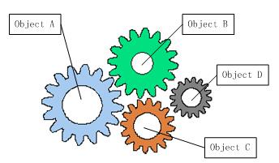
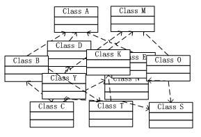
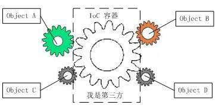
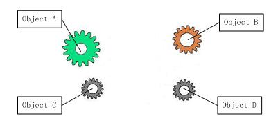
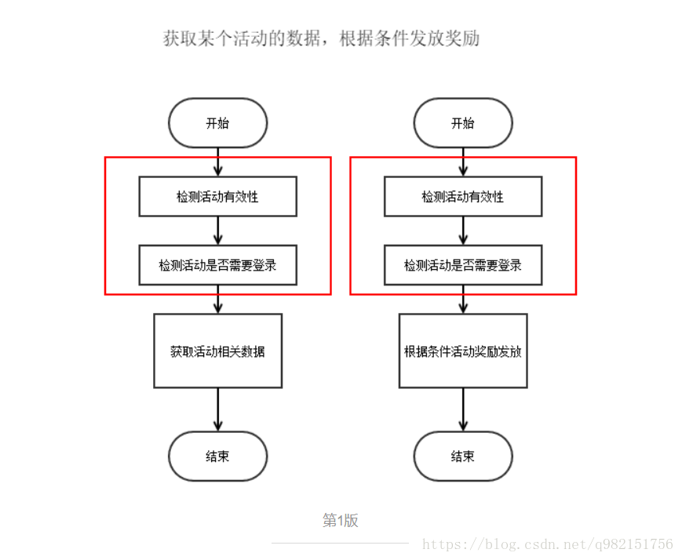

# IOC和AOP
[toc]
## ioc
### 1.IOC的理论背景
我们知道在面向对象设计的软件系统中，**它的底层都是由N个对象构成的**，各个对象之间通过相互合作，最终实现系统地业务逻辑。

齿轮组中齿轮之间的啮合关系,与软件系统中对象之间的耦合关系非常相似。伴随着工业级应用的规模越来越庞大，对象之间的依赖关系也越来越复杂，经常会出现对象之间的多重依赖性关系.

为了解决对象之间的耦合度过高的问题，软件专家Michael Mattson 1996年提出了IOC理论，**用来实现对象之间的“解耦”。**

### 2.什么是IOC
**IOC是Inversion of Control的缩写，多数书籍翻译成“控制反转”。**

简单来说就是把复杂系统分解成相互合作的对象，这些对象类通过封装以后，内部实现对外部是透明的，从而降低了解决问题的复杂度，而且可以灵活地被重用和扩展。

由于引进了中间位置的“第三方”，也就是IOC容器，使得A、B、C、D这4个对象没有了耦合关系，**齿轮之间的传动全部依靠“第三方”了，全部对象的控制权全部上缴给“第三方”IOC容器**，所以，IOC容器成了整个系统的关键核心，它起到了一种类似“粘合剂”的作用，把系统中的所有对象粘合在一起发挥作用，如果没有这个“粘合剂”，对象与对象之间会彼此失去联系，这就是有人把IOC容器比喻成“粘合剂”的由来。

这时候，A、B、C、D这4个对象之间已经没有了耦合关系，彼此毫无联系，这样的话，当你在实现A的时候，根本无须再去考虑B、C和D了，对象之间的依赖关系已经降低到了最低程度。

 我们再来看看，控制反转(IOC)到底为什么要起这么个名字？我们来对比一下：

软件系统在没有引入IOC容器之前，如图1所示，对象A依赖于对象B，那么对象A在初始化或者运行到某一点的时候，自己必须主动去创建对象B或者使用已经创建的对象B。无论是创建还是使用对象B，控制权都在自己手上。

软件系统在引入IOC容器之后，这种情形就完全改变了，如图3所示，由于IOC容器的加入，对象A与对象B之间失去了直接联系，所以，**当对象A运行到需要对象B的时候，IOC容器会主动创建一个对象B注入到对象A需要的地方。**

通过前后的对比，我们不难看出来：**对象A获得依赖对象B的过程,由主动行为变为了被动行为，控制权颠倒过来了，这就是“控制反转”这个名称的由来。**

### 3.IOC也叫依赖注入(DI)
　2004年，Martin Fowler探讨了同一个问题，**既然IOC是控制反转，那么到底是“哪些方面的控制被反转了呢？”，经过详细地分析和论证后，他得出了答案：“获得依赖对象的过程被反转了**”。控制被反转之后，获得依赖对象的过程由自身管理变为了由IOC容器主动注入。于是，他给“控制反转”取了一个更合适的名字叫做“依赖注入（Dependency Injection）”。他的这个答案，实际上给出了实现IOC的方法：注入。**所谓依赖注入，就是由IOC容器在运行期间，动态地将某种依赖关系注入到对象之中。**
　
1. 属性注入
2. 构造注入
3. 接口注入
　
### 4.IOC容器的技术剖析
IOC中最基本的技术就是“**反射(Reflection)**”编程，目前.Net C#、Java和PHP5等语言均支持，其中PHP5的技术书籍中，有时候也被翻译成“映射”。有关反射的概念和用法，大家应该都很清楚，通俗来讲就是根据给出的类名（字符串方式）来动态地生成对象。这种编程方式可以让对象在生成时才决定到底是哪一种对象。反射的应用是很广泛的，很多的成熟的框架，比如象Java中的Hibernate、Spring框架，.Net中 NHibernate、Spring.Net框架都是把“反射”做为最基本的技术手段。

### 应用：datesource依赖注入
springboot 查询并不会由程序员去创建链接，而是被动的由ioc来控制创建数据库链接这个依赖。

### DIP依赖倒置
    高层模块不应该依赖低层模块（抽象），两者都应该依赖抽象
    
    抽象不应该依赖细节
    
    细节应该依赖抽象

## aop
### aop的概念
**在软件业，AOP为Aspect Oriented Programming的缩写，意为：面向切面编程，通过预编译方
式和运行期动态代理实现程序功能的统一维护的一种技术**

**然后我们举一个比较容易理解的例子**（来自：Spring 之 AOP）：

要理解切面编程，就需要先理解什么是切面。用刀把一个西瓜分成两瓣，切开的切口就是切面；炒菜，锅与炉子共同来完成炒菜，锅与炉子就是切面。web层级设计中，web层->网关层->服务层->数据层，每一层之间也是一个切面。编程中，对象与对象之间，**方法与方法之间，模块与模块之间都是一个个切面。**

将方法注入到接口调用的某个地方（切点）。
这样接口只需要关心具体的业务，而不需要关注其他非该接口关注的逻辑或处理。
**红框处，就是面向切面编程。**

### 简单应用：接口耗时日志打印
在每一个接口包创建一个切点，这个切点是环绕切点，在业务之前和之后计算消耗时间。