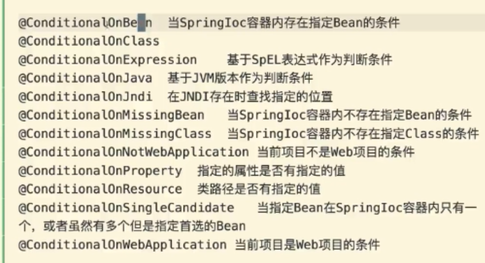

# Java spring boot
[toc]
## java web框架发展历史
> servlet -> jsp -> 在java社区出现mvc -> 借鉴c# asp -> structs -> spring:IOC、AOP 
> Hibernate ORM框架 使得 ORM开始流行 -> **形成ssh的铁三角** -> ssm(springmvc spring mybatis)

> 最后诞生了springboot：约定大于配置

## 版本号
**2.2.1.RELEASE**
2. 主版本
2. 次版本 新特性 发布小的新特性 要保证兼容
1. 增量版本 bug修复
RELEASE 发布版本、里程碑版本
RC Alpha Beta GA（general availability 通用版本）

## spring与springboot

**ssm spring+spring mvc+mybatis**

springboot是spring framework的一种应用

**springboot的核心优势：自动配置**

IOC实现：容器 加入容器 注入

目的：
抽象意义：控制权交给用户、灵活的OCP


## 软件工程方法论
**项目的维护和迭代**
### 开闭原则（OCP）
软件、函数、类 扩展开放的 修改封闭的

新增业务模块/类 代替原来的类

实现开闭原则就必须要面向抽象编程 interface（接口） abstract（抽象）

interface -> 设计模式：工厂模式 -> IOC/DI

**重点理论：**

**1. 单纯的interface可以统一方法的调用，但不能统一对象的实例化**

**2. 面向对象主要做两件事情： 实例化对象 调用方法（完成业务逻辑）**

**3. 只有一段代码中没有new出现，才能保持代码的相对稳定，才能逐步实现OCP**

**4. 上面的这句话只是表象，实质是一段代码如果要保持稳定，就不应该负责对象的实例化**

**5. 对象实例化是不可能消除的**

**6. 把对象实例化的过程，转移到其他代码中**

**7. 代码中总是会存在不稳定，隔离这些不稳定，保证其他的代码是最稳定的**

### 面向对象中变化的应对方案
1. 制定一个interface，然后用多个类实现同一个interface（策略模式）
2. 一个类，属性 解决变化。interface

### 为什么spring偏爱配置
为了OCP的原则，尽量只修改配置
#### 为什么隔离到配置文件
1. 配置文件集中性
2. 清晰（没有业务逻辑）
#### 配置分类
1. 常规配置 key:value
2. xml 配置 类/对象

### 元类
**在Java,Python和Object-C中都有元类的概念.所谓元类从字面上的理解就是最基本的类.说到类,那就得说面向对象。**
> 在Java中,Class表示元类,实例.getclass()方法可以获取所属的类。

**Class.forName(className)**
className指的是采用类的完全限定名（完整的包名+类名，如果是内部类，则是包名+类名$内部类名），使用这种方式很灵活，因为参数是字符串，可以结合配置文件来达到动态效果
```
//假设类在pyf.java.demo包下，类名为Person，则获取方法如下
Class<?> cls = Class.forName("pyf.java.demo.Person");
Object obj = cla.newInstance();
```
获取**元类**的场景一般是用到反射时.因为通过元类能拿到类本身的信息,如类的成员变量,构造方法,方法等.这位动态编程带来了方便,这也是很多框架的基础.

### orm与手动生成数据表的优劣
1. 索引不好建立

### JAVA面向对象三大特性
#### 封装
1. 概念：**将类的某些信息隐藏在类内部，不允许外部程序直接访问，而是通过该类提供的方法来实现对隐藏信息的操作和访问。**
2. 好处：
- 只能通过规定的方法访问数据。
- 隐藏类的实例细节，方便修改和实现。
3. 封装的实现步骤


**A、访问修饰符**

**B、this关键字**

**C、Java 中的内部类**

内部类（ Inner Class ）就是定义在另外一个类里面的类。与之对应，包含内部类的类被称为外部类。

    1. 内部类提供了更好的封装，可以把内部类隐藏在外部类之内，不允许同一个包中的其他类访问该类。
    
    2. 内部类的方法可以直接访问外部类的所有数据，包括私有的数据。
    
    3. 内部类所实现的功能使用外部类同样可以实现，只是有时使用内部类更方便。

#### 继承
**1、继承的概念**

> 注：java中的继承是**单继承**，即**一个类只有一个父类**。
**2、继承的好处**
　子类拥有父类的所有属性和方法（除了private修饰的属性不能拥有）从而实现了实现代码的复用；

　
**3、final关键字**

    1. final 修饰类，则该类不允许被继承。
    2. final 修饰方法，则该方法不允许被覆盖(重写)。
    3. final 修饰属性，则该类的该属性不会进行隐式的初始化，所以 该final 属性的初始化属性必须有值，或在构造方法中赋值(但只能选其一，且必须选其一，因为没有默认值！)，且初始化之后就不能改了，只能赋值一次。
    4. final 修饰变量，则该变量的值只能赋一次值，在声明变量的时候才能赋值，即变为常量。
    
**super关键字**

    在对象的内部使用，可以代表父类对象。
    1、访问父类的属性：super.age
    2、访问父类的方法：super.eat()

#### 多态
**1.引用多态**
父类的引用可以指向本类的对象；

　　父类的引用可以指向子类的对象；

　　这两句话是什么意思呢，让我们用代码来体验一下，首先我们创建一个父类Animal和一个子类Dog，在主函数里如下所示：

　　
注意：我们不能使用一个子类的引用来指向父类的对象，如：。

**2. 抽象类**

定义：抽象类前使用abstract关键字修饰，则该类为抽象类。

　使用抽象类要注意以下几点：

    1. 抽象类是约束子类必须有什么方法，而并不关注子类如何实现这些方法。
    
    2. 抽象类应用场景：
    
    　　　a. 在某些情况下，某个父类只是知道其子类应该包含怎样的方法，但无法准确知道这些子类如何实现这些方法(可实现动态多态)。
    
    　　　b. 从多个具有相同特征的类中抽象出一个抽象类，以这个抽象类作为子类的模板，从而避免子类设计的随意性。
    
    3. 抽象类定义抽象方法，只有声明，不需要实现。抽象方法没有方法体以分号结束，抽象方法必须用abstract关键字来修饰。如:
    
    4、包含抽象方法的类是抽象类。抽象类中可以包含普通的方法，也可以没有抽象方法。
    
**3. 接口**

**抽象类是对一种事物的抽象，即对类抽象，而接口是对行为的抽象**。抽象类是对整个类整体进行抽象，包括属性、行为，但是接口却是对类局部（行为）进行抽象。举个简单的例子，飞机和鸟是不同类的事物，但是它们都有一个共性，就是都会飞。那么在设计的时候，可以将飞机设计为一个类Airplane，将鸟设计为一个类Bird，但是不能将 飞行 这个特性也设计为类，因此它只是一个行为特性，并不是对一类事物的抽象描述。此时可以将 飞行 设计为一个接口Fly，包含方法fly( )，然后Airplane和Bird分别根据自己的需要实现Fly这个接口。

> 一个类可以实现一个或多个接口，实现接口使用implements关键字。java中一个类只能继承一个父类，是不够灵活的，通过实现多个接口可以补充。
　　　　
## 工程原理
### 创建spring boot
1. Idea
2. springboot 官方初始化工具
3. maven

### 端口切换
```
src/main/resources/application.properties

server.port=8081
```

### 注解形成接口
#### 输出文字
```
方法1：
@Controller
public class BannerController {

    @GetMapping("/test")
    public void test(HttpServletResponse response) throws IOException {
        response.getWriter().write("hello world");
    }
}

方法2：
@Controller
public class BannerController {

    @GetMapping("/test")
    @ResponseBody
    public String test(HttpServletResponse response) throws IOException {
        return "hello world";
    }
}
```

### 注解与restful
```
@GetMapping("/test")
@PostMapping
@PutMapping
@DeleteMapping
//限制用某几个
@RequestMapping(value = "/test",method = {RequestMethod.GET,RequestMethod.POST})

@RestController 包含
@Controller
@ResponseBody

@RestController
@RequestMapping("/v1/banner")//公共api前缀
public class BannerController {

    @GetMapping("/test")
    public String test() {
        return "hello world";
    }
}

```

### 加入容器
```
\\ 注解模式
@Component
public class xxx｛
｝

\\属性注入(升级版右键set注入)
@Autowired
private xxx xxx；

\\setter注入
邮件构建setter

\\构造注入
public class xxxController｛
    public xxxController（xxx xxx）｛
        this.xxx = xxx; 
    ｝
｝
```

### stereotype annotations模式注解
```
@Component 最基础 组件/类/bean 类的实例化 new

@Service 表明服务
@Controller 表明控制器
@Repository 表明仓库/模型

@Configuration 一个类加入多个容器
```

### @Configuration加入容器的方法
实际上是一种编程模式 
```
@Configuration
public class xxxConfiguration｛
    @Bean\\为了替代spring里的xml的配置
    public ISkill diana() {
        return new Diana("Diana", 18);
    }
        //在这里可以对camille类进行构造方法的传参，用@Component无法对构造函数传参
    @Bean
    @Scope("prototype")
    public ISkill irelia() {
        return new Irelia();
    }
｝
```

### Ioc对象实例化的时机
默认：立即/提前
可以延时实例化@Lazy

### Autowired的被动注入方式
1. bytype（默认）
    1. 找不到任何一个bean 报错
    2. 一个 直接注入
    3. 找到多个 不一定会报错 按字段名字推断选择哪个bean
2. byname
3. @Primary

### Autowired的主动注入方式
**可以用@Qualifier()来指明是哪个bean**

### 条件注解
自定义条件注解@Conditional + 继承Condition
```
hero.condition = diana

//configuration.java
@Configuration
public class HeroConfiguration {
    @Bean
    public ISkill diana() {
        return new Diana("Diana", 18);
    }

    @Bean
    public ISkill irelia() {
        return new Irelia();
    }

}

//condition.java
import org.springframework.context.annotation.Condition;
import org.springframework.context.annotation.ConditionContext;
import org.springframework.core.type.AnnotatedTypeMetadata;

public class DianaCondition implements Condition {
    @Override
    public boolean matches(ConditionContext conditionContext, AnnotatedTypeMetadata annotatedTypeMetadata) {
        String name = conditionContext.getEnvironment().getProperty("hero.condition");
        return "diana".equalsIgnoreCase(name);
//        return name.equalsIgnoreCase("diana");
    }
}
```

### 内置成品条件注解
```
    @ConditionalOnProperty(value = "hero.condition",havingValue = "diana", matchIfMissing = false)
    @Bean
    public ISkill diana() {
        return new Diana("Diana", 18);
    }
```


### 自动装配/配置

1. 原理是什么

SpringBoot启动的时**候通过@EnableAutoConfiguration注解**找到META-INF/spring.factories文件中的所有自动配置类（**负责加载第三方SDK**），并对其加载，这些自动配置类都是以AutoConfiguration结尾来命名的。它实际上就是一个JavaConfig形式的IOC容器配置类，通过以Properties结尾命名的类中取得在全局配置文件中配置的属性，如server.port。
*Properties类的含义：封装配置文件的相关属性。
*AutoConfiguration类的含义：自动配置类，添加到IOC容器中。

2. 为什么要有自动装配
要把各种配置加入IOC里面。

### 异常处理
#### 异常分类
Throwable

Error 错误
Exception 异常

#### 全局异常码配置
```
// config/exception-code.properties
lin.codes[30003] = \u5546\u54C1\u4FE1\u606F\u4E0D\u5B58
lin.codes[30005] = Banner\u7C7B\u8D44\u6E90\u4E0D\u5B58\u5728

lin.codes[0] = ok

// 统一前缀
@ConfigurationProperties(prefix = "lin")
// 和配置文件对应
@PropertySource(value = "classpath:config/exception-code.properties")
@Component
public class ExceptionCodeConfiguration {
    // codes相对应配置文件中的codes
    private Map<Integer, String> codes = new HashMap<>();

    public Map<Integer, String> getCodes() {
        return codes;
    }

    public void setCodes(Map<Integer, String> codes) {
        this.codes = codes;
    }


    public String getMessage(int code){
        String message = codes.get(code);
        return message;
    }
}
```

#### 全局异常处理
```
public class HttpException extends RuntimeException {
    protected Integer code;

    public Integer getCode() {
        return code;
    }

    public Integer getHttpStatusCode() {
        return httpStatusCode;
    }

    protected Integer httpStatusCode = 500;
}

```

```
@ControllerAdvice
public class GlobalExceptionAdvice {

    @Autowired
    private ExceptionCodeConfiguration codeConfiguration;
    // 所有异常类
    @ExceptionHandler(value=Exception.class)
    @ResponseBody
    // 返回错误码
    @ResponseStatus(code= HttpStatus.INTERNAL_SERVER_ERROR)
    public UnifyResponse handleException(HttpServletRequest req, Exception e) {
        String requestUrl = req.getRequestURI();
        String method = req.getMethod();
        System.out.println(e);
        UnifyResponse message = new UnifyResponse(9999, "服务器异常", method + " "+ requestUrl);
        return message;
    }
    
    // 自定义异常类
    @ExceptionHandler(HttpException.class)
    // 为了返回带header信息 文本信息的异常
    public ResponseEntity<UnifyResponse> handleHttpException(HttpServletRequest req, HttpException e){
        String requestUrl = req.getRequestURI();
        String method = req.getMethod();

//        ResponseEntity
        UnifyResponse message = new UnifyResponse(e.getCode(),codeConfiguration.getMessage(e.getCode()), method + " " + requestUrl);
        HttpHeaders headers = new HttpHeaders();
        headers.setContentType(MediaType.APPLICATION_JSON_UTF8);
        HttpStatus httpStatus = HttpStatus.resolve(e.getHttpStatusCode());

        ResponseEntity<UnifyResponse> r = new ResponseEntity<>(message, headers, httpStatus);
        return r;
    }

}
```
### 根据目录结构自动生成路由前缀
```
import com.lin.missyou.core.hack.AutoPrefixUrlMapping;
import org.springframework.boot.autoconfigure.web.servlet.WebMvcRegistrations;
import org.springframework.context.annotation.Configuration;
import org.springframework.web.servlet.mvc.method.annotation.RequestMappingHandlerMapping;

@Configuration
public class AutoPrefixConfiguration implements WebMvcRegistrations{

    @Override
    public RequestMappingHandlerMapping getRequestMappingHandlerMapping() {
        return new AutoPrefixUrlMapping();
    }
}


public class AutoPrefixUrlMapping extends RequestMappingHandlerMapping {

    @Value("${missyou.api-package}")
    private String apiPackagePath;

    @Override
    protected RequestMappingInfo getMappingForMethod(Method method, Class<?> handlerType) {
        RequestMappingInfo mappingInfo =  super.getMappingForMethod(method, handlerType);
        if(mappingInfo != null){
            String prefix = this.getPrefix(handlerType);
            return RequestMappingInfo.paths(prefix).build().combine(mappingInfo);
        }
        return mappingInfo;
    }

    private String getPrefix(Class<?> handlerType){
        String packageName = handlerType.getPackage().getName();
        String dotPath = packageName.replaceAll(this.apiPackagePath,"");
        return dotPath.replace(".", "/");
    }
}
```


## 项目开发
### maven换源
```
<repositories>
    <repository>
        <id>alimaven</id>
        <name>aliyun maven</name>
        <url>http://maven.aliyun.com/nexus/content/groups/public/</url>
    </repository>
</repositories>
```
### 获取URl路径中的参数和查询参数
```
@GetMapping("/test/{id}")
    // id 和 ?name=xxx
    public String test(@PathVariable Integer id, @RequestParam String name) {
        return "111";
    }
```
**拿取post请求body**
```
    // persondto对象需要实现get set方法
    @PostMapping("/test")
    public String test(@RequestBody PersonDTO person) {
        return "111";
    }
```

### LomBok的基本使用
#### getter和setter
或者使用@data也能生成get set 还有tostring，equals
```
<dependency>
    <groupId>org.projectlombok</groupId>
    <artifactId>lombok</artifactId>
</dependency>

@Getter
@Setter
public class PersonDTO {
    private String name;
    private Integer age;
}
```
#### 构造函数
有参和无参的构造函数
```
@AllArgsConstructor
@NoArgsConstructor
public class PersonDTO {
    private String name;
    private Integer age;
}

// 只有name的构造函数
@RequiredArgsConstructor
public class PersonDTO {
    @NonNull
    private String name;
    private Integer age;
}
```

#### @builder

```
@builder
class PersonDTO

PersonDTO dto = PersonDTO.builder()
                .name("111").age(18).build();
```

> lombok属于JSR-269规范

### validated验证
#### 基础验证
```
@Validated
class
@GetMapping("/test/{id}")
    // @max @min都行
    public String test(@PathVariable @Rang() Integer id, @RequestParam String name) {
        return "111";
    }
```

#### bean里面验证
```

@PostMapping("/test")
    public String test(@RequestBody @Validated PersonDTO person) {
        return "111";
    }

public class PersonDTO {
    @Length(min=2, max=10, message = "xxxxx")
    private String name;
    private Integer age;
    // 级联
    @Valid
    private schoolDto school;
}

```

#### 自定义校验
```
@Builder
@Getter
@PasswordEqual(message = "两次密码不相同")
public class PersonDTO {
    @Length(min=2, max=10, message = "xxxxx")
    private String name;
    private Integer age;

//@PasswordEqual

    private String password1;
    private String password2;
}


// 注解会到文档里
@Documented
// 注解会保留到运行时
@Retention(RetentionPolicy.RUNTIME)
// 注解用在类上
@Target({ElementType.TYPE, ElementType.FIELD})
// 由哪个自定义校验注解来验证
@Constraint(validatedBy = PasswordValidator.class )
public @interface PasswordEqual {
    int min() default 4;

    int max() default 6;

    String message() default "passwords are not equal";

    Class<?>[] groups() default {};

    Class<? extends Payload>[] payload() default {};
    //关联类 编程模式
}


// 第一个为校验注解，第二个校验注解修饰的目标类型
public class PasswordValidator implements ConstraintValidator<PasswordEqual, PersonDTO> {
    private int min;
    private int max;
    @Override
    public void initialize(PasswordEqual constraintAnnotation) {
        this.min = constraintAnnotation.min();
        this.max = constraintAnnotation.max();
    }

    @Override
    public boolean isValid(PersonDTO personDTO, ConstraintValidatorContext constraintValidatorContext) {
        String password1 = personDTO.getPassword1();
        String password2 = personDTO.getPassword2();
        boolean match = password1.equals(password2);
//        password1 < min
//                password11>max
        return match;
    }
    //第二个：自定义注解修饰的目标的类型
}
```

### JPA
**用对象来查询**
```
// jpa依赖
<dependency>
    <groupId>org.springframework.boot</groupId>
    <artifactId>spring-boot-starter-data-jpa</artifactId>
</dependency>

//jdbc mysql的依赖
<dependency>
    <groupId>org.springframework.boot</groupId>
    <artifactId>spring-boot-starter-jdbc</artifactId>
</dependency>

<dependency>
    <groupId>mysql</groupId>
    <artifactId>mysql-connector-java</artifactId>
    <scope>runtime</scope>
</dependency>

spring:
  datasource:
    url: jdbc:mysql://localhost:3306/sleeve?characterEncoding=utf-8&serverTimezone=GMT%2B8
    username: root
    password: penghan123
  jpa:
    properties:
      hibernate:
        ddl-auto: update
        
// 实体化注解
@Entity
@Getter
@Setter
//给表起名
@Table(name = "banner")
//where delete_time == null
@Where(clause = "delete_time is null ")
public class Banner extends BaseEntity {
    @Id
    private Long id;
    // 字段长度
    @Column(length = 16)
    private String name;
    private String description;
    private String title;
    private String img;

    @OneToMany(fetch = FetchType.LAZY)
    //外键名称
    @JoinColumn(name="bannerId")
    private List<BannerItem> items;
}
```
#### 反向生成model
idea链接数据库，在persistence界面下右键


#### @MappedSuperclass
```
@Getter
@Setter
@MappedSuperclass
public abstract class BaseEntity {

    @JsonIgnore
    @Column(insertable=false, updatable=false)
    private Date createTime;
    @JsonIgnore
    @Column(insertable=false, updatable=false)
    private Date updateTime;
    @JsonIgnore
    private Date deleteTime;
}

```

### springboot的分层
1. **Controller控制层是用来编写接口的**
2. **Service服务层是用来编写业务的**
3. **Controller层与Service层之间应该用interface来衔接**
4. **Repository层操作数据库**

### 数据表的创建
1. 可视化管理工具
2. 手写sql语句
3. model模型类

### 如何在服务器上启动springboot
- 打包：**mvn clean package** uber jar 超级jar包，带有tomcat服务器
- 在服务器上运行：java -jar xxx.jar --spring.profiles.active=dev

### 序列化格式
``
// 忽视某个属性的序列化
@JsonIgnore

spring:
  jackson:
    property-naming-strategy: SNAKE_CASE // 驼峰命名
    serialization:
      WRITE_DATES_AS_TIMESTAMPS: true // 时间返回时间戳形式

```