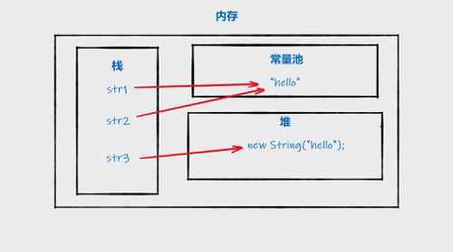

# Java基本功
[toc]
## Java 简介
### 语言特性
#### 1.面向对象
面向对象（Object Oriented）指的是一种编程方法。面向对象的主要思想是：围绕着我们所操纵的 “事物”（即对象）来设计软件。 计算机硬件的发展为软件技术的发展提供了更好的土壤，为了让大型软件项目易于管理，降低开发和维护的成本，面向对象技术也就应运而生。为了了解面向对象技术的诞生原因，我们下面来介绍几种比较具有代表性的软件技术。
##### 1.1 汇编语言
汇编语言是软件技术的开端，这种语言与机器语言非常接近，并且可以很容易地转换为可执行代码。使用汇编语言的程序员，必须了解计算机的详细体系结构才能编写程序。
##### 1.2 程序语言
在汇编语言之后，开发了高级语言，可以使用语言的编译器（如 ==gcc==）将高级程序代码转换为机器指令。这样程序员无需再深入了解计算机硬件的体系结构。为了提高代码的可复用性并最大程度地减少 GOTO 指令的使用，引入了==面向过程==技术。虽然简化了软件流程控制的创建和维护，但是忽视了数据的组织。调试和维护许多全局变量的程序，变成了程序员的一场噩梦。
##### 1.3 面向对象语言
在面向对象的语言中，数据被抽象地封装在对象中。特定于对象中的数据只能通过该对象来进行访问。这样，程序就成为了对象之间的一系列交互。Java 语言就是一个纯面向对象的语言。

#### 面向对象的五大原则
##### 单一职责原则（Single-Responsibility Principle）
**核心思想为：一个类，最好只做一件事，只有一个引起它的变化。**

单一职责原则可以看做是低耦合、高内聚在面向对象原则上的引申，将职责定义为引起变化的原因，以提高内聚性来减少引起变化的原因。职责过多，可能引起它变化的原因就越多，这将导致职责依赖，相互之间就产生影响，从而大大损伤其内聚性和耦合度。

##### 开放封闭原则（Open-Closed principle）
**核心思想是：软件实体应该是可扩展的，而不可修改的。也就是，对扩展开放，对修改封闭的。**
开放封闭原则主要体现在两个方面：

1、对扩展开放，意味着有新的需求或变化时，可以对现有代码进行扩展，以适应新的情况。

2、对修改封闭，意味着类一旦设计完成，就可以独立完成其工作，而不要对其进行任何尝试的修改。

实现开放封闭原则的核心思想就是对抽象编程，而不对具体编程，因为抽象相对稳定。让类依赖于固定的抽象，所以修改就是封闭的；而通过面向对象的继承和多态机制，又可以实现对抽象类的继承，通过覆写其方法来改变固有行为，实现新的拓展方法，所以就是开放的。 “需求总是变化”没有不变的软件，所以就需要用封闭开放原则来封闭变化满足需求，同时还能保持软件内部的封装体系稳定，不被需求的变化影响。


##### 里氏替换原则（Liskov-Substitution Principle）
**核心思想是：子类必须能够替换其基类。这一思想体现为对继承机制的约束规范，只有子类能够替换基类时，才能保证系统在运行期内识别子类，这是保证继承复用的基础。**

在父类和子类的具体行为中，必须严格把握继承层次中的关系和特征，将基类替换为子类，程序的行为不会发生任何变化。

里氏替换原则是关于继承机制的设计原则，违反了Liskov替换原则就必然导致违反开放封闭原则。

里氏替换原则能够保证系统具有良好的拓展性，同时实现基于多态的抽象机制，能够减少代码冗余，避免运行期的类型判别。

##### 依赖倒置原则（Dependecy-Inversion Principle）
**核心思想是：依赖于抽象。具体而言就是高层模块不依赖于底层模块，二者都同依赖于抽象；抽象不依赖于具体，具体依赖于抽象。**

当两个模块之间存在紧密的耦合关系时，最好的方法就是分离接口和实现：在依赖之间定义一个抽象的接口使得高层模块调用接口，而底层模块实现接口的定义，以此来有效控制耦合关系，达到依赖于抽象的设计目标。 抽象的稳定性决定了系统的稳定性，因为抽象是不变的，依赖于抽象是面向对象设计的精髓，也是依赖倒置原则的核心。

依赖于抽象是一个通用的原则，而某些时候依赖于细节则是在所难免的，必须权衡在抽象和具体之间的取舍，方法不是一层不变的。依赖于抽象，就是对接口编程，不要对实现编程。

##### 接口隔离原则（Interface-Segregation Principle）
**核心思想是：使用多个小的专门的接口，而不要使用一个大的总接口。**

具体而言，接口隔离原则体现在：接口应该是内聚的，应该避免“胖”接口。一个类对另外一个类的依赖应该建立在最小的接口上，不要强迫依赖不用的方法，这是一种接口污染。

接口有效地将细节和抽象隔离，体现了对抽象编程的一切好处，接口隔离强调接口的单一性。而胖接口存在明显的弊端，会导致实现的类型必须完全实现接口的所有方法、属性等；而某些时候，实现类型并非需要所有的接口定义，在设计上这是“浪费”，而且在实施上这会带来潜在的问题，对胖接口的修改将导致一连串的客户端程序需要修改，有时候这是一种灾难。在这种情况下，将胖接口分解为多个特点的定制化方法，使得客户端仅仅依赖于它们的实际调用的方法，从而解除了客户端不会依赖于它们不用的方法。 分离的手段主要有以下两种：

1、委托分离，通过增加一个新的类型来委托客户的请求，隔离客户和接口的直接依赖，但是会增加系统的开销。

2、多重继承分离，通过接口多继承来实现客户的需求，这种方式是较好的。

#### 2 跨平台性
我们也许常常听到一句口号 ——“**一次编译，到处执行（write once, run anywhere.）**”，这里说的就是 Java 的**跨平台性**，我们首先来看下在 ==c== 或 ==c++== 中，代码是如何在不同平台运行的：

在 ==c== 或 ==c++== 中，我们首先要将源代码文件编译为机器代码文件，然后再去执行它。这个过程中，机器代码文件必须在为其编译的平台才能执行（这里的平台指的是 Windows、Linux、Mac OS 等），也就是说，我们的代码如果希望在多个平台执行，那就必须多次编译程序。这不仅给程序员带来了繁琐的开发步骤（代码稍做变更就要重新编译整个程序），也给程序带来了更大的漏洞风险。当代码已经编译为可执行文件时，这个可执行文件不能动态更改，此时需要更改代码重新编译，以替换旧的可执行文件。

Java 的思想是，将代码编译为中间语言，中间语言是**字节码**，解释器是 Java 虚拟机（JVM）。字节码文件可以通用，JVM 是特定于平台的。如下图所示：


每一个平台都需要一个 JVM ，**这里 JVM 是实现 “到处执行” 的关键前提**，所以，在 Java 中，我们只需要**生成一个字节码文件**，就可以保证我们编写的程序在任何平台都能运行了。

> Java中基本数据类型的值域和行为都是由其自己定义的。而C/C++中，基本数据类型是由它的占位宽度决定的，占位宽度则是由所在平台决定的。所以，在不同的平台中，对于同一个C++程序的编译结果会出现不同的行为。

>举一个简单的例子，对于int类型，在Java中，int占4个字节，这是固定的。

> 但是在C++中却不是固定的了。在16位计算机上，int类型的长度可能为两字节；在32位计算机上，可能为4字节；当64位计算机流行起来后，int类型的长度可能会达到8字节。（这里说的都是可能哦！）


#### 3 标准化
在 Java 中，提供了大量的标准化库，这保证了我们使用统一的接口对程序进行控制。

#### 4 异常处理
异常处理的老方式是：让每个函数返回一个错误代码，调用者会检查其返回的内容，这样就导致了代码中到处都是错误码的校验，从而让源码变得难以阅读。

在异常处理的新方式中，函数或方法不再返回错误码，而是以抛出异常的方式来进行异常处理，在 Java 中可以使用 catch 关键字来捕获在 try 语句块中所发生的异常。这样我们无需频繁通过定义错误代码的方式处理异常，代码可读性大大提高。

#### 5 动态类加载
在 Java 中，如果在执行阶段不需要某个类，那么这个类就不会被编译为字节码。在网络编程中，这个特性非常常用。当我们不知道将执行什么代码时，程序可以从文件系统或远端服务器加载类。

#### 6 自动垃圾回收机制
在常规语言（例如 C 和 C++）中，程序员必须确保已分配的内存被释放。防止造成**内存泄漏**的麻烦。

内存资源或缓冲区具有特定的操作模式以获得最佳性能。一旦缓冲区中充满了数据，就需要在不再使用其内容之后将其清除。如果程序员忘记清除其代码中的内容，则内存很容易过载。Java 使用**自动垃圾收集器**来管理对象生命周期中的内存。程序员确定何时创建对象，一旦不再使用对象，Java 运行时将负责恢复内存。一旦没有了对对象的引用，则垃圾回收器将自动释放无法访问的内存。

自动垃圾回收机制，让使用 Java 编写的代码更加健壮，**降低了内存泄漏和溢出的风险**。程序员唯一需要注意的是对象创建的速度。如果应用程序创建对象的速度超过了垃圾收集器释放对象的速度，则可能导致内存相关问题。

### 名词解释
- **JRE**：Java Runtime Environment （Java 运行时环境）
- **JDK**：Java Development Kit （Java 开发工具包）

以上两个名词是 Java 平台的两大重要软件，他们分别可以帮助用户运行和开发 Java 程序，JDK 是 JRE 的**超集**，包含 JRE 的所有内容，以及开发小程序和应用程序所需的工具，例如编译器和调试器。

### 编译程序
在 Java 中，程序不是直接被编译为可执行文件，而是被编译为字节码文件， JVM（Java虚拟机）在运行时执行**字节码**文件。当我们使用 javac 编译器时，Java 源代码文件被编译为字节码文件，字节码文件以扩展名 .class 的形式保存在磁盘上。当程序运行时，字节码文件将被转换为机器代码，并在内存中执行。

总的来说，Java 源代码需要被“**转换**”两次才能被计算机执行：

1. **Java 源代码被编译为字节码**：由 javac 前端编译器完成；
2. **字节码被编译为机器码**：由 JVM 的执行引擎完成。


命令行运行方式
```java
# javac 是编译器，而 java 是虚拟机，先使用 javac 编译器编译源代码，再使用java虚拟机执行字节码文件。这就是我们上面提到的 java 源代码被转换两次到执行的过程。
javac HelloWorld.java
# java 命令后面的参数是类名。换句话说，我们只需要给虚拟机传递类名作为参数即可，虚拟机会自动查找对应的以.class为扩展名的文件并且执行。
java HelloWorld

```

## Java基础

### 值传递和引用传递
关于这个问题，在StackOverflow上也引发过广泛的讨论，看来很多程序员对于这个问题的理解都不尽相同，甚至很多人理解的是错误的。还有的人可能知道Java中的参数传递是值传递，但是说不出来为什么。

> 错误理解一：值传递和引用传递，区分的条件是传递的内容，如果是个值，就是值传递。如果是个引用，就是引用传递。
> 
> 错误理解二：Java是引用传递。
> 
> 错误理解三：传递的参数如果是普通类型，那就是值传递，如果是对象，那就是引用传递。

> 形式参数：是在定义函数名和函数体的时候使用的参数,目的是用来接收调用该函数时传入的参数。
> 
> 实际参数：在调用有参函数时，主调函数和被调函数之间有数据传递关系。在主调函数中调用一个函数时，函数名后面括号中的参数称为“实际参数”。

-   传值调用（值传递）
    -   在传值调用中，实际参数先被求值，然后其值通过复制，被传递给被调函数的形式参数。因为形式参数拿到的只是一个"局部拷贝"，所以如果在被调函数中改变了形式参数的值，并不会改变实际参数的值。
-   传引用调用（引用传递）
    -   在传引用调用中，传递给函数的是它的实际参数的隐式引用而不是实参的拷贝。因为传递的是引用，所以，如果在被调函数中改变了形式参数的值，改变对于调用者来说是可见的。
-   传共享对象调用（共享对象传递）
    -   传共享对象调用中，先获取到实际参数的地址，然后将其复制，并把该地址的拷贝传递给被调函数的形式参数。因为参数的地址都指向同一个对象，所以我们称也之为"传共享对象"，所以，如果在被调函数中改变了形式参数的值，调用者是可以看到这种变化的。

**Java中的基本数据类型是值传递的**

**Java对象的传递，是通过复制的方式把引用关系传递了，如果我们没有改引用关系，而是找到引用的地址，把里面的内容改了，是会对调用方有影响的，因为大家指向的是同一个共享对象。**

### 命名规范
- **类名首字母大**。
- **源代码文件的命名必须与类名相同**。
- **变量命名应采用小驼峰命名法**。所谓小驼峰命名法，就是如果你选择的名称只包含一个单词，那么用全部小写字母拼写该单词；如果名称包含多个单词，请将第二个单词起的每个单词的第一个字母都大写；
- **如果变量存储了一个常量值，要将每个字母大写并用下划线字符分隔每个单词**。

### 四种变量的种类
```java
public class KindsOfVariables {
    // 1.实例变量
    public int instanceVariable = 1;
    // 2.类变量
    public static int classVariable;
    
    public void demoMethod(int parameter) { // 3.参数	    
        // 4.局部变量
        int localVariable;
    }
    
    public static void main(String[] args) {
        // 入口方法
    }
}
```
### Java 基本数据类型（另一种是引用数据类型）
- **数字型**：包含 ==short16==、==int32==、==long64==、==float32== 和 ==double64==，只能存储数字数据；
- **字符型**：==byte8== 和 ==char16==，只能存储**字符数据**；
- **布尔类型**：==boolean==，只能存储 true(真) 或 false(假)。
> 需要注意的是，long 类型的值后面要以大写字母 L 或小写字母 l 结尾。对于长整型，推荐后面总以大写字母 L 结尾，因为小写字母 l 与数字 1 容易混淆。

> 在 Java 中，十六进制和二进制需要以前缀区分，前缀 0x 表示十六进制，前缀 0b 表示二进制。

> float 类型的值必须要以大写字母 F 或小写字母 f 结尾。

### 基本数据类型有什么好处

我们都知道在 Java 语言中，`new` 一个对象是存储在堆里的，我们通过栈中的引用来使用这些对象；所以，对象本身来说是比较消耗资源的。

对于经常用到的类型，如 int 等，如果我们每次使用这种变量的时候都需要 new 一个 Java 对象的话，就会比较笨重。所以，和 C++ 一样，Java 提供了基本数据类型，这种数据的变量不需要使用 new 创建，他们不会在堆上创建，而是直接在栈内存中存储，因此会更加高效。

### instanceof 运算符
如果**instanceof**左侧的变量所指向的对象，是**instanceof**右侧类或接口的一个对象，结果为真，否则结果为假。
```java
( Object reference variable ) instanceof  (class/interface type)

public class InstanceOfOperators1 {
    public static void main(String[] args) {
        String name = "imooc";
        boolean b = name instanceof String; 
     	  System.out.println("结果为：" + b);
    }
}
```
> 注意，instanceof运算符不能用于操作基本数据类型，如果将字符串类型name变量改为一个char类型的变量，编译代码将会报错。


### Java 字符串
```java
String str = "慕课网";

// Java13的特性
public class StringTest3 {
    public static void main(String[] args) {
        String str = """
            Java 很棒！
            慕课网很棒！！
            能够在慕课网学 Java 更棒！！！""";
        System.out.println(str);
    }
}

```
> 字符串有一个重要特性：不可变性。也就是说，字符串一经创建便无法修改。改变只会改变指向。

> 当代码中出现双引号形式（字面量）创建字符串对象时，JVM 会先对这个字符串进行检查，如果字符串常量池中存在相同内容的字符串对象的引用，则将这个引用返回；否则，创建新的字符串对象，然后将这个引用放入字符串常量池，并返回该引用。

#### JDK 6和JDK 7中substring的原理及区别
当调用substring方法的时候，会创建一个新的string对象，但是这个string的值仍然指向堆中的同一个字符数组。这两个对象中只有count和offset 的值是不同的。


如果你有一个很长很长的字符串，但是当你使用substring进行切割的时候你只需要很短的一段。这可能导致性能问题，因为你需要的只是一小段字符序列，但是你却引用了整个字符串（因为这个非常长的字符数组一直在被引用，所以无法被回收，就可能导致内存泄露）。在JDK 6中，一般用以下方式来解决该问题，原理其实就是生成一个新的字符串并引用他。

```java
x = x.substring(x, y) + ""
```

上面提到的问题，在jdk 7中得到解决。在jdk 7 中，substring方法会在堆内存中创建一个新的数组。


### Java 数组
数组是**相同类型的数据**按照**顺序**组成的一种**引用数据类型**。
#### 数组声明
```java
// 声明一个int类型的数组，名称为 firstIntArray:
int[] firstIntArray;  // 推荐写法
int firstIntArray[];

// 声明一个float类型的数组：
float[] firstFloatArray;
// 声明一个字符串类型的数组：
String[] firstStringArray;

```
#### 数组创建
```java
// 声明一个整型的数组：
int[] intArray;
// 创建数组，长度为10
intArray = new int[10];

// 声明时同时创建
int[] intArray = new int[10];

// 创建一个数据类型为字符串、长度为5的数组：
String[] stringArray = new String[5];

// 创建一个数据类型为双精度浮点型、长度为10的数组：
double[] floatArray = new double[10];

// 创建一个数据类型为字符型、长度为10的数组：
char[] charArray;
charArray = new char[10];

```
> 数组创建后，所有元素都初始化为默认值，整型数组的元素都为 0，浮点型都为 0. 0 ，布尔型都为 false。

#### 静态初始化
静态初始化数组，就是声明的同时，给数组赋值。其语法为：
```java
DataType[] arrayName = {元素1, 元素2, 元素3, 元素n};

```
**数组的长度就是初始化时所给数组元素的个数。**

#### 动态初始化
```java
// 声明并创建数组，长度为3
int[] arr = new int[3];
// 给下标位置0赋值为1
arr[0] = 1;
// 给下标位置1赋值为2
arr[1] = 2;
// 给下标位置2赋值为3
arr[2] = 3;

```

#### 获取数组长度
```java
// 引用最后一个元素：
        char lastElement = charArr[charArr.length-1];
```

> 数组是引用数据类型。它在创建时，会在内存中开辟一个连续的空间；数组是同一数据类型的集合。

### for each循环
```java
public class ForEachLoop {
    public static void main(String[] args) {
        // 初始化字符串数组 words
        String[] words = {"Welcome ", "to ", "imooc"};
        for(String word: words) {
            System.out.print(word);
        }
    }
}
```

## Java面向对象
### 引用类型的传值
> 引用类型参数的传递，调用方的变量，和接收方的参数变量，地址指向的是同一个对象。双方任意一方对这个对象的修改，都会影响对方。

### 可变参数
```java
public class VariableParameter1 {
    public void search(int element, int... elements) {
        boolean existed  = false;
        for (int e: elements) {
            if (e == element) {
                existed = true;
                break;
            }
        }
        if (existed) {
            System.out.println("找到元素：" + element);
        } else {
            System.out.println("未找到元素：" + element);
        }
    }

    public static void main(String[] args) {
        // 创建对象
        VariableParameter1 obj = new VariableParameter1();
        // 调用方法
        obj.search(2, 1,2,3,4);
        // 定义数组参数
        int[] arr = {1,2,3,4};
        // 将数组传递给可变参数列表
        obj.search(2, arr);
    }
}
```

### Java 继承
- 所有的 Java 类都继承自 Java.lang.Object，所以 Object 是所有类的祖先类，除了 Object 外，所有类都必须有一个父类。我们在定义类的时候没有显示指定其父类，它默认就继承自 Object 类。
- 子类一旦继承父类，就会继承父类所有开放的特征，不能选择性地继承父类特征。
```java
// 父类
class SuperClass {
  	...
}

// 子类
class SubClass extends SuperClass {
  	...
}

```
#### Java的继承与组合
组合(Composition)体现的是整体与部分、拥有的关系，即has-a的关系。

> has-a：表示"有一个"的关系，如狗有一个尾巴

>  在`继承`结构中，父类的内部细节对于子类是可见的。所以我们通常也可以说通过继承的代码复用是一种`白盒式代码复用`。（如果基类的实现发生改变，那么派生类的实现也将随之改变。这样就导致了子类行为的不可预知性；）
> 
> `组合`是通过对现有的对象进行拼装（组合）产生新的、更复杂的功能。因为在对象之间，各自的内部细节是不可见的，所以我们也说这种方式的代码复用是`黑盒式代码复用`。（因为组合中一般都定义一个类型，所以在编译期根本不知道具体会调用哪个实现类的方法）
> 
> `继承`，在写代码的时候就要指名具体继承哪个类，所以，在`编译期`就确定了关系。（从基类继承来的实现是无法在运行期动态改变的，因此降低了应用的灵活性。）
> 
> `组合`，在写代码的时候可以采用面向接口编程。所以，类的组合关系一般在`运行期`确定。

> 面向对象中有一个比较重要的原则『多用组合、少用继承』或者说『组合优于继承』。建议在同样可行的情况下，优先使用组合而不是继承。因为组合更安全，更简单，更灵活，更高效。

> 继承要慎用，其使用场合仅限于你确信使用该技术有效的情况。一个判断方法是，问一问自己是否需要从新类向基类进行向上转型。如果是必须的，则继承是必要的。反之则应该好好考虑是否需要继承。《Java编程思想》
> 只有当子类真正是超类的子类型时，才适合用继承。换句话说，对于两个类A和B，只有当两者之间确实存在is-a关系的时候，类B才应该继承类A。《Effective Java》

#### Java的继承与实现

继承和实现两者的明确定义和区别如下：

继承（Inheritance）：如果多个类的某个部分的功能相同，那么可以抽象出一个类出来，把他们的相同部分都放到父类里，让他们都继承这个类。

实现（Implement）：如果多个类处理的目标是一样的，但是处理的方法方式不同，那么就定义一个接口，也就是一个标准，让他们的实现这个接口，各自实现自己具体的处理方法来处理那个目标。

继承指的是一个类（称为子类、子接口）继承另外的一个类（称为父类、父接口）的功能，并可以增加它自己的新功能的能力。所以，继承的根本原因是因为要_复用_，而实现的根本原因是需要定义一个_标准_。

在Java中，继承使用`extends`关键字实现，而实现通过`implements`关键字。


#### 方法重写和方法重载的区别
Java 中的方法重写（Overriding）是说子类重新定义了父类的方法。方法重写必须有相同的方法名，参数列表和返回类型。覆盖者访问修饰符的限定大于等于父类方法。

而方法重载（Overloading）发生在同一个类里面两个或者是多个方法的方法名相同但是参数不同的情况。

> **Tips**：在要重写的方法上面，可以选择使用 @Override 注解，让编译器帮助检查是否进行了正确的重写。如果重写有误，编译器会提示错误。虽然这个注解不是必须的，但建议日常编码中，在所有要重写的方法上都加上 @Override 注解，这样可以避免我们由于马虎造成的错误。

1、重载是一个编译期概念、重写是一个运行期概念。

2、重载遵循所谓“编译期绑定”，即在编译时根据参数变量的类型判断应该调用哪个方法。

3、重写遵循所谓“运行期绑定”，即在运行的时候，根据引用变量所指向的实际对象的类型来调用方法。

4、Java中的方法重写是Java多态（子类型）的实现方式。而Java中的方法重载其实是特设多态的一种实现方式。

#### Java为什么不支持多继承

在Java中，一个类，只能通过extends关键字继承一个类，不允许多继承。但是，多继承在其他的面向对象语言中是有可能支持的。

假设我们有类B和类C，它们都继承了相同的类A。另外我们还有类D，类D通过多重继承机制继承了类B和类C。


这时候，因为D同时继承了B和C，并且B和C又同时继承了A，那么，D中就会因为多重继承，继承到两份来自A中的属性和方法。

这时候，在使用D的时候，如果想要调用一个定义在A中的方法时，就会出现歧义。

而C++为了解决菱形继承问题，又引入了**虚继承**。

因为支持多继承，引入了菱形继承问题，又因为要解决菱形继承问题，引入了虚继承。而经过分析，人们发现我们其实真正想要使用多继承的情况并不多。

所以，在 Java 中，不允许“实现多继承”，即一个类不允许继承多个父类。但是 Java 允许“声明多继承”，即一个类可以实现多个接口，一个接口也可以继承多个父接口。由于接口只允许有方法声明而不允许有方法实现（Java 8以前），这就避免了 C++ 中多继承的歧义问题。

但是，Java不支持多继承，在Java 8中支持了默认函数（default method ）之后就不那么绝对了。

#### 访问修饰符
Java 一共提供了 4 种访问修饰符：
1. **private**：私有的，只允许在本类中访问；
2. **protected**：受保护的，允许在同一个类、同一个包以及不同包的子类中访问；
3. **默认的**：允许在同一个类，同一个包中访问；
4. **public**：公共的，可以再任何地方访问。


#### super 关键字
super 是用在子类中的，目的是访问直接父类的变量或方法。注意：
- super 关键字只能调用父类的 public 以及 protected 成员；
- super 关键字可以用在子类构造方法中调用父类构造方法；
- super 关键字不能用于静态 (static) 方法中。

##### 调用父类构造方法
```java
super(参数列表)

// 父类
public Pet(String name) {
    System.out.println("宠物实例被创建了，宠物名字为" + name);
}

// 子类
public Dog(String name) {
  	super(name);
  	System.out.println("小狗实例被创建了");
}

new Dog("花花");

宠物实例被创建了，宠物名字为花花
小狗实例被创建了

```
#### 调用父类属性
```java
super.成员变量名

class Pet {
  	protected String birthday;
}

class Dog extends Pet {
  	public Dog() {
  	    System.out.println("宠物生日：" + super.birthday);
    }
}


```
#### 调用父类方法
有时候我们不想完全重写父类方法，可以使用 super 关键字调用父类方法，调用父类方法的语法为：
```java
super.方法名(参数列表)

class Pet {
  	public void eat() {
      	System.out.println("宠物吃东西");
    }
}

class Cat extends Pet{
  	public void eat() {
      	// 在 eat 方法中调用父类 eat 方法
      	super.eat();
      	System.out.println("小猫饭量很小");
    }
}

class Test {
  	public static void main(String[] args) {
      	Cat cat = new Cat();
      	cat.eat();
    }
}

```

#### final 关键字
##### final 作用于类
当 final 关键字用于类上面时，这个类不会被其他类继承。
##### final 作用于方法
当父类中方法不希望被重写时，可以将该方法标记为 final。
##### final 作用于变量
对于实例变量，可以使用 final 修饰，其修饰的变量在初始化后就不能修改。

### Java 多态
**所谓多态就是指一个类实例的相同方法在不同情形有不同表现形式。多态机制使具有不同内部结构的对象可以共享相同的外部接口。**

**这意味着，虽然针对不同对象的具体操作不同，但通过一个公共的类，它们（那些操作）可以通过相同的方式予以调用。**

多态意味着允许不同类的对象对同一消息做出不同的响应。

> 编译器是根据引用类型来判断有哪些method可以调用，而不是根据Object确实的类型。比如 Object o = new Dog(); 只能调用Object方法不能调用dog方法。

#### 实现多态
在 Java 中实现多态有 3 个必要条件：

1. 满足继承关系
2. 要有重写
3. 父类引用指向子类对象
```java
class Pet {
  	// 定义方法 eat
  	public void eat() {
      	System.out.println("宠物吃东西");
    }
}

class Dog extends Pet { // 继承父类
  	// 重写父类方法 eat
  	public void eat() {
      	System.out.println("狗狗吃狗粮");
    }
}
子类Cat继承Pet
class Cat extends Pet { // 继承父类
  	// 重写父类方法 eat
   	public void eat() {
      	System.out.println("猫猫吃猫粮");
    }
}

public void main(String[] args) {
  	// 分别实例化三个对象，并且保持其类型为父类Pet
  	Pet pet = new Pet();
  	Pet dog = new Dog();
  	Pet cat = new Cat();
  	// 调用对象下方法
  	pet.eat();
  	dog.eat();
  	cat.eat();
}

```
在代码中，Pet dog = new Dog();、Pet cat = new Cat();这两个语句，把Dog和Cat对象转换为Pet对象，这种把一个子类对象转型为父类对象的做法称为向上转型。父类引用指向了子类的实例。也就实现了多态。

#### 向上转型
向上转型又称为自动转型、隐式转型。向上转型就是父类引用指向子类实例，也就是子类的对象可以赋值给父类对象。

向上转型实际上是把一个子类型安全地变成了更加抽象的父类型，由于所有类的根类都是Object，我们也把子类类型转换为Object类型。
```java
Pet dog = new Dog();

Cat cat = new Cat();
Object o = cat;

```

#### 向下转型
向下转型也被称为强制类型转换。
```java
// 为Cat类增加run方法
class Cat extends Pet { // 继承父类
  	// 重写父类方法 eat
   	public void eat() {
      	System.out.println("猫猫吃猫粮");
    }
  	
  	public void run() {
      	System.out.println("猫猫跑步");
    }
  
  	public static void main(String[] args) {    	
      	// 实例化子类
      	Pet cat = new Cat();
      	// 强制类型转换，只有转换为Cat对象后，才能调用其下面的run方法
      	Cat catObj = (Cat)cat;
      	catObj.run();
    }
}

```
我们为Cat类新增了一个run方法，此时我们无法通过Pet类型的cat实例调用到其下面特有的run方法，需要向下转型，通过(Cat)cat将Pet类型的对象强制转换为Cat类型，这个时候就可以调用run方法了。

使用向下转型的时候，要注意：**不能将父类对象转换为子类类型，也不能将兄弟类对象相互转换。**

#### instanceof 运算符
instanceof运算符用来检查对象引用是否是类型的实例，或者这个类型的子类，并返回布尔值。如果是返回true，如果不是返回false。通常可以在运行时使用 instanceof 运算符指出某个对象是否满足一个特定类型的实例特征。
```java
<对象引用> instanceof 特定类型

Pet pet = new Cat();
if (pet instanceof Cat) {
		// 将父类转换为子类
		Cat cat = (Cat) pet;
}

```

### Java 抽象类
在面向对象的概念中，所有的对象都是通过类来描绘的，但是反过来，并不是所有的类都是用来描绘对象的，如果一个类中没有包含足够的信息来描绘一个具体的对象，这样的类就是抽象类。

值得注意的是，一个抽象类不能直接实例化，但类的其他功能依然存在；既然不能被实例化，那么它必须被继承才能被使用。

#### 为什么需要抽象类
当某个父类只知道其子类**应该包含什么方法**，但不知道子类**如何实现这些方法**的时候，抽象类就派上用场了。使用抽象类还有一个好处，类的使用者在创建对象时，就知道他必须要使用某个具体子类，而不会误用抽象的父类，因此对于使用者来说，**有一个提示作用**。

```java
class Pet {
  	// 定义方法 eat
  	public void eat() {
      	System.out.println("宠物都会吃东西");
    }
}

class Dog extends Pet { // 继承父类
  	// 重写父类方法 eat
  	@Override
  	public void eat() {
      	System.out.println("狗狗吃狗粮");
    }
}

class Cat extends Pet { // 继承父类
  	// 重写父类方法 eat
  	@Override
   	public void eat() {
      	System.out.println("猫猫吃猫粮");
    }
}

abstract class Pet {
    abstract void eat();
}

```
抽象类可以定义一个完整的编程接口，从而为子类提供实现该编程接口所需的所有方法的方法声明。抽象类可以只声明方法，而不关心这些方法的具体实现，而子类必须去实现这些方法。
> 抽象方法不能是 final、static 和 native 的；并且抽象方法不能是私有的，即不能用 private 修饰。因为抽象方法一定要被子类重写，私有方法、最终方法以及静态方法都不可以被重写，因此抽象方法不能使用 private、final 以及 static 关键字修饰。而 native 是本地方法，它与抽象方法不同的是，它把具体的实现移交给了本地系统的函数库，没有把实现交给子类，因此和 abstract 方法本身就是冲突的。

### Java 接口
#### 概念
**Java 接口是一系列方法的声明，是一些方法特征的集合，一个接口只有方法的特征没有方法的实现。**

在 Java 中，被关键字 interface 修饰的 class 就是一个接口。接口定义了一个行为协议，可以由类层次结构中任何位置的任何类实现。接口中定义了一组抽象方法，都没有具体实现，实现该接口的类必须实现该接口中定义的所有抽象方法。

#### 为什么需要接口
接口就是为了解决 Java 单继承这个弊端而产生的，虽然一个类只能有一个直接父类，但是它可以实现多个接口，没有继承关系的类也可以实现相同的接口。继承和接口的双重设计既保持了类的数据安全也变相实现了多继承。

#### 接口的定义和实现
```java
public interface Person {
  	final String NAME = "我是Person接口中的常量";
	void walk();
  	void run();
}

```
接口声明需要两个元素：interface 关键字和接口名称，public 修饰符表示该接口可以在任何包的任何类中使用，如果为显示指定访问修饰符，则该接口只能被在同包中的类使用。

接口比抽象类更加 “抽象”，它下面不能拥有具体实现的方法，必须全部都是抽象方法，所有的方法默认都是 public abstract 的，所以在接口主体中的方法，这两个修饰符无需显示指定。

接口中的成员声明不允许使用 private 和 protected 修饰符。

接口定义了一些行为协议，而实现接口的类要遵循这些协议。implements 关键字用于实现接口，一个类可以实现一个或多个接口，当要实现多个接口时，implements 关键字后面是该类要实现的以逗号分割的接口名列表。
```java
public class MyClass implements MyInterface1, MyInterface2 {
   ...
}

```

#### 接口继承
接口也是存在继承关系的。接口继承使用 extends 关键字。
```java
// MyInterface1.java
public interface MyInterface1 {
    void abstractMethod1();
}

// MyInterface2.java
public interface MyInterface2 extends MyInterface1 {
    void abstractMethod2();
}

// MyClass.java
public class MyClass implements MyInterface2 {
    @Override
    public void abstractMethod2() {
				...
    }

    @Override
    public void abstractMethod1() {
				...
    }
}

public class MyClass extends SuperClass implements MyInterface {
   ...
}


```
值得注意的是，一个接口可以继承多个父接口，接口名放在 extends 后面，以逗号分割。

> 当一个实现类存在 extends 关键字，那么 implements 关键字应该放在其后

#### 默认方法和静态方法
从 JDK 1.8 开始，接口中可以定义默认方法和静态方法。与抽象方法不同，实现类可以不实现默认方法和类方法。

我们可以使用 default 关键字，在接口主题中实现带方法体的方法。
```java
public interface Person {
  	void run();
  
  	default void eat() {
      	System.out.println("我是默认的吃方法");
    }
}

public class Student implements Person {
  	@Override
    public void run() {
        System.out.println("学生可以跑步");
    }
}

public class Student implements Person {
  	@Override
    public void run() {
        System.out.println("学生可以跑步");
    }
  
  	// 重写默认方法
  	@Override
  	public void eat() {
      	// 使用 接口名.super.方法名() 的方式调用接口中默认方法
      	Person.super.eat();
      	System.out.println("学生吃东西");
    }
}

```
如果想要在实现类中调用接口的默认方法，可以使用接口名.super. 方法名 () 的方式调用。这里的 接口名.super 就是接口的引用。

使用 static 关键字在接口中声明静态方法。
```java
public interface Person {
    void walk();
    // 声明静态方法
    static void sayHello() {
        System.out.println("Hello imooc!");
    }
}

public class Student implements Person {
    @Override
    public void walk() {
      	// 调用接口中的类方法
        Person.sayHello();
        System.out.println("学生会走路");
    }
}

```

#### 接口和抽象类的区别
1. 接口的方法默认是 public ，所有方法在接口中不能有实现（Java 8 开始接口方法可以有默认实现），而抽象类可以有非抽象的方法；
2. 接口中除了 static 、final 变量，不能有其他变量，而抽象类可以；
3. 一个类可以实现多个接口，但只能实现一个抽象类。接口自己本身可以通过 extends 关键字扩展多个接口；
4. 接口方法默认修饰符是 public ，抽象方法可以有 public 、protected 和 default 这些修饰符（抽象方法就是为了被重写所以不能使用 private 关键字修饰！）；
5. 从设计层面来说，抽象是对类的抽象，是一种模板设计，而接口是对行为的抽象，是一种行为的规范。

### Java 内部类
在 Java 语言中，可以将一个类定义在另一个类里面或者一个方法里面，我们把这样的类称为内部类。
```java
// 外部类 Car
public class Car {
    // 内部类 Engine
    class Engine {
        private String innerName = "发动机内部类";
    }
}

```
#### 分类
**Java 中的内部类可以分为 4 种：成员内部类、静态内部类、方法内部类和匿名内部类。**
#### 成员内部类
成员内部类也称为普通内部类，它是最常见的内部类。可以将其看作外部类的一个成员。在成员内部类中无法声明静态成员。
```java
// 外部类 Car
public class Car {
    // 内部类 Engine
    private class Engine {
        private void run() {
            System.out.println("发动机启动了！");
        }
    }
}

```
> 普通的 Java 类不同，含有内部类的类被编译器编译后，会生成两个独立的字节码文件：
Car$Engine.class
Car.class
其文件名为：外部类类名 $ 内部类类名.class。

内部类在外部使用时，无法直接实例化，需要借助外部类才能完成实例化操作。关于成员内部类的实例化，有 3 种方法：
1. new 外部类().new 内部类()
2. 先实例化外部类、再实例化内部类
3. 在外部类中定义一个获取内部类的方法 getEngine()
```java
public static void main(String[] args) {
    // 1.实例化外部类后紧接着实例化内部类
    Engine engine = new Car().new Engine();
    // 2.调用内部类的方法
    engine.run();
}

public static void main(String[] args) {
    // 1.实例化外部类
    Car car = new Car();
    // 2.通过外部类实例对象再实例化内部类
    Engine engine = car.new Engine();
    // 3.调用内部类的方法
    engine.run();
}

// 外部类 Car
public class Car {

    // 获取内部类实例的方法
    public Engine getEngine() {
        return new Engine();
    }

    // 内部类 Engine
    private class Engine {
        private void run() {
            System.out.println("发动机启动了！");
        }
    }

    public static void main(String[] args) {
		// 1.实例化外部类
    	Car car = new Car();
    	// 2.调用实例方法getEngine(),获取内部类实例
    	Engine engine = car.getEngine();
    	// 3.调用内部类的方法
    	engine.run();
    }
}
```
#### 静态内部类
静态内部类也称为嵌套类，是使用 static 关键字修饰的内部类。

静态内部类的实例化，可以不依赖外部类的对象直接创建
```java
public class Car1 {

    String brand = "宝马";

    static String name = "外部类的静态属性name";

    // 静态内部类
    static class Engine {
        public void run() {
            System.out.println(name);
        }
    }

    public static void main(String[] args) {
        Engine engine = new Engine();
        engine.run();
    }
}

```

#### 方法内部类
方法内部类，是定义在方法中的内部类，也称局部内部类。
```java
public class Car2 {
	
	// 外部类的run()方法
    public void run() {
        class Engine {
            public void run() {
                System.out.println("方法内部类的run()方法");
                System.out.println("发动机启动了");
            }
        }
        // 在Car2.run()方法的内部实例化其方法内部类Engine
        Engine engine = new Engine();
        // 调用Engine的run()方法
        engine.run();
    }

    public static void main(String[] args) {
        Car2 car2 = new Car2();
        car2.run();
    }
}
```

#### 匿名内部类
匿名内部类就是没有名字的内部类。使用匿名内部类，通常令其实现一个抽象类或接口。
```java
// 定义一个交通工具抽象父类，里面只有一个run()方法
public abstract class Transport {
    public void run() {
        System.out.println("交通工具run()方法");
    }

    public static void main(String[] args) {
        // 此处为匿名内部类，将对象的定义和实例化放到了一起
        Transport car = new Transport() {
            // 实现抽象父类的run()方法
            @Override
            public void run() {
                System.out.println("汽车跑");
            }
        };
        // 调用其方法
        car.run();

        Transport airPlain = new Transport() {
            // 实现抽象父类的run()方法
            @Override
            public void run() {
                System.out.println("飞机飞");
            }
        };
        airPlain.run();

    }
}
```
#### 作用
Java 不支持多继承，而接口可以实现多继承的效果，但实现接口就必须实现里面所有的方法，有时候我们的需求只是实现其中某个方法，内部类就可以解决这些问题。

### Java 包
包就是为了将类分类而产生的，我们可以使用包让程序结构更加清晰且易于管理。

#### 概述
包是一个命名空间，它可以将类和接口进行分组。

当程序规模越来越大，类的数量也会随之增多。使用包将这些类分组后，可以让类更易于查找和使用，也可以避免命名冲突，还可以控制访问。

对于命名冲突，我们来看实际开发中的一个例子：一个 Java 工程由 3 个程序员协同开发，程序员 A 写了一个工具类 Util，程序员 B 也写了一个工具类 Util，程序员 C 既想使用 A 的 Util，又想使用 B 的 Util，这个时候可以分别将 A、B 两个人的 Util 类放入两个不同的包下，就可以解决命名冲突了。

#### 包声明
在一个类中，使用关键字 package 在类的顶部声明一个包：
```java
package service;

public class DemoService {
    ...
}

```
上面的代码就表示 DemoService 类放到了 service 包下，我们也可以说：DemoService 在 service 包中声明。我们的类如果在包中声明，那么类就必须放置在源码目录下以包名称命名的子目录中。这样编译器才能在系统中找到 Java 文件。

> 还有一点需要特别提醒，java.lang 包中的所有类会都被编译器隐式导入，所以在使用诸如 System、String 等类的时候，我们不需要手动导入。

## Java 进阶
### Java String类
```java
String str1 = "Hello, 慕课网";

String str2 = new String("Hello, Java");

// 可以使用length()方法来获取字符串的长度。
public class StringMethod1 {
    public static void main(String[] args) {
        // 创建String对象str
        String str = "hello world!";
        // 调用对象下length()方法，并使用int类型变量接收返回结果
        int length = str.length();
        System.out.println("str的长度为：" + length);
    }
}

// char charAt(int index)方法获取字符串指定位置的字符。
public class StringMethod2 {
    public static void main(String[] args) {
        String str = "I love Java";
        char c = str.charAt(7);
        System.out.println("索引位置为7的字符为：" + c);
    }
}

// 查找字符串位置
// indexOf() 获取字符或子串在字符串中第一次出现的位置。
// lasIndexOf() 获取字符或子串在字符串中最后一次出现的位置。

public class StringMethod2 {
    public static void main(String[] args) {
        String str = "I love Java, I love imooc!";
        int i = str.indexOf('a');
        System.out.println("字符a在字符串str第一次出现的位置为：" + i);
    }
}

public class StringMethod2 {
    public static void main(String[] args) {
        String str = "I love Java, I love imooc!";
        int i = str.lastIndexOf('e');
        System.out.println("字符e在字符串str最后一次出现的位置为：" + i);
    }
}
```
需要特别注意的是，以上方法的参数都是区分大小写的。这也就意味着，你永远无法在I love Java中查找到字符E。

```java
// String substring(int beginIndex) 获取从beginIndex位置开始到结束的子串。
// String substring(int beginIndex, int endIndex) 获取从beginIndex位置开始到endIndex位置的子串（不包含endIndex位置字符）。
public class StringMethod3 {
    public static void main(String[] args) {
        String str = "I love Java";
        String substring = str.substring(2);
        String substring1 = str.substring(2, 6);
        System.out.println("从索引位置2到结束的子串为：" + substring);
        System.out.println("从索引位置2到索引位置6的子串为：" + substring1);
    }
}

// String[] split(String regex)方法可将字符串切割为子串，其参数regex是一个正则表达式分隔符，返回字符串数组。
public class StringMethod4 {
    public static void main(String[] args) {

        String str1 = "I love Java";
        // 将字符串str1以空格分隔，并将分割结果赋值给strArr数组
        String[] strArr = str1.split(" ");
        // 遍历数组，打印每一个元素
        for (String str: strArr) {
            System.out.print(str + '\t');
        }
        
    }
}

// toLowerCase() 将字符串转换为小写
// toUpperCase() 将字符串转换为大写
public class StringMethod5 {
    public static void main(String[] args) {
        String str = "HELLO world";
        String s = str.toLowerCase();
        System.out.println("字符串str为转换为小写后为：" + s);
        String s1 = s.toUpperCase();
        System.out.println("字符串s为转换为大写后为：" + s1);
    }
}

// String类提供了boolean equals(Object object)方法来比较字符串内容是否相同，返回一个布尔类型的结果。
public class StringMethod6 {
    public static void main(String[] args) {
        // 用两种方法创建三个内容相同的字符串
        String str1 = "hello";
        String str2 = "hello";
        String str3 = new String("hello");
        System.out.println("使用equals()方法比较str1和str2的结果为：" + str1.equals(str2));
        System.out.println("使用==运算符比较str1和str2的结果为：" + (str1 == str2));
        System.out.println("使用==运算符比较str1和str2的结果为：" + (str1 == str2));
        System.out.println("使用==运算符比较str1和str3的结果为：" + (str1 == str3));
    }
}

使用equals()方法比较str1和str2的结果为：true
使用==运算符比较str1和str2的结果为：true
使用equals()方法比较str1和str3的结果为：true
使用==运算符比较str1和str3的结果为：false

```
> 当执行String str3 = new String("hello");语句时，使用了new关键字创建字符串对象，由于对象的实例化操作是在内存的堆空间进行的，此时会在栈空间创建一个str3，在堆空间实例化一个内容为hello的字符串对象，并将str3地址指向堆空间中的hello，这就是==运算符比较str1和str3的结果为false的原因。


> 引用存在栈里，常量在常量池，new的对象在堆中。

### StringBuilder
#### StringBuilder 概述
与 String 相似，StringBuilder 也是一个与字符串相关的类，Java 官方文档给 StringBuilder 的定义是：可变的字符序列。

而 StringBuilder 与 String 不同，它具有可变性。相较 String 类不会产生大量无用数据，性能上会大大提高。

#### StringBuffer 概述
StringBuffer 也是不得不提的一个类，Java 官方文档给出的定义是：线程安全的可变字符序列。

StringBuffer 是 StringBuilder 的前身，在早期的 Java 版本中应用非常广泛，它是 StringBuilder 的线程安全版本（线程我们将在后面的小节中介绍），但实现线程安全的代价是执行效率的下降。

#### StringBuilder 的常用方法
1. StringBuilder 类提供了如下 4 个构造方法：
StringBuilder() 构造一个空字符串生成器，初始容量为 16 个字符；
2. StringBuilder(int catpacity) 构造一个空字符串生成器，初始容量由参数 capacity 指定；
3. StringBuilder(CharSequence seq) 构造一个字符串生成器，该生成器包含与指定的 CharSequence 相同的字符。；
4. StringBuilder(String str) 构造初始化为指定字符串内容的字符串生成器。
```java
StringBuilder str = new StringBuilder("Hello");

String str1 = "Hello";
String str2 = "World";
String str3 = str1 + " " + str2;
// 与str不同
public class ConnectString1 {
    public static void main(String[] args) {
        // 初始化一个内容为 Hello 的字符串生成器
        StringBuilder str = new StringBuilder("Hello");
        // 调用append()方法进行字符串的连接
        str.append(" ");
        str.append("World");
       	System.out.println(str);
    }
}

str.append(" ").append("World");

// 字符串替换
public class StringReplace {
    public static void main(String[] args) {
        // 初始化一个内容为 Hello 的字符串生成器
        StringBuilder str = new StringBuilder("Hello World!");
        // 调用字符串替换方法，将 World 替换为 Java
        str.replace(6, 11, "Java");
        // 打印替换后的字符串
        System.out.println(str);
    }
}

// 字符串截取
public class StringSub {
    public static void main(String[] args) {
        StringBuilder str = new StringBuilder("你好，欢迎来到慕课网");
        String substring = str.substring(7);
        System.out.println("str截取后子串为：" + substring);
    }
}


```
> Java 编译器在编译和运行期间会自动将字符串连接操作转换为 StringBuilder 操作或者数组复制，间接地优化了由于 String 的不可变性引发的性能问题。

### Java Scanner 类
Scanner是一个简单的文本扫描器，可以解析基础数据类型和字符串。
```java
import java.util.Scanner;

public class ScannerDemo1 {
    public static void main(String[] args) {
        // 创建扫描器对象
        Scanner scanner = new Scanner(System.in);
        System.out.println("请输入一段内容，输入回车结束：");
        // 可以将用户输入的内容扫描为字符串
        String str = scanner.next();
        // 打印输出
        System.out.println("您输入的内容为：" + str);
        // 关闭扫描器
        scanner.close();
    }
}

```

### Java 异常处理
Java 的异常处理是 Java 语言的一大重要特性，也是提高代码健壮性的最强大方法之一。

在 Java 中，通过 Throwable 及其子类来描述各种不同类型的异常。如下是 Java 异常类的架构图（不是全部，只展示部分类）：


#### Throwable 类
Throwable 位于 java.lang 包下，它是 Java 语言中所有错误（Error）和异常（Exception）的父类。

#### Error 类
Error 是 Throwable 的一个直接子类，它可以指示合理的应用程序不应该尝试捕获的严重问题。这些错误在应用程序的控制和处理能力之外，编译器不会检查 Error，对于设计合理的应用程序来说，即使发生了错误，本质上也无法通过异常处理来解决其所引起的异常状况。

#### Exception 类
Exception 是 Throwable 的一个直接子类。它指示合理的应用程序可能希望捕获的条件。

Exception 又包括 Unchecked Exception（非检查异常）和 Checked Exception（检查异常）两大类别。

#### 如何进行异常处理
在 Java 语言中，异常处理机制可以分为两部分：
1. 抛出异常：当一个方法发生错误时，会创建一个异常对象，并交给运行时系统处理；

2. 捕获异常：在方法抛出异常之后，运行时系统将转为寻找合适的异常处理器。

```java
public class ExceptionDemo2 {
    // 打印 a / b 的结果
    public static void divide(int a, int b) {
        if (b == 0) {
            // 抛出异常
            throw new ArithmeticException("除数不能为零");
        }
        System.out.println(a / b);
    }

    public static void main(String[] args) {
        // 调用 divide() 方法
        divide(2, 0);
    }
}

public class ExceptionDemo3 {
    // 打印 a / b 的结果
    public static void divide(int a, int b) {
        System.out.println(a / b);
    }

    public static void main(String[] args) {
        try {
            // try 语句块
            // 调用 divide() 方法
            divide(2, 0);
        } catch (ArithmeticException e) {
            // catch 语句块
            System.out.println("catch: 发生了算数异常：" + e);
        } finally {
            // finally 语句块
            System.out.println("finally: 无论是否发生异常，都会执行");
        }
    }
}

public class ExceptionDemo4 {

    static class MyCustomException extends RuntimeException {
        /**
         * 无参构造方法
         */
        public MyCustomException() {
            super("我的自定义异常");
        }
    }

    public static void main(String[] args) {
      	// 直接抛出异常
        throw new MyCustomException();
    }
}

```

### Java 包装类
#### 什么是包装类
Java 有 8 种基本数据类型，Java 中的每个基本类型都被包装成了一个类，这些类被称为包装类。

包装类可以分为 3 类：Number、Character、Boolean，包装类的架构图如下所示：

#### 为什么需要包装类
我们知道 Java 是面向对象的编程语言，但为了便于开发者上手，Java 沿用了 C 语言的基本数据类型，因此 Java 数据类型被分为了基本数据类型和引用数据类型。

对于简单的运算，开发者可以直接使用基本数据类型。但对于需要对象化交互的场景（例如将基本数据类型存入集合中），就需要将基本数据类型封装成 Java 对象，这是因为基本数据类型不具备对象的一些特征，没有对象的属性和方法，也不能使用面向对象的编程思想来组织代码。出于这个原因，包装类就产生了。

包装类就是一个类，因此它有属性、方法，可以对象化交互。

```java
// 以 int 型变量作为参数创建 Integer 对象
Integer num = new Integer(3);
// 以 String 型变量作为参数创建 Integer 对象
Integer num = new Integer("8");

public class WrapperClassDemo1 {

    public static void main(String[] args) {
        int maxValue = Integer.MAX_VALUE;
        int minValue = Integer.MIN_VALUE;
        int size = Integer.SIZE;
        System.out.println("int 类型可取的最大值" + maxValue);
        System.out.println("int 类型可取的最小值" + minValue);
        System.out.println("int 类型的二进制位数" + size);
    }

}
```

#### 装箱和拆箱
装箱就是基本数据类型向包装类转换；拆箱就是包装类向基本数据类型转换。装箱和拆箱又有自动和手动之分。
```java
public class WrapperClassDemo2 {

    public static void main(String[] args) {
        // 自动装箱
        int num1 = 19;
        Integer num2 = num1;
        System.out.println("num2=" + num2);

        // 手动装箱
        Integer num3 = new Integer(20);
        System.out.println("num3=" + num3);
    }

}

public class WrapperClassDemo3 {

    public static void main(String[] args) {
        // 自动拆箱
        Integer num1 = 19;
        int num2 = num1;
        System.out.println("num2=" + num2);

        // 手动拆箱
        int num3 = num1.intValue();
        System.out.println("num3=" + num3);
    }

}
```

> 自动装箱就是直接将一个基本数据类型的变量，赋值给对应包装类型的变量；手动装箱就是调用包装类的构造方法（在 Java14 中已经过时，不推荐这样的操作）。

### 自动装箱和自动拆箱的原理

我们有以下自动拆装箱的代码：

```
    public static  void main(String[]args){
        Integer integer=1; //装箱
        int i=integer; //拆箱
    }
```

对以上代码进行反编译后可以得到以下代码：

```
    public static  void main(String[]args){
        Integer integer=Integer.valueOf(1);
        int i=integer.intValue();
    }
```

从上面反编译后的代码可以看出，int 的自动装箱都是通过 `Integer.valueOf()` 方法来实现的，Integer 的自动拆箱都是通过 `integer.intValue` 来实现的。如果读者感兴趣，可以试着将八种类型都反编译一遍 ，你会发现以下规律：

> 自动装箱都是通过包装类的 `valueOf()` 方法来实现的.自动拆箱都是通过包装类对象的 `xxxValue()` 来实现的。

### Java 枚举类
#### 什么是枚举类
> 在数学和计算机科学中，一个集的枚举是列出某些有穷序列集的所有成员的程序，或者是一种特定类型对象的技术。

枚举是一个被命名的整型常数的集合。枚举在生活中非常常见，列举如下：
- 表示星期几：SUNDAY、MONDAY、TUESTDAY、WEDNESDAY、THURSDAY、FRIDAY、SATURDAY就是一个枚举；

#### 如何自定义枚举类
**在 Java 5.0 之后，可以使用 enum关键字来定义枚举类。**
```java
/**
 * @author colorful@TaleLin
 */
public class EnumDemo2 {

    public static void main(String[] args) {
        Sex male = Sex.MALE;
        // 打印 Sex 对象
        System.out.println(male);
        // 打印 getter方法的值
        System.out.println(male.getSexName());
        System.out.println(Sex.FEMALE.getSexName());
        System.out.println(Sex.UNKNOWN.getSexName());
    }

}

/**
 * 使用 enum 关键字定义枚举类，默认继承自 Enum 类
 */
enum Sex {
    // 1.提供当前枚举类的多个对象，多个对象之间使用逗号分割，最后一个对象使用分号结尾
    MALE("男"),
    FEMALE("女"),
    UNKNOWN("保密");

    /**
     * 2.声明枚举类的属性
     */
    private final String sexName;

    /**
     * 3.编写构造方法，为属性赋值
     */
    Sex(String sexName) {
        this.sexName = sexName;
    }

    /**
     * 4.提供getter
     */
    public String getSexName() {
        return sexName;
    }
}

```

#### Enum 类
java.lang.Enum类 是 Java 语言枚举类型的公共基类，我们使用enum关键字定义的枚举类，是隐式继承自Enum类的。

```java
/**
 * @author colorful@TaleLin
 */
public class EnumDemo3 {

    public static void main(String[] args) {
        Sex male = Sex.MALE;
        System.out.println("调用 toString() 方法：");
        System.out.println(male.toString());

        System.out.println("调用 values() 方法：");
        Sex[] values = Sex.values();
        for (Sex value : values) {
            System.out.println(value);
        }

        System.out.println("调用 valueOf() 方法：");
        Sex male1 = Sex.valueOf("MALE");
        System.out.println(male1);
    }

}

/**
 * 使用 enum 关键字定义枚举类，默认继承自 Enum 类
 */
enum Sex {
    // 1.提供当前枚举类的多个对象，多个对象之间使用逗号分割，最后一个对象使用分号结尾
    MALE("男"),
    FEMALE("女"),
    UNKNOWN("保密");

    /**
     * 2.声明枚举类的属性
     */
    private final String sexName;

    /**
     * 3.编写构造方法，为属性赋值
     */
    Sex(String sexName) {
        this.sexName = sexName;
    }

    // 提供 getter 和 setter

    public String getSexName() {
        return sexName;
    }
}

调用 toString() 方法：
MALE
调用 values() 方法：
MALE
FEMALE
UNKNOWN
调用 valueOf() 方法：
MALE

```

### Java 集合
白册子单独学习

### Java 泛型
#### 什么是泛型
泛型不只是 Java 语言所特有的特性，泛型是程序设计语言的一种特性。允许程序员在强类型的程序设计语言中编写代码时定义一些可变部分，那些部分在使用前必须做出声明。

代码中的<Integer>就是泛型，我们把类型像参数一样传递，尖括号中间就是数据类型，我们可以称之为实际类型参数，这里实际类型参数的数据类型只能为引用数据类型。

泛型有如下优点：
1. 可以减少类型转换的次数，代码更加简洁；
2. 程序更加健壮：只要编译期没有警告，运行期就不会抛出ClassCastException异常；
3. 提高了代码的可读性：编写集合的时候，就限定了集合中能存放的类型。

#### 泛型的使用
```java
List<String> list = new ArrayList<String>();
// Java 7 及以后的版本中，构造方法中可以省略泛型类型：
List<String> list = new ArrayList<>();

```

#### Java 源码中泛型的定义
在自定义泛型类之前，我们来看下java.util.ArrayList是如何定义的：

类名后面的<E>就是泛型的定义，E不是 Java 中的一个具体的类型，它是 Java 泛型的通配符（注意是大写的，实际上就是Element的含义），可将其理解为一个占位符，将其定义在类上，使用时才确定类型。此处的命名不受限制，但最好有一定含义，例如java.lang.HashMap的泛型定义为HashMap<K,V>，K表示Key，V表示Value。

#### 自定义泛型类实例
```java
public class NumberGeneric<T> { // 把泛型定义在类上

    private T number; // 定义在类上的泛型，在类内部可以使用

    public T getNumber() {
        return number;
    }

    public void setNumber(T number) {
        this.number = number;
    }

    public static void main(String[] args) {
        // 实例化对象，指定元素类型为整型
        NumberGeneric<Integer> integerNumberGeneric = new NumberGeneric<>();
        // 分别调用set、get方法
        integerNumberGeneric.setNumber(123);
        System.out.println("integerNumber=" + integerNumberGeneric.getNumber());

        // 实例化对象，指定元素类型为长整型
        NumberGeneric<Long> longNumberGeneric = new NumberGeneric<>();
        // 分别调用set、get方法
        longNumberGeneric.setNumber(20L);
        System.out.println("longNumber=" + longNumberGeneric.getNumber());

        // 实例化对象，指定元素类型为双精度浮点型
        NumberGeneric<Double> doubleNumberGeneric = new NumberGeneric<>();
        // 分别调用set、get方法
        doubleNumberGeneric.setNumber(4000.0);
        System.out.println("doubleNumber=" + doubleNumberGeneric.getNumber());
    }

}

integerNumber=123
longNumber=20
doubleNumber=4000.0

public class KeyValueGeneric<K,V> { // 把两个泛型K、V定义在类上

    /**
     * 类型为K的key属性
     */
    private K key;

    /**
     * 类型为V的value属性
     */
    private V value;

    public K getKey() {
        return key;
    }

    public void setKey(K key) {
        this.key = key;
    }

    public V getValue() {
        return value;
    }

    public void setValue(V value) {
        this.value = value;
    }

    public static void main(String[] args) {
        // 实例化对象，分别指定元素类型为整型、长整型
        KeyValueGeneric<Integer, Long> integerLongKeyValueGeneric = new KeyValueGeneric<>();
        // 调用setter、getter方法
        integerLongKeyValueGeneric.setKey(200);
        integerLongKeyValueGeneric.setValue(300L);
        System.out.println("key=" + integerLongKeyValueGeneric.getKey());
        System.out.println("value=" + integerLongKeyValueGeneric.getValue());

        // 实例化对象，分别指定元素类型为浮点型、字符串类型
        KeyValueGeneric<Float, String> floatStringKeyValueGeneric = new KeyValueGeneric<>();
        // 调用setter、getter方法
        floatStringKeyValueGeneric.setKey(0.5f);
        floatStringKeyValueGeneric.setValue("零点五");
        System.out.println("key=" + floatStringKeyValueGeneric.getKey());
        System.out.println("value=" + floatStringKeyValueGeneric.getValue());
    }
}

// 泛型方法
public class GenericMethod {

    /**
     * 泛型方法show
     * @param t 要打印的参数
     * @param <T> T
     */
    public <T> void show(T t) {
        System.out.println(t);
    }

    public static void main(String[] args) {
        // 实例化对象
        GenericMethod genericMethod = new GenericMethod();
        // 调用泛型方法show，传入不同类型的参数
        genericMethod.show("Java");
        genericMethod.show(222);
        genericMethod.show(222.0);
        genericMethod.show(222L);
    }
}
```
#### 泛型类的子类
```java
// 明确类型参数变量
public interface GenericInterface<T> { // 在接口上定义泛型
    void show(T t);
}

public class GenericInterfaceImpl implements GenericInterface<String> { // 明确泛型类型为String类型
    @Override
    public void show(String s) {
        System.out.println(s);
    }
}

// 不明确类型参数变量
public class GenericInterfaceImpl1<T> implements GenericInterface<T> { // 实现类也需要定义泛型参数变量
    @Override
    public void show(T t) {
        System.out.println(t);
    }
}

    public static void main(String[] args) {
        GenericInterfaceImpl1<Float> floatGenericInterfaceImpl1 = new GenericInterfaceImpl1<>();
        floatGenericInterfaceImpl1.show(100.1f);
    }

```

#### 类型通配符
```java
import java.util.ArrayList;
import java.util.List;

public class GenericDemo3 {
    /**
     * 遍历并打印集合中的每一个元素
     * @param list 要接收的集合
     */
    public void printListElement(List<?> list) {
        for (Object o : list) {
            System.out.println(o);
        }
    }

    public static void main(String[] args) {
        // 实例化一个整型的列表
        List<Integer> integers = new ArrayList<>();
        // 添加元素
        integers.add(1);
        integers.add(2);
        integers.add(3);
        GenericDemo3 genericDemo3 = new GenericDemo3();
        // 调用printListElement()方法
        genericDemo3.printListElement(integers);

        // 实例化一个字符串类型的列表
        List<String> strings = new ArrayList<>();
        // 添加元素
        strings.add("Hello");
        strings.add("慕课网");
        // 调用printListElement()方法
        genericDemo3.printListElement(strings);
    }
}
```

#### extends 通配符
extends通配符用来限定泛型的上限。什么意思呢？依旧以上面的实例为例，我们来看一个新的需求，我们希望方法接收的List 集合限定在数值类型内（float、integer、double、byte 等），不希望其他类型可以传入（比如字符串）。此时，可以改写上面的方法定义，设定上界通配符：
```java
import java.util.ArrayList;
import java.util.List;

public class GenericDemo4 {
    /**
     * 遍历并打印集合中的每一个元素
     * @param list 要接收的集合
     */
    public void printListElement(List<? extends Number> list) {
        for (Object o : list) {
            System.out.println(o);
        }
    }

    public static void main(String[] args) {
        // 实例化一个整型的列表
        List<Integer> integers = new ArrayList<>();
        // 添加元素
        integers.add(1);
        integers.add(2);
        integers.add(3);
        GenericDemo4 genericDemo3 = new GenericDemo4();
        // 调用printListElement()方法
        genericDemo3.printListElement(integers);

    }
}
```
> List集合装载的元素只能是Number自身或其子类（Number类型是所有数值类型的父类）

### Java 反射
#### 什么是反射
> Java 的反射（reflection）机制是指在程序的运行状态中，可以构造任意一个类的对象，可以了解任意一个对象所属的类，可以了解任意一个类的成员变量和方法，可以调用任意一个对象的属性和方法。这种动态获取程序信息以及动态调用对象的功能称为 Java 语言的反射机制。反射被视为动态语言的关键。


#### 反射的使用场景
Java 的反射机制，主要用来编写一些通用性较高的代码或者编写框架的时候使用。

通过反射的概念，我们可以知道，在程序的运行状态中，对于任意一个类，通过反射都可以动态获取其信息以及动态调用对象。

例如，很多框架都可以通过配置文件，来让开发者指定使用不同的类，开发者只需要关心配置，不需要关心代码的具体实现，具体实现都在框架的内部，通过反射就可以动态生成类的对象，调用这个类下面的一些方法。

#### 反射常用类概述
- Class：Class 类的实例表示正在运行的 Java 应用程序中的类和接口；
- Constructor：关于类的单个构造方法的信息以及对它的权限访问；
- Field：Field 提供有关类或接口的单个字段的信息，以及对它的动态访问权限；
- Method：Method 提供关于类或接口上单独某个方法的信息。

字节码文件想要运行都是要被虚拟机加载的，每加载一种类，Java 虚拟机都会为其创建一个 Class 类型的实例，并关联起来。

源码文件 ImoocStudent.java 会被编译器编译成字节码文件 ImoocStudent.class，当 Java 虚拟机加载这个 ImoocStudent.class 的时候，就会创建一个 Class 类型的实例对象：

```java
Class cls = new Class(ImoocStudent);
```

JVM 为我们自动创建了这个类的对象实例，因此就可以获取类内部的构造方法、属性和方法等 ImoocStudent 的构造方法就称为 Constructor，可以创建对象的实例，属性就称为 Field，可以为属性赋值，方法就称为 Method，可以执行方法。

#### 获取 Class 对象的方法
想要使用反射，就要获取某个 class 文件对应的 Class 对象，我们有 3 种方法:
```java
\\ 1.类名.class：即通过一个 Class 的静态变量 class 获取
Class cls = ImoocStudent.class;

\\ 2.对象.getClass ()：前提是有该类的对象实例，该方法由 java.lang.Object 类提供
ImoocStudent imoocStudent = new ImoocStudent("小慕");
Class imoocStudent.getClass();

\\ 3.Class.forName (“包名。类名”)：如果知道一个类的完整包名，可以通过 Class 类的静态方法 forName() 获得 Class 对象
class cls = Class.forName("java.util.ArrayList");


```
#### 调用构造方法
```java
// 通常我们调用类的构造方法，这样写的（以 StringBuilder 为例）：
// 实例化StringBuilder对象
StringBuilder name = new StringBuilder("Hello Imooc");

// 通过反射，要先获取 Constructor 对象，再调用 Class.newInstance() 方法
import java.lang.reflect.Constructor;
import java.lang.reflect.InvocationTargetException;
import java.lang.reflect.Method;

public class ReflectionDemo {
    public static void main(String[] args) throws NoSuchMethodException, InvocationTargetException, IllegalAccessException, InstantiationException {
        // 获取构造方法
        Constructor constructor = StringBuffer.class.getConstructor(String.class);
        // 调用构造方法
        Object str = constructor.newInstance("Hello Imooc");
        System.out.println(str);
    }
}

```
#### 获取字段
- Field getField(name)：根据属性名获取某个 public 的字段（包含父类继承）；
- Field getDeclaredField(name)：根据属性名获取当前类的某个字段（不包含父类继承）；
- Field[] getFields()：获得所有的 public 字段（包含父类继承）；
- Field[] getDeclaredFields()：获取当前类的所有字段（不包含父类继承）。
```
package com.imooc.reflect;

import java.lang.reflect.Field;

public class ImoocStudent1 {

    // 昵称 私有字段
    private String nickname;

    // 余额 私有字段
    private float balance;

    // 职位 公有字段
    public String position;

    public static void main(String[] args) throws NoSuchFieldException {
        // 类名.class 方式获取 Class 实例
        Class cls1 = ImoocStudent1.class;
        // 获取 public 的字段 position
        Field position = cls1.getField("position");
        System.out.println(position);

        // 获取字段 balance
        Field balance = cls1.getDeclaredField("balance");
        System.out.println(balance);

        // 获取所有字段
        Field[] declaredFields = cls1.getDeclaredFields();
        for (Field field: declaredFields) {
            System.out.print("name=" + field.getName());
            System.out.println("\ttype=" + field.getType());
        }
    }
}
```
> 调用获取所有字段方法，返回的是一个 Field 类型的数组。可以调用 Field 类下的 getName() 方法来获取字段名称，getType() 方法来获取字段类型。

#### 获取字段值
```
package com.imooc.reflect;

import java.lang.reflect.Field;

public class ImoocStudent2 {

    public ImoocStudent2() {
    }

    public ImoocStudent2(String nickname, String position) {
        this.nickname = nickname;
        this.position = position;
    }

    // 昵称 私有字段
    private String nickname;

    // 职位 公有属性
    public String position;

    public static void main(String[] args) throws NoSuchFieldException, IllegalAccessException {
        // 实例化一个 ImoocStudent2 对象
        ImoocStudent2 imoocStudent2 = new ImoocStudent2("小慕", "架构师");
        Class cls = imoocStudent2.getClass();
        Field position = cls.getField("position");
        Object o = position.get(imoocStudent2);
        System.out.println(o);
    }

}

public static void main(String[] args) throws NoSuchFieldException, IllegalAccessException {
    // 实例化一个 ImoocStudent2 对象
    ImoocStudent2 imoocStudent2 = new ImoocStudent2("小慕", "架构师");
    Class cls = imoocStudent2.getClass();
    Field nickname = cls.getDeclaredField("nickname");
    // 设置可以访问
    nickname.setAccessible(true);
    Object o = nickname.get(imoocStudent2);
    System.out.println(o);
}

```
> 想要获取私有属性，必须调用 Field.setAccessible(boolean flag) 方法来设置该字段的访问权限为 true，表示可以访问。

#### 为字段赋值
为字段赋值也很简单，调用 Field.set(Object obj, Object value) 方法即可，第一个 Object 参数是指定的实例，第二个 Object 参数是待修改的值。
```java
package com.imooc.reflect;

import java.lang.reflect.Field;

public class ImoocStudent3 {

    public ImoocStudent3() {
    }

    public ImoocStudent3(String nickname) {
        this.nickname = nickname;
    }

    // 昵称 私有字段
    private String nickname;

    public String getNickname() {
        return nickname;
    }

    public void setNickname(String nickname) {
        this.nickname = nickname;
    }

    public static void main(String[] args) throws NoSuchFieldException, IllegalAccessException {
        // 实例化一个 ImoocStudent3 对象
        ImoocStudent3 imoocStudent3 = new ImoocStudent3("小慕");
        Class cls = imoocStudent3.getClass();
        Field nickname = cls.getDeclaredField("nickname");
        nickname.setAccessible(true);
        // 设置字段值
        nickname.set(imoocStudent3, "Colorful");
        // 打印设置后的内容
        System.out.println(imoocStudent3.getNickname());
    }

}
```
#### 调用方法
Class 提供了以下几个方法来获取方法：
- Method getMethod(name, Class...)：获取某个 public 的方法（包含父类继承）；
- Method getgetDeclaredMethod(name, Class...)：获取当前类的某个方法（不包含父类）；
- Method[] getMethods()：获取所有 public 的方法（包含父类继承）；
- Method[] getDeclareMethods()：获取当前类的所有方法（不包含父类继承）。
```java
// 通常情况下，我们是这样调用对象下的实例方法（以 String 类的 replace() 方法为例）
String name = new String("Colorful");
String result = name.replace("ful", "");

// 改写成通过反射方法调用
import java.lang.reflect.InvocationTargetException;
import java.lang.reflect.Method;

public class ReflectionDemo1 {
    public static void main(String[] args) throws NoSuchMethodException, InvocationTargetException, IllegalAccessException {
        // 实例化字符串对象
        String name = new String("Colorful");
        // 获取 method 对象
        Method method = String.class.getMethod("replace", CharSequence.class, CharSequence.class);
        // 调用 invoke() 执行方法
        String result = (String) method.invoke(name,  "ful", "");
        System.out.println(result);
    }
}

```
> 代码中，调用 Method 实例的 invoke(Object obj, Object...args) 方法，就是通过反射来调用了该方法。其中 invoke() 方法的第一个参数为对象实例，紧接着的可变参数就是要调用方法的参数，参数要保持一致。

#### 反射应用
学习完了反射，大家可能依然非常疑惑，反射似乎离我们的实际开发非常遥远，实际情况也的确是这样的。因为我们在实际开发中基本不会用到反射。下面我来分享一个实际开发中应用反射的案例。

场景是这样的：有一个文件上传系统，文件上传系统有多种不同的方式（上传到服务器本地、上传到七牛云、阿里云 OSS 等），因此就有多个不同的文件上传实现类。系统希望通过配置文件来获取用户的配置，再去实例化对应的实现类。因此，我们一开始的思路可能是这样的（伪代码）：

```
// 不具有健壮性，如果上传的种类不断增多，那么就会不断的增加代码的长度。
public class UploaderFactory {
    
    // 通过配置文件获取到的配置，可能为 local（上传到本地） qiniuyun（上传到七牛） 
    private String uploader;
    
    // 创建实现类对象的方法
    public Uploader createUploader() {
        switch (uploader) {
            case "local":
                // 实例化上传到本地的实现类
                return new LocalUploader();
            case "qiniuyun":
                // 实例化上传到七牛云的实现类
                return new QiniuUploader();
            default:
                break;
        }
        return null;
    }
}

// 通过反射可以直接获得
public class UploaderFactory {
    
    // 通过配置文件获取到的配置，实现类的包名.类名
    private String uploader;
    
    // 创建实现类对象的方法
    public Uploader createUploader() {
        // 获取构造方法
		Constructor constructor = Class.forName(uploader).getConstructor();
        return (Uploader) constructor.newInstance();
    }
}

```

### Java 注解
#### 1. 什么是注解
> Java 注解（Annotation）又称为 Java 标注，是 Java5开始支持加入源代码的特殊语法元数据。Java 语言中的类、方法、变量、参数和包等都可以被标注。Java 标注可以通过反射获取标注的内容。在编译器生成class文件时，标注可以被嵌入到字节码中。Java 虚拟机可以保留标注内容，在运行时可以获取到标注内容。

#### 2. 注解的作用
##### 2.1 内置的注解
Java 定义了一套注解，共有 10 个，5 个在 java.lang 包中，剩下 5 个在 java.lang.annotation 包中。

- @Override：检查该方法是否正确地重写了父类的方法。如果重写错误，会报编译错误；

- @Deprecated：标记过时方法。如果使用该方法，会报编译警告；

- @SuppressWarnings：指示编译器去忽略注解中声明的警告；

- @SafeVarargs：Java 7 开始支持，忽略任何使用参数为泛型变量的方法或构造函数调用产生的警告；

- @FunctionalInterface：Java 8 开始支持，标识一个匿名函数或函数式接口。

此类注解也称为元注解（meta annotation），在下面学习定义注解的时候，我们将会详细讲解。
- @Retention：标识这个注解怎么保存，是只在代码中，还是编入class文件中，或者是在运行时可以通过反射访问；

- @Documented：标记这些注解是否包含在用户文档中；

- @Target：标记这个注解应该是哪种 Java 成员；

- @Inherited：标记这个注解是继承于哪个注解类；

- @Repeatable：Java 8 开始支持，标识某注解可以在同一个声明上使用多次。

##### 2.2 分类
Java 注解可以分为 3 类：
1. **由编译器使用的注解**：如@Override、@Deprecated、@SupressWarnings等；

2. **由工具处理.class文件使用的注解**：比如有些工具会在加载class的时候，对class做动态修改，实现一些特殊的功能。这类注解会被编译进入.class文件，但加载结束后并不会存在于内存中。这类注解只被一些底层库使用，一般我们不必自己处理；

3. **在程序运行期间能够读取的注解**：它们在加载后一直存在于JVM中，这也是最常用的注解。

#### 3. 定义注解
想要定义一个注解，通常可分为 3 步：
1. 创建注解；

2. 定义注解的参数和默认值；

3. 用元注解配置注解。

注解通过@interface关键字来定义。例如，我们想要定义一个可用于检查字符串长度的注解，实例如下：
```java
import java.lang.annotation.ElementType;
import java.lang.annotation.Retention;
import java.lang.annotation.RetentionPolicy;
import java.lang.annotation.Target;

@Retention(RetentionPolicy.RUNTIME)
@Target({ElementType.FIELD, ElementType.LOCAL_VARIABLE})
public @interface Length {

    int min() default 0;

    int max() default Integer.MAX_VALUE;

    String message() default "长度不合法";

}

public class Student {

    // 标注注解
    @Length(min = 2, max = 5, message = "昵称的长度必须在2~6之间")
    private String nickname;

    public Student(String nickname) {
        this.setNickname(nickname);
    }

    public String getNickname() {
        return nickname;
    }

    public void setNickname(String nickname) {
        this.nickname = nickname;
    }

    public static void main(String[] args) throws NoSuchFieldException {
        // 判断某个注解是否存在于Class、Field、Method或Constructor
        boolean isLengthPresent = Student.class.getDeclaredField("nickname").isAnnotationPresent(Length.class);
        if (isLengthPresent) {
            // 使用反射 API 读取Annotation
            Length annotation = Student.class.getDeclaredField("nickname").getAnnotation(Length.class);
            // 获取注解的参数值
            int min = annotation.min();
            int max = annotation.max();
            String message = annotation.message();
            // 打印参数值
            System.out.println("min=" + min);
            System.out.println("max=" + max);
            System.out.println("message=" + message);
        } else {
            System.out.println("没有在nickname字段上找到@Length注解");
        }
    }
}


```
注解的参数类似无参数方法。另外参数的类型可以是基本数据类型、String类型、枚举类型、Class类型、Annotation类型以及这些类型的数组。

如果注解中只有一个参数，或者这个参数是最常用的参数，那么应将此参数命名为value。在调用注解时，如果参数名称是value，且只有一个参数，那么可以省略参数名称。（由于此注解没有最常用特征的参数，没有使用value）

可以使用default关键字来指定参数的默认值，推荐为每个参数都设定一个默认值。

Retention译为保留。@Retention注解定义了一个注解的生命周期（我们前面对于 Java 注解的分类，就是通过其生命周期来划定界限的）。它可以有如下几种取值：

- RetentionPolicy.SOURCE：注解只在源码阶段保留，在编译器进行编译时它将被丢弃忽视；

- RetentionPolicy.CLASS：注解只被保留到编译进行的时候，它并不会被加载到 JVM 中；

- RetentionPolicy.RUNTIME：注解可以保留到程序运行的时候，它会被加载进入到 JVM 中，所以在程序运行时可以获取到它们。

> 通过 @interface 关键字定义注解，通过关键字 interface定义接口。注意两者不要混淆。

@Target 注解是最为常用的元注解，我们知道注解可以被应用于类、方法、变量、参数和包等处，@Target 注解可以指定注解能够被应用于源码中的哪些位置，它可以有如下几种取值：

- ElementType.ANNOTATION_TYPE：可以给一个注解进行注解；

- ElementType.CONSTRUCTOR：可以给构造方法进行注解；

- ElementType.FIELD：可以给属性进行注解；

- ElementType.LOCAL_VARIABLE：可以给局部变量进行注解；

- ElementType.METHOD：可以给方法进行注解；

- ElementType.PACKAGE：可以给一个包进行注解；

- ElementType.PARAMETER：可以给一个方法内的参数进行注解；

- ElementType.TYPE：可以给一个类型进行注解，比如类、接口、枚举。

```
import java.lang.reflect.Field;

public class Student {

    // 标注注解
    @Length(min = 2, max = 5, message = "昵称的长度必须在2~5之间")
    private String nickname;

    public Student(String nickname) {
        this.setNickname(nickname);
    }

    public String getNickname() {
        return nickname;
    }

    public void setNickname(String nickname) {
        this.nickname = nickname;
    }

    public void checkFieldLength(Student student) throws IllegalAccessException {
        // 遍历所有Field
        for (Field field: student.getClass().getDeclaredFields()) {
            // 获取注解
            Length annotation = field.getAnnotation(Length.class);
            if (annotation != null) {
                // 获取字段
                Object o = field.get(student);
                if (o instanceof String) {
                    String stringField = (String) o;
                    if (stringField.length() < annotation.min() || stringField.length() > annotation.max()) {
                        throw new IllegalArgumentException(field.getName() + ":" + annotation.message());
                    }
                }
            }
        }
    }

    public static void main(String[] args) throws NoSuchFieldException, IllegalAccessException {
        Student student = new Student("小");
        student.checkFieldLength(student);
    }
}

```

### InputStream 抽象类
java.io.InputStream抽象类是 Java 提供的最基本的输入流，它是所有输入流的父类。其最常用的抽象方法int read()签名如下。
```
public abstract int read() throws IOException;
```


```
import java.io.FileInputStream;
import java.io.FileNotFoundException;
import java.io.IOException;

public class FileInputStreamDemo1 {

    public static void main(String[] args) throws IOException {
        // 实例化文件流
        FileInputStream fileInputStream = new FileInputStream("C:\\Users\\Colorful\\Desktop\\imooc\\Hello.txt");
        for (;;) {
            int n = fileInputStream.read();
            if (n == -1) {
                // read() 方法返回-1 则跳出循环
                break;
            }
            // 将n强制转换为 char 类型
            System.out.print((char) n);
        }
        // 关闭文件流
        fileInputStream.close();
    }
}

```

### OutputStream 抽象类
OutPutStream抽象类是与InputStream对应的最基本的输出流，它是所有输出流的父类。其最常用的抽象方法void write(int b)签名如下
```
// 这个方法用于写入一个字节到输出流。
public abstract void write(int b) throws IOException;

```

```
import java.io.FileNotFoundException;
import java.io.FileOutputStream;
import java.io.IOException;

public class FileOutputStreamDemo1 {
    public static void main(String[] args) throws IOException {
        FileOutputStream fileOutputStream = new FileOutputStream("C:\\Users\\Colorful\\Desktop\\imooc\\Hello.txt");
        // 写入 3 个H字符
        fileOutputStream.write(72);
        fileOutputStream.write(72);
        fileOutputStream.write(72);
        fileOutputStream.close();
    }
}

```

### JDBC 概述
#### 什么是 JDBC
JDBC 就是 Java DataBase Connectivity 的缩写，它是 Java 的标准库，定义了客户端访问数据库的 API。

市面上的数据库有很多种类，连接不同的数据库需要加载不同的数据库驱动。数据库驱动是由厂商提供的，需要我们引入。标准库编写了一套访问数据库的代码，因此不需要标准库代码的改动，只需加载不同的驱动，就可以访问不同的数据库。

#### JDBC 的作用
在 JDBC 出现之前，数据库驱动程序由不同的数据库厂商提供，程序员想要操作不同的数据库，就不得不学习各类不同驱动的用法，驱动的学习成本和代码的维护成本都非常高。


Sun 公司发现了这个问题，因此定义了一套标准的访问数据库的 API（即 JDBC），不同厂商按照这个 API 提供的统一接口，实现驱动，这保证了数据库操作的统一性。程序员也不需要再去学习不同厂商提供的五花八门的 API，只需要学习 JDBC 标准 API 即可。代码维护的成本也大大降低。


### Lambda 表达式
#### 什么是 Lambda 表达式
> Lambda 表达式基于数学中的 λ 演算得名，直接对应于其中的 lambda 抽象（lambda abstraction），是一个匿名函数，即没有函数名的函数。

Lambda 表达式是一个匿名函数，匿名函数由 LISP 语言在 1958 年首先采用，此后，越来越多的编程语言开始陆续采用。

我们可以把 Lambda 表达式理解为是一段可传递的代码（将代码像数据一样传递）。使用它可以写出简洁、灵活的代码。作为一种更紧凑的代码风格，使 Java 语言的表达能力得到了提升。

#### 为什么需要 Lambda 表达式
Lambda 表达式的应用则使代码变得更加紧凑，可读性增强；另外，Lambda 表达式使并行操作大集合变得很方便，可以充分发挥多核 CPU 的优势，更易于为多核处理器编写代码。

```
public class LambdaDemo1 {

    public static void main(String[] args) {

        // 实例化一个 Runnable 接口的匿名实现类对象
        Runnable runnable = () -> System.out.println("Hello, 匿名内部类");
        // 执行匿名内部类的 run() 方法
        runnable.run();
    }

}
```

### 函数式接口
#### 什么是函数式接口
函数是接口（Functional Interface）的定义非常容易理解：只有一个抽象方法的接口，就是函数式接口。可以通过Lambda表达式来创建函数式接口的对象。

我们来看一个在之前我们就经常使用的Runnable接口，Runnable接口就是一个函数式接口。


我们看到Runnable接口中只包含一个抽象的run()方法，并且在接口上标注了一个@FuncationInterface注解，此注解就是 Java 8 新增的注解，用来标识一个函数式接口。

#### 为什么需要函数式接口
在面向函数编程的语言中，Lambda表达式的类型就是函数，但是在 Java 中，Lambda表达式的类型是对象而不是函数，他们必须依赖于一种特别的对象类型——函数式接口。所以说，Java 中的Lambda表达式就是一个函数式接口的对象。我们之前使用匿名实现类表示的对象，都可以使用Lambda表达式来表示。

#### 自定义函数式接口
1. 定义一个抽象方法：注意，接口中只能有一个抽象方法；
2. 在接口上标记@FunctionalInterface注解：当然也可以不标记，但是如果错写了多个方法，编辑器就不能自动检测你定义的函数式接口是否有问题了，所以建议还是写上吧。
```
/**
 * 自定义函数式接口
 * @author colorful@TaleLin
 */
@FunctionalInterface
public interface FunctionalInterfaceDemo {

    void run();

}

/**
 * 测试创建函数式接口对象
 * @author colorful@TaleLin
 */
public class Test {

    public static void main(String[] args) {
        // 使用 Lambda 表达式方式创建函数式接口
        FunctionalInterfaceDemo functionalInterfaceDemo = () -> System.out.println("Lambda 表达式方式创建函数式接口");
        functionalInterfaceDemo.run();
    }

}

```
#### 内置的函数式接口介绍
Java 内置了 4 个核心函数式接口：

1. Comsumer<T>消费型接口： 表示接受单个输入参数但不返回结果的操作，包含方法：void accept(T t)，可以理解为消费者，只消费（接收单个参数）、不返回（返回为 void）；
2. Supplier<T>供给型接口：表示结果的供给者，包含方法T get()，可以理解为供给者，只提供（返回T类型对象）、不消费（不接受参数）；
3。 Function<T, R>函数型接口：表示接受一个T类型参数并返回R类型结果的对象，包含方法R apply(T t)；
4. Predicate<T>断言型接口：确定T类型的对象是否满足约束，并返回boolean值，包含方法boolean test(T t)。
```
import java.util.function.Consumer;

/**
 * Java 内置4大核心h函数式接口 —— 消费型接口
 * Consumer<T> void accept(T t)
 * @author colorful@TaleLin
 */
public class FunctionalInterfaceDemo1 {

    public static void main(String[] args) {
        Consumer<String> consumer = s -> System.out.println(s);
        consumer.accept("只消费，不返回");
    }

}

import java.util.function.Consumer;
import java.util.function.Supplier;

/**
 * Java 内置4大核心h函数式接口 —— 供给型接口
 * Supplier<T> T get()
 * @author colorful@TaleLin
 */
public class FunctionalInterfaceDemo2 {

    public static void main(String[] args) {
        Supplier<String> supplier = () -> "只返回，不消费";
        String s = supplier.get();
        System.out.println(s);
    }

}

import java.util.ArrayList;
import java.util.List;
import java.util.function.Predicate;

/**
 * Java 内置4大核心函数式接口 —— 断言型接口
 * Predicate<T> boolean test(T t)
 * @author colorful@TaleLin
 */
public class FunctionalInterfaceDemo3 {

    /**
     * 根据 Predicate 断言的结果，过滤 list 中的字符串
     * @param list 待过滤字符串
     * @param predicate 提供规则的接口实例
     * @return 过滤后的列表
     */
    public static List<String> filterStringList(List<String> list, Predicate<String> predicate) {
        // 过滤后的字符串列表
        ArrayList<String> arrayList = new ArrayList<>();
        for (String string: list) {
            if (predicate.test(string)) {
                // 如果 test 是 true，则将元素加入到过滤后的列表中
                arrayList.add(string);
            }
        }
        return arrayList;
    }

    public static void main(String[] args) {
        ArrayList<String> arrayList = new ArrayList<>();
        arrayList.add("Java");
        arrayList.add("PHP");
        arrayList.add("Python");
        arrayList.add("JavaScript");
        System.out.println("过滤前：");
        System.out.println(arrayList);

        List<String> filterResult = filterStringList(arrayList, new Predicate<String>() {
            @Override
            public boolean test(String s) {
                // 返回字符串中是否包含 P
                return s.contains("P");
            }
        });
        System.out.println("过滤后：");
        System.out.println(filterResult);
    }

}
```

### 方法引用
#### 什么是方法引用
方法引用（Method References）是一种语法糖，它本质上就是 Lambda 表达式，我们知道Lambda表达式是函数式接口的实例，所以说方法引用也是函数式接口的实例。

> 什么是语法糖？语法糖（Syntactic sugar），也译为糖衣语法，是由英国计算机科学家彼得·约翰·兰达（Peter J. Landin）发明的一个术语，指计算机语言中添加的某种语法，这种语法对语言的功能并没有影响，但是更方便程序员使用。通常来说使用语法糖能够增加程序的可读性，从而减少程序代码出错的机会。可以将语法糖理解为汉语中的成语，用更简练的文字表达较复杂的含义。在得到广泛接受的情况下，可以提升交流的效率。

```java
// 原先
import java.util.function.Consumer;

public class MethodReferencesDemo1 {

    public static void main(String[] args) {
        Consumer<String> consumer = s -> System.out.println(s);
        consumer.accept("只消费，不返回");
    }

}

// 语法糖，方法引用
import java.util.function.Consumer;

public class MethodReferencesDemo1 {

    public static void main(String[] args) {
        Consumer<String> consumer = System.out::println;
        consumer.accept("只消费，不返回");
    }

}

// 语法
类或对象 :: 方法名
```
#### 使用场景和使用条件
**方法引用的使用场景为**：当要传递给Lambda体的操作，已经有实现的方法了，就可以使用方法引用。

**方法引用的使用条件为**：接口中的抽象方法的形参列表和返回值类型与方法引用的方法形参列表和返回值相同。