# springboot项目开发流程

## 创建springboot项目
### 搭建springboot项目
- 两种方法
    - 官网创建 start.spring.io
    - idea创建
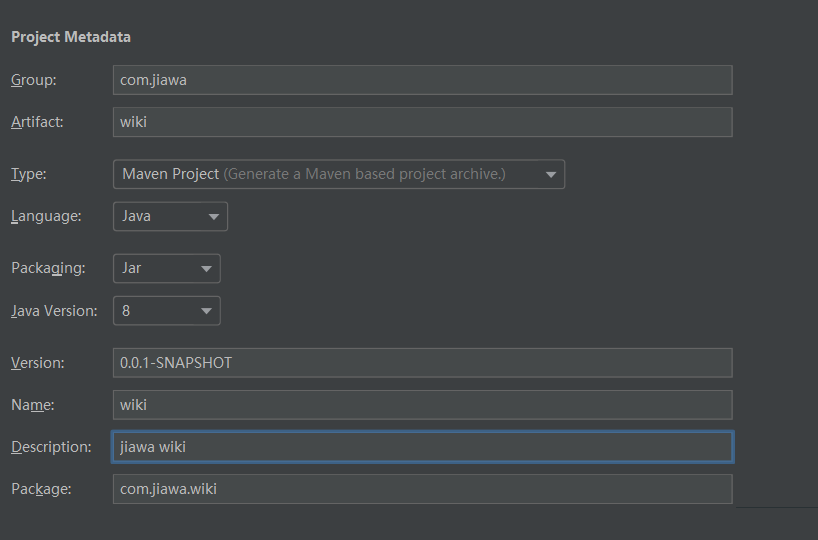
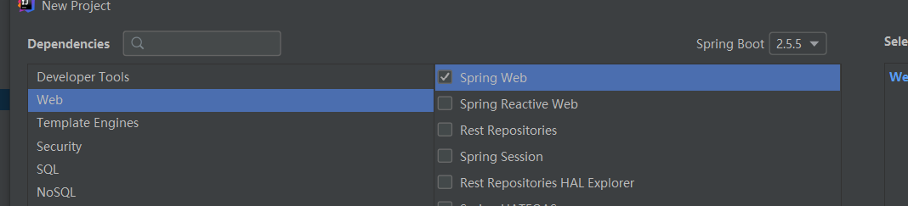
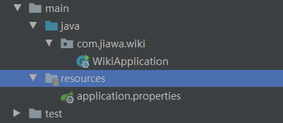
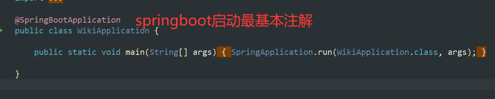
- Spring Boot不需要配置容器,是因为使用了嵌入式容器,默认使用 tomcat启动,就认端口8080。当然,用传统的方式,打成wa包,放入单独的 tomcat是可以的。
- pringboot项目使用main函数启动,一般放在 Xxxapplication类里,需要加@ Spring Bootapplication注解
- Maven Wrapper可以不需要提前下载好 Maven,由它去下载 Maven

### 项目初始配置
#### 编码配置
**统一utf-8**
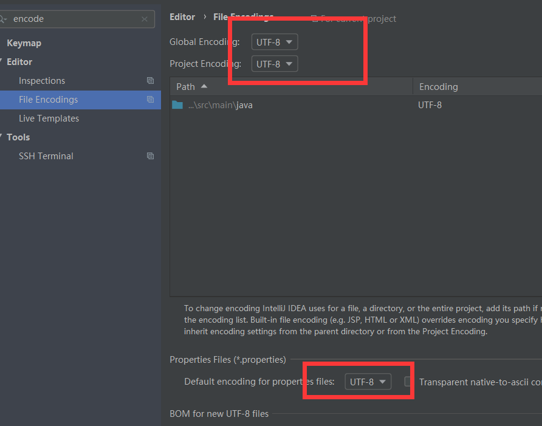
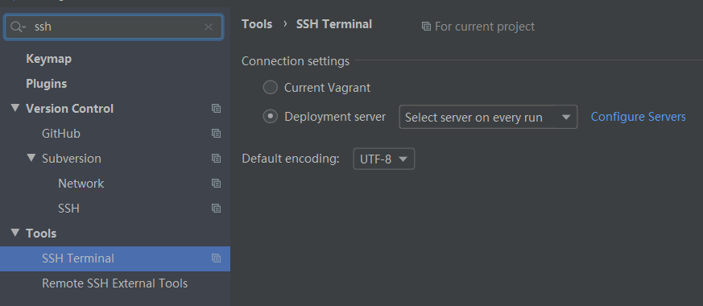
#### JDK配置
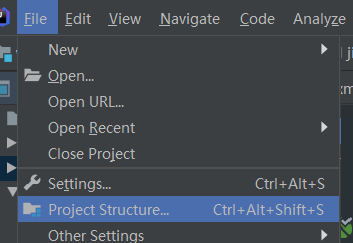
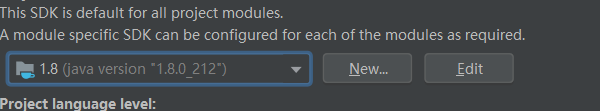
#### Maven配置
maven配置 一般自带的就行
#### Git配置
**vcs里面启动git**

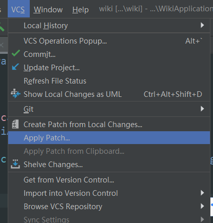

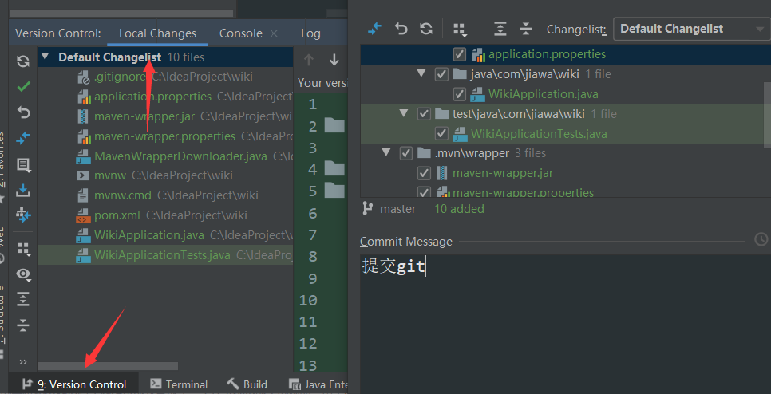
##### 关联远程仓库
**配置mac sshkey**
```bash
# 1 检查ssh key 是否存在
ls -al ~/.ssh
Lists the files in your .ssh directory, if they exist
# 2 如果key不存，生成key
ssh-keygen -t rsa -C "your_email@example.com"
# 3 将共有key(id_rsa.pub)复制到远程GitHub里，同是可以给你的key起一个名字
```
**github进行ssh链接并且创建仓库执行第二个命令**

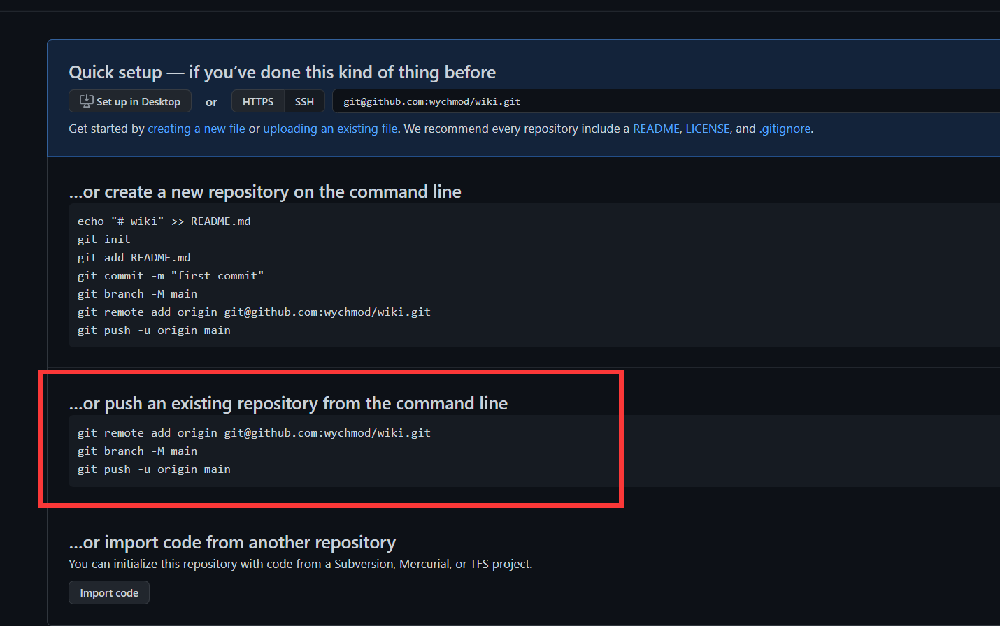
#### 启动日志优化
##### logback日志样式修改
**在resources文件夹下添加logback-spring.xml文件**

```
<?xml version="1.0" encoding="UTF-8"?>
<configuration>
    <!-- 修改一下路径 mac要用.\log反斜杠-->
    <property name="PATH" value="./log"></property>

    <appender name="STDOUT" class="ch.qos.logback.core.ConsoleAppender">
        <encoder>
<!--            <Pattern>%d{yyyy-MM-dd HH:mm:ss.SSS} %highlight(%-5level) %blue(%-50logger{50}:%-4line) %thread %green(%-18X{LOG_ID}) %msg%n</Pattern>-->
            <Pattern>%d{ss.SSS} %highlight(%-5level) %blue(%-30logger{30}:%-4line) %thread %green(%-18X{LOG_ID}) %msg%n</Pattern>
        </encoder>
    </appender>

    <appender name="TRACE_FILE" class="ch.qos.logback.core.rolling.RollingFileAppender">
        <file>${PATH}/trace.log</file>
        <rollingPolicy class="ch.qos.logback.core.rolling.TimeBasedRollingPolicy">
            <FileNamePattern>${PATH}/trace.%d{yyyy-MM-dd}.%i.log</FileNamePattern>
            <timeBasedFileNamingAndTriggeringPolicy class="ch.qos.logback.core.rolling.SizeAndTimeBasedFNATP">
                <maxFileSize>10MB</maxFileSize>
            </timeBasedFileNamingAndTriggeringPolicy>
        </rollingPolicy>
        <layout>
            <pattern>%d{yyyy-MM-dd HH:mm:ss.SSS} %-5level %-50logger{50}:%-4line %green(%-18X{LOG_ID}) %msg%n</pattern>
        </layout>
    </appender>

    <appender name="ERROR_FILE" class="ch.qos.logback.core.rolling.RollingFileAppender">
        <file>${PATH}/error.log</file>
        <rollingPolicy class="ch.qos.logback.core.rolling.TimeBasedRollingPolicy">
            <FileNamePattern>${PATH}/error.%d{yyyy-MM-dd}.%i.log</FileNamePattern>
            <timeBasedFileNamingAndTriggeringPolicy class="ch.qos.logback.core.rolling.SizeAndTimeBasedFNATP">
                <maxFileSize>10MB</maxFileSize>
            </timeBasedFileNamingAndTriggeringPolicy>
        </rollingPolicy>
        <layout>
            <pattern>%d{yyyy-MM-dd HH:mm:ss.SSS} %-5level %-50logger{50}:%-4line %green(%-18X{LOG_ID}) %msg%n</pattern>
        </layout>
        <filter class="ch.qos.logback.classic.filter.LevelFilter">
            <level>ERROR</level>
            <onMatch>ACCEPT</onMatch>
            <onMismatch>DENY</onMismatch>
        </filter>
    </appender>

    <root level="ERROR">
        <appender-ref ref="ERROR_FILE" />
    </root>

    <root level="TRACE">
        <appender-ref ref="TRACE_FILE" />
    </root>

    <root level="INFO">
        <appender-ref ref="STDOUT" />
    </root>
</configuration>

```
> 记得在gitignore里面忽略.log文件夹
##### 增加启动成功日志
```java
package com.jiawa.wiki;

import org.slf4j.Logger;
import org.slf4j.LoggerFactory;
import org.springframework.boot.SpringApplication;
import org.springframework.boot.autoconfigure.SpringBootApplication;
import org.springframework.core.env.Environment;


@SpringBootApplication
public class WikiApplication {

    private static final Logger LOG = LoggerFactory.getLogger(WikiApplication.class);

    public static void main(String[] args) {

        SpringApplication app = new SpringApplication(WikiApplication.class);
        Environment env = app.run(args).getEnvironment();
        LOG.info("启动成功！！");
        LOG.info("地址: \thttp://127.0.0.1:{}", env.getProperty("server.port"));
    }

}

```
```java
# application.properties文件
server.port=8080
```
##### 修改启动图案
http://patorjk.com/software/taag/#p=display&f=3D-ASCII&t=tots-and%0A
**在resources文件夹下添加banner.txt文件**

#### 开发Hello World接口
**首先项目分层**

```java
package com.jiawa.wiki.controller;

import org.springframework.web.bind.annotation.RequestMapping;
import org.springframework.web.bind.annotation.RestController;

@RestController //返回字符串
//@Controller 返回页面
//@RequestMapping("/demo") //访问公共前缀
public class TestController {

    @RequestMapping("/hello")
    public String hello() {
        return "Hello World";
    }
}

```
##### @ResponseBody注解
**返回json数据或字符串，在RestController内部**

##### restful风格接口
**@RequestMapping("/hello") 支持增删改查，其他的就是把request换成get post put delete**
@RequestMapping(value = "/hello", method = RequestMethod.GET)
@GetMapping...


##### 重构application位置

**在application文件加入这个注解@ComponentScan("com.jiawa")**
```java
//@ComponentScan({"com.wychmod", "com.test"})
@ComponentScan("com.wychmod")
```

> 这个注解默认是扫描当前目录下，这个注解也默认在启动项@SpringBootApplication之中 

#### 使用HTTP Client测试接口（Ide自带）
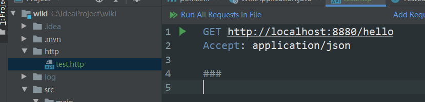
```java
GET http://localhost:8080/hello
#Accept: application/json

> 

###
POST http://localhost:8080/hello/post
Content-Type: application/x-www-form-urlencoded

name=TEST

###

GET http://localhost:8080/hello
Accept: application/json

###

```
#### IDE配置删除不引用代码


#### 配置文件介绍
##### 默认支持的配置文件
**https://toyaml.com/index.html**yaml和properties相互转换
Springboot会自动识别下面这组配置文件application.properties/yml config/application.properties/yml

如果是 Springcloud,还会自动识别下面这组配置文件:
bootstrap.properties/yml
config/bootstrap properties/yml
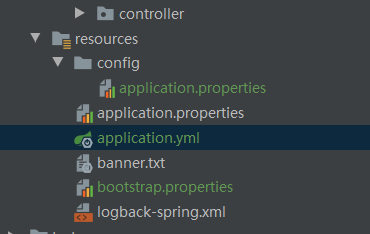

> bootstrap一般用于动态配置,线上可以实时修改实时生效的配置,一般可配合上 nacos使用

##### 自定义配置项
```
application.properties
server.port=8880

test.hello=Hello

.java
@Value("${test.hello:TEST}")
private String testHello;
```
> ${test.hello:TEST} 冒号后面是默认配置值

#### 集成热部署
```
        <dependency>
            <groupId>org.springframework.boot</groupId>
            <artifactId>spring-boot-devtools</artifactId>
        </dependency>

```
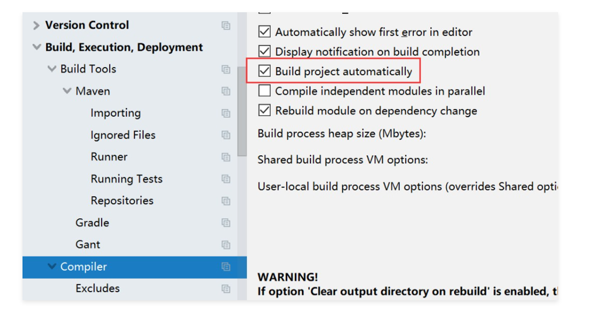


### 后端架构完善与接口开发
#### IDEA数据库插件配置
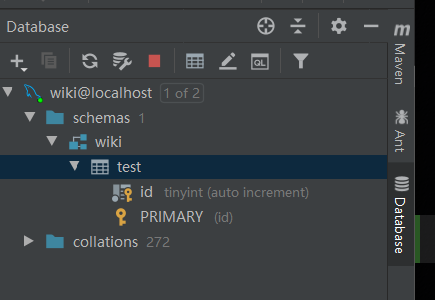
#### Mybatis
pom.xml
```
<!-- 集成mybatis-->
        <dependency>
            <groupId>org.mybatis.spring.boot</groupId>
            <artifactId>mybatis-spring-boot-starter</artifactId>
            <version>2.1.3</version>
        </dependency>
        <!-- 集成mysql连接 -->
        <dependency>
            <groupId>mysql</groupId>
            <artifactId>mysql-connector-java</artifactId>
            <version>8.0.22</version>
        </dependency>
```
配置文件
```
# 增加数据库连接
spring.datasource.url=jdbc:mysql://localhost:3306/wiki?characterEncoding=UTF8&autoReconnect=true&serverTimezone=Asia/Shanghai&allowMultiQueries=true
spring.datasource.username=wiki
spring.datasource.password=penghan123
spring.datasource.driver-class-name=com.mysql.cj.jdbc.Driver

# 配置mybatis所有Mapper.xml所在的路径
mybatis.mapper-locations=classpath:/mapper/**/*.xml
```

#### 持久层Mapper层
**也是广为人知的Dao层，也就是持久层。因为后续要用官方代码生成器，代码是xxxMapper**

#### 第一个数据库查询开发
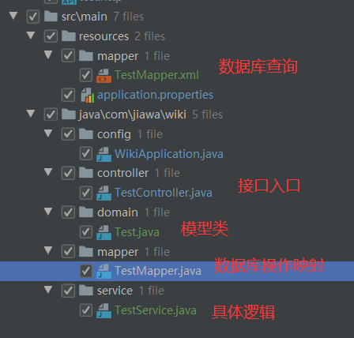
```java
TestMapper.xml
<?xml version="1.0" encoding="UTF-8" ?>
<!DOCTYPE mapper PUBLIC "-//mybatis.org//DTD Mapper 3.0//EN" "http://mybatis.org/dtd/mybatis-3-mapper.dtd" >
<mapper namespace="com.jiawa.wiki.mapper.TestMapper" >

    <select id="list" resultType="com.jiawa.wiki.domain.Test">
        select `id` from `test`
    </select>

</mapper>

Test.java
package com.jiawa.wiki.domain;

public class Test {
    private Integer id;

    public Integer getId() {
        return id;
    }

    public void setId(Integer id) {
        this.id = id;
    }
}

TestMapper.java
package com.jiawa.wiki.mapper;

import com.jiawa.wiki.domain.Test;

import java.util.List;

public interface TestMapper {
    public List<Test> list();
}


TestService.java
package com.jiawa.wiki.service;

import com.jiawa.wiki.domain.Test;
import com.jiawa.wiki.mapper.TestMapper;
import org.springframework.stereotype.Service;

import javax.annotation.Resource;
import java.util.List;

@Service
public class TestService {

    @Resource
    private TestMapper testMapper;

    public List<Test> list() {
        return testMapper.list();
    }
}

TestController

    @Resource
    private TestService testService;

    @GetMapping("/test/list")
    public List<Test> list() {
        return testService.list();
    }
    
WikiApplication.java
@MapperScan("com.jiawa.wiki.mapper")
```

#### 集成mybatis官方代码生成器
**mybatis-generator是官方提供的逆向工程工具，以针对数据库表自动生成MyBatis执行所需要的代码，是一个非常人性的自动化工具。**
```xml
pom.xml
<plugin>
    <groupId>org.mybatis.generator</groupId>
    <artifactId>mybatis-generator-maven-plugin</artifactId>
    <version>1.4.0</version>
    <configuration>
        <configurationFile>src/main/resources/generator/generator-config.xml</configurationFile>
        <overwrite>true</overwrite>
        <verbose>true</verbose>
    </configuration>
    <dependencies>
        <dependency>
            <groupId>mysql</groupId>
            <artifactId>mysql-connector-java</artifactId>
            <version>8.0.22</version>
        </dependency>
    </dependencies>
</plugin>

/resources/generator/generator-config.xml

<?xml version="1.0" encoding="UTF-8"?>
<!DOCTYPE generatorConfiguration
        PUBLIC "-//mybatis.org//DTD MyBatis Generator Configuration 1.0//EN"
        "http://mybatis.org/dtd/mybatis-generator-config_1_0.dtd">

<generatorConfiguration>
    <context id="Mysql" targetRuntime="MyBatis3" defaultModelType="flat">

        <!-- 自动检查关键字，为关键字增加反引号 -->
        <property name="autoDelimitKeywords" value="true"/>
        <property name="beginningDelimiter" value="`"/>
        <property name="endingDelimiter" value="`"/>

        <!--覆盖生成XML文件-->
        <plugin type="org.mybatis.generator.plugins.UnmergeableXmlMappersPlugin" />
        <!-- 生成的实体类添加toString()方法 -->
        <plugin type="org.mybatis.generator.plugins.ToStringPlugin"/>

        <!-- 不生成注释 -->
        <commentGenerator>
            <property name="suppressAllComments" value="true"/>
        </commentGenerator>

        <jdbcConnection driverClass="com.mysql.cj.jdbc.Driver"
                        connectionURL="jdbc:mysql://localhost:3306/wiki?serverTimezone=Asia/Shanghai"
                        userId="wiki"
                        password="penghan123">
        </jdbcConnection>

        <!-- domain类的位置 -->
        <javaModelGenerator targetProject="src\main\java"
                            targetPackage="com.jiawa.wiki.domain"/>

        <!-- mapper xml的位置 -->
        <sqlMapGenerator targetProject="src\main\resources"
                         targetPackage="mapper"/>

        <!-- mapper类的位置 -->
        <javaClientGenerator targetProject="src\main\java"
                             targetPackage="com.jiawa.wiki.mapper"
                             type="XMLMAPPER"/>

        <!--<table tableName="demo" domainObjectName="Demo"/>-->
        <!--<table tableName="ebook"/>-->
        <!--<table tableName="category"/>-->
        <!--<table tableName="doc"/>-->
        <!--<table tableName="content"/>-->
        <!--<table tableName="user"/>-->
        <table tableName="ebook_snapshot"/>
    </context>
</generatorConfiguration>


```
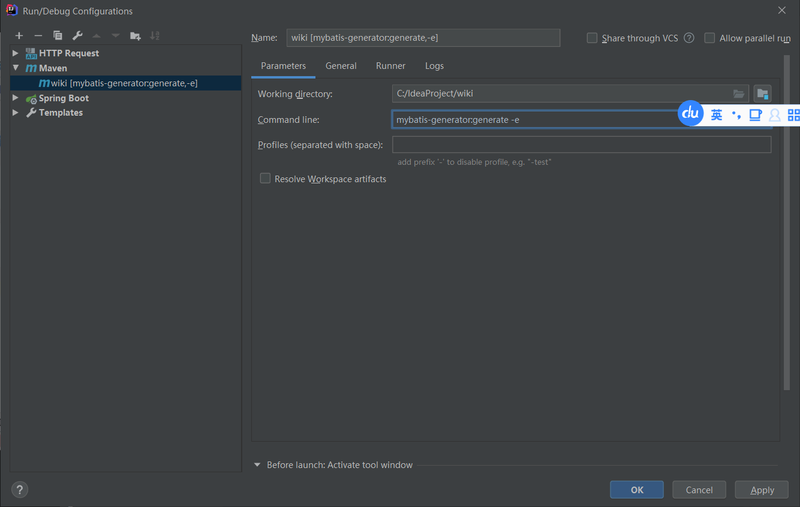

#### 代码生成器如何使用
```java
package com.jiawa.wiki.service;

import com.jiawa.wiki.domain.Demo;
import com.jiawa.wiki.mapper.DemoMapper;
import org.springframework.stereotype.Service;

import javax.annotation.Resource;
import java.util.List;

@Service
public class DemoService {

    @Resource
    private DemoMapper demoMapper;

    public List<Demo> list() {
        return demoMapper.selectByExample(null);
    }
}


@RestController
@RequestMapping("/demo")
public class DemoController {


    @Resource
    private DemoService demoService;


    @GetMapping("/list")
    public List<Demo> list() {
        return demoService.list();
    }
}

```

#### 公共返回类
```java
package com.jiawa.wiki.resp;

public class CommonResp<T> {

    /**
     * 业务上的成功或失败
     */
    private boolean success = true;

    /**
     * 返回信息
     */
    private String message;

    /**
     * 返回泛型数据，自定义类型
     */
    private T content;

    public boolean getSuccess() {
        return success;
    }

    public void setSuccess(boolean success) {
        this.success = success;
    }

    public String getMessage() {
        return message;
    }

    public void setMessage(String message) {
        this.message = message;
    }

    public T getContent() {
        return content;
    }

    public void setContent(T content) {
        this.content = content;
    }

    @Override
    public String toString() {
        final StringBuffer sb = new StringBuffer("ResponseDto{");
        sb.append("success=").append(success);
        sb.append(", message='").append(message).append('\'');
        sb.append(", content=").append(content);
        sb.append('}');
        return sb.toString();
    }
}
```
controller类
```java
package com.jiawa.wiki.controller;

import com.jiawa.wiki.req.EbookQueryReq;
import com.jiawa.wiki.req.EbookSaveReq;
import com.jiawa.wiki.resp.CommonResp;
import com.jiawa.wiki.resp.EbookQueryResp;
import com.jiawa.wiki.resp.PageResp;
import com.jiawa.wiki.service.EbookService;
import org.springframework.web.bind.annotation.*;

import javax.annotation.Resource;
import javax.validation.Valid;

@RestController
@RequestMapping("/ebook")
public class EbookController {

    @Resource
    private EbookService ebookService;

    @GetMapping("/list")
    public CommonResp list(@Valid EbookQueryReq req) {
        CommonResp<PageResp<EbookQueryResp>> resp = new CommonResp<>();
        PageResp<EbookQueryResp> list = ebookService.list(req);
        resp.setContent(list);
        return resp;
    }

    @PostMapping("/save")
    public CommonResp save(@Valid @RequestBody EbookSaveReq req) {
        CommonResp resp = new CommonResp<>();
        ebookService.save(req);
        return resp;
    }

    @DeleteMapping("/delete/{id}")
    public CommonResp delete(@PathVariable Long id) {
        CommonResp resp = new CommonResp<>();
        ebookService.delete(id);
        return resp;
    }
}

```

#### 封装请求参数和返回参数
##### get参数请求
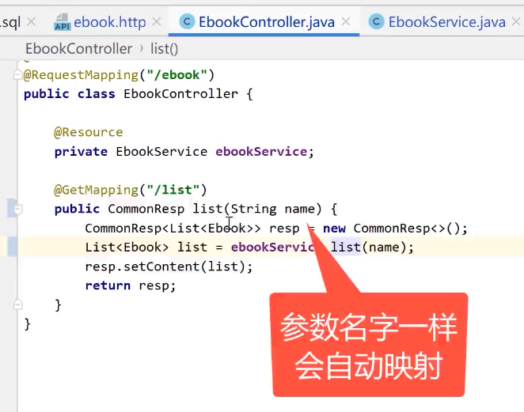
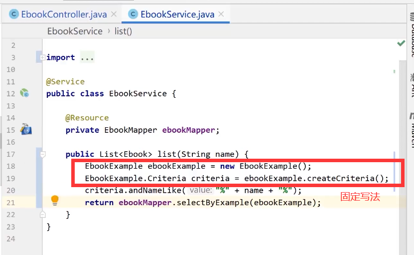

##### 封装请求参数
**req是封装的接受请求参数，resp是封装返回的数据格式**

> req和resp里面都是domain层里面的模型复制来的，req可以自动把输入的参数映射到类中。

**controller类**
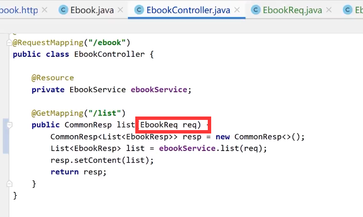

**service层：**


> 因为每次返回的值并不是整个模型全部的属性，所以要在resp里面建立一个返回类。返回想要返回的属性。

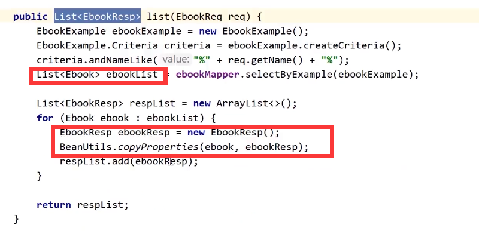
> BeanUtils.copyProperties是将一个类复制给另一个类

#### 制作CopyUtil封装BeanUtils
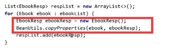

**因为list对象的复制要写一个循环，所以进行封装。**


```java
package com.jiawa.wiki.util;

import org.springframework.beans.BeanUtils;
import org.springframework.util.CollectionUtils;

import java.util.ArrayList;
import java.util.List;

public class CopyUtil {

    /**
     * 单体复制
     */
    public static <T> T copy(Object source, Class<T> clazz) {
        if (source == null) {
            return null;
        }
        T obj = null;
        try {
            obj = clazz.newInstance();
        } catch (Exception e) {
            e.printStackTrace();
            return null;
        }
        BeanUtils.copyProperties(source, obj);
        return obj;
    }

    /**
     * 列表复制
     */
    public static <T> List<T> copyList(List source, Class<T> clazz) {
        List<T> target = new ArrayList<>();
        if (!CollectionUtils.isEmpty(source)){
            for (Object c: source) {
                T obj = copy(c, clazz);
                target.add(obj);
            }
        }
        return target;
    }
}

```
**演示效果**
```java
        // List<EbookResp> respList = new ArrayList<>();
        // for (Ebook ebook : ebookList) {
        //     // EbookResp ebookResp = new EbookResp();
        //     // BeanUtils.copyProperties(ebook, ebookResp);
        //     // 对象复制
        //     EbookResp ebookResp = CopyUtil.copy(ebook, EbookResp.class);
        //
        //     respList.add(ebookResp);
        // }

        // 列表复制
        List<EbookQueryResp> list = CopyUtil.copyList(ebookList, EbookQueryResp.class);

```

## 解决跨域问题
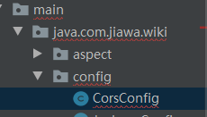
```java
import org.springframework.context.annotation.Configuration;
import org.springframework.web.cors.CorsConfiguration;
import org.springframework.web.servlet.config.annotation.CorsRegistry;
import org.springframework.web.servlet.config.annotation.WebMvcConfigurer;

@Configuration
public class CorsConfig implements WebMvcConfigurer {

    @Override
    public void addCorsMappings(CorsRegistry registry) {
        registry.addMapping("/**")
                .allowedOriginPatterns("*")
                .allowedHeaders(CorsConfiguration.ALL)
                .allowedMethods(CorsConfiguration.ALL)
                .allowCredentials(true)
                .maxAge(3600); // 1小时内不需要再预检（发OPTIONS请求）
    }

}

```

## sprintBoot过滤器
**打印接口耗时** package
com.jiawa.wiki.filter;
- 过滤器是servlet里面的一个概念,servlet又是容器的概念,过滤器给容器用的
```java

 package com.wychmod.wiki.filter;
import org.slf4j.Logger;
import org.slf4j.LoggerFactory;
import org.springframework.stereotype.Component;

// 过滤器是servlet里面的一个概念,servlet又是容器的概念,过滤器给容器用的
import javax.servlet.*;
import javax.servlet.http.HttpServletRequest;
import java.io.IOException;

@Component
public class LogFilter implements Filter {

    private static final Logger LOG = LoggerFactory.getLogger(LogFilter.class);

    @Override
    public void init(FilterConfig filterConfig) throws ServletException {

    }

    @Override
    public void doFilter(ServletRequest servletRequest, ServletResponse servletResponse, FilterChain filterChain) throws IOException, ServletException {
        // 打印请求信息
        HttpServletRequest request = (HttpServletRequest) servletRequest;
        LOG.info("------------- LogFilter 开始 -------------");
        LOG.info("请求地址: {} {}", request.getRequestURL().toString(), request.getMethod());
        LOG.info("远程地址: {}", request.getRemoteAddr());

        long startTime = System.currentTimeMillis();
        // 过滤器链条，如果有其他的会继续执行其他的
        filterChain.doFilter(servletRequest, servletResponse);
        LOG.info("------------- LogFilter 结束 耗时：{} ms -------------", System.currentTimeMillis() - startTime);
    }
}

```

## sprintBoot拦截器
**跟过滤器的区别是拦截器分成了前后两个方法,同时过滤器比拦截器作用范围大，过滤器是作用在tomcat容器上**
 package com.jiawa.wiki.interceptor;
### 打印日志
```java

 package com.wychmod.wiki.interceptor;


import org.slf4j.Logger;
import org.slf4j.LoggerFactory;
import org.springframework.stereotype.Component;
import org.springframework.web.servlet.HandlerInterceptor;
import org.springframework.web.servlet.ModelAndView;

import javax.servlet.http.HttpServletRequest;
import javax.servlet.http.HttpServletResponse;

/**
 * 拦截器：Spring框架特有的，常用于登录校验，权限校验，请求日志打印 /login
 */
@Component
public class LogInterceptor implements HandlerInterceptor {

    private static final Logger LOG = LoggerFactory.getLogger(LogInterceptor.class);

    @Override
    public boolean preHandle(HttpServletRequest request, HttpServletResponse response, Object handler) throws Exception {
        // 打印请求信息
        LOG.info("------------- LogInterceptor 开始 -------------");
        LOG.info("请求地址: {} {}", request.getRequestURL().toString(), request.getMethod());
        LOG.info("远程地址: {}", request.getRemoteAddr());

        long startTime = System.currentTimeMillis();
        request.setAttribute("requestStartTime", startTime);
        // 返回False过滤器直接结束了
        return true;
    }

    @Override
    public void postHandle(HttpServletRequest request, HttpServletResponse response, Object handler, ModelAndView modelAndView) throws Exception {
        long startTime = (Long) request.getAttribute("requestStartTime");
        LOG.info("------------- LogInterceptor 结束 耗时：{} ms -------------", System.currentTimeMillis() - startTime);
    }
}
```

**需要进行全局配置**package com.jiawa.wiki.config;
```java
package com.wychmod.wiki.config;

import com.wychmod.wiki.interceptor.LogInterceptor;
import org.springframework.context.annotation.Configuration;
import org.springframework.web.servlet.config.annotation.InterceptorRegistry;
import org.springframework.web.servlet.config.annotation.WebMvcConfigurer;

import javax.annotation.Resource;

@Configuration
public class SpringMvcConfig implements WebMvcConfigurer {

    @Resource
    LogInterceptor logInterceptor;

    @Override
    public void addInterceptors(InterceptorRegistry registry) {
        registry.addInterceptor(logInterceptor)
                .addPathPatterns("/**");

    }
}

```
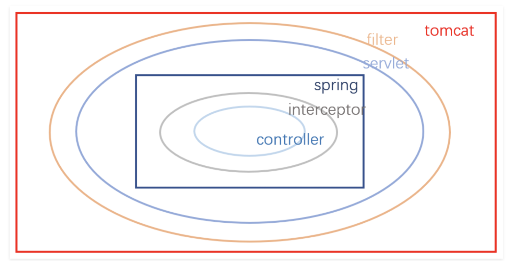
## SpringbootAOP的使用
**配置AOP，打印接口耗时、请求参数、返回参数,和拦截器过滤器差不多，但是最后执行**
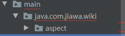
### 增加新的依赖
```xml
        <dependency>
            <groupId>org.springframework.boot</groupId>
            <artifactId>spring-boot-starter-websocket</artifactId>
        </dependency>

        <dependency>
            <groupId>com.alibaba</groupId>
            <artifactId>fastjson</artifactId>
            <version>1.2.70</version>
        </dependency>

```
### 打印接口耗时
```java
package com.wychmod.wiki.aspect;

import com.alibaba.fastjson.JSONObject;
import com.alibaba.fastjson.support.spring.PropertyPreFilters;
import org.aspectj.lang.JoinPoint;
import org.aspectj.lang.ProceedingJoinPoint;
import org.aspectj.lang.Signature;
import org.aspectj.lang.annotation.Around;
import org.aspectj.lang.annotation.Aspect;
import org.aspectj.lang.annotation.Before;
import org.aspectj.lang.annotation.Pointcut;
import org.slf4j.Logger;
import org.slf4j.LoggerFactory;
import org.springframework.stereotype.Component;
import org.springframework.web.context.request.RequestContextHolder;
import org.springframework.web.context.request.ServletRequestAttributes;
import org.springframework.web.multipart.MultipartFile;

import javax.servlet.ServletRequest;
import javax.servlet.ServletResponse;
import javax.servlet.http.HttpServletRequest;

@Aspect
@Component
public class LogAspect {

    private final static Logger LOG = LoggerFactory.getLogger(LogAspect.class);

    /** 定义一个切点
     *       com.jiawa.* 表示jiawa下面所有的包
     *    *.controller 表示所有的controller
     *   .*Controller 监控所有的controller
     *       *(..)    *代表所有的方法， (..)代表所有的参数
     *       综上，就是所有controller的所有方法，所有参数
     * */
    @Pointcut("execution(public * com.wychmod.*.controller..*Controller.*(..))")
    public void controllerPointcut() {}

    /**
     * @Before 前置通知，在执行业务代码之前要做的事情，都放在前置通知里面
     * * @param joinPoint
     * @throws Throwable
     */
    @Before("controllerPointcut()")
    public void doBefore(JoinPoint joinPoint) throws Throwable {
        MDC.put("LOG_ID", String.valueOf(snowFlake.nextId()));

        // 开始打印请求日志
        ServletRequestAttributes attributes = (ServletRequestAttributes) RequestContextHolder.getRequestAttributes();
        HttpServletRequest request = attributes.getRequest();
        Signature signature = joinPoint.getSignature();
        String name = signature.getName();

        // 打印请求信息
        LOG.info("------------- 开始 -------------");
        LOG.info("请求地址: {} {}", request.getRequestURL().toString(), request.getMethod());
        LOG.info("类名方法: {}.{}", signature.getDeclaringTypeName(), name);
        LOG.info("远程地址: {}", request.getRemoteAddr());


        // 打印请求参数
        Object[] args = joinPoint.getArgs();
        // LOG.info("请求参数: {}", JSONObject.toJSONString(args));

        Object[] arguments  = new Object[args.length];
        for (int i = 0; i < args.length; i++) {
            if (args[i] instanceof ServletRequest
                    || args[i] instanceof ServletResponse
                    || args[i] instanceof MultipartFile) {
                continue;
            }
            arguments[i] = args[i];
        }
        // 排除字段，敏感字段或太长的字段不显示
        String[] excludeProperties = {"password", "file"};
        PropertyPreFilters filters = new PropertyPreFilters();
        PropertyPreFilters.MySimplePropertyPreFilter excludefilter = filters.addFilter();
        excludefilter.addExcludes(excludeProperties);
        LOG.info("请求参数: {}", JSONObject.toJSONString(arguments, excludefilter));
    }

    /**
     * @Before 环绕，在执行业务代码之前和之后要做的事情
     * * @param ProceedingJoinPoint
     * @throws Throwable
     */
    @Around("controllerPointcut()")
    public Object doAround(ProceedingJoinPoint proceedingJoinPoint) throws Throwable {
        long startTime = System.currentTimeMillis();
        // 执行具体的业务
        Object result = proceedingJoinPoint.proceed();
        // 排除字段，敏感字段或太长的字段不显示
        String[] excludeProperties = {"password", "file"};
        PropertyPreFilters filters = new PropertyPreFilters();
        PropertyPreFilters.MySimplePropertyPreFilter excludefilter = filters.addFilter();
        excludefilter.addExcludes(excludeProperties);
        LOG.info("返回结果: {}", JSONObject.toJSONString(result, excludefilter));
        LOG.info("------------- 结束 耗时：{} ms -------------", System.currentTimeMillis() - startTime);
        return result;
    }

}
```

## 使用PageHelper实现后端分页
**Pagehelper原理: Mybatis拦截器,拦截到SQL后,增加limit关键字**
- 是物理分页
### 添加依赖
```xml
<dependency>
    <groupId>com.github.pagehelper
    </groupId>
    <artifactId>pagehelper-spring-boot-starter</artifactId>
    <version>1.2.13</version>
</dependency>
```
### 使用方法
**一条pagehelper只对遇见的第一个查询有效**
```java
@Service
public class EbookService {
    @Resource
    private EbookMapper ebookMapper;

    public List<EbookResp> list(EbookReq req) {
        EbookExample ebookExample = new EbookExample();
        EbookExample.Criteria criteria = ebookExample.createCriteria();
        if (!ObjectUtils.isEmpty(req.getName())){
            criteria.andNameLike("%"+req.getName()+"%");
        }
        // 分页 pagenum查第几页 pagesize查几条 一条pagehelper只对遇见的第一个查询有效
        PageHelper.startPage(1,3);
        List<Ebook> ebooklist = ebookMapper.selectByExample(ebookExample);

        List<EbookResp> list = CopyUtil.copyList(ebooklist, EbookResp.class);
        return list;
    }
}
```

### PageReq接收参数类
**接收参数类，之后可以被其他类集成，这样其他的接收参数类也能接收分页的页数和数量**
```java
package com.wychmod.wiki.req;

public class PageReq {
    private int page;

    private int size;

    public int getPage() {
        return page;
    }

    public void setPage(int page) {
        this.page = page;
    }

    public int getSize() {
        return size;
    }

    public void setSize(int size) {
        this.size = size;
    }

    @Override
    public String toString() {
        return "PageReq{" +
                "page=" + page +
                ", size=" + size +
                '}';
    }
}

```
```java
// 这个是ebook查询接口
public class EbookReq extends PageReq

// 这个是service里面的查询逻辑
PageHelper.startPage(req.getPage(), req.getSize());
```

### PageResp返回数据类
**PageResp类制作好了将原本返回的list<xxx>改成PageResp<xxx>**
```java
package com.wychmod.wiki.resp;

import java.util.List;

public class PageResp<T> {
    private long total;

    private List<T> list;

    public long getTotal() {
        return total;
    }

    public void setTotal(long total) {
        this.total = total;
    }

    public List<T> getList() {
        return list;
    }

    public void setList(List<T> list) {
        this.list = list;
    }

    @Override
    public String toString() {
        return "PageResp{" +
                "total=" + total +
                ", list=" + list +
                '}';
    }
}

// 具体service业务
PageResp<EbookResp> pageResp = new PageResp();
pageResp.setTotal(pageInfo.getTotal());
pageResp.setList(list);

return pageResp;

```

## 打印sql语句
application.properties
```
# 打印所有sql日志
logging.level.com.wychmod.wiki.mapper=trace
```

## @RequestBody接受json数据
```java
@PostMapping("/save")
public CommonResp save(@RequestBody EbookSaveReq req) {
    CommonResp resp = new CommonResp<>();
    ebookService.save(req);
    return resp;
}
```

## 雪花算法
### 时间戳概念
时间戳从1970年1月1日8点开始
雪花算法就是时间戳+机器吗+递增的序列号

### 雪花算法工具类
```java
package com.wychmod.wiki.util;

import org.springframework.stereotype.Component;

import java.text.ParseException;

/**
 * Twitter的分布式自增ID雪花算法
 **/
@Component
public class SnowFlake {

    /**
     * 起始的时间戳
     */
    private final static long START_STMP = 1609459200000L; // 2021-01-01 00:00:00

    /**
     * 每一部分占用的位数
     */
    private final static long SEQUENCE_BIT = 12; //序列号占用的位数
    private final static long MACHINE_BIT = 5;   //机器标识占用的位数
    private final static long DATACENTER_BIT = 5;//数据中心占用的位数

    /**
     * 每一部分的最大值
     */
    private final static long MAX_DATACENTER_NUM = -1L ^ (-1L << DATACENTER_BIT);
    private final static long MAX_MACHINE_NUM = -1L ^ (-1L << MACHINE_BIT);
    private final static long MAX_SEQUENCE = -1L ^ (-1L << SEQUENCE_BIT);

    /**
     * 每一部分向左的位移
     */
    private final static long MACHINE_LEFT = SEQUENCE_BIT;
    private final static long DATACENTER_LEFT = SEQUENCE_BIT + MACHINE_BIT;
    private final static long TIMESTMP_LEFT = DATACENTER_LEFT + DATACENTER_BIT;

    private long datacenterId = 1;  //数据中心
    private long machineId = 1;     //机器标识
    private long sequence = 0L; //序列号
    private long lastStmp = -1L;//上一次时间戳

    public SnowFlake() {
    }

    public SnowFlake(long datacenterId, long machineId) {
        if (datacenterId > MAX_DATACENTER_NUM || datacenterId < 0) {
            throw new IllegalArgumentException("datacenterId can't be greater than MAX_DATACENTER_NUM or less than 0");
        }
        if (machineId > MAX_MACHINE_NUM || machineId < 0) {
            throw new IllegalArgumentException("machineId can't be greater than MAX_MACHINE_NUM or less than 0");
        }
        this.datacenterId = datacenterId;
        this.machineId = machineId;
    }

    /**
     * 产生下一个ID
     *
     * @return
     */
    public synchronized long nextId() {
        long currStmp = getNewstmp();
        if (currStmp < lastStmp) {
            throw new RuntimeException("Clock moved backwards.  Refusing to generate id");
        }

        if (currStmp == lastStmp) {
            //相同毫秒内，序列号自增
            sequence = (sequence + 1) & MAX_SEQUENCE;
            //同一毫秒的序列数已经达到最大
            if (sequence == 0L) {
                currStmp = getNextMill();
            }
        } else {
            //不同毫秒内，序列号置为0
            sequence = 0L;
        }

        lastStmp = currStmp;

        return (currStmp - START_STMP) << TIMESTMP_LEFT //时间戳部分
                | datacenterId << DATACENTER_LEFT       //数据中心部分
                | machineId << MACHINE_LEFT             //机器标识部分
                | sequence;                             //序列号部分
    }

    private long getNextMill() {
        long mill = getNewstmp();
        while (mill <= lastStmp) {
            mill = getNewstmp();
        }
        return mill;
    }

    private long getNewstmp() {
        return System.currentTimeMillis();
    }

    public static void main(String[] args) throws ParseException {
        // 时间戳
        // System.out.println(System.currentTimeMillis());
        // System.out.println(new Date().getTime());
        //
        // String dateTime = "2021-01-01 08:00:00";
        // SimpleDateFormat sdf = new SimpleDateFormat("yyyy-MM-dd hh:mm:ss");
        // System.out.println(sdf.parse(dateTime).getTime());

        SnowFlake snowFlake = new SnowFlake(1, 1);

        long start = System.currentTimeMillis();
        for (int i = 0; i < 10; i++) {
            System.out.println(snowFlake.nextId());
            System.out.println(System.currentTimeMillis() - start);
        }
    }
}

```
## 集成 Validation做参数校验
**依赖**
```xml
<dependency>
    <groupId>org.springframework.boot</groupId>
    <artifactId>spring-boot-starter-validation</artifactId>
</dependency>
```
**req类里加注解**
```java
@NotNull(message = "[页码]不能为空")
private int page;

@NotNull(message = "[每页条数]不能为空")
@Max(value = 1000, message = "[每页条数]不能超过1000")
private int size;
```
**接口类接受参数加标记@Valid**
```java
@GetMapping ("/list")
    public CommonResp list(@Valid EbookQueryReq req) {
        CommonResp<PageResp<EbookQueryResp>> resp = new CommonResp<>();
        PageResp<EbookQueryResp> list = ebookService.list(req);
        resp.setContent(list);
        return resp;
    }
```
**统一的接口异常处理**
```java
import com.wychmod.wiki.resp.CommonResp;
import org.slf4j.Logger;
import org.slf4j.LoggerFactory;
import org.springframework.validation.BindException;
import org.springframework.web.bind.annotation.ControllerAdvice;
import org.springframework.web.bind.annotation.ExceptionHandler;
import org.springframework.web.bind.annotation.ResponseBody;

/**
 * 统一异常处理、数据预处理等
 */
@ControllerAdvice
public class ControllerExceptionHandler {

    private static final Logger LOG = LoggerFactory.getLogger(ControllerExceptionHandler.class);

    /**
     * 校验异常统一处理
     * @param e
     * @return
     */
    @ExceptionHandler(value = BindException.class)
    @ResponseBody
    public CommonResp validExceptionHandler(BindException e) {
        CommonResp commonResp = new CommonResp();
        LOG.warn("参数校验失败：{}", e.getBindingResult().getAllErrors().get(0).getDefaultMessage());
        commonResp.setSuccess(false);
        commonResp.setMessage(e.getBindingResult().getAllErrors().get(0).getDefaultMessage());
        return commonResp;
    }
}

```

## 用户名校验与自定义异常
**创建异常package,里面一个异常类一个异常的枚举类**
```java
package com.wychmod.wiki.exception;

/**
 * 业务异常，自定义的非 bug 异常
 */
public class BusinessException extends RuntimeException{

    private BusinessExceptionCode code;

    public BusinessException (BusinessExceptionCode code) {
        super(code.getDesc());
        this.code = code;
    }

    public BusinessExceptionCode getCode() {
        return code;
    }

    public void setCode(BusinessExceptionCode code) {
        this.code = code;
    }

    /**
     * 不写入堆栈信息，提高性能
     */
    @Override
    public Throwable fillInStackTrace() {
        return this;
    }
}


package com.wychmod.wiki.exception;

/**
 * 枚举业务异常的类型
 */
public enum BusinessExceptionCode {

    USER_LOGIN_NAME_EXIST("登录名已存在"),
    ;

    private String desc;

    BusinessExceptionCode(String desc) {
        this.desc = desc;
    }

    public String getDesc() {
        return desc;
    }

    public void setDesc(String desc) {
        this.desc = desc;
    }
}
```
**在统一异常处理接口里处理**
```java
package com.wychmod.wiki.controller;

import com.wychmod.wiki.exception.BusinessException;
import com.wychmod.wiki.resp.CommonResp;
import org.slf4j.Logger;
import org.slf4j.LoggerFactory;
import org.springframework.validation.BindException;
import org.springframework.web.bind.annotation.ControllerAdvice;
import org.springframework.web.bind.annotation.ExceptionHandler;
import org.springframework.web.bind.annotation.ResponseBody;

/**
 * 统一异常处理、数据预处理等
 */
@ControllerAdvice
public class ControllerExceptionHandler {

    private static final Logger LOG = LoggerFactory.getLogger(ControllerExceptionHandler.class);

    /**
     * 校验异常统一处理
     * @param e
     * @return
     */
    @ExceptionHandler(value = BindException.class)
    @ResponseBody
    public CommonResp validExceptionHandler(BindException e) {
        CommonResp commonResp = new CommonResp();
        LOG.warn("参数校验失败：{}", e.getBindingResult().getAllErrors().get(0).getDefaultMessage());
        commonResp.setSuccess(false);
        commonResp.setMessage(e.getBindingResult().getAllErrors().get(0).getDefaultMessage());
        return commonResp;
    }

    @ExceptionHandler(value = BusinessException.class)
    @ResponseBody
    public CommonResp validExceptionHandler(BusinessException e) {
        CommonResp commonResp = new CommonResp();
        LOG.warn("业务异常：{}", e.getCode().getDesc());
        commonResp.setSuccess(false);
        commonResp.setMessage(e.getCode().getDesc());
        return commonResp;
    }

    @ExceptionHandler(value = Exception.class)
    @ResponseBody
    public CommonResp validExceptionHandler(Exception e) {
        CommonResp commonResp = new CommonResp();
        LOG.error("系统异常：", e);
        commonResp.setSuccess(false);
        commonResp.setMessage("系统出现异常，请联系管理员");
        return commonResp;
    }
}

```
**用户名校验**
```java
public User selectByLoginName(String loginName) {
        UserExample userExample = new UserExample();
        UserExample.Criteria criteria = userExample.createCriteria();
        criteria.andLoginNameEqualTo(loginName);
        List<User> userList = userMapper.selectByExample(userExample);
        if (CollectionUtils.isEmpty(userList)) {
            return null;
        } else {
            return userList.get(0);
        }
    }
    
    public void save(UserSaveReq req) {
        User user = CopyUtil.copy(req, User.class);
        if (ObjectUtils.isEmpty(req.getId())){
            User userDB = selectByLoginName(req.getLoginName());
            if (ObjectUtils.isEmpty(userDB)) {
                // 新增
                user.setId(snowFlake.nextId());
                userMapper.insert(user);
            } else {
                // 用户名已存在
                throw new BusinessException(BusinessExceptionCode.USER_LOGIN_NAME_EXIST);
            }
        } else {
            // 更新
            userMapper.updateByPrimaryKey(user);
        }
    }
```
## 单点登陆token与JWT
### 单点登陆系统
 淘宝、支付宝A B C 项目都是一家的，不需要那么多登陆系统，都从X这个系统去做用户管理、登陆、校验、退出。接口都用x界面可以用x的也可以自己画。
 
 ### 实现token + redis
 ```xml
 <dependency>
    <groupId>org.springframework.boot</groupId>
    <artifactId>spring-boot-starter-data-redis</artifactId>
</dependency>
 ```
 ```java
 @Resource
private RedisTemplate redisTemplate;
@Resource
private SnowFlake snowFlake;

@PostMapping("/login")
    public CommonResp<UserLoginResp> login(@Valid @RequestBody UserLoginReq req) {
        req.setPassword(DigestUtils.md5DigestAsHex(req.getPassword().getBytes()));
        CommonResp<UserLoginResp> resp = new CommonResp<>();
        UserLoginResp userLoginResp = userService.login(req);

        Long token = snowFlake.nextId();
        LOG.info("生成单点登录 token:{}，并放入 redis 中", token);
        userLoginResp.setToken(token.toString());
        redisTemplate.opsForValue().set(token, JSONObject.toJSONString(userLoginResp));

        resp.setContent(userLoginResp);
        return resp;
    }
 ```
 ```properties
 # redis
spring.redis.host=127.0.0.1
spring.redis.port=6379
 ```
 **登陆拦截**
 ```java
 package com.wychmod.wiki.interceptor;

import org.slf4j.Logger;
import org.slf4j.LoggerFactory;
import org.springframework.data.redis.core.RedisTemplate;
import org.springframework.http.HttpStatus;
import org.springframework.stereotype.Component;
import org.springframework.web.servlet.HandlerInterceptor;
import org.springframework.web.servlet.ModelAndView;

import javax.annotation.Resource;
import javax.servlet.http.HttpServletRequest;
import javax.servlet.http.HttpServletResponse;

/**
 * 拦截器：Spring框架特有的，常用于登录校验，权限校验，请求日志打印
 */
@Component
public class LoginInterceptor implements HandlerInterceptor {

    private static final Logger LOG = LoggerFactory.getLogger(LoginInterceptor.class);

    @Resource
    private RedisTemplate redisTemplate;

    @Override
    public boolean preHandle(HttpServletRequest request, HttpServletResponse response, Object handler) throws Exception {
        // 打印请求信息
        LOG.info("------------- LoginInterceptor 开始 -------------");
        long startTime = System.currentTimeMillis();
        request.setAttribute("requestStartTime", startTime);

        // OPTIONS请求不做校验,
        // 前后端分离的架构, 前端会发一个OPTIONS请求先做预检, 对预检请求不做校验
        if(request.getMethod().equalsIgnoreCase("OPTIONS")){
            return true;
        }

        String path = request.getRequestURL().toString();
        LOG.info("接口登录拦截：，path：{}", path);

        //获取header的token参数
        String token = request.getHeader("token");
        LOG.info("登录校验开始，token：{}", token);
        if (token == null || token.isEmpty()) {
            LOG.info( "token为空，请求被拦截" );
            response.setStatus(HttpStatus.UNAUTHORIZED.value());
            return false;
        }
        Object object = redisTemplate.opsForValue().get(token);
        if (object == null) {
            LOG.warn( "token无效，请求被拦截" );
            response.setStatus(HttpStatus.UNAUTHORIZED.value());
            return false;
        } else {
            LOG.info("已登录：{}", object);
            return true;
        }
    }

    @Override
    public void postHandle(HttpServletRequest request, HttpServletResponse response, Object handler, ModelAndView modelAndView) throws Exception {
        long startTime = (Long) request.getAttribute("requestStartTime");
        LOG.info("------------- LoginInterceptor 结束 耗时：{} ms -------------", System.currentTimeMillis() - startTime);
    }

    @Override
    public void afterCompletion(HttpServletRequest request, HttpServletResponse response, Object handler, Exception ex) throws Exception {
//        LOG.info("LogInterceptor 结束");
    }
}

package com.wychmod.wiki.config;

import com.wychmod.wiki.interceptor.LoginInterceptor;
import org.springframework.context.annotation.Configuration;
import org.springframework.web.servlet.config.annotation.InterceptorRegistry;
import org.springframework.web.servlet.config.annotation.WebMvcConfigurer;

import javax.annotation.Resource;

@Configuration
public class SpringMvcConfig implements WebMvcConfigurer {

    @Resource
    LoginInterceptor loginInterceptor;

    @Override
    public void addInterceptors(InterceptorRegistry registry) {
        registry.addInterceptor(loginInterceptor)
                .addPathPatterns("/**")
                .excludePathPatterns(
                        "/test/**",
                        "/redis/**",
                        "/user/login",
                        "/category/all",
                        "/ebook/list",
                        "/doc/all/**",
                        "/doc/find-content/**"
                );
    }
}
 ```
## 本地线程变量
**可以在一开始的切点中获得变量，从在当前线程中，比如ip， 然后在后面的接口中进行处理。**
```java
import java.io.Serializable;

public class RequestContext implements Serializable {

    private static ThreadLocal<String> remoteAddr = new ThreadLocal<>();

    public static String getRemoteAddr() {
        return remoteAddr.get();
    }

    public static void setRemoteAddr(String remoteAddr) {
        RequestContext.remoteAddr.set(remoteAddr);
    }
}
```

## 定时任务
**复杂的任务可以使用quartz**
### 普通定时任务事例
```java
# 启动类上添加
@EnableScheduling
public class MywikiApplication {
```
```java
import org.slf4j.Logger;
import org.slf4j.LoggerFactory;
import org.springframework.scheduling.annotation.Scheduled;
import org.springframework.stereotype.Component;

import java.text.SimpleDateFormat;
import java.util.Date;

@Component
public class TestJob {

   private static final Logger LOG = LoggerFactory.getLogger(TestJob.class);

   /**
    * 固定时间间隔，fixedRate单位毫秒
    */
   @Scheduled(fixedRate = 1000)
   public void simple() throws InterruptedException {
       SimpleDateFormat formatter = new SimpleDateFormat("mm:ss");
       String dateString = formatter.format(new Date());
       Thread.sleep(2000);
       LOG.info("每隔5秒钟执行一次： {}", dateString);
   }

   /**
    * 自定义cron表达式跑批
    * 只有等上一次执行完成，下一次才会在下一个时间点执行，错过就错过
    */
   @Scheduled(cron = "*/1 * * * * ?")
   public void cron() throws InterruptedException {
       SimpleDateFormat formatter = new SimpleDateFormat("mm:ss SSS");
       String dateString = formatter.format(new Date());
       Thread.sleep(1500);
       LOG.info("每隔1秒钟执行一次： {}", dateString);
   }

}
```

## websocket
```xml
<dependency>
    <groupId>org.springframework.boot</groupId>
    <artifactId>spring-boot-starter-websocket</artifactId>
</dependency>
```
```java
package com.wychmod.wiki.config;

import org.springframework.context.annotation.Bean;
import org.springframework.context.annotation.Configuration;
import org.springframework.web.socket.server.standard.ServerEndpointExporter;

@Configuration
public class WebSocketConfig {

    @Bean
    public ServerEndpointExporter serverEndpointExporter() {
        return new ServerEndpointExporter();
    }

}

package com.wychmod.wiki.websocket;

import org.slf4j.Logger;
import org.slf4j.LoggerFactory;
import org.springframework.stereotype.Component;

import javax.websocket.*;
import javax.websocket.server.PathParam;
import javax.websocket.server.ServerEndpoint;
import java.io.IOException;
import java.util.HashMap;

@Component
@ServerEndpoint("/ws/{token}")
public class WebSocketServer {
    private static final Logger LOG = LoggerFactory.getLogger(WebSocketServer.class);
    private static HashMap<String, Session> map = new HashMap<>();
    /**
     * 每个客户端一个token
     */
    private String token = "";

    /**
     * 连接成功
     */
    @OnOpen
    public void onOpen(Session session, @PathParam("token") String token) {
        map.put(token, session);
        this.token = token;
        LOG.info("有新连接：token：{}，session id：{}，当前连接数：{}", token, session.getId(), map.size());
    }

    /**
     * 连接关闭
     */
    @OnClose
    public void onClose(Session session) {
        map.remove(this.token);
        LOG.info("连接关闭，token：{}，session id：{}！当前连接数：{}", this.token, session.getId(), map.size());
    }

    /**
     * 收到消息
     */
    @OnMessage
    public void onMessage(String message, Session session) {
        LOG.info("收到消息：{}，内容：{}", token, message);
    }

    /**
     * 连接错误
     */
    @OnError
    public void onError(Session session, Throwable error) {
        LOG.error("发生错误", error);
    }

    /**
     * 群发消息
     */
    public void sendInfo(String message) {
        for (String token : map.keySet()) {
            Session session = map.get(token);
            try {
                session.getBasicRemote().sendText(message);
            } catch (IOException e) {
                LOG.error("推送消息失败：{}，内容：{}", token, message);
            }
            LOG.info("推送消息：{}，内容：{}", token, message);
        }
    }

}
```

## springboot 异步化使用
- 会开启一个新的线程，如果线程越来越多，就会变成同步。所以尽量使用MQ消息队列
**开启注解**
```java
@EnableAsync
public class MywikiApplication {
```
**在需要异步的方法上标上注解, 该方法和调用该方法的地方不能在同一个类中**
```java
@Async
public void sendInfo(String message) {
    webSocketServe.sendInfo(message);
}
```

## 事务注解
**当一个service里面要对两个表进行更新时要求用事务,也是不能被同个类中的调用，会不起效果**
```java
@Transactional
    public void save(DocSaveReq req) {
        Doc doc = CopyUtil.copy(req, Doc.class);
        Content content = CopyUtil.copy(req, Content.class);
```

## rocketmq
根据本地jdk高低选择下载哪个版本的rocketmq
http://archive.apache.org/dist/rocketmq/
```cmd
nohup sh /Users/ahs/IdeaProjects/rocketmq-4.9.3/bin/mqnamesrv > /Users/ahs/IdeaProjects/rocketmq-4.9.3/logs/mqnamesrv.log 2>&1 &

nohup sh /Users/ahs/IdeaProjects/rocketmq-5.1.0/bin/mqnamesrv > /Users/ahs/IdeaProjects/rocketmq-5.1.0/logs/mqnamesrv.log 2>&1 &

nohup sh /Users/ahs/IdeaProjects/rocketmq-4.9.3/bin/mqbroker -n 127.0.0.1:9876 -c /Users/ahs/IdeaProjects/rocketmq-4.9.3/conf/2m-noslave/broker-a.properties > /Users/ahs/IdeaProjects/rocketmq-4.9.3/logs/mqbroker.log  2>&1 &

nohup sh /Users/ahs/IdeaProjects/rocketmq-5.1.0/bin/mqbroker -n 127.0.0.1:9876 -c /Users/ahs/IdeaProjects/rocketmq-5.1.0/conf/2m-noslave/broker-a.properties > /Users/ahs/IdeaProjects/rocketmq-5.1.0/logs/mqbroker.log  2>&1 &

jps 查看是否启动了

```
```xml
<dependency>
    <groupId>org.apache.rocketmq</groupId>
    <artifactId>rocketmq-spring-boot-starter</artifactId>
    <version>2.0.2</version>
</dependency>

rocketmq.name-server=127.0.0.1:9876
rocketmq.producer.group=default
```
**生产者**
```java
@Resource
private RocketMQTemplate rocketMQTemplate;

rocketMQTemplate.convertAndSend("VOTE_TOPIC","【"+docDb.getName()+"】被点赞");
```

**消费者**
```java
 import org.apache.rocketmq.common.message.MessageExt;
 import org.apache.rocketmq.spring.annotation.RocketMQMessageListener;
 import org.apache.rocketmq.spring.core.RocketMQListener;
 import org.slf4j.Logger;
 import org.slf4j.LoggerFactory;
 import org.springframework.stereotype.Service;

 @Service
 @RocketMQMessageListener(consumerGroup = "default", topic = "VOTE_TOPIC")
 public class VoteTopicConsumer implements RocketMQListener<MessageExt> {

     private static final Logger LOG = LoggerFactory.getLogger(VoteTopicConsumer.class);


     @Override
     public void onMessage(MessageExt messageExt) {
         byte[] body = messageExt.getBody();
         LOG.info("ROCKETMQ收到消息：{}", new String(body));
     }
 }
```

## 解决前后端交互Long类型精度丢失的问题
```java
import com.fasterxml.jackson.databind.ObjectMapper;
import com.fasterxml.jackson.databind.module.SimpleModule;
import com.fasterxml.jackson.databind.ser.std.ToStringSerializer;
import org.springframework.context.annotation.Bean;
import org.springframework.context.annotation.Configuration;
import org.springframework.http.converter.json.Jackson2ObjectMapperBuilder;

/**
 * 统一注解，解决前后端交互Long类型精度丢失的问题
 */
@Configuration
public class JacksonConfig {
    @Bean
    public ObjectMapper jacksonObjectMapper(Jackson2ObjectMapperBuilder builder) {
        ObjectMapper objectMapper = builder.createXmlMapper(false).build();
        SimpleModule simpleModule = new SimpleModule();
        simpleModule.addSerializer(Long.class, ToStringSerializer.instance);
        objectMapper.registerModule(simpleModule);
        return objectMapper;
    }
}
```