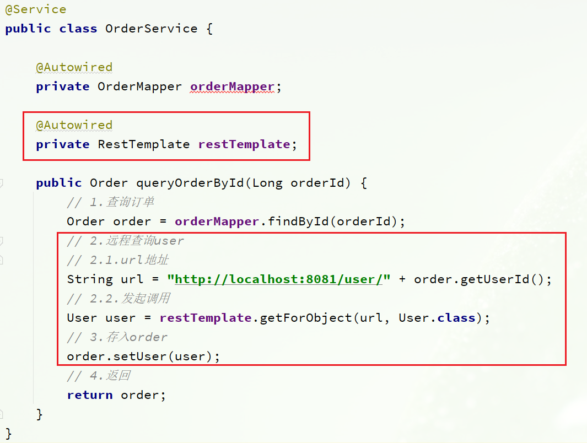
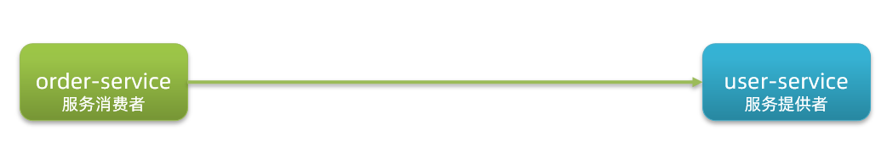

[toc]
# 1.认识微服务

随着互联网行业的发展，对服务的要求也越来越高，服务架构也从单体架构逐渐演变为现在流行的微服务架构。
## 1.1.单体架构
**单体架构**：将业务的所有功能集中在一个项目中开发，打成一个包部署。


单体架构的优缺点如下：

**优点：**
- 架构简单
- 部署成本低

**缺点：**
- 耦合度高（维护困难、升级困难）

## 1.2.分布式架构

**分布式架构**：根据业务功能对系统做拆分，每个业务功能模块作为独立项目开发，称为一个服务。


分布式架构的优缺点：

**优点：**
- 降低服务耦合
- 有利于服务升级和拓展

**缺点：**
- 服务调用关系错综复杂

## 1.3.微服务

微服务的架构特征：

- 单一职责：微服务拆分粒度更小，每一个服务都对应唯一的业务能力，做到单一职责
- 自治：团队独立、技术独立、数据独立，独立部署和交付
- 面向服务：服务提供统一标准的接口，与语言和技术无关
- 隔离性强：服务调用做好隔离、容错、降级，避免出现级联问题


微服务的上述特性其实是在给分布式架构制定一个标准，进一步降低服务之间的耦合度，提供服务的独立性和灵活性。做到高内聚，低耦合。

因此，可以认为**微服务**是一种经过良好架构设计的**分布式架构方案** 。

其中在Java领域最引人注目的就是SpringCloud提供的方案了。

## 1.4.SpringCloud

SpringCloud是目前国内使用最广泛的微服务框架。官网地址：https://spring.io/projects/spring-cloud。

SpringCloud集成了各种微服务功能组件，并基于SpringBoot实现了这些组件的自动装配，从而提供了良好的开箱即用体验。

其中常见的组件包括：


另外，SpringCloud底层是依赖于SpringBoot的，并且有版本的兼容关系，如下：


我们课堂学习的版本是 Hoxton.SR10，因此对应的SpringBoot版本是2.3.x版本。

## 1.5.总结

- 单体架构：简单方便，高度耦合，扩展性差，适合小型项目。例如：学生管理系统

- 分布式架构：松耦合，扩展性好，但架构复杂，难度大。适合大型互联网项目，例如：京东、淘宝

- 微服务：一种良好的分布式架构方案

  ①优点：拆分粒度更小、服务更独立、耦合度更低

  ②缺点：架构非常复杂，运维、监控、部署难度提高

- SpringCloud是微服务架构的一站式解决方案，集成了各种优秀微服务功能组件

# 2.服务拆分和远程调用

任何分布式架构都离不开服务的拆分，微服务也是一样。

## 2.1.服务拆分原则

这里我总结了微服务拆分时的几个原则：

- 不同微服务，不要重复开发相同业务
- 微服务数据独立，不要访问其它微服务的数据库
- 微服务可以将自己的业务暴露为接口，供其它微服务调用


## 2.2.服务拆分示例
cloud-demo：父工程，管理依赖

- order-service：订单微服务，负责订单相关业务
- user-service：用户微服务，负责用户相关业务

要求：

- 订单微服务和用户微服务都必须有各自的数据库，相互独立
- 订单服务和用户服务都对外暴露Restful的接口
- 订单服务如果需要查询用户信息，只能调用用户服务的Restful接口，不能查询用户数据库

### 2.3.1.案例需求：

修改order-service中的根据id查询订单业务，要求在查询订单的同时，根据订单中包含的userId查询出用户信息，一起返回。


因此，我们需要在order-service中 向user-service发起一个http的请求，调用http://localhost:8081/user/{userId}这个接口。

大概的步骤是这样的：

- 注册一个RestTemplate的实例到Spring容器
- 修改order-service服务中的OrderService类中的queryOrderById方法，根据Order对象中的userId查询User
- 将查询的User填充到Order对象，一起返回

### 2.3.2.注册RestTemplate

首先，我们在order-service服务中的OrderApplication启动类中，注册RestTemplate实例：

```java
package cn.itcast.order;

import org.mybatis.spring.annotation.MapperScan;
import org.springframework.boot.SpringApplication;
import org.springframework.boot.autoconfigure.SpringBootApplication;
import org.springframework.context.annotation.Bean;
import org.springframework.web.client.RestTemplate;

@MapperScan("cn.itcast.order.mapper")
@SpringBootApplication
public class OrderApplication {

    public static void main(String[] args) {
        SpringApplication.run(OrderApplication.class, args);
    }

    @Bean
    public RestTemplate restTemplate() {
        return new RestTemplate();
    }
}
```
### 2.3.3.实现远程调用

修改order-service服务中的cn.itcast.order.service包下的OrderService类中的queryOrderById方法：


## 2.4.提供者与消费者

在服务调用关系中，会有两个不同的角色：

**服务提供者**：一次业务中，被其它微服务调用的服务。（提供接口给其它微服务）

**服务消费者**：一次业务中，调用其它微服务的服务。（调用其它微服务提供的接口）



但是，服务提供者与服务消费者的角色并不是绝对的，而是相对于业务而言。

如果服务A调用了服务B，而服务B又调用了服务C，服务B的角色是什么？

- 对于A调用B的业务而言：A是服务消费者，B是服务提供者
- 对于B调用C的业务而言：B是服务消费者，C是服务提供者


因此，服务B既可以是服务提供者，也可以是服务消费者。

# 3.Eureka注册中心
假如我们的服务提供者user-service部署了多个实例，如图：


- order-service在发起远程调用的时候，该如何得知user-service实例的ip地址和端口？
- 有多个user-service实例地址，order-service调用时该如何选择？
- order-service如何得知某个user-service实例是否依然健康，是不是已经宕机？

## 3.1.Eureka的结构和作用
这些问题都需要利用SpringCloud中的注册中心来解决，其中最广为人知的注册中心就是Eureka，其结构如下：


回答之前的各个问题。

问题1：order-service如何得知user-service实例地址？

获取地址信息的流程如下：

- user-service服务实例启动后，将自己的信息注册到eureka-server（Eureka服务端）。这个叫服务注册
- eureka-server保存服务名称到服务实例地址列表的映射关系
- order-service根据服务名称，拉取实例地址列表。这个叫服务发现或服务拉取


问题2：order-service如何从多个user-service实例中选择具体的实例？

- order-service从实例列表中利用负载均衡算法选中一个实例地址
- 向该实例地址发起远程调用


问题3：order-service如何得知某个user-service实例是否依然健康，是不是已经宕机？

- user-service会每隔一段时间（默认30秒）向eureka-server发起请求，报告自己状态，称为心跳
- 当超过一定时间没有发送心跳时，eureka-server会认为微服务实例故障，将该实例从服务列表中剔除
- order-service拉取服务时，就能将故障实例排除了


> 注意：一个微服务，既可以是服务提供者，又可以是服务消费者，因此eureka将服务注册、服务发现等功能统一封装到了eureka-client端


## 3.2.搭建eureka-server

首先大家注册中心服务端：eureka-server，这必须是一个独立的微服务
### 3.2.1.创建eureka-server服务


### 3.2.2.引入eureka依赖
引入SpringCloud为eureka提供的starter依赖：

```xml
<dependency>
    <groupId>org.springframework.cloud</groupId>
    <artifactId>spring-cloud-starter-netflix-eureka-server</artifactId>
</dependency>
```

### 3.2.3.编写启动类

给eureka-server服务编写一个启动类，一定要添加一个@EnableEurekaServer注解，开启eureka的注册中心功能：

```java
package cn.itcast.eureka;

import org.springframework.boot.SpringApplication;
import org.springframework.boot.autoconfigure.SpringBootApplication;
import org.springframework.cloud.netflix.eureka.server.EnableEurekaServer;

@SpringBootApplication
@EnableEurekaServer
public class EurekaApplication {
    public static void main(String[] args) {
        SpringApplication.run(EurekaApplication.class, args);
    }
}
```
### 3.2.4.编写配置文件

编写一个application.yml文件，内容如下：

```yaml
server:
  port: 10086
spring:
  application:
    name: eureka-server # eureka的服务名称
eureka:
  client:
    service-url: # eureka的地址信息
      defaultZone: http://127.0.0.1:10086/eureka
```

### 3.2.5.启动服务

启动微服务，然后在浏览器访问：http://127.0.0.1:10086

看到下面结果应该是成功了：


## 3.3.服务注册

下面，我们将user-service注册到eureka-server中去。

### 1）引入依赖

在user-service的pom文件中，引入下面的eureka-client依赖：

```xml
<dependency>
    <groupId>org.springframework.cloud</groupId>
    <artifactId>spring-cloud-starter-netflix-eureka-client</artifactId>
</dependency>
```


### 2）配置文件

在user-service中，修改application.yml文件，添加服务名称、eureka地址：

```yaml
spring:
  application:
    name: userservice
eureka:
  client:
    service-url:
      defaultZone: http://127.0.0.1:10086/eureka
```
### 3）启动多个user-service实例

为了演示一个服务有多个实例的场景，我们添加一个SpringBoot的启动配置，再启动一个user-service。

首先，复制原来的user-service启动配置：


然后，在弹出的窗口中，填写信息：


现在，SpringBoot窗口会出现两个user-service启动配置，不过，第一个是8081端口，第二个是8082端口。


## 3.4.服务发现

下面，我们将order-service的逻辑修改：向eureka-server拉取user-service的信息，实现服务发现。
### 1）引入依赖

之前说过，服务发现、服务注册统一都封装在eureka-client依赖，因此这一步与服务注册时一致。

在order-service的pom文件中，引入下面的eureka-client依赖：

```xml
<dependency>
    <groupId>org.springframework.cloud</groupId>
    <artifactId>spring-cloud-starter-netflix-eureka-client</artifactId>
</dependency>
```

### 2）配置文件

服务发现也需要知道eureka地址，因此第二步与服务注册一致，都是配置eureka信息：

在order-service中，修改application.yml文件，添加服务名称、eureka地址：

```yaml
spring:
  application:
    name: orderservice
eureka:
  client:
    service-url:
      defaultZone: http://127.0.0.1:10086/eureka
```

### 3）服务拉取和负载均衡

最后，我们要去eureka-server中拉取user-service服务的实例列表，并且实现负载均衡。

不过这些动作不用我们去做，只需要添加一些注解即可。

在order-service的OrderApplication中，给RestTemplate这个Bean添加一个@LoadBalanced注解：


修改order-service服务中的cn.itcast.order.service包下的OrderService类中的queryOrderById方法。修改访问的url路径，用服务名代替ip、端口：


spring会自动帮助我们从eureka-server端，根据userservice这个服务名称，获取实例列表，而后完成负载均衡。

# 4.Ribbon负载均衡

上一节中，我们添加了@LoadBalanced注解，即可实现负载均衡功能，这是什么原理呢？

## 4.1.负载均衡原理

SpringCloud底层其实是利用了一个名为Ribbon的组件，来实现负载均衡功能的。


那么我们发出的请求明明是http://userservice/user/1，怎么变成了http://localhost:8081的呢？

## 4.2.源码跟踪

为什么我们只输入了service名称就可以访问了呢？之前还要获取ip和端口。

显然有人帮我们根据service名称，获取到了服务实例的ip和端口。它就是`LoadBalancerInterceptor`，这个类会在对RestTemplate的请求进行拦截，然后从Eureka根据服务id获取服务列表，随后利用负载均衡算法得到真实的服务地址信息，替换服务id。

我们进行源码跟踪：

### 1）LoadBalancerIntercepor


可以看到这里的intercept方法，拦截了用户的HttpRequest请求，然后做了几件事：

- `request.getURI()`：获取请求uri，本例中就是 http://user-service/user/8
- `originalUri.getHost()`：获取uri路径的主机名，其实就是服务id，`user-service`
- `this.loadBalancer.execute()`：处理服务id，和用户请求。

这里的`this.loadBalancer`是`LoadBalancerClient`类型，我们继续跟入。


### 2）LoadBalancerClient

继续跟入execute方法：


代码是这样的：

- getLoadBalancer(serviceId)：根据服务id获取ILoadBalancer，而ILoadBalancer会拿着服务id去eureka中获取服务列表并保存起来。
- getServer(loadBalancer)：利用内置的负载均衡算法，从服务列表中选择一个。本例中，可以看到获取了8082端口的服务


放行后，再次访问并跟踪，发现获取的是8081：


果然实现了负载均衡。


### 3）负载均衡策略IRule

在刚才的代码中，可以看到获取服务使通过一个`getServer`方法来做负载均衡:


我们继续跟入：


继续跟踪源码chooseServer方法，发现这么一段代码：


我们看看这个rule是谁：


这里的rule默认值是一个`RoundRobinRule`，看类的介绍：


轮询的意思。

### 4）总结

SpringCloudRibbon的底层采用了一个拦截器，拦截了RestTemplate发出的请求，对地址做了修改。用一幅图来总结一下：


基本流程如下：

- 拦截我们的RestTemplate请求http://userservice/user/1
- RibbonLoadBalancerClient会从请求url中获取服务名称，也就是user-service
- DynamicServerListLoadBalancer根据user-service到eureka拉取服务列表
- eureka返回列表，localhost:8081、localhost:8082
- IRule利用内置负载均衡规则，从列表中选择一个，例如localhost:8081
- RibbonLoadBalancerClient修改请求地址，用localhost:8081替代userservice，得到http://localhost:8081/user/1，发起真实请求

## 4.3.负载均衡策略
### 4.3.1.负载均衡策略

负载均衡的规则都定义在IRule接口中，而IRule有很多不同的实现类：


不同规则的含义如下：

| **内置负载均衡规则类**    | **规则描述**                                                 |
| ------------------------- | ------------------------------------------------------------ |
| RoundRobinRule            | 简单轮询服务列表来选择服务器。它是Ribbon默认的负载均衡规则。 |
| WeightedResponseTimeRule            | 为每一个服务器赋予一个权重值。服务器响应时间越长，这个服务器的权重就越小。这个规则会随机选择服务器，这个权重值会影响服务器的选择。 |
|  **ZoneAvoidanceRule**            | 以区域可用的服务器为基础进行服务器的选择。使用Zone对服务器进行分类，这个Zone可以理解为一个机房、一个机架等。而后再对Zone内的多个服务做轮询。 |
| BestAvailableRule             | 忽略那些短路的服务器，并选择并发数较低的服务器。 |
| RandomRule            | 随机选择一个可用的服务器 |
| RetryRule            | 重试机制的选择逻辑 |
| AvailabilityFilteringRule | 对以下两种服务器进行忽略：   （1）在默认情况下，这台服务器如果3次连接失败，这台服务器就会被设置为“短路”状态。短路状态将持续30秒，如果再次连接失败，短路的持续时间就会几何级地增加。  （2）并发数过高的服务器。如果一个服务器的并发连接数过高，配置了AvailabilityFilteringRule规则的客户端也会将其忽略。并发连接数的上限，可以由客户端的<clientName>.<clientConfigNameSpace>.ActiveConnectionsLimit属性进行配置。 |


默认的实现就是ZoneAvoidanceRule，是一种轮询方案。

### 4.3.2.自定义负载均衡策略

通过定义IRule实现可以修改负载均衡规则，有两种方式：

1. 代码方式：在order-service中的OrderApplication类中，定义一个新的IRule：

```java
@Bean
public IRule randomRule(){
    return new RandomRule();
}
```


2. 配置文件方式：在order-service的application.yml文件中，添加新的配置也可以修改规则：

```yaml
userservice: # 给某个微服务配置负载均衡规则，这里是userservice服务
  ribbon:
    NFLoadBalancerRuleClassName: com.netflix.loadbalancer.RandomRule # 负载均衡规则 
```


> **注意**，一般用默认的负载均衡规则，不做修改。


## 4.4.饥饿加载

Ribbon默认是采用懒加载，即第一次访问时才会去创建LoadBalanceClient，请求时间会很长。

而饥饿加载则会在项目启动时创建，降低第一次访问的耗时，通过下面配置开启饥饿加载：

```yaml
ribbon:
  eager-load:
    enabled: true
    clients: userservice
```

# 5.Nacos注册中心

国内公司一般都推崇阿里巴巴的技术，比如注册中心，SpringCloudAlibaba也推出了一个名为Nacos的注册中心。

## 5.1.认识和安装Nacos

[Nacos](https://nacos.io/)是阿里巴巴的产品，现在是[SpringCloud](https://spring.io/projects/spring-cloud)中的一个组件。相比[Eureka](https://github.com/Netflix/eureka)功能更加丰富，在国内受欢迎程度较高。


安装方式可以参考资料《Nacos安装指南.md》

## 5.2.服务注册到nacos

Nacos是SpringCloudAlibaba的组件，而SpringCloudAlibaba也遵循SpringCloud中定义的服务注册、服务发现规范。因此使用Nacos和使用Eureka对于微服务来说，并没有太大区别。

主要差异在于：

- 依赖不同
- 服务地址不同

### 1）引入依赖
在cloud-demo父工程的pom文件中的`<dependencyManagement>`中引入SpringCloudAlibaba的依赖：
```xml
<dependency>
    <groupId>com.alibaba.cloud</groupId>
    <artifactId>spring-cloud-alibaba-dependencies</artifactId>
    <version>2.2.6.RELEASE</version>
    <type>pom</type>
    <scope>import</scope>
</dependency>
```

然后在子工程和子工程中的pom文件中引入nacos-discovery依赖：

```xml
<dependency>
    <groupId>com.alibaba.cloud</groupId>
    <artifactId>spring-cloud-starter-alibaba-nacos-discovery</artifactId>
</dependency>
```

> **注意**：不要忘了注释掉eureka的依赖。

### 2）配置nacos地址

在user-service和order-service的application.yml中添加nacos地址：

```yaml
spring:
  cloud:
    nacos:
      server-addr: localhost:8848
```

### 3）重启

重启微服务后，登录nacos管理页面，可以看到微服务信息：
![[../../youdaonote-images/image-20210713231439607 3.png]]