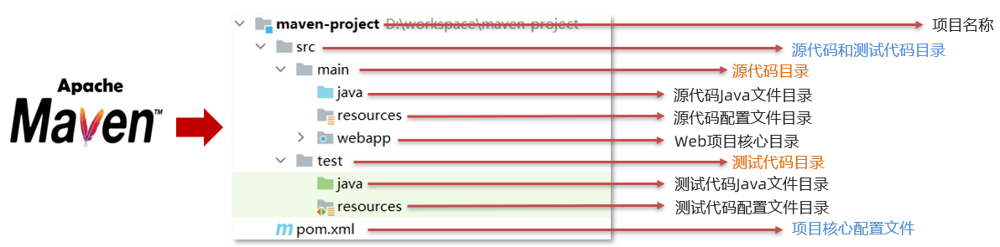
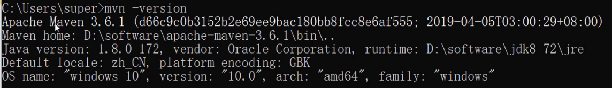
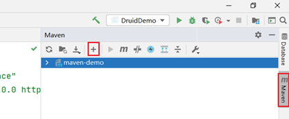

# ssm整合学习-Maven
## 1，Maven

Maven是专门用于管理和构建Java项目的工具，它的主要功能有：

* 提供了一套标准化的项目结构

* 提供了一套标准化的构建流程（编译，测试，打包，发布……）

* 提供了一套依赖管理机制

**标准化的项目结构：**

项目结构我们都知道，每一个开发工具（IDE）都有自己不同的项目结构，它们互相之间不通用。我再eclipse中创建的目录，无法在idea中进行使用，这就造成了很大的不方便，如下图:前两个是以后开发经常使用的开发工具


而Maven提供了一套标准化的项目结构，所有的IDE使用Maven构建的项目完全一样，所以IDE创建的Maven项目可以通用。如下图右边就是Maven构建的项目结构。



**标准化的构建流程：**


如上图所示我们开发了一套系统，代码需要进行编译、测试、打包、发布，这些操作如果需要反复进行就显得特别麻烦，而Maven提供了一套简单的命令来完成项目构建。

**依赖管理：**

依赖管理其实就是管理你项目所依赖的第三方资源（jar包、插件）。如之前我们项目中需要使用JDBC和Druid的话，就需要去网上下载对应的依赖包（当前之前是老师已经下载好提供给大家了），复制到项目中，还要将jar包加入工作环境这一系列的操作。如下图所示


而Maven使用标准的 ==坐标== 配置来管理各种依赖，只需要简单的配置就可以完成依赖管理。


如上图右边所示就是mysql驱动包的坐标，在项目中只需要写这段配置，其他都不需要我们担心，Maven都帮我们进行操作了。

### 1.1  Maven简介

> ==Apache Maven== 是一个项目管理和构建==工具==，它基于项目对象模型(POM)的概念，通过一小段描述信息来管理项目的构建、报告和文档。
>
> 官网 ：http://maven.apache.org/ 

通过上面的描述大家只需要知道Maven是一个工具即可。Apache 是一个开源组织，将来我们会学习很多Apache提供的项目。

#### 1.1.1  Maven模型

* 项目对象模型 (Project Object Model)
* 依赖管理模型(Dependency)
* 插件(Plugin)


如上图所示就是Maven的模型，而我们先看紫色框框起来的部分，他就是用来完成 `标准化构建流程` 。如我们需要编译，Maven提供了一个编译插件供我们使用，我们需要打包，Maven就提供了一个打包插件提供我们使用等。


上图中紫色框起来的部分，项目对象模型就是将我们自己抽象成一个对象模型，有自己专属的坐标，如下图所示是一个Maven项目：


依赖管理模型则是使用坐标来描述当前项目依赖哪儿些第三方jar包，如下图所示


上述Maven模型图中还有一部分是仓库。如何理解仓库呢？

#### 1.1.2  仓库

大家想想这样的场景，我们创建Maven项目，在项目中使用坐标来指定项目的依赖，那么依赖的jar包到底存储在什么地方呢？其实依赖jar包是存储在我们的本地仓库中。而项目运行时从本地仓库中拿需要的依赖jar包。

**仓库分类：**

* 本地仓库：自己计算机上的一个目录

* 中央仓库：由Maven团队维护的全球唯一的仓库

  * 地址： https://repo1.maven.org/maven2/

* 远程仓库(私服)：一般由公司团队搭建的私有仓库

  今天我们只学习远程仓库的使用，并不会搭建。

当项目中使用坐标引入对应依赖jar包后，首先会查找本地仓库中是否有对应的jar包：

* 如果有，则在项目直接引用;

* 如果没有，则去中央仓库中下载对应的jar包到本地仓库。


如果还可以搭建远程仓库，将来jar包的查找顺序则变为：

> 本地仓库 --> 远程仓库--> 中央仓库


### 1.2  Maven安装配置
* 解压 apache-maven-3.6.1.rar 既安装完成

  > 建议解压缩到没有中文、特殊字符的路径下。如课程中解压缩到 `D:\software` 下。
  
  * bin目录 ： 存放的是可执行命令。mvn 命令重点关注。
  * conf目录 ：存放Maven的配置文件。`settings.xml` 配置文件后期需要修改。
  * lib目录 ：存放Maven依赖的jar包。Maven也是使用java开发的，所以它也依赖其他的jar包。

* 配置环境变量 MAVEN_HOME 为安装路径的bin目录

  `此电脑` 右键  -->  `高级系统设置`  -->  `高级`  -->  `环境变量`

  在系统变量处新建一个变量 `MAVEN_HOME`
  
  
  在 `Path` 中进行配置
  
  打开命令提示符进行验证，出现如图所示表示安装成功
  
  
* 配置本地仓库
修改 conf/settings.xml 中的 <localRepository> 为一个指定目录作为本地仓库，用来存储jar包。


* 配置阿里云私服

  中央仓库在国外，所以下载jar包速度可能比较慢，而阿里公司提供了一个远程仓库，里面基本也都有开源项目的jar包。

  修改 conf/settings.xml 中的 <mirrors>标签，为其添加如下子标签：

  ```xml
  <mirror>  
      <id>alimaven</id>  
      <name>aliyun maven</name>  
      <url>http://maven.aliyun.com/nexus/content/groups/public/</url>
      <mirrorOf>central</mirrorOf>          
  </mirror>
  ```
  
### 1.3  Maven基本使用

#### 1.3.1  Maven 常用命令

> * compile ：编译
>
> * clean：清理
>
> * test：测试
>
> * package：打包
>
> * install：安装

**命令演示：**
```java
mnv compile ：编译
// 同时在项目下会出现一个 `target` 目录，编译后的字节码文件就放在该目录下

mvn clean
// 删除项目下的 `target` 目录

mvn package
// 在项目的 `terget` 目录下有一个jar包（将当前项目打成的jar包）

mvn test  
// 该命令会执行所有的测试代码。

mvn install
// 该命令会将当前项目打成jar包，并安装到本地仓库。
```
#### 1.3.2  Maven 生命周期

Maven 构建项目生命周期描述的是一次构建过程经历经历了多少个事件

Maven 对项目构建的生命周期划分为3套：

* clean ：清理工作。
* default ：核心工作，例如编译，测试，打包，安装等。
* site ： 产生报告，发布站点等。这套声明周期一般不会使用。

同一套生命周期内，执行后边的命令，前面的所有命令会自动执行。例如默认（default）生命周期如下：


当我们执行 `install`（安装）命令时，它会先执行 `compile`命令，再执行 `test ` 命令，再执行 `package` 命令，最后执行 `install` 命令。

当我们执行 `package` （打包）命令时，它会先执行 `compile` 命令，再执行 `test` 命令，最后执行 `package` 命令。

默认的生命周期也有对应的很多命令，其他的一般都不会使用，我们只关注常用的：


### 1.4  IDEA使用Maven

以后开发中我们肯定会在高级开发工具中使用Maven管理项目，而我们常用的高级开发工具是IDEA，所以接下来我们会讲解Maven在IDEA中的使用。

#### 1.4.1  IDEA配置Maven环境

我们需要先在IDEA中配置Maven环境：

* 选择 IDEA中 File --> Settings
* 搜索 maven 
* 设置 IDEA 使用本地安装的 Maven，并修改配置文件路径

#### 1.4.2  Maven 坐标详解

**什么是坐标？**

* Maven 中的坐标是 ==资源的唯一标识==
* 使用坐标来定义项目或引入项目中需要的依赖

**Maven 坐标主要组成**

* groupId：定义当前Maven项目隶属组织名称（通常是域名反写，例如：com.itheima）
* artifactId：定义当前Maven项目名称（通常是模块名称，例如 order-service、goods-service）
* version：定义当前项目版本号

如下图就是使用坐标表示一个项目：


==注意：==

* 上面所说的资源可以是插件、依赖、当前项目。
* 我们的项目如果被其他的项目依赖时，也是需要坐标来引入的。

#### 1.4.3  IDEA 创建 Maven项目

* 创建模块，选择Maven，点击Next


* 填写模块名称，坐标信息，点击finish，创建完成


#### 1.4.4  IDEA 导入 Maven项目
* 选择右侧Maven面板，点击 + 号

* 选中对应项目的pom.xml文件，双击即可
* 如果没有Maven面板，选择
  View --> Appearance --> Tool Window Bars

可以通过下图所示进行命令的操作：


**配置 Maven-Helper 插件** 

* 选择 IDEA中 File --> Settings
* 选择 Plugins
* 搜索 Maven，选择第一个 Maven Helper，点击Install安装，弹出面板中点击Accept
* 重启 IDEA

安装完该插件后可以通过 选中项目右键进行相关命令操作，如下图所示：


### 1.5  依赖管理

#### 1.5.1  使用坐标引入jar包

**使用坐标引入jar包的步骤：**

* 在项目的 pom.xml 中编写 <dependencies> 标签

* 在 <dependencies> 标签中 使用 <dependency> 引入坐标

* 定义坐标的 groupId，artifactId，version


* 点击刷新按钮，使坐标生效

>  注意：
>
> * 具体的坐标我们可以到如下网站进行搜索
> * https://mvnrepository.com/

**快捷方式导入jar包的坐标：**

每次需要引入jar包，都去对应的网站进行搜索是比较麻烦的，接下来给大家介绍一种快捷引入坐标的方式

* 在 pom.xml 中 按 alt + insert（command+N），选择 Dependency
* 在弹出的面板中搜索对应坐标，然后双击选中对应坐标


**自动导入设置：**

上面每次操作都需要点击刷新按钮，让引入的坐标生效。当然我们也可以通过设置让其自动完成

* 选择 IDEA中 File --> Settings
* 在弹出的面板中找到 Build Tools
* 选择 Any changes，点击 ok 即可生效

#### 1.5.2  依赖范围

通过设置坐标的依赖范围(scope)，可以设置 对应jar包的作用范围：编译环境、测试环境、运行环境。

如下图所示给 `junit` 依赖通过 `scope` 标签指定依赖的作用范围。 那么这个依赖就只能作用在测试环境，其他环境下不能使用。


那么 `scope` 都可以有哪些取值呢？

| **依赖范围** | 编译classpath | 测试classpath | 运行classpath | 例子              |
| ------------ | ------------- | ------------- | ------------- | ----------------- |
| **compile**  | Y             | Y             | Y             | logback           |
| **test**     | -             | Y             | -             | Junit             |
| **provided** | Y             | Y             | -             | servlet-api       |
| **runtime**  | -             | Y             | Y             | jdbc驱动          |
| **system**   | Y             | Y             | -             | 存储在本地的jar包 |

* compile ：作用于编译环境、测试环境、运行环境。
* test ： 作用于测试环境。典型的就是Junit坐标，以后使用Junit时，都会将scope指定为该值
* provided ：作用于编译环境、测试环境。我们后面会学习 `servlet-api` ，在使用它时，必须将 `scope` 设置为该值，不然运行时就会报错
* runtime  ： 作用于测试环境、运行环境。jdbc驱动一般将 `scope` 设置为该值，当然不设置也没有任何问题 

> 注意：
>
> * 如果引入坐标不指定 `scope` 标签时，默认就是 compile  值。以后大部分jar包都是使用默认值。

# Maven进阶
## 一、分模块开发与设计

### 1. 分模块开发的意义

#### 问题导入

分模块开发对工程有什么好处？

### 模块拆分原则

目的：项目的扩展性变强了，方便其他项目引用相同的功能。


- 将原始模块按照功能拆分成若干个子模块，方便模块间的相互调用，接口共享


### 2. 分模块开发（模块拆分）

#### 问题导入

一个完整的工程依据什么来进行模块的拆分？

#### 2.1 创建Maven模块


#### 2.2 书写模块代码

注意事项：

1. 分模块开发需要先针对模块功能进行设计，再进行编码。不会先将工程开发完毕，然后进行拆分

#### 2.3 通过maven指令安装模块到本地仓库（install指令）

```cmd
mvn install
```

注意事项：

1. 团队内部开发需要发布模块功能到团队内部可共享的仓库中（私服）

## 二、依赖管理

- 依赖管理指当前项目运行所需的jar，一个项目可以设置多个依赖

- 格式：

```xml
<!--设置当前项目所依赖的所有jar-->
<dependencies>
    <!--设置具体的依赖-->
    <dependency>
        <!--依赖所属群组id-->
        <groupId>org.springframework</groupId>
        <!--依赖所属项目id-->
        <artifactId>spring-webmvc</artifactId>
        <!--依赖版本号-->
        <version>5.2.10.RELEASE</version>
    </dependency>
</dependencies>
```

### 1. 依赖传递

#### 问题导入

A依赖B，B依赖C，A是否依赖于C呢？

- 依赖具有传递性
    - 直接依赖：在当前项目中通过依赖配置建立的依赖关系
    - 间接依赖：被资源的资源如果依赖其他资源，当前项目间接依赖其他资源
    - 特殊优先：当同级配置了相同资源的不同版本，后配置的覆盖先配置的


### 2. 可选依赖

#### 问题导入

A依赖B，B依赖C，如果A不想将C依赖进来，是否可以做到？

- 可选依赖指对外隐藏当前所依赖的资源————不透明

```xml
<dependency>
    <groupId>com.itheima</groupId>
    <artifactId>maven_03_pojo</artifactId>
    <version>1.0-SNAPSHOT</version>
    <!--可选依赖是隐藏当前工程所依赖的资源，隐藏后对应资源将不具有依赖传递性-->
    <optional>false</optional>
</dependency>
```


### 3. 排除依赖

#### 问题导入

A依赖B，B依赖C，如果A不想将C依赖进来，是否可以做到？

- 排除依赖指主动断开依赖的资源，被排除的资源无需指定版本————不需要
- 排除依赖资源仅指定GA即可，无需指定V

```xml
<dependency>
    <groupId>com.itheima</groupId>
    <artifactId>maven_04_dao</artifactId>
    <version>1.0-SNAPSHOT</version>
    <!--排除依赖是隐藏当前资源对应的依赖关系-->
    <exclusions>
        <exclusion>
            <groupId>log4j</groupId>
            <artifactId>log4j</artifactId>
        </exclusion>
        <exclusion>
            <groupId>org.mybatis</groupId>
            <artifactId>mybatis</artifactId>
        </exclusion>
    </exclusions>
</dependency>
```

### 4 可选依赖和排除依赖的区别


## 三、聚合与继承

### 1. 聚合工程

#### 问题导入

什么叫聚合？

- 聚合：将多个模块组织成一个整体，同时进行项目构建的过程称为聚合
- 聚合工程：通常是一个不具有业务功能的”空“工程（有且仅有一个pom文件）

- 作用：使用聚合工程可以将多个工程编组，通过对聚合工程进行构建，实现对所包含的模块进行同步构建
    - 当工程中某个模块发生更新（变更）时，必须保障工程中与已更新模块关联的模块同步更新，此时可以使用聚合工程来解决批量模块同步构建的问题


### 2. 聚合工程开发

#### 问题导入

工程的打包方式有哪几种？

#### 2.1 创建Maven模块，设置打包类型为pom

```xml
<packaging>pom</packaging>
```

注意事项：

1. 每个maven工程都有对应的打包方式，默认为jar，web工程打包方式为war

#### 2.2 设置当前聚合工程所包含的子模块名称

```xml
<modules>
    <module>../maven_ssm</module>
    <module>../maven_pojo</module>
    <module>../maven_dao</module>
</modules>
```

注意事项：

1. 聚合工程中所包含的模块在进行构建时会根据模块间的依赖关系设置构建顺序，与聚合工程中模块的配置书写位置无关。
2. 参与聚合的工程无法向上感知是否参与聚合，只能向下配置哪些模块参与本工程的聚合。

### 3. 继承关系

#### 问题导入

什么叫继承？

- 概念：
    - 继承描述的是两个工程间的关系，与java中的继承相似，子工程可以继承父工程中的配置信息，常见于依赖关系的继承
- 作用：
    - 简化配置
    - 减少版本冲突


### 4. 继承关系开发

#### 4.1 创建Maven模块，设置打包类型为pom

```xml
<packaging>pom</packaging>
```

注意事项：

1. 建议父工程打包方式设置为pom

#### 4.2 在父工程的pom文件中配置依赖关系（子工程将沿用父工程中的依赖关系）

```xml
<dependencies>
    <dependency>
        <groupId>org.springframework</groupId>
        <artifactId>spring-webmvc</artifactId>
        <version>5.2.10.RELEASE</version>
    </dependency>
    ……
</dependencies>
```

#### 4.3 配置子工程中可选的依赖关系

```xml
<dependencyManagement>
    <dependencies>
        <dependency>
            <groupId>com.alibaba</groupId>
            <artifactId>druid</artifactId>
            <version>1.1.16</version>
        </dependency>
        ……
    </dependencies>
</dependencyManagement>
```

#### 4.3 在子工程中配置当前工程所继承的父工程

```xml
<!--定义该工程的父工程-->
<parent>
    <groupId>com.itheima</groupId>
    <artifactId>maven_parent</artifactId>
    <version>1.0-SNAPSHOT</version>
    <!--填写父工程的pom文件，根据实际情况填写-->
    <relativePath>../maven_parent/pom.xml</relativePath>
</parent>
```

#### 4.5 在子工程中配置使用父工程中可选依赖的坐标

```xml
<dependencies>
    <dependency>
        <groupId>com.alibaba</groupId>
        <artifactId>druid</artifactId>
    </dependency>
</dependencies>
```

注意事项：

1. 子工程中使用父工程中的可选依赖时，仅需要提供群组id和项目id，无需提供版本，版本由父工程统一提供，避免版本冲突
2. 子工程中还可以定义父工程中没有定义的依赖关系


### 5. 聚合与继承的区别

#### 问题导入

聚合和继承的作用？

- 作用
    - 聚合用于快速构建项目
    - 继承用于快速配置
- 相同点：
    - 聚合与继承的pom.xml文件打包方式均为pom，可以将两种关系制作到同一个pom文件中
    - 聚合与继承均属于设计型模块，并无实际的模块内容
- 不同点：
    - 聚合是在当前模块中配置关系，聚合可以感知到参与聚合的模块有哪些
    - 继承是在子模块中配置关系，父模块无法感知哪些子模块继承了自己


## 四、属性管理

### 1. 属性

#### 问题导入

定义属性有什么好处？


#### 1.1 属性配置与使用

##### ①：定义属性

```xml
<!--定义自定义属性-->
<properties>
    <spring.version>5.2.10.RELEASE</spring.version>
    <junit.version>4.12</junit.version>
</properties>
```

##### ②：引用属性

```xml
<dependency>
    <groupId>org.springframework</groupId>
    <artifactId>spring-context</artifactId>
    <version>${spring.version}</version>
</dependency>
```


#### 1.2 资源文件引用属性

##### ①：定义属性

```xml
<!--定义自定义属性-->
<properties>
    <spring.version>5.2.10.RELEASE</spring.version>
    <junit.version>4.12</junit.version>
    <jdbc.url>jdbc:mysql://127.0.0.1:3306/ssm_db</jdbc.url>
</properties>
```

##### ②：配置文件中引用属性

```properties
jdbc.driver=com.mysql.jdbc.Driver
jdbc.url=${jdbc.url}
jdbc.username=root
jdbc.password=root
```

##### ③：开启资源文件目录加载属性的过滤器

```xml
<build>
    <resources>
        <resource>
            <directory>${project.basedir}/src/main/resources</directory>
            <filtering>true</filtering>
        </resource>
    </resources>
</build>
```

##### ④：配置maven打war包时，忽略web.xml检查

```xml
<plugin>
    <groupId>org.apache.maven.plugins</groupId>
    <artifactId>maven-war-plugin</artifactId>
    <version>3.2.3</version>
    <configuration>
        <failOnMissingWebXml>false</failOnMissingWebXml>
    </configuration>
</plugin>
```

#### 1.3 其他属性（了解）

- 属性列表
    - 自定义属性（常用）
    - 内置属性
    - Setting属性
    - Java系统属性
    - 环境变量属性


### 2. 版本管理

#### 问题导入

项目开发的版本可以分为哪几种？

#### 2.1 工程版本

- SNAPSHOT（快照版本）
    - 项目开发过程中临时输出的版本，称为快照版本
    - 快照版本会随着开发的进展不断更新
- RELEASE（发布版本）
    - 项目开发到进入阶段里程碑后，向团队外部发布较为稳定的版本，这种版本所对应的构件文件是稳定的
    - 即便进行功能的后续开发，也不会改变当前发布版本内容，这种版本称为发布版本


#### 2.2 发布版本

- alpha版
- beta版
- 纯数字版

## 五、多环境配置与应用

### 1. 多环境配置作用

#### 问题导入

多环境配置有什么好处？

- maven提供配置多种环境的设定，帮助开发者使用过程中快速切换环境


### 2. 多环境配置步骤

#### 2.1 定义多环境

```xml
<!--定义多环境-->
<profiles>
    <!--定义具体的环境：生产环境-->
    <profile>
        <!--定义环境对应的唯一名称-->
        <id>env_dep</id>
        <!--定义环境中专用的属性值-->
        <properties>
            <jdbc.url>jdbc:mysql://127.0.0.1:3306/ssm_db</jdbc.url>
        </properties>
        <!--设置默认启动-->
        <activation>
            <activeByDefault>true</activeByDefault>
        </activation>
    </profile>
    <!--定义具体的环境：开发环境-->
    <profile>
        <id>env_pro</id>
        ……
    </profile>
</profiles>
```

#### 2.2 使用多环境（构建过程）

```cmd
【命令】：
mvn 指令 –P 环境定义id

【范例】：
mvn install –P pro_env
```

### 2. 跳过测试（了解）

#### 问题导入

跳过测试会不会影响项目的构建过程？

#### 2.1 应用场景

- 功能更新中并且没有开发完毕
- 快速打包
- ……

#### 2.2 跳过测试命令

- mvn install –D skipTests

注意事项：

1. 执行的项目构建指令必须包含测试生命周期，否则无效果。例如执行compile生命周期，不经过test生命周期。

#### 2.3 细粒度控制跳过测试

```xml
<plugin>
    <artifactId>maven-surefire-plugin</artifactId>
    <version>2.22.1</version>
    <configuration>
        <skipTests>true</skipTests>
        <!--设置跳过测试-->
        <includes>
            <!--包含指定的测试用例-->
            <include>**/User*Test.java</include>
        </includes>
        <excludes>
            <!--排除指定的测试用例-->
            <exclude>**/User*TestCase.java</exclude>
        </excludes>
    </configuration>
</plugin>
```


## 六、私服

### 1. 私服介绍

#### 问题导入

这里的私服和平时我们听的国服、体验服、欧服等等有什么区别？

#### 1.1 介绍

- 团队开发现状分析

- 私服是一台独立的服务器，用于解决团队内部的资源共享与资源同步问题
- Nexus
    - Sonatype公司的一款maven私服产品
    - 下载地址：https://help.sonatype.com/repomanager3/download 


#### 1.2 Nexus安装与启动

- 启动服务器（命令行启动）
    - nexus.exe /run nexus

- 访问服务器（默认端口：8081）
    - http://localhost:8081

- 修改基础配置信息
    - 安装路径下etc目录中nexus-default.properties文件保存有nexus基础配置信息，例如默认访问端口。
- 修改服务器运行配置信息
    - 安装路径下bin目录中nexus.vmoptions文件保存有nexus服务器启动对应的配置信息，例如默认占用内存空间。

#### 1.3 私服资源操作流程分析


### 2. 私服仓库分类

#### 问题导入

私服仓库分为哪几种？


### 3. 资源上传与下载

#### 问题导入

往私服上传资源是否需要身份认证？在哪里设置认证信息？


#### 3.1 从私服中下载依赖

【第一步】在maven的settings.xml中\<mirrors>标签中配置，此时就需要注释掉aliyun的配置。

```xml
<mirror>
    <id>nexus-heima</id>
    <mirrorOf>*</mirrorOf>
    <url>http://localhost:8081/repository/maven-public/</url>
</mirror>
```

【第二步】在nexus中设置允许匿名下载，如果不允许将不会从私服中下载依赖


如果私服中没有对应的jar，会去中央仓库下载，速度很慢。可以配置让私服去阿里云中下载依赖。


#### 3.2 上传依赖到私服中

【第一步】配置本地仓库访问私服的权限（在maven的settings.xml的servers标签中配置）

```xml
<server>
  <!--id任意，多个server的id不重复就行，后面会用到-->
  <id>heima-nexus</id>
  <username>admin</username>
  <password>123456</password><!--填写自己nexus设定的登录秘密-->
</server>
```

【第一步】配置当前项目访问私服上传资源的保存位置（项目的pom.xml文件中配置）

```xml
<distributionManagement>
    <repository>
      	<!--和maven/settings.xml中server中的id一致，表示使用该id对应的用户名和密码-->
        <id>heima-nexus</id>
      	<!--如果jar的版本是release版本，那么就上传到这个仓库，根据自己情况修改-->
        <url>http://localhost:8081/repository/heima-releases/</url>
    </repository>
    <snapshotRepository>
      	<!--和maven/settings.xml中server中的id一致，表示使用该id对应的用户名和密码-->
        <id>heima-nexus</id>
      	<!--如果jar的版本是snapshot版本，那么就上传到这个仓库，根据自己情况修改-->
        <url>http://localhost:8081/repository/heima-snapshots/</url>
    </snapshotRepository>
</distributionManagement>
```

**==注意：要和maven的settings.xml中server中定义的\<id>heima-nexus\</id>对应==**

【第三步】发布资源到私服命令

```
mvn deploy
```

