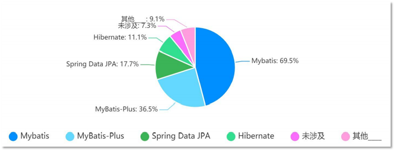
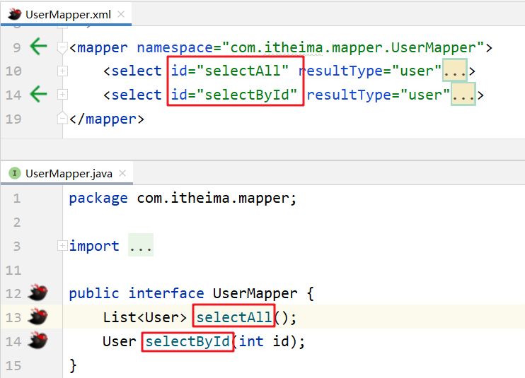
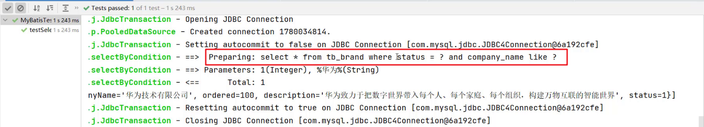
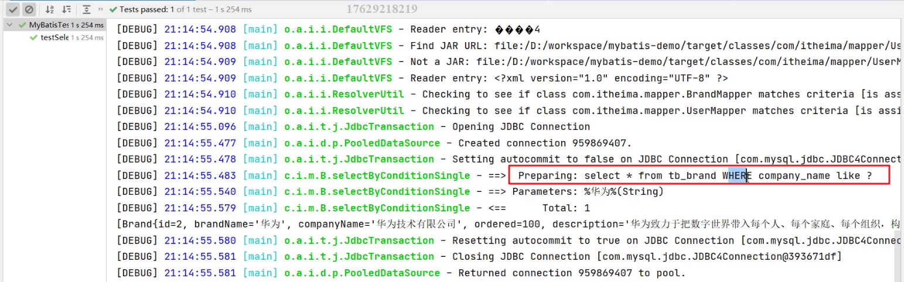
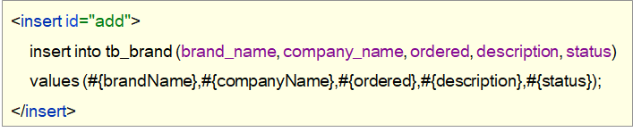
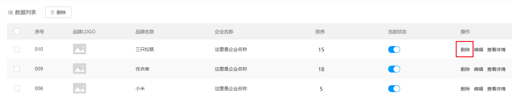
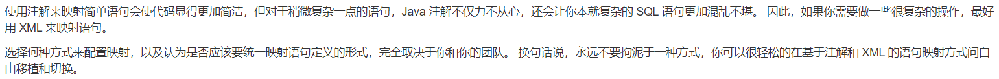
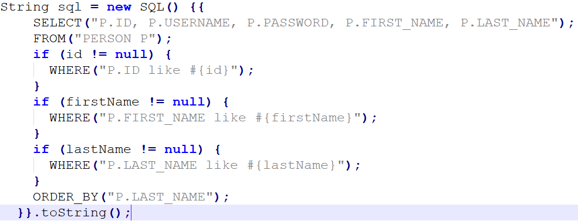

[toc]
# ssm整合学习-Mybatis
## 1，Mybatis

### 1.1  Mybatis概述

#### 1.1.1  Mybatis概念

> * MyBatis 是一款优秀的==持久层框架==，用于简化 JDBC 开发
>
> * MyBatis 本是 Apache 的一个开源项目iBatis, 2010年这个项目由apache software foundation 迁移到了google code，并且改名为MyBatis 。2013年11月迁移到Github
>
> * 官网：https://mybatis.org/mybatis-3/zh/index.html 

**持久层：**

* 负责将数据到保存到数据库的那一层代码。

  以后开发我们会将操作数据库的Java代码作为持久层。而Mybatis就是对jdbc代码进行了封装。

* JavaEE三层架构：表现层、业务层、持久层

  三层架构在后期会给大家进行讲解，今天先简单的了解下即可。

**框架：**

* 框架就是一个半成品软件，是一套可重用的、通用的、软件基础代码模型
* 在框架的基础之上构建软件编写更加高效、规范、通用、可扩展

了解了什么是Mybatis后，接下来说说以前 `JDBC代码` 的缺点以及Mybatis又是如何解决的。

#### 1.1.2  JDBC 缺点

下面是 JDBC 代码，我们通过该代码分析都存在什么缺点：


* 硬编码

  * 注册驱动、获取连接

    上图标1的代码有很多字符串，而这些是连接数据库的四个基本信息，以后如果要将Mysql数据库换成其他的关系型数据库的话，这四个地方都需要修改，如果放在此处就意味着要修改我们的源代码。

  * SQL语句

    上图标2的代码。如果表结构发生变化，SQL语句就要进行更改。这也不方便后期的维护。

* 操作繁琐

  * 手动设置参数

  * 手动封装结果集

#### 1.1.3  Mybatis 优化

* 硬编码可以配置到 ==配置文件==
* 操作繁琐的地方mybatis都==自动完成==


下图是持久层框架的使用占比。


### 1.2  Mybatis快速入门

**需求：查询user表中所有的数据**

* 创建user表，添加数据

  ```sql
  create database mybatis;
  use mybatis;
  
  drop table if exists tb_user;
  
  create table tb_user(
  	id int primary key auto_increment,
  	username varchar(20),
  	password varchar(20),
  	gender char(1),
  	addr varchar(30)
  );
  
  INSERT INTO tb_user VALUES (1, 'zhangsan', '123', '男', '北京');
  INSERT INTO tb_user VALUES (2, '李四', '234', '女', '天津');
  INSERT INTO tb_user VALUES (3, '王五', '11', '男', '西安');
  ```

* 创建模块，导入坐标

  在创建好的模块中的 pom.xml 配置文件中添加依赖的坐标

  ```xml
  <dependencies>
      <!--mybatis 依赖-->
      <dependency>
          <groupId>org.mybatis</groupId>
          <artifactId>mybatis</artifactId>
          <version>3.5.5</version>
      </dependency>
  
      <!--mysql 驱动-->
      <dependency>
          <groupId>mysql</groupId>
          <artifactId>mysql-connector-java</artifactId>
          <version>5.1.46</version>
      </dependency>
  
      <!--junit 单元测试-->
      <dependency>
          <groupId>junit</groupId>
          <artifactId>junit</artifactId>
          <version>4.13</version>
          <scope>test</scope>
      </dependency>
  
      <!-- 添加slf4j日志api -->
      <dependency>
          <groupId>org.slf4j</groupId>
          <artifactId>slf4j-api</artifactId>
          <version>1.7.20</version>
      </dependency>
      <!-- 添加logback-classic依赖 -->
      <dependency>
          <groupId>ch.qos.logback</groupId>
          <artifactId>logback-classic</artifactId>
          <version>1.2.3</version>
      </dependency>
      <!-- 添加logback-core依赖 -->
      <dependency>
          <groupId>ch.qos.logback</groupId>
          <artifactId>logback-core</artifactId>
          <version>1.2.3</version>
      </dependency>
  </dependencies>
  ```

  注意：需要在项目的 resources 目录下创建logback的配置文件

* 编写 MyBatis 核心配置文件 -- > 替换连接信息 解决硬编码问题

  在模块下的 resources 目录下创建mybatis的配置文件 `mybatis-config.xml`，内容如下：

  ```xml
  <?xml version="1.0" encoding="UTF-8" ?>
  <!DOCTYPE configuration
          PUBLIC "-//mybatis.org//DTD Config 3.0//EN"
          "http://mybatis.org/dtd/mybatis-3-config.dtd">
  <configuration>
  
      <typeAliases>
          <package name="com.itheima.pojo"/>
      </typeAliases>
      
      <!--
      environments：配置数据库连接环境信息。可以配置多个environment，通过default属性切换不同的environment
      -->
      <environments default="development">
          <environment id="development">
              <transactionManager type="JDBC"/>
              <dataSource type="POOLED">
                  <!--数据库连接信息-->
                  <property name="driver" value="com.mysql.jdbc.Driver"/>
                  <property name="url" value="jdbc:mysql:///mybatis?useSSL=false"/>
                  <property name="username" value="root"/>
                  <property name="password" value="1234"/>
              </dataSource>
          </environment>
  
          <environment id="test">
              <transactionManager type="JDBC"/>
              <dataSource type="POOLED">
                  <!--数据库连接信息-->
                  <property name="driver" value="com.mysql.jdbc.Driver"/>
                  <property name="url" value="jdbc:mysql:///mybatis?useSSL=false"/>
                  <property name="username" value="root"/>
                  <property name="password" value="1234"/>
              </dataSource>
          </environment>
      </environments>
      <mappers>
         <!--加载sql映射文件-->
         <mapper resource="UserMapper.xml"/>
      </mappers>
  </configuration>
  ```

* 编写 SQL 映射文件 --> 统一管理sql语句，解决硬编码问题

  在模块的 `resources` 目录下创建映射配置文件 `UserMapper.xml`，内容如下：

  ```xml
  <?xml version="1.0" encoding="UTF-8" ?>
  <!DOCTYPE mapper PUBLIC "-//mybatis.org//DTD Mapper 3.0//EN" "http://mybatis.org/dtd/mybatis-3-mapper.dtd">
  <mapper namespace="test">
      <select id="selectAll" resultType="com.itheima.pojo.User">
          select * from tb_user;
      </select>
  </mapper>
  ```

* 编码

  * 在 `com.itheima.pojo` 包下创建 User类

    ```java
    public class User {
        private int id;
        private String username;
        private String password;
        private String gender;
        private String addr;
        
        //省略了 setter 和 getter
    }
    ```

  * 在 `com.itheima` 包下编写 MybatisDemo 测试类

    ```java
    public class MyBatisDemo {
    
        public static void main(String[] args) throws IOException {
            //1. 加载mybatis的核心配置文件，获取 SqlSessionFactory
            String resource = "mybatis-config.xml";
            InputStream inputStream = Resources.getResourceAsStream(resource);
            SqlSessionFactory sqlSessionFactory = new SqlSessionFactoryBuilder().build(inputStream);
    
            //2. 获取SqlSession对象，用它来执行sql
            SqlSession sqlSession = sqlSessionFactory.openSession();
            //3. 执行sql
            List<User> users = sqlSession.selectList("test.selectAll"); //参数是一个字符串，该字符串必须是映射配置文件的namespace.id
            System.out.println(users);
            //4. 释放资源
            sqlSession.close();
        }
    }
    ```

**解决SQL映射文件的警告提示：**

在入门案例映射配置文件中存在报红的情况。问题如下：


* 产生的原因：Idea和数据库没有建立连接，不识别表信息。但是大家一定要记住，它并不影响程序的执行。
* 解决方式：在Idea中配置MySQL数据库连接。

IDEA中配置MySQL数据库连接

* 点击IDEA右边框的 `Database` ，在展开的界面点击 `+` 选择 `Data Source` ，再选择 `MySQL`
* 在弹出的界面进行基本信息的填写
* 而此界面就和 `navicat` 工具一样可以进行数据库的操作。也可以编写SQL语句


### 1.3  Mapper代理开发
#### 1.3.1  Mapper代理开发概述
之前我们写的代码是基本使用方式，它也存在硬编码的问题，如下：


这里调用 `selectList()` 方法传递的参数是映射配置文件中的 namespace.id值。这样写也不便于后期的维护。如果使用 Mapper 代理方式（如下图）则不存在硬编码问题。


通过上面的描述可以看出 Mapper 代理方式的目的：

* 解决原生方式中的硬编码
* 简化后期执行SQL

Mybatis 官网也是推荐使用 Mapper 代理的方式。下图是截止官网的图片


#### 1.3.2  使用Mapper代理要求
使用Mapper代理方式，必须满足以下要求：

* 定义与SQL映射文件同名的Mapper接口，并且将Mapper接口和SQL映射文件放置在同一目录下。如下图：


* 设置SQL映射文件的namespace属性为Mapper接口全限定名


* 在 Mapper 接口中定义方法，方法名就是SQL映射文件中sql语句的id，并保持参数类型和返回值类型一致


#### 1.3.3  案例代码实现

* 在 `com.itheima.mapper` 包下创建 UserMapper接口，代码如下：

  ```java
  public interface UserMapper {
      List<User> selectAll();
      User selectById(int id);
  }
  ```

* 在 `resources` 下创建 `com/itheima/mapper` 目录，并在该目录下创建 UserMapper.xml 映射配置文件

  ```xml
  <!--
      namespace:名称空间。必须是对应接口的全限定名
  -->
  <mapper namespace="com.itheima.mapper.UserMapper">
      <select id="selectAll" resultType="com.itheima.pojo.User">
          select *
          from tb_user;
      </select>
  </mapper>
  ```

* 在 `com.itheima` 包下创建 MybatisDemo2 测试类，代码如下：

  ```java
  /**
   * Mybatis 代理开发
   */
  public class MyBatisDemo2 {
  
      public static void main(String[] args) throws IOException {
  
          //1. 加载mybatis的核心配置文件，获取 SqlSessionFactory
          String resource = "mybatis-config.xml";
          InputStream inputStream = Resources.getResourceAsStream(resource);
          SqlSessionFactory sqlSessionFactory = new SqlSessionFactoryBuilder().build(inputStream);
  
          //2. 获取SqlSession对象，用它来执行sql
          SqlSession sqlSession = sqlSessionFactory.openSession();
          //3. 执行sql
          //3.1 获取UserMapper接口的代理对象
          UserMapper userMapper = sqlSession.getMapper(UserMapper.class);
          List<User> users = userMapper.selectAll();
  
          System.out.println(users);
          //4. 释放资源
          sqlSession.close();
      }
  }
  ```

==注意：==

如果Mapper接口名称和SQL映射文件名称相同，并在同一目录下，则可以使用包扫描的方式简化SQL映射文件的加载。也就是将核心配置文件的加载映射配置文件的配置修改为

```xml
<mappers>
    <!--加载sql映射文件-->
    <!-- <mapper resource="com/itheima/mapper/UserMapper.xml"/>-->
    <!--Mapper代理方式-->
    <package name="com.itheima.mapper"/>
</mappers>
```

### 1.4  核心配置文件
核心配置文件中现有的配置之前已经给大家进行了解释，而核心配置文件中还可以配置很多内容。我们可以通过查询官网看可以配置的内容


#### 1.4.1  多环境配置
在核心配置文件的 `environments` 标签中其实是可以配置多个 `environment` ，使用 `id` 给每段环境起名，在 `environments` 中使用 `default='环境id'` 来指定使用哪儿段配置。我们一般就配置一个 `environment` 即可。

```xml
<environments default="development">
    <environment id="development">
        <transactionManager type="JDBC"/>
        <dataSource type="POOLED">
            <!--数据库连接信息-->
            <property name="driver" value="com.mysql.jdbc.Driver"/>
            <property name="url" value="jdbc:mysql:///mybatis?useSSL=false"/>
            <property name="username" value="root"/>
            <property name="password" value="1234"/>
        </dataSource>
    </environment>

    <environment id="test">
        <transactionManager type="JDBC"/>
        <dataSource type="POOLED">
            <!--数据库连接信息-->
            <property name="driver" value="com.mysql.jdbc.Driver"/>
            <property name="url" value="jdbc:mysql:///mybatis?useSSL=false"/>
            <property name="username" value="root"/>
            <property name="password" value="1234"/>
        </dataSource>
    </environment>
</environments>=
```
#### 1.4.2  类型别名

在映射配置文件中的 `resultType` 属性需要配置数据封装的类型（类的全限定名）。而每次这样写是特别麻烦的，Mybatis 提供了 `类型别名`(typeAliases) 可以简化这部分的书写。

首先需要现在核心配置文件中配置类型别名，也就意味着给pojo包下所有的类起了别名（别名就是类名），不区分大小写。内容如下：

```xml
<typeAliases>
    <!--name属性的值是实体类所在包-->
    <package name="com.itheima.pojo"/> 
</typeAliases>
```

通过上述的配置，我们就可以简化映射配置文件中 `resultType` 属性值的编写

```xml
<mapper namespace="com.itheima.mapper.UserMapper">
    <select id="selectAll" resultType="user">
        select * from tb_user;
    </select>
</mapper>
```

## Mybatis练习
> * 查询
>   * 查询所有数据
>   * 查询详情
>   * 条件查询
> * 添加
> * 修改
>   * 修改全部字段
>   * 修改动态字段
> * 删除
>   * 删除一个
>   * 批量删除

### 1.1  环境准备

* 数据库表（tb_brand）及数据准备

  ```sql
  -- 删除tb_brand表
  drop table if exists tb_brand;
  -- 创建tb_brand表
  create table tb_brand
  (
      -- id 主键
      id           int primary key auto_increment,
      -- 品牌名称
      brand_name   varchar(20),
      -- 企业名称
      company_name varchar(20),
      -- 排序字段
      ordered      int,
      -- 描述信息
      description  varchar(100),
      -- 状态：0：禁用  1：启用
      status       int
  );
  -- 添加数据
  insert into tb_brand (brand_name, company_name, ordered, description, status)
  values ('三只松鼠', '三只松鼠股份有限公司', 5, '好吃不上火', 0),
         ('华为', '华为技术有限公司', 100, '华为致力于把数字世界带入每个人、每个家庭、每个组织，构建万物互联的智能世界', 1),
         ('小米', '小米科技有限公司', 50, 'are you ok', 1);
  ```

* 实体类 Brand

  在 `com.itheima.pojo` 包下创建 Brand 实体类。

  ```java
  public class Brand {
      // id 主键
      private Integer id;
      // 品牌名称
      private String brandName;
      // 企业名称
      private String companyName;
      // 排序字段
      private Integer ordered;
      // 描述信息
      private String description;
      // 状态：0：禁用  1：启用
      private Integer status;
      
      //省略 setter and getter。自己写时要补全这部分代码
  }
  ```

* 编写测试用例

  测试代码需要在 `test/java` 目录下创建包及测试用例。项目结构如下：
  
* 安装 MyBatisX 插件

  * MybatisX 是一款基于 IDEA 的快速开发插件，为效率而生。

  * 主要功能

    * XML映射配置文件 和 接口方法 间相互跳转
    * 根据接口方法生成 statement 

### 1.2  查询所有数据
* 编写接口方法：Mapper接口

  * 参数：无

    查询所有数据功能是不需要根据任何条件进行查询的，所以此方法不需要参数。
    
    
  * 结果：List<Brand>

    我们会将查询出来的每一条数据封装成一个 `Brand` 对象，而多条数据封装多个 `Brand` 对象，需要将这些对象封装到List集合中返回。
    
    
    
#### 1.2.1  编写接口方法

在 `com.itheima.mapper` 包写创建名为 `BrandMapper` 的接口。并在该接口中定义 `List<Brand> selectAll()` 方法。

```java
public interface BrandMapper {

    /**
     * 查询所有
     */
    List<Brand> selectAll();
}
```

#### 1.2.2  编写SQL语句

在 `reources` 下创建 `com/itheima/mapper` 目录结构，并在该目录下创建名为 `BrandMapper.xml` 的映射配置文件

```xml
<?xml version="1.0" encoding="UTF-8" ?>
<!DOCTYPE mapper
        PUBLIC "-//mybatis.org//DTD Mapper 3.0//EN"
        "http://mybatis.org/dtd/mybatis-3-mapper.dtd">

<mapper namespace="com.itheima.mapper.BrandMapper">
    <select id="selectAll" resultType="brand">
        select *
        from tb_brand;
    </select>
</mapper>
```

#### 1.2.3  编写测试方法

在 `MybatisTest` 类中编写测试查询所有的方法

```java
@Test
public void testSelectAll() throws IOException {
    //1. 获取SqlSessionFactory
    String resource = "mybatis-config.xml";
    InputStream inputStream = Resources.getResourceAsStream(resource);
    SqlSessionFactory sqlSessionFactory = new SqlSessionFactoryBuilder().build(inputStream);

    //2. 获取SqlSession对象
    SqlSession sqlSession = sqlSessionFactory.openSession();

    //3. 获取Mapper接口的代理对象
    BrandMapper brandMapper = sqlSession.getMapper(BrandMapper.class);

    //4. 执行方法
    List<Brand> brands = brandMapper.selectAll();
    System.out.println(brands);

    //5. 释放资源
    sqlSession.close();

}
```

执行测试方法结果如下：


从上面结果我们看到了问题，有些数据封装成功了，而有些数据并没有封装成功。为什么这样呢？

这个问题可以通过两种方式进行解决：

* 给字段起别名
* 使用resultMap定义字段和属性的映射关系

#### 1.2.4  起别名解决上述问题

从上面结果可以看到 `brandName` 和 `companyName` 这两个属性的数据没有封装成功，查询 实体类 和 表中的字段 发现，在实体类中属性名是 `brandName` 和 `companyName` ，而表中的字段名为 `brand_name` 和 `company_name`，如下图所示 。那么我们只需要保持这两部分的名称一致这个问题就迎刃而解。


我们可以在写sql语句时给这两个字段起别名，将别名定义成和属性名一致即可。

```xml
<select id="selectAll" resultType="brand">
    select
    id, brand_name as brandName, company_name as companyName, ordered, description, status
    from tb_brand;
</select>
```

而上面的SQL语句中的字段列表书写麻烦，如果表中还有更多的字段，同时其他的功能也需要查询这些字段时就显得我们的代码不够精炼。Mybatis提供了`sql` 片段可以提高sql的复用性。

**SQL片段：**

* 将需要复用的SQL片段抽取到 `sql` 标签中

  ```xml
  <sql id="brand_column">
  	id, brand_name as brandName, company_name as companyName, ordered, description, status
  </sql>
  ```
  
  id属性值是唯一标识，引用时也是通过该值进行引用。

* 在原sql语句中进行引用

  使用 `include` 标签引用上述的 SQL 片段，而 `refid` 指定上述 SQL 片段的id值。

  ```xml
  <select id="selectAll" resultType="brand">
      select
      <include refid="brand_column" />
      from tb_brand;
  </select>
  ```

#### 1.2.5  使用resultMap解决上述问题

起别名 + sql片段的方式可以解决上述问题，但是它也存在问题。如果还有功能只需要查询部分字段，而不是查询所有字段，那么我们就需要再定义一个 SQL 片段，这就显得不是那么灵活。

那么我们也可以使用resultMap来定义字段和属性的映射关系的方式解决上述问题。

* 在映射配置文件中使用resultMap定义 字段 和 属性 的映射关系

  ```xml
  <resultMap id="brandResultMap" type="brand">
      <!--
              id：完成主键字段的映射
                  column：表的列名
                  property：实体类的属性名
              result：完成一般字段的映射
                  column：表的列名
                  property：实体类的属性名
          -->
      <result column="brand_name" property="brandName"/>
      <result column="company_name" property="companyName"/>
  </resultMap>
  ```

  > 注意：在上面只需要定义 字段名 和 属性名 不一样的映射，而一样的则不需要专门定义出来。

* SQL语句正常编写

  ```xml
  <select id="selectAll" resultMap="brandResultMap">
      select *
      from tb_brand;
  </select>
  ```

#### 1.2.6  小结

实体类属性名 和 数据库表列名 不一致，不能自动封装数据

* ==起别名：==在SQL语句中，对不一样的列名起别名，别名和实体类属性名一样
  * 可以定义 <sql>片段，提升复用性 
* ==resultMap：==定义<resultMap> 完成不一致的属性名和列名的映射

而我们最终选择使用 resultMap的方式。查询映射配置文件中查询所有的 statement 书写如下：

```xml
 <resultMap id="brandResultMap" type="brand">
     <!--
            id：完成主键字段的映射
                column：表的列名
                property：实体类的属性名
            result：完成一般字段的映射
                column：表的列名
                property：实体类的属性名
        -->
     <result column="brand_name" property="brandName"/>
     <result column="company_name" property="companyName"/>
</resultMap>


<select id="selectAll" resultMap="brandResultMap">
    select *
    from tb_brand;
</select>
```

### 1.3  查询详情


有些数据的属性比较多，在页面表格中无法全部实现，而只会显示部分，而其他属性数据的查询可以通过 `查看详情` 来进行查询，如上图所示。

查看详情功能实现步骤：

* 编写接口方法：Mapper接口

  

  * 参数：id

    查看详情就是查询某一行数据，所以需要根据id进行查询。而id以后是由页面传递过来。

  * 结果：Brand

    根据id查询出来的数据只要一条，而将一条数据封装成一个Brand对象即可

* 编写SQL语句：SQL映射文件

  

* 执行方法、进行测试

#### 1.3.1  编写接口方法

在 `BrandMapper` 接口中定义根据id查询数据的方法 

```java
/**
  * 查看详情：根据Id查询
  */
Brand selectById(int id);
```

#### 1.3.2  编写SQL语句

在 `BrandMapper.xml` 映射配置文件中编写 `statement`，使用 `resultMap` 而不是使用 `resultType`

```xml
<select id="selectById"  resultMap="brandResultMap">
    select *
    from tb_brand where id = #{id};
</select>
```

> 注意：上述SQL中的 #{id}先这样写，一会我们再详细讲解

#### 1.3.3  编写测试方法

在 `test/java` 下的 `com.itheima.mapper`  包下的 `MybatisTest类中` 定义测试方法

```java
 @Test
public void testSelectById() throws IOException {
    //接收参数，该id以后需要传递过来
    int id = 1;

    //1. 获取SqlSessionFactory
    String resource = "mybatis-config.xml";
    InputStream inputStream = Resources.getResourceAsStream(resource);
    SqlSessionFactory sqlSessionFactory = new SqlSessionFactoryBuilder().build(inputStream);

    //2. 获取SqlSession对象
    SqlSession sqlSession = sqlSessionFactory.openSession();

    //3. 获取Mapper接口的代理对象
    BrandMapper brandMapper = sqlSession.getMapper(BrandMapper.class);

    //4. 执行方法
    Brand brand = brandMapper.selectById(id);
    System.out.println(brand);

    //5. 释放资源
    sqlSession.close();
}
```

执行测试方法结果如下：


#### 1.3.4  参数占位符

查询到的结果很好理解就是id为1的这行数据。而这里我们需要看控制台显示的SQL语句，能看到使用？进行占位。说明我们在映射配置文件中的写的 `#{id}` 最终会被？进行占位。接下来我们就聊聊映射配置文件中的参数占位符。

mybatis提供了两种参数占位符：

* #{} ：执行SQL时，会将 #{} 占位符替换为？，将来自动设置参数值。从上述例子可以看出使用#{} 底层使用的是 `PreparedStatement`

* ${} ：拼接SQL。底层使用的是 `Statement`，会存在SQL注入问题。如下图将 映射配置文件中的 #{} 替换成 ${} 来看效果

  ```xml
  <select id="selectById"  resultMap="brandResultMap">
      select *
      from tb_brand where id = ${id};
  </select>
  ```

  重新运行查看结果如下：

  

> ==注意：==从上面两个例子可以看出，以后开发我们使用 #{} 参数占位符。

> 该 PreparedStatement接口继承Statement，并与之在两方面有所不同：
PreparedStatement 实例包含已编译的 SQL 语句。这就是使语句“准备好”。包含于 PreparedStatement 对象中的 SQL 语句可具有一个或多个 IN 参数。IN参数的值在 SQL 语句创建时未被指定。相反的，该语句为每个 IN 参数保留一个问号（“？”）作为占位符。每个问号的值必须在该语句执行之前，通过适当的setXXX 方法来提供。
由于 PreparedStatement 对象已预编译过，所以其执行速度要快于 Statement 对象。因此，多次执行的 SQL 语句经常创建为 PreparedStatement 对象，以提高效率。
作为 Statement 的子类，PreparedStatement 继承了 Statement 的所有功能。另外它还添加了一整套方法，用于设置发送给数据库以取代 IN 参数占位符的值。同时，三种方法 execute、 executeQuery 和 executeUpdate 已被更改以使之不再需要参数。这些方法的 Statement 形式（接受 SQL 语句参数的形式）不应该用于 PreparedStatement 对象。

#### 1.3.5  parameterType使用

对于有参数的mapper接口方法，我们在映射配置文件中应该配置 `ParameterType` 来指定参数类型。只不过该属性都可以省略。如下图：

```xml
<select id="selectById" parameterType="int" resultMap="brandResultMap">
    select *
    from tb_brand where id = ${id};
</select>
```

#### 1.3.6  SQL语句中特殊字段处理

以后肯定会在SQL语句中写一下特殊字符，比如某一个字段大于某个值，如下图


可以看出报错了，因为映射配置文件是xml类型的问题，而 > < 等这些字符在xml中有特殊含义，所以此时我们需要将这些符号进行转义，可以使用以下两种方式进行转义

* 转义字符

   `&lt;` 就是 `<` 的转义字符。
   
   
* <![CDATA[内容]]>
    

### 1.4  多条件查询
* 条件表达式
* 如何连接

条件字段 `企业名称`  和 `品牌名称` 需要进行模糊查询，所以条件应该是：

简单的分析后，我们来看功能实现的步骤：

* 编写接口方法
  * 参数：所有查询条件
  * 结果：List<Brand>
* 在映射配置文件中编写SQL语句

* 编写测试方法并执行

#### 1.4.1  编写接口方法

在 `BrandMapper` 接口中定义多条件查询的方法。

而该功能有三个参数，我们就需要考虑定义接口时，参数应该如何定义。Mybatis针对多参数有多种实现

* 使用 `@Param("参数名称")` 标记每一个参数，在映射配置文件中就需要使用 `#{参数名称}` 进行占位

  ```java
  List<Brand> selectByCondition(@Param("status") int status, @Param("companyName") String companyName,@Param("brandName") String brandName);
  ```

* 将多个参数封装成一个 实体对象 ，将该实体对象作为接口的方法参数。该方式要求在映射配置文件的SQL中使用 `#{内容}` 时，里面的内容必须和实体类属性名保持一致。

  ```java
  List<Brand> selectByCondition(Brand brand);
  ```

* 将多个参数封装到map集合中，将map集合作为接口的方法参数。该方式要求在映射配置文件的SQL中使用 `#{内容}` 时，里面的内容必须和map集合中键的名称一致。

  ```
  List<Brand> selectByCondition(Map map);
  ```

#### 1.4.2  编写SQL语句

在 `BrandMapper.xml` 映射配置文件中编写 `statement`，使用 `resultMap` 而不是使用 `resultType`

```xml
<select id="selectByCondition" resultMap="brandResultMap">
    select *
    from tb_brand
    where status = #{status}
    and company_name like #{companyName}
    and brand_name like #{brandName}
</select>
```

#### 1.4.3  编写测试方法

在 `test/java` 下的 `com.itheima.mapper`  包下的 `MybatisTest类中` 定义测试方法

```java
@Test
public void testSelectByCondition() throws IOException {
    //接收参数
    int status = 1;
    String companyName = "华为";
    String brandName = "华为";

    // 处理参数
    companyName = "%" + companyName + "%";
    brandName = "%" + brandName + "%";

    //1. 获取SqlSessionFactory
    String resource = "mybatis-config.xml";
    InputStream inputStream = Resources.getResourceAsStream(resource);
    SqlSessionFactory sqlSessionFactory = new SqlSessionFactoryBuilder().build(inputStream);
    //2. 获取SqlSession对象
    SqlSession sqlSession = sqlSessionFactory.openSession();
    //3. 获取Mapper接口的代理对象
    BrandMapper brandMapper = sqlSession.getMapper(BrandMapper.class);

    //4. 执行方法
	//方式一 ：接口方法参数使用 @Param 方式调用的方法
    //List<Brand> brands = brandMapper.selectByCondition(status, companyName, brandName);
    //方式二 ：接口方法参数是 实体类对象 方式调用的方法
     //封装对象
    /* Brand brand = new Brand();
        brand.setStatus(status);
        brand.setCompanyName(companyName);
        brand.setBrandName(brandName);*/
    
    //List<Brand> brands = brandMapper.selectByCondition(brand);
    
    //方式三 ：接口方法参数是 map集合对象 方式调用的方法
    Map map = new HashMap();
    map.put("status" , status);
    map.put("companyName", companyName);
    map.put("brandName" , brandName);
    List<Brand> brands = brandMapper.selectByCondition(map);
    System.out.println(brands);

    //5. 释放资源
    sqlSession.close();
}
```

#### 1.4.4  动态SQL

上述功能实现存在很大的问题。用户在输入条件时，肯定不会所有的条件都填写，这个时候我们的SQL语句就不能那样写的

例如用户只输入 当前状态 时，SQL语句就是

```sql
select * from tb_brand where status = #{status}
```

而用户如果只输入企业名称时，SQL语句就是

```sql
select * from tb_brand where company_name like #{companName}
```

而用户如果输入了 `当前状态` 和 `企业名称 ` 时，SQL语句又不一样

```sql
select * from tb_brand where status = #{status} and company_name like #{companName}
```

针对上述的需要，Mybatis对动态SQL有很强大的支撑：

> * if
>
> * choose (when, otherwise)
>
> * trim (where, set)
>
> * foreach

我们先学习 if 标签和 where 标签：

* if 标签：条件判断

  * test 属性：逻辑表达式

  ```xml
  <select id="selectByCondition" resultMap="brandResultMap">
      select *
      from tb_brand
      where
          <if test="status != null">
              status = #{status}
          </if>
          <if test="companyName != null and companyName != '' ">
              and company_name like #{companyName}
          </if>
          <if test="brandName != null and brandName != '' ">
              and brand_name like #{brandName}
          </if>
  </select>
  ```

  如上的这种SQL语句就会根据传递的参数值进行动态的拼接。如果此时status和companyName有值那么就会值拼接这两个条件。
  
  
  
  但是它也存在问题，如果此时给的参数值是

  ```java
  Map map = new HashMap();
  // map.put("status" , status);
  map.put("companyName", companyName);
  map.put("brandName" , brandName);
  ```

  拼接的SQL语句就变成了

  ```sql
  select * from tb_brand where and company_name like ? and brand_name like ?
  ```

  而上面的语句中 where 关键后直接跟 and 关键字，这就是一条错误的SQL语句。这个就可以使用 where 标签解决

* where 标签

  * 作用：
    * 替换where关键字
    * 会动态的去掉第一个条件前的 and 
    * 如果所有的参数没有值则不加where关键字

  ```xml
  <select id="selectByCondition" resultMap="brandResultMap">
      select *
      from tb_brand
      <where>
          <if test="status != null">
              and status = #{status}
          </if>
          <if test="companyName != null and companyName != '' ">
              and company_name like #{companyName}
          </if>
          <if test="brandName != null and brandName != '' ">
              and brand_name like #{brandName}
          </if>
      </where>
  </select>
  ```

  > 注意：需要给每个条件前都加上 and 关键字。
  
### 1.5 单个条件（动态SQL）

在查询时只能选择 `品牌名称`、`当前状态`、`企业名称` 这三个条件中的一个，但是用户到底选择哪儿一个，我们并不能确定。这种就属于单个条件的动态SQL语句。 

这种需求需要使用到  `choose（when，otherwise）标签`  实现，  而 `choose` 标签类似于Java 中的switch语句。

通过一个案例来使用这些标签

#### 1.5.1  编写接口方法

在 `BrandMapper` 接口中定义单条件查询的方法。

```java
/**
  * 单条件动态查询
  * @param brand
  * @return
  */
List<Brand> selectByConditionSingle(Brand brand);
```

#### 1.5.2  编写SQL语句

在 `BrandMapper.xml` 映射配置文件中编写 `statement`，使用 `resultMap` 而不是使用 `resultType`

```xml
<select id="selectByConditionSingle" resultMap="brandResultMap">
    select *
    from tb_brand
    <where>
        <choose><!--相当于switch-->
            <when test="status != null"><!--相当于case-->
                status = #{status}
            </when>
            <when test="companyName != null and companyName != '' "><!--相当于case-->
                company_name like #{companyName}
            </when>
            <when test="brandName != null and brandName != ''"><!--相当于case-->
                brand_name like #{brandName}
            </when>
        </choose>
    </where>
</select>
```

#### 1.5.3  编写测试方法

在 `test/java` 下的 `com.itheima.mapper`  包下的 `MybatisTest类中` 定义测试方法

```java
@Test
public void testSelectByConditionSingle() throws IOException {
    //接收参数
    int status = 1;
    String companyName = "华为";
    String brandName = "华为";

    // 处理参数
    companyName = "%" + companyName + "%";
    brandName = "%" + brandName + "%";

    //封装对象
    Brand brand = new Brand();
    //brand.setStatus(status);
    brand.setCompanyName(companyName);
    //brand.setBrandName(brandName);

    //1. 获取SqlSessionFactory
    String resource = "mybatis-config.xml";
    InputStream inputStream = Resources.getResourceAsStream(resource);
    SqlSessionFactory sqlSessionFactory = new SqlSessionFactoryBuilder().build(inputStream);
    //2. 获取SqlSession对象
    SqlSession sqlSession = sqlSessionFactory.openSession();
    //3. 获取Mapper接口的代理对象
    BrandMapper brandMapper = sqlSession.getMapper(BrandMapper.class);
    //4. 执行方法
    List<Brand> brands = brandMapper.selectByConditionSingle(brand);
    System.out.println(brands);

    //5. 释放资源
    sqlSession.close();
}
```

执行测试方法结果如下：


### 1.6  添加数据

* 编写接口方法

  

  参数：除了id之外的所有的数据。id对应的是表中主键值，而主键我们是 ==自动增长== 生成的。

* 编写SQL语句

  

* 编写测试方法并执行

明确了该功能实现的步骤后，接下来我们进行具体的操作。

#### 1.6.1  编写接口方法

在 `BrandMapper` 接口中定义添加方法。

```java
 /**
   * 添加
   */
void add(Brand brand);
```

#### 1.6.2  编写SQL语句

在 `BrandMapper.xml` 映射配置文件中编写添加数据的 `statement`

```xml
<insert id="add">
    insert into tb_brand (brand_name, company_name, ordered, description, status)
    values (#{brandName}, #{companyName}, #{ordered}, #{description}, #{status});
</insert>
```

#### 1.6.3  编写测试方法

在 `test/java` 下的 `com.itheima.mapper`  包下的 `MybatisTest类中` 定义测试方法

```java
@Test
public void testAdd() throws IOException {
    //接收参数
    int status = 1;
    String companyName = "波导手机";
    String brandName = "波导";
    String description = "手机中的战斗机";
    int ordered = 100;

    //封装对象
    Brand brand = new Brand();
    brand.setStatus(status);
    brand.setCompanyName(companyName);
    brand.setBrandName(brandName);
    brand.setDescription(description);
    brand.setOrdered(ordered);

    //1. 获取SqlSessionFactory
    String resource = "mybatis-config.xml";
    InputStream inputStream = Resources.getResourceAsStream(resource);
    SqlSessionFactory sqlSessionFactory = new SqlSessionFactoryBuilder().build(inputStream);
    //2. 获取SqlSession对象
    SqlSession sqlSession = sqlSessionFactory.openSession();
    //SqlSession sqlSession = sqlSessionFactory.openSession(true); //设置自动提交事务，这种情况不需要手动提交事务了
    //3. 获取Mapper接口的代理对象
    BrandMapper brandMapper = sqlSession.getMapper(BrandMapper.class);
    //4. 执行方法
    brandMapper.add(brand);
    //提交事务
    sqlSession.commit();
    //5. 释放资源
    sqlSession.close();
}
```

执行结果如下：


#### 1.6.4  添加-主键返回

在数据添加成功后，有时候需要获取插入数据库数据的主键（主键是自增长）。

明白了什么时候 `主键返回` 。接下来我们简单模拟一下，在添加完数据后打印id属性值，能打印出来说明已经获取到了。

我们将上面添加品牌数据的案例中映射配置文件里 `statement` 进行修改，如下

```xml
<insert id="add" useGeneratedKeys="true" keyProperty="id">
    insert into tb_brand (brand_name, company_name, ordered, description, status)
    values (#{brandName}, #{companyName}, #{ordered}, #{description}, #{status});
</insert>
```

> 在 insert 标签上添加如下属性：
>
> * useGeneratedKeys：是够获取自动增长的主键值。true表示获取
> * keyProperty  ：指定将获取到的主键值封装到哪儿个属性里

### 1.7  修改


如图所示是修改页面，用户在该页面书写需要修改的数据，点击 `提交` 按钮，就会将数据库中对应的数据进行修改。注意一点，如果哪儿个输入框没有输入内容，我们是将表中数据对应字段值替换为空白还是保留字段之前的值？答案肯定是保留之前的数据。

接下来我们就具体来实现

#### 1.7.1  编写接口方法

在 `BrandMapper` 接口中定义修改方法。

```java
 /**
   * 修改
   */
void update(Brand brand);
```

> 上述方法参数 Brand 就是封装了需要修改的数据，而id肯定是有数据的，这也是和添加方法的区别。

#### 1.7.2  编写SQL语句

在 `BrandMapper.xml` 映射配置文件中编写修改数据的 `statement`。

```xml
<update id="update">
    update tb_brand
    <set>
        <if test="brandName != null and brandName != ''">
            brand_name = #{brandName},
        </if>
        <if test="companyName != null and companyName != ''">
            company_name = #{companyName},
        </if>
        <if test="ordered != null">
            ordered = #{ordered},
        </if>
        <if test="description != null and description != ''">
            description = #{description},
        </if>
        <if test="status != null">
            status = #{status}
        </if>
    </set>
    where id = #{id};
</update>
```

> *set* 标签可以用于动态包含需要更新的列，忽略其它不更新的列。

#### 1.7.3  编写测试方法

在 `test/java` 下的 `com.itheima.mapper`  包下的 `MybatisTest类中` 定义测试方法

```java
@Test
public void testUpdate() throws IOException {
    //接收参数
    int status = 0;
    String companyName = "波导手机";
    String brandName = "波导";
    String description = "波导手机,手机中的战斗机";
    int ordered = 200;
    int id = 6;

    //封装对象
    Brand brand = new Brand();
    brand.setStatus(status);
    //        brand.setCompanyName(companyName);
    //        brand.setBrandName(brandName);
    //        brand.setDescription(description);
    //        brand.setOrdered(ordered);
    brand.setId(id);

    //1. 获取SqlSessionFactory
    String resource = "mybatis-config.xml";
    InputStream inputStream = Resources.getResourceAsStream(resource);
    SqlSessionFactory sqlSessionFactory = new SqlSessionFactoryBuilder().build(inputStream);
    //2. 获取SqlSession对象
    SqlSession sqlSession = sqlSessionFactory.openSession();
    //SqlSession sqlSession = sqlSessionFactory.openSession(true);
    //3. 获取Mapper接口的代理对象
    BrandMapper brandMapper = sqlSession.getMapper(BrandMapper.class);
    //4. 执行方法
    int count = brandMapper.update(brand);
    System.out.println(count);
    //提交事务
    sqlSession.commit();
    //5. 释放资源
    sqlSession.close();
}
```

执行测试方法结果如下：


从结果中SQL语句可以看出，只修改了 `status`  字段值，因为我们给的数据中只给Brand实体对象的 `status` 属性设置值了。这就是 `set` 标签的作用。

### 1.8  删除一行数据



如上图所示，每行数据后面都有一个 `删除` 按钮，当用户点击了该按钮，就会将改行数据删除掉。那我们就需要思考，这种删除是根据什么进行删除呢？是通过主键id删除，因为id是表中数据的唯一标识。

接下来就来实现该功能。

#### 1.8.1  编写接口方法

在 `BrandMapper` 接口中定义根据id删除方法。

```java
/**
  * 根据id删除
  */
void deleteById(int id);
```

#### 1.8.2  编写SQL语句

在 `BrandMapper.xml` 映射配置文件中编写删除一行数据的 `statement`

```xml
<delete id="deleteById">
    delete from tb_brand where id = #{id};
</delete>
```

#### 1.8.3  编写测试方法

在 `test/java` 下的 `com.itheima.mapper`  包下的 `MybatisTest类中` 定义测试方法

```java
 @Test
public void testDeleteById() throws IOException {
    //接收参数
    int id = 6;

    //1. 获取SqlSessionFactory
    String resource = "mybatis-config.xml";
    InputStream inputStream = Resources.getResourceAsStream(resource);
    SqlSessionFactory sqlSessionFactory = new SqlSessionFactoryBuilder().build(inputStream);
    //2. 获取SqlSession对象
    SqlSession sqlSession = sqlSessionFactory.openSession();
    //SqlSession sqlSession = sqlSessionFactory.openSession(true);
    //3. 获取Mapper接口的代理对象
    BrandMapper brandMapper = sqlSession.getMapper(BrandMapper.class);
    //4. 执行方法
    brandMapper.deleteById(id);
    //提交事务
    sqlSession.commit();
    //5. 释放资源
    sqlSession.close();
}
```

运行过程只要没报错，直接到数据库查询数据是否还存在。

### 1.9  批量删除


如上图所示，用户可以选择多条数据，然后点击上面的 `删除` 按钮，就会删除数据库中对应的多行数据。


#### 1.9.1  编写接口方法

在 `BrandMapper` 接口中定义删除多行数据的方法。

```java
/**
  * 批量删除
  */
void deleteByIds(int[] ids);
```

> 参数是一个数组，数组中存储的是多条数据的id

#### 1.9.2  编写SQL语句

在 `BrandMapper.xml` 映射配置文件中编写删除多条数据的 `statement`。

编写SQL时需要遍历数组来拼接SQL语句。Mybatis 提供了 `foreach` 标签供我们使用

**foreach 标签**

用来迭代任何可迭代的对象（如数组，集合）。

* collection 属性：
  * mybatis会将数组参数，封装为一个Map集合。
       * 默认：array = 数组
    * 使用@Param注解改变map集合的默认key的名称
* item 属性：本次迭代获取到的元素。
* separator 属性：集合项迭代之间的分隔符。`foreach` 标签不会错误地添加多余的分隔符。也就是最后一次迭代不会加分隔符。
* open 属性：该属性值是在拼接SQL语句之前拼接的语句，只会拼接一次
* close 属性：该属性值是在拼接SQL语句拼接后拼接的语句，只会拼接一次

```xml
<delete id="deleteByIds">
    delete from tb_brand where id
    in
    <foreach collection="array" item="id" separator="," open="(" close=")">
        #{id}
    </foreach>
    ;
</delete>
```

> 假如数组中的id数据是{1,2,3}，那么拼接后的sql语句就是：
>
> ```sql
> delete from tb_brand where id in (1,2,3);
> ```

#### 1.9.3  编写测试方法

在 `test/java` 下的 `com.itheima.mapper`  包下的 `MybatisTest类中` 定义测试方法

```java
@Test
public void testDeleteByIds() throws IOException {
    //接收参数
    int[] ids = {5,7,8};

    //1. 获取SqlSessionFactory
    String resource = "mybatis-config.xml";
    InputStream inputStream = Resources.getResourceAsStream(resource);
    SqlSessionFactory sqlSessionFactory = new SqlSessionFactoryBuilder().build(inputStream);
    //2. 获取SqlSession对象
    SqlSession sqlSession = sqlSessionFactory.openSession();
    //SqlSession sqlSession = sqlSessionFactory.openSession(true);
    //3. 获取Mapper接口的代理对象
    BrandMapper brandMapper = sqlSession.getMapper(BrandMapper.class);
    //4. 执行方法
    brandMapper.deleteByIds(ids);
    //提交事务
    sqlSession.commit();
    //5. 释放资源
    sqlSession.close();
}
```

### 1.10  Mybatis参数传递

Mybatis 接口方法中可以接收各种各样的参数，如下：

* 多个参数
* 单个参数：单个参数又可以是如下类型
  * POJO 类型
  * Map 集合类型
  * Collection 集合类型
  * List 集合类型
  * Array 类型
  * 其他类型

#### 1.10.1  多个参数

如下面的代码，就是接收两个参数，而接收多个参数需要使用 `@Param` 注解，那么为什么要加该注解呢？这个问题要弄明白就必须来研究Mybatis 底层对于这些参数是如何处理的。

```java
User select(@Param("username") String username,@Param("password") String password);
```

```xml
<select id="select" resultType="user">
	select *
    from tb_user
    where 
    	username=#{username}
    	and password=#{password}
</select>
```

我们在接口方法中定义多个参数，Mybatis 会将这些参数封装成 Map 集合对象，值就是参数值，而键在没有使用 `@Param` 注解时有以下命名规则：

* 以 arg 开头  ：第一个参数就叫 arg0，第二个参数就叫 arg1，以此类推。如：

  > map.put("arg0"，参数值1);
  >
  > map.put("arg1"，参数值2);

* 以 param 开头 ： 第一个参数就叫 param1，第二个参数就叫 param2，依次类推。如：

  > map.put("param1"，参数值1);
  >
  > map.put("param2"，参数值2);

**代码验证：**

* 在 `UserMapper` 接口中定义如下方法

  ```java
  User select(String username,String password);
  ```

* 在 `UserMapper.xml` 映射配置文件中定义SQL

  ```xml
  <select id="select" resultType="user">
  	select *
      from tb_user
      where 
      	username=#{arg0}
      	and password=#{arg1}
  </select>
  ```

  或者

  ```xml
  <select id="select" resultType="user">
  	select *
      from tb_user
      where 
      	username=#{param1}
      	and password=#{param2}
  </select>
  ```

* 运行代码结果如下

  

  在映射配合文件的SQL语句中使用用 `arg` 开头的和 `param` 书写，代码的可读性会变的特别差，此时可以使用 `@Param` 注解。

在接口方法参数上使用 `@Param` 注解，Mybatis 会将 `arg` 开头的键名替换为对应注解的属性值。

**代码验证：**

* 在 `UserMapper` 接口中定义如下方法，在 `username` 参数前加上 `@Param` 注解

  ```java
  User select(@Param("username") String username, String password);
  ```

  Mybatis 在封装 Map 集合时，键名就会变成如下：

  > map.put("username"，参数值1);
  >
  > map.put("arg1"，参数值2);
  >
  > map.put("param1"，参数值1);
  >
  > map.put("param2"，参数值2);

* 在 `UserMapper.xml` 映射配置文件中定义SQL

  ```xml
  <select id="select" resultType="user">
  	select *
      from tb_user
      where 
      	username=#{username}
      	and password=#{param2}
  </select>
  ```

* 运行程序结果没有报错。而如果将 `#{}` 中的 `username` 还是写成  `arg0` 

  ```xml
  <select id="select" resultType="user">
  	select *
      from tb_user
      where 
      	username=#{arg0}
      	and password=#{param2}
  </select>
  ```

* 运行程序则可以看到错误

  

==结论：以后接口参数是多个时，在每个参数上都使用 `@Param` 注解。这样代码的可读性更高。==

#### 1.10.2  单个参数

* POJO 类型

  直接使用。要求 `属性名` 和 `参数占位符名称` 一致

* Map 集合类型

  直接使用。要求 `map集合的键名` 和 `参数占位符名称` 一致

* Collection 集合类型

  Mybatis 会将集合封装到 map 集合中，如下：

  > map.put("arg0"，collection集合);
  >
  > map.put("collection"，collection集合;

  ==可以使用 `@Param` 注解替换map集合中默认的 arg 键名。==

* List 集合类型

  Mybatis 会将集合封装到 map 集合中，如下：

  > map.put("arg0"，list集合);
  >
  > map.put("collection"，list集合);
  >
  > map.put("list"，list集合);

  ==可以使用 `@Param` 注解替换map集合中默认的 arg 键名。==

* Array 类型

  Mybatis 会将集合封装到 map 集合中，如下：

  > map.put("arg0"，数组);
  >
  > map.put("array"，数组);

  ==可以使用 `@Param` 注解替换map集合中默认的 arg 键名。==

* 其他类型

  比如int类型，`参数占位符名称` 叫什么都可以。尽量做到见名知意

## 2，注解实现CRUD

使用注解开发会比配置文件开发更加方便。如下就是使用注解进行开发

```java
@Select(value = "select * from tb_user where id = #{id}")
public User select(int id);
```

> ==注意：==
>
> * 注解是用来替换映射配置文件方式配置的，所以使用了注解，就不需要再映射配置文件中书写对应的 `statement`

Mybatis 针对 CURD 操作都提供了对应的注解，已经做到见名知意。如下：

* 查询 ：@Select
* 添加 ：@Insert
* 修改 ：@Update
* 删除 ：@Delete

接下来我们做一个案例来使用 Mybatis 的注解开发

**代码实现：**

* 将之前案例中 `UserMapper.xml` 中的 根据id查询数据 的 `statement` 注释掉

* 在 `UserMapper` 接口的 `selectById` 方法上添加注解


* 运行测试程序也能正常查询到数据

我们课程上只演示这一个查询的注解开发，其他的同学们下来可以自己实现，都是比较简单。

==注意：==在官方文档中 `入门` 中有这样的一段话：



所以，==注解完成简单功能，配置文件完成复杂功能。==

而我们之前写的动态 SQL 就是复杂的功能，如果用注解使用的话，就需要使用到 Mybatis 提供的SQL构建器来完成，而对应的代码如下：



上述代码将java代码和SQL语句融到了一块，使得代码的可读性大幅度降低。


