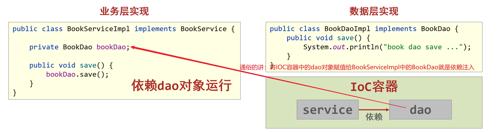
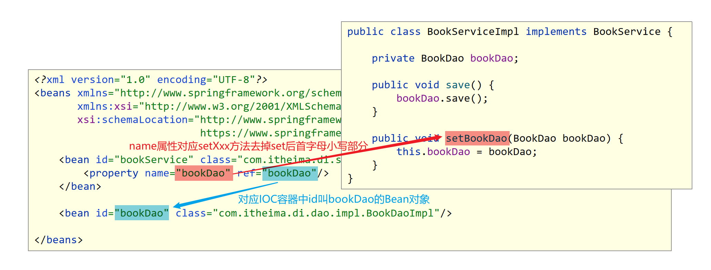
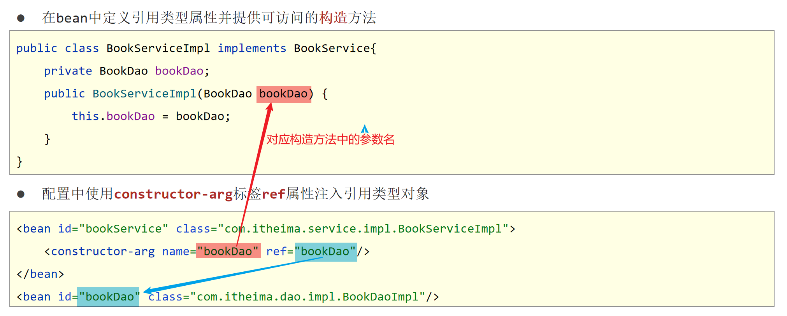
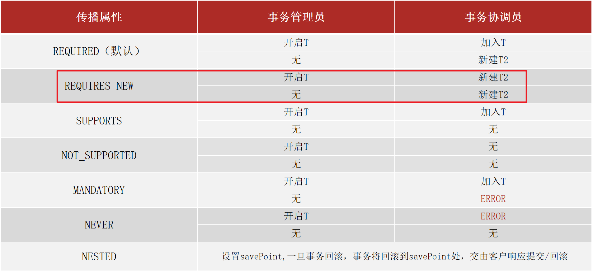

[toc]
# 一、Spring简介
## 1 Spring介绍
> 我们为什么要学习Spring框架？

- Spring技术是JavaEE开发必备技能，企业开发技术选型命中率>==90%==

- 专业角度
  - ==**简化开发**==，降低企业级开发的复杂性
  - **==框架整合==**，高效整合其他技术，提高企业级应用开发与运行效率


### 1.1 掌握目标
- 简化开发
  - ==IOC(反转控制)==
  - ==AOP(面向切面编程)==
    - ==事务处理==

- 框架整合
  - MyBatis
  - MyBatis-plus
  - Struts
  - Struts2
  - Hibernate
  - ……

- 学习Spring框架设计思想
- 学习基础操作，思考操作与思想间的联系
- 学习案例，熟练应用操作的同时，体会思想

## 2 初识Spring
> 目前我们使用的是Spring几版本？

### 2.1 Spring家族
- 官网：https://spring.io
- Spring发展到今天已经形成了一种开发的生态圈，Spring提供了若干个项目，每个项目用于完成特定的功能。


### 2.2 Spring发展史


## 3 Spring体系结构
> 通过系统架构图，Spring能不能进行数据层开发？Spring能不能进行web层开发？

### 3.1 Spring Framework系统架构图
- Spring Framework是Spring生态圈中最基础的项目，是其他项目的根基


### 3.2 Spring Framework学习路线


## 4 Spring核心概念
> 问题1：目前我们的代码存在什么问题以及怎么解决这些问题？

> 问题2：请描述什么是IOC，什么是DI？

### 4.1 目前我们代码存在的问题

- 代码书写现状
  - 耦合度偏高
- 解决方案
  - 使用对象时，在程序中不要主动使用new产生对象，转换为由外部提供对象

### 4.2 核心概念
- ==IOC（Inversion of Control）控制反转==

  使用对象时，由主动new产生对象转换为由==外部==提供对象，此过程中对象创建控制权由程序转移到外部，此思想称为控制反转。通俗的讲就是“==将new对象的权利交给Spring，我们从Spring中获取对象使用即可==”

- Spring技术对IoC思想进行了实现

  - Spring提供了一个容器，称为==IOC容器==，用来充当IoC思想中的“外部”
  - IOC容器负责对象的创建、初始化等一系列工作，被创建或被管理的对象在IoC容器中统称为==Bean==

- ==DI（Dependency Injection）依赖注入==
  
  - 在容器中建立bean与bean之间的依赖关系的整个过程，称为依赖注入。



- 目标：充分解耦
  - 使用IoC容器管理bean（IOC)
  - 在IoC容器内将有依赖关系的bean进行关系绑定（DI）
- 最终效果
  - 使用对象时不仅可以直接从IoC容器中获取，并且获取到的bean已经绑定了所有的依赖关系

# 二、IOC和DI入门案例
## 1 IOC入门案例
> 标签中id属性和class属性的作用是什么？
### 1.1 门案例思路分析
1. 管理什么？(Service与Dao)
2. 如何将被管理的对象告知IOC容器？(配置文件)
3. 被管理的对象交给IOC容器，如何获取到IoC容器？(接口)
4. IOC容器得到后，如何从容器中获取bean？(接口方法)
5. 使用Spring导入哪些坐标？(pom.xml)

### 1.2 实现步骤
```
【第一步】导入Spring坐标
【第二步】定义Spring管理的类（接口）
【第三步】创建Spring配置文件，配置对应类作为Spring管理的bean对象
【第四步】初始化IOC容器（Spring核心容器/Spring容器），通过容器获取bean对象
```

### 1.3 实现代码
**【第一步】导入Spring坐标**

```xml
<dependencies>
    <!--导入spring的坐标spring-context，对应版本是5.2.10.RELEASE-->
    <dependency>
        <groupId>org.springframework</groupId>
        <artifactId>spring-context</artifactId>
        <version>5.2.10.RELEASE</version>
    </dependency>
</dependencies>
```

**【第二步】定义Spring管理的类（接口）**

- BookDao接口和BookDaoImpl实现类

```java
public interface BookDao {
    public void save();
}

public class BookDaoImpl implements BookDao {
    public void save() {
        System.out.println("book dao save ...");
    }
}
```

- BookService接口和BookServiceImpl实现类

```java
public interface BookService {
    public void save();
}

public class BookServiceImpl implements BookService {
    private BookDao bookDao = new BookDaoImpl();
    public void save() {
        System.out.println("book service save ...");
        bookDao.save();
    }
}
```

**【第三步】创建Spring配置文件，配置对应类作为Spring管理的bean对象**

- 定义applicationContext.xml配置文件并配置BookServiceImpl

```xml
<?xml version="1.0" encoding="UTF-8"?>
<beans xmlns="http://www.springframework.org/schema/beans"
       xmlns:xsi="http://www.w3.org/2001/XMLSchema-instance"
       xsi:schemaLocation="http://www.springframework.org/schema/beans http://www.springframework.org/schema/beans/spring-beans.xsd">
 
    <!--
		bean标签：表示配置bean
    	id属性：表示给bean起名字
    	class属性：表示给bean定义类型
	-->
    <bean id="bookService" class="com.itheima.service.impl.BookServiceImpl"></bean>

</beans>
```

**==注意事项：bean定义时id属性在同一个上下文中(IOC容器中)不能重复==**

**【第四步】初始化IOC容器（Spring核心容器/Spring容器），通过容器获取Bean对象**

```java
public class App {
    public static void main(String[] args) {
        //1.创建IoC容器对象，加载spring核心配置文件
        ApplicationContext ctx = new ClassPathXmlApplicationContext("applicationContext.xml");
        //2 从IOC容器中获取Bean对象(BookService对象)
        BookService bookService= (BookService)ctx.getBean("bookService");
        //3 调用Bean对象(BookService对象)的方法
        bookService.save();
    }
}
```


## 2 DI入门案例【重点】
> 标签中name属性和ref属性的作用是什么？

### 2.1 DI入门案例思路分析
1. 基于IOC管理bean
2. Service中使用new形式创建的Dao对象是否保留？(否)
3. Service中需要的Dao对象如何进入到Service中？(提供方法)
4. Service与Dao间的关系如何描述？(配置)

### 2.2 实现步骤

```
【第一步】删除使用new的形式创建对象的代码
【第二步】提供依赖对象对应的setter方法
【第三步】配置service与dao之间的关系
```

### 2.3 实现代码
**【第一步】删除使用new的形式创建对象的代码**

```java
public class BookServiceImpl implements BookService {
    private BookDao bookDao;  //【第一步】删除使用new的形式创建对象的代码
    public void save() {
        System.out.println("book service save ...");
        bookDao.save();
    }
}
```
**【第二步】提供依赖对象对应的setter方法**

```java
public class BookServiceImpl implements BookService {
    private BookDao bookDao;
    public void save() {
        System.out.println("book service save ...");
        bookDao.save();
    }
    //【第二步】提供依赖对象对应的setter方法
    public void setBookDao(BookDao bookDao) {
        this.bookDao = bookDao;
    }
}
```

**【第三步】配置service与dao之间的关系**

> 在applicationContext.xml中配置

```xml
<?xml version="1.0" encoding="UTF-8"?>
<beans xmlns="http://www.springframework.org/schema/beans"
       xmlns:xsi="http://www.w3.org/2001/XMLSchema-instance"
       xsi:schemaLocation="http://www.springframework.org/schema/beans http://www.springframework.org/schema/beans/spring-beans.xsd">
    <!--
		bean标签：表示配置bean
    	id属性：表示给bean起名字
    	class属性：表示给bean定义类型
	-->
    <bean id="bookDao" class="com.itheima.dao.impl.BookDaoImpl"/>

    <bean id="bookService" class="com.itheima.service.impl.BookServiceImpl">
        <!--配置server与dao的关系
			property标签：表示配置当前bean的属性
        	name属性：表示配置哪一个具体的属性
        	ref属性：表示参照哪一个bean
		-->
        <property name="bookDao" ref="bookDao"/>
    </bean>
</beans>
```


# 三、Bean的基础配置
> 问题1：在\<bean>标签上如何配置别名？

> 问题2：Bean的默认作用范围是什么？如何修改？

## 1 Bean基础配置【重点】
### 配置说明


## 2 Bean别名配置
### 配置说明


## 3 Bean作用范围配置【重点】
### 配置说明

> 扩展：scope的取值不仅仅只有singleton和prototype，还有request、session、application、 websocket ，表示创建出的对象放置在web容器(tomcat)对应的位置。比如：request表示保存到request域中。


> 最后给大家说明一下：在我们的实际开发当中，绝大部分的Bean是单例的，也就是说绝大部分Bean不需要配置scope属性。

# 四、Bean的实例化
> Bean的实例化方式有几种？
## 1 Bean是如何创建的【理解】
bean本质上就是对象，创建bean使用构造方法完成

## 2 实例化Bean的三种方式
### 2.1 构造方法方式【重点】
- BookDaoImpl实现类

```java
public class BookDaoImpl implements BookDao {
    public BookDaoImpl() {
        System.out.println("book dao constructor is running ....");
    }
    public void save() {
        System.out.println("book dao save ...");
    }
}
```

- applicationContext.xml配置

```xml
<!--方式一：构造方法实例化bean-->
<bean id="bookDao" class="com.itheima.dao.impl.BookDaoImpl"/>
```

- AppForInstanceBook测试类

```java
public class AppForInstanceBook {
    public static void main(String[] args) {
        ApplicationContext ctx = new ClassPathXmlApplicationContext("applicationContext.xml");

        BookDao bookDao = (BookDao) ctx.getBean("bookDao");

        bookDao.save();
    }
}
```


==注意：无参构造方法如果不存在，将抛出异常`BeanCreationException`==

### 2.2 静态工厂方式
- OrderDao接口和OrderDaoImpl实现类

```java
public interface OrderDao {
    public void save();
}
public class OrderDaoImpl implements OrderDao {
    public void save() {
        System.out.println("order dao save ...");
    }
}
```

- OrderDaoFatory工厂类

```java
//静态工厂创建对象
public class OrderDaoFactory {
    public static OrderDao getOrderDao(){
        System.out.println("factory setup....");
        return new OrderDaoImpl();
    }
}
```

- applicationContext.xml配置

```xml
<!--方式二：使用静态工厂实例化bean-->
<bean id="orderDao" class="com.itheima.factory.OrderDaoFactory" factory-method="getOrderDao"/>
```


### 2.3 实例工厂方式
- UserDao接口和UserDaoImpl实现类

```java
public interface UserDao {
    public void save();
}
public class UserDaoImpl implements UserDao {
    public void save() {
        System.out.println("user dao save ...");
    }
}
```

- UserDaoFactory工厂类

```java
//实例工厂创建对象
public class UserDaoFactory {
    public UserDao getUserDao(){
        return new UserDaoImpl();
    }
}
```

- applicationContext.xml配置

```xml
<!--方式三：使用实例工厂实例化bean-->
<bean id="userFactory" class="com.itheima.factory.UserDaoFactory"/>

<bean id="userDao" factory-method="getUserDao" factory-bean="userFactory"/>
```


- AppForInstanceUser测试类

```java
public class AppForInstanceUser {
    public static void main(String[] args) {
        //        //创建实例工厂对象
        //        UserDaoFactory userDaoFactory = new UserDaoFactory();
        //        //通过实例工厂对象创建对象
        //        UserDao userDao = userDaoFactory.getUserDao();
        //        userDao.save();
        ApplicationContext ctx = new ClassPathXmlApplicationContext("applicationContext.xml");
        UserDao userDao = (UserDao) ctx.getBean("userDao");
        userDao.save();
    }
}
```

### 2.4 实现FactoryBean\<T>方式【扩展,了解】
- 定义UserDaoFactoryBean实现FactoryBean\<UserDao>

> UserDaoFactoryBean中实例化什么类型的对象泛型就是该类型。

```java
//FactoryBean创建对象
public class UserDaoFactoryBean implements FactoryBean<UserDao> {
    //代替原始实例工厂中创建对象的方法
    public UserDao getObject() throws Exception {
        return new UserDaoImpl();
    }

    public Class<?> getObjectType() {
        return UserDao.class;
    }
}
```

- applicationContext.xml配置

```xml
<!--方式四：使用FactoryBean实例化bean-->
<bean id="userDao" class="com.itheima.factory.UserDaoFactoryBean"/>
```

> 使用之前的AppForInstanceUser测试类去运行看结果就行了。注意配置文件中id="userDao"是否重复。

# 五、Bean的生命周期【了解】
> 问题1：多例的Bean能够配置并执行销毁的方法？

> 问题2：如何做才执行Bean销毁的方法？

## 1 生命周期相关概念介绍
- 生命周期：从创建到消亡的完整过程
- bean生命周期：bean从创建到销毁的整体过程
- bean生命周期控制：在bean创建后到销毁前做一些事情

## 2 代码演示
### 2.1 Bean生命周期控制
- 提供生命周期控制方法

```java
public class BookDaoImpl implements BookDao {
    public void save() {
        System.out.println("book dao save ...");
    }
    //表示bean初始化对应的操作
    public void init(){
        System.out.println("init...");
    }
    //表示bean销毁前对应的操作
    public void destory(){
        System.out.println("destory...");
    }
}
```

- applicationContext.xml配置

```xml
<!--init-method：设置bean初始化生命周期回调函数,此处填写init方法名-->
<!--destroy-method：设置bean销毁生命周期回调函数，仅适用于单例对象，此处填写destory方法名-->
<bean id="bookDao" class="com.itheima.dao.impl.BookDaoImpl" init-method="init" destroy-method="destory"/>
```

- 测试类

```java
public class AppForLifeCycle {
    public static void main( String[] args ) {
        //此处需要使用实现类类型，接口类型没有close方法
        ClassPathXmlApplicationContext ctx = new ClassPathXmlApplicationContext("applicationContext.xml");
        BookDao bookDao = (BookDao) ctx.getBean("bookDao");
        bookDao.save();
        //关闭容器，执行销毁的方法
        ctx.close();
    }
}
```
### 2.2 Bean生命周期控制
- 实现InitializingBean, DisposableBean接口

```java
public class BookServiceImpl implements BookService, InitializingBean, DisposableBean {
    private BookDao bookDao;
    public void setBookDao(BookDao bookDao) {
        System.out.println("set .....");
        this.bookDao = bookDao;
    }
    public void save() {
        System.out.println("book service save ...");
        bookDao.save();
    }
    public void destroy() throws Exception {
        System.out.println("service destroy");
    }
    public void afterPropertiesSet() throws Exception {
        System.out.println("service init");
    }
}
```

> 测试类代码同《3.2.1 Bean生命周期控制》中的测试代码

## 3 Bean销毁时机

- 容器关闭前触发bean的销毁
- 关闭容器方式：
  - 手工关闭容器
    `ConfigurableApplicationContext`接口`close()`操作
  - 注册关闭钩子，在虚拟机退出前先关闭容器再退出虚拟机
    `ConfigurableApplicationContext`接口`registerShutdownHook()`操作

```java
public class AppForLifeCycle {
    public static void main( String[] args ) {
        //此处需要使用实现类类型，接口类型没有close方法
        ClassPathXmlApplicationContext ctx = new ClassPathXmlApplicationContext("applicationContext.xml");

        BookDao bookDao = (BookDao) ctx.getBean("bookDao");
        bookDao.save();
        //注册关闭钩子函数，在虚拟机退出之前回调此函数，关闭容器
        ctx.registerShutdownHook();
        //关闭容器
        //ctx.close();
    }
}
```
# 六、依赖注入(DI配置)
## 1 依赖注入方式【重点】
> 依赖注入有几种方式？

### 1.1 依赖注入的两种方式
- setter注入
  简单类型
  ==**引用类型(很常用)**==
- 构造器注入
  简单类型
  引用类型

### 1.2 setter方式注入
> setter方式注入使用什么子标签？

#### 引用类型


#### 简单类型


### 1.3 构造方式注入
> 构造方式注入使用什么子标签？

#### 引用类型


#### 简单类型
同上， 标签改成value

#### 参数适配【了解】


### 1.4 依赖注入方式选择

1. 强制依赖使用构造器进行，使用setter注入有概率不进行注入导致null对象出现
2. 可选依赖使用setter注入进行，灵活性强
3. Spring框架倡导使用构造器，第三方框架内部大多数采用构造器注入的形式进行数据初始化，相对严谨
4. 如果有必要可以两者同时使用，使用构造器注入完成强制依赖的注入，使用setter注入完成可选依赖的注入
5. 实际开发过程中还要根据实际情况分析，如果受控对象没有提供setter方法就必须使用构造器注入
6. **==自己开发的模块推荐使用setter注入==**

## 2 依赖自动装配【理解】
> 如何配置按照类型自动装配？

### 2.1 自动装配概念

- IoC容器根据bean所依赖的资源在容器中自动查找并注入到bean中的过程称为自动装配
- 自动装配方式
  ==按类型（常用）==
  按名称
  按构造方法
  不启用自动装配

### 2.2 自动装配类型
#### 依赖自动装配
```xml
<bean id="bookDao" class="com.itheima.dao.impl.BookDaoImpl"/>
<bean id="bookService" class="com.itheima.service.impl.BookServiceImpl" autowire="byType"/>
```

#### 依赖自动装配特征

1. 自动装配用于引用类型依赖注入，不能对简单类型进行操作
2. 使用按类型装配时（byType）必须保障容器中相同类型的bean唯一，推荐使用
3. 使用按名称装配时（byName）必须保障容器中具有指定名称的bean，因变量名与配置耦合，不推荐使用
4. 自动装配优先级低于setter注入与构造器注入，同时出现时自动装配配置失效

## 3 集合注入
### 3.1 注入数组类型数据
```xml
<property name="array">
    <array>
        <value>100</value>
        <value>200</value>
        <value>300</value>
    </array>
</property>
```
### 3.2 注入List类型数据
```xml
<property name="list">
    <list>
        <value>itcast</value>
        <value>itheima</value>
        <value>boxuegu</value>
        <value>chuanzhihui</value>
    </list>
</property>
```
### 3.3 注入Set类型数据
```xml
<property name="set">
    <set>
        <value>itcast</value>
        <value>itheima</value>
        <value>boxuegu</value>
        <value>boxuegu</value>
    </set>
</property>
```
### 3.4 注入Map类型数据
```xml
<property name="map">
    <map>
        <entry key="country" value="china"/>
        <entry key="province" value="henan"/>
        <entry key="city" value="kaifeng"/>
    </map>
</property>
```
### 3.5 注入Properties类型数据
```xml
<property name="properties">
    <props>
        <prop key="country">china</prop>
        <prop key="province">henan</prop>
        <prop key="city">kaifeng</prop>
    </props>
</property>
```

> 说明：property标签表示setter方式注入，构造方式注入constructor-arg标签内部也可以写\<array>、\<list>、\<set>、\<map>、\<props>标签

# 七、第三方资源配置管理
> 说明：以管理DataSource连接池对象为例讲解第三方资源配置管理

## 1 管理DataSource连接池对象
> 配置数据库连接参数时，注入驱动类名是用driverClassName还是driver？

### 1.1 管理Druid连接池【重点】
**数据库准备**

```sql
create database if not exists spring_db character set utf8;
use spring_db;
create table if not exists tbl_account(
    id int primary key auto_increment,
    name varchar(20),
    money double
);
insert into tbl_account values(null,'Tom',1000);
insert into tbl_account values(null,'Jerry',1000);
```

**【第一步】添加Druid连接池依赖**

```xml
<dependency>
    <groupId>com.alibaba</groupId>
    <artifactId>druid</artifactId>
    <version>1.1.16</version>
</dependency>
<dependency>
    <groupId>mysql</groupId>
    <artifactId>mysql-connector-java</artifactId>
    <version>5.1.47</version>
</dependency>
```
> 注意：除了添加以上两个依赖之外，别忘了添加spring-context依赖。

**【第二步】配置DruidDataSource连接池Bean对象**

```xml
<bean id="dataSource" class="com.alibaba.druid.pool.DruidDataSource">
    <property name="driverClassName" value="com.mysql.jdbc.Driver"/>
    <property name="url" value="jdbc:mysql://localhost:3306/spring_db"/>
    <property name="username" value="root"/>
    <property name="password" value="root"/>
</bean>
```

**【第三步】在测试类中从IOC容器中获取连接池对象并打印**

```java
public class App {
    public static void main(String[] args) {
        ApplicationContext ctx = new ClassPathXmlApplicationContext("applicationContext.xml");
        DataSource dataSource = (DataSource) ctx.getBean("dataSource");
        System.out.println(dataSource);
    }
}
```

### 1.2 管理c3p0连接池

**【第一步】添加c3p0连接池依赖**

```xml
<dependency>
    <groupId>c3p0</groupId>
    <artifactId>c3p0</artifactId>
    <version>0.9.1.2</version>
</dependency>
```

**【第二步】配置c3p0连接池Bean对象**

```xml
<bean id="dataSource" class="com.mchange.v2.c3p0.ComboPooledDataSource">
    <property name="driverClass" value="com.mysql.jdbc.Driver"/>
    <property name="jdbcUrl" value="jdbc:mysql://localhost:3306/spring_db"/>
    <property name="user" value="root"/>
    <property name="password" value="root"/>
    <property name="maxPoolSize" value="1000"/>
</bean>
```

> 注意：同一个Spring容器中不能有两个id="dataSource"的连接池。

**【第三步】在测试类中从IOC容器中获取连接池对象并打印**

```java
public class App {
    public static void main(String[] args) {
        ApplicationContext ctx = new ClassPathXmlApplicationContext("applicationContext.xml");
        DataSource dataSource = (DataSource) ctx.getBean("dataSource");
        System.out.println(dataSource);
    }
}
```

## 2 加载properties属性文件【重点】
> 目的：将数据库的连接参数抽取到一个单独的文件中，与Spring配置文件解耦。

> 问题1：如何解决使用EL表达式读取属性文件中的值结果读取到了系统属性问题？

> 问题2：加载properties文件写法标准写法该怎么写？

### 2.1 基本用法
**【第一步】编写jdbc.properties属性文件**

```properties
jdbc.driver=com.mysql.jdbc.Driver
jdbc.url=jdbc:mysql://127.0.0.1:3306/spring_db
jdbc.username=root
jdbc.password=root
```

**【第二步】在applicationContext.xml中开启开启context命名空间，加载jdbc.properties属性文件**


**==小技巧：如果同学们觉得上述复制粘贴方式不好改或者容易改错，其实idea是有提示功能的，注意不要选错就行了。有些版本的idea没有这个提示，那么就按照上面复制粘贴的方式改，改完之后可以做成live template模板，后期直接用。==**


```xml
<context:property-placeholder location="jdbc.properties"/>
```

**【第三步】在配置连接池Bean的地方使用EL表达式获取jdbc.properties属性文件中的值**

```xml
<bean class="com.alibaba.druid.pool.DruidDataSource">
    <property name="driverClassName" value="${jdbc.driver}"/>
    <property name="url" value="${jdbc.url}"/>
    <property name="username" value="${jdbc.username}"/>
    <property name="password" value="${jdbc.password}"/>
</bean>
```

> 配置完成之后，运行之前的获取Druid连接池代码，可以获取到连接池对象就表示配置成功。

### 2.2 配置不加载系统属性
**问题**

如果属性文件中配置的不是jdbc.username，而是username=root666，那么使用${username}获取到的不是root666，而是计算机的名称。

**原因**

系统属性的优先级比我们属性文件中的高，替换了我们的username=root666。

**解决**

解决1：换一个名称，例如不叫username，叫jdbc.username。

解决2：使用system-properties-mode="NEVER"属性表示不使用系统属性。

```properties
<context:property-placeholder location="jdbc.properties" system-properties-mode="NEVER"/>
```

### 2.3 加载properties文件写法
- 不加载系统属性

```xml
<context:property-placeholder location="jdbc.properties" system-properties-mode="NEVER"/>
```

- 加载多个properties文件
```xml
<context:property-placeholder location="jdbc.properties,msg.properties"/>
```
- 加载所有properties文件
```xml
<context:property-placeholder location="*.properties"/>
```
- 加载properties文件 **==标准格式==**
```xml
<context:property-placeholder location="classpath:*.properties"/>
```
- 加载properties文件标准格式
```xml
<context:property-placeholder location="classpath*:*.properties"/>
```
> classpath 是打包后的字节码放置的位置，会讲resource下面的内容放进去，可理解为resource下面的路径

# 八、Spring容器
## 1 Spring核心容器介绍
> 问题：按照Bean名称获取Bean有什么弊端，按照Bean类型获取Bean有什么弊端？

### 1.1 创建容器

- 方式一：类路径加载配置文件

```java
ApplicationContext ctx = new ClassPathXmlApplicationContext("applicationContext.xml");
```

- 方式二：文件路径加载配置文件

```java
ApplicationContext ctx = new FileSystemXmlApplicationContext("D:\\applicationContext.xml");
```

- 加载多个配置文件

```java
ApplicationContext ctx = new ClassPathXmlApplicationContext("bean1.xml", "bean2.xml");
```

### 1.2 获取bean对象

- 方式一：使用bean名称获取

> 弊端：需要自己强制类型转换

```java
BookDao bookDao = (BookDao) ctx.getBean("bookDao");
```

- **==方式二：使用bean名称获取并指定类型==**

> 弊端：推荐使用

```java
BookDao bookDao = ctx.getBean("bookDao", BookDao.class);
```

- 方式三：使用bean类型获取

> 弊端：如果IOC容器中同类型的Bean对象有多个，此处获取会报错

```java
BookDao bookDao = ctx.getBean(BookDao.class);
```
### 1.3 容器类层次结构


### 1.4 BeanFactory
- 类路径加载配置文件

```java
Resource resources = new ClassPathResource("applicationContext.xml");
BeanFactory bf = new XmlBeanFactory(resources);
BookDao bookDao = bf.getBean("bookDao", BookDao.class);
bookDao.save();
```
- BeanFactory创建完毕后，所有的Bean均为延迟加载，也就是说我们调用getBean()方法获取Bean对象时才创建Bean对象并返回给我们

## 2 Spring核心容器总结
### 2.1 容器相关
- BeanFactory是IoC容器的顶层接口，初始化BeanFactory对象时，加载的bean延迟加载
- ApplicationContext接口是Spring容器的核心接口，初始化时bean立即加载
- ApplicationContext接口提供基础的bean操作相关方法，通过其他接口扩展其功能
- ApplicationContext接口常用初始化类
  - **==ClassPathXmlApplicationContext(常用)==**
  - FileSystemXmlApplicationContext

### 2.2 bean相关


### 2.3 依赖注入相关


# 九、Spring注解开发
## 1 注解开发定义Bean对象【重点】
> 目的：xml配置Bean对象有些繁琐，使用注解简化Bean对象的定义

> 问题1：使用什么标签进行Spring注解包扫描？

> 问题2：@Component注解和@Controller、@Service、@Repository三个衍生注解有什么区别？

### 1.1 基本使用

**【第一步】在applicationContext.xml中开启Spring注解包扫描**

```xml
<?xml version="1.0" encoding="UTF-8"?>
<beans xmlns="http://www.springframework.org/schema/beans"
       xmlns:context="http://www.springframework.org/schema/context"
       xmlns:xsi="http://www.w3.org/2001/XMLSchema-instance"
       xsi:schemaLocation="
        http://www.springframework.org/schema/beans http://www.springframework.org/schema/beans/spring-beans.xsd
        http://www.springframework.org/schema/context http://www.springframework.org/schema/context/spring-context.xsd">
	 <!--扫描com.itheima包及其子包下的类中注解-->
    <context:component-scan base-package="com.itheima"/>
</beans>
```

**【第二步】在类上使用@Component注解定义Bean。**

```java
//@Component定义bean
@Component("bookDao")
public class BookDaoImpl implements BookDao {
    public void save() {
        System.out.println("book dao save ...");
    }
}
@Component
public class BookServiceImpl implements BookService {
    private BookDao bookDao;

    public void setBookDao(BookDao bookDao) {
        this.bookDao = bookDao;
    }

    public void save() {
        System.out.println("book service save ...");
        bookDao.save();
    }
}
```

> 补充说明：如果@Component注解没有使用参数指定Bean的名称，那么类名首字母小写就是Bean在IOC容器中的默认名称。例如：BookServiceImpl对象在IOC容器中的名称是bookServiceImpl。

**【第三步】在测试类中获取Bean对象**

```java
public class AppForAnnotation {
    public static void main(String[] args) {
        ApplicationContext ctx = new ClassPathXmlApplicationContext("applicationContext.xml");
        BookDao bookDao = (BookDao) ctx.getBean("bookDao");
        System.out.println(bookDao);
        //按类型获取bean
        BookService bookService = ctx.getBean(BookService.class);
        System.out.println(bookService);
    }
}
```

> 注意：在测试类中不要调用bookService的save方法，因为还没有给BookServiceImpl中的bookDao赋值，调用bookService的save方法会出现空指针异常。

### 1.2 @Component三个衍生注解
> 说明：加粗的注解为常用注解

- Spring提供 **`@Component`** 注解的三个衍生注解
  - **`@Controller`**：用于表现层bean定义
  - **`@Service`**：用于业务层bean定义
  - `@Repository`：用于数据层bean定义

```java
@Repository("bookDao")
public class BookDaoImpl implements BookDao {
}

@Service
public class BookServiceImpl implements BookService {
}

```

## 2 纯注解开发模式【重点】
> 问题1：配置类上使用什么注解表示该类是一个配置类？

> 问题2：配置类上使用什么注解进行Spring注解包扫描？

### 2.1 纯注解开发模式介绍

- Spring3.0开启了纯注解开发模式，使用Java类替代配置文件，开启了Spring快速开发赛道
- Java类代替Spring核心配置文件


- @Configuration注解用于设定当前类为配置类
- @ComponentScan注解用于设定扫描路径，此注解只能添加一次，多个数据请用数组格式

```java
@ComponentScan({com.itheima.service","com.itheima.dao"})
```

- 读取Spring核心配置文件初始化容器对象切换为读取Java配置类初始化容器对象

```java
//加载配置文件初始化容器
ApplicationContext ctx = new ClassPathXmlApplicationContext("applicationContext.xml");
//加载配置类初始化容器
ApplicationContext ctx = new AnnotationConfigApplicationContext(SpringConfig.class);
```

### 2.2 代码演示
**【第一步】定义配置类代替配置文件**

```java
//声明当前类为Spring配置类
@Configuration
//Spring注解扫描，相当于<context:component-scan base-package="com.itheima"/>
@ComponentScan("com.itheima")
//设置bean扫描路径，多个路径书写为字符串数组格式
//@ComponentScan({"com.itheima.service","com.itheima.dao"})
public class SpringConfig {
}
```

**【第二步】在测试类中加载配置类，获取Bean对象并使用**

```java
public class AppForAnnotation {
    public static void main(String[] args) {
        //AnnotationConfigApplicationContext加载Spring配置类初始化Spring容器
        ApplicationContext ctx = new AnnotationConfigApplicationContext(SpringConfig.class);
        BookDao bookDao = (BookDao) ctx.getBean("bookDao");
        System.out.println(bookDao);
        //按类型获取bean
        BookService bookService = ctx.getBean(BookService.class);
        System.out.println(bookService);
    }
}
```
## 3 注解开发Bean作用范围和生命周期管理
> 在类上使用什么注解定义Bean的作用范围？

### 3.1 bean作用范围注解配置
- 使用@Scope定义bean作用范围

```java
@Repository
@Scope("singleton")
public class BookDaoImpl implements BookDao {
}
```
### 3.2 bean生命周期注解配置
- 使用@PostConstruct、@PreDestroy定义bean生命周期

```java
@Repository
@Scope("singleton")
public class BookDaoImpl implements BookDao {
    public BookDaoImpl() {
        System.out.println("book dao constructor ...");
    }
    @PostConstruct
    public void init(){
        System.out.println("book init ...");
    }
    @PreDestroy
    public void destroy(){
        System.out.println("book destory ...");
    }
}
```

==**注意：@PostConstruct和@PreDestroy注解是jdk中提供的注解，从jdk9开始，jdk中的javax.annotation包被移除了，也就是说这两个注解就用不了了，可以额外导入一下依赖解决这个问题。**==

```xml
<dependency>
  <groupId>javax.annotation</groupId>
  <artifactId>javax.annotation-api</artifactId>
  <version>1.3.2</version>
</dependency>
```

## 4 注解开发依赖注入【重点】
> 问题1：请描述@Autowired注解是如何进行自动装配的？

> 问题2：请描述@Qualifier注解的作用

### 4.1 使用@Autowired注解开启自动装配模式（按类型）

```java
@Service
public class BookServiceImpl implements BookService {
    //@Autowired：注入引用类型，自动装配模式，默认按类型装配
    @Autowired
    private BookDao bookDao;

    public void save() {
        System.out.println("book service save ...");
        bookDao.save();
    }
}
```

> 说明：不管是使用配置文件还是配置类，都必须进行对应的Spring注解包扫描才可以使用。@Autowired默认按照类型自动装配，如果IOC容器中同类的Bean有多个，那么默认按照变量名和Bean的名称匹配，建议使用@Qualifier注解指定要装配的bean名称

==注意：自动装配基于反射设计创建对象并暴力反射对应属性为私有属性初始化数据，因此无需提供setter方法。==

### 4.2 使用@Qualifier注解指定要装配的bean名称

> 目的：解决IOC容器中同类型Bean有多个装配哪一个的问题

```java
@Service
public class BookServiceImpl implements BookService {
    //@Autowired：注入引用类型，自动装配模式，默认按类型装配
    @Autowired
    //@Qualifier：自动装配bean时按bean名称装配
    @Qualifier("bookDao")
    private BookDao bookDao;

    public void save() {
        System.out.println("book service save ...");
        bookDao.save();
    }
}
```

==注意：@Qualifier注解无法单独使用，必须配合@Autowired注解使用==

### 4.3 使用@Value实现简单类型注入

```java
@Repository("bookDao")
public class BookDaoImpl implements BookDao {
    //@Value：注入简单类型（无需提供set方法）
    @Value("${name}")
    private String name;

    public void save() {
        System.out.println("book dao save ..." + name);
    }
}
```

以上@Value注解中使用${name}从属性文件中读取name值，那么就需要在配置类或者配置文件中加载属性文件。

```java
@Configuration
@ComponentScan("com.itheima")
//@PropertySource加载properties配置文件
@PropertySource({"classpath:jdbc.properties"}) //{}可以省略不写
public class SpringConfig {
}
```

==注意：@PropertySource()中加载多文件请使用数组格式配置，不允许使用通配符*==

## 5 注解开发管理第三方Bean【重点】
> 导入自己定义的配置类有几种方式？

### **【第一步】单独定义配置类**

```java
public class JdbcConfig {
    //@Bean：表示当前方法的返回值是一个bean对象，添加到IOC容器中
    @Bean
    public DataSource dataSource(){
        DruidDataSource ds = new DruidDataSource();
        ds.setDriverClassName("com.mysql.jdbc.Driver");
        ds.setUrl("jdbc:mysql://localhost:3306/spring_db");
        ds.setUsername("root");
        ds.setPassword("root");
        return ds;
    }
}
```
### **【第二步】将独立的配置类加入核心配置**
#### 方式1：@Import注解导入式

```java
@Configuration
@ComponentScan("com.itheima")
//@Import:导入配置信息
@Import({JdbcConfig.class})
public class SpringConfig {
}
```

#### 方式2：@ComponentScan扫描式

```java
@Configuration
@ComponentScan({"com.itheima.config","com.itheima.service","com.itheima.dao"})  //只要com.itheima.config包扫到了就行，三个包可以合并写成com.itheima
public class SpringConfig {
}
```
## 6 注解开发为第三方Bean注入资源【重点】
> 配置类中如何注入简单类型数据，如何注入引用类型数据？
### 6.1 简单类型依赖注入

```java
public class JdbcConfig {
    //1.定义一个方法获得要管理的对象
    @Value("com.mysql.jdbc.Driver")
    private String driver;
    @Value("jdbc:mysql://localhost:3306/spring_db")
    private String url;
    @Value("root")
    private String userName;
    @Value("root")
    private String password;
    //2.@Bean：表示当前方法的返回值是一个bean对象，添加到IOC容器中
    @Bean
    public DataSource dataSource(){
        DruidDataSource ds = new DruidDataSource();
        ds.setDriverClassName(driver);
        ds.setUrl(url);
        ds.setUsername(userName);
        ds.setPassword(password);
        return ds;
    }
}
```

> 说明：如果@Value()中使用了EL表达式读取properties属性文件中的内容，那么就需要加载properties属性文件。

### 6.2 引用类型依赖注入

```java
//Spring会自动从IOC容器中找到BookDao对象赋值给参数bookDao变量，如果没有就会报错。
@Bean 
public DataSource dataSource(BookDao bookDao){
    System.out.println(bookDao);
    DruidDataSource ds = new DruidDataSource();
    ds.setDriverClassName(driver);
    ds.setUrl(url);
    ds.setUsername(userName);
    ds.setPassword(password);
    return ds;
}
```

> 说明：引用类型注入只需要为bean定义方法设置形参即可，容器会根据类型自动装配对象

## 7 注解开发总结


# 十、Spring整合其他技术【重点】
## 1 Spring整合mybatis【重点】

### 1.1 思路分析

#### 问题导入

mybatis进行数据层操作的核心对象是谁？

#### 1.1.1 MyBatis程序核心对象分析


#### 1.1.2 整合MyBatis

- 使用SqlSessionFactoryBean封装SqlSessionFactory需要的环境信息


- 使用MapperScannerConfigurer加载Dao接口，创建代理对象保存到IOC容器中


### 1.2 代码实现
#### 问题导入
问题1：Spring整合mybatis的依赖叫什么？

问题2：Spring整合mybatis需要管理配置哪两个Bean，这两个Bean作用分别是什么？

#### 【前置工作】

1. 在pom.xml中添加spring-context、druid、mybatis、mysql-connector-java等基础依赖。
2. 准备service和dao层基础代码

```java
public interface AccountService {

    void save(Account account);

    void delete(Integer id);

    void update(Account account);

    List<Account> findAll();

    Account findById(Integer id);

}
@Service
public class AccountServiceImpl implements AccountService {

    @Autowired
    private AccountDao accountDao;

    public void save(Account account) {
        accountDao.save(account);
    }

    public void update(Account account){
        accountDao.update(account);
    }

    public void delete(Integer id) {
        accountDao.delete(id);
    }

    public Account findById(Integer id) {
        return accountDao.findById(id);
    }

    public List<Account> findAll() {
        return accountDao.findAll();
    }
}
public interface AccountDao {

    @Insert("insert into tbl_account(name,money)values(#{name},#{money})")
    void save(Account account);

    @Delete("delete from tbl_account where id = #{id} ")
    void delete(Integer id);

    @Update("update tbl_account set name = #{name} , money = #{money} where id = #{id} ")
    void update(Account account);

    @Select("select * from tbl_account")
    List<Account> findAll();

    @Select("select * from tbl_account where id = #{id} ")
    Account findById(Integer id);
}
```
#### **【第一步】导入Spring整合Mybatis依赖**

```xml
<dependency>
    <groupId>org.springframework</groupId>
    <artifactId>spring-jdbc</artifactId>
    <version>5.2.10.RELEASE</version>
</dependency>

<dependency>
    <groupId>org.mybatis</groupId>
    <artifactId>mybatis-spring</artifactId>
    <version>1.3.0</version>
</dependency>
```

#### **【第二步】创建JdbcConfig配置DataSource数据源**

```properties
jdbc.driver=com.mysql.jdbc.Driver
jdbc.url=jdbc:mysql://localhost:3306/spring_db?useSSL=false
jdbc.username=root
jdbc.password=root
```

```java
public class JdbcConfig {
    @Value("${jdbc.driver}")
    private String driver;
    @Value("${jdbc.url}")
    private String url;
    @Value("${jdbc.username}")
    private String userName;
    @Value("${jdbc.password}")
    private String password;

    @Bean
    public DataSource dataSource(){
        DruidDataSource ds = new DruidDataSource();
        ds.setDriverClassName(driver);
        ds.setUrl(url);
        ds.setUsername(userName);
        ds.setPassword(password);
        return ds;
    }
}
```

#### **【第三步】创建MybatisConfig整合mybatis**

```java
public class MybatisConfig {
    //定义bean，SqlSessionFactoryBean，用于产生SqlSessionFactory对象
    @Bean
    public SqlSessionFactoryBean sqlSessionFactory(DataSource dataSource){
        SqlSessionFactoryBean ssfb = new SqlSessionFactoryBean();
        ssfb.setTypeAliasesPackage("com.itheima.domain");
        ssfb.setDataSource(dataSource);
        return ssfb;
    }
    //定义bean，返回MapperScannerConfigurer对象
    @Bean
    public MapperScannerConfigurer mapperScannerConfigurer(){
        MapperScannerConfigurer msc = new MapperScannerConfigurer();
        msc.setBasePackage("com.itheima.dao");
        return msc;
    }
}
```
#### **【第四步】创建SpringConfig主配置类进行包扫描和加载其他配置类**

```java
@Configuration
@ComponentScan("com.itheima")
//@PropertySource：加载类路径jdbc.properties文件
@PropertySource("classpath:jdbc.properties")
@Import({JdbcConfig.class,MybatisConfig.class})
public class SpringConfig {
}
```

#### **【第五步】定义测试类进行测试**

```java
public class App {
    public static void main(String[] args) {
        ApplicationContext ctx = new AnnotationConfigApplicationContext(SpringConfig.class);

        AccountService accountService = ctx.getBean(AccountService.class);

        Account ac = accountService.findById(1);
        System.out.println(ac);
    }
}
```

## 2 Spring整合Junit单元测试【重点】
### 问题导入
Spring整合Junit的两个注解作用分别是什么？
### 【第一步】导入整合的依赖坐标spring-test
```xml
<!--junit-->
<dependency>
  <groupId>junit</groupId>
  <artifactId>junit</artifactId>
  <version>4.12</version>
</dependency>
<!--spring整合junit-->
<dependency>
  <groupId>org.springframework</groupId>
  <artifactId>spring-test</artifactId>
  <version>5.1.9.RELEASE</version>
</dependency>
```
### 【第二步】使用Spring整合Junit专用的类加载器
### 【第三步】加载配置文件或者配置类
```java
//【第二步】使用Spring整合Junit专用的类加载器
@RunWith(SpringJUnit4ClassRunner.class)
//【第三步】加载配置文件或者配置类
@ContextConfiguration(classes = {SpringConfiguration.class}) //加载配置类
//@ContextConfiguration(locations={"classpath:applicationContext.xml"})//加载配置文件
public class AccountServiceTest {
    //支持自动装配注入bean
    @Autowired
    private AccountService accountService;

    @Test
    public void testFindById(){
        System.out.println(accountService.findById(1));
    }

    @Test
    public void testFindAll(){
        System.out.println(accountService.findAll());
    }
}
```

**==注意：junit的依赖至少要是4.12版本,可以是4.13等版本,否则出现如下异常：==**


# 十一、AOP
## 1 AOP简介
### 问题导入
问题1：AOP的作用是什么？

问题2：连接点和切入点有什么区别，二者谁的范围大？

问题3：请描述什么是切面？
### 1.1 AOP简介和作用【理解】
- AOP(Aspect Oriented Programming)面向切面编程，一种编程范式，指导开发者如何组织程序结构
  - OOP(Object Oriented Programming)面向对象编程
- 作用：在不惊动原始设计的基础上为其进行功能增强。简单的说就是在不改变方法源代码的基础上对方法进行功能增强。
- Spring理念：无入侵式/无侵入式

### 1.2 AOP中的核心概念【理解】

- 连接点（JoinPoint）：正在执行的方法，例如：update()、delete()、select()等都是连接点。
- 切入点（Pointcut）：进行功能增强了的方法，例如:update()、delete()方法，select()方法没有被增强所以不是切入点，但是是连接点。
  - 在SpringAOP中，一个切入点可以只描述一个具体方法，也可以匹配多个方法
    - 一个具体方法：com.itheima.dao包下的BookDao接口中的无形参无返回值的save方法
    - 匹配多个方法：所有的save方法，所有的get开头的方法，所有以Dao结尾的接口中的任意方法，所有带有一个参数的方法
- 通知（Advice）：在切入点前后执行的操作，也就是增强的共性功能
  - 在SpringAOP中，功能最终以方法的形式呈现
- 通知类：通知方法所在的类叫做通知类
- 切面（Aspect）：描述通知与切入点的对应关系，也就是哪些通知方法对应哪些切入点方法。

## 2 AOP入门案例【重点】
### 问题导入

问题1：在通知方法中如何定义切入点表达式？

问题2：如何配置切面？

问题3：在配置类上如何开启AOP注解功能？

### 2.1 AOP入门案例思路分析
- 案例设定：测定接口执行效率
- 简化设定：在接口执行前输出当前系统时间
- 开发模式：XML or **==注解==**
- 思路分析：
  1. 导入坐标（pom.xml）
  2. 制作连接点方法（原始操作，dao接口与实现类）
  3. 制作共性功能（通知类与通知）
  4. 定义切入点
  5. 绑定切入点与通知关系（切面）

### 2.2 AOP入门案例实现

#### 【第一步】导入aop相关坐标
```xml
<dependencies>
    <!--spring核心依赖，会将spring-aop传递进来-->
    <dependency>
        <groupId>org.springframework</groupId>
        <artifactId>spring-context</artifactId>
        <version>5.2.10.RELEASE</version>
    </dependency>
    <!--切入点表达式依赖，目的是找到切入点方法，也就是找到要增强的方法-->
    <dependency>
        <groupId>org.aspectj</groupId>
        <artifactId>aspectjweaver</artifactId>
        <version>1.9.4</version>
    </dependency>
</dependencies>
```


#### 【第二步】定义dao接口与实现类
```java
public interface BookDao {
    public void save();
    public void update();
}

@Repository
public class BookDaoImpl implements BookDao {

    public void save() {
        System.out.println(System.currentTimeMillis());
        System.out.println("book dao save ...");
    }
    public void update(){
        System.out.println("book dao update ...");
    }
}
```

#### 【第三步】定义通知类，制作通知方法

```java
//通知类必须配置成Spring管理的bean
@Component
public class MyAdvice {
    public void method(){
        System.out.println(System.currentTimeMillis());
    }
}
```

#### 【第四步】定义切入点表达式、配置切面(绑定切入点与通知关系)

```java
//通知类必须配置成Spring管理的bean
@Component
//设置当前类为切面类类
@Aspect
public class MyAdvice {
    //设置切入点，@Pointcut注解要求配置在方法上方
    @Pointcut("execution(void com.itheima.dao.BookDao.update())")
    private void pt(){}

    //设置在切入点pt()的前面运行当前操作(前置通知)
    @Before("pt()")
    public void method(){
        System.out.println(System.currentTimeMillis());
    }
}
```


#### 【第五步】在配置类中进行Spring注解包扫描和开启AOP功能

```java
@Configuration
@ComponentScan("com.itheima")
//开启注解开发AOP功能
@EnableAspectJAutoProxy
public class SpringConfig {
}
```

#### 测试类和运行结果

```java
public class App {
    public static void main(String[] args) {
        ApplicationContext ctx = new AnnotationConfigApplicationContext(SpringConfig.class);
        BookDao bookDao = ctx.getBean(BookDao.class);
        bookDao.update();
    }
}
```

## 3 AOP工作流程【理解】
### 问题导入

什么是目标对象？什么是代理对象？

### 3.1 AOP工作流程

1. Spring容器启动
2. 读取所有切面配置中的切入点
3. 初始化bean，判定bean对应的类中的方法是否匹配到任意切入点
   - 匹配失败，创建原始对象
   - 匹配成功，创建原始对象（目标对象）的代理对象
4. 获取bean执行方法
   - 获取的bean是原始对象时，调用方法并执行，完成操作
   - 获取的bean是代理对象时，根据代理对象的运行模式运行原始方法与增强的内容，完成操作

### 3.1.1 设计模式-代理模式
* 增强对象的功能：
	* 设计模式：一些通用的解决固定问题的方式
	1. 装饰模式
	2. 代理模式
		* 概念：
			1. 真实对象：被代理的对象
			2. 代理对象：
			3. 代理模式：代理对象代理真实对象，达到增强真实对象功能的目的
	 	* 实现方式：
		 	1. 静态代理：有一个类文件描述代理模式
		 	2. 动态代理：在内存中形成代理类
				* 实现步骤：
					1. 代理对象和真实对象实现相同的接口
					2. 代理对象 = Proxy.newProxyInstance();
					3. 使用代理对象调用方法。
					4. 增强方法

				* 增强方式：
					1. 增强参数列表
					2. 增强返回值类型
					3. 增强方法体执行逻辑	

### 3.2 AOP核心概念

目标对象（Target）：被代理的对象，也叫原始对象，该对象中的方法没有任何功能增强。
代理对象（Proxy）：代理后生成的对象，由Spring帮我们创建代理对象。

### 3.3 在测试类中验证代理对象

```java
public class App {
    public static void main(String[] args) {
        ApplicationContext ctx = new AnnotationConfigApplicationContext(SpringConfig.class);
        BookDao bookDao = ctx.getBean(BookDao.class);
        bookDao.update();
		//打印对象的类名
        System.out.println(bookDao.getClass());
    }
}
```


## 4 AOP切入点表达式
### 问题导入

在切入点表达式中如何简化包名和参数类型书写？

### 4.1 语法格式

- 切入点：要进行增强的方法

- 切入点表达式：要进行增强的方法的描述方式

  - 描述方式一：执行com.itheima.dao包下的BookDao接口中的无参数update方法

  ```java
  execution(void com.itheima.dao.BookDao.update())
  ```

  - 描述方式二：执行com.itheima.dao.impl包下的BookDaoImpl类中的无参数update方法

  ```java
  execution(void com.itheima.dao.impl.BookDaoImpl.update())
  ```

- 切入点表达式标准格式：动作关键字(访问修饰符  返回值  包名.类/接口名.方法名(参数) 异常名）

  ```
  execution(public User com.itheima.service.UserService.findById(int))
  ```

  - 动作关键字：描述切入点的行为动作，例如execution表示执行到指定切入点
  - 访问修饰符：public，private等，可以省略
  - 返回值：写返回值类型
  - 包名：多级包使用点连接
  - 类/接口名：
  - 方法名：
  - 参数：直接写参数的类型，多个类型用逗号隔开
  - 异常名：方法定义中抛出指定异常，可以省略

#### 4.2 通配符

> 目的：可以使用通配符描述切入点，快速描述。

- \* ：单个独立的任意符号，可以独立出现，也可以作为前缀或者后缀的匹配符出现

> 匹配com.itheima包下的任意包中的UserService类或接口中所有find开头的带有一个参数的方法

```java
execution（public * com.itheima.*.UserService.find*(*))
```

- .. ：多个连续的任意符号，可以独立出现，常用于简化包名与参数的书写

> 匹配com包下的任意包中的UserService类或接口中所有名称为findById的方法

```java
execution（public User com..UserService.findById(..))
```

- +：专用于匹配子类类型

```java
execution(* *..*Service+.*(..))
```

### 4.3 书写技巧

- 所有代码按照标准规范开发，否则以下技巧全部失效
- 描述切入点通 **==常描述接口==** ，而不描述实现类
- 访问控制修饰符针对接口开发均采用public描述（**==可省略访问控制修饰符描述==**）
- 返回值类型对于增删改类使用精准类型加速匹配，对于查询类使用\*通配快速描述
- **==包名==**书写**==尽量不使用..匹配==**，效率过低，常用\*做单个包描述匹配，或精准匹配
- **==接口名/类名==**书写名称与模块相关的**==采用\*匹配==**，例如UserService书写成\*Service，绑定业务层接口名
- **==方法名==**书写以**==动词==**进行**==精准匹配==**，名词采用*匹配，例如getById书写成getBy\*,selectAll书写成selectAll
- 参数规则较为复杂，根据业务方法灵活调整
- 通常 **==不使用异常==** 作为 **==匹配==** 规则

## 5 AOP通知类型【重点】
### 问题导入
请描述一下如何定义环绕通知方法？
### 5.1 AOP通知分类
- AOP通知描述了抽取的共性功能，根据共性功能抽取的位置不同，最终运行代码时要将其加入到合理的位置
- AOP通知共分为5种类型
  - 前置通知：在切入点方法执行之前执行
  - 后置通知：在切入点方法执行之后执行，无论切入点方法内部是否出现异常，后置通知都会执行。
  - **==环绕通知(重点)：==** 手动调用切入点方法并对其进行增强的通知方式。
  - 返回后通知(了解)：在切入点方法执行之后执行，如果切入点方法内部出现异常将不会执行。
  - 抛出异常后通知(了解)：在切入点方法执行之后执行，只有当切入点方法内部出现异常之后才执行。

### 5.2 AOP通知详解
#### 5.2.1 前置通知
- 名称：@Before
- 类型：**==方法注解==**
- 位置：通知方法定义上方
- 作用：设置当前通知方法与切入点之间的绑定关系，当前通知方法在原始切入点方法前运行
- 范例：

```java
@Before("pt()")
public void before() {
    System.out.println("before advice ...");
}
```

#### 5.2.2 后置通知

- 名称：@After
- 类型：==**方法注解**==
- 位置：通知方法定义上方
- 作用：设置当前通知方法与切入点之间的绑定关系，当前通知方法在原始切入点方法后运行
- 范例：

```java
@After("pt()")
public void after() {
    System.out.println("after advice ...");
}
```

#### 5.2.3 返回后通知

- 名称：@AfterReturning（了解）
- 类型：**==方法注解==**
- 位置：通知方法定义上方
- 作用：设置当前通知方法与切入点之间的绑定关系，当前通知方法在原始切入点方法正常执行完毕后运行
- 范例：

```java
@AfterReturning("pt()")
public void afterReturning() {
    System.out.println("afterReturning advice ...");
}
```

#### 5.2.4 抛出异常后通知

- 名称：@AfterThrowing（了解）
- 类型：**==方法注解==**
- 位置：通知方法定义上方
- 作用：设置当前通知方法与切入点之间的绑定关系，当前通知方法在原始切入点方法运行抛出异常后执行
- 范例：

```java
@AfterThrowing("pt()")
public void afterThrowing() {
    System.out.println("afterThrowing advice ...");
}
```

#### 5.2.5 环绕通知

- 名称：@Around（重点，常用）
- 类型：**==方法注解==**
- 位置：通知方法定义上方
- 作用：设置当前通知方法与切入点之间的绑定关系，当前通知方法在原始切入点方法前后运行
- 范例：：

```java
@Around("pt()")
public Object around(ProceedingJoinPoint pjp) throws Throwable {
    System.out.println("around before advice ...");
    Object ret = pjp.proceed();
    System.out.println("around after advice ...");
    return ret;
}
```

==**环绕通知注意事项**==

1. 环绕通知方法形参必须是ProceedingJoinPoint，表示正在执行的连接点，使用该对象的proceed()方法表示对原始对象方法进行调用，返回值为原始对象方法的返回值。
2. 环绕通知方法的返回值建议写成Object类型，用于将原始对象方法的返回值进行返回，哪里使用代理对象就返回到哪里。


# 十二、AOP案例
## 1 案例-测量业务层接口万次执行效率
### 问题导入

能不能描述一下环绕通知里面的实现步骤？
### 1.1 需求和分析

需求：任意业务层接口执行均可显示其执行效率（执行时长）

分析：

​	①：业务功能：业务层接口执行前后分别记录时间，求差值得到执行效率
​	②：通知类型选择前后均可以增强的类型——环绕通知

### 1.2 代码实现
#### 【前置工作】环境准备

1. Spring整合mybatis对spring_db数据库中的Account进行CRUD操作
2. Spring整合Junit测试CRUD是否OK。
3. 在pom.xml中添加aspectjweaver切入点表达式依赖

4. ... ...
#### 【第一步】编写通知类

```java
@Component
@Aspect
public class ProjectAdvice {
    //匹配业务层的所有方法
    @Pointcut("execution(* com.itheima.service.*Service.*(..))")
    private void servicePt(){}

    //设置环绕通知，在原始操作的运行前后记录执行时间
    @Around("ProjectAdvice.servicePt()") //本类类名可以省略不写
    public void runSpeed(ProceedingJoinPoint pjp) throws Throwable {
        //获取执行的签名对象
        Signature signature = pjp.getSignature();
        //获取接口/类全限定名
        String className = signature.getDeclaringTypeName();
        //获取方法名
        String methodName = signature.getName();
        //记录开始时间
        long start = System.currentTimeMillis();
        //执行万次操作
        for (int i = 0; i < 10000; i++) {
           pjp.proceed();
        }
        //记录结束时间
        long end = System.currentTimeMillis();
        //打印执行结果
        System.out.println("万次执行："+ className+"."+methodName+"---->" +(end-start) + "ms");
    }
}
```

#### 【第二步】在SpringConfig配置类上开启AOP注解功能

```java
@Configuration
@ComponentScan("com.itheima")
@PropertySource("classpath:jdbc.properties")
@Import({JdbcConfig.class,MybatisConfig.class})
@EnableAspectJAutoProxy //开启AOP注解功能
public class SpringConfig {
}
```

#### 【第三步】运行测试类，查看结果

```java
@RunWith(SpringJUnit4ClassRunner.class)
@ContextConfiguration(classes = SpringConfig.class)
public class AccountServiceTestCase {
    @Autowired
    private AccountService accountService;
    @Test
    public void testFindById(){
        Account account = accountService.findById(2);
    }
    @Test
    public void testFindAll(){
        List<Account> list = accountService.findAll();
    }
}
```


## 2 AOP切入点数据获取

### 问题导入

在环绕通知中可以获取到哪些数据？
### 2.1 获取参数

> 说明：在前置通知和环绕通知中都可以获取到连接点方法的参数们

- JoinPoint对象描述了连接点方法的运行状态，可以获取到原始方法的调用参数

```java
@Before("pt()")
public void before(JoinPoint jp) {
    Object[] args = jp.getArgs(); //获取连接点方法的参数们
    System.out.println(Arrays.toString(args));
}
```

- ProccedJointPoint是JoinPoint的子类

```java
@Around("pt()")
public Object around(ProceedingJoinPoint pjp) throws Throwable {
    Object[] args = pjp.getArgs(); //获取连接点方法的参数们
    System.out.println(Arrays.toString(args));
    Object ret = pjp.proceed();
    return ret;
}
```

### 2.2 获取返回值

> 说明：在返回后通知和环绕通知中都可以获取到连接点方法的返回值

- 抛出异常后通知可以获取切入点方法中出现的异常信息，使用形参可以接收对应的异常对象

```java
@AfterReturning(value = "pt()",returning = "ret")
public void afterReturning(String ret) { //变量名要和returning="ret"的属性值一致
    System.out.println("afterReturning advice ..."+ret);
}
```
- 环绕通知中可以手工书写对原始方法的调用，得到的结果即为原始方法的返回值

```java
@Around("pt()")
public Object around(ProceedingJoinPoint pjp) throws Throwable {
    // 手动调用连接点方法，返回值就是连接点方法的返回值
    Object ret = pjp.proceed();
    return ret;
}
```

### 2.3 获取异常

> 说明：在抛出异常后通知和环绕通知中都可以获取到连接点方法中出现的异常

- 抛出异常后通知可以获取切入点方法中出现的异常信息，使用形参可以接收对应的异常对象

```java
@AfterThrowing(value = "pt()",throwing = "t")
public void afterThrowing(Throwable t) {//变量名要和throwing = "t"的属性值一致
    System.out.println("afterThrowing advice ..."+ t);
}
```

```java
@Around("pt()")
public Object around(ProceedingJoinPoint pjp)  {
    Object ret = null;
    //此处需要try...catch处理，catch中捕获到的异常就是连接点方法中抛出的异常
    try {
        ret = pjp.proceed();
    } catch (Throwable t) {
        t.printStackTrace();
    }
    return ret;
}
```

## 3 案例-百度网盘密码数据兼容处理
### 问题导入

请说出我们该使用什么类型的通知来完成这个需求？
### 3.1 需求和分析

需求：对百度网盘分享链接输入密码时尾部多输入的空格做兼容处理

分析：
①：在业务方法执行之前对所有的输入参数进行格式处理——trim()
②：使用处理后的参数调用原始方法——环绕通知中存在对原始方法的调用

### 3.2 代码实现
#### 【前置工作】环境准备

```java
//-------------service层代码-----------------------
public interface ResourcesService {
    public boolean openURL(String url ,String password);
}
@Service
public class ResourcesServiceImpl implements ResourcesService {
    @Autowired
    private ResourcesDao resourcesDao;

    public boolean openURL(String url, String password) {
        return resourcesDao.readResources(url,password);
    }
}
//-------------dao层代码-----------------------
public interface ResourcesDao {
    boolean readResources(String url, String password);
}
@Repository
public class ResourcesDaoImpl implements ResourcesDao {
    public boolean readResources(String url, String password) {
        System.out.println(password.length());
        //模拟校验
        return password.equals("root");
    }
}
```
#### 【第一步】编写通知类

```java
@Component
@Aspect
public class DataAdvice {
    
    @Pointcut("execution(boolean com.itheima.service.*Service.*(*,*))")
    private void servicePt(){}

    @Around("DataAdvice.servicePt()")
    public Object trimStr(ProceedingJoinPoint pjp) throws Throwable {
        Object[] args = pjp.getArgs();
        for (int i = 0; i < args.length; i++) {
            //判断参数是不是字符串
            if(args[i].getClass().equals(String.class)){
                args[i] = args[i].toString().trim();
            }
        }
        Object ret = pjp.proceed(args);
        return ret;
    }
}
```
#### 【第二步】在SpringConfig配置类上开启AOP注解功能

```java
@Configuration
@ComponentScan("com.itheima")
@EnableAspectJAutoProxy
public class SpringConfig {
}
```

#### 【第三步】运行测试类，查看结果

```java
public class App {
    public static void main(String[] args) {
        ApplicationContext ctx = new AnnotationConfigApplicationContext(SpringConfig.class);
        ResourcesService resourcesService = ctx.getBean(ResourcesService.class);
        boolean flag = resourcesService.openURL("http://pan.baidu.com/haha", "root ");
        System.out.println(flag);
    }
}
```
## 4 AOP开发总结
### 4.1 AOP的核心概念
- 概念：AOP(Aspect Oriented Programming)面向切面编程，一种编程范式
- 作用：在不惊动原始设计的基础上为方法进行功能增强
- 核心概念
  - 代理（Proxy）：SpringAOP的核心本质是采用代理模式实现的
  - 连接点（JoinPoint）：	在SpringAOP中，理解为任意方法的执行
  - 切入点（Pointcut）：匹配连接点的式子，也是具有共性功能的方法描述
  - 通知（Advice）：若干个方法的共性功能，在切入点处执行，最终体现为一个方法
  - 切面（Aspect）：描述通知与切入点的对应关系
  - 目标对象（Target）：被代理的原始对象成为目标对象

### 4.2 切入点表达式语法

- 切入点表达式标准格式：动作关键字(访问修饰符  返回值  包名.类/接口名.方法名（参数）异常名)
  - execution(* com.itheima.service.*Service.*(..))
- 切入点表达式描述通配符：
  - 作用：用于快速描述，范围描述
  - *：匹配任意符号（常用）
  -  .. ：匹配多个连续的任意符号（常用）
  - +：匹配子类类型

- 切入点表达式书写技巧

  1.按标准规范开发
  2.查询操作的返回值建议使用\*匹配
  3.减少使用..的形式描述包
  4.对接口进行描述，使用\*表示模块名，例如UserService的匹配描述为*Service
  5.方法名书写保留动词，例如get，使用\*表示名词，例如getById匹配描述为getBy\*
  6.参数根据实际情况灵活调整
  
### 4.3 五种通知类型

- 前置通知
- 后置通知
  - 环绕通知（重点）
  - 环绕通知依赖形参ProceedingJoinPoint才能实现对原始方法的调用
  - 环绕通知可以隔离原始方法的调用执行
  - 环绕通知返回值设置为Object类型
  - 环绕通知中可以对原始方法调用过程中出现的异常进行处理
- 返回后通知
- 抛出异常后通知

# 十三、Spring事务管理
## 1 Spring事务简介【重点】
### 问题导入

Spring提供的事务管理是数据层的事务还是业务层的事务?

### 1.1 Spring事务作用

- 事务作用：在数据层保障一系列的数据库操作同成功同失败
- Spring事务作用：在数据层或 **==业务层==** 保障一系列的数据库操作同成功同失败。


### 1.2 需求和分析

- 需求：实现任意两个账户间转账操作
- 需求微缩：A账户减钱，B账户加钱
- 分析：
  ①：数据层提供基础操作，指定账户减钱（outMoney），指定账户加钱（inMoney）
  ②：业务层提供转账操作（transfer），调用减钱与加钱的操作
  ③：提供2个账号和操作金额执行转账操作
  ④：基于Spring整合MyBatis环境搭建上述操作
- 结果分析：
  ①：程序正常执行时，账户金额A减B加，没有问题
  ②：程序出现异常后，转账失败，但是异常之前操作成功，异常之后操作失败，整体业务失败

### 1.3 代码实现
#### 【前置工作】环境准备
> Spring整合Mybatis相关代码(依赖、JdbcConfig、MybatisConfig、SpringConfig)省略。

```java
public interface AccountDao {

    @Update("update tbl_account set money = money + #{money} where name = #{name}")
    void inMoney(@Param("name") String name, @Param("money") Double money);

    @Update("update tbl_account set money = money - #{money} where name = #{name}")
    void outMoney(@Param("name") String name, @Param("money") Double money);
}

public interface AccountService {
    /**
     * 转账操作
     * @param out 传出方
     * @param in 转入方
     * @param money 金额
     */
    public void transfer(String out,String in ,Double money) ;
}

@Service
public class AccountServiceImpl implements AccountService {
    @Autowired
    private AccountDao accountDao;

    public void transfer(String out,String in ,Double money) {
        accountDao.outMoney(out,money);
        int i = 1/0;
        accountDao.inMoney(in,money);
    }
}
```

##### 【第一步】在业务层接口上添加Spring事务管理

```java
public interface AccountService {
    //配置当前接口方法具有事务
    @Transactional
    public void transfer(String out,String in ,Double money) ;
}
```

注意事项

1. Spring注解式事务通常添加在业务层接口中而不会添加到业务层实现类中，降低耦合
2. 注解式事务可以添加到业务方法上表示当前方法开启事务，也可以添加到接口上表示当前接口所有方法开启事务

#### 【第二步】设置事务管理器(将事务管理器添加到IOC容器中)

> 说明：可以在JdbcConfig中配置事务管理器

```java
//配置事务管理器，mybatis使用的是jdbc事务
@Bean
public PlatformTransactionManager transactionManager(DataSource dataSource){
    DataSourceTransactionManager dtm = new DataSourceTransactionManager();
    transactionManager.setDataSource(dataSource);
    return transactionManager;
}
```

注意事项

1. 事务管理器要根据实现技术进行选择
2. MyBatis框架使用的是JDBC事务

#### 【第三步】开启注解式事务驱动

```java
@Configuration
@ComponentScan("com.itheima")
@PropertySource("classpath:jdbc.properties")
@Import({JdbcConfig.class,MybatisConfig.class})
//开启注解式事务驱动
@EnableTransactionManagement
public class SpringConfig {
}
```

#### 【第四步】运行测试类，查看结果

```java
@RunWith(SpringJUnit4ClassRunner.class)
@ContextConfiguration(classes = SpringConfig.class)
public class AccountServiceTest {

    @Autowired
    private AccountService accountService;

    @Test
    public void testTransfer() throws IOException {
        accountService.transfer("Tom","Jerry",100D);
    }
}
```

## 2 Spring事务角色【理解】
### 问题导入

什么是事务管理员，什么是事务协调员？
### 2.1 Spring事务角色

- 事务管理员：发起事务方，在Spring中通常指代业务层开启事务的方法
- 事务协调员：加入事务方，在Spring中通常指代数据层方法，也可以是业务层方法


## 3 Spring事务相关配置
### 问题导入

什么样的异常，Spring事务默认是不进行回滚的？
### 3.1 事务配置


> 说明：对于RuntimeException类型异常或者Error错误，Spring事务能够进行回滚操作。但是对于编译器异常，Spring事务是不进行回滚的，所以需要使用rollbackFor来设置要回滚的异常。

### 3.2 案例：转账业务追加日志
#### 需求和分析

- 需求：实现任意两个账户间转账操作，并对每次转账操作在数据库进行留痕
- 需求微缩：A账户减钱，B账户加钱，数据库记录日志
- 分析：
  ①：基于转账操作案例添加日志模块，实现数据库中记录日志
  ②：业务层转账操作（transfer），调用减钱、加钱与记录日志功能
- 实现效果预期：
         无论转账操作是否成功，均进行转账操作的日志留痕
- 存在的问题：
         日志的记录与转账操作隶属同一个事务，同成功同失败
- 实现效果预期改进：
          无论转账操作是否成功，日志必须保留
- 事务传播行为：事务协调员对事务管理员所携带事务的处理态度


#### 【准备工作】环境整备

```sql
USE spring_db;
CREATE TABLE tbl_log(
	id INT PRIMARY KEY AUTO_INCREMENT,
	info VARCHAR(255),
	createDate DATE
);
```

```java
public interface LogService {
    //propagation设置事务属性：传播行为设置为当前操作需要新事务
    @Transactional
    void log(String out, String in, Double money);
}

@Service
public class LogServiceImpl implements LogService {

    @Autowired
    private LogDao logDao;
    public void log(String out,String in,Double money ) {
        logDao.log("转账操作由"+out+"到"+in+",金额："+money);
    }
}

public interface LogDao {
    @Insert("insert into tbl_log (info,createDate) values(#{info},now())")
    void log(String info);
}
```

#### 【第一步】在AccountServiceImpl中调用logService中添加日志的方法

```java
@Service
public class AccountServiceImpl implements AccountService {
    @Autowired
    private AccountDao accountDao;

    @Autowired
    private LogService logService;

    public void transfer(String out,String in ,Double money) {
        try{
            accountDao.outMoney(out,money);
            int i = 1/0;
            accountDao.inMoney(in,money);
        }finally {
            logService.log(out,in,money);
        }
    }
}
```

#### 【第二步】在LogService的log()方法上设置事务的传播行为

```java
public interface LogService {
    //propagation设置事务属性：传播行为设置为当前操作需要新事务
    @Transactional(propagation = Propagation.REQUIRES_NEW)
    void log(String out, String in, Double money);
}
```

#### 【第三步】运行测试类，查看结果

```java
@RunWith(SpringJUnit4ClassRunner.class)
@ContextConfiguration(classes = SpringConfig.class)
public class AccountServiceTest {
    @Autowired
    private AccountService accountService;

    @Test
    public void testTransfer() throws IOException {
        accountService.transfer("Tom","Jerry",50D);
    }
}
```

### 3.3 事务传播行为

