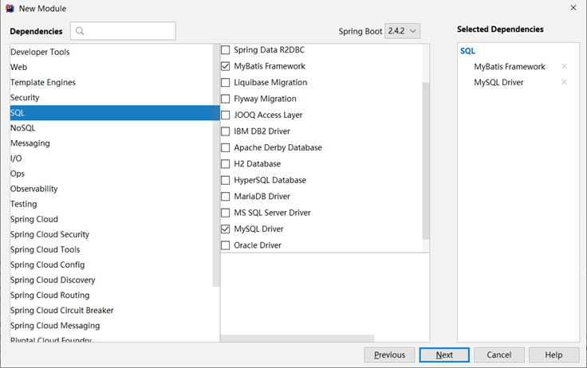

# ssm整合学习-SpringBoot
[toc]
## 一、SpringBoot简介

### 1. 入门案例

#### 问题导入

SpringMVC的HelloWord程序大家还记得吗？


- SpringBoot是由Pivotal团队提供的全新框架，其设计目的是用来简化Spring应用的初始搭建以及开发过程

- 原生开发SpringMVC程序过程


#### 1.1 入门案例开发步骤

①：创建新模块，选择Spring初始化，并配置模块相关基础信息


 ②：选择当前模块需要使用的技术集


 ③：开发控制器类

```java
@RestController
@RequestMapping("/books")
public class BookController {
    @GetMapping("/{id}")
    public String getById(@PathVariable Integer id) {
        System.out.println("id ==> " + id);
        return "hello , spring boot! ";
    }
}
```

④：运行自动生成的Application类


- 最简SpringBoot程序所包含的基础文件

```xml
<?xml version="1.0" encoding="UTF-8"?>
<project xmlns="http://maven.apache.org/POM/4.0.0" xmlns:xsi="http://www.w3.org/2001/XMLSchema-instance"
         xsi:schemaLocation="http://maven.apache.org/POM/4.0.0 https://maven.apache.org/xsd/maven-4.0.0.xsd">
    <modelVersion>4.0.0</modelVersion>
    <parent>
        <groupId>org.springframework.boot</groupId>
        <artifactId>spring-boot-starter-parent</artifactId>
        <version>2.5.0</version>
    </parent>
    <groupId>com.itheima</groupId>
    <artifactId>springboot-01-quickstart</artifactId>
    <version>0.0.1-SNAPSHOT</version>
    <dependencies>
        <dependency>
            <groupId>org.springframework.boot</groupId>
            <artifactId>spring-boot-starter-web</artifactId>
        </dependency>
    </dependencies>
</project>

```

```java
@SpringBootApplication
public class Application {
    public static void main(String[] args) {
        SpringApplication.run(Application.class, args);
    }
}
```

- Spring程序与SpringBoot程序对比


**注意事项：**

**基于idea开发SpringBoot程序需要确保联网且能够加载到程序框架结构**


#### 1.2 基于SpringBoot官网创建项目


#### 1.3 SpringBoot项目快速启动

① 对SpringBoot项目打包（执行Maven构建指令package）

② 执行启动指令

```cmd
java -jar springboot_01_quickstart.jar	# 项目的名称根据实际情况修改
```

**注意事项：**

**jar支持命令行启动需要依赖maven插件支持，请确认打包时是否具有SpringBoot对应的maven插件。**

```xml
<build>
    <plugins>
        <plugin>
            <groupId>org.springframework.boot</groupId>
            <artifactId>spring-boot-maven-plugin</artifactId>
        </plugin>
    </plugins>
</build>
```


### 2. SpringBoot概述

#### 问题导入

学习了SpringBoot入门案例之后，感觉对比SpringMVC哪一个更加方便简洁？


- SpringBoot是由Pivotal团队提供的全新框架，其设计目的是用来**简化**Spring应用的**初始搭建**以及**开发过程**
- Spring程序缺点
    - 配置繁琐
    - 依赖设置繁琐
- SpringBoot程序优点
    - 自动配置
    - 起步依赖（简化依赖配置）
    - 辅助功能（内置服务器，……）

#### 2.1 起步依赖

- starter
    - SpringBoot中常见项目名称，定义了当前项目使用的所有项目坐标，以达到减少依赖配置的目的

```xml
<?xml version="1.0" encoding="UTF-8"?>
<project xmlns="http://maven.apache.org/POM/4.0.0" xmlns:xsi="http://www.w3.org/2001/XMLSchema-instance"
         xsi:schemaLocation="http://maven.apache.org/POM/4.0.0 https://maven.apache.org/xsd/maven-4.0.0.xsd">
    <modelVersion>4.0.0</modelVersion>
    <parent>
        <groupId>org.springframework.boot</groupId>
        <artifactId>spring-boot-starter-parent</artifactId>
        <version>2.5.0</version>
    </parent>
    <groupId>com.itheima</groupId>
    <artifactId>springboot-01-quickstart</artifactId>
    <version>0.0.1-SNAPSHOT</version>
    <dependencies>
        <dependency>
            <groupId>org.springframework.boot</groupId>
            <artifactId>spring-boot-starter-web</artifactId>
        </dependency>
    </dependencies>
</project>
```

```xml
<project xmlns="http://maven.apache.org/POM/4.0.0"
         xsi:schemaLocation="http://maven.apache.org/POM/4.0.0 http://maven.apache.org/xsd/maven-4.0.0.xsd"
         xmlns:xsi="http://www.w3.org/2001/XMLSchema-instance">
    <modelVersion>4.0.0</modelVersion>
    <groupId>org.springframework.boot</groupId>
    <artifactId>spring-boot-dependencies</artifactId>
    <version>2.5.0</version>
    <packaging>pom</packaging>
    <properties>
        <servlet-api.version>4.0.1</servlet-api.version>        
        ...
    </properties>
</project>

```

- parent
    - 所有SpringBoot项目要继承的项目，定义了若干个坐标版本号（依赖管理，而非依赖），以达到减少依赖冲突的目的
    - spring-boot-starter-parent（2.5.0）与 spring-boot-starter-parent（2.4.6）共计57处坐标版本不同

```xml
<?xml version="1.0" encoding="UTF-8"?>
<project xmlns="http://maven.apache.org/POM/4.0.0"
         xsi:schemaLocation="http://maven.apache.org/POM/4.0.0 http://maven.apache.org/xsd/maven-4.0.0.xsd"
         xmlns:xsi="http://www.w3.org/2001/XMLSchema-instance">
    <modelVersion>4.0.0</modelVersion>
    <parent>
        <groupId>org.springframework.boot</groupId>
        <artifactId>spring-boot-dependencies</artifactId>
        <version>2.5.0</version>
    </parent>
    <artifactId>spring-boot-starter-parent</artifactId>
    <packaging>pom</packaging>    
    ...
</project>
```

- 实际开发
    - 使用任意坐标时，仅书写GAV中的G和A，V由SpringBoot提供
    - 如发生坐标错误，再指定version（要小心版本冲突）

```xml
<dependency>
    <groupId>junit</groupId>
    <artifactId>junit</artifactId>
    <version>${junit.version}</version>
</dependency>
<dependency>
    <groupId>javax.servlet</groupId>
    <artifactId>javax.servlet-api</artifactId>
    <version>${servlet-api.version}</version>
</dependency>
```

```xml
<?xml version="1.0" encoding="UTF-8"?>
<project xmlns="http://maven.apache.org/POM/4.0.0" xmlns:xsi="http://www.w3.org/2001/XMLSchema-instance"
         xsi:schemaLocation="http://maven.apache.org/POM/4.0.0 https://maven.apache.org/xsd/maven-4.0.0.xsd">
    <parent>
        <groupId>org.springframework.boot</groupId>
        <artifactId>spring-boot-starter-parent</artifactId>
        <version>2.5.0</version>
    </parent>
    <dependencies>
        <dependency>
            <groupId>org.springframework.boot</groupId>
            <artifactId>spring-boot-starter-web</artifactId>
        </dependency>
        <dependency>
            <groupId>org.springframework.boot</groupId>
            <artifactId>spring-boot-starter-test</artifactId>
            <scope>test</scope>
        </dependency>
    </dependencies>
</project>

```

#### 2.2 辅助功能

- SpringBoot程序启动

```java
@SpringBootApplication
public class Springboot01QuickstartApplication {
    public static void main(String[] args) {
        SpringApplication.run(Springboot01QuickstartApplication.class, args);
    }
}
```

- SpringBoot在创建项目时，采用jar的打包方式
- SpringBoot的引导类是项目的入口，运行main方法就可以启动项目
- 使用maven依赖管理变更起步依赖项
- Jetty比Tomcat更轻量级，可扩展性更强（相较于Tomcat），谷歌应用引擎（GAE）已经全面切换为Jetty

```xml
<dependencies>
    <dependency>
        <groupId>org.springframework.boot</groupId>
        <artifactId>spring-boot-starter-web</artifactId>
        <!--web起步依赖环境中，排除Tomcat起步依赖-->
        <exclusions>
            <exclusion>
                <groupId>org.springframework.boot</groupId>
                <artifactId>spring-boot-starter-tomcat</artifactId>
            </exclusion>
        </exclusions>
    </dependency>
    <!--添加Jetty起步依赖，版本由SpringBoot的starter控制-->
    <dependency>
        <groupId>org.springframework.boot</groupId>
        <artifactId>spring-boot-starter-jetty</artifactId>
    </dependency>
</dependencies>

```


## 二、基础配置

### 1. 配置文件格式

#### 问题导入

框架常见的配置文件有哪几种形式？

#### 1.1 修改服务器端口

http://localhost:8080/books/1		>>>		http://localhost/books/1

SpringBoot提供了多种属性配置方式

- application.properties

```properties
server.port=80
```

- application.yml

```yaml
server:
  port: 81
```

- application.yaml

```yaml
server:
  port: 82
```


#### 1.2 自动提示功能消失解决方案

操作步骤：


#### 1.3 SpringBoot配置文件加载顺序（了解）

- application.**properties** > application.**yml** > application.**yaml**


**注意事项：**

1. **SpringBoot核心配置文件名为application**
2. **SpringBoot内置属性过多，且所有属性集中在一起修改，在使用时，通过提示键+关键字修改属性**


### 2. yaml

#### 问题导入

什么是yaml，和properties有什么区别？


- YAML（YAML Ain't Markup Language），一种数据序列化格式
- 优点：
    - 容易阅读
    - 容易与脚本语言交互
    - 以数据为核心，重数据轻格式
- YAML文件扩展名
    - .yml（主流）
    - .yaml 

#### 2.1 yaml语法规则

- 大小写敏感
- 属性层级关系使用多行描述，每行结尾使用冒号结束
- 使用缩进表示层级关系，同层级左侧对齐，只允许使用空格（不允许使用Tab键）
- 属性值前面添加空格（属性名与属性值之间使用冒号+空格作为分隔）
- #表示注释
- 核心规则：**数据前面要加空格与冒号隔开**

#### 2.2 yaml数组数据

- 数组数据在数据书写位置的下方使用减号作为数据开始符号，每行书写一个数据，减号与数据间空格分隔


#### 2.3 yaml数据读取

- 使用@Value读取单个数据，属性名引用方式：${一级属性名.二级属性名……}


- 封装全部数据到Environment对象


- ==**自定义对象封装指定数据【常用】**==

```java
public class Enterprise {
    private String name;
    private Integer age;
    private String tel;
    private String[] subject;
    //自行添加getter、setter、toString()等方法
}
```


- 自定义对象封装数据警告解决方案


```xml
<dependency>
    <groupId>org.springframework.boot</groupId>
    <artifactId>spring-boot-configuration-processor</artifactId>
    <optional>true</optional>
</dependency>
```

### 3. 多环境开发配置

#### 问题导入

在实际开发中，项目的开发环境、测试环境、生产环境的配置信息是否会一致？如何快速切换？

#### 3.1 多环境启动配置

- **yaml文件多环境启动**


- **properties文件多环境启动**

```properties
#主启动配置文件 application.properties
spring.profiles.active=pro
```

```properties
#环境分类配置文件 application-pro.properties
server.port=80
```

```properties
#环境分类配置文件 application-dev.properties
server.port=81
```

```properties
#环境分类配置文件application-test.properties
server.port=82
```

#### 3.2 多环境启动命令格式

- 带参数启动SpringBoot

```properties
java –jar springboot.jar --spring.profiles.active=test
java –jar springboot.jar --server.port=88
java –jar springboot.jar --server.port=88 --spring.profiles.active=test
```

- 参数加载优先顺序
    - 参看文档：[https://docs.spring.io/spring-boot/docs/current/reference/html/spring-boot-features.html#boot-features-external-config](https://docs.spring.io/spring-boot/docs/current/reference/html/spring-boot-features.html)


#### 3.3 多环境开发控制

**Maven与SpringBoot多环境兼容（步骤）**

①：Maven中设置多环境属性

```xml
<profiles>
    <profile>
        <id>dev_env</id>
        <properties>
            <profile.active>dev</profile.active>
        </properties>
        <activation>
            <activeByDefault>true</activeByDefault>
        </activation>
    </profile>
    <profile>
        <id>pro_env</id>
        <properties>
            <profile.active>pro</profile.active>
        </properties>
    </profile>
    <profile>
        <id>test_env</id>
        <properties>
            <profile.active>test</profile.active>
        </properties>
    </profile>
</profiles>
```

②：SpringBoot中引用Maven属性


③：执行Maven打包指令

- Maven指令执行完毕后，生成了对应的包，其中类参与编译，但是配置文件并没有编译，而是复制到包中


- 解决思路：对于源码中非java类的操作要求加载Maven对应的属性，解析${}占位符

④：对资源文件开启对默认占位符的解析

```xml
<build>
    <plugins>
        <plugin>
            <artifactId>maven-resources-plugin</artifactId>
            <configuration>
                <encoding>utf-8</encoding>
                <useDefaultDelimiters>true</useDefaultDelimiters>
            </configuration>
        </plugin>
    </plugins>
</build>
```

- Maven打包加载到属性，打包顺利通过


### 4. 配置文件分类

#### 问题导入

SpringBoot的配置文件可以放在项目的哪些地方？


```properties
java –jar springboot.jar --spring.profiles.active=test --server.port=85 --server.servlet.context-path=/heima --server.tomcat.connection-timeout=-1 ... ...
```

- SpringBoot中4级配置文件

    1级： file ：config/application.yml 【最高】

    2级： file ：application.yml

    3级：classpath：config/application.yml

    4级：classpath：application.yml  【最低】

- 作用：

    1级与2级留做系统打包后设置通用属性

    3级与4级用于系统开发阶段设置通用属性


## 三、整合第三方技术

### 1. 整合JUnit

#### 问题导入

回忆一下Spring整合JUnit的步骤？

#### 1.1 Spring整合JUnit（复习）


#### 1.2 SpringBoot整合JUnit

【第一步】添加整合junit起步依赖(可以直接勾选)

```xml
<dependency>
    <groupId>org.springframework.boot</groupId>
    <artifactId>spring-boot-starter-test</artifactId>
    <scope>test</scope>
</dependency>
```

【第二步】编写测试类，默认自动生成了一个

```java
@SpringBootTest
class Springboot07JunitApplicationTests {
    @Autowired
    private BookService bookService;

    @Test
    public void testSave() {
        bookService.save();
    }
}
```

### 2. 基于SpringBoot实现SSM整合

#### 问题导入

回忆一下Spring整合MyBatis的核心思想？

#### 2.1 Spring整合MyBatis（复习）

- SpringConfig
    - 导入JdbcConfig
    - 导入MyBatisConfig

```java
@Configuration
@ComponentScan("com.itheima")
@PropertySource("classpath:jdbc.properties")
@Import({JdbcConfig.class, MyBatisConfig.class})
public class SpringConfig {

}
```

- JDBCConfig
    - 定义数据源（加载properties配置项：driver、url、username、password）

```properties
#jdbc.properties
jdbc.driver=com.mysql.jdbc.Driver
jdbc.url=jdbc:mysql://localhost:3306/spring_db
jdbc.username=root
jdbc.password=itheima
```

```java
public class JdbcConfig {
    @Value("${jdbc.driver}")
    private String driver;
    @Value("${jdbc.url}")
    private String url;
    @Value("${jdbc.username}")
    private String userName;
    @Value("${jdbc.password}")
    private String password;

    @Bean
    public DataSource getDataSource() {
        DruidDataSource ds = new DruidDataSource();
        ds.setDriverClassName(driver);
        ds.setUrl(url);
        ds.setUsername(userName);
        ds.setPassword(password);
        return ds;
    }
}

```

- MyBatisConfig
    - 定义SqlSessionFactoryBean
    - 定义映射配置

```java
@Bean
public SqlSessionFactoryBean getSqlSessionFactoryBean(DataSource dataSource) {
    SqlSessionFactoryBean ssfb = new SqlSessionFactoryBean();
    ssfb.setTypeAliasesPackage("com.itheima.domain");
    ssfb.setDataSource(dataSource);
    return ssfb;
}
```

```java
@Bean
public MapperScannerConfigurer getMapperScannerConfigurer() {
    MapperScannerConfigurer msc = new MapperScannerConfigurer();
    msc.setBasePackage("com.itheima.dao");
    return msc;
}
```

#### 2.2 SpringBoot整合MyBatis

- SpringBoot整合Spring（不存在）
- SpringBoot整合SpringMVC（不存在）
- SpringBoot整合MyBatis（主要）


①：创建新模块，选择Spring初始化，并配置模块相关基础信息


②：选择当前模块需要使用的技术集（MyBatis、MySQL）



③：设置数据源参数

```yaml
spring:
  datasource:
    driver-class-name: com.mysql.cj.jdbc.Driver
    url: jdbc:mysql://localhost:3306/ssm_db?serverTimezone=UTC
    username: root
    password: root
    type: com.alibaba.druid.pool.DruidDataSource
```

注意事项：

1. SpringBoot版本低于2.4.3(不含)，Mysql驱动版本大于8.0时，需要在url连接串中配置时区，或在MySQL数据库端配置时区解决此问题

```properties
jdbc:mysql://localhost:3306/ssm_db?serverTimezone=UTC
```

④：定义数据层接口与映射配置

```java
@Mapper
public interface UserDao {
    @Select("select * from tbl_book where id=#{id}")
    Book getById(Integer id);
}
```

⑤：测试类中注入dao接口，测试功能

```java
@SpringBootTest
class Springboot08MybatisApplicationTests {
    @Autowired
    private BookDao bookDao;

    @Test
    public void testGetById() {
        Book book = bookDao.getById(1);
        System.out.println(book);
    }
}
```

#### 2.3 案例-SpringBoot实现ssm整合

**【第一步】创建SpringBoot工程，添加druid依赖**

```xml
<!-- todo 1 添加druid连接池依赖-->
<dependency>
    <groupId>com.alibaba</groupId>
    <artifactId>druid</artifactId>
    <version>1.2.6</version>
</dependency>
```

**【第二步】复制springmvc_11_page工程各种资源(主java类、页面、测试类)**

**【第三步】删除config包中的所有配置，在BookDao接口上加@Mapper注解**

```java
//todo 3 在BookDao接口上加@Mapper注解，让SpringBoot给接口创建代理对象
@Mapper
public interface BookDao {
    //...
}
```

**【第四步】将application.properties修改成application.yml，配置端口号和连接参数**

```yaml
server:
  port: 80
# todo 4 配置数据库连接参数
spring:
  datasource:
    driver-class-name: com.mysql.cj.jdbc.Driver
    url: jdbc:mysql://localhost:3306/ssm_db
    username: root
    password: root
    type: com.alibaba.druid.pool.DruidDataSource
```

**【第五步】修改BookServiceTest配置类，进行配置**

```java
// todo 5 修改单元测试类，添加@SpringBootTest主键，修复@Test注解导包
@SpringBootTest
public class BookServiceTest {

    @Autowired
    private BookService bookService;

    @Test
    public void testGetById(){
        Book book = bookService.getById(2); //传递参数1会抛出异常
        System.out.println(book);
    }
    @Test
    public void testGetAll(){
        List<Book> all = bookService.getAll();
        System.out.println(all);
    }
}
```

**【第六步】在static目录中提供index.html页面，跳转到"pages/books.html"**

```html
<script>
    location.href="pages/books.html"
</script>
```

**最后：运行引导类即可访问**


