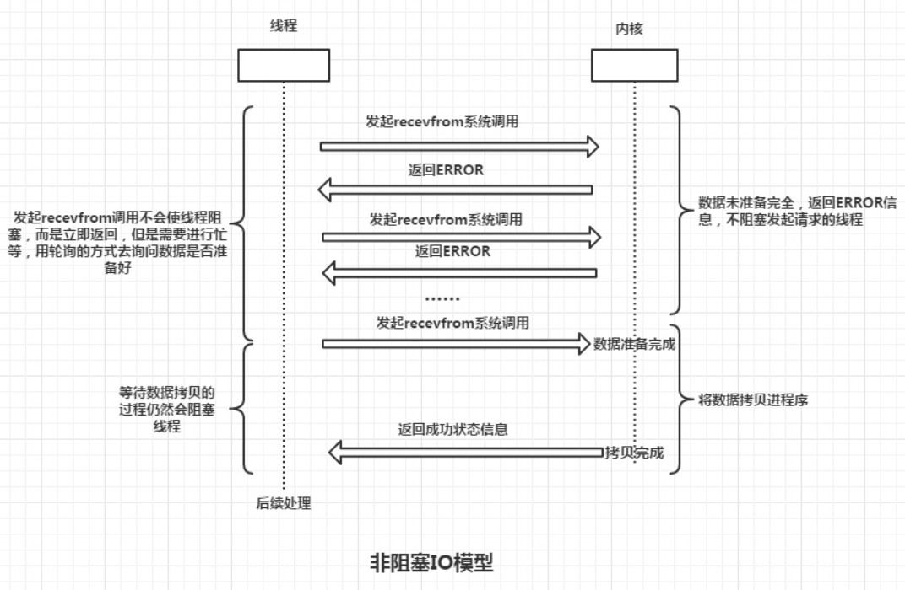

# 上网必备因素

1. 网卡 
2. IP地址 （局域网IP，公网IP 【运营商分配】）
3. 路由器
4. 交换机
5. 网线 （数据发送出去了）
6. 如果数据在发送的过程中，有时间，有流动性，水流的时候 突然放上指头，水就会断一下
7. 接收方，接收数据的时候，怎么判断数据接收完成
8. socket套接字

# Netty入门

> Netty是一款基于NIO（Nonblocking I/O，非阻塞IO）开发的网络通信框架
## 1. 理解IO模型

> 以两个应用程序通讯为例：应用A向应用B发送一条消息

步骤：**

1. 应用A把消息发送到 TCP发送缓冲区
2. TCP发送缓冲区再把消息发送出去，经过网络传递后，消息会发送到B服务器的TCP接收缓冲区
3. B再从TCP接收缓冲区去读取属于自己的数据

## 1.1 阻塞IO

> 在上图中，应用B从TCP接收缓冲区接收数据的时候，会出现以下情况：
>
> 1. 消息的发送不是一个持续状态，也就是说TCP接收缓冲区中可能没有B需要的消息
> 2. B去TCP接收缓冲区拿取消息的时候，拿不到对应的消息

**这时候TCP接收缓冲区产生了一个问题？**

1. 告诉B，现在无消息，你该干啥干啥去
2. 告诉B，现在无消息，你等一会，消息一会就来

> 思考A发送消息到TCP发送缓冲区的过程，同样会出现以下情况：
>
> 1. TCP发送缓冲区满了，也就是说A发送的消息TCP发送缓冲区接收不了
> 2. A无法成功的将消息发送到TCP发送缓冲区

**这时候TCP发送缓冲区产生了一个问题？**

1. 告诉A，现在缓冲区满了，你该干啥干啥去
2. 告诉A，现在缓冲区满了，你等一会，有空间的时候，你在拷贝数据到缓冲区

> 那么什么是阻塞IO？

以应用B为例，阻塞IO就是，当B发起读取数据的请求，内核数据没有准备好之前，B一直处于等待状态，直到内核将数据准备好，交给B为止。

**术语描述**：在应用调用recvfrom读取数据时，其系统调用直到数据包到达且被复制到应用缓冲区中或者发送错误时才返回，在此期间一直会等待，进程从调用到返回这段时间内都是被阻塞的，称为阻塞IO。

`recvfrom`用来接收远程主机经指定的socket 传来的数据, 并把数据存到由参数buf 指向的内存空间。

> 小知识：套接字是网络编程中的一种通信机制，是支持TCP/IP的网络通信的基本操作单元，可以看做是不同主机之间的进程进行双向通信的端点，简单的说就是通信的两方的一种约定，用套接字中的相关函数来完成通信过程。

**流程：**

1. 应用进程向内核发起recvfrom读取数据
2. 准备数据报（应用进程阻塞）
3. 将数据从内核复制到应用空间
4. 复制完成后，返回成功提示

## 1.2 非阻塞IO

> 很明显，非阻塞IO就是，内核数据没有准备好之前，会直接通知B未准备好，让B不要等待了
>
> B 问 准备好了吗？内核 没准备好 过了一会 B又问：准备好了吗？

**术语**：非阻塞IO是在应用调用recvfrom读取数据时，如果该缓冲区没有数据的话，就会直接返回一个EWOULDBLOCK错误，不会让应用一直等待中。在没有数据的时候会即刻返回错误标识，那也意味着如果应用要读取数据就需要不断的调用recvfrom请求，直到读取到它数据要的数据为止。

**流程：**

1. 应用进程向内核发起recvfrom读取数据
2. 没有数据报准备好，即刻返回EWOULDBLOCK错误码
3. 应用进程向内核发起recvfrom读取数据
4. 已有数据包准备好就进行一下 步骤，否则还是返回错误码
5. 将数据从内核拷贝到用户空间
6. 完成后，返回成功提示

## 1.3 IO复用模型

> 还是B从TCP缓冲区中读取数据，如果在并发的环境下，可能会N个人向应用B发送消息，这种情况下我们的应用就必须创建多个线程去读取数据，每个线程都会自己调用recvfrom 去读取数据。那么此时情况可能如下图：

