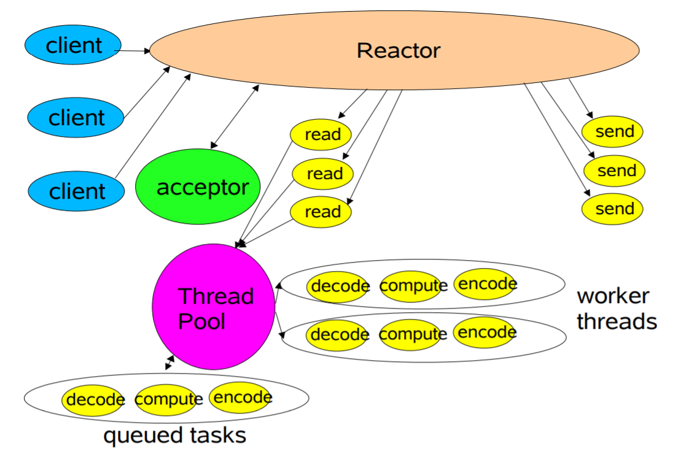
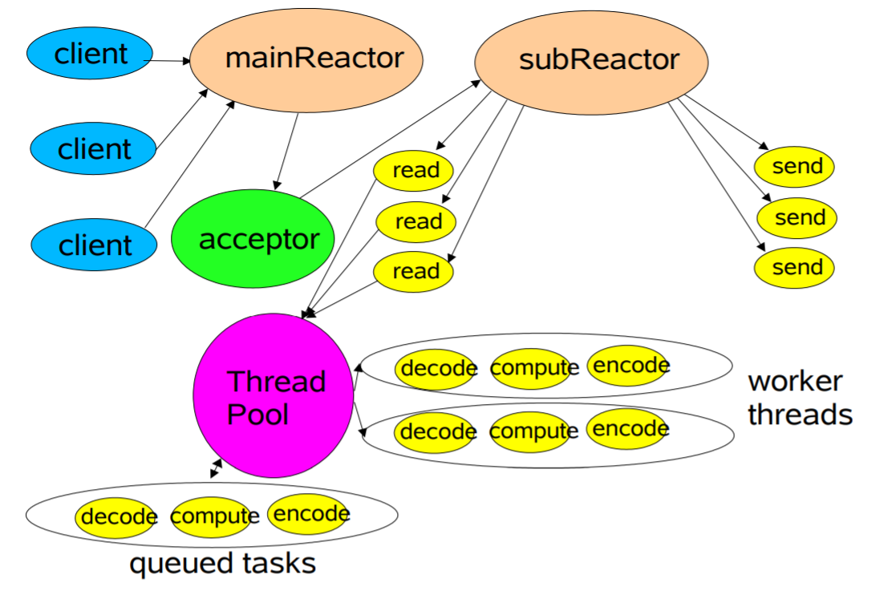
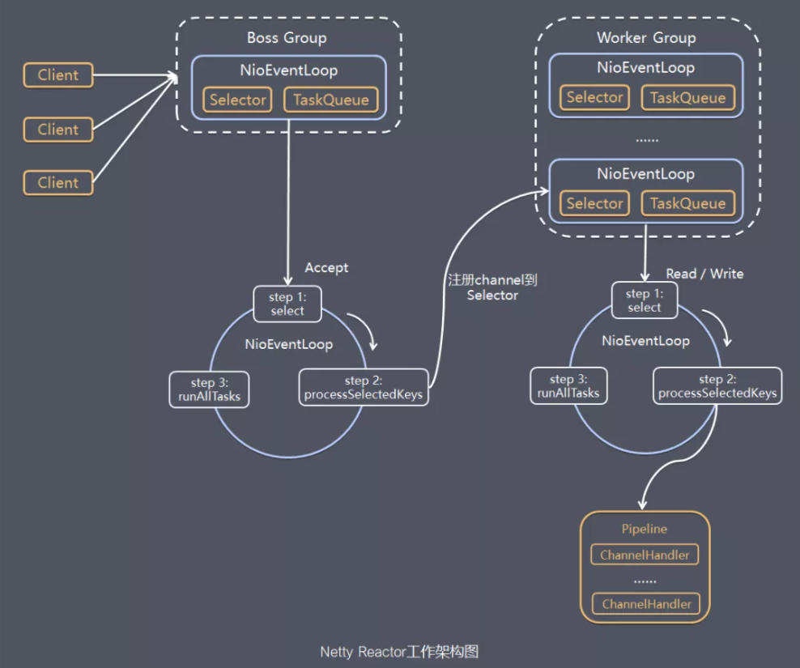
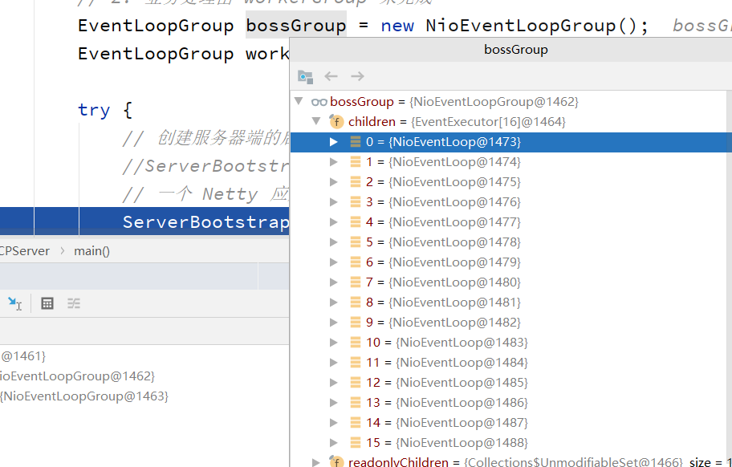

# 上网必备因素

1. 网卡 
2. IP地址 （局域网IP，公网IP 【运营商分配】）
3. 路由器
4. 交换机
5. 网线 （数据发送出去了）
6. 如果数据在发送的过程中，有时间，有流动性，水流的时候 突然放上指头，水就会断一下
7. 接收方，接收数据的时候，怎么判断数据接收完成
8. socket套接字

# Netty入门

> Netty是一款基于NIO（Nonblocking I/O，非阻塞IO）开发的网络通信框架
## 1. 理解IO模型

> 以两个应用程序通讯为例：应用A向应用B发送一条消息

步骤：**

1. 应用A把消息发送到 TCP发送缓冲区
2. TCP发送缓冲区再把消息发送出去，经过网络传递后，消息会发送到B服务器的TCP接收缓冲区
3. B再从TCP接收缓冲区去读取属于自己的数据

## 1.1 阻塞IO

> 在上图中，应用B从TCP接收缓冲区接收数据的时候，会出现以下情况：
>
> 1. 消息的发送不是一个持续状态，也就是说TCP接收缓冲区中可能没有B需要的消息
> 2. B去TCP接收缓冲区拿取消息的时候，拿不到对应的消息

**这时候TCP接收缓冲区产生了一个问题？**

1. 告诉B，现在无消息，你该干啥干啥去
2. 告诉B，现在无消息，你等一会，消息一会就来

> 思考A发送消息到TCP发送缓冲区的过程，同样会出现以下情况：
>
> 1. TCP发送缓冲区满了，也就是说A发送的消息TCP发送缓冲区接收不了
> 2. A无法成功的将消息发送到TCP发送缓冲区

**这时候TCP发送缓冲区产生了一个问题？**

1. 告诉A，现在缓冲区满了，你该干啥干啥去
2. 告诉A，现在缓冲区满了，你等一会，有空间的时候，你在拷贝数据到缓冲区

> 那么什么是阻塞IO？

以应用B为例，阻塞IO就是，当B发起读取数据的请求，内核数据没有准备好之前，B一直处于等待状态，直到内核将数据准备好，交给B为止。

**术语描述**：在应用调用recvfrom读取数据时，其系统调用直到数据包到达且被复制到应用缓冲区中或者发送错误时才返回，在此期间一直会等待，进程从调用到返回这段时间内都是被阻塞的，称为阻塞IO。

`recvfrom`用来接收远程主机经指定的socket 传来的数据, 并把数据存到由参数buf 指向的内存空间。

> 小知识：套接字是网络编程中的一种通信机制，是支持TCP/IP的网络通信的基本操作单元，可以看做是不同主机之间的进程进行双向通信的端点，简单的说就是通信的两方的一种约定，用套接字中的相关函数来完成通信过程。

**流程：**

1. 应用进程向内核发起recvfrom读取数据
2. 准备数据报（应用进程阻塞）
3. 将数据从内核复制到应用空间
4. 复制完成后，返回成功提示

## 1.2 非阻塞IO

> 很明显，非阻塞IO就是，内核数据没有准备好之前，会直接通知B未准备好，让B不要等待了
>
> B 问 准备好了吗？内核 没准备好 过了一会 B又问：准备好了吗？

**术语**：非阻塞IO是在应用调用recvfrom读取数据时，如果该缓冲区没有数据的话，就会直接返回一个EWOULDBLOCK错误，不会让应用一直等待中。在没有数据的时候会即刻返回错误标识，那也意味着如果应用要读取数据就需要不断的调用recvfrom请求，直到读取到它数据要的数据为止。

**流程：**

1. 应用进程向内核发起recvfrom读取数据
2. 没有数据报准备好，即刻返回EWOULDBLOCK错误码
3. 应用进程向内核发起recvfrom读取数据
4. 已有数据包准备好就进行一下 步骤，否则还是返回错误码
5. 将数据从内核拷贝到用户空间
6. 完成后，返回成功提示

## 1.3 IO复用模型

> 还是B从TCP缓冲区中读取数据，如果在并发的环境下，可能会N个人向应用B发送消息，这种情况下我们的应用就必须创建多个线程去读取数据，每个线程都会自己调用recvfrom 去读取数据。那么此时情况可能如下图：

这时候，我们假设并发的规模扩大到百万，也就是说B需要创建上百万的线程去读取数据，由于B不知道数据到底什么时候有，所以不断的向内核发送recvfrom请求来读取数据**

> 这时候，大家应该发现问题了，这么多线程一直不停的发recvfrom请求，系统能不能扛得住是一个问题，即使能抗的住，很明显，资源浪费太严重了。
>
> 线程是我们操作系统的宝贵资源，如果线程都浪费在这了，那还有线程可以去做别的事情吗？

**有问题，就要解决**

> 有人提出了这样的思路，可以有一个或者多个线程监控多个网络请求（**fd文件描述符**，**linux系统把所有网络请求以一个fd来标识**），这样就可以只需要一个或几个线程就可以完成数据状态询问的操作，当有数据准备就绪之后再分配对应的线程去读取数据，这么做就可以节省出大量的线程资源出来，这个就是IO复用模型的思路

**术语描述：进程通过将一个或多个fd传递给select，阻塞在select操作上，select帮我们侦测多个fd是否准备就绪，当有fd准备就绪时，select返回数据可读状态，应用程序再调用recvfrom读取数据

> 复用IO的基本思路就是通过select或poll、epoll 来监控多fd ，来达到不必为每个fd创建一个对应的监控线程，从而减少线程资源创建的目的。

## 1.4 信号驱动IO模型

> 上述的IO复用模型，我们从图上发现了一个问题，select是采用轮询的方式来监控多个fd，这种无脑的轮询显得没有必要，极大的浪费性能，大部分的轮询都是无效的。
>
> 这时候就提出了一个新的思想，能不能不要我总是去问你是否数据准备就绪，能不能我发出请求后等你数据准备好了就通知我，这就衍生了信号驱动IO模型

**术语描述：首先开启套接口信号驱动IO功能，并通过系统调用sigaction执行一个信号处理函数，此时请求即刻返回，当数据准备就绪时，就生成对应进程的SIGIO信号，通过信号回调通知应用线程调用recvfrom来读取数据。

>  IO复用模型里面的select虽然可以监控多个fd了，但select其实现的本质上还是通过不断的轮询fd来监控数据状态， 因为大部分轮询请求其实都是无效的，所以信号驱动IO意在通过这种建立信号关联的方式，实现了发出请求后只需要等待数据就绪的通知即可，这样就可以避免大量无效的数据状态轮询操作。

>  IO复用模型里面的select虽然可以监控多个fd了，但select其实现的本质上还是通过不断的轮询fd来监控数据状态， 因为大部分轮询请求其实都是无效的，所以信号驱动IO意在通过这种建立信号关联的方式，实现了发出请求后只需要等待数据就绪的通知即可，这样就可以避免大量无效的数据状态轮询操作。

## 1.5 异步IO

> 不管是IO复用还是信号驱动，我们要读取一个数据总是要发起两阶段的请求，第一次发送select请求，询问数据状态是否准备好，第二次发送recevform请求读取数据。

**很明显，我们的需求是读数据，为什么要询问状态呢？**

能不能这么做？

**应用只需要向内核发送一个read 请求,告诉内核它要读取数据后即刻返回；内核收到请求后会建立一个信号联系，当数据准备就绪，内核会主动把数据从内核复制到用户空间，等所有操作都完成之后，内核会发起一个通知告诉应用**

> 上述的思想就是异步IO模型

**术语描述：** 应用告知内核启动某个操作，并让内核在整个操作完成之后，通知应用，这种模型与信号驱动模型的主要区别在于，信号驱动IO只是由内核通知我们合适可以开始下一个IO操作，而异步IO模型是由内核通知我们操作什么时候完成。

> 异步IO的优化思路是解决了应用程序需要先后发送询问请求、发送接收数据请求两个阶段的模式，在异步IO的模式下，只需要向内核发送一次请求就可以完成状态询问和数拷贝的所有操作。

# 2. BIO,NIO,AIO

## 2.1 BIO

> BIO 全称Block-IO 是一种**同步且阻塞**的通信模式

阻塞就是发起读取数据请求的时，当数据还没准备就绪的时候，这时请求是即刻返回，还是在这里等待数据的就绪，如果需要等待的话就是阻塞，反之如果即刻返回就是非阻塞。

在IO模型里面如果请求方从发起请求到数据最后完成的这一段过程中都需要自己参与，那么这种我们称为同步请求；反之，如果应用发送完指令后就不再参与过程了，只需要等待最终完成结果的通知，那么这就属于异步。

如上图，是典型的BIO模型，每当有一个连接到来，经过协调器的处理，就开启一个对应的线程进行接管。如果连接有1000条，那就需要1000个线程。线程资源是非常昂贵的，除了占用大量的内存，还会占用非常多的CPU调度时间，所以BIO在连接非常多的情况下，效率会变得非常低。

下面的代码是使用`ServerSocket`实现的一个简单socket服务器，监听在8888端口：

~~~java
public class BIO {
    static boolean stop = false;
    public static void main(String[] args) throws Exception {
        int connectionNum = 0;
        int port = 8888;
        ExecutorService service = Executors.newCachedThreadPool();
        ServerSocket serverSocket = new ServerSocket(port);
        while (!stop) {
            if (10 == connectionNum) {
                stop = true;
            }
            Socket socket = serverSocket.accept();
            service.execute(() -> {
                try {
                    Scanner scanner = new Scanner(socket.getInputStream());
                    PrintStream printStream = new PrintStream(socket.getOutputStream());
                    while (!stop) {
                        String s = scanner.next().trim();
                        printStream.println("PONG:" + s);
                    }
                } catch (Exception ex) {
                    ex.printStackTrace();
                }
            });
            connectionNum++;
        }
        service.shutdown();
        serverSocket.close();
    }
}
~~~

使用`nc`进行测试：

资料中的nc压缩包，解压，并设置环境变量即可

~~~shell
# nc64 -v localhost 8888
hello
PONG:hello
nice
PONG:nice
~~~

可以看到，BIO的读写操作是阻塞的，线程的整个生命周期和连接的生命周期是一样的，而且不能够被复用。

**就单个`阻塞IO`来说，它的效率并不比`NIO`慢。但是当服务的连接增多，考虑到整个服务器的资源调度和资源利用率等因素，`NIO`就有了显著的效果，NIO非常适合高并发场景。**

## 2.2 NIO

> Java NIO，全称 Non-Block IO ，是Java SE 1.4版以后，针对网络传输效能优化的新功能。是一种**非阻塞同步**的通信模式

NIO主要有三种实现：select，poll，epoll。这三种都是IO多路复用的机制。

I/O多路复用就是通过一种机制，一个进程可以监视多个描述符，一旦某个描述符就绪（一般是读就绪或者写就绪），能够通知程序进行相应的读写操作。但select，poll，epoll本质上都是同步I/O，因为他们都需要在读写事件就绪后自己负责进行读写，也就是说这个读写过程是阻塞的。

**Java的NIO，在Linux上底层是使用epoll实现的**

> - `fd` 每条连接、每个文件，都对应着一个描述符，比如端口号。内核在定位到这些连接的时候，就是通过fd进行寻址的
> - `event` 事件

### 2.2.1 Select

~~~c++
int select (int n, fd_set *readfds, fd_set *writefds, fd_set *exceptfds, struct timeval *timeout);
~~~

select 函数监视的文件描述符分3类，分别是writefds、readfds、和exceptfds。

> 调用后select函数会阻塞，直到有描述符就绪（有数据 可读、可写、或者有except），或者超时（timeout指定等待时间，如果立即返回设为null即可），函数返回。
>
> 当select函数返回后，需要通过遍历fdset，来找到就绪的描述符

select目前几乎在所有的平台上支持，其良好跨平台支持也是它的一个优点。

select的一 个缺点在于单个进程能够监视的文件描述符的数量存在最大限制，在Linux上一般为1024，可以通过修改宏定义甚至重新编译内核的方式提升这一限制，但 是这样也会造成效率的降低。

### 2.2.2 Poll

~~~c
int poll (struct pollfd *fds, unsigned int nfds, int timeout);
~~~

不同与select使用三个位图来表示三个fdset的方式，poll使用一个 pollfd的指针实现。

~~~C
struct pollfd {
    int fd; /* file descriptor */
    short events; /* requested events to watch */
    short revents; /* returned events witnessed */
};
~~~

pollfd结构包含了要监视的event和发生的event，不再使用select“参数-值”传递的方式。同时，pollfd并没有最大数量限制（但是数量过大后性能也是会下降）。

 和select函数一样，poll返回后，需要轮询pollfd来获取就绪的描述符。

**从上面看，select和poll都需要在返回后，`通过遍历文件描述符来获取已经就绪的socket`。事实上，同时连接的大量客户端在一时刻可能只有很少的处于就绪状态，因此随着监视的描述符数量的增长，其效率也会线性下降。**

### 2.2.3 Epoll

> epoll最初在2.5.44内核版本出现，后续在2.6.x版本中对代码进行了优化使其更加简洁，先后面对外界的质疑在后续增加了一些设置来解决隐藏的问题，所以epoll也已经有十几年的历史了。

epoll对select中存在的问题都逐一解决，简单来说epoll的优势包括：

- 对fd数量没有限制(当然这个在poll也被解决了)
- 抛弃了bitmap数组实现了新的结构来存储多种事件类型
- 无需重复拷贝fd 随用随加 随弃随删
- 采用事件驱动避免轮询查看可读写事件

**epoll出现之后大大提高了并发量,对于C10K问题轻松应对，即使后续出现了真正的异步IO，也并没有(暂时没有)撼动epoll的江湖地位，主要是因为epoll可以解决数万数十万的并发量，已经可以解决现在大部分的场景了，异步IO固然优异，但是编程难度比epoll更大，权衡之下epoll仍然富有生命力。**

~~~C

//用户数据载体
typedef union epoll_data {
   void    *ptr;
   int      fd;
   uint32_t u32;
   uint64_t u64;
} epoll_data_t;
//fd装载入内核的载体
 struct epoll_event {
     uint32_t     events;    /* Epoll events */
     epoll_data_t data;      /* User data variable */
 };
 //三板斧api
int epoll_create(int size); 
int epoll_ctl(int epfd, int op, int fd, struct epoll_event *event);  
int epoll_wait(int epfd, struct epoll_event *events,
                 int maxevents, int timeout);
~~~

- **int epoll_create(int size)**

  创建一个epoll的句柄，后续的操作都是基于此fd的。

  size用来告诉内核这个监听的数目一共有多大，这个参数不同于select()中的第一个参数，给出最大监听的fd+1的值，`参数size并不是限制了epoll所能监听的描述符最大个数，只是对内核初始分配内部数据结构的一个建议`。
  当创建好epoll句柄后，它就会占用一个fd值，在linux下如果查看/proc/进程id/fd/，是能够看到这个fd的，所以在使用完epoll后，必须调用close()关闭，否则可能导致fd被耗尽。

- **int epoll_ctl(int epfd, int op, int fd, struct epoll_event \*event)**

  函数是对指定描述符fd执行op操作。
  \- epfd：是epoll_create()的返回值。
  \- op：表示op操作，用三个宏来表示：添加EPOLL_CTL_ADD，删除EPOLL_CTL_DEL，修改EPOLL_CTL_MOD。分别添加、删除和修改对fd的监听事件。
  \- fd：是需要监听的fd（文件描述符）
  \- epoll_event：是告诉内核需要监听什么事，struct epoll_event结构如下：

  ~~~c
  struct epoll_event {
    __uint32_t events;  /* Epoll events */
    epoll_data_t data;  /* User data variable */
  };
  
  //events可以是以下几个宏的集合：
  EPOLLIN ：表示对应的文件描述符可以读（包括对端SOCKET正常关闭）；
  EPOLLOUT：表示对应的文件描述符可以写；
  EPOLLPRI：表示对应的文件描述符有紧急的数据可读（这里应该表示有带外数据到来）；
  EPOLLERR：表示对应的文件描述符发生错误；
  EPOLLHUP：表示对应的文件描述符被挂断；
  EPOLLET： 将EPOLL设为边缘触发(Edge Triggered)模式，这是相对于水平触发(Level Triggered)来说的。
  EPOLLONESHOT：只监听一次事件，当监听完这次事件之后，如果还需要继续监听这个socket的话，需要再次把这个socket加入到EPOLL队列里
  ~~~

- **int epoll_wait(int epfd, struct epoll_event \* events, int maxevents, int timeout)**

  等待epfd上的io事件，最多返回maxevents个事件。
  参数events用来从内核得到事件的集合，maxevents告之内核这个events有多大，这个maxevents的值不能大于创建epoll_create()时的size，参数timeout是超时时间（毫秒，0会立即返回，-1将不确定，也有说法说是永久阻塞）。该函数返回需要处理的事件数目，如返回0表示已超时。

- epoll_event是用户态需监控fd的代言人，后续用户程序对fd的操作都是基于此结构的；

**通俗描述：**

- **epoll_create场景**：

  大学开学第一周，你作为班长需要帮全班同学领取相关物品，你在学生处告诉工作人员，我是xx学院xx专业xx班的班长，这时工作人员确定你的身份并且给了你凭证，后面办的事情都需要用到(`也就是调用epoll_create向内核申请了epfd结构，内核返回了epfd句柄给你使用`)；

- **epoll_ctl场景**：

  你拿着凭证在办事大厅开始办事，分拣办公室工作人员说班长你把所有需要办理事情的同学的学生册和需要办理的事情都记录下来吧，于是班长开始在每个学生手册单独写对应需要办的事情：

  李明需要开实验室权限、孙大熊需要办游泳卡......就这样班长一股脑写完并交给了工作人员(`也就是告诉内核哪些fd需要做哪些操作`)；

- **epoll_wait场景**：

  你拿着凭证在领取办公室门前等着，这时候广播喊xx班长你们班孙大熊的游泳卡办好了速来领取、李明实验室权限卡办好了速来取....还有同学的事情没办好，所以班长只能继续(`也就是调用epoll_wait等待内核反馈的可读写事件发生并处理`)；

2.2.3.1 工作模式

epoll对文件描述符的操作有两种模式：**LT（level trigger）**和**ET（edge trigger）**。LT模式是默认模式，LT模式与ET模式的区别如下：
　　**LT模式**：当epoll_wait检测到描述符事件发生并将此事件通知应用程序，`应用程序可以不立即处理该事件`。下次调用epoll_wait时，会再次响应应用程序并通知此事件。
　　**ET模式**：当epoll_wait检测到描述符事件发生并将此事件通知应用程序，`应用程序必须立即处理该事件`。如果不处理，下次调用epoll_wait时，不会再次响应应用程序并通知此事件。

#### 1. LT模式

LT(level triggered)是缺省的工作方式，并且同时支持block和no-block socket.在这种做法中，内核告诉你一个文件描述符是否就绪了，然后你可以对这个就绪的fd进行IO操作。如果你不作任何操作，内核还是会继续通知你的。

#### 2. ET模式

ET(edge-triggered)是高速工作方式，只支持no-block socket。在这种模式下，当描述符从未就绪变为就绪时，内核通过epoll告诉你。然后它会假设你知道文件描述符已经就绪，并且不会再为那个文件描述符发送更多的就绪通知，直到你做了某些操作导致那个文件描述符不再为就绪状态了(比如，你在发送，接收或者接收请求，或者发送接收的数据少于一定量时导致了一个EWOULDBLOCK 错误）。但是请注意，如果一直不对这个fd作IO操作(从而导致它再次变成未就绪)，内核不会发送更多的通知(only once)

ET模式在很大程度上减少了epoll事件被重复触发的次数，因此效率要比LT模式高。epoll工作在ET模式的时候，必须使用非阻塞套接口，以避免由于一个文件句柄的阻塞读/阻塞写操作把处理多个文件描述符的任务饿死。

### 2.2.4 示例

~~~java
package com.mszlu.rpc.io.nio;

import java.net.InetSocketAddress;
import java.nio.ByteBuffer;
import java.nio.channels.SelectionKey;
import java.nio.channels.Selector;
import java.nio.channels.ServerSocketChannel;
import java.nio.channels.SocketChannel;
import java.util.Iterator;
import java.util.concurrent.ExecutorService;
import java.util.concurrent.Executors;

public class NIO {
    static boolean stop = false;
    public static void main(String[] args) throws Exception {
        int connectionNum = 0;
        int port = 8888;
        ExecutorService service = Executors.newCachedThreadPool();
        //创建了一个服务端ssc，并开启一个新的事件选择器，监听它的OP_ACCEPT事件。
        ServerSocketChannel ssc = ServerSocketChannel.open();
        ssc.configureBlocking(false);
        ssc.socket().bind(new InetSocketAddress("localhost", port));
        Selector selector = Selector.open();
        //共有4种事件类型。
        // 分别是新连接事件（OP_ACCEPT）、连接就绪事件（OP_CONNECT）、读就绪事件（OP_READ）、写就绪事件（OP_WRITE）。
        // 任何网络和文件操作，都可以抽象成这四个事件
        //SelectionKey.OP_ACCEPT = 16 ssc.validOps()=16
        ssc.register(selector, ssc.validOps());
        while (!stop) {
            if (10 == connectionNum) {
                stop = true;
            }
            //在while循环里，使用select函数，阻塞在主线程里。
            // 所谓阻塞，就是操作系统不再分配CPU事件片到当前线程中，所以select函数是几乎不占用任何系统资源的
            int num = selector.select();
            if (num == 0) {
                continue;
            }
            //一旦有新的事件到达，比如有新的连接到来，主线程就能够被调度到，程序就能够向下执行。
            // 这时候，就能够根据订阅的事件通知，持续获取订阅的事件。
            //由于注册到selector的连接和事件可能会有多个，所以这些事件也会有多个
            //使用安全的迭代器循环进行处理，在处理完毕之后，将它删除。
            //如果事件不删除的话，或者漏掉了某个事件的处理，会怎么样呢？
            // 后果还是比较严重的，由于事件总是存在，我们的程序会陷入无休无止的循环之中。
            Iterator<SelectionKey> events = selector.selectedKeys().iterator();
            while (events.hasNext()) {
                SelectionKey event = events.next();

                if (event.isAcceptable()) {
                    //NIO操作的对象是抽象的概念Channel，通过缓冲区进行数据交换
                    SocketChannel sc = ssc.accept();
                    sc.configureBlocking(false);
                    //订阅OP_READ事件，数据流读取
                    sc.register(selector, SelectionKey.OP_READ);
                    connectionNum++;
                } else if (event.isReadable()) {
                    try {
                        SocketChannel sc = (SocketChannel) event.channel();
                        //创建了一个1024字节的缓冲区，用于数据的读取
                        //如果连接中的数据，大于1024字节怎么办？
                        //水平触发 (level-triggered) 称作LT模式。只要缓冲区有数据，事件就会一直发生
                        //边缘触发 (edge-triggered) 称作ET模式。缓冲区有数据，仅会触发一次。事件想要再次触发，必须先将fd中的数据读完才行
                        //java的NIO使用了LT模式，LT模式频繁环唤醒线程，效率相比较ET模式低，所以Netty使用JNI的方式，实现了ET模式，效率上更高一些
                        ByteBuffer buf = ByteBuffer.allocate(1024);
                        //这依旧是阻塞的
                        int size = sc.read(buf);
                        if(-1==size){
                            sc.close();
                        }
                        String result = new String(buf.array()).trim();
                        ByteBuffer wrap = ByteBuffer.wrap(("PONG:" + result).getBytes());
                        sc.write(wrap);
                    } catch (Exception ex) {
                        ex.printStackTrace();
                    }
                } else if (event.isWritable()) {
                    SocketChannel sc = (SocketChannel) event.channel();
                }

                events.remove();
            }
        }
        service.shutdown();
        ssc.close();
    }
}
~~~

## 2.3 AIO

> Java AIO，全程 Asynchronous IO，是**异步非阻塞**的IO。是一种非阻塞异步的通信模式。

~~~java
package com.mszlu.rpc.io.aio;

import java.net.InetSocketAddress;
import java.nio.ByteBuffer;
import java.nio.channels.AsynchronousServerSocketChannel;
import java.nio.channels.AsynchronousSocketChannel;
import java.nio.channels.CompletionHandler;

public class AIO {
    public static void main(String[] args) throws Exception {
        int port = 8888;
        AsynchronousServerSocketChannel ssc = AsynchronousServerSocketChannel.open();
        ssc.bind(new InetSocketAddress("localhost", port));
        //通过注册CompletionHandler 回调函数进行事件处理
        ssc.accept(null, new CompletionHandler<AsynchronousSocketChannel, Object>() {
            void job(final AsynchronousSocketChannel sc) {
                ByteBuffer buffer = ByteBuffer.allocate(1024);
                //这里的事件是隐藏的，比如read函数，它不仅仅代表Channel可读了，而且会把数据自动的读取到ByteBuffer中。
                // 等完成了读取，就会通过回调函数通知你，进行后续的操作。
                //对事件的操作变成了非阻塞
                sc.read(buffer, buffer, new CompletionHandler<Integer, ByteBuffer>() {
                    @Override
                    public void completed(Integer result, ByteBuffer attachment) {
                        String str = new String(attachment.array()).trim();
                        ByteBuffer wrap = ByteBuffer.wrap(("PONG:" + str).getBytes());
                        sc.write(wrap, null, new CompletionHandler<Integer, Object>() {
                            @Override
                            public void completed(Integer result, Object attachment) {
                                job(sc);
                            }
                            @Override
                            public void failed(Throwable exc, Object attachment) {
                                System.out.println("error");
                            }
                        });
                    }
                    @Override
                    public void failed(Throwable exc, ByteBuffer attachment) {
                        System.out.println("error");
                    }
                });
            }
            @Override
            public void completed(AsynchronousSocketChannel sc, Object attachment) {
                ssc.accept(null, this);
                job(sc);
            }
            @Override
            public void failed(Throwable exc, Object attachment) {
                exc.printStackTrace();
                System.out.println("error");
            }
        });
        Thread.sleep(Integer.MAX_VALUE);
    }
}
~~~

AIO是Java1.7加入的，理论上性能是会提升的，但它现在发展的不太好。那部分对数据进行自动读取的操作，总得有地方实现，不在框架里，就得在内核里。Netty的NIO模型加上多线程处理，在这方面已经做的很好，编程模式也非常简单。所以，市面上对AIO的实践并不多，在采用技术选型的时候，一定要谨慎。

## 3. Netty

> 上面的例子中，都是使用的java的原生io。
>
> 使用原生io有以下问题：
>
> 1. NIO的类库和API繁杂，使用麻烦
> 2. 可靠性能力补齐，工作量和难度都非常大。例如客户端面临断连重连、网络闪断、半包读写、失败缓存、网络拥塞和异常码流的处理等问题，NIO编程的特点是功能开发相对容易，但是可靠性能力补齐的工作量和难度都非常大。
> 3. JDK NIO的BUG，例如臭名昭著的epoll bug，它会导致Selector空轮询，最终导致CPU 100%。官方声称在JDK 1.6版本的update18修复了该问题，但是直到JDK 1.7版本该问题仍旧存在，只不过该BUG发生概率降低了一些而已，它并没有得到根本性解决。
> 4. 需要具备其他的额外技能做铺垫，例如熟悉Java多线程编程。这是因为NIO编程涉及到Reactor模式，你必须对多线程和网络编程非常熟悉，才能编写出高质量的NIO程序。

Netty是业界最流行的NIO框架之一，它的健壮性、功能、性能、可定制性和可扩展性在同类框架中都是首屈一指的，它已经得到成百上千的商用项目验证，例如Hadoop的RPC框架Avro就使用了Netty作为底层通信框架，其他还有业界主流的RPC框架（dubbo等），也使用Netty来构建高性能的异步通信能力。

优点:

1. API使用简单，开发门槛低
2. 功能强大，预置了多种编解码功能，支持多种主流协议
3. 定制能力强，可以通过ChannelHandler对通信框架进行灵活地扩展
4. 性能高，通过与其他业界主流的NIO框架对比，Netty的综合性能最优
5. 成熟、稳定，Netty修复了已经发现的所有JDK NIO BUG，业务开发人员不需要再为NIO的BUG而烦恼
6. 社区活跃，版本迭代周期短，发现的BUG可以被及时修复，同时，更多的新功能会加入
7. 经历了大规模的商业应用考验，质量得到验证。Netty在互联网、大数据、网络游戏、企业应用、电信软件等众多行业已经得到了成功商用，证明它已经完全能够满足不同行业的商业应用了

### 3.1 版本选择

https://netty.io/downloads.html

> 官方推荐使用 4.1.69.Final，10月11号发布的版本。

https://netty.io/news/index.html，这里可以了解到每个版本的变更，以及变更的内容。

~~~xml
<dependency>
    <groupId>io.netty</groupId>
    <artifactId>netty-all</artifactId>
    <version>4.1.69.Final</version>
</dependency>
~~~

### 3.2 Reactor模式

> Netty的NIO和我们上面讲的NIO是有区别的，采用了**Reactor模式**。

常见的Reactor线程模型有三种：

1. Reactor单线程模型
2. Reactor多线程模型
3. 主从Reactor多线程模型

Doug Lea（并发包大神，java.util.concurrent 包作者）在“[Scalable IO in Java](http://gee.cs.oswego.edu/dl/cpjslides/nio.pdf)”中给了很好的阐述。

### 3.2.1 Reactor单线程模型

Reactor单线程模型，指的是所有的I/O操作都在同一个NIO线程上面完成，NIO线程的职责如下

1. 作为NIO服务端，接收客户端的TCP连接
2. 作为NIO客户端，向服务端发起TCP连接
3. 读取通信对端的请求或者应答消息
4. 向通信对端发送消息请求或者应答消息

Reactor线程是个多面手，负责多路分离套接字，Accept新连接，并分派请求到处理器链中。

`单线程模型不能充分利用多核资源，所以实际使用的不多

对于一些小容量应用场景，可以使用单线程模型，但是对于高负载、大并发的应用却不合适，主要原因如下：

1. 一个NIO线程同时处理成百上千的链路，性能上无法支撑。即便NIO线程的CPU负荷达到100%，也无法满足海量消息的编码、解码、读取和发送
2. NIO线程负载过重之后，处理速度将变慢，这会导致大量客户端连接超时，超时之后往往进行重发，这更加重了NIO线程的负载，最终导致大量消息积压和处理超时，NIO线程会成为系统的性能瓶颈
3. 可靠性问题。一旦NIO线程意外跑飞，或者进入死循环，会导致整个系统通讯模块不可用，不能接收和处理外部信息，造成节点故障

### 3.2.2 Reactor多线程模型

Reactor多线程模型与单线程模型最大区别就是有一组NIO线程处理I/O操作：

1. 有一个专门的NIO线程--acceptor线程用于监听服务端，接收客户端的TCP连接请求
2. 网络I/O操作--读、写等由一个NIO线程池负责，线程池可以采用标准的JDK线程池实现，它包含一个任务队列和N个可用的线程，由这些NIO线程负责消息的读取、解码、编码和发送
3. 1个NIO线程可以同时处理N条链路，但是1个链路只对应1个NIO线程，防止发生并发操作问题

> 在绝大多数场景下，Reactor多线程模型都可以满足性能需求；但是，在极特殊应用场景中，一个NIO线程负责监听和处理所有的客户端连接可能会存在性能问题。例如百万客户端并发连接，或者服务端需要对客户端的握手信息进行安全认证，认证本身非常损耗性能。这类场景下，单独一个Acceptor线程可能会存在性能不足问题，为了解决性能问题，产生了第三种Reactor线程模型--主从Reactor多线程模型。

### 3.2.3 主从Reactor多线程模型

`服务端用于接收客户端连接的不再是1个单独的NIO线程，而是一个独立的NIO线程池。`

Acceptor接收到客户端TCP连接请求处理完成后（可能包含接入认证等），将新创建的SocketChannel注册到I/O线程池（sub reactor线程池）的某个I/O线程上，由它负责SocketChannel的读写和编解码工作。

> Reactor部分分为mainReactor和subReactor两部分。mainReactor负责监听处理新的连接，然后将后续的事件处理交给subReactor，subReactor对事件处理的方式，也由阻塞模式变成了多线程处理，引入了任务队列的模式。

通常subReactor个数上与CPU核数相同**

这种模式的基本工作流程为：

1. Reactor 主线程 MainReactor 对象通过 select 监听客户端连接事件，收到事件后，通过 Acceptor 处理客户端连接事件。

2. 当 Acceptor 处理完客户端连接事件之后（与客户端建立好 Socket 连接），MainReactor 将连接分配给 SubReactor。（即：MainReactor 只负责监听客户端连接请求，和客户端建立连接之后将连接交由 SubReactor 监听后面的 IO 事件。）

3. SubReactor 将连接加入到自己的连接队列进行监听，并创建 Handler 对各种事件进行处理。

4. 当连接上有新事件发生的时候，SubReactor 就会调用对应的 Handler 处理。

5. Handler 通过 read 从连接上读取请求数据，将请求数据分发给 Worker 线程池进行业务处理。

6. Worker 线程池会分配独立线程来完成真正的业务处理，并将处理结果返回给 Handler。Handler 通过 send 向客户端发送响应数据。

7. 一个 MainReactor 可以对应多个 SubReactor，即一个 MainReactor 线程可以对应多个 SubReactor 线程。

这种模式的优点是：

1. MainReactor 线程与 SubReactor 线程的数据交互简单职责明确，MainReactor 线程只需要接收新连接，SubReactor 线程完成后续的业务处理。

2. MainReactor 线程与 SubReactor 线程的数据交互简单， MainReactor 线程只需要把新连接传给 SubReactor 线程，SubReactor 线程无需返回数据。

3. 多个 SubReactor 线程能够应对更高的并发请求。

这种模式的缺点是编程复杂度较高。

但是由于其优点明显，在许多项目中被广泛使用，包括 Nginx、Memcached、Netty 等。

这种模式也被叫做服务器的 `1+M+N 线程模式`，即使用该模式开发的服务器包含一个（或多个，1 只是表示相对较少）连接建立线程+M 个 IO 线程+N 个业务处理线程。

这是业界成熟的服务器程序设计模式。

### 3.3 Netty架构

> 在Netty中，Boss线程对应着对连接的处理和分派，相当于mainReactor；Work线程 对应着subReactor，使用多线程负责读写事件的分发和处理。

**EventLoop,EventLoopGroup**

EventLoop目的是为Channel处理IO操作，一个EventLoop可以为多个Channel服务,EventLoopGroup会包含多个EventLoop

**Channel**

请求连接通道

**ChannelHandler**

业务逻辑处理器

**ChannelHandlerContext**

业务逻辑处理器上下文

**ChannelPipeline**

用于保存业务逻辑处理器和业务逻辑处理器上下文

### 3.3.1 架构图说明

1. Netty 抽象出两组线程池：`BossGroup` 和 `WorkerGroup`，也可以叫做 `BossNioEventLoopGroup `和 `WorkerNioEventLoopGroup`。每个线程池中都有 `NioEventLoop` 线程。BossGroup 中的线程专门负责和客户端建立连接，WorkerGroup 中的线程专门负责处理连接上的读写。BossGroup 和 WorkerGroup 的类型都是 `NioEventLoopGroup`。
2. `NioEventLoopGroup` 相当于一个事件循环组，这个组中含有多个事件循环，每个事件循环就是一个 `NioEventLoop`。
3. `NioEventLoop` 表示一个不断循环的执行事件处理的线程，每个 `NioEventLoop` 都包含一个 `Selector`，用于监听注册在其上的 Socket 网络连接（`Channel`）
4. `NioEventLoopGroup` 可以含有多个线程，即可以含有多个 `NioEventLoop`
5. 每个 `BossNioEventLoop` 中循环执行以下三个步骤:
   1. **select**：轮询注册在其上的 `ServerSocketChannel` 的 accept 事件（OP_ACCEPT 事件）
   2. **processSelectedKeys**：处理 accept 事件，与客户端建立连接，生成一个 `NioSocketChannel`，并将其注册到某个 `WorkerNioEventLoop` 上的 `Selector` 上
   3. **runAllTasks**：再去以此循环处理任务队列中的其他任务
6. 每个 `WorkerNioEventLoop` 中循环执行以下三个步骤：
   1. **select**：轮询注册在其上的 `NioSocketChannel` 的 read/write 事件（OP_READ/OP_WRITE 事件）
   2. **processSelectedKeys**：在对应的 `NioSocketChannel` 上处理 read/write 事件
   3. **runAllTasks**：再去以此循环处理任务队列中的其他任务
7. 在以上两个**processSelectedKeys**步骤中，会使用 Pipeline（管道），Pipeline 中引用了 Channel，即通过 Pipeline 可以获取到对应的 Channel，Pipeline 中维护了很多的处理器（拦截处理器、过滤处理器、自定义处理器等）。

## 3.4 Netty案例

> **基于 Netty 的 TCP Server/Client 案例**

 ### 3.4.1 TCP Server

~~~java
package com.mszlu.rpc.tcp.server;

import io.netty.bootstrap.ServerBootstrap;
import io.netty.buffer.ByteBuf;
import io.netty.buffer.Unpooled;
import io.netty.channel.*;
import io.netty.channel.nio.NioEventLoopGroup;
import io.netty.channel.socket.SocketChannel;
import io.netty.channel.socket.nio.NioServerSocketChannel;
import io.netty.util.CharsetUtil;

public class TCPServer{
    public static void main(String[] args) throws InterruptedException {

        // 创建 BossGroup 和 WorkerGroup
        // 1. bossGroup 只处理连接请求
        // 2. 业务处理由 workerGroup 来完成
        EventLoopGroup bossGroup = new NioEventLoopGroup();
        EventLoopGroup workerGroup = new NioEventLoopGroup();

        try {
            // 创建服务器端的启动对象
            //ServerBootstrap 服务器端的引导类,
            // 一个 Netty 应用程序通常由一个引导类开始，主要是用来配置整个 Netty 程序、设置业务处理类（Handler）、绑定端口、发起连接等
            ServerBootstrap bootstrap = new ServerBootstrap();
            // 配置参数
            bootstrap
                    // 设置线程组
                    .group(bossGroup, workerGroup)
                    // 说明服务器端通道的实现类（便于 Netty 做反射处理）
                    //服务端首先创建一个 NioServerSocketChannel 作为服务器端通道，
                    // 每当接收一个客户端连接就产生一个 NioSocketChannel 应对该客户端
                    .channel(NioServerSocketChannel.class)
                    // 设置等待连接的队列的容量（当客户端连接请求速率大
                   // 于 NioServerSocketChannel 接收速率的时候，会使用
                    // 该队列做缓冲）
                    // option()方法用于给服务端的 ServerSocketChannel添加配置
                    .option(ChannelOption.SO_BACKLOG, 128)
                    // 设置连接保活
                    // childOption()方法用于给服务端 ServerSocketChannel
                    // 接收到的 SocketChannel 添加配置
                    .childOption(ChannelOption.SO_KEEPALIVE, true)
                    // handler()方法用于给 BossGroup 设置业务处理器
                    // childHandler()方法用于给 WorkerGroup 设置业务处理器
                    .childHandler(
                            // 创建一个通道初始化对象
                            new ChannelInitializer<SocketChannel>() {
                                // 向 Pipeline 添加业务处理器
                                @Override
                                protected void initChannel(
                                        SocketChannel socketChannel
                                ) throws Exception {
                                    socketChannel.pipeline().addLast(
                                            new NettyServerHandler()
                                    );

                                    // 可以继续调用 socketChannel.pipeline().addLast()
                                    // 添加更多 Handler
                                }
                            }
                    );

            System.out.println("server is ready...");

            // 绑定端口，启动服务器，生成一个 channelFuture 对象，
            // ChannelFuture 涉及到 Netty 的异步模型，后面展开讲
            ChannelFuture channelFuture = bootstrap.bind(8080).sync();
            // 对通道关闭进行监听
            channelFuture.channel().closeFuture().sync();
        } finally {
            bossGroup.shutdownGracefully();
            workerGroup.shutdownGracefully();
        }
    }

    /**
     * 自定义一个 Handler，需要继承 Netty 规定好的某个 HandlerAdapter（规范）
     * InboundHandler 用于处理数据流入本端（服务端）的 IO 事件
     * InboundHandler 用于处理数据流出本端（服务端）的 IO 事件
     */
    static class NettyServerHandler extends ChannelInboundHandlerAdapter {
        /**
         * 当通道有数据可读时执行
         *
         * @param ctx 上下文对象，可以从中取得相关联的 Pipeline、Channel、客户端地址等
         * @param msg 客户端发送的数据
         * @throws Exception
         */
        @Override
        public void channelRead(ChannelHandlerContext ctx, Object msg)
                throws Exception {
            // 接收客户端发来的数据

            System.out.println("client address: "
                    + ctx.channel().remoteAddress());

            // ByteBuf 是 Netty 提供的类，比 NIO 的 ByteBuffer 性能更高
            ByteBuf byteBuf = (ByteBuf) msg;
            System.out.println("data from client: "
                    + byteBuf.toString(CharsetUtil.UTF_8));
        }

        /**
         * 数据读取完毕后执行
         *
         * @param ctx 上下文对象
         * @throws Exception
         */
        @Override
        public void channelReadComplete(ChannelHandlerContext ctx)
                throws Exception {
            // 发送响应给客户端
            ctx.writeAndFlush(
                    // Unpooled 类是 Netty 提供的专门操作缓冲区的工具类，
                    // copiedBuffer 方法返回的 ByteBuf 对象类似于
                    // NIO 中的 ByteBuffer，但性能更高
                    Unpooled.copiedBuffer(
                            "hello client! i have got your data.",
                            CharsetUtil.UTF_8
                    )
            );
        }

        /**
         * 发生异常时执行
         *
         * @param ctx   上下文对象
         * @param cause 异常对象
         * @throws Exception
         */
        @Override
        public void exceptionCaught(ChannelHandlerContext ctx, Throwable cause)
                throws Exception {
            // 关闭与客户端的 Socket 连接
            ctx.channel().close();
        }
    }
}
~~~

使用` Channel `构建网络 IO 程序的时候，不同的协议、不同的阻塞类型和 Netty 中不同的 Channel 对应，常用的 `Channel` 有：

1. `NioSocketChannel`：非阻塞的 TCP 客户端 Channel
2. `NioServerSocketChannel`：非阻塞的 TCP 服务器端 Channel
3. `NioDatagramChannel`：非阻塞的 UDP Channel
4. `NioSctpChannel`：非阻塞的 SCTP 客户端 Channel
5. `NioSctpServerChannel`：非阻塞的 SCTP 服务器端 Channel

### 3.4.2 TCP Client

~~~java
package com.mszlu.rpc.tcp.client;

import io.netty.bootstrap.Bootstrap;
import io.netty.buffer.ByteBuf;
import io.netty.buffer.Unpooled;
import io.netty.channel.*;
import io.netty.channel.nio.NioEventLoopGroup;
import io.netty.channel.socket.SocketChannel;
import io.netty.channel.socket.nio.NioSocketChannel;
import io.netty.util.CharsetUtil;

public class TCPClient {

    public static void main(String[] args) throws InterruptedException {

        // 客户端只需要一个事件循环组，可以看做 BossGroup
        EventLoopGroup eventLoopGroup = new NioEventLoopGroup();

        try {
            // 创建客户端的启动对象
            //Bootstrap 客户端引导类
            Bootstrap bootstrap = new Bootstrap();
            // 配置参数
            bootstrap
                    // 设置线程组
                    .group(eventLoopGroup)
                    // 说明客户端通道的实现类（便于 Netty 做反射处理）
                    //客户端创建一个 NioSocketChannel 作为客户端通道，去连接服务器
                    .channel(NioSocketChannel.class)
                    // handler()方法用于给 BossGroup 设置业务处理器
                    .handler(
                            // 创建一个通道初始化对象
                            //当一个链接建立时，我们需要知道怎么来接收或者发送数据，
                            // 当然，我们有各种各样的Handler实现来处理它，
                            // 那么ChannelInitializer便是用来配置这些Handler，
                            // 它会提供一个ChannelPipeline，并把Handler加入到ChannelPipeline
                            new ChannelInitializer<SocketChannel>() {
                                // 向 Pipeline 添加业务处理器
                                @Override
                                protected void initChannel(
                                        SocketChannel socketChannel
                                ) throws Exception {
                                    socketChannel.pipeline().addLast(
                                            new NettyClientHandler()
                                    );
                                    // 可以继续调用 socketChannel.pipeline().addLast()
                                    // 添加更多 Handler
                                }
                            }
                    );

            System.out.println("client is ready...");

            // 启动客户端去连接服务器端，ChannelFuture 涉及到 Netty 的异步模型
            //在Netty中所有的IO操作都是异步的，因此，你不能立刻得知消息是否被正确处理，
            // 但是我们可以过一会等它执行完成或者直接注册一个监听，
            // 具体的实现就是通过Future和ChannelFutures,
            // 他们可以注册一个监听，当操作执行成功或失败时监听会自动触发。
            ChannelFuture channelFuture = bootstrap.connect(
                    "127.0.0.1",
                    8080).sync();
            // 对通道关闭进行监听
            channelFuture.channel().closeFuture().sync();
        } finally {
            eventLoopGroup.shutdownGracefully();
        }
    }

    /**
     * 自定义一个 Handler，需要继承 Netty 规定好的某个 HandlerAdapter（规范）
     * InboundHandler 用于处理数据流入本端（客户端）的 IO 事件
     * InboundHandler 用于处理数据流出本端（客户端）的 IO 事件
     */
    static class NettyClientHandler extends ChannelInboundHandlerAdapter {
        /**
         * 通道就绪时执行
         *
         * @param ctx 上下文对象
         * @throws Exception
         */
        @Override
        public void channelActive(ChannelHandlerContext ctx)
                throws Exception {
            // 向服务器发送数据
            ctx.writeAndFlush(
                    // Unpooled 类是 Netty 提供的专门操作缓冲区的工具
                    // 类，copiedBuffer 方法返回的 ByteBuf 对象类似于
                    // NIO 中的 ByteBuffer，但性能更高
                    Unpooled.copiedBuffer(
                            "hello server!",
                            CharsetUtil.UTF_8
                    )
            );
        }

        /**
         * 当通道有数据可读时执行
         *
         * @param ctx 上下文对象
         * @param msg 服务器端发送的数据
         * @throws Exception
         */
        @Override
        public void channelRead(ChannelHandlerContext ctx, Object msg)
                throws Exception {
            // 接收服务器端发来的数据

            System.out.println("server address: "
                    + ctx.channel().remoteAddress());

            // ByteBuf 是 Netty 提供的类，比 NIO 的 ByteBuffer 性能更高
            ByteBuf byteBuf = (ByteBuf) msg;
            System.out.println("data from server: "
                    + byteBuf.toString(CharsetUtil.UTF_8));
        }

        /**
         * 发生异常时执行
         *
         * @param ctx   上下文对象
         * @param cause 异常对象
         * @throws Exception
         */
        @Override
        public void exceptionCaught(ChannelHandlerContext ctx, Throwable cause)
                throws Exception {
            // 关闭与服务器端的 Socket 连接
            ctx.channel().close();
        }
    }
}

~~~

### 3.4.3 说明

> 看起来，工作量似乎很大，写了很多代码，但是你通过简单的一些代码，实现了一个基于主从 Reactor 多线程模式的服务器，一个高吞吐量和并发量的服务器，一个异步处理服务器。

1. 从上图的调试结果来看，默认情况下 BossGroup 和 WorkerGroup 都包含 16 个线程（NioEventLoop），在创建 BossGroup 和 WorkerGroup 的时候可以指定 NioEventLoop 数量，这样可以根据实际需求来分配线程资源。

   ~~~java
   EventLoopGroup bossGroup = new NioEventLoopGroup(4);
   EventLoopGroup workerGroup = new NioEventLoopGroup(8);
   ~~~

2. 每一个 NioEventLoop 包含如下的属性（比如自己的 Selector、任务队列、执行器等）

3. ChannelHandlerContext 读取消息的时候：

   1. 当前 ChannelHandlerContext ctx 是位于 ChannelHandlerContext 责任链中的一环，可以看到其 next、prev 属性
   2. 当前 ChannelHandlerContext ctx 包含一个 Handler
   3. 当前 ChannelHandlerContext ctx 包含一个 Pipeline
   4. Pipeline 本质上是一个双向循环列表，可以看到其 tail、head 属性
   5. Pipeline 中包含一个 Channel，Channel 中又包含了该 Pipeline，两者互相引用

