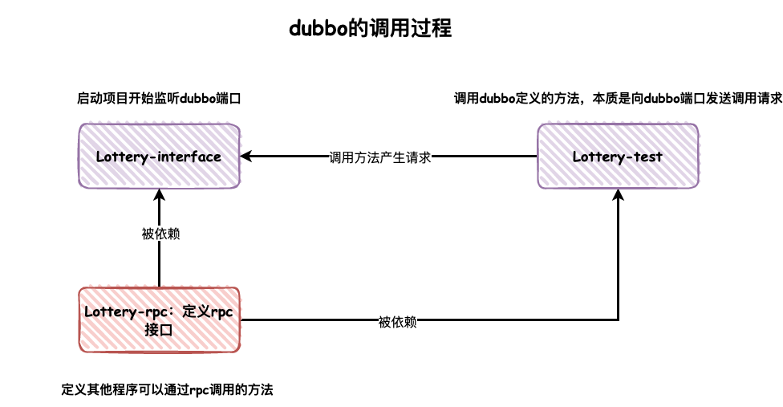

# 第01节：环境、配置、规范

##  一、开发环境

-   JDK 1.8
-   SpringBoot 2.6.0
-   Dubbo 2.7.10
-   DB-ROUTER `自研分库分表路由组件，带着你一起写个SpringBoot Starter`
-   vue `开发H5大转盘抽奖`
-   微信公众号 `对接提供API，回复抽奖`
-   Docker `本地和云服务都可以`

## 二、环境配置

-   **技术栈项**：JDK1.8、Maven3.6.3、Mysql5.7(可升级配置)，SpringBoot、Mybatis、Dubbo 随POM版本
-   **初始打包**：你需要在 Lottery 工程的 Maven 根上，点击 Install 这样才能完整打包，否则 Lottery-Test 等，不能正常引入 Jar 包
-   **建表语句**：[doc/asserts/sql](https://gitcode.net/KnowledgePlanet/Lottery/-/blob/master/doc/assets/sql/lottery.sql) - `建议随非分支内sql版本走，因为需求不断迭代升级优化，直接使用最新的会遇到在各个分支下的代码运行问题`
-   **学习使用**：下载代码库后，切换本地分支到wiki中章节对应的分支，这样代码与章节内容是对应的，否则你在master看到的是全量代码。
-   **下载依赖**：[db-router-spring-boot-starter](https://gitcode.net/KnowledgePlanet/db-router-spring-boot-starter) 本项目依赖自研分库分表组件，需要可以用IDEA像打开一个项目一样打开，之后点击 Maven Install 这样就把 Jar 打包到你本地仓库了(`注意版本切换`)，Lottery 就可以引入这个 Jar 了
-   **服务部署**：本套工程学习涉及到了较多的环境配置，如：mysql、redis、kafka、zookeeper、xxl-job、ELK等，可以采用新人较便宜的云服务部署[aliyun - 最少需要2核4G](https://www.aliyun.com/minisite/goods?userCode=is4kfbdt)，或者本机直接安装 Docker(`切记再执行一些删除、清空、重置等命令的时候，注意别把自己机器霍霍喽`)。PS：看到也有的读者是自己专门有一个 mac mini 当服务器使用，这样的方式也不错。

# 第02节：搭建DDD四层架构

## DDD 分层架构介绍

> DDD（Domain-Driven Design 领域驱动设计）是由Eric Evans最先提出，目的是对软件所涉及到的领域进行建模，以应对系统规模过大时引起的软件复杂性的问题。整个过程大概是这样的，开发团队和领域专家一起通过 通用语言(Ubiquitous Language)去理解和消化领域知识，从领域知识中提取和划分为一个一个的子领域（核心子域，通用子域，支撑子域），并在子领域上建立模型，再重复以上步骤，这样周而复始，构建出一套符合当前领域的模型。


依靠领域驱动设计的设计思想，通过事件风暴建立领域模型，合理划分领域逻辑和物理边界，建立领域对象及服务矩阵和服务架构图，定义符合DDD分层架构思想的代码结构模型，保证业务模型与代码模型的一致性。通过上述设计思想、方法和过程，指导团队按照DDD设计思想完成微服务设计和开发。

-   拒绝泥球小单体、拒绝污染功能与服务、拒绝一加功能排期一个月
-   架构出高可用极易符合互联网高速迭代的应用服务
-   物料化、组装化、可编排的服务，提高人效

**服务架构调用关系**


-   应用层{application}
    -   应用服务位于应用层。用来表述应用和用户行为，负责服务的组合、编排和转发，负责处理业务用例的执行顺序以及结果的拼装。
    -   应用层的服务包括应用服务和领域事件相关服务。
    -   应用服务可对微服务内的领域服务以及微服务外的应用服务进行组合和编排，或者对基础层如文件、缓存等数据直接操作形成应用服务，对外提供粗粒度的服务。
    -   领域事件服务包括两类：领域事件的发布和订阅。通过事件总线和消息队列实现异步数据传输，实现微服务之间的解耦。
-   领域层{domain}
    -   领域服务位于领域层，为完成领域中跨实体或值对象的操作转换而封装的服务，领域服务以与实体和值对象相同的方式参与实施过程。
    -   领域服务对同一个实体的一个或多个方法进行组合和封装，或对多个不同实体的操作进行组合或编排，对外暴露成领域服务。领域服务封装了核心的业务逻辑。实体自身的行为在实体类内部实现，向上封装成领域服务暴露。
    -   为隐藏领域层的业务逻辑实现，所有领域方法和服务等均须通过领域服务对外暴露。
    -   为实现微服务内聚合之间的解耦，原则上禁止跨聚合的领域服务调用和跨聚合的数据相互关联。
-   基础层{infrastructure}
    -   基础服务位于基础层。为各层提供资源服务（如数据库、缓存等），实现各层的解耦，降低外部资源变化对业务逻辑的影响。
    -   基础服务主要为仓储服务，通过依赖反转的方式为各层提供基础资源服务，领域服务和应用服务调用仓储服务接口，利用仓储实现持久化数据对象或直接访问基础资源。
-   接口层{interfaces}
    -   接口服务位于用户接口层，用于处理用户发送的Restful请求和解析用户输入的配置文件等，并将信息传递给应用层。

**综上**，就是对 DDD 领域驱动设计的一个基本描述，不过也不用过于神秘化DDD，我们可以把DDD四层架构和MVC三层架构架构理解为家里的格局，三居和四居，只不过DDD是在MVC的基础上可以更加明确了房间的布局，可能效果上就像你原来有个三居中没有独立的书房，现在四居了你可以有一个自己的小空间了。

**那么**，这里还有一点就是DDD结构它是一种充血模型结构，所有的服务实现都以领域为核心，应用层定义接口，领域层实现接口，领域层定义数据仓储，基础层实现数据仓储中关于DAO和Redis的操作，但同时几方又有互相的依赖。那么这样的结构再开发独立领域提供 http 接口时候，并不会有什么问题体现出来。但如果这个时候需要引入 RPC 框架，就会暴露问题了，因为使用 RPC 框架的时候，需要对外提供描述接口信息的 Jar 让外部调用方引入才可以通过反射调用到具体的方法提供者，那么这个时候，RPC 需要暴露出来，而 DDD 的系统结构又比较耦合，怎么进行模块化的分离就成了问题点。所以我们本章节在模块系统结构搭建的时候，也是以解决此项问题为核心进行处理的。

## DDD + RPC，模块分离系统搭建


如果按照模块化拆分，那么会需要做一些处理，包括：

1.  应用层，不再给领域层定义接口，而是自行处理对领域层接口的包装。否则领域层既引入了应用层的Jar，应用层也引入了领域层的Jar，就会出现循环依赖的问题。
2.  基础层中的数据仓储的定义也需要从领域层剥离，否则也会出现循环依赖的问题。
3.  RPC 层定义接口描述，包括：入参Req、出参Res、DTO对象，接口信息，这些内容定义出来的Jar给接口层使用，也给外部调用方使用。


那么，这样拆分以后就可以按照模块化的结构进行创建系统结构了，每一层按照各自的职责完成各自的功能，同时又不会破坏DDD中领域充血模型的实现。

# 第03节：跑通广播模式RPC过程调用

## POM 文件配置
按照现有工程的结构模块分层，包括：

-   lottery-application，应用层，引用：`domain`
-   lottery-common，通用包，引用：`无`
-   lottery-domain，领域层，引用：`infrastructure`
-   lottery-infrastructure，基础层，引用：`无`
-   lottery-interfaces，接口层，引用：`application`、`rpc`
-   lottery-rpc，RPC接口定义层，引用：`common`

在此分层结构和依赖引用下，各层级模块不能循环依赖，同时 `lottery-interfaces` 作为系统的 war 包工程，在构建工程时候需要依赖于 POM 中配置的相关信息。那这里就需要注意下，作为 Lottery 工程下的主 pom.xml 需要完成对 SpringBoot 父文件的依赖，此外还需要定义一些用于其他模块可以引入的配置信息，比如：jdk版本、编码方式等。而其他层在依赖于工程总 pom.xml 后还需要配置自己的信息。


## dubbo的调用过程


## 配置广播模式 Dubbo 

```yml
# Dubbo 广播方式配置
dubbo:
  application:
    name: Lottery
    version: 1.0.0
  registry:
    address: N/A #multicast://224.5.6.7:1234
  protocol:
    name: dubbo
    port: 20880
  scan:
    base-packages: cn.itedus.lottery.rpc
```

-   广播模式的配置唯一区别在于注册地址，`registry.address = multicast://224.5.6.7:1234`，服务提供者和服务调用者都需要配置相同的📢广播地址。或者配置为 N/A 用于直连模式使用
-   application，配置应用名称和版本
-   protocol，配置的通信协议和端口
-   scan，相当于 Spring 中自动扫描包的地址，可以把此包下的所有 rpc 接口都注册到服务中

# 第04节：抽奖活动策略库表设计

## 一、需要建哪些表
一个满足业务需求的抽奖系统，需要提供抽奖活动配置、奖品概率配置、奖品梳理配置等内容，同时用户在抽奖后需要记录用户的抽奖数据，这就是一个抽奖活动系统的基本诉求。


# 第05节：抽奖策略领域模块开发

## 一、需求引出设计

**需求**：在一场营销抽奖活动玩法中，运营人员通常会配置以转盘、盲盒等展现形式的抽奖玩法。例如在转盘中配置12个奖品，每个奖品配置不同的中奖概率，当1个奖品被抽空了以后，那么再抽奖时，是剩余的奖品总概率均匀分配在11个奖品上，还是保持剩余11个奖品的中奖概率，如果抽到为空的奖品则表示未中奖。其实这两种方式在实际的运营过程中都会有所选取，主要是为了配合不同的玩法。

**设计**：那么我们在做这样的抽奖领域模块设计时，就要考虑到库表中要有对应的字段来区分当前运营选择的是什么样的抽奖策略。那么在开发实现上也会用到对应的`策略模式`的使用，两种抽奖算法可以算是不同的抽奖策略，最终提供统一的接口包装满足不同的抽奖功能调用。


-   在库表设计上我们把抽奖需要的策略配置和策略明细，它们的关系是`1vn`。
-   另外为了让抽奖策略成为可以独立配置和使用的领域模块，在策略表用不引入活动ID信息的配置。因为在建设领域模块的时候，我们需要把让这部分的领域实现具有可独立运行的特性，不让它被业务逻辑污染，它只是一种无业务逻辑的通用共性的功能领域模块，在业务组合的过程中可以使用此功能领域提供的标准接口。
-   通过这样的设计实现，就可以满足于不同业务场景的灵活调用，例如：有些业务场景是需要你直接来进行抽奖反馈中奖信息发送给用户，但还有一些因为用户下单支付才满足抽奖条件的场景对应的奖品是需要延时到账的，避免用户在下单后又进行退单，这样造成了刷单的风险。`所以有时候你的设计是与业务场景息息相关的`

## 二、领域功能结构


strategy 是第1个在 domain 下实现的抽奖策略领域，在领域功能开发的服务下主要含有model、repository、service三块区域，接下来分别介绍下在抽奖领域中这三块区域都做了哪些事情。

-   model，用于提供vo、req、res 和 aggregates 聚合对象。
-   repository，提供仓储服务，其实也就是对Mysql、Redis等数据的统一包装。
-   service，是具体的业务领域逻辑实现层，在这个包下定义了algorithm抽奖算法实现和具体的抽奖策略包装 draw 层，对外提供抽奖接口 IDrawExec#doDrawExec

## 三、抽奖算法实现

两种抽奖算法描述，场景A20%、B30%、C50%

-   **总体概率**：如果A奖品抽空后，B和C奖品的概率按照 `3:5` 均分，相当于B奖品中奖概率由 `0.3` 升为 `0.375`
-   **单项概率**：如果A奖品抽空后，B和C保持目前中奖概率，用户抽奖扔有20%中为A，因A库存抽空则结果展示为未中奖。_为了运营成本，通常这种情况的使用的比较多

### 1. 定义接口
cn.itedus.lottery.domain.strategy.service.algorithm.IDrawAlgorithm
```java
public interface IDrawAlgorithm {
    /**
     * SecureRandom 生成随机数，索引到对应的奖品信息返回结果
     *
     * @param strategyId 策略ID
     * @param excludeAwardIds 排除掉已经不能作为抽奖的奖品ID，留给风控和空库存使用
     * @return 中奖结果
     */
    String randomDraw(Long strategyId, List<String> excludeAwardIds);
}
```

- 无论任何一种抽奖算法的使用，都以这个接口作为标准的抽奖接口进行抽奖。strategyId 是抽奖策略、excludeAwardIds 排除掉已经不能作为抽奖的奖品ID，留给风控和空库存使用

### 2. 总体概率(算法)

**算法描述**：分别把A、B、C对应的概率值转换成阶梯范围值，A=(0~0.2」、B=(0.2-0.5」、C=(0.5-1.0」，当使用随机数方法生成一个随机数后，与阶梯范围值进行循环比对找到对应的区域，匹配到中奖结果。


**部分代码**
```java
public class DefaultRateRandomDrawAlgorithm extends BaseAlgorithm {
    @Override
    public String randomDraw(Long strategyId, List<String> excludeAwardIds) {
        BigDecimal differenceDenominator = BigDecimal.ZERO;
        // 排除掉不在抽奖范围的奖品ID集合
        List<AwardRateInfo> differenceAwardRateList = new ArrayList<>();
        List<AwardRateInfo> awardRateIntervalValList = awardRateInfoMap.get(strategyId);
        for (AwardRateInfo awardRateInfo : awardRateIntervalValList) {
            String awardId = awardRateInfo.getAwardId();
            if (excludeAwardIds.contains(awardId)) {
                continue;
            }
            differenceAwardRateList.add(awardRateInfo);
            differenceDenominator = differenceDenominator.add(awardRateInfo.getAwardRate());
        }
        // 前置判断
        if (differenceAwardRateList.size() == 0) return "";
        if (differenceAwardRateList.size() == 1) return differenceAwardRateList.get(0).getAwardId();
        // 获取随机概率值
        SecureRandom secureRandom = new SecureRandom();
        int randomVal = secureRandom.nextInt(100) + 1;
        // 循环获取奖品
        String awardId = "";
        int cursorVal = 0;
        for (AwardRateInfo awardRateInfo : differenceAwardRateList) {
            int rateVal = awardRateInfo.getAwardRate().divide(differenceDenominator, 2, BigDecimal.ROUND_UP).multiply(new BigDecimal(100)).intValue();
            if (randomVal <= (cursorVal + rateVal)) {
                awardId = awardRateInfo.getAwardId();
                break;
            }
            cursorVal += rateVal;
        }
        // 返回中奖结果
        return awardId;
    }
}

```

-   首先要从总的中奖列表中排除掉那些被排除掉的奖品，这些奖品会涉及到概率的值重新计算。
-   如果排除后剩下的奖品列表小于等于1，则可以直接返回对应信息
-   接下来就使用随机数工具生产一个100内的随值与奖品列表中的值进行循环比对，算法时间复杂度O(n)

### 3. 单项概率(算法)

**算法描述**：单项概率算法不涉及奖品概率重新计算的问题，那么也就是说我们分配好的概率结果是可以固定下来的。好，这里就有一个可以优化的算法，不需要在轮训匹配O(n)时间复杂度来处理中奖信息，而是可以根据概率值存放到HashMap或者自定义散列数组进行存放结果，这样就可以根据概率值直接定义中奖结果，时间复杂度由O(n)降低到O(1)。这样的设计在一般电商大促并发较高的情况下，达到优化接口响应时间的目的。


```java
@Override
public String randomDraw(Long strategyId, List<String> excludeAwardIds) {
    // 获取策略对应的元祖
    String[] rateTuple = super.rateTupleMap.get(strategyId);
    assert rateTuple != null;
    // 随机索引
    int randomVal = new SecureRandom().nextInt(100) + 1;
    int idx = super.hashIdx(randomVal);
    // 返回结果
    String awardId = rateTuple[idx];
    if (excludeAwardIds.contains(awardId)) return "未中奖";
    return awardId;
}
```

### 策略模式的使用


### 斐波那契散列法
斐波那契散列法本质是一种乘法散列，为了得到更好的随即性， knuth认为A取黄金分割数是一个比较理想的值，因此A=0.6180339887。

ThreadLocal中采用了斐波那契散列+开放寻址方式存放Entry

使用斐波那契散列法可以让数据散列的更加均匀，不易产生哈希碰撞。减少碰撞也就可以让数据存储的更加分散，获取数据的时间复杂度基本保持在O(1)。

黄金分割点：(√5 - 1) / 2 = 0.6180339887

以32位整数为例理想乘数(黄金分割点) = 2^32\*0.6180339887=2654435769

```java
// 斐波那契散列增量，逻辑：黄金分割点：(√5 - 1) / 2 = 0.6180339887，Math.pow(2, 32) * 0.6180339887 = 0x61c88647
    private final int HASH_INCREMENT = 0x61c88647;

    // 数组初始化长度
    private final int ARR_LENGTH = 128;

    private Map<Long,int[]> intMap = new ConcurrentHashMap<>();

    /**
     * 斐波那契（Fibonacci）散列法，计算哈希索引下标值
     *
     * @param val 值
     * @return 索引
     */
    protected int hashIdx(int val) {
        int hashCode = val * HASH_INCREMENT + HASH_INCREMENT;
        return hashCode & (ARR_LENGTH - 1);
    }
```

# 第06节：模板模式处理抽奖流程


## 模板模式应用

1.  根据入参策略ID获取抽奖策略配置
2.  校验和处理抽奖策略的数据初始化到内存
3.  获取那些被排除掉的抽奖列表，这些奖品可能是已经奖品库存为空，或者因为风控策略不能给这个用户薅羊毛的奖品
4.  执行抽奖算法
5.  包装中奖结果

如果是在一个类的一个方法中，顺序开发这些内容也是可以实现的。但这样的代码实现过程是不易于维护的，也不太方便在各个流程节点扩展其他功能，也会使一个类的代码越来越庞大，因此对于这种可以制定标准流程的功能逻辑，通常使用模板方法模式是非常合适的。


1. 模板模式的校心设计思路是通过在，抽家失中定义抽象方;法的执行顺序，并子抽象方法设定为只有子类实现，但不设计独立访问的方法。
2. 关于模版模式的校心点在于由抽象类定义抽象方法执行策略，也就是说父类规定了好一系列的执行标准，这些标佳的串联成一整京业务流程
3. 模版模式的业务场景可能在平时的开发中开不是很多，主票因为这个设计模式会在抽象关中定义逻街行为的执行顺序。
> 好处是只用关心好自己的逻辑，一般抽象类定义的行为都比较轻量，不太会使用模版方法。

# 第07节：简单工厂搭建发奖领域

## 一、开发日志

-   【重要】运用简单工厂设计模式，搭建发奖领域服务。介绍：定义一个创建对象的接口，让其子类自己决定实例化哪一个工厂类，工厂模式使其创建过程延迟到子类进行。
> 简单工厂模式避免创建者与具体的产品逻辑耦合、满足单一职责，每一个业务逻辑实现都在所属自己的类中完成、满足开闭原则，无需更改使用调用方就可以在程序中引入新的产品类型。但这样也会带来一些问题，比如有非常多的奖品类型，那么实现的子类会极速扩张，对于这样的场景就需要在引入其他设计手段进行处理，例如抽象通用的发奖子领域，自动化配置奖品发奖。

## 二、发奖领域服务实现

截止到目前我们开发实现的都是关于 `domain` 领域层的建设，当各项核心的领域服务开发完成以后，则会在 `application` 层做服务编排流程处理的开发。例如：从用户参与抽奖活动、过滤规则、执行抽奖、存放结果、发送奖品等内容的链路处理。涉及的领域如下：


### 1. 工程结构

```java
lottery-domain
└── src
    └── main
        └── java
            └── cn.itedus.lottery.domain.award
                ├── model
                ├── repository
                │   ├── impl
                │   │   └── AwardRepository
                │   └── IAwardRepository
                └── service
                    ├── factory
                    │   ├── DistributionGoodsFactory.java
                    │   └── GoodsConfig.java
                    └── goods
                        ├── impl
                        │   ├── CouponGoods.java
                        │   ├── DescGoods.java
                        │   ├── PhysicalGoods.java
                        │   └── RedeemCodeGoods.java
                        ├── DistributionBase.java
                        └── IDistributionGoodsc.java
```

-   关于 award 发奖领域中主要的核心实现在于 service 中的两块功能逻辑实现，分别是：`goods 商品处理`、`factory 工厂🏭`
-   goods：包装适配各类奖品的发放逻辑，虽然我们目前的抽奖系统仅是给用户返回一个中奖描述，但在实际的业务场景中，是真实的调用优惠券、兑换码、物流发货等操作，而这些内容经过封装后就可以在自己的商品类下实现了。
-   factory：工厂模式通过调用方提供发奖类型，返回对应的发奖服务。通过这样由具体的子类决定返回结果，并做相应的业务处理。从而不至于让领域层包装太多的频繁变化的业务属性，因为如果你的核心功能域是在做业务逻辑封装，就会就会变得非常庞大且混乱。

### 2. 发奖适配策略
**定义奖品配送接口**

```java
public interface IDistributionGoods {

    /**
     * 奖品配送接口，奖品类型（1:文字描述、2:兑换码、3:优惠券、4:实物奖品）
     *
     * @param req   物品信息
     * @return      配送结果
     */
    DistributionRes doDistribution(GoodsReq req);

}
```

-   抽奖，抽象出配送货物接口，把各类奖品模拟成货物、配送代表着发货，包括虚拟奖品和实物奖品

**实现发送奖品：CouponGoods、DescGoods、PhysicalGoods、RedeemCodeGoods**

```java
@Component
public class CouponGoods extends DistributionBase implements IDistributionGoods {

    @Override
    public DistributionRes doDistribution(GoodsReq req) {

        // 模拟调用优惠券发放接口
        logger.info("模拟调用优惠券发放接口 uId：{} awardContent：{}", req.getuId(), req.getAwardContent());

        // 更新用户领奖结果
        super.updateUserAwardState(req.getuId(), req.getOrderId(), req.getAwardId(), Constants.AwardState.SUCCESS.getCode(), Constants.AwardState.SUCCESS.getInfo());

        return new DistributionRes(req.getuId(), Constants.AwardState.SUCCESS.getCode(), Constants.AwardState.SUCCESS.getInfo());
    }

}
```

-   由于抽奖系统并没有真的与外部系统对接，所以在例如优惠券、兑换码、实物发货上只能通过模拟的方式展示。另外四种发奖方式基本类似，可以参考源码。

### 3. 定义简单工厂

**工厂配置**

```java
public class GoodsConfig {

    /** 奖品发放策略组 */
    protected static Map<Integer, IDistributionGoods> goodsMap = new ConcurrentHashMap<>();

    @Resource
    private DescGoods descGoods;

    @Resource
    private RedeemCodeGoods redeemCodeGoods;

    @Resource
    private CouponGoods couponGoods;

    @Resource
    private PhysicalGoods physicalGoods;

    @PostConstruct
    public void init() {
        goodsMap.put(Constants.AwardType.DESC.getCode(), descGoods);
        goodsMap.put(Constants.AwardType.RedeemCodeGoods.getCode(), redeemCodeGoods);
        goodsMap.put(Constants.AwardType.CouponGoods.getCode(), couponGoods);
        goodsMap.put(Constants.AwardType.PhysicalGoods.getCode(), physicalGoods);
    }

}
```

-   把四种奖品的发奖，放到一个统一的配置文件类 Map 中，便于通过 AwardType 获取相应的对象，减少 `if...else` 的使用。

**工厂使用**

```java
@Service
public class DistributionGoodsFactory extends GoodsConfig {

    public IDistributionGoods getDistributionGoodsService(Integer awardType){
        return goodsMap.get(awardType);
    }

}
```

-   配送商品简单工厂，提供获取配送服务。

## 三、测试验证

**单元测试**

```java
@Test
public void test_award() {
    // 执行抽奖
    DrawResult drawResult = drawExec.doDrawExec(new DrawReq("小傅哥", 10001L));

    // 判断抽奖结果
    Integer drawState = drawResult.getDrawState();
    if (Constants.DrawState.FAIL.getCode().equals(drawState)) {
        logger.info("未中奖 DrawAwardInfo is null");
        return;
    }

    // 封装发奖参数，orderId：2109313442431 为模拟ID，需要在用户参与领奖活动时生成
    DrawAwardInfo drawAwardInfo = drawResult.getDrawAwardInfo();
    GoodsReq goodsReq = new GoodsReq(drawResult.getuId(), "2109313442431", drawAwardInfo.getAwardId(), drawAwardInfo.getAwardName(), drawAwardInfo.getAwardContent());

    // 根据 awardType 从抽奖工厂中获取对应的发奖服务
    IDistributionGoods distributionGoodsService = distributionGoodsFactory.getDistributionGoodsService(drawAwardInfo.getAwardType());
    DistributionRes distributionRes = distributionGoodsService.doDistribution(goodsReq);

    logger.info("测试结果：{}", JSON.toJSONString(distributionRes));
}
```

-   在单元测试中依次执行抽奖操作、发奖操作，其实在后续我们在 application 做逻辑包装时也会是类似的效果。

**测试结果**

```java
16:27:04.396  INFO 27386 --- [           main] c.i.l.d.s.s.draw.impl.DrawExecImpl       : 执行抽奖策略 strategyId：10001，无库存排除奖品列表ID集合 awardList：["1"]
16:27:04.400  INFO 27386 --- [           main] c.i.l.d.s.service.draw.AbstractDrawBase  : 执行策略抽奖完成【已中奖】，用户：小傅哥 策略ID：10001 奖品ID：4 奖品名称：AirPods
16:27:04.402  INFO 27386 --- [           main] c.i.l.d.a.s.goods.DistributionBase       : TODO 后期添加更新分库分表中，用户个人的抽奖记录表中奖品发奖状态 uId：小傅哥
16:27:04.440  INFO 27386 --- [           main] cn.itedus.lottery.test.SpringRunnerTest  : 测试结果：{"code":1,"info":"发奖成功","uId":"小傅哥"}
```

-   从测试结果可以看到，先是执行了我们已经开发好了的抽奖领域服务，之后执行发奖操作。不过目前的发奖还没有对个人用户表信息更新，这部分内容在我们后续开发分库分表逻辑的时候，补充添加上。

#  第08节：活动领域的配置与状态

## 一、开发日志

-   按照 DDD 模型，调整包引用 lottery-infrastructure 引入 lottery-domain，调整后效果`领域层 domain` 定义仓储接口，`基础层 infrastructure` 实现仓储接口。
-   活动领域层需要提供的功能包括：活动创建、活动状态处理和用户领取活动操作，本章节先实现前两个需求。
- 活动创建的操作主要会用到事务，因为活动系统提供给运营后台创建活动时，需要包括：活动信息、奖品信息、策略信息、策略明细以及其他额外扩展的内容，这些信息都需要在一个事务下进行落库。
-   活动状态的审核，【1编辑、2提审、3撤审、4通过、5运行(审核通过后worker扫描状态)、6拒绝、7关闭、8开启】，这里我们会用到设计模式中的`状态模式`进行处理。

## 二、活动创建

```java
public class ActivityDeployImpl implements IActivityDeploy {

    private Logger logger = LoggerFactory.getLogger(ActivityDeployImpl.class);

    @Resource
    private IActivityRepository activityRepository;

    @Transactional(rollbackFor = Exception.class)
    @Override
    public void createActivity(ActivityConfigReq req) {
        logger.info("创建活动配置开始，activityId：{}", req.getActivityId());
        ActivityConfigRich activityConfigRich = req.getActivityConfigRich();
        try {
            // 添加活动配置
            ActivityVO activity = activityConfigRich.getActivity();
            activityRepository.addActivity(activity);

            // 添加奖品配置
            List<AwardVO> awardList = activityConfigRich.getAwardList();
            activityRepository.addAward(awardList);

            // 添加策略配置
            StrategyVO strategy = activityConfigRich.getStrategy();
            activityRepository.addStrategy(strategy);

            // 添加策略明细配置
            List<StrategyDetailVO> strategyDetailList = activityConfigRich.getStrategy().getStrategyDetailList();
            activityRepository.addStrategyDetailList(strategyDetailList);

            logger.info("创建活动配置完成，activityId：{}", req.getActivityId());
        } catch (DuplicateKeyException e) {
            logger.error("创建活动配置失败，唯一索引冲突 activityId：{} reqJson：{}", req.getActivityId(), JSON.toJSONString(req), e);
            throw e;
        }
    }

    @Override
    public void updateActivity(ActivityConfigReq req) {
        // TODO: 非核心功能后续补充
    }

}
```

-   活动的创建操作主要包括：添加活动配置、添加奖品配置、添加策略配置、添加策略明细配置，这些都是在同一个注解事务配置下进行处理 `@Transactional(rollbackFor = Exception.class)`
-   这里需要注意一点，奖品配置和策略配置都是集合形式的，这里使用了 Mybatis 的一次插入多条数据配置。_如果之前没用过，可以注意下使用方式_

## 三、状态变更(状态模式)

状态模式：类的行为是基于它的状态改变的，这种类型的设计模式属于行为型模式。它描述的是一个行为下的多种状态变更，比如我们最常见的一个网站的页面，在你登录与不登录下展示的内容是略有差异的(不登录不能展示个人信息)，而这种登录与不登录就是我们通过改变状态，而让整个行为发生了变化。


### 1. 工程结构
```java
lottery-domain
└── src
    └── main
        └── java
            └── cn.itedus.lottery.domain.activity
                ├── model
                ├── repository
                │   └── IActivityRepository
                └── service
                    ├── deploy
                    ├── partake [待开发]
                    └── stateflow
                        ├── event
                        │   ├── ArraignmentState.java
                        │   ├── CloseState.java
                        │   ├── DoingState.java
                        │   ├── EditingState.java
                        │   ├── OpenState.java
                        │   ├── PassState.java
                        │   └── RefuseState.java
                        ├── impl
                        │   └── StateHandlerImpl.java
                        ├── AbstractState.java
                        ├── IStateHandler.java
                        └── StateConfig.java
```

-   activity 活动领域层包括：deploy、partake、stateflow
-   stateflow 状态流转运用的状态模式，主要包括抽象出状态抽象类AbstractState 和对应的 event 包下的状态处理，最终使用 StateHandlerImpl 来提供对外的接口服务。

### 2. 定义抽象类

```java
public abstract class AbstractState {
    @Resource
    protected IActivityRepository activityRepository;
    /**
     * 活动提审
     *
     * @param activityId   活动ID
     * @param currentState 当前状态
     * @return 执行结果
     */
    public abstract Result arraignment(Long activityId, Enum<Constants.ActivityState> currentState);
    /**
     * 审核通过
     *
     * @param activityId   活动ID
     * @param currentState 当前状态
     * @return 执行结果
     */
    public abstract Result checkPass(Long activityId, Enum<Constants.ActivityState> currentState);
    /**
     * 审核拒绝
     *
     * @param activityId   活动ID
     * @param currentState 当前状态
     * @return 执行结果
     */
    public abstract Result checkRefuse(Long activityId, Enum<Constants.ActivityState> currentState);
    /**
     * 撤审撤销
     *
     * @param activityId   活动ID
     * @param currentState 当前状态
     * @return 执行结果
     */
    public abstract Result checkRevoke(Long activityId, Enum<Constants.ActivityState> currentState);
    /**
     * 活动关闭
     *
     * @param activityId   活动ID
     * @param currentState 当前状态
     * @return 执行结果
     */
    public abstract Result close(Long activityId, Enum<Constants.ActivityState> currentState);
    /**
     * 活动开启
     *
     * @param activityId   活动ID
     * @param currentState 当前状态
     * @return 执行结果
     */
    public abstract Result open(Long activityId, Enum<Constants.ActivityState> currentState);
    /**
     * 活动执行
     *
     * @param activityId   活动ID
     * @param currentState 当前状态
     * @return 执行结果
     */
    public abstract Result doing(Long activityId, Enum<Constants.ActivityState> currentState);
}
```

-   在整个接口中提供了各项状态流转服务的接口，例如；活动提审、审核通过、审核拒绝、撤审撤销等7个方法。
-   在这些方法中所有的入参都是一样的，activityId(活动ID)、currentStatus(当前状态)，只有他们的具体实现是不同的。

### 3. 提审状态(其他更多状态可以参考源码)

```java
@Component
public class ArraignmentState extends AbstractState {

    @Override
    public Result arraignment(Long activityId, Enum<Constants.ActivityState> currentState) {
        return Result.buildResult(Constants.ResponseCode.UN_ERROR, "待审核状态不可重复提审");
    }

    @Override
    public Result checkPass(Long activityId, Enum<Constants.ActivityState> currentState) {
        boolean isSuccess = activityRepository.alterStatus(activityId, currentState, Constants.ActivityState.PASS);
        return isSuccess ? Result.buildResult(Constants.ResponseCode.SUCCESS, "活动审核通过完成") : Result.buildErrorResult("活动状态变更失败");
    }

    @Override
    public Result checkRefuse(Long activityId, Enum<Constants.ActivityState> currentState) {
        boolean isSuccess = activityRepository.alterStatus(activityId, currentState, Constants.ActivityState.REFUSE);
        return isSuccess ? Result.buildResult(Constants.ResponseCode.SUCCESS, "活动审核拒绝完成") : Result.buildErrorResult("活动状态变更失败");
    }

    @Override
    public Result checkRevoke(Long activityId, Enum<Constants.ActivityState> currentState) {
        boolean isSuccess = activityRepository.alterStatus(activityId, currentState, Constants.ActivityState.EDIT);
        return isSuccess ? Result.buildResult(Constants.ResponseCode.SUCCESS, "活动审核撤销回到编辑中") : Result.buildErrorResult("活动状态变更失败");
    }

    @Override
    public Result close(Long activityId, Enum<Constants.ActivityState> currentState) {
        boolean isSuccess = activityRepository.alterStatus(activityId, currentState, Constants.ActivityState.CLOSE);
        return isSuccess ? Result.buildResult(Constants.ResponseCode.SUCCESS, "活动审核关闭完成") : Result.buildErrorResult("活动状态变更失败");
    }

    @Override
    public Result open(Long activityId, Enum<Constants.ActivityState> currentState) {
        return Result.buildResult(Constants.ResponseCode.UN_ERROR, "非关闭活动不可开启");
    }

    @Override
    public Result doing(Long activityId, Enum<Constants.ActivityState> currentState) {
        return Result.buildResult(Constants.ResponseCode.UN_ERROR, "待审核活动不可执行活动中变更");
    }

}
```

-   ArraignmentState 提审状态中的流程，比如：待审核状态不可重复提审、非关闭活动不可开启、待审核活动不可执行活动中变更，而：`审核通过、审核拒绝、撤销审核、活动关闭，都可以操作`。
-   通过这样的设计模式结构，优化掉原本需要在各个流程节点中的转换使用 ifelse 的场景，这样操作以后也可以更加方便你进行扩展。_当然其实这里还可以使用如工作流的方式进行处理_

### 4. 状态流转配置抽象类

```java
public class StateConfig {

    @Resource
    private ArraignmentState arraignmentState;
    @Resource
    private CloseState closeState;
    @Resource
    private DoingState doingState;
    @Resource
    private EditingState editingState;
    @Resource
    private OpenState openState;
    @Resource
    private PassState passState;
    @Resource
    private RefuseState refuseState;

    protected Map<Enum<Constants.ActivityState>, AbstractState> stateGroup = new ConcurrentHashMap<>();

    @PostConstruct
    public void init() {
        stateGroup.put(Constants.ActivityState.ARRAIGNMENT, arraignmentState);
        stateGroup.put(Constants.ActivityState.CLOSE, closeState);
        stateGroup.put(Constants.ActivityState.DOING, doingState);
        stateGroup.put(Constants.ActivityState.EDIT, editingState);
        stateGroup.put(Constants.ActivityState.OPEN, openState);
        stateGroup.put(Constants.ActivityState.PASS, passState);
        stateGroup.put(Constants.ActivityState.REFUSE, refuseState);
    }

}
```

-   在状态流转配置中，定义好各个流转操作。

### 5. 实现状态处理服务

```java
@Service
public class StateHandlerImpl extends StateConfig implements IStateHandler {

    @Override
    public Result arraignment(Long activityId, Enum<Constants.ActivityState> currentStatus) {
        return stateGroup.get(currentStatus).arraignment(activityId, currentStatus);
    }

    @Override
    public Result checkPass(Long activityId, Enum<Constants.ActivityState> currentStatus) {
        return stateGroup.get(currentStatus).checkPass(activityId, currentStatus);
    }

    @Override
    public Result checkRefuse(Long activityId, Enum<Constants.ActivityState> currentStatus) {
        return stateGroup.get(currentStatus).checkRefuse(activityId, currentStatus);
    }

    @Override
    public Result checkRevoke(Long activityId, Enum<Constants.ActivityState> currentStatus) {
        return stateGroup.get(currentStatus).checkRevoke(activityId, currentStatus);
    }

    @Override
    public Result close(Long activityId, Enum<Constants.ActivityState> currentStatus) {
        return stateGroup.get(currentStatus).close(activityId, currentStatus);
    }

    @Override
    public Result open(Long activityId, Enum<Constants.ActivityState> currentStatus) {
        return stateGroup.get(currentStatus).open(activityId, currentStatus);
    }

    @Override
    public Result doing(Long activityId, Enum<Constants.ActivityState> currentStatus) {
        return stateGroup.get(currentStatus).doing(activityId, currentStatus);
    }

}
```

-   在状态流转服务中，通过在 `状态组 stateGroup` 获取对应的状态处理服务和操作变更状态。

# 第09节：ID生成策略领域开发

- 使用雪花算法、阿帕奇工具包 RandomStringUtils、日期拼接，三种方式生成ID，分别用在订单号、策略ID、活动号的生成上。


## 一、开发日志

-   使用策略模式把三种生成ID的算法进行统一包装，由调用方决定使用哪种生成ID的策略。_策略模式属于行为模式的一种，一个类的行为或算法可以在运行时进行更改_
-   雪花算法本章节使用的是工具包 hutool 包装好的工具类，一般在实际使用雪花算法时需要做一些优化处理，比如支持时间回拨、支持手工插入、简短生成长度、提升生成速度等。
-   而日期拼接和随机数工具包生成方式，都需要自己保证唯一性，一般使用此方式生成的ID，都用在单表中，本身可以在数据库配置唯一ID。_那为什么不用自增ID，因为自增ID通常容易被外界知晓你的运营数据，以及后续需要做数据迁移到分库分表中都会有些麻烦_

## 二、支撑领域

在 domain 领域包下新增支撑领域，ID 的生成服务就放到这个领域下实现。

关于 ID 的生成因为有三种不同 ID 用于在不同的场景下；

-   订单号：唯一、大量、订单创建时使用、分库分表
-   活动号：唯一、少量、活动创建时使用、单库单表
-   策略号：唯一、少量、活动创建时使用、单库单表

## 三、策略模式

通过策略模式的使用，来开发策略ID的服务提供。之所以使用策略模式，是因为外部的调用方会需要根据不同的场景来选择出适合的ID生成策略，而策略模式就非常适合这一场景的使用。

**工程结构**

```java
lottery-domain
└── src
    └── main
        └── java
            └── cn.itedus.lottery.domain.support.ids
                ├── policy
                │   ├── RandomNumeric.java
                │   ├── ShortCode.java
                │   └── SnowFlake.java
                ├── IdContext.java
                └── IIdGenerator.java
```

-   IIdGenerator，定义生成ID的策略接口。RandomNumeric、ShortCode、SnowFlake，是三种生成ID的策略。
-   IdContext，ID生成上下文，也就是从这里提供策略配置服务。

# 第10节：实现和使用分库分表

**开发一个基于 HashMap 核心设计原理，使用哈希散列+扰动函数的方式，把数据散列到多个库表中的组件，并验证使用。**


## 一、需求分析

`如果要做一个数据库路由，都需要做什么技术点？`

首先我们要知道为什么要用分库分表，其实就是由于业务体量较大，数据增长较快，所以需要把用户数据拆分到不同的库表中去，减轻数据库压力。

分库分表操作主要有垂直拆分和水平拆分：

-   垂直拆分：指按照业务将表进行分类，分布到不同的数据库上，这样也就将数据的压力分担到不同的库上面。最终一个数据库由很多表的构成，每个表对应着不同的业务，也就是专库专用。
-   水平拆分：如果垂直拆分后遇到单机瓶颈，可以使用水平拆分。相对于垂直拆分的区别是：垂直拆分是把不同的表拆到不同的数据库中，而本章节需要实现的水平拆分，是把同一个表拆到不同的数据库中。如：user_001、user_002


-   是关于 AOP 切面拦截的使用，这是因为需要给使用数据库路由的方法做上标记，便于处理分库分表逻辑。
-   数据源的切换操作，既然有分库那么就会涉及在多个数据源间进行链接切换，以便把数据分配给不同的数据库。
-   数据库表寻址操作，一条数据分配到哪个数据库，哪张表，都需要进行索引计算。在方法调用的过程中最终通过 ThreadLocal 记录。
-   为了能让数据均匀的分配到不同的库表中去，还需要考虑如何进行数据散列的操作，不能分库分表后，让数据都集中在某个库的某个表，这样就失去了分库分表的意义。

需要用到的技术包括：`AOP`、`数据源切换`、`散列算法`、`哈希寻址`、`ThreadLoca`l以及`SpringBoot的Starter开发方式`等技术。而像`哈希散列`、`寻址`、`数据存放`。

## 二、技术调研

在 JDK 源码中，包含的数据结构设计有：数组、链表、队列、栈、红黑树，具体的实现有 ArrayList、LinkedList、Queue、Stack，而这些在数据存放都是顺序存储，并没有用到哈希索引的方式进行处理。而 HashMap、ThreadLocal，两个功能则用了哈希索引、散列算法以及在数据膨胀时候的拉链寻址和开放寻址，所以我们要分析和借鉴的也会集中在这两个功能上。

## 三、设计实现


-   数据库连接池的配置，分库分表需要按需配置数据库连接源，在这些连接池的集合中进行动态切换操作。
-   `AbstractRoutingDataSource`，是用于动态切换数据源的 Spring 服务类，它提供了获取数据源的抽象方法 `determineCurrentLookupKey`
-   最后非常重要也是整个数据库路由设计的核心，就是关于路由的计算。在路由计算中需要获取用于分库分表的字段，通过哈希值的计算以及扰动最终达到尽可能的散列，让数据均匀分散到各个库表中。_关于散列的计算我们采用的是 HashMap 扰动函数的散列计算方式

## 四、技术实现

### 0.工程结构


在整个数据库路由实现中，包括了注解、配置、动态数据源以及切面中实现的路由计算，这些类功能概述如下：

-   `DBRouter`，负责设置需要被路由处理的 DAO 方法，作用到接口层就可以使用。
-   `DataSourceAutoConfig`，SpringBoot 中用于自动化加载配置的类，主要包括配置的读取和数据源的创建。
-   `DBRouterJoinPoint`，是整个数据库路由计算的核心类。其实路由计算的策略还是蛮多的，并不一定非得按照本文的方式，也可以按需扩展。

### 1.定义路由注解

**定义**

```java
@Documented
@Retention(RetentionPolicy.RUNTIME)
@Target({ElementType.TYPE, ElementType.METHOD})
public @interface DBRouter {

    String key() default "";

}
```
-  路由注解的目的就是为了切面提供切点，同时获取方法中入参属性的某个字段，这个字段会作为路由字段存在。

**使用**

```java
@Mapper
public interface IUserDao {

     @DBRouter(key = "userId")
     User queryUserInfoByUserId(User req);

     @DBRouter(key = "userId")
     void insertUser(User req);

}
```

-   首先我们需要自定义一个注解，用于放置在需要被数据库路由的方法上。
-   它的使用方式是通过方法配置注解，就可以被我们指定的 AOP 切面进行拦截，拦截后进行相应的数据库路由计算和判断，并切换到相应的操作数据源上。

### 2. 本地线程设置路由结果

```java
public class DBContextHolder {

    private static final ThreadLocal<String> dbKey = new ThreadLocal<String>();
    private static final ThreadLocal<String> tbKey = new ThreadLocal<String>();

    //...get/set
}
```
-   这里使用了两个本地线程类记录分库、分表的路由结果。

### 3. 动态数据源类

```java
```java
public class DynamicDataSource extends AbstractRoutingDataSource {

    @Override
    protected Object determineCurrentLookupKey() {
        return "db" + DBContextHolder.getDBKey();
    }

}
```

-   这里的动态数据源需要继承 `AbstractRoutingDataSource` 实现 `determineCurrentLookupKey` 方法。
-   在这个方法中使用 DBContextHolder.getDBKey()，获取路由设置到 ThreadLocal 的结果。

### 4. 配置加载和创建数据源

```java
@Configuration
public class DataSourceAutoConfig implements EnvironmentAware {

    private Map<String, Map<String, Object>> dataSourceMap = new HashMap<>();

    private int dbCount;  //分库数
    private int tbCount;  //分表数

    @Bean
    public DBRouterConfig dbRouterConfig() {
        return new DBRouterConfig(dbCount, tbCount);
    }

    @Bean
    public DataSource dataSource() {
        // 创建数据源
        Map<Object, Object> targetDataSources = new HashMap<>();
        for (String dbInfo : dataSourceMap.keySet()) {
            Map<String, Object> objMap = dataSourceMap.get(dbInfo);
            targetDataSources.put(dbInfo, new DriverManagerDataSource(objMap.get("url").toString(), objMap.get("username").toString(), objMap.get("password").toString()));
        }
        // 设置数据源
        DynamicDataSource dynamicDataSource = new DynamicDataSource();
        dynamicDataSource.setTargetDataSources(targetDataSources);
        return dynamicDataSource;
    }

    @Override
    public void setEnvironment(Environment environment) {
        String prefix = "router.jdbc.datasource.";

        dbCount = Integer.valueOf(environment.getProperty(prefix + "dbCount"));
        tbCount = Integer.valueOf(environment.getProperty(prefix + "tbCount"));

        String dataSources = environment.getProperty(prefix + "list");
        for (String dbInfo : dataSources.split(",")) {
            Map<String, Object> dataSourceProps = PropertyUtil.handle(environment, prefix + dbInfo, Map.class);
            dataSourceMap.put(dbInfo, dataSourceProps);
        }
    }

}
```

整个 DataSourceAutoConfig，数据源自动加载配置类，提供了三块功能，如下：

-   `setEnvironment`，读取自定义配置，因为我们要设置的是一个在 yml 配置多组数据源，这个方法就是为了解析下面的配置信息。
    
    ```xml
    router:
         jdbc:
           datasource:
             dbCount: 2
             tbCount: 4
             list: db01,db02
             db01:
               driver-class-name: com.mysql.jdbc.Driver
               url: jdbc:mysql://127.0.0.1:3306/bugstack_01?useUnicode=true
               username: root
               password: 123456
             db02:
               driver-class-name: com.mysql.jdbc.Driver
               url: jdbc:mysql://127.0.0.1:3306/bugstack_02?useUnicode=true
               username: root
               password: 123456
    ```
    
-   `dataSource`，方法是为了创建动态数据源，这个数据源就会被 MyBatis SpringBoot Starter 中 `SqlSessionFactory sqlSessionFactory(DataSource dataSource)` 注入使用。
    
-   `dbRouterConfig()`，主要为了把分库分表配置生成一个 Bean 对象，方便在切面类中进行注入使用。


### 5. 切面拦截

在 AOP 的切面拦截中需要完成；数据库路由计算、扰动函数加强散列、计算库表索引、设置到 ThreadLocal 传递数据源，整体案例代码如下：

```java
@Around("aopPoint() && @annotation(dbRouter)")
public Object doRouter(ProceedingJoinPoint jp, DBRouter dbRouter) throws Throwable {
    String dbKey = dbRouter.key();
    if (StringUtils.isBlank(dbKey)) throw new RuntimeException("annotation DBRouter key is null！");

    // 计算路由
    String dbKeyAttr = getAttrValue(dbKey, jp.getArgs());
    int size = dbRouterConfig.getDbCount() * dbRouterConfig.getTbCount();

    // 扰动函数
    int idx = (size - 1) & (dbKeyAttr.hashCode() ^ (dbKeyAttr.hashCode() >>> 16));

    // 库表索引
    int dbIdx = idx / dbRouterConfig.getTbCount() + 1;
    int tbIdx = idx - dbRouterConfig.getTbCount() * (dbIdx - 1);   

    // 设置到 ThreadLocal
    DBContextHolder.setDBKey(String.format("%02d", dbIdx));
    DBContextHolder.setTBKey(String.format("%02d", tbIdx));
    logger.info("数据库路由 method：{} dbIdx：{} tbIdx：{}", getMethod(jp).getName(), dbIdx, tbIdx);
   
    // 返回结果
    try {
        return jp.proceed();
    } finally {
        DBContextHolder.clearDBKey();
        DBContextHolder.clearTBKey();
    }
}
```

-   简化的核心逻辑实现代码如上，首先我们提取了库表乘积的数量，把它当成 HashMap 一样的长度进行使用。
-   接下来使用和 HashMap 一样的扰动函数逻辑，让数据分散的更加散列。
-   当计算完总长度上的一个索引位置后，还需要把这个位置折算到库表中，看看总体长度的索引因为落到哪个库哪个表。
-   最后是把这个计算的索引信息存放到 ThreadLocal 中，用于传递在方法调用过程中可以提取到索引信息。

### 6. Mybatis 拦截器处理分表

-   最开始考虑直接在Mybatis对应的表 `INSERT INTO user_strategy_export`**_${tbIdx}** 添加字段的方式处理分表。但这样看上去并不优雅，不过也并不排除这种使用方式，仍然是可以使用的。
-   那么我们可以基于 Mybatis 拦截器进行处理，通过拦截 SQL 语句动态修改添加分表信息，再设置回 Mybatis 执行 SQL 中。
-   此外再完善一些分库分表路由的操作，比如配置默认的分库分表字段以及单字段入参时默认取此字段作为路由字段。

```java
@Intercepts({@Signature(type = StatementHandler.class, method = "prepare", args = {Connection.class, Integer.class})})
public class DynamicMybatisPlugin implements Interceptor {


    private Pattern pattern = Pattern.compile("(from|into|update)[\\s]{1,}(\\w{1,})", Pattern.CASE_INSENSITIVE);

    @Override
    public Object intercept(Invocation invocation) throws Throwable {
        // 获取StatementHandler
        StatementHandler statementHandler = (StatementHandler) invocation.getTarget();
        MetaObject metaObject = MetaObject.forObject(statementHandler, SystemMetaObject.DEFAULT_OBJECT_FACTORY, SystemMetaObject.DEFAULT_OBJECT_WRAPPER_FACTORY, new DefaultReflectorFactory());
        MappedStatement mappedStatement = (MappedStatement) metaObject.getValue("delegate.mappedStatement");

        // 获取自定义注解判断是否进行分表操作
        String id = mappedStatement.getId();
        String className = id.substring(0, id.lastIndexOf("."));
        Class<?> clazz = Class.forName(className);
        DBRouterStrategy dbRouterStrategy = clazz.getAnnotation(DBRouterStrategy.class);
        if (null == dbRouterStrategy || !dbRouterStrategy.splitTable()){
            return invocation.proceed();
        }

        // 获取SQL
        BoundSql boundSql = statementHandler.getBoundSql();
        String sql = boundSql.getSql();

        // 替换SQL表名 USER 为 USER_03
        Matcher matcher = pattern.matcher(sql);
        String tableName = null;
        if (matcher.find()) {
            tableName = matcher.group().trim();
        }
        assert null != tableName;
        String replaceSql = matcher.replaceAll(tableName + "_" + DBContextHolder.getTBKey());

        // 通过反射修改SQL语句
        Field field = boundSql.getClass().getDeclaredField("sql");
        field.setAccessible(true);
        field.set(boundSql, replaceSql);

        return invocation.proceed();
    }

}
```

-   实现 Interceptor 接口的 intercept 方法，获取StatementHandler、通过自定义注解判断是否进行分表操作、获取SQL并替换SQL表名 USER 为 USER_03、最后通过反射修改SQL语句
-   此处会用到正则表达式拦截出匹配的sql，`(from|into|update)[\\s]{1,}(\\w{1,})`

# 第11节：声明事务领取活动领域开发

描述：扩展自研数据库路由组件，支持编程式事务处理。用于领取活动领域功能开发中用户领取活动信息，在一个事务下记录多张表数据。

## 一、开发日志

-   db-router-spring-boot-starter 扩展和完善自研简单版数据库路由组件，拆解路由策略满足编程式路由配合编程式事务一起使用。
-   抽奖策略ID字段 strategy_id 用于关联活动与抽奖系统的关系。_也就是用户领取完活动后，可以通过活动表中的抽奖策略ID继续执行抽奖操作_
-   基于模板模式开发领取活动领域，因为在领取活动中需要进行活动的日期、库存、状态等校验，并处理扣减库存、添加用户领取信息、封装结果等一系列流程操作，因此使用抽象类定义模板模式更为妥当


## 二、自研组件(DBRouter) - 扩展编程式事务

-   问题：如果一个场景需要在同一个事务下，连续操作不同的DAO操作，那么就会涉及到在 DAO 上使用注解 @DBRouter(key = "uId") 反复切换路由的操作。虽然都是一个数据源，但这样切换后，事务就没法处理了。
-   解决：这里选择了一个较低的成本的解决方案，就是把数据源的切换放在事务处理前，而事务操作也通过编程式编码进行处理。_具体可以参考 db-router-spring-boot-starter 源码_

### 1. 拆解路由算法策略，单独提供路由方法

```java
public interface IDBRouterStrategy {
    void doRouter(String dbKeyAttr);
    void clear();
}
```

- 把路由算法拆解出来，无论是切面中还是硬编码，都通过这个方法进行计算路由

### 2. 配置事务处理对象

```java
@Bean
public IDBRouterStrategy dbRouterStrategy(DBRouterConfig dbRouterConfig) {
    return new DBRouterStrategyHashCode(dbRouterConfig);
}
@Bean
public TransactionTemplate transactionTemplate(DataSource dataSource) {
    DataSourceTransactionManager dataSourceTransactionManager = new DataSourceTransactionManager();
    dataSourceTransactionManager.setDataSource(dataSource);
    TransactionTemplate transactionTemplate = new TransactionTemplate();
    transactionTemplate.setTransactionManager(dataSourceTransactionManager);
    transactionTemplate.setPropagationBehaviorName("PROPAGATION_REQUIRED");
    return transactionTemplate;
}
```

-   创建路由策略对象，便于切面和硬编码注入使用。
-   创建事务对象，用于编程式事务引入

## 三、活动领取模板抽象类

```java
public abstract class BaseActivityPartake extends ActivityPartakeSupport implements IActivityPartake {
    @Override
    public PartakeResult doPartake(PartakeReq req) {
        // 查询活动账单
        ActivityBillVO activityBillVO = super.queryActivityBill(req);
        // 活动信息校验处理【活动库存、状态、日期、个人参与次数】
        Result checkResult = this.checkActivityBill(req, activityBillVO);
        if (!Constants.ResponseCode.SUCCESS.getCode().equals(checkResult.getCode())) {
            return new PartakeResult(checkResult.getCode(), checkResult.getInfo());
        }
        // 扣减活动库存【目前为直接对配置库中的 lottery.activity 直接操作表扣减库存，后续优化为Redis扣减】
        Result subtractionActivityResult = this.subtractionActivityStock(req);
        if (!Constants.ResponseCode.SUCCESS.getCode().equals(subtractionActivityResult.getCode())) {
            return new PartakeResult(subtractionActivityResult.getCode(), subtractionActivityResult.getInfo());
        }
        // 领取活动信息【个人用户把活动信息写入到用户表】
        Result grabResult = this.grabActivity(req, activityBillVO);
        if (!Constants.ResponseCode.SUCCESS.getCode().equals(grabResult.getCode())) {
            return new PartakeResult(grabResult.getCode(), grabResult.getInfo());
        }
        // 封装结果【返回的策略ID，用于继续完成抽奖步骤】
        PartakeResult partakeResult = new PartakeResult(Constants.ResponseCode.SUCCESS.getCode(), Constants.ResponseCode.SUCCESS.getInfo());
        partakeResult.setStrategyId(activityBillVO.getStrategyId());
        return partakeResult;
    }
    /**
     * 活动信息校验处理，把活动库存、状态、日期、个人参与次数
     *
     * @param partake 参与活动请求
     * @param bill    活动账单
     * @return 校验结果
     */
    protected abstract Result checkActivityBill(PartakeReq partake, ActivityBillVO bill);
    /**
     * 扣减活动库存
     *
     * @param req 参与活动请求
     * @return 扣减结果
     */
    protected abstract Result subtractionActivityStock(PartakeReq req);
    /**
     * 领取活动
     *
     * @param partake 参与活动请求
     * @param bill    活动账单
     * @return 领取结果
     */
    protected abstract Result grabActivity(PartakeReq partake, ActivityBillVO bill);
}
```

-   抽象类 BaseActivityPartake 继承数据支撑类并实现接口方法 IActivityPartake#doPartake
-   在领取活动 doPartake 方法中，先是通过父类提供的数据服务，获取到`活动账单`，再定义三个抽象方法：活动信息校验处理、扣减活动库存、领取活动，依次顺序解决活动的领取操作。

## 四、领取活动编程式事务处理


```java
@Service
public class ActivityPartakeImpl extends BaseActivityPartake {

    private Logger logger = LoggerFactory.getLogger(ActivityPartakeImpl.class);

    @Override
    protected Result grabActivity(PartakeReq partake, ActivityBillVO bill) {
        try {
            dbRouter.doRouter(partake.getuId());
            return transactionTemplate.execute(status -> {
                try {
                    // 扣减个人已参与次数
                    int updateCount = userTakeActivityRepository.subtractionLeftCount(bill.getActivityId(), bill.getActivityName(), bill.getTakeCount(), bill.getUserTakeLeftCount(), partake.getuId(), partake.getPartakeDate());
                    if (0 == updateCount) {
                        status.setRollbackOnly();
                        logger.error("领取活动，扣减个人已参与次数失败 activityId：{} uId：{}", partake.getActivityId(), partake.getuId());
                        return Result.buildResult(Constants.ResponseCode.NO_UPDATE);
                    }

                    // 插入领取活动信息
                    Long takeId = idGeneratorMap.get(Constants.Ids.SnowFlake).nextId();
                    userTakeActivityRepository.takeActivity(bill.getActivityId(), bill.getActivityName(), bill.getTakeCount(), bill.getUserTakeLeftCount(), partake.getuId(), partake.getPartakeDate(), takeId);
                } catch (DuplicateKeyException e) {
                    status.setRollbackOnly();
                    logger.error("领取活动，唯一索引冲突 activityId：{} uId：{}", partake.getActivityId(), partake.getuId(), e);
                    return Result.buildResult(Constants.ResponseCode.INDEX_DUP);
                }
                return Result.buildSuccessResult();
            });
        } finally {
            dbRouter.clear();
        }
    }

}
```

-   dbRouter.doRouter(partake.getuId()); 是编程式处理分库分表，如果在不需要使用事务的场景下，直接使用注解配置到DAO方法上即可。_两个方式不能混用_
-   transactionTemplate.execute 是编程式事务，用的就是路由中间件提供的事务对象，通过这样的方式也可以更加方便的处理细节的回滚，而不需要抛异常处理。