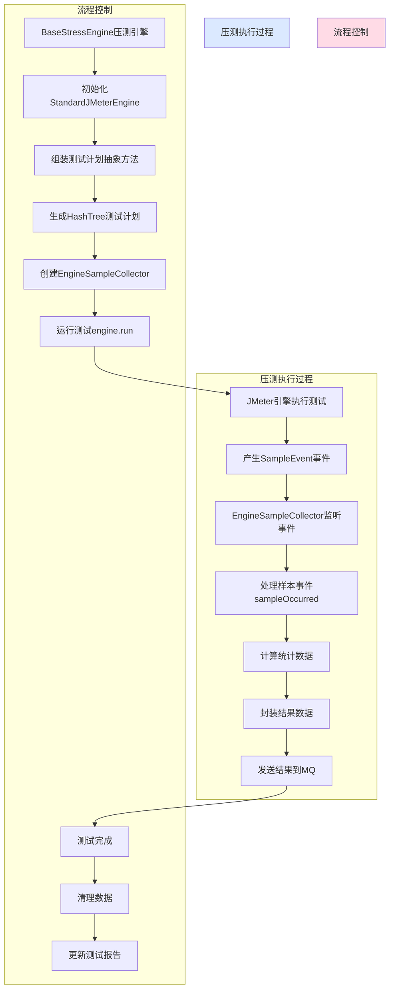

## SpringBoot如何集成Jmeter开发
  
* 需求  
  
  * 开发压测平台，Spring Boot需要调用Jmeter进行压测，如何完成？  
  
* 解决方案一：使用Runtime类调用外部进程  
  
  * `Runtime`类是Java中的一个核心类，提供了与Java运行时环境交互的方法  
  
  * 它提供了与操作系统交互的接口，使Java应用程序能够执行系统命令、访问系统资源并执行特定操作。  
  
  * 主要用途包括以下几个方面：  
  
    * 启动和管理进程  
      * `Runtime`类提供了一些方法，如`exec()`，用于启动和管理外部进程。  
      * 这使得Java应用程序能够执行系统命令、启动其他应用程序或脚本，以及与外部进程进行交互。  
    * 访问系统资源  
      * `Runtime`类提供了一些方法，如`totalMemory()`和`freeMemory()`，用于获取Java虚拟机的内存信息。  
      * 还可以使用`getSystemResource()`方法获取系统资源路径，如类路径、库路径等。  
    * 执行特定操作  
      * `Runtime`类还提供了一些方法，如`exit()`，用于终止Java应用程序。  
      * 还可以使用`nanoTime()`方法获取当前纳秒时间，以及使用`currentTimeMillis()`方法获取当前毫秒时间。  
  
  * Jmeter命令行压测讲解  
  
    * 进到jmeter的bin目录下  
  
    ```shell
    ./jmeter -n -t /Users/xdclass/Desktop/report.jmx -l /Users/xdclass/Desktop/temp/jtl/result.jtl -e -o /Users/xdclass/Desktop/temp/result  
    ```  
    - 参数说明  
      - -n 非gui方式运行jmeter  
      - -t ：jmx 脚本路径  
      - -l ：results.log 运行结果保存路径，**注意：文件名不能重复，文件夹需要存在**  
      - -e ：在脚本运行结束后生成 HTML 报告  
      - -o ：用于存放 HTML 报告的目录，**文件夹需要存在**  
  
* 编码实战（大家可以先看，然后不实操，**如果实操记得注意Window的文件路径**）  
  
  ```java
  public class TestRuntime {  
        public static void main(String[] args) {  
          try {              // 调用Jmeter执行脚本  
              Process process = Runtime.getRuntime().exec("/Users/xdclass/Desktop/coding/apache-jmeter-5.5/bin/jmeter -n -t /Users/xdclass/Desktop/test.jmx -l results.log -e -o /Users/xdclass/Desktop/result");  
  // 读取Jmeter的输出  
              BufferedReader reader = new BufferedReader(new InputStreamReader(process.getInputStream()));  
              String line;              while ((line = reader.readLine()) != null) {                  System.out.println(line);              }  // 等待Jmeter进程结束  
              int exitCode = process.waitFor();  
              System.out.println("Jmeter exit code: " + exitCode);          } catch (IOException | InterruptedException e) {              e.printStackTrace();          }      }  }  
              ```  
* **问题点：**  
  
  * **可读性和维护拓展性差，难以平台化，停留现有认知**  
  
* 需要技术组长解决的问题：  
  
  * 梳理下合理的压测流程，怎么配置压测参数、开启压测、查看测试报告更方便


## 压测引擎数据库设计

* 数据库设计思路  
  * 技术负责人基于产品需求文档，日常压测流程的痛点进行整理需求  
  * 梳理下合理的压测流程，怎么配置压测参数、开启压测、查看测试报告更方便

* 数据库模型设计

* 每个表模型字段明细  
  
```sql  
CREATE TABLE `project` (

  `id` bigint unsigned NOT NULL AUTO_INCREMENT,

  `project_admin` bigint unsigned DEFAULT NULL COMMENT '项目管理员ID',

  `name` varchar(100) CHARACTER SET utf8mb4 COLLATE utf8mb4_general_ci DEFAULT NULL COMMENT '项目名称',

  `description` varchar(200) CHARACTER SET utf8mb4 COLLATE utf8mb4_general_ci DEFAULT NULL COMMENT '描述',

  `gmt_create` datetime DEFAULT CURRENT_TIMESTAMP COMMENT '创建时间',

  `gmt_modified` datetime DEFAULT CURRENT_TIMESTAMP ON UPDATE CURRENT_TIMESTAMP COMMENT '更新时间',

  PRIMARY KEY (`id`)

) ENGINE=InnoDB AUTO_INCREMENT=7 DEFAULT CHARSET=utf8mb4 COLLATE=utf8mb4_general_ci;

CREATE TABLE `environment` (

  `id` bigint unsigned NOT NULL AUTO_INCREMENT,

  `project_id` bigint unsigned NOT NULL COMMENT '所属项目ID',

  `name` varchar(100) CHARACTER SET utf8mb4 COLLATE utf8mb4_general_ci NOT NULL COMMENT '环境名称',

  `protocol` varchar(100) CHARACTER SET utf8mb4 COLLATE utf8mb4_general_ci NOT NULL COMMENT '协议',

  `domain` varchar(100) CHARACTER SET utf8mb4 COLLATE utf8mb4_general_ci NOT NULL COMMENT '环境域名',

  `port` int unsigned NOT NULL COMMENT '端口',

  `description` varchar(200) CHARACTER SET utf8mb4 COLLATE utf8mb4_general_ci DEFAULT NULL COMMENT '描述',

  `gmt_create` datetime DEFAULT CURRENT_TIMESTAMP COMMENT '创建时间',

  `gmt_modified` datetime DEFAULT CURRENT_TIMESTAMP ON UPDATE CURRENT_TIMESTAMP COMMENT '更新时间',

  PRIMARY KEY (`id`)

) ENGINE=InnoDB AUTO_INCREMENT=13 DEFAULT CHARSET=utf8mb4 COLLATE=utf8mb4_general_ci;

CREATE TABLE `stress_case_module` (

  `id` bigint unsigned NOT NULL AUTO_INCREMENT,

  `project_id` bigint unsigned DEFAULT NULL COMMENT '所属项目ID',

  `name` varchar(50) CHARACTER SET utf8mb4 COLLATE utf8mb4_general_ci DEFAULT NULL COMMENT '接口模块名称',

  `gmt_create` datetime DEFAULT CURRENT_TIMESTAMP COMMENT '创建时间',

  `gmt_modified` datetime DEFAULT CURRENT_TIMESTAMP ON UPDATE CURRENT_TIMESTAMP COMMENT '更新时间',

  PRIMARY KEY (`id`),

  UNIQUE KEY `name` (`name`)

) ENGINE=InnoDB AUTO_INCREMENT=13 DEFAULT CHARSET=utf8mb4 COLLATE=utf8mb4_general_ci;

CREATE TABLE `stress_case` (

`id` bigint unsigned NOT NULL AUTO_INCREMENT,

`project_id` bigint unsigned NOT NULL COMMENT '所属项目ID',

`module_id` bigint unsigned DEFAULT NULL COMMENT '所属接口模块ID',

`environment_id` bigint unsigned DEFAULT NULL COMMENT '环境ID', -- 修正：保持类型一致性，添加unsigned

`name` varchar(100) CHARACTER SET utf8mb4 COLLATE utf8mb4_general_ci DEFAULT NULL COMMENT '接口名称',

`description` varchar(200) CHARACTER SET utf8mb4 COLLATE utf8mb4_general_ci DEFAULT NULL COMMENT '接口描述',

`assertion` longtext CHARACTER SET utf8mb4 COLLATE utf8mb4_general_ci COMMENT '响应断言',

`relation` longtext CHARACTER SET utf8mb4 COLLATE utf8mb4_general_ci COMMENT '可变参数',

`stress_source_type` varchar(255) CHARACTER SET utf8mb4 COLLATE utf8mb4_general_ci DEFAULT NULL COMMENT '压测类型 [simple jmx]',

`thread_group_config` longtext CHARACTER SET utf8mb4 COLLATE utf8mb4_general_ci COMMENT '压测参数',

`jmx_url` varchar(524) CHARACTER SET utf8mb4 COLLATE utf8mb4_general_ci DEFAULT NULL COMMENT 'jmx文件地址',

`path` varchar(200) CHARACTER SET utf8mb4 COLLATE utf8mb4_general_ci DEFAULT NULL COMMENT '接口路径',

`method` varchar(20) CHARACTER SET utf8mb4 COLLATE utf8mb4_general_ci DEFAULT NULL COMMENT '请求方法 [GET POST PUT PATCH DELETE HEAD OPTIONS]',

`query` longtext CHARACTER SET utf8mb4 COLLATE utf8mb4_general_ci COMMENT '查询参数',

`header` longtext CHARACTER SET utf8mb4 COLLATE utf8mb4_general_ci COMMENT '请求头',

`body` longtext CHARACTER SET utf8mb4 COLLATE utf8mb4_general_ci COMMENT '请求体',

`body_type` varchar(50) CHARACTER SET utf8mb4 COLLATE utf8mb4_general_ci DEFAULT NULL COMMENT '请求体格式 [raw form-data json]',

`gmt_create` datetime DEFAULT CURRENT_TIMESTAMP COMMENT '创建时间',

`gmt_modified` datetime DEFAULT CURRENT_TIMESTAMP ON UPDATE CURRENT_TIMESTAMP COMMENT '更新时间',

PRIMARY KEY (`id`)

) ENGINE=InnoDB AUTO_INCREMENT=18 DEFAULT CHARSET=utf8mb4 COLLATE=utf8mb4_general_ci;
  
  
  
  

CREATE TABLE `report` (

`id` bigint unsigned NOT NULL AUTO_INCREMENT,

`project_id` bigint unsigned DEFAULT NULL COMMENT '所属项目ID',

`case_id` bigint unsigned DEFAULT NULL COMMENT '用例ID', -- 修正：保持与其他ID字段类型一致，添加unsigned

`type` varchar(255) CHARACTER SET utf8mb4 COLLATE utf8mb4_general_ci DEFAULT NULL COMMENT '报告类型',

`name` varchar(150) CHARACTER SET utf8mb4 COLLATE utf8mb4_general_ci DEFAULT NULL COMMENT '报告名称',

`execute_state` varchar(255) CHARACTER SET utf8mb4 COLLATE utf8mb4_general_ci DEFAULT NULL COMMENT '执行状态',

`summary` varchar(1024) CHARACTER SET utf8mb4 COLLATE utf8mb4_general_ci DEFAULT NULL COMMENT '摘要', -- 修正：补充字符集定义，保持一致性

`start_time` bigint unsigned DEFAULT NULL COMMENT '开始时间',

`end_time` bigint unsigned DEFAULT NULL COMMENT '结束时间',

`expand_time` bigint unsigned DEFAULT NULL COMMENT '消耗时间',

`quantity` bigint unsigned DEFAULT '0' COMMENT '步骤数量', -- 修正：添加unsigned，保持数字类型一致性

`pass_quantity` bigint unsigned DEFAULT '0' COMMENT '通过数量', -- 修正：添加unsigned

`fail_quantity` bigint unsigned DEFAULT '0' COMMENT '失败数量', -- 修正：添加unsigned

`gmt_create` datetime DEFAULT CURRENT_TIMESTAMP COMMENT '创建时间',

`gmt_modified` datetime DEFAULT CURRENT_TIMESTAMP ON UPDATE CURRENT_TIMESTAMP COMMENT '更新时间',

PRIMARY KEY (`id`)

) ENGINE=InnoDB AUTO_INCREMENT=134 DEFAULT CHARSET=utf8mb4 COLLATE=utf8mb4_general_ci;
  
  
  

CREATE TABLE `report_detail_stress` (

`id` bigint unsigned NOT NULL AUTO_INCREMENT,

`report_id` bigint unsigned DEFAULT NULL COMMENT '所属报告ID',

`assert_info` longtext CHARACTER SET utf8mb4 COLLATE utf8mb4_general_ci COMMENT '断言信息',

`error_count` bigint unsigned DEFAULT NULL COMMENT '错误请求数',

`error_percentage` float unsigned DEFAULT NULL COMMENT '错误百分比',

`max_time` int unsigned DEFAULT NULL COMMENT '最大响应时间(毫秒)',

`mean_time` float unsigned DEFAULT NULL COMMENT '平均响应时间(毫秒)',

`min_time` int unsigned DEFAULT NULL COMMENT '最小响应时间(毫秒)',

`receive_k_b_per_second` float unsigned DEFAULT NULL COMMENT '每秒接收KB', -- 修正：添加unsigned，流量不会为负

`sent_k_b_per_second` float unsigned DEFAULT NULL COMMENT '每秒发送KB', -- 修正：添加unsigned

`request_location` longtext CHARACTER SET utf8mb4 COLLATE utf8mb4_general_ci COMMENT '请求路径和参数',

`request_header` longtext CHARACTER SET utf8mb4 COLLATE utf8mb4_general_ci COMMENT '请求头',

`request_body` longtext CHARACTER SET utf8mb4 COLLATE utf8mb4_general_ci COMMENT '请求体',

`request_rate` float unsigned DEFAULT NULL COMMENT '每秒请求速率',

`response_code` varchar(200) CHARACTER SET utf8mb4 COLLATE utf8mb4_general_ci DEFAULT NULL COMMENT '响应码',

`response_data` longtext CHARACTER SET utf8mb4 COLLATE utf8mb4_general_ci COMMENT '响应体',

`response_header` longtext CHARACTER SET utf8mb4 COLLATE utf8mb4_general_ci COMMENT '响应头',

`sampler_count` bigint unsigned DEFAULT NULL COMMENT '采样次数编号',

`sampler_label` varchar(200) CHARACTER SET utf8mb4 COLLATE utf8mb4_general_ci DEFAULT NULL COMMENT '请求名称',

`sample_time` bigint unsigned DEFAULT NULL COMMENT '请求时间戳', -- 修正：添加unsigned，时间戳不会为负

`gmt_create` datetime DEFAULT CURRENT_TIMESTAMP COMMENT '创建时间', -- 修正：补充注释

`gmt_modified` datetime DEFAULT CURRENT_TIMESTAMP ON UPDATE CURRENT_TIMESTAMP COMMENT '更新时间', -- 修正：补充注释

PRIMARY KEY (`id`)

) ENGINE=InnoDB AUTO_INCREMENT=151 DEFAULT CHARSET=utf8mb4 COLLATE=utf8mb4_general_ci;
  
```


- 压测用例表介绍
    

特殊字段存储介绍assertion

[{"name":"测试断言","action":"CONTAIN","from":"RESPONSE_DATA","value":"0"}]

特殊字段存储介绍relation

[{"sourceType":"csv","delimiter":",","ignoreFirstLine":false,"recycle":true,"variableNames":"id,title","remoteFilePath":"http://120.24.7.58:9000/bucket/test.csv","name":"CSV商品数据集合"}]

特殊字段存储介绍thread_group_config

{"threadGroupName":"测试","numThreads":"20","rampUp":"2","loopCount":"10","schedulerEnabled":false,"duration":0,"delay":0}


## **Jmeter压测引擎之JMX脚本组成结构分析**

- 压测引擎支持两种测试计划录入
    
    - 本地上传JMX
        
    - 在线创建测试计划
        
- Jmeter压测最终都是执行jmx脚本，主要由以下部分组成：
    
    - **Test Plan**: 这是测试脚本的主节点，所有的其他节点都应作为其子节点。
        
    - **Thread Groups**: 线程组定义了并发用户和他们的活动。每个线程组代表一组虚拟用户，他们并发执行预定的操作。
        
    - **Samplers**: Sampler是执行特定请求的节点，例如HTTP请求或JDBC请求等。这些请求产生对服务器的实际负载。
        
    - **Controllers**: 控制器节点决定JMeter如何组织和运行其测试计划中的请求。例如，使用“循环控制器”，在多个迭代中重复请求。
        
    - **Listeners**: 监听器节点用于收集和显示测试过程中的信息，如样本的结果、响应时间、吞吐量等。
        
    - **Config Elements**: 配置元素用于设置JMeter中的参数或属性。例设置cookie的HTTP Header Manager或定义用户定义的变量。
        
    - **Assertions**: 断言用于验证服务器响应是否符合预期。如果响应不符合预期，断言将标记样本为失败。
        
    - **Pre-Processors, Post-Processors, and Assertions**: 这些节点用于处理服务器响应或在发送请求之前设置请求的某些属性。
        

- 一个典型的JMX脚本的结构如下
    
    - 具体内容会根据实际的测试需求有所不同
        
    - 可以通级别节点添加，也可以子节点添加
        
    ```html
    
     <jmeterTestPlan version="1.2">  
    
      <hashTree>  
    
        <TestPlan guiclass="TestPlanGui" testclass="TestPlan" testname="Load Test" enabled="true">  
    
          ...  
    
          <ThreadGroup guiclass="ThreadGroupGui" testclass="ThreadGroup" testname="Users" enabled="true">  
    
            ...  
    
            <SamplerController guiclass="HashTreeControllerGui" testclass="SamplerController" testname="Samplers" enabled="true">  
    
              ...  
    
              <HashTree>  
    
                <HTTPSamplerProxy guiclass="HttpTestSampleGui" testclass="HTTPSamplerProxy" testname="GET request to example.com" enabled="true">  
    
                  ...  
    
                </HTTPSamplerProxy>  
    
                ...  
    
              </HashTree>  
    
            </SamplerController>  
    
            ...  
    
          </ThreadGroup>  
    
          ...  
    
        </TestPlan>  
    
      </hashTree>  
    
    </jmeterTestPlan>
    ```

- XML脚本里面组件的共同点


## java集成Jmeter二次开发方案介绍-jmx脚本执行案例（注意Window和Linux文件夹路径问题）

```java

/**

     * 测试JMeter脚本

     * @throws Exception 异常

     */

    @Test

    public void testJmeterScript()throws Exception{

        // JMeter路径

        String jmeterPath = "/Users/xdclass/Desktop/coding/apache-jmeter-5.5";

        // JMeter根目录

        File jmeterHome = new File(jmeterPath);

        // JMX文件路径

        String jmxFilePath = "/Users/xdclass/Desktop/课程资料-jmx集合/query.jmx";

        // JMX文件

        File jmxFile = new File(jmxFilePath);

        // JMeter配置文件路径

        File jmeterProperties = new File(jmeterHome.getPath() + File.separator + "bin" + File.separator + "jmeter.properties");

        // 设置JMeter根目录

        JMeterUtils.setJMeterHome(jmeterHome.getPath());

        // 加载JMeter配置文件

        JMeterUtils.loadJMeterProperties(jmeterProperties.getPath());

        // JMeter标准引擎

        StandardJMeterEngine jmeter = new StandardJMeterEngine();

        // 测试计划树

        HashTree testPlanTree = new HashTree();

        // 设置文件服务器的基础脚本路径

        FileServer.getFileServer().setBaseForScript(jmxFile);

        // 加载测试计划树 jmx脚本

        testPlanTree = SaveService.loadTree(jmxFile);

        // 转换测试计划树

        JMeter.convertSubTree(testPlanTree, false);

        // Summariser对象

        Summariser summer = null;

        // Summariser名称

        String summariserName = JMeterUtils.getPropDefault("summariser.name", "summary");

        if (!summariserName.isEmpty()) {

            // 创建Summariser对象

            summer = new Summariser(summariserName);

        }

        // 结果日志文件名

        String logFile = "example.csv";

        // 结果收集器

        ResultCollector logger = new ResultCollector (summer);

        logger.setFilename(logFile);

        // 将结果收集器添加到测试计划树上

        testPlanTree.add(testPlanTree.getArray()[0], logger);

        // 配置JMeter引擎

        jmeter.configure(testPlanTree);

        // 运行JMeter测试

        jmeter.run();

    }
```


## 压测平台设计思路


# **云测平台Jmeter二次开发流程拆解和梳理**

- Jmeter二次开发流程梳理


- 步骤拆分
    
    - 环境初始化是 主要是设置JMeter的运行环境，包括安装JMeter、设置Java环境等。
        
        - **安装 JMeter**: 下载 JMeter 安装包并按照官方指南进行安装，即指定SpringBoot程序可以识别JmeterHome路径
            
    - 脚本加载主要是通过各种方式加载和解析JMeter脚本，通常包括从文件加载和从数据库加载等。
        
        - **从文件加载**: 使用 `TestPlan` 和 `HashTree` 类来加载脚本文件。
            
        
        HashTree testPlanTree = SaveService.loadTree(new File("path_to_jmeter_script.jmx"));
        
        - **从数据库加载**: 如果脚本存储在数据库中，可以使用 JDBC 连接器来读取并解析脚本。
            
    - 用例执行是实际运行JMeter测试的部分，通常涉及启动线程组、采样器等。
        
        - **启动线程组**: 使用 `ThreadGroup` 类来启动线程组
            
        - **采样器执行**: 采样器是实际发送请求的部分，可以使用 `HTTPSamplerProxy` 等类来创建和执行采样器。
            
        - **监听器和后处理**: 可以添加监听器来收集测试结果，并在测试结束后进行后处理。
            
    - 测试结果收集主要是收集测试过程中的数据，包括响应时间、请求结果等
        
        - **使用 ViewResultsTree 监听器**: `ViewResultsTree` 是一个常用的监听器，可以显示测试结果树。
            
        - **自定义监听器**:
            
            - 如果需要更定制化的结果收集，可以创建自定义监听器类。
                
            - 自定义监听器需要实现 `ResultCollector` 接口，并在测试过程中添加到测试计划中。

- 代码案例拆解


# **JmeterEngine模块封装**

- 需求
    
    - 压测引擎支持两种测试计划录入
        
        - 本地上传JMX
            
        - 在线创建测试计划
            
    - 执行压测也分两种方式，对外提供HTTP接口，根据类型执行不同策略
        
        - 本地JMX执行
            
        - 在线创建测试计划执行

```java

package com.wychmod.util;  
  
import org.apache.jmeter.engine.StandardJMeterEngine;  
import org.apache.jmeter.util.JMeterUtils;  
import java.io.File;  
import java.util.Objects;  
  
  
  
/**  
 * @description: 压测环境初始化工具类  
 * @author: wychmod  
 * @date: 2025-10-1  
 */public class StressTestUtil {  
  
    /**  
     * 获取JMeter安装目录的路径  
     * 此方法通过类加载器查找JMeter资源文件的位置，以确定JMeter的安装目录  
     * 使用类加载器确保了即使在不同环境下，也能正确地定位到JMeter的安装路径  
     *  
     * @return JMeter安装目录的路径  
     * @throws RuntimeException 如果无法定位JMeter资源，则抛出运行时异常  
     */  
    public static String getJmeterHome() {  
        try {  
            // 使用StressTestUtil类的类加载器查找JMeter资源文件的位置，并返回其路径  
            return Objects.requireNonNull(StressTestUtil.class.getClassLoader().getResource("jmeter")).getPath();  
        } catch (Exception e) {  
            // 如果查找资源失败，抛出自定义的运行时异常  
            throw new RuntimeException("Failed to locate JMeter resources", e);  
        }  
    }  
  
    /**  
     * 获取JMeter安装目录下的bin子目录路径  
     * @return JMeter安装目录下的bin子目录路径  
     */  
    public static String getJmeterHomeBin() {  
        return getJmeterHome() + File.separator + "bin";  
    }  
  
    /**  
     * 初始化JMeter环境 此处为1  
     * 该方法通过加载JMeter的配置文件并设置一些基本属性来初始化JMeter环境  
     * 1. 环境初始化  
     * 2. 测试脚本  
     * 3. 用例执行  
     * 4. 结果收集  
     */  
    public static void initJmeterProperties() {  
        String jmeterHomeBin = getJmeterHomeBin();  
  
        // 确保路径正确拼接，这里直接用jmeterHomeBin已包含separator  
        String jmeterPropertiesPath = jmeterHomeBin + File.separator +"jmeter.properties";  
  
        // 加载JMeter的配置文件  
        JMeterUtils.loadJMeterProperties(jmeterPropertiesPath);  
  
        // 设置JMeter的安装目录  
        JMeterUtils.setJMeterHome(getJmeterHome());  
        // 设置乱码问题  
        JMeterUtils.setProperty("sampleresult.default.encoding","utf-8");  
        // 初始化本地环境  
        JMeterUtils.initLocale();  
    }  
  
    /**  
     * 获取JMeter引擎实例  
     * 在创建引擎实例之前，首先初始化JMeter的属性  
     * @return StandardJMeterEngine实例  
     */  
    public static StandardJMeterEngine getJMeterEngine(){  
        initJmeterProperties();  
        return new StandardJMeterEngine();  
    }  
  
}
```

# 压测结果收集

- 如何自定义压测结果收集器
    
    - 继承ResultCollector，重写里面的方法 `public void sampleOccurred(SampleEvent event)`
        
    - sampleOccurred方法会收集每次请求的结果，里面可以获取压测相关的数据
        
- `SamplingStatCalculator`类介绍

	- 是 Apache JMeter 中的一个类，用于计算采样器的统计数据类
	    
	- 提供了对采样器结果的一些关键指标的快速访问，如样本数、平均时间、最小时间、最大时间等
	    
	- 一个线程组下面可能有多个不同的请求，因此需要区分不同的统计数据类
```java
/**  
 * 当样本事件发生时调用此方法  
 * 该方法处理样本事件，计算统计信息，并发送结果  
 * 1. 获取event事件结果  
 * 2. 根据结果的标签，获取对应的采样统计计算器  
 * 3. 创建结果对象，封装采样统计计算器的结果  
 * 4. 将结果转换成json，发送mq  
 * @param event 样本事件对象，包含样本数据和事件信息  
 */  
@Override  
public void sampleOccurred(SampleEvent event)  
{  
    super.sampleOccurred(event);  
  
    // 获取event事件结果  
    SampleResult result = event.getResult();  
  
    // 获取结果的样本标签  
    String sampleLabel = result.getSampleLabel();  
  
    // 从计算器映射中获取对应的采样统计计算器  
    SamplingStatCalculator samplingStatCalculator = calculatorMap.get(sampleLabel);  
  
    // 如果没有找到对应的采样统计计算器，则创建一个新的计算器并添加样本结果  
    if (samplingStatCalculator == null) {  
        samplingStatCalculator = new SamplingStatCalculator(sampleLabel);  
        samplingStatCalculator.addSample(result);  
        calculatorMap.put(sampleLabel, samplingStatCalculator);  
    }else {  
        // 如果找到了对应的采样统计计算器，则直接添加样本结果  
        samplingStatCalculator.addSample(result);  
    }  
  
    //封装采样器结果数据  
    StressSampleResultDTO stressSampleResultDTO = new StressSampleResultDTO();  
    stressSampleResultDTO.setReportId(reportDTO.getId());  
    stressSampleResultDTO.setSampleTime(result.getTimeStamp());  
    stressSampleResultDTO.setSampleLabel(result.getSampleLabel());  
    stressSampleResultDTO.setSampleCount(samplingStatCalculator.getMax().intValue());  
    stressSampleResultDTO.setMaxTime(samplingStatCalculator.getMax().intValue());  
    stressSampleResultDTO.setMeanTime(samplingStatCalculator.getMean());  
    stressSampleResultDTO.setMinTime(samplingStatCalculator.getMin().intValue());  
    stressSampleResultDTO.setErrorpercentage(samplingStatCalculator.getErrorPercentage());  
    stressSampleResultDTO.setErrorCount(samplingStatCalculator.getErrorCount());  
    stressSampleResultDTO.setRequestRate(samplingStatCalculator.getRate());  
    stressSampleResultDTO.setReceiveKBPerSecound(samplingStatCalculator.getKBPerSecond());  
    stressSampleResultDTO.setSendKBPerSecound(samplingStatCalculator.getSentKBPerSecond());  
    stressSampleResultDTO.setRequestLocation(event.getResult().getUrlAsString());  
    stressSampleResultDTO.setRequestHeader(event.getResult().getRequestHeaders());  
    stressSampleResultDTO.setRequestBody(event.getResult().getSamplerData());  
    stressSampleResultDTO.setResponseCode(event.getResult().getResponseCode());  
    stressSampleResultDTO.setResponseHeader(event.getResult().getResponseHeaders());  
    stressSampleResultDTO.setResponseDate(event.getResult().getResponseData());  
    stressSampleResultDTO.setSampleCount(samplingStatCalculator.getCount());  
  
    // 断言  
    AssertionResult[] assertionResults = event.getResult().getAssertionResults();  
    StringBuilder assertMsg = new StringBuilder();  
    for (AssertionResult assertionResult : assertionResults) {  
        assertMsg.append("name").append(assertionResult.getName()).append("msg=").append(assertionResult.getFailureMessage()).append(",");  
    }  
    stressSampleResultDTO.setAssertInfo(assertMsg.toString());  
  
    // 将结果对象转换为JSON字符串并记录日志  
    String resultJson = JSON.toJSONString(stressSampleResultDTO);  
    log.info(resultJson);  
  
    // 创建用例信息对象并发送结果  
    CaseInfoDTO caseInfoDTO = new CaseInfoDTO(stressCaseDO.getId(),stressCaseDO.getModuleId(),stressCaseDO.getName());  
    resultSenderService.sendResult(caseInfoDTO, TestTypeEnum.STRESS, resultJson);  
}
```
    
    
- 正式开发思路
    
    - 构建一个Map存储不同的结果收集器(因为有不同的接口要压测，一个结果里面数据不同，要封装不同的结果收集器)
        
    - 注入消息组件对象，每次sampleOccurred触发的时候把结果收集发送到消息组件
