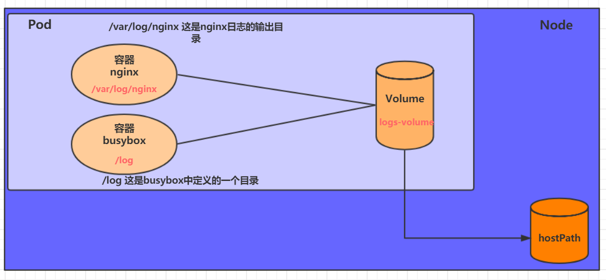

# 数据存储

​    在前面已经提到，容器的生命周期可能很短，会被频繁地创建和销毁。那么容器在销毁时，保存在容器中的数据也会被清除。这种结果对用户来说，在某些情况下是不乐意看到的。为了持久化保存容器的数据，kubernetes引入了Volume的概念。

​    Volume是Pod中能够被多个容器访问的共享目录，它被定义在Pod上，然后被一个Pod里的多个容器挂载到具体的文件目录下，kubernetes通过Volume实现同一个Pod中不同容器之间的数据共享以及数据的持久化存储。Volume的生命容器不与Pod中单个容器的生命周期相关，当容器终止或者重启时，Volume中的数据也不会丢失。

kubernetes的Volume支持多种类型，比较常见的有下面几个：

- 简单存储：EmptyDir、HostPath、NFS
- 高级存储：PV、PVC
- 配置存储：ConfigMap、Secret

## 基本存储

### EmptyDir

​    EmptyDir是最基础的Volume类型，一个EmptyDir就是Host上的一个空目录。

​    EmptyDir是在Pod被分配到Node时创建的，它的初始内容为空，并且无须指定宿主机上对应的目录文件，因为kubernetes会自动分配一个目录，当Pod销毁时， EmptyDir中的数据也会被永久删除。 EmptyDir用途如下：

- 临时空间，例如用于某些应用程序运行时所需的临时目录，且无须永久保留

- 一个容器需要从另一个容器中获取数据的目录（多容器共享目录）

接下来，通过一个容器之间文件共享的案例来使用一下EmptyDir。

​    在一个Pod中准备两个容器nginx和busybox，然后声明一个Volume分别挂在到两个容器的目录中，然后nginx容器负责向Volume中写日志，busybox中通过命令将日志内容读到控制台。


创建一个volume-emptydir.yaml

~~~yaml
apiVersion: v1
kind: Pod
metadata:
  name: volume-emptydir
  namespace: dev
spec:
  containers:
  - name: nginx
    image: nginx:1.14-alpine
    ports:
    - containerPort: 80
    volumeMounts:  # 将logs-volume挂在到nginx容器中，对应的目录为 /var/log/nginx
    - name: logs-volume
      mountPath: /var/log/nginx
  - name: busybox
    image: busybox:1.30
    command: ["/bin/sh","-c","tail -f /logs/access.log"] # 初始命令，动态读取指定文件中内容
    volumeMounts:  # 将logs-volume 挂在到busybox容器中，对应的目录为 /logs
    - name: logs-volume
      mountPath: /logs
  volumes: # 声明volume， name为logs-volume，类型为emptyDir
  - name: logs-volume
    emptyDir: {}
~~~

~~~powershell
# 创建Pod
[root@master ~]# kubectl create -f volume-emptydir.yaml
pod/volume-emptydir created

# 查看pod
[root@master ~]# kubectl get pods volume-emptydir -n dev -o wide
NAME                  READY   STATUS    RESTARTS   AGE   IP             NODE   ...... 
volume-emptydir   2/2     Running   0          97s   10.244.1.100   node1  ......

# 通过podIp访问nginx
[root@master ~]# curl 10.244.1.100
......

# 通过kubectl logs命令查看指定容器的标准输出
[root@master ~]# kubectl logs -f volume-emptydir -n dev -c busybox
10.244.0.0 - - [13/Apr/2020:10:58:47 +0000] "GET / HTTP/1.1" 200 612 "-" "curl/7.29.0" "-"
~~~

### HostPath

​    上节课提到，EmptyDir中数据不会被持久化，它会随着Pod的结束而销毁，如果想简单的将数据持久化到主机中，可以选择HostPath。

​    HostPath就是将Node主机中一个实际目录挂在到Pod中，以供容器使用，这样的设计就可以保证Pod销毁了，但是数据依据可以存在于Node主机上。



创建一个volume-hostpath.yaml：

~~~yaml
apiVersion: v1
kind: Pod
metadata:
  name: volume-hostpath
  namespace: dev
spec:
  containers:
  - name: nginx
    image: nginx:1.17.1
    ports:
    - containerPort: 80
    volumeMounts:
    - name: logs-volume
      mountPath: /var/log/nginx
  - name: busybox
    image: busybox:1.30
    command: ["/bin/sh","-c","tail -f /logs/access.log"]
    volumeMounts:
    - name: logs-volume
      mountPath: /logs
  volumes:
  - name: logs-volume
    hostPath: 
      path: /root/logs
      type: DirectoryOrCreate  # 目录存在就使用，不存在就先创建后使用
~~~

~~~markdown
关于type的值的一点说明：
	DirectoryOrCreate 目录存在就使用，不存在就先创建后使用
	Directory	目录必须存在
	FileOrCreate  文件存在就使用，不存在就先创建后使用
	File 文件必须存在	
    Socket	unix套接字必须存在
	CharDevice	字符设备必须存在
	BlockDevice 块设备必须存在
~~~

~~~powershell
# 创建Pod
[root@master ~]# kubectl create -f volume-hostpath.yaml
pod/volume-hostpath created

# 查看Pod
[root@master ~]# kubectl get pods volume-hostpath -n dev -o wide
NAME                  READY   STATUS    RESTARTS   AGE   IP             NODE   ......
pod-volume-hostpath   2/2     Running   0          16s   10.244.1.104   node1  ......

#访问nginx
[root@master ~]# curl 10.244.1.104

# 接下来就可以去host的/root/logs目录下查看存储的文件了
###  注意: 下面的操作需要到Pod所在的节点运行（案例中是node1）
[root@node1 ~]# ls /root/logs/
access.log  error.log

# 同样的道理，如果在此目录下创建一个文件，到容器中也是可以看到的
~~~

### NFS

​    HostPath可以解决数据持久化的问题，但是一旦Node节点故障了，Pod如果转移到了别的节点，又会出现问题了，此时需要准备单独的网络存储系统，比较常用的用NFS、CIFS。

​    NFS是一个网络文件存储系统，可以搭建一台NFS服务器，然后将Pod中的存储直接连接到NFS系统上，这样的话，无论Pod在节点上怎么转移，只要Node跟NFS的对接没问题，数据就可以成功访问。


1）首先要准备nfs的服务器，这里为了简单，直接是master节点做nfs服务器

~~~powershell
# 在master上安装nfs服务
[root@master ~]# yum install nfs-utils -y

# 准备一个共享目录
[root@master ~]# mkdir /root/data/nfs -pv

# 将共享目录以读写权限暴露给192.168.109.0/24网段中的所有主机
[root@master ~]# vim /etc/exports
[root@master ~]# more /etc/exports
/root/data/nfs     192.168.109.0/24(rw,no_root_squash)

# 启动nfs服务
[root@master ~]# systemctl start nfs
~~~

2）接下来，要在的每个node节点上都安装下nfs，这样的目的是为了node节点可以驱动nfs设备

~~~powershell
# 在node上安装nfs服务，注意不需要启动
[root@master ~]# yum install nfs-utils -y
~~~

3）接下来，就可以编写pod的配置文件了，创建volume-nfs.yaml

~~~yaml
apiVersion: v1
kind: Pod
metadata:
  name: volume-nfs
  namespace: dev
spec:
  containers:
  - name: nginx
    image: nginx:1.17.1
    ports:
    - containerPort: 80
    volumeMounts:
    - name: logs-volume
      mountPath: /var/log/nginx
  - name: busybox
    image: busybox:1.30
    command: ["/bin/sh","-c","tail -f /logs/access.log"] 
    volumeMounts:
    - name: logs-volume
      mountPath: /logs
  volumes:
  - name: logs-volume
    nfs:
      server: 192.168.109.100  #nfs服务器地址
      path: /root/data/nfs #共享文件路径
~~~

4）最后，运行下pod，观察结果

~~~powershell
# 创建pod
[root@master ~]# kubectl create -f volume-nfs.yaml
pod/volume-nfs created

# 查看pod
[root@master ~]# kubectl get pods volume-nfs -n dev
NAME                  READY   STATUS    RESTARTS   AGE
volume-nfs        2/2     Running   0          2m9s

# 查看nfs服务器上的共享目录，发现已经有文件了
[root@master ~]# ls /root/data/
access.log  error.log
~~~

##高级存储

### PV和PVC

​    前面已经学习了使用NFS提供存储，此时就要求用户会搭建NFS系统，并且会在yaml配置nfs。由于kubernetes支持的存储系统有很多，要求客户全都掌握，显然不现实。为了能够屏蔽底层存储实现的细节，方便用户使用， kubernetes引入PV和PVC两种资源对象。

​    PV（Persistent Volume）是持久化卷的意思，是对底层的共享存储的一种抽象。一般情况下PV由kubernetes管理员进行创建和配置，它与底层具体的共享存储技术有关，并通过插件完成与共享存储的对接。

​    PVC（Persistent Volume Claim）是持久卷声明的意思，是用户对于存储需求的一种声明。换句话说，PVC其实就是用户向kubernetes系统发出的一种资源需求申请。


使用了PV和PVC之后，工作可以得到进一步的细分：

- 存储：存储工程师维护
- PV：  kubernetes管理员维护
- PVC：kubernetes用户维护

### PV

PV是存储资源的抽象，下面是资源清单文件:

~~~yaml
apiVersion: v1  
kind: PersistentVolume
metadata:
  name: pv2
spec:
  nfs: # 存储类型，与底层真正存储对应
  capacity:  # 存储能力，目前只支持存储空间的设置
    storage: 2Gi
  accessModes:  # 访问模式
  storageClassName: # 存储类别
  persistentVolumeReclaimPolicy: # 回收策略
~~~

PV 的关键配置参数说明：

- **存储类型**

  底层实际存储的类型，kubernetes支持多种存储类型，每种存储类型的配置都有所差异

- **存储能力（capacity）**

​      目前只支持存储空间的设置( storage=1Gi )，不过未来可能会加入IOPS、吞吐量等指标的配置

- **访问模式（accessModes）**

  用于描述用户应用对存储资源的访问权限，访问权限包括下面几种方式：

  - ReadWriteOnce（RWO）：读写权限，但是只能被单个节点挂载
  - ReadOnlyMany（ROX）：  只读权限，可以被多个节点挂载
  - ReadWriteMany（RWX）：读写权限，可以被多个节点挂载

  `需要注意的是，底层不同的存储类型可能支持的访问模式不同`

- **回收策略（persistentVolumeReclaimPolicy）**

  当PV不再被使用了之后，对其的处理方式。目前支持三种策略：

  - Retain  （保留）  保留数据，需要管理员手工清理数据
  - Recycle（回收）  清除 PV 中的数据，效果相当于执行 rm -rf /thevolume/*
  - Delete  （删除） 与 PV 相连的后端存储完成 volume 的删除操作，当然这常见于云服务商的存储服务

  `需要注意的是，底层不同的存储类型可能支持的回收策略不同`

- **存储类别**

  PV可以通过storageClassName参数指定一个存储类别

  - 具有特定类别的PV只能与请求了该类别的PVC进行绑定

  - 未设定类别的PV则只能与不请求任何类别的PVC进行绑定

- **状态（status）**

  一个 PV 的生命周期中，可能会处于4中不同的阶段：

  - Available（可用）：     表示可用状态，还未被任何 PVC 绑定
  - Bound（已绑定）：     表示 PV 已经被 PVC 绑定
  - Released（已释放）： 表示 PVC 被删除，但是资源还未被集群重新声明
  - Failed（失败）：         表示该 PV 的自动回收失败

**实验**

使用NFS作为存储，来演示PV的使用，创建3个PV，对应NFS中的3个暴露的路径。

1) 准备NFS环境

~~~powershell
# 创建目录
[root@master ~]# mkdir /root/data/{pv1,pv2,pv3} -pv

# 暴露服务
[root@master ~]# more /etc/exports
/root/data/pv1     192.168.109.0/24(rw,no_root_squash)
/root/data/pv2     192.168.109.0/24(rw,no_root_squash)
/root/data/pv3     192.168.109.0/24(rw,no_root_squash)

# 重启服务
[root@master ~]#  systemctl restart nfs
~~~

2) 创建pv.yaml

~~~yaml
apiVersion: v1
kind: PersistentVolume
metadata:
  name:  pv1
spec:
  capacity: 
    storage: 1Gi
  accessModes:
  - ReadWriteMany
  persistentVolumeReclaimPolicy: Retain
  nfs:
    path: /root/data/pv1
    server: 192.168.109.100

---

apiVersion: v1
kind: PersistentVolume
metadata:
  name:  pv2
spec:
  capacity: 
    storage: 2Gi
  accessModes:
  - ReadWriteMany
  persistentVolumeReclaimPolicy: Retain
  nfs:
    path: /root/data/pv2
    server: 192.168.109.100
    
---

apiVersion: v1
kind: PersistentVolume
metadata:
  name:  pv3
spec:
  capacity: 
    storage: 3Gi
  accessModes:
  - ReadWriteMany
  persistentVolumeReclaimPolicy: Retain
  nfs:
    path: /root/data/pv3
    server: 192.168.109.100
~~~

~~~powershell
# 创建 pv
[root@master ~]# kubectl create -f pv.yaml
persistentvolume/pv1 created
persistentvolume/pv2 created
persistentvolume/pv3 created

# 查看pv
[root@master ~]# kubectl get pv -o wide
NAME   CAPACITY   ACCESS MODES  RECLAIM POLICY  STATUS      AGE   VOLUMEMODE
pv1    1Gi        RWX            Retain        Available    10s   Filesystem
pv2    2Gi        RWX            Retain        Available    10s   Filesystem
pv3    3Gi        RWX            Retain        Available    9s    Filesystem
~~~

### PVC

PVC是资源的申请，用来声明对存储空间、访问模式、存储类别需求信息。下面是资源清单文件:

~~~yaml
apiVersion: v1
kind: PersistentVolumeClaim
metadata:
  name: pvc
  namespace: dev
spec:
  accessModes: # 访问模式
  selector: # 采用标签对PV选择
  storageClassName: # 存储类别
  resources: # 请求空间
    requests:
      storage: 5Gi
~~~

PVC 的关键配置参数说明：

- **访问模式（accessModes）**

​       用于描述用户应用对存储资源的访问权限

- **选择条件（selector）**

  通过Label Selector的设置，可使PVC对于系统中己存在的PV进行筛选

- **存储类别（storageClassName）**

  PVC在定义时可以设定需要的后端存储的类别，只有设置了该class的pv才能被系统选出

- **资源请求（Resources ）**

  描述对存储资源的请求

**实验**

1)  创建pvc.yaml，申请pv

~~~yaml
apiVersion: v1
kind: PersistentVolumeClaim
metadata:
  name: pvc1
  namespace: dev
spec:
  accessModes: 
  - ReadWriteMany
  resources:
    requests:
      storage: 1Gi
      
---

apiVersion: v1
kind: PersistentVolumeClaim
metadata:
  name: pvc2
  namespace: dev
spec:
  accessModes: 
  - ReadWriteMany
  resources:
    requests:
      storage: 1Gi
     
---

apiVersion: v1
kind: PersistentVolumeClaim
metadata:
  name: pvc3
  namespace: dev
spec:
  accessModes: 
  - ReadWriteMany
  resources:
    requests:
      storage: 1Gi
~~~

~~~powershell
# 创建pvc
[root@master ~]# kubectl create -f pvc.yaml
persistentvolumeclaim/pvc1 created
persistentvolumeclaim/pvc2 created
persistentvolumeclaim/pvc3 created

# 查看pvc
[root@master ~]# kubectl get pvc  -n dev -o wide
NAME   STATUS   VOLUME   CAPACITY   ACCESS MODES   STORAGECLASS   AGE   VOLUMEMODE
pvc1   Bound    pv1      1Gi        RWX                           15s   Filesystem
pvc2   Bound    pv2      2Gi        RWX                           15s   Filesystem
pvc3   Bound    pv3      3Gi        RWX                           15s   Filesystem

# 查看pv
[root@master ~]# kubectl get pv -o wide
NAME  CAPACITY ACCESS MODES  RECLAIM POLICY  STATUS    CLAIM       AGE     VOLUMEMODE
pv1    1Gi        RWx        Retain          Bound    dev/pvc1    3h37m    Filesystem
pv2    2Gi        RWX        Retain          Bound    dev/pvc2    3h37m    Filesystem
pv3    3Gi        RWX        Retain          Bound    dev/pvc3    3h37m    Filesystem   
~~~

2)  创建pods.yaml, 使用pv

~~~yaml
apiVersion: v1
kind: Pod
metadata:
  name: pod1
  namespace: dev
spec:
  containers:
  - name: busybox
    image: busybox:1.30
    command: ["/bin/sh","-c","while true;do echo pod1 >> /root/out.txt; sleep 10; done;"]
    volumeMounts:
    - name: volume
      mountPath: /root/
  volumes:
    - name: volume
      persistentVolumeClaim:
        claimName: pvc1
        readOnly: false
---
apiVersion: v1
kind: Pod
metadata:
  name: pod2
  namespace: dev
spec:
  containers:
  - name: busybox
    image: busybox:1.30
    command: ["/bin/sh","-c","while true;do echo pod2 >> /root/out.txt; sleep 10; done;"]
    volumeMounts:
    - name: volume
      mountPath: /root/
  volumes:
    - name: volume
      persistentVolumeClaim:
        claimName: pvc2
        readOnly: false        
~~~

~~~powershell
# 创建pod
[root@master ~]# kubectl create -f pods.yaml
pod/pod1 created
pod/pod2 created

# 查看pod
[root@master ~]# kubectl get pods -n dev -o wide
NAME   READY   STATUS    RESTARTS   AGE   IP            NODE   
pod1   1/1     Running   0          14s   10.244.1.69   node1   
pod2   1/1     Running   0          14s   10.244.1.70   node1  

# 查看pvc
[root@master ~]# kubectl get pvc -n dev -o wide
NAME   STATUS   VOLUME   CAPACITY   ACCESS MODES      AGE   VOLUMEMODE
pvc1   Bound    pv1      1Gi        RWX               94m   Filesystem
pvc2   Bound    pv2      2Gi        RWX               94m   Filesystem
pvc3   Bound    pv3      3Gi        RWX               94m   Filesystem

# 查看pv
[root@master ~]# kubectl get pv -n dev -o wide
NAME   CAPACITY   ACCESS MODES   RECLAIM POLICY   STATUS   CLAIM       AGE     VOLUMEMODE
pv1    1Gi        RWX            Retain           Bound    dev/pvc1    5h11m   Filesystem
pv2    2Gi        RWX            Retain           Bound    dev/pvc2    5h11m   Filesystem
pv3    3Gi        RWX            Retain           Bound    dev/pvc3    5h11m   Filesystem

# 查看nfs中的文件存储
[root@master ~]# more /root/data/pv1/out.txt
node1
node1
[root@master ~]# more /root/data/pv2/out.txt
node2
node2
~~~

### 生命周期

PVC和PV是一一对应的，PV和PVC之间的相互作用遵循以下生命周期：

- **资源供应**：管理员手动创建底层存储和PV

- **资源绑定**：用户创建PVC，kubernetes负责根据PVC的声明去寻找PV，并绑定

  在用户定义好PVC之后，系统将根据PVC对存储资源的请求在已存在的PV中选择一个满足条件的

  - 一旦找到，就将该PV与用户定义的PVC进行绑定，用户的应用就可以使用这个PVC了

  - 如果找不到，PVC则会无限期处于Pending状态，直到等到系统管理员创建了一个符合其要求的PV

  PV一旦绑定到某个PVC上，就会被这个PVC独占，不能再与其他PVC进行绑定了

- **资源使用**：用户可在pod中像volume一样使用pvc

  Pod使用Volume的定义，将PVC挂载到容器内的某个路径进行使用。

- **资源释放**：用户删除pvc来释放pv

  当存储资源使用完毕后，用户可以删除PVC，与该PVC绑定的PV将会被标记为“已释放”，但还不能立刻与其他PVC进行绑定。通过之前PVC写入的数据可能还被留在存储设备上，只有在清除之后该PV才能再次使用。

- **资源回收**：kubernetes根据pv设置的回收策略进行资源的回收

  对于PV，管理员可以设定回收策略，用于设置与之绑定的PVC释放资源之后如何处理遗留数据的问题。只有PV的存储空间完成回收，才能供新的PVC绑定和使用


## 配置存储

### ConfigMap

ConfigMap是一种比较特殊的存储卷，它的主要作用是用来存储配置信息的。

创建configmap.yaml，内容如下：

~~~yaml
apiVersion: v1
kind: ConfigMap
metadata:
  name: configmap
  namespace: dev
data:
  info: |
    username:admin
    password:123456
~~~

接下来，使用此配置文件创建configmap

~~~powershell
# 创建configmap
[root@master ~]# kubectl create -f configmap.yaml
configmap/configmap created

# 查看configmap详情
[root@master ~]# kubectl describe cm configmap -n dev
Name:         configmap
Namespace:    dev
Labels:       <none>
Annotations:  <none>

Data
====
info:
----
username:admin
password:123456

Events:  <none>
~~~

接下来创建一个pod-configmap.yaml，将上面创建的configmap挂载进去

~~~yaml
apiVersion: v1
kind: Pod
metadata:
  name: pod-configmap
  namespace: dev
spec:
  containers:
  - name: nginx
    image: nginx:1.17.1
    volumeMounts: # 将configmap挂载到目录
    - name: config
      mountPath: /configmap/config
  volumes: # 引用configmap
  - name: config
    configMap:
      name: configmap
~~~

~~~powershell
# 创建pod
[root@master ~]# kubectl create -f pod-configmap.yaml
pod/pod-configmap created

# 查看pod
[root@master ~]# kubectl get pod pod-configmap -n dev
NAME            READY   STATUS    RESTARTS   AGE
pod-configmap   1/1     Running   0          6s

#进入容器
[root@master ~]# kubectl exec -it pod-configmap -n dev /bin/sh
# cd /configmap/config/
# ls
info
# more info
username:admin
password:123456

# 可以看到映射已经成功，每个configmap都映射成了一个目录
# key--->文件     value---->文件中的内容
# 此时如果更新configmap的内容, 容器中的值也会动态更新
~~~

### Secret

​    在kubernetes中，还存在一种和ConfigMap非常类似的对象，称为Secret对象。它主要用于存储敏感信息，例如密码、秘钥、证书等等。

1)  首先使用base64对数据进行编码

~~~yaml
[root@master ~]# echo -n 'admin' | base64 #准备username
YWRtaW4=
[root@master ~]# echo -n '123456' | base64 #准备password
MTIzNDU2
~~~

2)  接下来编写secret.yaml，并创建Secret

~~~yaml
apiVersion: v1
kind: Secret
metadata:
  name: secret
  namespace: dev
type: Opaque
data:
  username: YWRtaW4=
  password: MTIzNDU2
~~~

~~~powershell
# 创建secret
[root@master ~]# kubectl create -f secret.yaml
secret/secret created

# 查看secret详情
[root@master ~]# kubectl describe secret secret -n dev
Name:         secret
Namespace:    dev
Labels:       <none>
Annotations:  <none>
Type:  Opaque
Data
====
password:  6 bytes
username:  5 bytes
~~~

3) 创建pod-secret.yaml，将上面创建的secret挂载进去：

~~~yaml
apiVersion: v1
kind: Pod
metadata:
  name: pod-secret
  namespace: dev
spec:
  containers:
  - name: nginx
    image: nginx:1.17.1
    volumeMounts: # 将secret挂载到目录
    - name: config
      mountPath: /secret/config
  volumes:
  - name: config
    secret:
      secretName: secret
~~~

~~~powershell
# 创建pod
[root@master ~]# kubectl create -f pod-secret.yaml
pod/pod-secret created

# 查看pod
[root@master ~]# kubectl get pod pod-secret -n dev
NAME            READY   STATUS    RESTARTS   AGE
pod-secret      1/1     Running   0          2m28s

# 进入容器，查看secret信息，发现已经自动解码了
[root@master ~]# kubectl exec -it pod-secret /bin/sh -n dev
/ # ls /secret/config/
password  username
/ # more /secret/config/username
admin
/ # more /secret/config/password
123456
~~~

至此，已经实现了利用secret实现了信息的编码。

# 安全认证

本章节主要介绍Kubernetes的安全认证机制。

## 访问控制概述

​    Kubernetes作为一个分布式集群的管理工具，保证集群的安全性是其一个重要的任务。所谓的安全性其实就是保证对Kubernetes的各种**客户端**进行**认证和鉴权**操作。

**客户端**

在Kubernetes集群中，客户端通常有两类：

- **User Account**：一般是独立于kubernetes之外的其他服务管理的用户账号。

- **Service Account**：kubernetes管理的账号，用于为Pod中的服务进程在访问Kubernetes时提供身份标识。


**认证、授权与准入控制**   

ApiServer是访问及管理资源对象的唯一入口。任何一个请求访问ApiServer，都要经过下面三个流程：

- Authentication（认证）：身份鉴别，只有正确的账号才能够通过认证
- Authorization（授权）：  判断用户是否有权限对访问的资源执行特定的动作
- Admission Control（准入控制）：用于补充授权机制以实现更加精细的访问控制功能。


## 认证管理

Kubernetes集群安全的最关键点在于如何识别并认证客户端身份，它提供了3种客户端身份认证方式：

- HTTP Base认证：通过用户名+密码的方式认证

  ~~~markdown
      这种认证方式是把“用户名:密码”用BASE64算法进行编码后的字符串放在HTTP请求中的Header Authorization域里发送给服务端。服务端收到后进行解码，获取用户名及密码，然后进行用户身份认证的过程。
  ~~~

- HTTP Token认证：通过一个Token来识别合法用户

  ~~~markdown
      这种认证方式是用一个很长的难以被模仿的字符串--Token来表明客户身份的一种方式。每个Token对应一个用户名，当客户端发起API调用请求时，需要在HTTP Header里放入Token，API Server接到Token后会跟服务器中保存的token进行比对，然后进行用户身份认证的过程。
  ~~~

- HTTPS证书认证：基于CA根证书签名的双向数字证书认证方式

  ~~~markdown
      这种认证方式是安全性最高的一种方式，但是同时也是操作起来最麻烦的一种方式。
  ~~~
  


**HTTPS认证大体分为3个过程：**

1. 证书申请和下发
  
   ~~~markdown
     HTTPS通信双方的服务器向CA机构申请证书，CA机构下发根证书、服务端证书及私钥给申请者
   ~~~
  
2. 客户端和服务端的双向认证
  
   ~~~markdown
     1> 客户端向服务器端发起请求，服务端下发自己的证书给客户端，
        客户端接收到证书后，通过私钥解密证书，在证书中获得服务端的公钥，
        客户端利用服务器端的公钥认证证书中的信息，如果一致，则认可这个服务器
     2> 客户端发送自己的证书给服务器端，服务端接收到证书后，通过私钥解密证书，
        在证书中获得客户端的公钥，并用该公钥认证证书信息，确认客户端是否合法
   ~~~
  
3. 服务器端和客户端进行通信
  
   ~~~markdown
     服务器端和客户端协商好加密方案后，客户端会产生一个随机的秘钥并加密，然后发送到服务器端。
     服务器端接收这个秘钥后，双方接下来通信的所有内容都通过该随机秘钥加密
   ~~~

> 注意:  Kubernetes允许同时配置多种认证方式，只要其中任意一个方式认证通过即可

## 授权管理

​     授权发生在认证成功之后，通过认证就可以知道请求用户是谁， 然后Kubernetes会根据事先定义的授权策略来决定用户是否有权限访问，这个过程就称为授权。

​     每个发送到ApiServer的请求都带上了用户和资源的信息：比如发送请求的用户、请求的路径、请求的动作等，授权就是根据这些信息和授权策略进行比较，如果符合策略，则认为授权通过，否则会返回错误。

API Server目前支持以下几种授权策略：

- AlwaysDeny：表示拒绝所有请求，一般用于测试

- AlwaysAllow：允许接收所有请求，相当于集群不需要授权流程（Kubernetes默认的策略）

- ABAC：基于属性的访问控制，表示使用用户配置的授权规则对用户请求进行匹配和控制

- Webhook：通过调用外部REST服务对用户进行授权

- Node：是一种专用模式，用于对kubelet发出的请求进行访问控制

- RBAC：基于角色的访问控制（kubeadm安装方式下的默认选项）


RBAC(Role-Based Access Control) 基于角色的访问控制，主要是在描述一件事情：**给哪些对象授予了哪些权限**

其中涉及到了下面几个概念：

- 对象：User、Groups、ServiceAccount
- 角色：代表着一组定义在资源上的可操作动作(权限)的集合
- 绑定：将定义好的角色跟用户绑定在一起


RBAC引入了4个顶级资源对象：

- Role、ClusterRole：角色，用于指定一组权限
- RoleBinding、ClusterRoleBinding：角色绑定，用于将角色（权限）赋予给对象

**Role、ClusterRole**

一个角色就是一组权限的集合，这里的权限都是许可形式的（白名单）。

~~~yaml
# Role只能对命名空间内的资源进行授权，需要指定nameapce
kind: Role
apiVersion: rbac.authorization.k8s.io/v1beta1
metadata:
  namespace: dev
  name: authorization-role
rules:
- apiGroups: [""]  # 支持的API组列表,"" 空字符串，表示核心API群
  resources: ["pods"] # 支持的资源对象列表
  verbs: ["get", "watch", "list"] # 允许的对资源对象的操作方法列表
~~~

~~~yaml
# ClusterRole可以对集群范围内资源、跨namespaces的范围资源、非资源类型进行授权
kind: ClusterRole
apiVersion: rbac.authorization.k8s.io/v1beta1
metadata:
 name: authorization-clusterrole
rules:
- apiGroups: [""]
  resources: ["pods"]
  verbs: ["get", "watch", "list"]
~~~

需要详细说明的是，rules中的参数：

- apiGroups: 支持的API组列表

  ```bash
  "","apps", "autoscaling", "batch"
  ```

- resources：支持的资源对象列表

  ```bash
  "services", "endpoints", "pods","secrets","configmaps","crontabs","deployments","jobs",
  "nodes","rolebindings","clusterroles","daemonsets","replicasets","statefulsets",
  "horizontalpodautoscalers","replicationcontrollers","cronjobs"
  ```

- verbs：对资源对象的操作方法列表

  ```bash
  "get", "list", "watch", "create", "update", "patch", "delete", "exec"
  ```

**RoleBinding、ClusterRoleBinding**

角色绑定用来把一个角色绑定到一个目标对象上，绑定目标可以是User、Group或者ServiceAccount。

~~~yaml
# RoleBinding可以将同一namespace中的subject绑定到某个Role下，则此subject即具有该Role定义的权限
kind: RoleBinding
apiVersion: rbac.authorization.k8s.io/v1beta1
metadata:
  name: authorization-role-binding
  namespace: dev
subjects:
- kind: User
  name: heima
  apiGroup: rbac.authorization.k8s.io
roleRef:
  kind: Role
  name: authorization-role
  apiGroup: rbac.authorization.k8s.io
~~~

~~~yaml
# ClusterRoleBinding在整个集群级别和所有namespaces将特定的subject与ClusterRole绑定，授予权限
kind: ClusterRoleBinding
apiVersion: rbac.authorization.k8s.io/v1beta1
metadata:
 name: authorization-clusterrole-binding
subjects:
- kind: User
  name: heima
  apiGroup: rbac.authorization.k8s.io
roleRef:
  kind: ClusterRole
  name: authorization-clusterrole
  apiGroup: rbac.authorization.k8s.io
~~~

**RoleBinding引用ClusterRole进行授权**

RoleBinding可以引用ClusterRole，对属于同一命名空间内ClusterRole定义的资源主体进行授权。

~~~markdown
    一种很常用的做法就是，集群管理员为集群范围预定义好一组角色（ClusterRole），然后在多个命名空间中重复使用这些ClusterRole。这样可以大幅提高授权管理工作效率，也使得各个命名空间下的基础性授权规则与使用体验保持一致。
~~~

~~~yaml
# 虽然authorization-clusterrole是一个集群角色，但是因为使用了RoleBinding
# 所以heima只能读取dev命名空间中的资源
kind: RoleBinding
apiVersion: rbac.authorization.k8s.io/v1beta1
metadata:
  name: authorization-role-binding-ns
  namespace: dev
subjects:
- kind: User
  name: heima
  apiGroup: rbac.authorization.k8s.io
roleRef:
  kind: ClusterRole
  name: authorization-clusterrole
  apiGroup: rbac.authorization.k8s.io
~~~

**实战：创建一个只能管理dev空间下Pods资源的账号**

1) 创建账号

~~~powershell
# 1) 创建证书
[root@master pki]# cd /etc/kubernetes/pki/
[root@master pki]# (umask 077;openssl genrsa -out devman.key 2048)

# 2) 用apiserver的证书去签署
# 2-1) 签名申请，申请的用户是devman,组是devgroup
[root@master pki]# openssl req -new -key devman.key -out devman.csr -subj "/CN=devman/O=devgroup"     
# 2-2) 签署证书
[root@master pki]# openssl x509 -req -in devman.csr -CA ca.crt -CAkey ca.key -CAcreateserial -out devman.crt -days 3650

# 3) 设置集群、用户、上下文信息
[root@master pki]# kubectl config set-cluster kubernetes --embed-certs=true --certificate-authority=/etc/kubernetes/pki/ca.crt --server=https://192.168.109.100:6443

[root@master pki]# kubectl config set-credentials devman --embed-certs=true --client-certificate=/etc/kubernetes/pki/devman.crt --client-key=/etc/kubernetes/pki/devman.key

[root@master pki]# kubectl config set-context devman@kubernetes --cluster=kubernetes --user=devman

# 切换账户到devman
[root@master pki]# kubectl config use-context devman@kubernetes
Switched to context "devman@kubernetes".

# 查看dev下pod，发现没有权限
[root@master pki]# kubectl get pods -n dev
Error from server (Forbidden): pods is forbidden: User "devman" cannot list resource "pods" in API group "" in the namespace "dev"

# 切换到admin账户
[root@master pki]# kubectl config use-context kubernetes-admin@kubernetes
Switched to context "kubernetes-admin@kubernetes".
~~~

2） 创建Role和RoleBinding，为devman用户授权

~~~yaml
kind: Role
apiVersion: rbac.authorization.k8s.io/v1beta1
metadata:
  namespace: dev
  name: dev-role
rules:
- apiGroups: [""]
  resources: ["pods"]
  verbs: ["get", "watch", "list"]
  
---

kind: RoleBinding
apiVersion: rbac.authorization.k8s.io/v1beta1
metadata:
  name: authorization-role-binding
  namespace: dev
subjects:
- kind: User
  name: devman
  apiGroup: rbac.authorization.k8s.io
roleRef:
  kind: Role
  name: dev-role
  apiGroup: rbac.authorization.k8s.io
~~~

~~~powershell
[root@master pki]# kubectl create -f dev-role.yaml
role.rbac.authorization.k8s.io/dev-role created
rolebinding.rbac.authorization.k8s.io/authorization-role-binding created
~~~

3) 切换账户，再次验证

~~~powershell
# 切换账户到devman
[root@master pki]# kubectl config use-context devman@kubernetes
Switched to context "devman@kubernetes".

# 再次查看
[root@master pki]# kubectl get pods -n dev
NAME                                 READY   STATUS             RESTARTS   AGE
nginx-deployment-66cb59b984-8wp2k    1/1     Running            0          4d1h
nginx-deployment-66cb59b984-dc46j    1/1     Running            0          4d1h
nginx-deployment-66cb59b984-thfck    1/1     Running            0          4d1h

# 为了不影响后面的学习,切回admin账户
[root@master pki]# kubectl config use-context kubernetes-admin@kubernetes
Switched to context "kubernetes-admin@kubernetes".
~~~

## 准入控制

通过了前面的认证和授权之后，还需要经过准入控制处理通过之后，apiserver才会处理这个请求。

准入控制是一个可配置的控制器列表，可以通过在Api-Server上通过命令行设置选择执行哪些准入控制器：

~~~powershell
--admission-control=NamespaceLifecycle,LimitRanger,ServiceAccount,PersistentVolumeLabel,
                      DefaultStorageClass,ResourceQuota,DefaultTolerationSeconds
~~~

只有当所有的准入控制器都检查通过之后，apiserver才执行该请求，否则返回拒绝。

当前可配置的Admission Control准入控制如下：

- AlwaysAdmit：允许所有请求
- AlwaysDeny：禁止所有请求，一般用于测试
- AlwaysPullImages：在启动容器之前总去下载镜像
- DenyExecOnPrivileged：它会拦截所有想在Privileged Container上执行命令的请求
- ImagePolicyWebhook：这个插件将允许后端的一个Webhook程序来完成admission controller的功能。
- Service Account：实现ServiceAccount实现了自动化
- SecurityContextDeny：这个插件将使用SecurityContext的Pod中的定义全部失效
- ResourceQuota：用于资源配额管理目的，观察所有请求，确保在namespace上的配额不会超标
- LimitRanger：用于资源限制管理，作用于namespace上，确保对Pod进行资源限制
- InitialResources：为未设置资源请求与限制的Pod，根据其镜像的历史资源的使用情况进行设置
- NamespaceLifecycle：如果尝试在一个不存在的namespace中创建资源对象，则该创建请求将被拒绝。当删除一个namespace时，系统将会删除该namespace中所有对象。
- DefaultStorageClass：为了实现共享存储的动态供应，为未指定StorageClass或PV的PVC尝试匹配默认的StorageClass，尽可能减少用户在申请PVC时所需了解的后端存储细节
- DefaultTolerationSeconds：这个插件为那些没有设置forgiveness tolerations并具有notready:NoExecute和unreachable:NoExecute两种taints的Pod设置默认的“容忍”时间，为5min
- PodSecurityPolicy：这个插件用于在创建或修改Pod时决定是否根据Pod的security context和可用的PodSecurityPolicy对Pod的安全策略进行控制

#  DashBoard

​    之前在kubernetes中完成的所有操作都是通过命令行工具kubectl完成的。其实，为了提供更丰富的用户体验，kubernetes还开发了一个基于web的用户界面（Dashboard）。用户可以使用Dashboard部署容器化的应用，还可以监控应用的状态，执行故障排查以及管理kubernetes中各种资源。

## 部署Dashboard

1) 下载yaml，并运行Dashboard

~~~powershell
# 下载yaml
[root@master ~]# wget  https://raw.githubusercontent.com/kubernetes/dashboard/v2.0.0/aio/deploy/recommended.yaml

# 修改kubernetes-dashboard的Service类型
kind: Service
apiVersion: v1
metadata:
  labels:
    k8s-app: kubernetes-dashboard
  name: kubernetes-dashboard
  namespace: kubernetes-dashboard
spec:
  type: NodePort  # 新增
  ports:
    - port: 443
      targetPort: 8443
      nodePort: 30009  # 新增
  selector:
    k8s-app: kubernetes-dashboard

# 部署
[root@master ~]# kubectl create -f recommended.yaml

# 查看namespace下的kubernetes-dashboard下的资源
[root@master ~]# kubectl get pod,svc -n kubernetes-dashboard
NAME                                            READY   STATUS    RESTARTS   AGE
pod/dashboard-metrics-scraper-c79c65bb7-zwfvw   1/1     Running   0          111s
pod/kubernetes-dashboard-56484d4c5-z95z5        1/1     Running   0          111s

NAME                               TYPE       CLUSTER-IP      EXTERNAL-IP  PORT(S)         AGE
service/dashboard-metrics-scraper  ClusterIP  10.96.89.218    <none>       8000/TCP        111s
service/kubernetes-dashboard       NodePort   10.104.178.171  <none>       443:30009/TCP   111s
~~~

2）创建访问账户，获取token

~~~powershell
# 创建账号
[root@master-1 ~]# kubectl create serviceaccount dashboard-admin -n kubernetes-dashboard

# 授权
[root@master-1 ~]# kubectl create clusterrolebinding dashboard-admin-rb --clusterrole=cluster-admin --serviceaccount=kubernetes-dashboard:dashboard-admin

# 获取账号token
[root@master ~]#  kubectl get secrets -n kubernetes-dashboard | grep dashboard-admin
dashboard-admin-token-xbqhh        kubernetes.io/service-account-token   3      2m35s

[root@master ~]# kubectl describe secrets dashboard-admin-token-xbqhh -n kubernetes-dashboard
Name:         dashboard-admin-token-xbqhh
Namespace:    kubernetes-dashboard
Labels:       <none>
Annotations:  kubernetes.io/service-account.name: dashboard-admin
              kubernetes.io/service-account.uid: 95d84d80-be7a-4d10-a2e0-68f90222d039

Type:  kubernetes.io/service-account-token

Data
====
namespace:  20 bytes
token:      eyJhbGciOiJSUzI1NiIsImtpZCI6ImJrYkF4bW5XcDhWcmNGUGJtek5NODFuSXl1aWptMmU2M3o4LTY5a2FKS2cifQ.eyJpc3MiOiJrdWJlcm5ldGVzL3NlcnZpY2VhY2NvdW50Iiwia3ViZXJuZXRlcy5pby9zZXJ2aWNlYWNjb3VudC9uYW1lc3BhY2UiOiJrdWJlcm5ldGVzLWRhc2hib2FyZCIsImt1YmVybmV0ZXMuaW8vc2VydmljZWFjY291bnQvc2VjcmV0Lm5hbWUiOiJkYXNoYm9hcmQtYWRtaW4tdG9rZW4teGJxaGgiLCJrdWJlcm5ldGVzLmlvL3NlcnZpY2VhY2NvdW50L3NlcnZpY2UtYWNjb3VudC5uYW1lIjoiZGFzaGJvYXJkLWFkbWluIiwia3ViZXJuZXRlcy5pby9zZXJ2aWNlYWNjb3VudC9zZXJ2aWNlLWFjY291bnQudWlkIjoiOTVkODRkODAtYmU3YS00ZDEwLWEyZTAtNjhmOTAyMjJkMDM5Iiwic3ViIjoic3lzdGVtOnNlcnZpY2VhY2NvdW50Omt1YmVybmV0ZXMtZGFzaGJvYXJkOmRhc2hib2FyZC1hZG1pbiJ9.NAl7e8ZfWWdDoPxkqzJzTB46sK9E8iuJYnUI9vnBaY3Jts7T1g1msjsBnbxzQSYgAG--cV0WYxjndzJY_UWCwaGPrQrt_GunxmOK9AUnzURqm55GR2RXIZtjsWVP2EBatsDgHRmuUbQvTFOvdJB4x3nXcYLN2opAaMqg3rnU2rr-A8zCrIuX_eca12wIp_QiuP3SF-tzpdLpsyRfegTJZl6YnSGyaVkC9id-cxZRb307qdCfXPfCHR_2rt5FVfxARgg_C0e3eFHaaYQO7CitxsnIoIXpOFNAR8aUrmopJyODQIPqBWUehb7FhlU1DCduHnIIXVC_UICZ-MKYewBDLw
ca.crt:     1025 bytes
~~~

3）通过浏览器访问Dashboard的UI

在登录页面上输入上面的token


出现下面的页面代表成功


## 使用DashBoard

本章节以Deployment为例演示DashBoard的使用

**查看**

选择指定的命名空间`dev`，然后点击`Deployments`，查看dev空间下的所有deployment


**扩缩容**

在`Deployment`上点击`规模`，然后指定`目标副本数量`，点击确定


**编辑**

在`Deployment`上点击`编辑`，然后修改`yaml文件`，点击确定


**查看Pod**

点击`Pods`, 查看pods列表


**操作Pod**

选中某个Pod，可以对其执行日志（logs）、进入执行（exec）、编辑、删除操作


> Dashboard提供了kubectl的绝大部分功能，这里不再一一演示