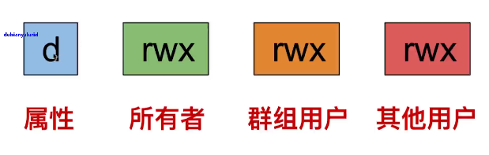
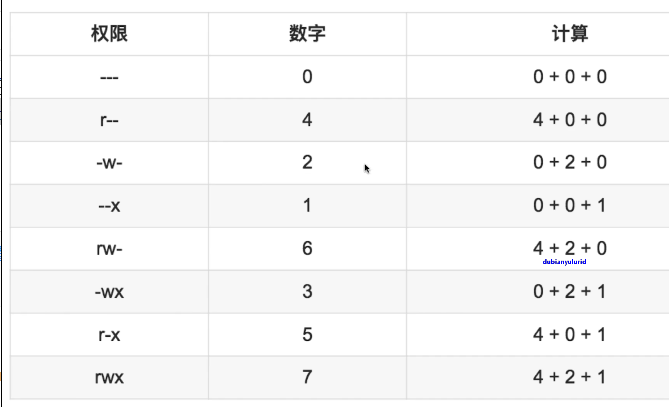
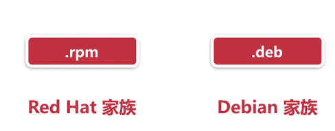
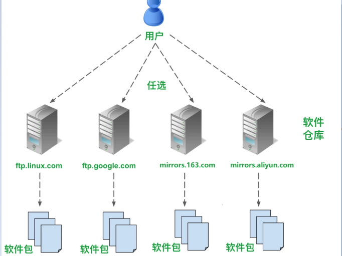

# Linux基础知识和命令
[toc]
> ## 基本知识
- ### 切换管理员用户
-  用sudo su命令
- 命令行提示符变成[root@VM_0_14_centos ~]#
- 退出root身份,可以用Ctrl+D的组合键,或者用exit命令
- hostname 能够知道机器名称
- whoami 能知道当前用户
- ### 查找命令，补全命令
- Linux的开发者们早就为我们准备了对策:用Tab键来补全命令
- Tab键可以补全命令,也可以补全文件名、路径名:按两次Tab键
- ### 命令的历史记录
- 向上键:按时间顺序向前查找用过的命令,每按一次就前进一个命令
- 向下键:接时间顺序向后査找用过的命令,每按一次就前进一个命令
- Ctr+R:用于查找使用过的命令
- ### history命令
- history是英语“历史,历史记录”的意思
- history命令用于列出之前使用过的所有命令
- 可以用!编号这样的格式来重新运行 history输出中对应编号的命令
```
  298  2020-02-20 12:12:45 date
  299  2020-02-20 12:14:31 c
  300  2020-02-20 12:16:18 ls -a
  301  2020-02-20 12:31:32 history
[root@VM_0_14_centos ~]# !298
date
```
- ### 实用的快捷键
- Ctrl+L用于清理终端的内容,就是清屏的作用。同 clear命令
- Ctrl+D给终端传递EOF( End Of File,文件结東符)
- Shift+PgUp用于向上滚屏,与鼠标的滚轮向上滚屏是一个效果
- Shift+PgDn用于向下滚屏,与鼠标的滚轮向下滚屏是一个效果
- Ctrl+A光标跳到一行命令的开头。Home键有相同的效果
- Ctrl+E光标跳到一行命令的结尾。End键有相同的效果
- Ctrl+U删除所有在光标左侧的命令字符
- Ctrl+K删除所有在光标右侧的命令字符
> ## date命令
- date是“日期”的意思,用于显示当前时间
- CST是 Central Standard Time的缩写,表示“中央标准时间
```
[root@VM_0_14_centos ~]# date
Thu Feb 20 12:03:58 CST 2020
```
> ## ls命令
```
[root@VM_0_14_centos ~]# ls
mysql  Pipfile  py3  whyhu

[root@VM_0_14_centos ~]# ls -a
.              .config               .pip              .ssh
..             .cookiecutter_replay  Pipfile           .tcshrc
.bash_history  .cookiecutters        .pki              .viminfo
.bash_logout   .cshrc                py3               whyhu
.bash_profile  .local                .pycharm_helpers
.bashrc        mysql                 .pydistutils.cfg
.cache         .mysql_history        .python_history

```
> ## 文件和目录组织命令
- ### 普通的文件
- 文本类型的文件(.txt,.doc,.odt,等等)
- 声音文件(wav,mp3,.ogg),还有程序,等这样的文件在 Windows中也有
- ### 特殊的文件
- 其他一些文件是特殊的,因为它们表示一些东西
- 例如,你的光盘驱动器就是这类特殊的文件
- ### linux一切都是文件
- Linux有且只有一个根目录,就是/(斜杠)
- Linux中没有比根目录再高一阶的目录了,没有目录包含根目录
- 根目录就是 Linux最顶层的目录:"万有之源,斜杠青年
- ### Linux的根目录的直属子目录:bin
- bin:是英语 binary的缩写,表示"二进制文件
- (我们知道可执行文件是二进制的)
- bin目录包含了会被所有用户使用的可执行程序
- ### Linux的根目录的直属子目录:home
- home:英语home表示“家"。
- 用户的私人目录在home目录中,我们放置私人的文件类似 Windows中的 Documents文件夹,也叫“我的文档
- Linux中的每个用户都在home目录下有一个私人目录(除了大管家用户root)
- root用户拥有所有权限,比较“任性",跟普通用户不住在一起
- ### Linux的根目录的直属子目录:Iib
- lib:英语 library的缩写,表示“库”
- lib目录包含被程序所调用的库文件,例如.so结尾的文件
- Windows下这样的库文件则是以.d结尾
- ### which命令:获取命令的可执行文件的位置
- Linux下,每一条命令其实对应了一个可执行程序
- 在终端中输入命令,按回车的时候,就是执行了对应的那个程序
- pwd命令对应的pwd程序就是存在于 Linux中的
```
[root@VM_0_14_centos ~]# which pwd
/usr/bin/pwd
```
> ## 浏览和切换目录
- ### ls命令
- -a:显示所有文件和目录,包括隐藏的
- -l:参数使得ls命令列出一个显示文件和目录的详细信息的列表
- -h:以K,M,G的形式显示文件大小
- -t:按文件最近一次修改时间排序
- ### du命令显示目录大小
- -a:显示文件和目录的大小
- -s:只显示总计大小
- -h:以K,M,G的形式显示文件大小
> ## 浏览和创建文件
- ### cat和less命令：显示文件内容
- ### /var/og中有很多日志文件
- /var这个目录通常包含程序的数据
- log是英语“日志”的意思
- log文件通常会记录电脑中发生了什么事
- ### cat命令:ー次性显示文件的所有内容
- cat是 concatenate的缩写,表示“连接/串联
- cat命令可以一次性在终端中显示文件的所有内容
- 用法:只需要在命令后加上想要显示的文件路径即可
- cat -n 可以带上行数
- ### more命令:显示文件内容
- 从前往后查看，可以翻屏 ,不能往前翻  回车一行行查看，空格翻屏  q退出
- ### less命令:分页显示文件内容
- 和more类似，可以前翻页，g首页 G尾页，b前翻页，空格和f后翻页，q退出，回车和下箭头下一行
- = 显示文件中的位置
- /(斜杠):进入搜索模式，在斜杠后面输入你要搜索的文字,按下回车键就会把所有符合的结果都标识出来
- 要在搜索所得结果中跳转,可以按n键(跳到下ー个符合项目)按N键( shift 键+n。跳到上一个符合项目)正则表达式( Regular Expression)也是可以用在搜索内容中
- ### head命令和tail命令:显示文件的开头和结尾
- head用于显示文件的开头几行,tail用于显示文件结尾的几行
- 默认情况下,head/tail会显示文件的头/尾10行
- 可以指定显示的行数,用-n这个参数
- tai命令还可以配合-f参数来实时追踪文件的更新，可以配合-s 每多少秒检查一下
- ### touch命令:创建一个空白文件
- touch命令其实一开始的设计初衷是修改文件的时间戳，让电脑以为文件是在那个时候被修改或创建的
- 如果 touch命令后面跟着的文件名是不存在的文件,它会新建
- 如果创建文件名有空格，可以加引号限定
```
[root@VM_0_14_centos ~]# touch new_file
[root@VM_0_14_centos ~]# ls
mysql  new_file  Pipfile  py3  whyhu
```
- ### mkdir命令:创建一个目录
- mkdir命令就是用于创建一个目录的
- mkdir是mk和dir的缩合
- mk是make的缩写,表示“创建dir是 directory的缩写,表示“目录
- 还可以用-p参数来归创建目录结构: mkdir-pone/two/ three
```
[root@VM_0_14_centos ~]# mkdir new_folder
[root@VM_0_14_centos ~]# ls
mysql  new_file  new_folder  Pipfile  py3  whyhu
```

> ## 文件的肤质和移动操作
### cp命令:拷贝文件就目录
- cp是英语copy的缩写,表示“拷贝”
- cp命令不仅可以拷贝单个文件还可以拷贝多个文件,也可以拷贝目录
- 拷贝目录,只要在cp命令之后加上-r或者-R参数，表示递归
### 使用通配符*号(星号)
- cp* txt folder:把当前目录下所有tt文件拷贝到 folder目录中
### mv命令:移动文件
- mv是英语move的缩写,表示“移动”。
- mν命令有两个功能移动文件(或目录)重命名文件(或目录)
### rm命令:删除文件和目录
- -i参数:向用户确认是否删除
- -f参数:慎用,不会询向是否删除,强制删除
- -r参数:递归地删除
> ## 文件的删除和链接
### In命令:创建链接
- In是link的缩写,在英语中表示“链接”
- In命令用于在文件之间创建链接
- 事实上, Linux下有两种链接类型
- **Physical link:物理链接或硬链接**
- **Symbolic link:符号链接或软连接**
### 文件的存储
- 其实每个文件有三部分:文件名,权限和文件内容
- 这里简化地将文件分为两部分:文件名和文件内容
- 每个文件的文件内容被分配到一个标示号码,就是 inode
- 因此每个文件名都绑定到它的文件内容(用 inode标识)
### 创建硬链接
- **硬链接原理：使链接的两个文件共享同样文件内容,就是同样的 inode**
- 一旦文件1和文件2之间有了硬链接，那么你修改文件1或文件2,修改的是相同的一块内容
- 硬链接缺陷:只能创建指向文件的硬链接,不能创建指向目录的
- 通过一些参数的修改,也可以创建指向目录的硬链接，比较复杂
- 软链接可以指向文件或目录。对于目录,一般都是用软链接
- 要创建硬链接,直接用n命令,不加任何参数: In file1 file2
- rm file1来删除file1,对file2也没什么影响对于硬链接来说,删除任意一方的文件共同指向的文件内容并不会从硬盘上被删除
### 创建软链接
- 和Windows的快捷方式一模一样。
- in- s file1file2:创建了file1的软链接file2

> ## 用户和权限
### sudo命令:以root身份运行命令
### Linux下的用户组织
- 在 Linux中,理论上说来,我们可以创建无数个用户
- 但是这些用户是被划分到不同的群组里面的
- 有一个用户,名叫root,是一个很特殊的用户

### useradd命令:添加新用户
- useradd命令,很容易理解其作用,因为完全可以顾名思义
- user是英语“用户”的意思,add是英语添加”的意思
- useradd用于添加用户。用法:命令后接要创建的用户名
```
[root@VM_0_14_centos ~]# useradd wychmod
[root@VM_0_14_centos ~]# ls /home
wychmod
```
### passwd命令:修改密码
- passwd命令可以修改用户的密码
- passwd是 password这个英语单词的缩写,表示“密码”
- 用法类似 useradd,只要在其后加上需要修改密码的那个用户名
```
[root@VM_0_14_centos ~]# passwd wychmod
Changing password for user wychmod.
New password:
Retype new password:
passwd: all authentication tokens updated successfully.
```
### userdel:删除用户
- 可以用 userde命令来删除已创建的账户
- userdel是 delete和user的缩写
- delete是英语“删除”的意思,user是“用户”的意思
- -r home目录下的用户将被删除。

> ## 群组的管理
### groupadd:创建群组
- 用法也很简单,和 useradd命令类似,后接需要创建的群组名
- 如: groupadd friends
- 创建一个名为 friends 的群组, friends是英语“朋友”的意思
### usermod命令:修改用户账户
- usermod是user和 modify的缩写
- user是英语“用户”的意思, modify是“修改”的意思
- usermod命令用于修改用户的账户
- -i:对用户重命名。/home中的用户家目录名不改变,需要手动修改
- -g:修改用户所在群组
- 可以将一个用户添加到多个群组,用-G参数(大写的G)
- usermo -G friends, happy, funny thomas
- -a:追加到某个群组
- usermod-aG good thomas
```

[root@VM_0_14_centos ~]# ls -l /home
total 4
drwx------ 4 wychmod wychmod 4096 Feb 22 00:39 wychmod

[root@VM_0_14_centos ~]# ls -l /home
total 4
drwx------ 4 wychmod friends 4096 Feb 22 00:39 wychmod

```
### groups命令:查看用户所在的组
```
[root@VM_0_14_centos ~]# groups wychmod
wychmod : friends
```
### groupdel命令:删除群组
- groupdel happy
### chown命令:改变文件的所有者
- chown thomas file.txt
### chgrp命令:改变文件的群组
- chgrp thomas file. txt
### -R参数:递归设置子目录和子文件
- chown命令的-R参数非常有用 
- 假如想要把用户 thomas的家目录的所有子目录和文件都占为己有
- chown -R oscar: oscar /home/thomas
> ## 文件权限管理
### 权限的原理
- d:英语 directory的缩写,表示“目录”。就是说这是一个目录
- l:英语link的缩写,表示“链接”。就是说这是一个链接
- r:英语read的缩写,表示“读”。就是说可以读这个文件
- w:英语wite的缩写,表示“写”。就是说可以写/修改这个文件
- x:英语 execute的缩写,表示“执行运行"。可以运行这个文件

### chmod命令：修改文件权限
- chmod命令:修改文件的访问权限
- chmod命令不需要是root用户才能运行只要你是此文件所有者,就可以用 chmod来修改文件的访问权限
- u:user的缩写,是英语“用户”的意思。表示所有者
- g: group的缩写,是英语“群组”的意思。表示群组用户
- o: other的缩写,是英语“其他”的意思。表示其他用户
- chmod u+ rx file文件fie的所有者增加读和运行的权限
- chmod g+rfle文件fil的群组其他用户增加读的权限
- chmod o- r file文件file的其他用户移除读的权限
- chmod配合-R(大写的R)参数可以递归地修改文件访可权限
 
> ## Nano文本编辑器和终端配置
**Nano是一个文本编辑器,不是文本处理器** 
- ◆Nano的全称其实是 GNU Nano
### nano快捷键
- Ctrl+G:显示帮助文档
- Ctrl+O:保存文件
- Ctr+K:剪切当前一行
- Ctrl+X:退出
- Ctrl+\:替换
### Nano的参数
- nano file.txt:用nano打开file.txt,如果你对fie.txt有写的权限，不存在的话，会创建一个file.txt
- -m:激活鼠标。如果没有-m参数
- -i:澂活自动缩进的功能。这对于程序员写代码太有用了
- -A:激活智能Home键的功能。通常状况下按下键盘的Home键，光标会立即跳到一行的最开始。
- 可以通过. nanorc来配置Nano
### 创建 .nanorc
- 每一行一句配置语句,配置语句是以set或 unset开头
- set是英语“"放置,设置"的意思,用于激活unset则用于关闭。
- set或 unset后接你要配置的项目
- 例如: set mouse
- set autoindent:激活自动缩进,相当于参数-i的作用
- set smarthome:激活智能Home键
### 通过. bashrc配置终端
- .bashrc就是Bash这个shel程序的配置文件
- .bashrc本身的语法也是Bash的语法,是一种脚本语言
- 在. bashrc文件中,我们可以修改命令行提示符的样式
- 终端的bash也有它的全局配置文件:/etc/bashrc
- 家目录下的. bashrc文件的优先级比系统的/etc/bashrc文件高
### profile 配置文件
- 家目录下,其实还有一个. profile文件
- 而且它也有对应的全局 profile文件,是/etc/profile
- profile是这些需要登录的,非图形界面的终端的配置文件
- 有一点需要记住: profile文件会调用. bashrc
- 我们修改了 bashrc,也就是间接修改了 profile文件
- profile文件会用 profile本身的配置再加上. bashrc的配置
- 可以用 source命令来使改动立即生效
- source bashrc

> ## 软件仓库
### 软件包
- 一个软件包其实是软件的所有文件的压缩包
- 二进制形式的,包含了安装软件的所有指令
- 在 Red Hat一族里,软件包的后缀是.rpm
- **软件包管理包括了依赖关系的管理**

### 依赖关系
- 通常来说,很少有一个软件可以单独在Lnux上运行
- 一个软件经常需要使用其他程序或者其他程序的片段(称之为库）
- 一个软件依赖其他程序,这就是依赖关系
- 比如说, Linux下类似 Photoshop的软件GIMP
- GIMP的正常运作需要调用图片读取的库(例如读取一个JPG图片)
### 软件仓库

- 是用户选择软件仓库,因为基本上各个软件仓库中的软件都是一样的
- 一般建议用户选择离自己所在地较近的软件仓库的服务器
### 切换CentOS软件源
- 要编辑的那个包含软件仓库的列表的文件是/etc/yum.repos.d/centos-base repo
- 这个文件是系统文件,只能被root用户修改
```
nano /etc//yum.repos.d/CentOS-Base.repo
``` 
### 包管理工具
- 终端的软件包管理命令一般用yum
- yum是 Centos中的默认包管理器工具,也用于 Red Hat一族
### yum update/ upgrade:更新软件包
### yum install:安装软件包
### yum remove:删除软件包
### 常用的终端的软件包命令
- 本地的rpm软件包,可以用rpm命令来安装
- sudo rpm -i *.rpm用于安装
- sudo rpm -e包名用于卸载

> ## RTFM阅读手册
### man命令,显示使用手册
- man是 manual的缩写,是英语“使用手册”的意思
- 用法很简单,后接你想要显示使用手册的命令,函数,等等
- 此命令用于查看系统中自带的各种参考手册
- sudo yum install - y man-pages

> ## 查找文件
### locate命令，快速查找
- 第一种查找文件的方法可以说是很简单的。用到的命令是 locate
- locate是英语“定位”的意思。
- locate命令是搜索包含关键字的所有文件和目录
- locate命令不会对你实际的整个硬盘进行查找，而是在文件的数据库里査找记录
- 我们可以用 updatedb命令强制系统立即更新文件数据库
### find命令,深入查找
- 与 locate命令不同,find命令不会在文件数据库中查找文件的记录而是遍历你的实际硬盘
- find《何处》《何物》 《做什么》
- 这几个参数中,只有《何物》是必须指定的,也就是要查找什么
- **何处**:指定在哪个目录中查找
- **何物**:也就是要查找什么。我们可以根据文件的名字来查找
- 也可以根据其大小来查找,也可以根据其最近访时间来查找,等等。这个参数是必须的
- **做什么**:用find命令找到我们要的文件后
- find命令只会查找完全符合《何物》的字符串表示的文件
- 如果要査找以 syslog结尾的文件,可以用* syslog
- 如果查找包含 syslog这个关鍵字的文件,可以用*syslog*
```
[root@VM_0_14_centos ~]# find -name 'nano.txt'
./nano.txt
```
- 例如,我们以root身份查找/ar中大小超过10M的文件
- find /var -size +10M
- 可以使用-atime参数。atime是 access和time的缩写
- access是英语“访问,进入”的意思,time是英语“时间”的意思
- find -name "*.txt" -atime -7
### 删除查找到的文件
- 假如我要删除査找到的文件,我可以用-delete参数
- find -name "*jpg" -delete
### 使用命令
- 使用-exec参数,可以后接一个命令,对每个查找到的文件进行操作
- exec是 execute的缩写,是英语“执行”的意思
- 如果你对于没有确认提示不太放心
- 你可以将-exec参数换成-exec参数,用法一样