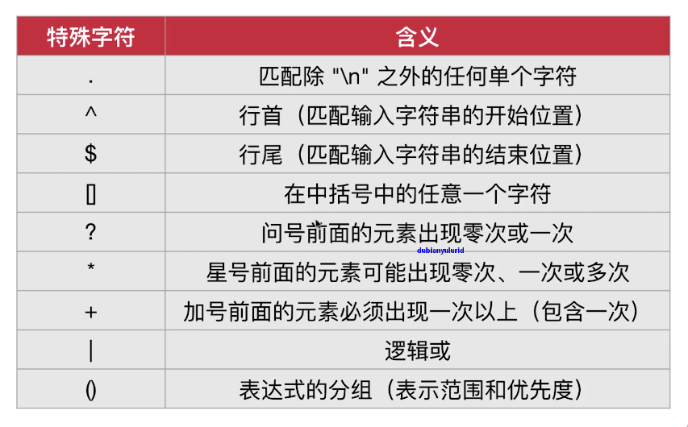
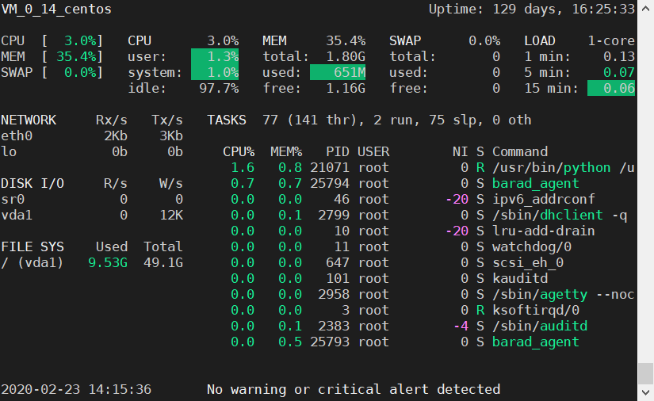
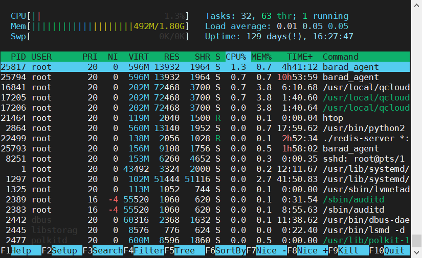
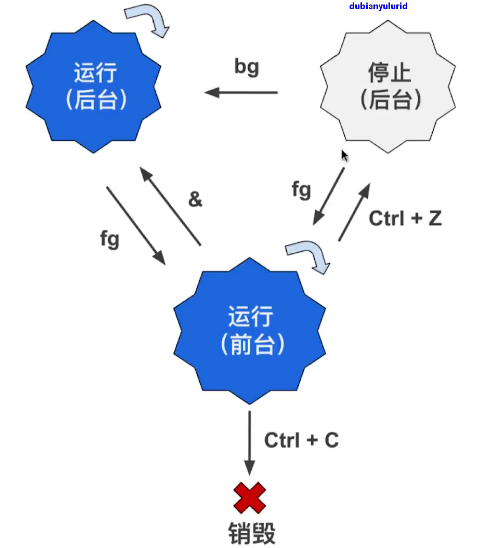
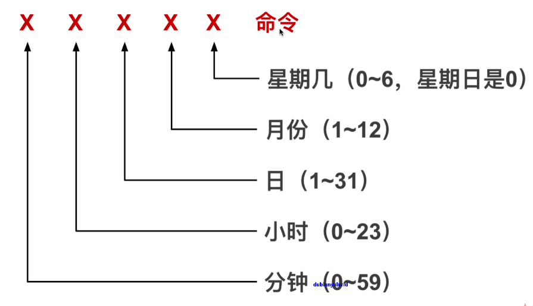
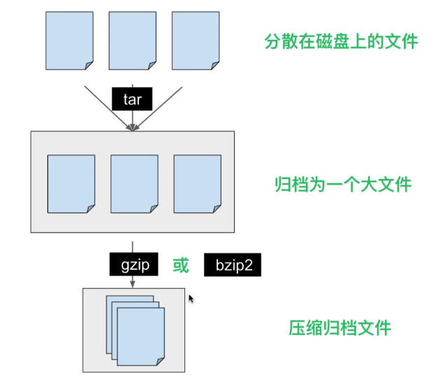
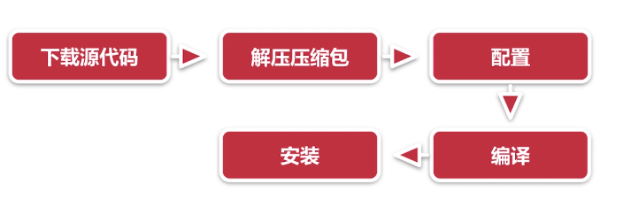

# Linux进阶知识和命令

> ## 正则表达式和数据操作
### grep命令:筛选数据
- 意思是“全局搜索一个正则表达式,并且打印”
- grep的功能简单说是在文件中査找关键字,并显示关键字所在的行
#### grep的简单用法
- grep命令的最基本用法
- grep text file text
- 代表要搜索的文本,file代表供搜索的文件
```
[root@VM_0_14_centos ~]# grep path /etc/profile
pathmunge () {
    pathmunge /usr/sbin
    pathmunge /usr/local/sbin
    pathmunge /usr/local/sbin after
    pathmunge /usr/sbin after
unset -f pathmunge
```
#### -i参数:忽略大小写
- 默认的情况下,grep命令是区分大小写的
```
[root@VM_0_14_centos ~]# grep path -i /etc/profile
pathmunge () {
    case ":${PATH}:" in
                PATH=$PATH:$1
                PATH=$1:$PATH
# Path manipulation
    pathmunge /usr/sbin
    pathmunge /usr/local/sbin
    pathmunge /usr/local/sbin after
    pathmunge /usr/sbin after
export PATH USER LOGNAME MAIL HOSTNAME HISTSIZE HISTCONTROL
unset -f pathmunge
```
#### -n参数:显示行号
- -n参数的作用很简单,就是显示搜索到的文本所在的行号
- n是英语 number的缩写,表示“数字,编号”
```
[root@VM_0_14_centos ~]# grep -n path /etc/profile
11:pathmunge () {
38:    pathmunge /usr/sbin
39:    pathmunge /usr/local/sbin
41:    pathmunge /usr/local/sbin after
42:    pathmunge /usr/sbin after
75:unset -f pathmunge
```
#### -v参数:只显示文本不在的行
- -v参数的作用就是只显示搜索的文本不在的那些行
```
grep -v path /etc/profile
```
#### -o参数:只匹配
#### -r参数:在所有子目录和子文件中查找
- grep -r "Hello World" folder/
- 在folder目录的所有子目录和子文件中查找 Hello World这个文本
### grep的高级用法:配合正则表达式
- 正则表达式使用单个字符串
- 来描述、匹配一系列符合某个句法规则的符串

#### -E参数:使用正则表达式
```
[root@VM_0_14_centos ~]# grep -e ^path /etc/profile
pathmunge () {

[root@VM_0_14_centos ~]# grep -e [Pp]ath /etc/profile
pathmunge () {
# Path manipulation
    pathmunge /usr/sbin
    pathmunge /usr/local/sbin
    pathmunge /usr/local/sbin after
    pathmunge /usr/sbin after
unset -f pathmunge

[root@VM_0_14_centos ~]# grep -e [a-zA-Z] /etc/profile
```
### sort命令:为文件排序
```
sort name.txt
```
#### -o参数:将排序后的内容写入新文件
- o是 output的首字母,表示“输出”
- sort -o name sorted.txt name.txt
- -r参数:倒序排列
- -R参数:随机排序
- -n参数用于对数字进行排序,按从小到大排序
### wc命令:文件的统计
- wc命令还可以用来统计行数,字符数,字节数等
- 行数( newline counts): newline是英语“换行、换行符”的意思
- 单词数( word counts):Word是英语“单词”的意思
- 字节数( byte counts):byte是英语“字节”的意思
```
[root@VM_0_14_centos ~]# wc nano.txt
 1  5 21 nano.txt
```
### uniq命令:删除文件中的重复内容
- uniq命令有点“"呆”,只能将连续的重复行变为一行
- -c参数用于统计重复的行数
- -d参数:只显示重复行的值
### cut命令:剪切文件的一部分内容
- -c参数:根据字符数来剪切
- -d参数:根据分隔符来剪切
- -f参数:表示剪切下用分隔符分隔的哪一块或那几块区域
```
cut -c 2-4 name.txt

[root@VM_0_14_centos note]# cut -d , -f 1 notes.csv
wyx
wychmod. 2222
[root@VM_0_14_centos note]# cut -d , -f 2- notes.csv
 11111, 2222
 333
```
> ## cut命令进阶，输出重定向符号
### 重定向
- 把本来要显示在终端的命令结果,输送到别的地方
- 到文件中或者作为其他命令的输入(命令的链接,或者叫命令管道)
### 管道
- 把两个命令连起来使用,一个命令的输出作为另一个命令的输入
- 管道的英语是 pipeline
### >和>>:重定向到文件
- 最简单的操作就是把命令的输出结果重定向到文件中
- 就不会在终端显示命令运行结果了
### >:重定向到新的文件
- 令>可以将命令的输出结果重定向到你选择的文件中
- 如果此文件不存在,则新建一个文件
- 如果此文件已经存在,那就会把文件内容覆盖掉
```
[root@VM_0_14_centos note]# cut -d , -f 1 notes.csv > students.txt
[root@VM_0_14_centos note]# cat students.txt
wyx
wychmod. 2222
```
### >>:重定向到文件末尾
- >>的作用与>是类似的,不过它不会像>那么危险
- 而是将重定向的内容写入到文件未尾,起到追加的作用
- 如果文件不存在,也会被创建
```
[root@VM_0_14_centos note]# cut -d , -f 1 notes.csv >> students.txt
[root@VM_0_14_centos note]# cat students.txt
wyx
wychmod. 2222
wyx
wychmod. 2222
```
### stdin,stdout,stderr
- 从键盘向终端输入数据、这是标准输入,也就是 stdin
- 标准输出: stdout。指终端输出的信息(不包括错误信息)
- 标准错误输出: stern。指终端输出的错误信息
### “黑洞”文件/dev/null
- Linux中有一个俗称“黑洞”的文件ldev/null
- 此文件具有唯一的属性:它总是空的
### 2>符号
- 标准错误输出的文件描述符是2,所以这里的2表示标准错误输岀
- 如果没有2,单独的>符号就是重定向标准输出(文件描述符为1)
### 2>&1组合符号
- 将标准错误输出重定向到与标准输出相同的地方
### <:从文件中读取
- <符号用于指定命令的输入
### <<:从键盘读取
- <<符号的作用是将键盘的输入重定向为某个命令的输入
```
[root@VM_0_14_centos note]# sort -n << end
> 1
> 2
> 5
> 4
> 6
> end
1
2
4
5
6
```
### “|” 管道符
- 将前者的输出当做后者的输入
``` 
[root@VM_0_14_centos note]# cut -d , -f 1 notes.csv | sort
wychmod. 2222
wyx

[root@VM_0_14_centos ~]# du | sort -nr | head
1275592 .
605188  ./.cache
604860  ./.cache/pipenv
524968  ./.cache/pipenv/http
368072  ./.local
368068  ./.local/share
368064  ./.local/share/virtualenvs
327792  ./.local/share/virtualenvs/whyhu-G00zs1Vk
313612  ./.local/share/virtualenvs/whyhu-G00zs1Vk/lib
313608  ./.local/share/virtualenvs/whyhu-G00zs1Vk/lib/python3.7

[root@VM_0_14_centos ~]# grep log -lr /var/log | cut -d : -f 1 | sort | uniq
/var/log/audit/audit.log
/var/log/audit/audit.log.1
/var/log/audit/audit.log.2
/var/log/audit/audit.log.3
/var/log/audit/audit.log.4
/var/log/btmp
/var/log/btmp-20200201
/var/log/cloud-init.log
/var/log/cron

```
> ## 输入重定向和管道符号
### W命令:都有谁,在做什么?
- 可以帮助我们快速了解系统中目前有哪些用户登录着
- load average 表示一分钟，五分钟，十分钟的负载状态
- TTY:登录的终端名称
- 0意思应该是指本地,就是目前我们所在的这个图形终端
- pts是 pseudo terminal slave的缩写,表示“伪终端从属”
- DLE:用户有多久没活跃了(没运行任何命令)
- JCPU:该终端所有相关的进程使用的CPU(处理器)时间
- PCPU:表示CPU(处理器)执行当前程序所消耗的时间
- WHAT:当下用户正运行的程序
```
[root@VM_0_14_centos ~]# w
 12:36:49 up 129 days, 14:46,  1 user,  load average: 0.00, 0.01, 0.05
USER     TTY      FROM             LOGIN@   IDLE   JCPU   PCPU WHAT
root     pts/1    110.183.161.147  12:36    1.00s  0.03s  0.00s w
```
> ## 进程和系统监测
### ps命令和top命令:列出运行的进程
- 简单说来,进程就是加载到内存中运行的程序
- 大多数程序运行时都只在内存中启动一个进程
### ps:进程的静态列表
- pS命令用于显示当前系统中的进程
- ps命令显示的进程列表不会随时间而更新,是静态的
- PID进程号
- a：显示现行终端机下的所有进程，包括其他用户的进程；
- u：显示进程拥有者、状态、资源占用等的详细信息（注意有“-”和无“-”的区别）；
- x：显示没有控制终端的进程。通常与 a 这个参数一起使用，可列出较完整信息；
- -e：显示所有进程；
- -f：完整输出显示进程之间的父子关系；
- -l：较长、较详细的将该 PID 的的信息列出；
- -o：自定义显示的字段；
### ps -ef:列出所有进程
- -ef参数可以使ps命令列出所有用户在所有终端的所有进程
- PPID( parent process ID):PPID是程序的父进程号
### ps -u用户名:列出此用户运行的进程
- ps -u XX #用实际用户替換xx
### ps -aux:通过CPU和内存使用来过滤进程
- ps -aux | less
- 根据CPU使用率来降序排列:ps -aux --sort -pcpu | less
- 根据内存使用率来降序排列 ps -aux --sort -pmem | less
### pstree 命令:以树形结构显示进程
- ps -axjf和 pstree效果比较类似
- 以树形结构显示进程
> ## 操作进程和重启关闭系统
### top命令：实时列出进程
- B:大写的B,加粗某些信息
- f/F:在进程列表中添加或删除某些列
- k:结束某个进程
### glances软件
```
yum install epel* -y
yum install python-pip python-devel -y
yum install glances -y
```

### htop软件
```
yum install epel* -y
yum install -y htop
```

### kill令:结束一个进程
- 可以同时用ki来结束好几个进程,只要用空格隔开它们的P|D
- 可以用kill -9来立即强制结束进程
- 例如kiIl -9 7291
### killall:结束多个进程
- kill命令就是用于结束全部要结束的进程
- 不同于kill命令, killall命令后接程序名,而不是PID(进程号)
### halt/poweroff命令和reboot命令:停止/关闭和重启系统
- halt和 reboot这两个命令都调用了 Linux的另一个命令
- 这个命令是 shutdown

> ## 管理前后台进程
### &符号和 nohup命令:后台运行进程
- 可以在同一个终端中同时运行好几个命令
- 很简单的一种:在你要运行的命令最后加上&这个符号,这个后台与终端关联的
- find / -name "*log" > output_find 2>&1 &
- nohup命令:使进程与终端分离
```
[root@VM_0_14_centos ~]# mv nano.txt new_folder/ &
[1] 23322
[1]+  Done                    mv -i nano.txt new_folder/
```
### Ctrl+Z:转到后台,并暂停运行
### bg命令:使进程转到后台
- bg是英语 background的缩写,表示“后台”
- bg命令的作用是将命令转入后台运行
- 假如命令已经在后台,并且暂停着
- 那么bg命令会将其状态改为运行
- 不加任何参数,bg命令会默认作用于最近的一个后台进程，也就是刚才被Ctr+Z暂停的top进程
- 如果后面加%1,%2这样的参数
- 则是作用于指定标号的进程
### jobs命令:显示后台进程状态
```
[root@VM_0_14_centos ~]# jobs
[1]-  Stopped                 top
[2]+  Stopped                 top
```
### fg命令:使进程转到前台
- fg是英语 foreground的意思,表示“前台
- fg命令的作用是:使进程转为前台运行
 
> ## 任务的定时和延期
### at命令:延时执行一个程序
- 可以用at命令来设定一个程序的执行时间
- 注意:at命令只能让程序执行一次
- 可以使用Ctrl+D组合键,at会显示<EOT>
- at 22:10 12/10/19
- at now +10 minutes
- atq命令:列出正等待执行的at任务
- atrm命令:删除正在等待执行的at任务
```
[root@VM_0_14_centos ~]# at 15:51
at> ls
at> <EOT>
job 1 at Sun Feb 23 15:51:00 2020
```
### sleep命令:休息一会
- 默认地, sleep后面的数值表示秒
- m: minute的缩写,表示“"分钟"
- h:hour的缩写,表示“小时"
- d:day的缩写,表示“天"
### &&和||符号
- &&:&&号前的命令执行成功,オ会执行后面的命令
- ||:||号前的命令执行失败,才会执行后面的命令
### crontab命令:定时执行程序
- at命令,只能执行某个(或某几个)命令一次
- crontab却可以重复执行命
- 例如:每小时,每分钟,每天,每星期,等等
- -l:显示 crontab文件
- -e:修改 crontab文件
- -r:删除 crontab文件

```
[root@VM_0_14_centos ~]# crontab -l
*/1 * * * * /usr/local/qcloud/stargate/admin/start.sh > /dev/null 2>&1 &
0 0 * * * /usr/local/qcloud/YunJing/YDCrontab.sh > /dev/null 2>&1 &
```
 
> ## 文件的解压和压缩

### 打包和压缩
- 打包:是将多个文件变成一个总的文件，这个总的文件我们通常称为 archive
- 压缩:是将一个大文件通过某些压缩算法变成一个小文件

### tar命令:打包文件
- -cvf:创建一个tar归档
- -c: create的缩写,表示“创建
- -v: verbose的缩写,表示“冗余”。会显示操作的细节
- -f:file的缩写,表示“文件"。指定归档文件
- -tf:显示归档里的内容,并不解开归档
- -rvf:追加文件到归档
- -xvf:解开归档
```
[root@VM_0_14_centos ~]# tar -cvf new_folder.tar new_folder/
new_folder/
new_folder/nano.txt
[root@VM_0_14_centos ~]# tar -tf new_folder.tar
new_folder/
new_folder/nano.txt
```
### gzip和bzip2命令:压缩归档
- .tar.gz:用gzip命令压缩后的文件后缀名
- .tar.bz2:用bzip2命令压缩后的文件后缀名
### gunzip和gunzip2命令:解压
### 用tar命令同时归档和压缩
- -zcvf:归档,然后用gzip来压缩归档
- -jcvf:归档,然后用bz2来压缩归档
- -zxvf -jxvf
### zip/ unzip:压缩/解压zip文件
- -l 可以不解压观看里面内容
- -r 一般zip压缩要加，递归压缩
```
yum install unzip
```

> ## 编译安装软件
 
### alien软件
- 有个软件可以将deb安装包和rpm安装包互相转换
- 这个软件是aen(“外星人”的意思)
- yum install alien
- alien -r xxx.deb
### 安装rpm安装包
- rpm -i xxx.rpm
### 安装rar unrar
```
wget http://www.rarlab.com/rar/rarlinux-x64-5.0.0.tar.gz
tar -zxvf rarlinux-x64-5.0.0.tar.gz -C /tmp/
cd /tmp/rar/
make && make install
cp rar_static /usr/local/bin/rar 
cp rar_static /usr/local/bin/unrar

rar a Archive.rar File1 File2 [...]  # 归档
unrar e Archive.rar DestPath     # 解压
```