# Shell脚本编程

## 什么是Shell呢?
-  Shell不像C语言,C++,Java等编程语言那么完整
-  但是Shel这门语言可以帮我们完成很多自动化任务
-  例如:保存数据,监测系统的负载,等等
### Shell脚本
- 脚本( Script)是批处理文件的延伸
- 是一种纯文本保存的程序
- 计算机脚本程序是确定的一系列控制计算机进行运算操作动作的组合
### 不同的Shell
- Sh: Bourne Shell 的缩写。可以说是目前所有 Shell E的祖先
- Bash：是Sh的一个进阶版本,比Sh更优秀,linux，macos默认shell
- Zsh:比较新近的一个 Shell,集Bash,Ksh和Tcsh各家之大成,Github上有一个Zsh的轻松配置程序叫作oh-my-zsh
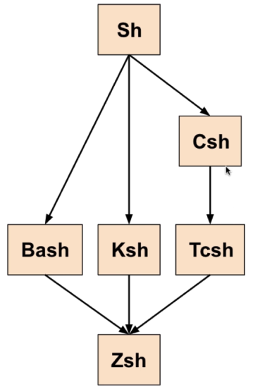  
### 创建脚本文件
- vim test.sh
- 指定脚本要使用的 Shell
- #!被称作Sha-bang,或者 Shebang
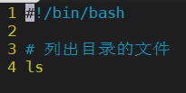
### 以调试模式运行
- 调试一个脚本程序bash -x test.sh
- 参数 -x 表示以调试模式运行
### PATH环境变量
- PATH是英语“小路,路;路线,路程;途径”的意思
- PATH是 Linux的一个系统变量
- 这个变量包含了你系统里所有可以被直接执行的程序的路径
## Shell的变量
### 定义变量
```
#!/bin/bash

message='Hello World'
```
### echo:显示内容
- echo在英语中是“回声”的意思
- 如果要插入换行符,那么需要用到 -e 参数
- 为了使“转义字符”发生作用
```
[root@VM_0_14_centos ~]# echo -e "first\nsecond"
first
second
```
### 显示变量
- Bash脚本中,如果要显示一个变量
- 用echo后接变量名还不够
- 须要在变量名前加上美元符号($)
- 单引号忽略$,双引号不忽略$
- 反引号``可以放入命令
```
#!/bin/bash
message='Hello World'
echo $message
```
### read:请求输入
- read是英语“阅读,读取”的意思
- read命令读取到的文本会立即被储存在一个变量里
- read命令一个单词一个单词(单词是用空格分开的)
- 读取你输入的参数,并且把每个参数赋值给对应变量
- -p:显示提示信息
- -n:用-n参数可以限制用户输入的字符串的最大长度(字符数)
- -t:用-t参数可以限定用户的输入时间(以秒为单位
```
1 #!/bin/bash
2 read name
3 echo "Hello $name"

read -p 'Please enter your name:' name
read -p 'Please enter your name:' name -n 5 name
read -p 'Please enter your name:' name -t 5 code
read -p 'Please enter your name:' name -s password
```
### 数学运算
- 在Bash中,所有的变量都是字符串
- Bash本身不会操纵数字,因此它也不会做运算
- let命令可以用于斌值
```
  1 #!/bin/bash
  2
  3 let "a=5"
  4 let "b=2"
  5 let "c=a+b"
```
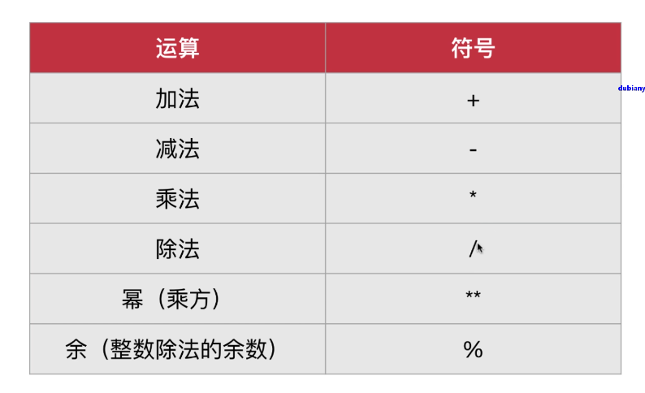
### 环境变量
- Shell的环境变量可以被此种Shell的任意脚本程序使用
- 我们有时也把环境变量称为“全局变量”
- 可以用en∨命令来显示你目前所有的环境变量
```
echo "$SHELL"
```
### 参数变量
- 可以这样调用我们的脚本文件
- /variable.sh参数1参数2参数3
- 这些个参数1,参数2,参数3….被称为“参数变量”
- shift命令常被用在循环中,使得参数一个接一个地被处理
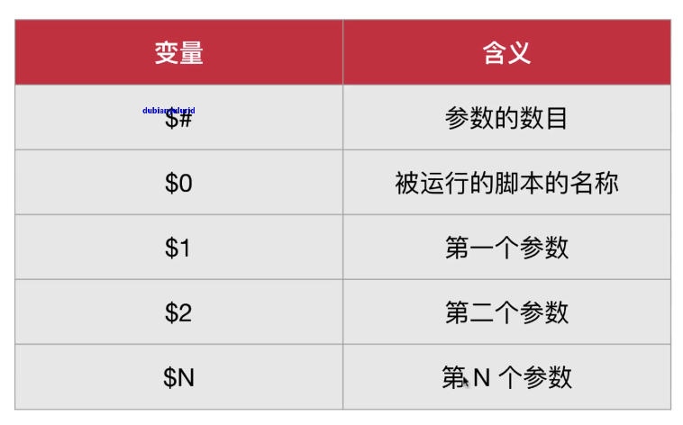
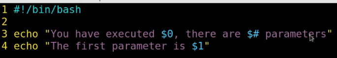
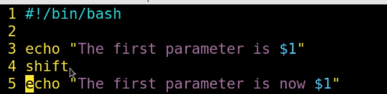 
### 数组
- 数组是这样一种变量,它可以包含多个“格子”
- (被称为“数组的元素”),就好像一个表格一样
```
  1 #!/bin/bash
  2
  3 array=('value0' 'value1' 'value2')
  4 echo ${array[2]}
  5 echo ${array[*]}
```
## Shell的条件
### if条件语句的基本格式
- 方括号囗中的条件测试两边必须要空一格
- 不能写成[test],而要写成 [ test ]
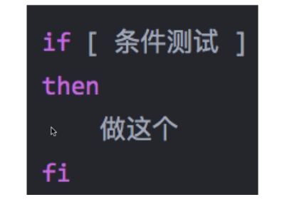
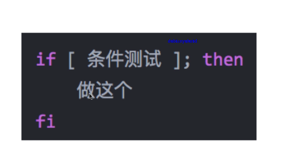
### Shell语言中的“等于”
- 在 Shell 语言中,“等于"是用一个等号(=)来表示的
- 这和大多数主流编程语言(例如C语言,Java,C++)不同
- 但Shel中用两个等号来表示“等于”的判断也是可以的
```
  1 #!/bin/bash
  2
  3 name="Enming"
  4
  5 if [ $name = "Enming" ]
  6 then
  7         echo "Hello $name !"
  8 fi
```
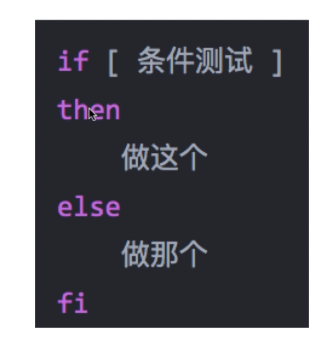
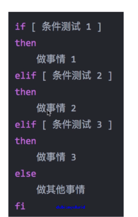
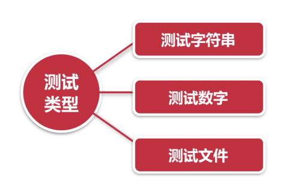
### 测试字符串
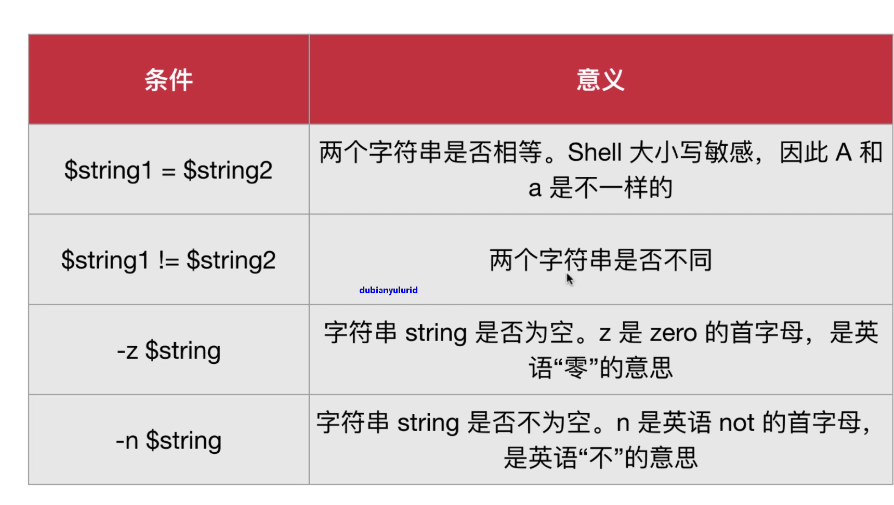
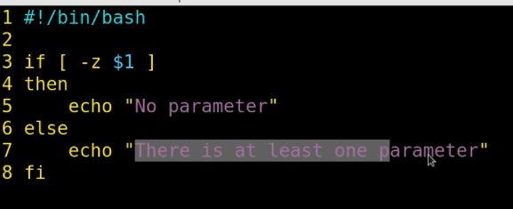
### 测试数字
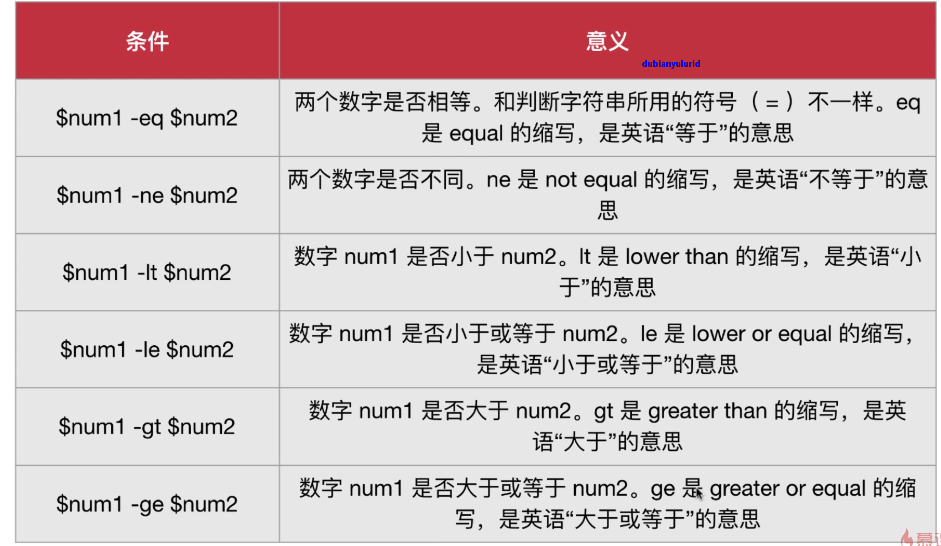
### 测试文件
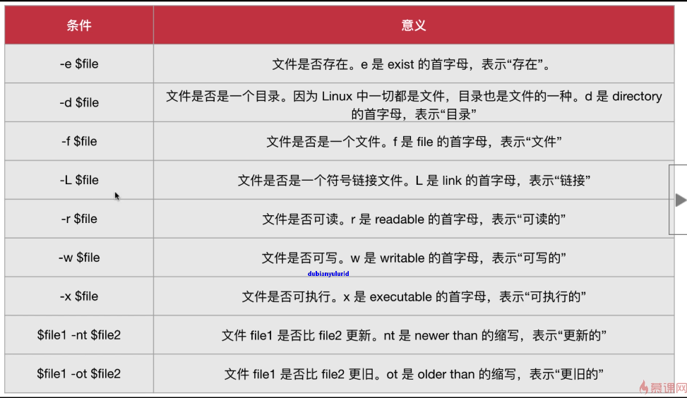
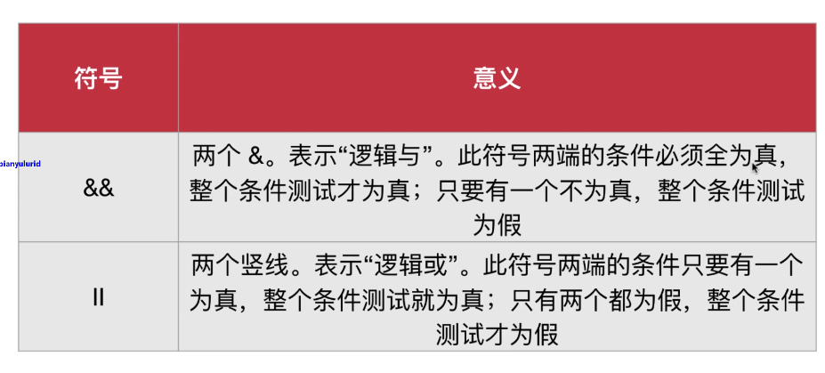
### case条件语句 
- ;; 是传统编程中的break
- *）是传统编程中case的else
```
#!/bin/bash

case $1 in
    "Matthew")
        echo "Hello Matthew !"
        ;;
    "Mark")
        echo "Hello Mark !"
        ;;
    "Luke")
        echo "Hello Luke !"
        ;;
    "John")
        echo "Hello John !"
        ;;
    *)
        echo "Sorry, I do not know you."
        ;;
esac
```

## Shell的循环语句
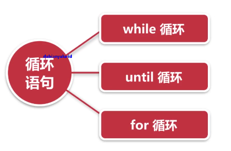
### while 循环的逻辑
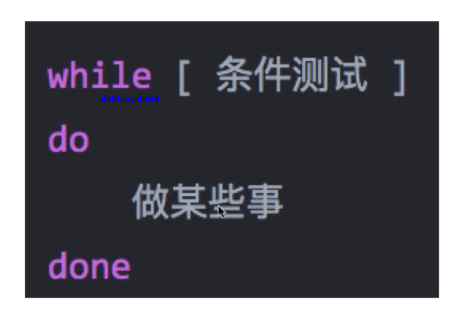
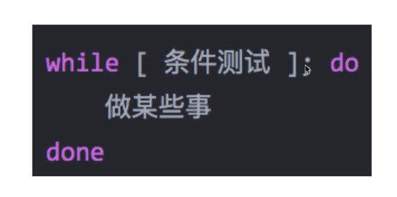
### until循环 
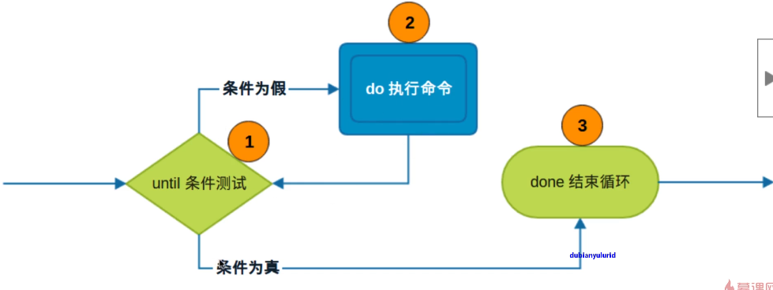
### for循环
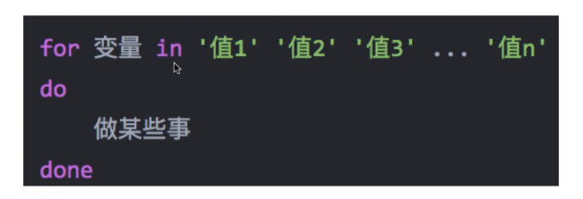
```
#!/bin/bash

for animal in 'dog' 'cat' 'pig'
do
    echo "Animal being analyzed : $animal"
done
```
```
#!/bin/bash

for file in `ls *.sh`
do
    cp $file $file-copy
done
```

### 更常规的for循环
- 可以借助seq命令,来实现类似主流编程语言中的for循环的语法
- seq是 sequence的缩写,是英语“序列”的意思
```
#!/bin/bash

for i in `seq 1 2 10`
do
    echo $i
done
```

## Shell的函数
### Shell 函数的方式
- 函数名后面跟着的圆括号里不加任何参数
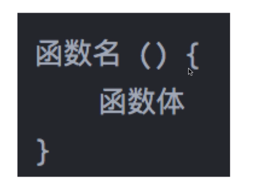
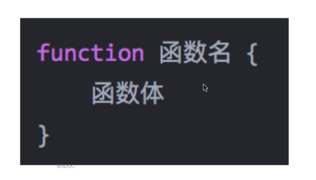
```
  1 #!/bin/bash
  2
  3 print_function() {
  4         echo "wychmod"
  5 }
  6
  7 print_function
  8 print_function
```
```
#!/bin/bash

print_something () {
    echo Hello $1
}

print_something Matthew
print_something Mark
print_something Luke
print_something John
```
```
#!/bin/bash

lines_in_file () {
    cat $1 | wc -l
}

line_num=$(lines_in_file $1)

echo The file $1 has $line_num lines
```

### 变量作用范围
- 默认来说,一个变量是“全局的”( global)
- 要定义一个局部变量,需要用loca关键字
- local是英语“本地的”的意思
```
#!/bin/bash

local_global () {
    local var1='local 1'
    echo Inside function: var1 is $var1 : var2 is $var2
    var1='changed again'   # 这里的 var1 是函数中定义的局部变量
    var2='2 changed again' # 这里的 var2 是函数外定义的全局变量
}

var1='global 1'
var2='global 2'

echo Before function call: var1 is $var1 : var2 is $var2

local_global

echo After function call: var1 is $var1 : var2 is $var2
```

### 重载命令
- 我们可以用函数来实现命令的重载
- 也就是说把函数的名字取成与我们通常在命令行用的命令相同的名字
- 需要用到 command关键字

## Shell实现图片展示网页
### convert命令
- convert命令可以帮助我们从图片生成缩略图 thumbnail
- convert这个命令是属于 Imagemagick这个软件包
- yum install ImageMagick
- 对于生成缩略图,我们需要用到的参数就是 -thumbnail

## 用Shell做统计练习
```
#!/bin/bash

# Verification of parameter
# 确认参数
if [ -z $1 ]
then
    echo "Please enter the file of dictionary !"
    exit
fi

# Verification of file existence
# 确认文件存在
if [ ! -e $1 ]
then
    echo "Please make sure that the file of dictionary exists !"
    exit
fi

# Definition of function
# 函数定义
statistics () {
  for char in {a..z}
  do
    echo "$char - `grep -io "$char" $1 | wc -l`" | tr /a-z/ /A-Z/ >> tmp.txt
  done
  sort -rn -k 2 -t - tmp.txt
  rm tmp.txt
}

# Use of function
# 函数使用
statistics $1
```